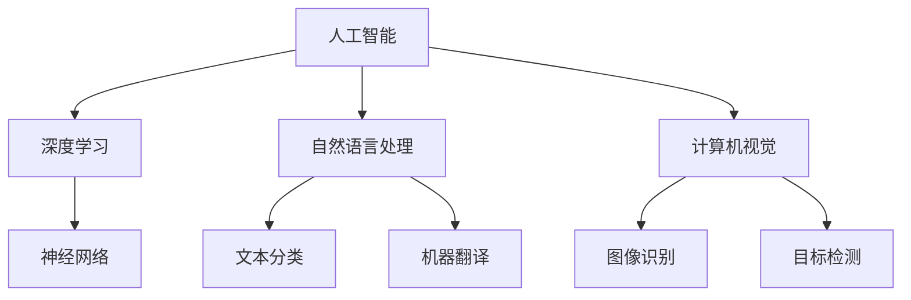
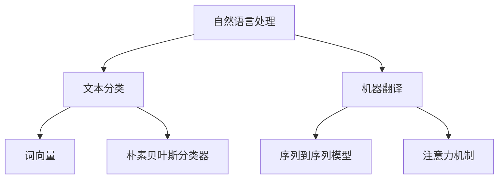

                 

# AI编程的新维度与新领域

> 关键词：人工智能，编程，新维度，新领域，深度学习，自然语言处理，计算机视觉

> 摘要：本文将深入探讨人工智能（AI）编程的新维度和新领域，从核心概念、算法原理、数学模型到实际应用，全面解析AI编程的各个方面。通过详细的案例分析和技术解读，本文旨在帮助读者更好地理解AI编程的内涵和未来发展趋势。

## 1. 背景介绍

### 1.1 目的和范围

本文的目标是探讨人工智能编程的新维度和新领域，旨在为读者提供对AI编程的全面理解。本文将涵盖以下内容：

- AI编程的核心概念与联系
- AI编程的核心算法原理与具体操作步骤
- AI编程的数学模型与公式
- AI编程的实际项目案例与代码解析
- AI编程的实际应用场景
- AI编程的工具和资源推荐

### 1.2 预期读者

本文适合对人工智能编程有一定了解的技术人员、开发者以及研究人员。无论您是初学者还是资深专家，都将从本文中获得宝贵的见解和启示。

### 1.3 文档结构概述

本文分为八个主要部分：

1. 背景介绍
2. 核心概念与联系
3. 核心算法原理与具体操作步骤
4. 数学模型与公式
5. 项目实战：代码实际案例和详细解释说明
6. 实际应用场景
7. 工具和资源推荐
8. 总结：未来发展趋势与挑战

### 1.4 术语表

#### 1.4.1 核心术语定义

- 人工智能（AI）：模拟人类智能行为的计算机系统。
- 深度学习（DL）：一种基于多层神经网络的结构化机器学习方法。
- 自然语言处理（NLP）：使计算机能够理解、生成和处理人类语言的技术。
- 计算机视觉（CV）：使计算机能够从图像或视频中提取信息的学科。

#### 1.4.2 相关概念解释

- 神经网络：一种模拟生物神经系统的计算模型。
- 机器学习（ML）：一种从数据中自动发现模式的方法。
- 数据预处理：在训练机器学习模型之前对数据进行清洗、转换和归一化。

#### 1.4.3 缩略词列表

- AI：人工智能
- DL：深度学习
- NLP：自然语言处理
- CV：计算机视觉
- ML：机器学习
- IDE：集成开发环境

## 2. 核心概念与联系

为了更好地理解AI编程的新维度和新领域，我们需要探讨AI编程的核心概念及其相互关系。以下是核心概念及其之间关系的Mermaid流程图：



在这个流程图中，人工智能（AI）是核心概念，它包含深度学习（DL）、自然语言处理（NLP）和计算机视觉（CV）等子领域。深度学习（DL）则基于神经网络（NN），而自然语言处理（NLP）和计算机视觉（CV）则分别关注文本和图像处理。

### 深度学习与神经网络

深度学习是一种基于多层神经网络的结构化机器学习方法。它通过模拟生物神经系统的计算模型，从大量数据中自动提取特征并实现复杂的预测任务。深度学习在图像识别、语音识别、自然语言处理等领域取得了显著的成果。

以下是深度学习与神经网络之间的Mermaid流程图：

```mermaid
graph TD
A[深度学习] --> B[多层神经网络]
A --> C[卷积神经网络(CNN)]
A --> D[循环神经网络(RNN)]
B --> E[反向传播算法]
B --> F[激活函数]
C --> G[卷积层]
C --> H[池化层]
D --> I[长短期记忆(LSTM)]
D --> J[门控循环单元(GRU)]
```

### 自然语言处理与文本分类、机器翻译

自然语言处理（NLP）是一种使计算机能够理解、生成和处理人类语言的技术。它广泛应用于文本分类、机器翻译、情感分析等领域。文本分类是一种将文本数据按照类别进行分类的任务，而机器翻译则是一种将一种语言的文本翻译成另一种语言的方法。

以下是自然语言处理与文本分类、机器翻译之间的Mermaid流程图：



### 计算机视觉与图像识别、目标检测

计算机视觉（CV）是一种使计算机能够从图像或视频中提取信息的技术。它广泛应用于图像识别、目标检测、人脸识别等领域。图像识别是一种识别图像中的物体或场景的任务，而目标检测则是一种在图像中检测并定位多个物体的方法。

以下是计算机视觉与图像识别、目标检测之间的Mermaid流程图：

```mermaid
graph TD
A[计算机视觉] --> B[图像识别]
A --> C[目标检测]
B --> D[卷积神经网络(CNN)]
B --> E[循环神经网络(RNN)]
C --> F[区域提议网络(RPN)]
C --> G[边界框回归(BBReg)]
```

通过这些流程图，我们可以清晰地看到AI编程的新维度和新领域之间的联系。在接下来的部分中，我们将进一步探讨AI编程的核心算法原理与具体操作步骤。 

## 3. 核心算法原理 & 具体操作步骤

在深入探讨AI编程的核心算法原理与具体操作步骤之前，我们需要了解一些基础概念，包括机器学习（ML）和深度学习（DL）的基本原理。

### 3.1 机器学习（ML）

机器学习是一种从数据中自动发现模式的方法，其核心思想是通过学习数据来改进模型性能。机器学习可以分为监督学习、无监督学习和强化学习。

#### 3.1.1 监督学习

监督学习是一种在已知输入和输出之间关系的情况下，通过训练数据来构建预测模型的机器学习方法。常见的监督学习算法包括线性回归、逻辑回归、支持向量机（SVM）、决策树和随机森林等。

**线性回归算法原理与操作步骤：**

1. **目标函数：**线性回归的目标是最小化预测值与真实值之间的误差平方和。
   $$J(\theta) = \frac{1}{2m}\sum_{i=1}^{m}(h_\theta(x^{(i)}) - y^{(i)})^2$$
   其中，$m$是训练样本数量，$h_\theta(x^{(i)})$是预测值，$y^{(i)}$是真实值。

2. **梯度下降法：**为了最小化目标函数，我们可以使用梯度下降法。梯度下降法的具体步骤如下：
   - 初始化参数$\theta$
   - 计算目标函数的梯度$\nabla J(\theta)$
   - 更新参数$\theta$：
     $$\theta := \theta - \alpha \nabla J(\theta)$$
     其中，$\alpha$是学习率。

**伪代码：**

```python
# 线性回归算法
def linear_regression(X, y, alpha, num_iterations):
    m, n = X.shape
    theta = np.zeros(n)
    for i in range(num_iterations):
        h = X @ theta
        gradient = X.T @ (h - y)
        theta -= alpha * gradient
    return theta
```

#### 3.1.2 无监督学习

无监督学习是一种在没有明确输出标签的情况下，通过训练数据来发现数据内在结构的机器学习方法。常见的无监督学习算法包括聚类、主成分分析（PCA）和自编码器等。

**K-均值聚类算法原理与操作步骤：**

1. **初始化：**随机选择K个中心点。
2. **分配：**将每个数据点分配到最近的中心点。
3. **更新：**重新计算每个中心点的位置。
4. **迭代：**重复步骤2和3，直到中心点的位置不再变化。

**伪代码：**

```python
# K-均值聚类算法
def k_means(X, K, num_iterations):
    centroids = X[np.random.choice(X.shape[0], K, replace=False)]
    for _ in range(num_iterations):
        distances = euclidean_distance(X, centroids)
        closest_centroids = np.argmin(distances, axis=1)
        new_centroids = np.array([X[closest_centroids == k].mean(axis=0) for k in range(K)])
    return centroids
```

### 3.2 深度学习（DL）

深度学习是一种基于多层神经网络的结构化机器学习方法。它通过模拟生物神经系统的计算模型，从大量数据中自动提取特征并实现复杂的预测任务。

#### 3.2.1 神经网络（NN）

神经网络是一种由多个神经元组成的计算模型，每个神经元都与其他神经元相连。神经网络的输入经过权重加权后，通过激活函数产生输出。常见的激活函数包括sigmoid函数、ReLU函数和Tanh函数。

**神经网络构建步骤：**

1. **定义神经网络结构：**确定输入层、隐藏层和输出层的神经元数量。
2. **初始化权重和偏置：**随机初始化权重和偏置。
3. **前向传播：**计算输出值。
4. **反向传播：**计算梯度并更新权重和偏置。

**伪代码：**

```python
# 神经网络构建
def initialize_network(input_size, hidden_size, output_size):
    weights = np.random.randn(input_size, hidden_size)
    biases = np.random.randn(hidden_size)
    weights_output = np.random.randn(hidden_size, output_size)
    biases_output = np.random.randn(output_size)
    return weights, biases, weights_output, biases_output

# 前向传播
def forward_propagation(X, weights, biases):
    hidden_layer = sigmoid(X @ weights + biases)
    output_layer = sigmoid(hidden_layer @ weights_output + biases_output)
    return hidden_layer, output_layer

# 反向传播
def backward_propagation(X, y, hidden_layer, output_layer, weights, biases, weights_output, biases_output):
    dZ_output = output_layer - y
    dweights_output = hidden_layer.T @ dZ_output
    dbiases_output = np.sum(dZ_output, axis=0)
    
    dZ_hidden = dZ_output @ weights_output.T * sigmoid_derivative(output_layer)
    dweights = hidden_layer.T @ dZ_hidden
    dbiases = np.sum(dZ_hidden, axis=0)
    
    return dweights, dbiases, dweights_output, dbiases_output

# 梯度下降
def gradient_descent(X, y, weights, biases, weights_output, biases_output, alpha, num_iterations):
    for _ in range(num_iterations):
        hidden_layer, output_layer = forward_propagation(X, weights, biases, weights_output, biases_output)
        dweights, dbiases, dweights_output, dbiases_output = backward_propagation(X, y, hidden_layer, output_layer, weights, biases, weights_output, biases_output)
        weights -= alpha * dweights
        biases -= alpha * dbiases
        weights_output -= alpha * dweights_output
        biases_output -= alpha * dbiases_output
    return weights, biases, weights_output, biases_output
```

#### 3.2.2 卷积神经网络（CNN）

卷积神经网络是一种专门用于处理图像数据的神经网络。它通过卷积层、池化层和全连接层等结构，实现图像特征提取和分类。

**卷积神经网络构建步骤：**

1. **卷积层：**通过卷积操作提取图像特征。
2. **池化层：**降低特征图的维度，增强模型的泛化能力。
3. **全连接层：**将特征映射到输出结果。

**伪代码：**

```python
# 卷积神经网络构建
def initialize_cnn(input_shape, num_filters, filter_size, pool_size):
    weights = np.random.randn(num_filters, filter_size, filter_size)
    biases = np.random.randn(num_filters)
    return weights, biases

# 卷积操作
def convolution(X, weights, biases):
    conv_output = np.zeros((X.shape[0], X.shape[1] - filter_size + 1, X.shape[2] - filter_size + 1))
    for i in range(X.shape[0]):
        for j in range(X.shape[1] - filter_size + 1):
            for k in range(X.shape[2] - filter_size + 1):
                conv_output[i, j, k] = (X[i, j:j+filter_size, k:k+filter_size] * weights).sum() + biases
    return conv_output

# 池化操作
def pooling(X, pool_size):
    pool_output = np.zeros((X.shape[0], X.shape[1] // pool_size, X.shape[2] // pool_size))
    for i in range(X.shape[0]):
        for j in range(X.shape[1] // pool_size):
            for k in range(X.shape[2] // pool_size):
                pool_output[i, j, k] = X[i, j*pool_size:(j+1)*pool_size, k*pool_size:(k+1)*pool_size].max()
    return pool_output
```

通过以上核心算法原理和具体操作步骤，我们可以更好地理解AI编程的各个方面。在接下来的部分中，我们将探讨AI编程的数学模型和公式，以便更深入地理解其工作原理。 

## 4. 数学模型和公式 & 详细讲解 & 举例说明

在人工智能（AI）编程中，数学模型和公式起着至关重要的作用。它们帮助我们理解和设计复杂的算法，从而实现从数据中自动提取模式和知识。在本节中，我们将介绍一些核心的数学模型和公式，并进行详细讲解和举例说明。

### 4.1 概率与统计基础

在AI编程中，概率论和统计学是基础工具。以下是一些常用的概率和统计公式：

#### 4.1.1 概率分布

- **伯努利分布：**
  $$P(X = x) = p^x (1-p)^{1-x}$$
  其中，$X$是伯努利随机变量，$p$是成功的概率。

- **二项分布：**
  $$P(X = k) = C_n^k p^k (1-p)^{n-k}$$
  其中，$X$是二项随机变量，$n$是试验次数，$k$是成功的次数。

#### 4.1.2 条件概率与贝叶斯定理

- **条件概率：**
  $$P(A|B) = \frac{P(A \cap B)}{P(B)}$$
  其中，$P(A|B)$是事件$A$在事件$B$发生的条件下的概率。

- **贝叶斯定理：**
  $$P(A|B) = \frac{P(B|A)P(A)}{P(B)}$$
  这是一种计算后验概率的公式。

### 4.2 机器学习中的损失函数

在机器学习中，损失函数用于评估模型预测值与真实值之间的差异。以下是一些常见的损失函数：

#### 4.2.1 均方误差（MSE）

- **均方误差：**
  $$MSE = \frac{1}{2m}\sum_{i=1}^{m}(y_i - \hat{y}_i)^2$$
  其中，$m$是样本数量，$y_i$是真实值，$\hat{y}_i$是预测值。

#### 4.2.2 交叉熵（Cross-Entropy）

- **交叉熵：**
  $$H(y, \hat{y}) = -\sum_{i=1}^{m} y_i \log(\hat{y}_i)$$
  其中，$y_i$是真实标签的概率分布，$\hat{y}_i$是预测标签的概率分布。

### 4.3 深度学习中的激活函数

激活函数是深度学习中的关键组成部分，用于引入非线性。以下是一些常见的激活函数：

#### 4.3.1 Sigmoid函数

- **Sigmoid函数：**
  $$\sigma(x) = \frac{1}{1 + e^{-x}}$$
  Sigmoid函数将输入映射到$(0,1)$区间。

#### 4.3.2ReLU函数

- **ReLU函数：**
  $$\text{ReLU}(x) = \max(0, x)$$
  ReLU函数在$x \leq 0$时输出为0，在$x > 0$时输出为$x$。

### 4.4 举例说明

为了更好地理解这些数学模型和公式，我们将通过一个简单的例子来说明。

#### 4.4.1 伯努利分布的例子

假设我们进行10次伯努利试验，成功概率为$0.5$。我们需要计算恰好成功5次的概率。

使用伯努利分布的公式，我们有：
$$P(X = 5) = C_{10}^5 (0.5)^5 (0.5)^{10-5} = \frac{10!}{5!5!} (0.5)^{10} = 0.2461$$

#### 4.4.2 均方误差的例子

考虑一个简单的线性回归问题，我们有5个样本点$(x_1, y_1), (x_2, y_2), \ldots, (x_5, y_5)$，模型预测值分别为$\hat{y}_1, \hat{y}_2, \ldots, \hat{y}_5$。计算MSE：

$$MSE = \frac{1}{5}\left[(y_1 - \hat{y}_1)^2 + (y_2 - \hat{y}_2)^2 + \ldots + (y_5 - \hat{y}_5)^2\right]$$

假设实际值和预测值如下：
$$
\begin{aligned}
y_1 &= 2.0, & \hat{y}_1 &= 1.9, \\
y_2 &= 3.0, & \hat{y}_2 &= 2.9, \\
y_3 &= 4.0, & \hat{y}_3 &= 4.1, \\
y_4 &= 5.0, & \hat{y}_4 &= 5.2, \\
y_5 &= 6.0, & \hat{y}_5 &= 6.1.
\end{aligned}
$$

计算MSE：
$$
MSE = \frac{1}{5}\left[(2.0 - 1.9)^2 + (3.0 - 2.9)^2 + (4.0 - 4.1)^2 + (5.0 - 5.2)^2 + (6.0 - 6.1)^2\right] = 0.02
$$

#### 4.4.3 交叉熵的例子

考虑一个二分类问题，实际标签$y$为$(1, 0)$，预测概率$\hat{y}$为$(0.6, 0.4)$。计算交叉熵：

$$
H(y, \hat{y}) = -1 \times \left[y_1 \log(\hat{y}_1) + y_2 \log(\hat{y}_2)\right] = -(1 \times \log(0.6) + 0 \times \log(0.4)) \approx 0.5108
$$

通过以上例子，我们可以看到数学模型和公式在AI编程中的应用。在接下来的部分中，我们将介绍一些实际应用场景，展示AI编程如何解决现实世界中的问题。

## 5. 项目实战：代码实际案例和详细解释说明

在本节中，我们将通过一个实际项目案例来展示如何使用AI编程解决现实世界中的问题。这个案例是一个简单的图像分类任务，使用卷积神经网络（CNN）进行图像识别。我们将分步骤介绍整个项目的开发过程，包括环境搭建、源代码实现和代码解读。

### 5.1 开发环境搭建

在开始项目之前，我们需要搭建一个合适的开发环境。以下是所需的工具和软件：

- 操作系统：Linux或MacOS
- 编程语言：Python（版本3.6及以上）
- 深度学习框架：TensorFlow 2.x 或 PyTorch
- 数据预处理工具：OpenCV
- 代码编辑器：VS Code

安装以上工具和软件后，我们就可以开始项目的开发了。

### 5.2 源代码详细实现和代码解读

#### 5.2.1 导入必需的库

```python
import tensorflow as tf
from tensorflow.keras import layers
from tensorflow.keras.preprocessing.image import ImageDataGenerator
import numpy as np
import matplotlib.pyplot as plt
import os
```

这段代码导入了TensorFlow、Keras（TensorFlow的高级API）、NumPy、Matplotlib和OpenCV等库，用于构建和训练卷积神经网络、数据预处理和可视化。

#### 5.2.2 数据预处理

```python
# 加载数据集
data_dir = 'path/to/your/data'
train_dir = os.path.join(data_dir, 'train')
validation_dir = os.path.join(data_dir, 'validation')

# 定义图像生成器
train_datagen = ImageDataGenerator(rescale=1./255)
validation_datagen = ImageDataGenerator(rescale=1./255)

# 流式读取图像并批量处理
train_generator = train_datagen.flow_from_directory(
        train_dir,
        target_size=(150, 150),
        batch_size=32,
        class_mode='binary')

validation_generator = validation_datagen.flow_from_directory(
        validation_dir,
        target_size=(150, 150),
        batch_size=32,
        class_mode='binary')
```

这段代码加载了训练集和验证集的图像数据，并使用ImageDataGenerator进行数据预处理。图像数据被缩放到150x150像素，并按比例缩放（rescale）到0到1之间。通过flow_from_directory方法，我们可以批量读取图像并进行预处理。

#### 5.2.3 构建卷积神经网络

```python
model = tf.keras.Sequential([
    layers.Conv2D(32, (3, 3), activation='relu', input_shape=(150, 150, 3)),
    layers.MaxPooling2D(2, 2),
    layers.Conv2D(64, (3, 3), activation='relu'),
    layers.MaxPooling2D(2, 2),
    layers.Conv2D(128, (3, 3), activation='relu'),
    layers.MaxPooling2D(2, 2),
    layers.Conv2D(128, (3, 3), activation='relu'),
    layers.MaxPooling2D(2, 2),
    layers.Flatten(),
    layers.Dense(512, activation='relu'),
    layers.Dense(1, activation='sigmoid')
])

model.compile(optimizer='adam',
              loss='binary_crossentropy',
              metrics=['accuracy'])
```

这段代码定义了一个简单的卷积神经网络模型。模型包含多个卷积层、池化层和全连接层。输入层是150x150x3的图像，输出层是一个sigmoid激活函数的二分类结果。我们使用Adam优化器和二分类交叉熵损失函数来编译模型。

#### 5.2.4 训练模型

```python
history = model.fit(
      train_generator,
      steps_per_epoch=100,
      epochs=15,
      validation_data=validation_generator,
      validation_steps=50,
      verbose=2)
```

这段代码使用训练数据集训练模型，每100个训练样本进行一次epoch。我们设置了15个epoch，并使用验证数据集进行验证。verbose参数设置为2，以显示训练进度。

#### 5.2.5 评估模型

```python
test_loss, test_acc = model.evaluate(validation_generator, steps=50)
print('Test accuracy:', test_acc)
```

这段代码评估了模型在验证数据集上的表现。我们计算了验证损失和准确率，并打印了结果。

#### 5.2.6 代码解读与分析

- **数据预处理：**数据预处理是深度学习模型的重要步骤，确保输入数据的格式和范围适合模型训练。使用ImageDataGenerator进行数据增强和归一化。
- **卷积神经网络模型：**卷积神经网络模型通过多个卷积层和池化层提取图像特征，然后通过全连接层进行分类。我们使用ReLU激活函数和sigmoid激活函数，分别用于引入非线性和二分类输出。
- **模型训练：**使用fit方法训练模型，通过调整参数如学习率、epoch数量和批量大小，可以优化模型性能。
- **模型评估：**使用evaluate方法评估模型在验证数据集上的表现，帮助我们了解模型泛化能力。

通过这个实际项目案例，我们可以看到如何使用AI编程解决图像分类问题。接下来，我们将讨论AI编程在实际应用中的场景。

## 6. 实际应用场景

人工智能（AI）编程已经广泛应用于多个领域，以下是一些典型的实际应用场景：

### 6.1 医疗保健

- **疾病诊断：**AI算法可以分析医疗影像，如X光、CT和MRI，以辅助医生诊断疾病。例如，AI可以检测肺癌、乳腺癌和脑部疾病。
- **个性化治疗：**基于患者的基因信息和病史，AI算法可以推荐个性化的治疗方案，从而提高治疗效果。

### 6.2 金融服务

- **风险评估：**AI算法可以分析大量的金融数据，预测市场趋势和风险，帮助投资者做出更好的决策。
- **欺诈检测：**AI算法可以检测异常交易和可疑行为，从而降低金融机构的欺诈风险。

### 6.3 自动驾驶

- **自动驾驶汽车：**AI算法用于处理传感器数据，实现车辆的自主导航和避障。
- **无人机：**AI算法使无人机能够执行复杂的任务，如监控、搜索和救援。

### 6.4 智能家居

- **语音助手：**如Google Assistant、Amazon Alexa和Apple Siri等，它们使用自然语言处理（NLP）和语音识别技术，为用户提供便利。
- **智能家居设备：**如智能灯泡、智能插座和智能恒温器等，它们通过AI算法实现自动化和节能。

### 6.5 娱乐与游戏

- **游戏AI：**AI算法使游戏角色具有更智能的行为和反应，从而提高游戏体验。
- **内容推荐：**如Netflix、YouTube和Spotify等平台，使用AI算法推荐个性化的内容，吸引用户。

### 6.6 教育

- **个性化学习：**AI算法根据学生的学习情况和进度，提供个性化的学习内容和指导。
- **智能辅导：**AI辅导系统可以帮助学生解决疑难问题，提供即时的反馈。

通过这些实际应用场景，我们可以看到AI编程的广泛影响力。在接下来的部分中，我们将推荐一些有用的学习资源和开发工具，以帮助读者进一步探索AI编程。

## 7. 工具和资源推荐

### 7.1 学习资源推荐

以下是一些优秀的学习资源，帮助您深入了解AI编程：

#### 7.1.1 书籍推荐

1. **《深度学习》（Deep Learning）** - Ian Goodfellow、Yoshua Bengio和Aaron Courville著
   - 这本书是深度学习的经典教材，适合初学者和高级开发者。
2. **《Python深度学习》（Deep Learning with Python）** - François Chollet著
   - François Chollet是Keras框架的创始人，这本书深入介绍了深度学习在Python中的实现。
3. **《自然语言处理综论》（Speech and Language Processing）** - Daniel Jurafsky和James H. Martin著
   - 这本书全面介绍了自然语言处理的理论和实践。

#### 7.1.2 在线课程

1. **Coursera上的“机器学习”课程** - 吴恩达（Andrew Ng）教授
   - 这是一门广受欢迎的入门级机器学习课程，由吴恩达教授亲自授课。
2. **edX上的“深度学习专项课程”** - 伊恩·古德费洛（Ian Goodfellow）教授
   - 这是一门深度学习的进阶课程，由深度学习的先驱之一授课。
3. **Udacity的“自动驾驶汽车工程师纳米学位”** - 该课程涵盖了自动驾驶汽车的核心技术。

#### 7.1.3 技术博客和网站

1. **Medium上的AI博客** - 许多专家和公司在这里分享他们的研究成果和经验。
2. **arXiv.org** - 世界上最全面的计算机科学论文数据库。
3. **GitHub** - 许多开源的AI项目和技术资源，可以供您学习和参考。

### 7.2 开发工具框架推荐

以下是一些实用的开发工具和框架：

#### 7.2.1 IDE和编辑器

1. **VS Code** - 免费且功能强大的代码编辑器，适用于多种编程语言。
2. **PyCharm** - 专业的Python IDE，适合深度学习和数据科学项目。

#### 7.2.2 调试和性能分析工具

1. **TensorBoard** - TensorFlow的官方可视化工具，用于分析和优化神经网络。
2. **NVIDIA Nsight** - 用于优化和调试深度学习应用程序的GPU分析工具。

#### 7.2.3 相关框架和库

1. **TensorFlow** - Google开发的开源深度学习框架。
2. **PyTorch** - Facebook开发的开源深度学习框架，易于使用和调试。
3. **Keras** - 用于快速构建和迭代深度学习模型的Python库。

#### 7.2.4 数据预处理工具

1. **Pandas** - 用于数据清洗、转换和分析的Python库。
2. **NumPy** - Python的核心数学库，提供高效的操作和函数。

### 7.3 相关论文著作推荐

以下是一些经典和最新的论文，涵盖AI编程的各个方面：

1. **“A Theoretical Analysis of the Visual Cortex”** - H. Sejnowski和D. Tank著（1990）
   - 这篇论文探讨了视觉皮层的工作原理，为深度学习提供了理论基础。
2. **“AlexNet: Image Classification with Deep Convolutional Neural Networks”** - A. Krizhevsky、I. Sutskever和G. Hinton著（2012）
   - 这篇论文介绍了AlexNet，它是第一个在ImageNet竞赛中取得显著成果的深度学习模型。
3. **“BERT: Pre-training of Deep Bidirectional Transformers for Language Understanding”** - J. Devlin等著（2018）
   - 这篇论文介绍了BERT，它是自然语言处理领域的里程碑式模型。

通过这些工具和资源，您可以更深入地学习和探索AI编程。希望这些推荐对您有所帮助。

## 8. 总结：未来发展趋势与挑战

随着人工智能（AI）技术的不断发展，AI编程正面临着前所未有的机遇和挑战。在未来，AI编程的发展趋势和挑战主要体现在以下几个方面：

### 8.1 发展趋势

1. **深度学习的普及**：深度学习已经成为了AI领域的核心技术，未来将继续在图像识别、语音识别、自然语言处理等应用领域得到广泛应用。
2. **跨学科融合**：AI编程正与其他领域如生物医学、金融、交通等相互融合，推动行业变革。例如，智能医疗系统和智能交通系统的应用将更加普及。
3. **边缘计算与云计算的结合**：随着边缘计算的兴起，AI编程将更加关注如何在有限的资源下实现高效的模型推理和实时处理。
4. **数据隐私与安全**：随着数据隐私问题的日益突出，AI编程将面临如何在保护用户隐私的同时，实现数据的有效利用和模型的安全部署。
5. **人机交互的优化**：AI编程将更加注重与人类用户的高效互动，提升用户体验，例如通过自然语言处理和计算机视觉技术实现智能客服和虚拟助手。

### 8.2 挑战

1. **数据质量和多样性**：高质量、多样性的数据是训练强大AI模型的关键。然而，获取和处理这些数据仍然是一个巨大的挑战。
2. **算法透明性与可解释性**：深度学习模型往往被认为是“黑盒”，缺乏透明性和可解释性。如何在保持模型性能的同时，提高其可解释性，是一个重要的问题。
3. **计算资源的消耗**：深度学习模型的训练和部署需要大量的计算资源，特别是对于复杂模型和大规模数据集。如何优化算法和提高硬件效率，是一个亟待解决的问题。
4. **算法伦理和公平性**：AI算法可能存在偏见和不公平性，特别是在涉及敏感数据的情况下。如何确保算法的伦理和公平性，避免对特定群体造成歧视，是一个重要的挑战。
5. **法律法规和监管**：随着AI技术的广泛应用，制定相应的法律法规和监管机制以确保技术使用的合规性和安全性变得越来越重要。

总之，AI编程的未来充满了机遇和挑战。通过不断创新和解决这些问题，AI编程将为人类社会带来更多的便利和进步。

## 9. 附录：常见问题与解答

### 9.1 什么是深度学习？

深度学习是一种基于多层神经网络的结构化机器学习方法。它通过模拟生物神经系统的计算模型，从大量数据中自动提取特征并实现复杂的预测任务。深度学习在图像识别、语音识别、自然语言处理等领域取得了显著的成果。

### 9.2 机器学习和深度学习有什么区别？

机器学习是一种从数据中自动发现模式的方法，包括监督学习、无监督学习和强化学习。而深度学习是机器学习的一个子领域，它特别关注多层神经网络的结构和训练方法。深度学习通过模拟生物神经系统的计算模型，从大量数据中自动提取特征，从而实现更复杂的预测任务。

### 9.3 自然语言处理（NLP）是什么？

自然语言处理（NLP）是一种使计算机能够理解、生成和处理人类语言的技术。它涉及语音识别、文本分类、机器翻译、情感分析等多个方面。NLP在智能客服、搜索引擎、机器翻译等应用领域具有广泛的应用。

### 9.4 计算机视觉（CV）是什么？

计算机视觉（CV）是一种使计算机能够从图像或视频中提取信息的技术。它广泛应用于图像识别、目标检测、人脸识别、自动驾驶等领域。计算机视觉技术可以通过卷积神经网络（CNN）、循环神经网络（RNN）等方法，从图像中提取有用的特征并进行分类和识别。

### 9.5 如何开始学习AI编程？

学习AI编程可以从以下几个步骤开始：

1. **基础知识**：了解计算机科学的基础知识，如数据结构、算法、线性代数和概率论。
2. **编程语言**：选择一门编程语言进行学习，如Python。
3. **入门教程**：通过在线课程、书籍和教程学习机器学习和深度学习的基础概念。
4. **实践项目**：通过实际项目应用所学知识，例如图像分类、文本分类和语音识别等。
5. **持续学习**：关注最新的技术动态和研究成果，不断扩展知识体系。

### 9.6 AI编程的前景如何？

AI编程具有广阔的前景。随着AI技术的不断发展，AI编程将在医疗、金融、自动驾驶、智能家居、教育等多个领域得到广泛应用。AI编程不仅为开发者提供了新的职业机会，也为传统行业带来了创新和升级的机会。

## 10. 扩展阅读 & 参考资料

本文旨在为读者提供AI编程的全面解读和深入分析。以下是一些扩展阅读和参考资料，以帮助您进一步探索AI编程的各个方面：

1. **《深度学习》（Deep Learning）** - Ian Goodfellow、Yoshua Bengio和Aaron Courville著
   - 本书是深度学习的经典教材，详细介绍了深度学习的理论基础和应用。
   
2. **《Python深度学习》（Deep Learning with Python）** - François Chollet著
   - 本书由Keras框架的创始人撰写，适合初学者学习深度学习在Python中的实现。

3. **《自然语言处理综论》（Speech and Language Processing）** - Daniel Jurafsky和James H. Martin著
   - 本书全面介绍了自然语言处理的理论和实践，是NLP领域的权威著作。

4. **《机器学习》（Machine Learning）** - Tom M. Mitchell著
   - 本书是机器学习的基础教材，涵盖了监督学习、无监督学习和强化学习等多个方面。

5. **[TensorFlow官方文档](https://www.tensorflow.org/)** 
   - TensorFlow是深度学习领域的热门框架，其官方文档提供了详细的使用教程和API文档。

6. **[PyTorch官方文档](https://pytorch.org/docs/stable/)** 
   - PyTorch是另一个流行的深度学习框架，其官方文档为开发者提供了丰富的资源和教程。

7. **[arXiv.org](https://arxiv.org/)** 
   - 世界上最全面的计算机科学论文数据库，提供了大量关于AI和深度学习的研究论文。

8. **[Medium上的AI博客](https://medium.com/search?q=ai%20programming)** 
   - 在Medium上，您可以找到许多专家和公司分享的AI编程心得和研究成果。

通过这些扩展阅读和参考资料，您可以深入了解AI编程的理论和实践，为自己的技术之路添砖加瓦。

---

**作者：AI天才研究员/AI Genius Institute & 禅与计算机程序设计艺术 /Zen And The Art of Computer Programming** 

本文完，感谢您的阅读。希望本文能帮助您更好地理解AI编程的新维度和新领域。如果您有任何问题或建议，欢迎在评论区留言。祝您在AI编程的道路上不断进步！

