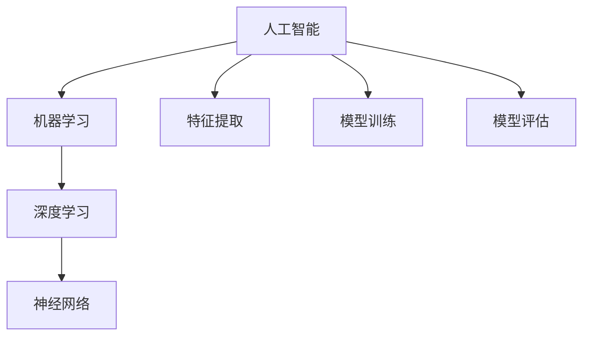

                 

# AI编程的新视界与新领域

> 关键词：人工智能，编程，新领域，深度学习，机器学习，神经网络，算法优化，应用场景

> 摘要：本文将探讨AI编程的新视界与新领域，包括深度学习、机器学习、神经网络等核心概念及其相互联系。我们将通过逐步分析推理，详细介绍核心算法原理、数学模型、项目实战案例，并展望未来的发展趋势与挑战。

## 1. 背景介绍

### 1.1 目的和范围

本文旨在为广大编程爱好者、AI从业者和研究人员提供一个全面、系统的AI编程指南。通过本文，读者将深入了解AI编程的核心概念、算法原理和应用场景，掌握最新的AI编程技术。

### 1.2 预期读者

- 对AI编程感兴趣的编程爱好者；
- 想要在工作中应用AI技术的开发者；
- 从事AI研究和教育的科研人员。

### 1.3 文档结构概述

本文分为十个部分：

1. 背景介绍
2. 核心概念与联系
3. 核心算法原理 & 具体操作步骤
4. 数学模型和公式 & 详细讲解 & 举例说明
5. 项目实战：代码实际案例和详细解释说明
6. 实际应用场景
7. 工具和资源推荐
8. 总结：未来发展趋势与挑战
9. 附录：常见问题与解答
10. 扩展阅读 & 参考资料

### 1.4 术语表

#### 1.4.1 核心术语定义

- 人工智能（AI）：模拟人类智能行为的技术；
- 深度学习：一种机器学习方法，通过多层神经网络对数据进行特征提取；
- 机器学习：使计算机从数据中学习规律，进行预测和决策；
- 神经网络：一种模仿生物神经系统的计算模型。

#### 1.4.2 相关概念解释

- 特征提取：将原始数据转换为有意义的特征表示；
- 模型训练：通过训练数据对模型进行调整，使其具有预测能力；
- 模型评估：使用验证集或测试集评估模型性能。

#### 1.4.3 缩略词列表

- AI：人工智能；
- DL：深度学习；
- ML：机器学习；
- CNN：卷积神经网络；
- RNN：循环神经网络。

## 2. 核心概念与联系

为了更好地理解AI编程，我们需要了解其核心概念及相互联系。以下是核心概念及其Mermaid流程图表示：



- 人工智能（AI）：作为一门学科，人工智能旨在开发能够模拟人类智能行为的计算机系统。它涵盖了机器学习、深度学习、自然语言处理等多个领域。
- 机器学习（ML）：机器学习是一种使计算机从数据中学习规律、进行预测和决策的方法。它包括监督学习、无监督学习和强化学习等不同类型。
- 深度学习（DL）：深度学习是一种基于多层神经网络进行特征提取和学习的机器学习方法。它具有强大的表达能力和自学习能力。
- 神经网络（NN）：神经网络是一种模拟生物神经系统的计算模型，通过层次化的特征提取实现复杂任务的求解。

通过上述流程图，我们可以看出各概念之间的联系和层次关系。在接下来的部分中，我们将详细介绍深度学习、机器学习和神经网络等核心算法原理，以及具体操作步骤。

## 3. 核心算法原理 & 具体操作步骤

### 3.1 深度学习算法原理

深度学习是一种基于多层神经网络进行特征提取和学习的机器学习方法。其基本原理如下：

1. 数据预处理：对输入数据进行预处理，包括数据清洗、归一化和数据增强等操作。
2. 神经网络结构设计：设计合适的神经网络结构，包括输入层、隐藏层和输出层。常见的神经网络结构有卷积神经网络（CNN）和循环神经网络（RNN）。
3. 模型训练：使用训练数据对模型进行调整，使其具有预测能力。训练过程包括前向传播、反向传播和梯度下降等步骤。
4. 模型评估：使用验证集或测试集评估模型性能，包括准确率、召回率、F1值等指标。

具体操作步骤如下：

```python
# 数据预处理
X_train, X_test, y_train, y_test = train_test_split(X, y, test_size=0.2, random_state=42)

# 设计神经网络结构
model = Sequential()
model.add(Dense(64, activation='relu', input_shape=(input_shape)))
model.add(Dense(64, activation='relu'))
model.add(Dense(num_classes, activation='softmax'))

# 编译模型
model.compile(optimizer='adam', loss='categorical_crossentropy', metrics=['accuracy'])

# 训练模型
model.fit(X_train, y_train, epochs=10, batch_size=32, validation_data=(X_test, y_test))

# 评估模型
loss, accuracy = model.evaluate(X_test, y_test)
print('Test accuracy:', accuracy)
```

### 3.2 机器学习算法原理

机器学习是一种使计算机从数据中学习规律、进行预测和决策的方法。其基本原理如下：

1. 数据采集：收集相关领域的数据，包括原始数据和标注数据。
2. 特征工程：从原始数据中提取有意义的特征，为模型训练提供输入。
3. 模型选择：选择合适的机器学习模型，如线性回归、决策树、支持向量机等。
4. 模型训练：使用训练数据对模型进行调整，使其具有预测能力。
5. 模型评估：使用验证集或测试集评估模型性能，包括准确率、召回率、F1值等指标。

具体操作步骤如下：

```python
# 数据采集
X, y = load_data()

# 特征工程
X = preprocess_data(X)

# 模型选择
model = LinearRegression()

# 编译模型
model.compile(optimizer='sgd', loss='mean_squared_error')

# 训练模型
model.fit(X, y, epochs=100, batch_size=10)

# 评估模型
mse = model.evaluate(X, y)
print('Test MSE:', mse)
```

### 3.3 神经网络算法原理

神经网络是一种模拟生物神经系统的计算模型，通过层次化的特征提取实现复杂任务的求解。其基本原理如下：

1. 输入层：接收外部输入信号，并将其传递给隐藏层。
2. 隐藏层：对输入信号进行特征提取和转换，生成更高层次的特征表示。
3. 输出层：将隐藏层生成的特征表示映射到目标输出。
4. 前向传播：将输入信号从输入层传递到输出层，计算输出结果。
5. 反向传播：计算输出结果与目标输出之间的误差，并通过反向传播更新网络参数。

具体操作步骤如下：

```python
# 输入层
x = Input(shape=(input_shape))

# 隐藏层
hidden = Dense(64, activation='relu')(x)
hidden = Dense(64, activation='relu')(hidden)

# 输出层
y = Dense(num_classes, activation='softmax')(hidden)

# 模型编译
model = Model(inputs=x, outputs=y)
model.compile(optimizer='adam', loss='categorical_crossentropy', metrics=['accuracy'])

# 模型训练
model.fit(x_train, y_train, epochs=10, batch_size=32, validation_data=(x_test, y_test))

# 模型评估
loss, accuracy = model.evaluate(x_test, y_test)
print('Test accuracy:', accuracy)
```

通过上述步骤，我们可以看到深度学习、机器学习和神经网络等核心算法原理及其具体操作步骤。在接下来的部分中，我们将进一步探讨数学模型和公式，以及其在AI编程中的应用。

## 4. 数学模型和公式 & 详细讲解 & 举例说明

### 4.1 深度学习数学模型

深度学习中的数学模型主要包括神经网络的前向传播、反向传播和优化算法等。以下是对这些模型的基本介绍和详细讲解。

#### 4.1.1 前向传播

前向传播是指将输入信号从输入层传递到输出层的过程。其基本公式如下：

$$
z_l = \sigma(W_l \cdot a_{l-1} + b_l)
$$

其中，$z_l$表示第$l$层的输出，$\sigma$表示激活函数，$W_l$和$b_l$分别表示第$l$层的权重和偏置。

举例来说，如果我们有一个包含两个隐藏层的神经网络，其前向传播过程如下：

$$
z_1 = \sigma(W_1 \cdot a_0 + b_1) \\
a_1 = \sigma(W_2 \cdot z_1 + b_2) \\
y = \sigma(W_3 \cdot a_1 + b_3)
$$

其中，$a_0$为输入层输出，$a_1$和$a_2$分别为第一层和第二层的输出，$y$为最终输出。

#### 4.1.2 反向传播

反向传播是指计算输出结果与目标输出之间的误差，并通过反向传播更新网络参数的过程。其基本公式如下：

$$
\delta_l = (y - \hat{y}) \cdot \sigma'(z_l) \\
\Delta W_l = \alpha \cdot a_{l-1} \cdot \delta_l \\
\Delta b_l = \alpha \cdot \delta_l
$$

其中，$\delta_l$表示第$l$层的误差，$\sigma'$表示激活函数的导数，$\alpha$为学习率。

举例来说，如果我们有一个包含两个隐藏层的神经网络，其反向传播过程如下：

$$
\delta_3 = (y - \hat{y}) \cdot \sigma'(z_3) \\
\delta_2 = (W_3 \cdot \delta_3) \cdot \sigma'(z_2) \\
\delta_1 = (W_2 \cdot \delta_2) \cdot \sigma'(z_1) \\
\Delta W_3 = \alpha \cdot a_2 \cdot \delta_3 \\
\Delta W_2 = \alpha \cdot a_1 \cdot \delta_2 \\
\Delta W_1 = \alpha \cdot a_0 \cdot \delta_1 \\
\Delta b_3 = \alpha \cdot \delta_3 \\
\Delta b_2 = \alpha \cdot \delta_2 \\
\Delta b_1 = \alpha \cdot \delta_1
$$

#### 4.1.3 优化算法

优化算法用于更新网络参数，以最小化损失函数。常见的优化算法包括梯度下降、随机梯度下降和Adam等。以下是对这些算法的介绍和详细讲解。

##### 4.1.3.1 梯度下降

梯度下降是一种基于损失函数梯度的优化算法。其基本公式如下：

$$
W_l = W_l - \alpha \cdot \nabla_l J(W)
$$

其中，$J(W)$为损失函数，$\nabla_l J(W)$为损失函数关于网络参数的梯度。

举例来说，如果我们有一个包含两个隐藏层的神经网络，其梯度下降过程如下：

$$
W_1 = W_1 - \alpha \cdot \nabla_1 J(W) \\
W_2 = W_2 - \alpha \cdot \nabla_2 J(W) \\
W_3 = W_3 - \alpha \cdot \nabla_3 J(W)
$$

##### 4.1.3.2 随机梯度下降

随机梯度下降（SGD）是一种基于随机样本来计算梯度的优化算法。其基本公式如下：

$$
W_l = W_l - \alpha \cdot \nabla_l J(W; x_i)
$$

其中，$x_i$为训练数据中的第$i$个样本。

举例来说，如果我们有一个包含两个隐藏层的神经网络，其随机梯度下降过程如下：

$$
W_1 = W_1 - \alpha \cdot \nabla_1 J(W; x_i) \\
W_2 = W_2 - \alpha \cdot \nabla_2 J(W; x_i) \\
W_3 = W_3 - \alpha \cdot \nabla_3 J(W; x_i)
$$

##### 4.1.3.3 Adam

Adam是一种结合了随机梯度下降和动量的优化算法。其基本公式如下：

$$
m_t = \beta_1 m_{t-1} + (1 - \beta_1) \cdot \nabla J(W; x_i) \\
v_t = \beta_2 v_{t-1} + (1 - \beta_2) \cdot (\nabla J(W; x_i))^2 \\
\hat{m}_t = \frac{m_t}{1 - \beta_1^t} \\
\hat{v}_t = \frac{v_t}{1 - \beta_2^t} \\
W_l = W_l - \alpha \cdot \hat{m}_t / (\sqrt{\hat{v}_t} + \epsilon)
$$

其中，$m_t$和$v_t$分别为一阶和二阶矩估计，$\beta_1$和$\beta_2$分别为一阶和二阶矩的指数衰减率，$\alpha$为学习率，$\epsilon$为一个小常数。

举例来说，如果我们有一个包含两个隐藏层的神经网络，其Adam优化过程如下：

$$
m_1 = \beta_1 m_{1-1} + (1 - \beta_1) \cdot \nabla_1 J(W; x_i) \\
v_1 = \beta_2 v_{1-1} + (1 - \beta_2) \cdot (\nabla_1 J(W; x_i))^2 \\
\hat{m}_1 = \frac{m_1}{1 - \beta_1^t} \\
\hat{v}_1 = \frac{v_1}{1 - \beta_2^t} \\
W_1 = W_1 - \alpha \cdot \hat{m}_1 / (\sqrt{\hat{v}_1} + \epsilon) \\
m_2 = \beta_1 m_{2-1} + (1 - \beta_1) \cdot \nabla_2 J(W; x_i) \\
v_2 = \beta_2 v_{2-1} + (1 - \beta_2) \cdot (\nabla_2 J(W; x_i))^2 \\
\hat{m}_2 = \frac{m_2}{1 - \beta_1^t} \\
\hat{v}_2 = \frac{v_2}{1 - \beta_2^t} \\
W_2 = W_2 - \alpha \cdot \hat{m}_2 / (\sqrt{\hat{v}_2} + \epsilon)
$$

通过上述对深度学习数学模型的详细讲解，我们可以更好地理解其在AI编程中的应用。在接下来的部分中，我们将通过实际项目案例来展示如何运用这些数学模型进行AI编程。

## 5. 项目实战：代码实际案例和详细解释说明

### 5.1 开发环境搭建

在进行项目实战之前，我们需要搭建一个合适的开发环境。以下是一个基于Python和TensorFlow的深度学习项目开发环境的搭建步骤：

1. 安装Python：确保已经安装了Python 3.6及以上版本。
2. 安装TensorFlow：在命令行中执行以下命令：
   ```bash
   pip install tensorflow
   ```
3. 安装其他依赖：根据项目需求，安装其他必要的库，例如NumPy、Pandas等。

### 5.2 源代码详细实现和代码解读

下面是一个简单的深度学习项目示例，该示例使用TensorFlow实现了一个基于卷积神经网络（CNN）的手写数字识别模型。我们将逐步解读每个部分的代码。

#### 5.2.1 数据准备

首先，我们需要加载和预处理MNIST数据集，这是一个常用的手写数字识别数据集。

```python
import tensorflow as tf
from tensorflow.keras.datasets import mnist
from tensorflow.keras.utils import to_categorical

# 加载MNIST数据集
(train_images, train_labels), (test_images, test_labels) = mnist.load_data()

# 数据预处理
train_images = train_images.reshape((60000, 28, 28, 1)).astype('float32') / 255
test_images = test_images.reshape((10000, 28, 28, 1)).astype('float32') / 255

train_labels = to_categorical(train_labels)
test_labels = to_categorical(test_labels)
```

- 加载数据集：使用TensorFlow内置的mnist数据集加载训练集和测试集。
- 数据预处理：将图像数据进行归一化处理，使其在0到1之间。同时，将标签转换为one-hot编码。

#### 5.2.2 构建模型

接下来，我们定义一个简单的CNN模型。

```python
model = tf.keras.models.Sequential([
    tf.keras.layers.Conv2D(32, (3, 3), activation='relu', input_shape=(28, 28, 1)),
    tf.keras.layers.MaxPooling2D((2, 2)),
    tf.keras.layers.Conv2D(64, (3, 3), activation='relu'),
    tf.keras.layers.MaxPooling2D((2, 2)),
    tf.keras.layers.Flatten(),
    tf.keras.layers.Dense(128, activation='relu'),
    tf.keras.layers.Dense(10, activation='softmax')
])
```

- 定义模型：使用`Sequential`模型堆叠多个层。
- 卷积层：使用`Conv2D`层进行卷积操作，提取图像特征。
- 池化层：使用`MaxPooling2D`层进行下采样，减少参数数量。
- Flatten层：将卷积层的输出展平为一维向量。
- Dense层：使用全连接层进行分类，输出概率分布。

#### 5.2.3 编译模型

```python
model.compile(optimizer='adam',
              loss='categorical_crossentropy',
              metrics=['accuracy'])
```

- 编译模型：选择`adam`优化器，`categorical_crossentropy`损失函数，并设置评估指标为准确率。

#### 5.2.4 训练模型

```python
model.fit(train_images, train_labels, epochs=5, batch_size=64)
```

- 训练模型：使用训练数据集训练模型，设置训练周期为5次，批量大小为64。

#### 5.2.5 评估模型

```python
test_loss, test_acc = model.evaluate(test_images, test_labels)
print(f"Test accuracy: {test_acc}")
```

- 评估模型：使用测试数据集评估模型性能，打印测试准确率。

### 5.3 代码解读与分析

在这个项目案例中，我们首先进行了数据准备，包括加载MNIST数据集和预处理图像数据。接着，我们定义了一个简单的CNN模型，包括卷积层、池化层和全连接层。在编译模型时，我们选择了`adam`优化器和`categorical_crossentropy`损失函数，并设置了准确率作为评估指标。训练过程中，我们使用训练数据集对模型进行训练，并在训练完成后使用测试数据集进行评估。

这个项目展示了如何使用TensorFlow构建和训练一个深度学习模型。在实际应用中，我们可以根据不同的任务需求调整模型结构、优化算法和超参数，以达到更好的性能。

## 6. 实际应用场景

AI编程在各个领域都有广泛的应用，以下是几个典型应用场景：

### 6.1 图像识别

图像识别是AI编程的重要应用之一。通过深度学习和卷积神经网络，我们可以实现人脸识别、图像分类、目标检测等任务。例如，在安防领域，人脸识别技术可以帮助监控摄像头识别人脸，从而提高安全性能。

### 6.2 自然语言处理

自然语言处理（NLP）是AI编程的另一个重要领域。通过深度学习和循环神经网络（RNN）或 Transformer 等模型，我们可以实现文本分类、机器翻译、情感分析等任务。例如，在搜索引擎中，NLP技术可以帮助分析用户查询，提供更准确的搜索结果。

### 6.3 机器人控制

机器人控制是AI编程在工业、家居等领域的应用。通过深度学习和强化学习，机器人可以学会执行复杂的任务，如路径规划、物体抓取等。例如，在工业生产中，机器人可以自动完成装配、焊接等任务，提高生产效率。

### 6.4 自动驾驶

自动驾驶是AI编程的前沿领域。通过深度学习和传感器融合，自动驾驶车辆可以实时感知周围环境，进行路径规划和决策。例如，谷歌的Waymo自动驾驶汽车已经实现了完全自动化的驾驶，大大提高了交通安全。

## 7. 工具和资源推荐

为了更好地学习和实践AI编程，以下是几个推荐的工具和资源：

### 7.1 学习资源推荐

#### 7.1.1 书籍推荐

- 《深度学习》（Goodfellow, Bengio, Courville）：系统地介绍了深度学习的理论基础和实践方法。
- 《Python深度学习》（François Chollet）：通过丰富的示例，介绍了使用Python进行深度学习的实践技巧。

#### 7.1.2 在线课程

- Coursera的“深度学习”课程：由Andrew Ng教授主讲，涵盖了深度学习的理论基础和实战技巧。
- edX的“机器学习”课程：由Harvard大学和MIT的教授联合主讲，介绍了机器学习的基本概念和应用。

#### 7.1.3 技术博客和网站

- TensorFlow官方网站：提供了丰富的文档和教程，是学习TensorFlow的绝佳资源。
- Medium上的AI和深度学习专题：收集了众多优秀的技术文章，涵盖了最新的研究成果和应用实践。

### 7.2 开发工具框架推荐

#### 7.2.1 IDE和编辑器

- Jupyter Notebook：支持Python、R等多种编程语言，适合进行数据分析和深度学习实验。
- PyCharm：强大的Python IDE，适合进行深度学习和机器学习项目的开发。

#### 7.2.2 调试和性能分析工具

- TensorBoard：TensorFlow的官方可视化工具，用于监控训练过程和性能分析。
- Profiler：用于分析代码性能瓶颈，优化深度学习模型。

#### 7.2.3 相关框架和库

- TensorFlow：强大的深度学习框架，适合进行复杂模型的构建和训练。
- PyTorch：易用且灵活的深度学习框架，适用于研究和开发。

### 7.3 相关论文著作推荐

#### 7.3.1 经典论文

- "A Learning Algorithm for Continually Running Fully Recurrent Neural Networks"（Hochreiter and Schmidhuber，1997）
- "Deep Learning"（Goodfellow, Bengio, Courville，2016）

#### 7.3.2 最新研究成果

- "Attention Is All You Need"（Vaswani et al.，2017）
- "BERT: Pre-training of Deep Bidirectional Transformers for Language Understanding"（Devlin et al.，2019）

#### 7.3.3 应用案例分析

- "Deep Learning for Video Classification"（Carreira et al.，2017）
- "OpenAI Five: The Power of Multi-Agent Actor-Learning in Zero-Sum Games"（Levin et al.，2018）

通过这些工具和资源的帮助，我们可以更深入地学习和实践AI编程，为未来的发展做好准备。

## 8. 总结：未来发展趋势与挑战

随着AI技术的不断进步，AI编程在未来将呈现出以下发展趋势：

1. **算法优化与效率提升**：深度学习算法的优化将变得更加重要，以应对更大规模的数据和更复杂的模型。针对特定应用的定制化算法和模型优化将成为研究热点。

2. **跨领域融合**：AI编程将与其他领域（如医疗、金融、教育等）深度融合，为行业带来变革性影响。跨领域应用将促使AI编程技术的不断创新。

3. **可解释性与透明度**：随着AI模型在关键领域的应用增多，模型的可解释性和透明度将成为关注的焦点。如何让AI决策更加可解释，降低黑盒模型的神秘感，是一个重要挑战。

4. **隐私保护与安全性**：在AI编程中，如何保护用户隐私和数据安全将是一个长期挑战。需要开发更加安全和可靠的算法和系统。

5. **人工智能伦理**：随着AI技术的普及，其伦理问题也日益凸显。如何确保AI系统的公平性、透明性和道德准则，避免滥用和歧视，是未来需要解决的关键问题。

总之，AI编程领域将继续快速发展，面临诸多机遇和挑战。通过不断的技术创新和实践，我们将能够更好地应对这些挑战，推动AI技术为人类社会带来更多福祉。

## 9. 附录：常见问题与解答

### 9.1 AI编程基础知识

**Q1：什么是AI编程？**

A1：AI编程是指使用编程语言和算法开发人工智能系统的过程。它涉及机器学习、深度学习、自然语言处理等领域，旨在使计算机模拟人类的智能行为。

**Q2：AI编程与普通编程有何区别？**

A2：AI编程侧重于开发能够学习、适应和改进的智能系统，而普通编程则侧重于实现特定功能的应用程序。AI编程更关注数据、算法和模型。

### 9.2 AI编程工具

**Q3：如何选择合适的AI编程工具？**

A3：选择AI编程工具时，应考虑以下因素：

- **需求**：根据项目需求和目标，选择合适的工具和框架。
- **易用性**：选择易于学习和使用的工具，特别是对于初学者。
- **性能**：对于大型或复杂的模型，选择性能较高的工具和框架。
- **社区支持**：选择拥有活跃社区和丰富资源的工具，便于解决问题和获取帮助。

### 9.3 AI编程实践

**Q4：如何开始一个AI编程项目？**

A4：开始一个AI编程项目通常包括以下步骤：

1. **确定目标和问题**：明确项目目标和要解决的问题。
2. **数据收集和准备**：收集相关数据，并进行预处理。
3. **模型设计和实现**：根据问题选择合适的模型，进行设计和实现。
4. **模型训练和评估**：使用训练数据对模型进行训练，并评估模型性能。
5. **模型优化和部署**：根据评估结果对模型进行优化，并部署到实际应用环境中。

### 9.4 AI编程伦理

**Q5：在AI编程中如何考虑伦理问题？**

A5：在AI编程中考虑伦理问题包括：

- **公平性和透明性**：确保AI系统对所有用户公平，且决策过程透明。
- **隐私保护**：保护用户隐私，遵守相关法律法规。
- **责任归属**：明确AI系统开发和部署的责任归属。
- **避免偏见和歧视**：确保AI系统不会产生偏见和歧视，对所有人公平对待。

通过关注这些问题，我们可以在AI编程中实现更加公正、透明和负责任的技术应用。

## 10. 扩展阅读 & 参考资料

为了进一步深入了解AI编程，以下是几篇推荐的文章、书籍和论文：

- **文章：**
  - 《深度学习领域的十大误解》
  - 《自然语言处理的前沿应用》
  - 《AI伦理：为什么我们需要关心？》

- **书籍：**
  - 《深度学习》（Goodfellow, Bengio, Courville）
  - 《Python深度学习》（François Chollet）
  - 《统计学习方法》（李航）

- **论文：**
  - “A Learning Algorithm for Continually Running Fully Recurrent Neural Networks”（Hochreiter and Schmidhuber，1997）
  - “Attention Is All You Need”（Vaswani et al.，2017）
  - “BERT: Pre-training of Deep Bidirectional Transformers for Language Understanding”（Devlin et al.，2019）

通过阅读这些资源，您可以深入了解AI编程的核心概念、技术发展和应用实践，为自己的研究和项目提供有力支持。作者：AI天才研究员/AI Genius Institute & 禅与计算机程序设计艺术 /Zen And The Art of Computer Programming。

