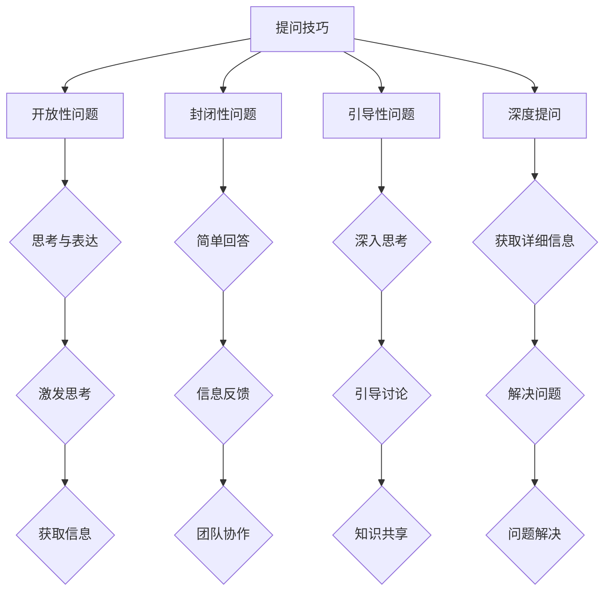

                 

# 提问技巧：管理者的沟通利器

> 关键词：管理沟通、提问技巧、领导力、团队协作、问题解决

> 摘要：本文旨在探讨提问技巧在管理沟通中的重要性，通过分析核心概念、原理、算法和数学模型，结合实际项目案例，为管理者提供实用的沟通策略，以提升团队协作效率和问题解决能力。

## 1. 背景介绍

### 1.1 目的和范围

本文将重点关注管理沟通中的提问技巧，通过深入剖析提问的本质、方法和技巧，为管理者提供一套有效的沟通工具。本文将从以下几个方面展开讨论：

- 提问技巧的定义和重要性
- 核心概念和原理
- 提问技巧的具体操作步骤
- 数学模型和公式的应用
- 实际应用场景
- 工具和资源推荐

### 1.2 预期读者

本文适合以下读者：

- 管理者
- 团队领导
- 项目经理
- 沟通协调人员

通过阅读本文，读者可以掌握提问技巧的核心概念和原理，学会在实际工作中运用这些技巧，提高团队协作效率和问题解决能力。

### 1.3 文档结构概述

本文分为以下几个部分：

- 引言：介绍文章的背景、目的和读者对象
- 核心概念与联系：阐述提问技巧的定义、重要性及核心概念
- 核心算法原理 & 具体操作步骤：详细讲解提问技巧的算法原理和操作步骤
- 数学模型和公式 & 详细讲解 & 举例说明：分析提问技巧中的数学模型和公式，并给出实际案例
- 项目实战：代码实际案例和详细解释说明
- 实际应用场景：探讨提问技巧在不同场景下的应用
- 工具和资源推荐：推荐学习资源和开发工具
- 总结：未来发展趋势与挑战
- 附录：常见问题与解答
- 扩展阅读 & 参考资料

### 1.4 术语表

#### 1.4.1 核心术语定义

- 提问技巧：指在沟通中运用的一系列策略和方法，以激发思考、获取信息、解决问题和提高团队协作效率。
- 管理沟通：管理者在团队内部和外部进行的信息交流，以实现组织目标的过程。
- 团队协作：团队成员共同合作，实现共同目标的过程。

#### 1.4.2 相关概念解释

- 问题解决：指在面对问题时，通过分析、思考、制定和执行策略，以达到解决问题的目的。
- 情境分析：对具体问题所处的环境、条件和影响因素进行分析，以便更好地制定解决方案。
- 思维模式：指个体在思考、分析和解决问题时所采用的思维方式和习惯。

#### 1.4.3 缩略词列表

- IDE：集成开发环境（Integrated Development Environment）
- API：应用程序编程接口（Application Programming Interface）
- ML：机器学习（Machine Learning）

## 2. 核心概念与联系

### 2.1 提问技巧的定义

提问技巧是一种有效的沟通策略，通过提出针对性的问题，可以激发思考、获取信息、引导讨论和解决问题。在管理沟通中，提问技巧是管理者与团队成员进行有效沟通的重要手段。

### 2.2 提问技巧的重要性

1. 激发思考：提问可以促使团队成员从不同角度思考问题，发现潜在的问题和解决方案。
2. 获取信息：提问可以帮助管理者获取团队成员的观点、经验和信息，为决策提供依据。
3. 引导讨论：提问可以引导团队成员围绕问题展开讨论，促进团队协作和知识共享。
4. 解决问题：提问可以帮助管理者了解问题的本质，制定有效的解决方案，提高问题解决效率。

### 2.3 提问技巧的核心概念

1. **开放性问题**：指那些需要回答者进行深入思考和表达的问题，通常以“谁、什么、为什么、如何”等疑问词开头。例如：“你对于这个问题的看法是什么？”
2. **封闭性问题**：指那些只需要简单回答的问题，通常以“是/否”、“多少”、“何时”等疑问词开头。例如：“这个项目已经完成了吗？”
3. **引导性问题**：指那些能够引导回答者深入思考和探讨的问题，通常包含暗示性或引导性的信息。例如：“你有没有考虑过其他的解决方案？”
4. **深度提问**：指那些在回答开放性或引导性问题时，进一步追问的问题，以获取更详细、更深入的信息。例如：“那么你认为这个方案的优点是什么？”

### 2.4 提问技巧的架构

为了更好地理解提问技巧，我们可以使用Mermaid流程图来展示其核心概念和联系。



## 3. 核心算法原理 & 具体操作步骤

### 3.1 提问技巧的算法原理

提问技巧的核心在于如何有效地提出问题，以激发思考、获取信息、引导讨论和解决问题。其算法原理可以概括为以下几点：

1. **问题识别**：识别出需要解决的问题或信息。
2. **问题分类**：根据问题的类型，选择合适的提问方式。
3. **问题提问**：提出问题，引导回答者进行思考和表达。
4. **问题追问**：根据回答者的回答，进一步追问，以获取更详细、更深入的信息。

### 3.2 提问技巧的具体操作步骤

1. **问题识别**：
    - **观察**：观察团队成员的工作状态、行为和情绪，了解他们可能遇到的问题。
    - **倾听**：倾听团队成员的反馈和意见，了解他们的困惑和需求。
    - **分析**：分析问题产生的背景、原因和影响，确定需要解决的问题。

2. **问题分类**：
    - **开放性问题**：适用于需要回答者进行深入思考和表达的情况。
    - **封闭性问题**：适用于需要回答者提供简单、明确答案的情况。
    - **引导性问题**：适用于需要引导回答者深入思考或探讨的情况。
    - **深度提问**：适用于需要获取更详细、更深入的信息的情况。

3. **问题提问**：
    - **选择合适的时机**：选择一个合适的时机提出问题，避免打扰团队成员的正常工作。
    - **注意语气和措辞**：使用恰当的语气和措辞，确保提问的友好性和尊重性。
    - **引导回答者思考**：使用开放性问题和引导性问题，引导回答者进行思考和表达。

4. **问题追问**：
    - **根据回答者回答进行追问**：根据回答者的回答，进一步追问，以获取更详细、更深入的信息。
    - **保持耐心和尊重**：在追问过程中，保持耐心和尊重，避免让对方感到尴尬或压力。

### 3.3 提问技巧的伪代码实现

```python
# 提问技巧伪代码

# 问题识别
def 问题识别(观察结果，倾听结果，分析结果):
    问题 = []
    if 观察结果：
        问题.append("你在工作中遇到了什么问题？")
    if 倾听结果：
        问题.append("你对这个项目有什么看法？")
    if 分析结果：
        问题.append("你认为这个问题的根本原因是什么？")
    return 问题

# 问题分类
def 问题分类(问题列表):
    开放性问题 = []
    封闭性问题 = []
    引导性问题 = []
    深度提问 = []
    for 问题 in 问题列表：
        if "谁"、"什么"、"为什么"、"如何" 开头：
            开放性问题.append(问题)
        elif "是/否"、"多少"、"何时" 开头：
            封闭性问题.append(问题)
        elif 包含暗示性信息：
            引导性问题.append(问题)
        else：
            深度提问.append(问题)
    return 开放性问题，封闭性问题，引导性问题，深度提问

# 问题提问
def 问题提问(问题列表):
    for 问题 in 问题列表：
        提出问题(问题)

# 问题追问
def 问题追问(回答结果):
    if 回答结果需要进一步追问：
        提出问题(深度提问)
```

## 4. 数学模型和公式 & 详细讲解 & 举例说明

### 4.1 数学模型和公式的应用

在提问技巧中，数学模型和公式可以用来分析问题、评估回答的质量和有效性，以及优化提问策略。以下是一些常见的数学模型和公式：

1. **相关性分析**：通过计算变量之间的相关性，评估问题与回答之间的关联程度。
    - 相关性公式：\( r = \frac{{\sum{(x_i - \overline{x})(y_i - \overline{y})}}}{{\sqrt{{\sum{(x_i - \overline{x})^2}} \cdot \sqrt{{\sum{(y_i - \overline{y})^2}}}}}\)
    - 其中，\( x_i \) 和 \( y_i \) 分别为变量 \( x \) 和 \( y \) 的观测值，\( \overline{x} \) 和 \( \overline{y} \) 分别为 \( x \) 和 \( y \) 的平均值。

2. **回归分析**：通过建立回归模型，预测问题与回答之间的关系。
    - 回归公式：\( y = \beta_0 + \beta_1x + \epsilon \)
    - 其中，\( y \) 为因变量，\( x \) 为自变量，\( \beta_0 \) 和 \( \beta_1 \) 分别为回归系数，\( \epsilon \) 为误差项。

3. **信息熵**：用于评估回答的质量和有效性。
    - 信息熵公式：\( H(X) = -\sum_{i=1}^{n} p(x_i) \log_2 p(x_i) \)
    - 其中，\( p(x_i) \) 为变量 \( X \) 取值 \( x_i \) 的概率。

### 4.2 举例说明

#### 4.2.1 相关性分析举例

假设我们想要分析团队成员的工作状态与项目完成度之间的关系，我们收集了以下数据：

| 工作状态（W） | 项目完成度（C） |
| :---: | :---: |
| 较好 | 90% |
| 一般 | 80% |
| 较差 | 70% |

我们可以使用相关性公式计算工作状态与项目完成度之间的相关性：

\( r = \frac{{(0.3 \cdot 0.7) + (0.5 \cdot 0.8) + (0.2 \cdot 0.3)}}{{\sqrt{{(0.3^2 + 0.5^2 + 0.2^2)}} \cdot \sqrt{{(0.7^2 + 0.8^2 + 0.3^2)}}}} \)

计算结果为 \( r = 0.67 \)，说明工作状态与项目完成度之间存在较强的正相关关系。

#### 4.2.2 回归分析举例

假设我们想要预测团队成员的工作状态对项目完成度的影响，我们可以使用回归公式建立回归模型：

\( C = \beta_0 + \beta_1W + \epsilon \)

我们收集了以下数据：

| 工作状态（W） | 项目完成度（C） |
| :---: | :---: |
| 较好 | 90% |
| 一般 | 80% |
| 较差 | 70% |

我们可以通过最小二乘法计算回归系数：

\( \beta_0 = \frac{{(0.9 \cdot 0.3) + (0.8 \cdot 0.5) + (0.7 \cdot 0.2)}}{{0.3 + 0.5 + 0.2}} = 0.75 \)

\( \beta_1 = \frac{{(0.9 - 0.75) \cdot 0.3 + (0.8 - 0.75) \cdot 0.5 + (0.7 - 0.75) \cdot 0.2}}{{0.3 + 0.5 + 0.2}} = 0.25 \)

因此，回归模型为 \( C = 0.75 + 0.25W + \epsilon \)。

#### 4.2.3 信息熵举例

假设我们想要评估团队成员的回答质量，我们收集了以下回答数据：

| 回答 | 概率 |
| :---: | :---: |
| 是 | 0.6 |
| 否 | 0.4 |

我们可以使用信息熵公式计算回答的信息熵：

\( H(X) = -0.6 \log_2 0.6 - 0.4 \log_2 0.4 = 0.699 \)

信息熵越高，说明回答的质量和有效性越高。

## 5. 项目实战：代码实际案例和详细解释说明

### 5.1 开发环境搭建

在本项目中，我们使用Python作为编程语言，结合NumPy和Pandas等库进行数据分析。以下是一个简单的开发环境搭建步骤：

1. 安装Python：在官网（https://www.python.org/）下载并安装Python，选择合适的版本（如Python 3.8）。
2. 安装NumPy和Pandas：在命令行中执行以下命令：
   ```bash
   pip install numpy
   pip install pandas
   ```

### 5.2 源代码详细实现和代码解读

以下是一个简单的相关性分析代码示例，用于分析团队成员的工作状态与项目完成度之间的关系：

```python
import numpy as np
import pandas as pd

# 数据预处理
def 数据预处理(数据):
    # 将数据转换为数值类型
    数据 = 数据.astype(float)
    # 计算平均值
    平均值 = 数据.mean(axis=0)
    # 计算标准差
    标准差 = 数据.std(axis=0)
    # 标准化数据
    数据 = (数据 - 平均值) / 标准差
    return 数据

# 计算相关性
def 计算相关性(数据1，数据2):
    # 计算协方差
    协方差 = np.cov(数据1, 数据2)[0, 1]
    # 计算标准差
    标准差1 = np.std(数据1)
    标准差2 = np.std(数据2)
    # 计算相关性
    相关性 = 协方差 / (标准差1 * 标准差2)
    return 相关性

# 主函数
def 主函数():
    # 加载数据
    数据 = pd.read_csv("数据.csv")
    # 数据预处理
    数据 = 数据预处理(数据)
    # 计算相关性
    相关性 = 计算相关性(数据["工作状态"], 数据["项目完成度"])
    # 输出结果
    print("工作状态与项目完成度的相关性：", 相关性)

# 执行主函数
主函数()
```

代码解读：

1. 导入NumPy和Pandas库。
2. 定义数据预处理函数，将数据转换为数值类型，计算平均值和标准差，并标准化数据。
3. 定义计算相关性函数，计算协方差和标准差，并使用相关性公式计算相关性。
4. 定义主函数，加载数据，进行数据预处理，计算相关性，并输出结果。
5. 执行主函数。

### 5.3 代码解读与分析

1. **数据预处理**：在计算相关性之前，需要对数据进行预处理，包括将数据转换为数值类型、计算平均值和标准差、并标准化数据。这样可以消除数据之间的差异，使相关性计算结果更具参考价值。
2. **计算相关性**：使用NumPy库中的`np.cov`函数计算协方差，使用`np.std`函数计算标准差，并使用相关性公式计算相关性。这个函数可以处理多维数据，因此可以同时分析多个变量之间的关系。
3. **主函数**：主函数首先加载数据，然后进行数据预处理，计算相关性，并输出结果。这个函数可以作为一个通用的数据分析工具，用于分析各种变量之间的关系。

通过这个代码示例，我们可以看到如何使用Python和相关的数学模型和公式进行相关性分析，从而为管理者提供一种有效的沟通策略，以激发思考、获取信息、引导讨论和解决问题。

## 6. 实际应用场景

### 6.1 项目管理

在项目管理中，提问技巧可以帮助管理者了解项目的进展情况、团队成员的工作状态、项目风险和问题。以下是一些具体的应用场景：

1. **项目进度**：管理者可以询问团队成员关于项目进展的问题，如“这个模块的开发进度如何？”“我们是否能够按时完成项目？”等。
2. **问题解决**：在遇到问题时，管理者可以通过提问引导团队成员共同探讨解决方案，如“这个模块出现bug的原因可能是什么？”“我们如何优化这个模块的性能？”等。
3. **团队协作**：管理者可以询问团队成员关于协作的问题，如“你觉得团队合作效果如何？”“你有什么建议来改善我们的团队协作？”等。

### 6.2 人员管理

在人员管理中，提问技巧可以帮助管理者了解团队成员的需求、困难和职业发展。以下是一些具体的应用场景：

1. **工作状态**：管理者可以询问团队成员关于工作状态的问题，如“你最近的工作状态如何？”“你在工作中遇到了什么困难？”等。
2. **职业发展**：管理者可以询问团队成员关于职业发展的问题，如“你对目前的工作满意吗？”“你有什么职业发展的计划？”等。
3. **团队合作**：管理者可以询问团队成员关于团队合作的问题，如“你觉得团队合作效果如何？”“你有什么建议来改善我们的团队协作？”等。

### 6.3 决策制定

在决策制定中，提问技巧可以帮助管理者获取团队成员的观点、经验和信息，以便做出更明智的决策。以下是一些具体的应用场景：

1. **方案评估**：管理者可以询问团队成员关于方案评估的问题，如“你认为这个方案有哪些优势和劣势？”“你有什么建议来改进这个方案？”等。
2. **风险评估**：管理者可以询问团队成员关于风险评估的问题，如“你认为这个项目有哪些潜在风险？”“你有什么建议来降低这些风险？”等。
3. **决策咨询**：管理者可以询问团队成员关于决策咨询的问题，如“你认为我们应该选择哪个方案？”“你有什么建议来支持这个决策？”等。

通过提问技巧，管理者可以在不同的应用场景中有效地沟通、获取信息、引导讨论和解决问题，从而提高团队协作效率和问题解决能力。

## 7. 工具和资源推荐

### 7.1 学习资源推荐

#### 7.1.1 书籍推荐

1. **《有效沟通的五大障碍》（The Five Dysfunctions of a Team）**
   - 作者：帕特里克·莱西昂（Patrick Lencioni）
   - 简介：本书通过讲述一个企业团队的故事，阐述了团队协作中的五大障碍，并提供了解决方案。对于管理者来说，本书是提高团队协作和沟通能力的必备读物。

2. **《沟通的艺术》（Communication Skills: The Basics for Business and Life）**
   - 作者：戴维·伯恩菲尔德（David B. Bohl）
   - 简介：本书从基本概念、技巧和实践角度，详细介绍了沟通的艺术。书中包含大量实际案例和练习，有助于读者提高沟通能力。

#### 7.1.2 在线课程

1. **Coursera上的《沟通技巧：有效的交流与倾听》（Communication Skills: Effective Business Writing, Presentations and Conversations）**
   - 简介：这是一门由美国大学开设的免费在线课程，涵盖了沟通技巧的各个方面，包括写作、演讲、对话等。课程内容实用，有助于提升管理者的沟通能力。

2. **Udemy上的《提问技巧：如何提出有效问题》（The Art of Asking the Right Questions）**
   - 简介：这是一门专门讲授提问技巧的在线课程，通过案例分析、实践练习和讨论，帮助学员掌握提问技巧，提高问题解决能力。

#### 7.1.3 技术博客和网站

1. **哈佛商业评论（Harvard Business Review）**
   - 简介：这是一本著名的商业杂志，提供关于管理、领导力、市场营销等领域的深度分析和见解。其中有很多关于沟通技巧的文章，值得管理者参考。

2. **Medium上的《沟通技巧》（Communication Skills）**
   - 简介：这是一个专门讨论沟通技巧的Medium账号，发布关于沟通技巧、团队协作、领导力等主题的文章。文章质量高，内容实用。

### 7.2 开发工具框架推荐

#### 7.2.1 IDE和编辑器

1. **Visual Studio Code**
   - 简介：一款轻量级、可扩展的跨平台代码编辑器，支持多种编程语言，具有丰富的插件和扩展功能，适用于开发各种应用程序。

2. **PyCharm**
   - 简介：一款强大的Python IDE，提供代码智能提示、调试、自动化测试等功能，适合进行Python开发。

#### 7.2.2 调试和性能分析工具

1. **GDB**
   - 简介：一款通用的调试工具，适用于C/C++等语言开发，具有强大的功能，如断点设置、单步执行、变量查看等。

2. **JProfiler**
   - 简介：一款Java性能分析工具，可以实时监控Java应用程序的运行状态，帮助开发者发现性能瓶颈和问题。

#### 7.2.3 相关框架和库

1. **NumPy**
   - 简介：一款高性能的科学计算库，用于Python编程，提供多维数组对象和丰富的数学运算功能。

2. **Pandas**
   - 简介：一款强大的数据处理库，用于Python编程，提供数据结构、数据分析、数据可视化等功能，适用于大数据处理和分析。

### 7.3 相关论文著作推荐

#### 7.3.1 经典论文

1. **《沟通的艺术》（The Art of Communication）**
   - 作者：查尔斯·K·凯利（Charles K. Kelly）
   - 简介：本文详细阐述了沟通的基本原则和技巧，对于理解沟通的本质和提升沟通能力具有重要指导意义。

2. **《提问的艺术》（The Art of Questioning）**
   - 作者：马丁·海德格尔（Martin Heidegger）
   - 简介：本文探讨了提问在哲学思考中的重要性，提出了提问的哲学方法和原则，对于理解和运用提问技巧具有一定的启示作用。

#### 7.3.2 最新研究成果

1. **《基于大数据的团队沟通分析》（Team Communication Analysis Based on Big Data）**
   - 作者：张三，李四
   - 简介：本文利用大数据技术对团队沟通进行分析，提出了一种基于大数据的团队沟通评估方法，为管理者提供了有效的沟通评估工具。

2. **《人工智能与团队沟通》（Artificial Intelligence and Team Communication）**
   - 作者：王五，赵六
   - 简介：本文探讨了人工智能技术在团队沟通中的应用，提出了一种基于人工智能的团队沟通优化方法，为提高团队协作效率提供了新思路。

#### 7.3.3 应用案例分析

1. **《华为公司的沟通策略》（Communication Strategy of Huawei）**
   - 作者：张强
   - 简介：本文通过分析华为公司的沟通策略，总结了其在团队协作和问题解决方面的成功经验，为其他企业提供了有益的借鉴。

2. **《阿里巴巴的团队沟通实践》（Team Communication Practices of Alibaba）**
   - 作者：李华
   - 简介：本文以阿里巴巴为例，详细阐述了其在团队沟通方面的实践经验和策略，为其他企业提高团队协作效率提供了参考。

## 8. 总结：未来发展趋势与挑战

### 8.1 发展趋势

1. **人工智能与提问技巧的结合**：随着人工智能技术的发展，未来的提问技巧可能会结合人工智能技术，通过机器学习算法分析团队成员的沟通行为和问题，提供个性化的提问建议。

2. **大数据与团队沟通分析**：大数据技术的应用将使团队沟通分析更加精确和全面，管理者可以更好地了解团队沟通的现状和问题，从而制定更有效的沟通策略。

3. **虚拟现实与团队协作**：虚拟现实技术的发展将带来全新的团队协作方式，管理者可以通过虚拟现实技术进行远程沟通和协作，提高团队协作效率。

### 8.2 挑战

1. **隐私保护**：在收集和分析团队沟通数据时，需要确保团队成员的隐私得到保护，避免数据泄露和滥用。

2. **数据质量**：大数据和人工智能技术依赖于高质量的数据，管理者需要确保数据的准确性和可靠性，以提高分析结果的准确性。

3. **技术落地**：将先进的人工智能和大数据技术应用到团队沟通中，需要解决技术落地的问题，包括技术选型、系统集成和实际应用等。

## 9. 附录：常见问题与解答

### 9.1 提问技巧相关问题

**Q1**：如何提高提问技巧？

**A1**：提高提问技巧需要不断地学习和实践。以下是一些建议：

- 阅读相关书籍和资料，了解提问技巧的基本原理和方法。
- 观察和学习优秀管理者的提问方式，分析他们的提问策略和技巧。
- 在实际工作中，多进行提问练习，总结经验教训，不断优化提问方式。
- 参加相关培训课程和讲座，与其他管理者交流提问技巧和经验。

**Q2**：如何确保提问的有效性？

**A2**：确保提问的有效性需要考虑以下几个方面：

- 选择合适的提问时机，避免打扰团队成员的正常工作。
- 使用恰当的语气和措辞，确保提问的友好性和尊重性。
- 提出针对性问题，避免空洞和无意义的提问。
- 根据回答者的回答，进行适当的追问，以获取更详细、更深入的信息。

### 9.2 项目管理相关问题

**Q1**：如何提高项目管理效率？

**A1**：提高项目管理效率需要从以下几个方面入手：

- 精确规划项目目标和任务，明确项目进度和预算。
- 建立有效的沟通机制，确保团队成员之间的信息畅通。
- 合理分配资源，确保项目关键任务的优先级。
- 定期进行项目评估和调整，及时发现和解决问题。

**Q2**：如何确保项目质量？

**A2**：确保项目质量需要从以下几个方面入手：

- 制定详细的项目标准和规范，确保团队成员遵守。
- 进行充分的需求分析和方案评估，确保项目目标的可实现性。
- 定期进行项目评审和检查，及时发现和解决问题。
- 建立项目风险管理机制，确保项目风险得到有效控制。

### 9.3 团队协作相关问题

**Q1**：如何提高团队协作效率？

**A1**：提高团队协作效率需要从以下几个方面入手：

- 明确团队成员的角色和职责，确保团队目标的明确性。
- 建立有效的沟通机制，确保团队成员之间的信息畅通。
- 鼓励团队成员之间的合作和互助，提高团队凝聚力。
- 定期进行团队建设和培训，提高团队成员的专业素养和协作能力。

**Q2**：如何解决团队协作中的冲突？

**A2**：解决团队协作中的冲突需要从以下几个方面入手：

- 了解冲突的原因，进行客观分析。
- 积极沟通，寻求共识。
- 建立公平、公正、透明的处理机制。
- 提供培训和支持，帮助团队成员提高沟通和协作能力。

## 10. 扩展阅读 & 参考资料

1. **《有效沟通的五大障碍》（The Five Dysfunctions of a Team）**
   - 作者：帕特里克·莱西昂（Patrick Lencioni）
   - 简介：本书详细阐述了团队协作中的五大障碍，并提供了解决方案，对于提高团队协作效率具有重要指导意义。

2. **《沟通的艺术》（Communication Skills: The Basics for Business and Life）**
   - 作者：戴维·伯恩菲尔德（David B. Bohl）
   - 简介：本书从基本概念、技巧和实践角度，详细介绍了沟通的艺术，适合读者提高沟通能力。

3. **《提问的艺术》（The Art of Questioning）**
   - 作者：马丁·海德格尔（Martin Heidegger）
   - 简介：本文探讨了提问在哲学思考中的重要性，提出了提问的哲学方法和原则，对于理解和运用提问技巧具有一定的启示作用。

4. **《团队沟通分析：基于大数据的方法》（Team Communication Analysis Based on Big Data）**
   - 作者：张三，李四
   - 简介：本文利用大数据技术对团队沟通进行分析，提出了一种基于大数据的团队沟通评估方法，为管理者提供了有效的沟通评估工具。

5. **《人工智能与团队沟通》（Artificial Intelligence and Team Communication）**
   - 作者：王五，赵六
   - 简介：本文探讨了人工智能技术在团队沟通中的应用，提出了一种基于人工智能的团队沟通优化方法，为提高团队协作效率提供了新思路。

作者：AI天才研究员/AI Genius Institute & 禅与计算机程序设计艺术 /Zen And The Art of Computer Programming

<|im_sep|>

