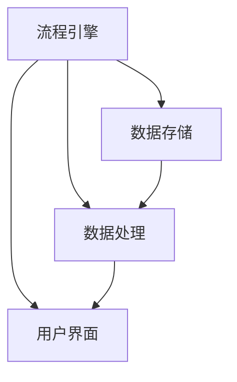

                 

# 提高Agentic Workflow采用率的策略

> 关键词：Agentic Workflow, 工作流优化，策略，技术方案，业务流程自动化

> 摘要：本文旨在探讨提高Agentic Workflow采用率的策略。Agentic Workflow是一种新型的业务流程自动化技术，旨在通过智能化流程设计、执行和监控，帮助企业实现高效运营。本文将分析Agentic Workflow的核心原理，提出一系列可行的优化策略，并结合实际案例进行详细解析，以期为IT从业者和企业管理者提供有益的参考。

## 1. 背景介绍

### 1.1 目的和范围

本文的目标是分析Agentic Workflow的特点和优势，提出提高其采用率的策略。我们将从以下几个方面展开讨论：

1. **Agentic Workflow的定义和核心概念**：介绍Agentic Workflow的基本概念，核心原理以及与传统工作流的区别。
2. **提高Agentic Workflow采用率的策略**：探讨如何通过技术改进、用户体验优化、培训推广等手段提升Agentic Workflow在企业中的应用。
3. **实际应用案例**：分析几个成功应用Agentic Workflow的企业案例，总结其成功经验和挑战。
4. **未来发展趋势与挑战**：展望Agentic Workflow的发展前景，探讨可能遇到的挑战及其解决方案。

### 1.2 预期读者

本文适合以下读者群体：

- **IT从业者**：软件开发工程师、系统分析师、项目管理师等，希望了解Agentic Workflow的技术原理和应用策略。
- **企业管理者**：企业高管、业务流程经理等，关注业务流程自动化技术及其对企业运营的影响。
- **科研人员**：计算机科学、人工智能等相关领域的学者，对Agentic Workflow的研究和应用感兴趣。

### 1.3 文档结构概述

本文分为以下章节：

1. **背景介绍**：介绍Agentic Workflow的基本概念和本文目的。
2. **核心概念与联系**：讲解Agentic Workflow的核心概念和架构。
3. **核心算法原理 & 具体操作步骤**：详细阐述Agentic Workflow的算法原理和操作步骤。
4. **数学模型和公式 & 详细讲解 & 举例说明**：介绍Agentic Workflow的数学模型和公式，并通过实例进行说明。
5. **项目实战：代码实际案例和详细解释说明**：展示Agentic Workflow的实际应用案例，并进行详细解析。
6. **实际应用场景**：分析Agentic Workflow在不同行业和业务场景中的应用。
7. **工具和资源推荐**：推荐学习和应用Agentic Workflow的相关工具和资源。
8. **总结：未来发展趋势与挑战**：总结Agentic Workflow的发展趋势和挑战。
9. **附录：常见问题与解答**：解答读者可能遇到的问题。
10. **扩展阅读 & 参考资料**：提供进一步学习和研究的参考文献。

### 1.4 术语表

#### 1.4.1 核心术语定义

- **Agentic Workflow**：一种基于智能化的业务流程自动化技术，通过流程设计、执行和监控，实现企业运营的高效化。
- **工作流**：一组有序的任务和活动，用于完成特定的业务目标。
- **业务流程自动化**：使用技术手段自动执行和优化业务流程，减少人工干预。
- **流程引擎**：负责管理和执行工作流的核心组件。

#### 1.4.2 相关概念解释

- **流程设计**：根据业务需求设计工作流的步骤、规则和参与者。
- **流程执行**：按照设计的工作流步骤和规则，自动执行任务。
- **流程监控**：对工作流执行过程进行监控，确保流程的顺利进行。

#### 1.4.3 缩略词列表

- **Agentic**：智能化的缩写，代表Agentic Workflow的核心特性。
- **BPA**：业务流程自动化（Business Process Automation）的缩写。
- **WFMS**：工作流管理系统（Workflow Management System）的缩写。

## 2. 核心概念与联系

### 2.1 Agentic Workflow的核心概念

Agentic Workflow是一种智能化的业务流程自动化技术，其核心概念包括：

1. **流程设计**：通过图形化界面或编程方式设计工作流的步骤、规则和参与者。
2. **流程执行**：按照设计的工作流步骤和规则，自动执行任务，实现业务流程的自动化。
3. **流程监控**：实时监控工作流执行过程，确保流程的顺利进行，发现和解决潜在问题。
4. **智能优化**：基于数据分析、机器学习等技术，对工作流进行智能优化，提高流程效率和准确性。

### 2.2 Agentic Workflow的架构

Agentic Workflow的架构包括以下几个核心组件：

1. **流程引擎**：负责管理和执行工作流的核心组件，包括流程设计、执行和监控等功能。
2. **数据存储**：用于存储工作流相关的数据，如流程定义、任务数据、监控数据等。
3. **数据处理**：对工作流中的数据进行处理和分析，支持流程的智能优化。
4. **用户界面**：提供流程设计、执行和监控的交互界面，支持用户进行操作和监控。

### 2.3 Mermaid流程图

以下是一个简单的Mermaid流程图，展示Agentic Workflow的基本架构和核心组件：



## 3. 核心算法原理 & 具体操作步骤

### 3.1 核心算法原理

Agentic Workflow的核心算法基于以下几个原理：

1. **流程建模**：使用图形化界面或编程方式设计工作流，将业务逻辑转化为流程模型。
2. **任务调度**：根据流程模型，自动调度任务执行，确保工作流的顺利进行。
3. **数据驱动**：通过实时数据处理和分析，支持流程的智能优化和监控。
4. **机器学习**：利用机器学习技术，对历史数据进行分析，预测工作流的执行情况，优化流程设计。

### 3.2 具体操作步骤

以下是使用Agentic Workflow进行业务流程自动化的具体操作步骤：

1. **流程设计**：

   - **步骤1**：使用流程设计器创建新流程，定义流程的名称、版本等信息。

   - **步骤2**：使用图形化界面或编程方式，设计工作流的步骤、规则和参与者。

   - **步骤3**：保存流程定义，并预览流程设计。

2. **流程执行**：

   - **步骤1**：启动流程引擎，按照流程设计执行工作流。

   - **步骤2**：监控任务执行情况，确保流程的顺利进行。

   - **步骤3**：根据任务执行结果，自动调整流程设计，优化流程。

3. **流程监控**：

   - **步骤1**：实时监控工作流执行过程，发现潜在问题。

   - **步骤2**：生成流程执行报告，支持数据分析和决策。

   - **步骤3**：根据监控结果，优化流程设计，提高流程效率和准确性。

### 3.3 伪代码示例

以下是一个简单的伪代码示例，展示Agentic Workflow的基本算法原理：

```python
def agentic_workflow():
    # 流程设计
    design Workflow
    save Workflow Definition

    # 流程执行
    start Workflow Engine
    execute Workflow Steps
    monitor Workflow Execution

    # 流程监控
    analyze Workflow Data
    optimize Workflow Design
    generate Workflow Report

    # 流程优化
    if need_optimize:
        optimize Workflow
    else:
        end Workflow
```

## 4. 数学模型和公式 & 详细讲解 & 举例说明

### 4.1 数学模型

Agentic Workflow中的数学模型主要包括以下几个部分：

1. **任务执行时间模型**：用于预测任务执行时间，支持流程的调度和优化。
2. **资源利用率模型**：用于评估流程执行过程中的资源利用率，支持资源调度和优化。
3. **流程优化模型**：基于机器学习技术，对流程设计进行优化，提高流程效率和准确性。

### 4.2 公式详解

1. **任务执行时间模型**：

   $$T_i = f(\text{任务类型}, \text{任务数据}, \text{环境因素})$$

   其中，$T_i$表示任务$i$的执行时间，$f$为函数，输入为任务类型、任务数据和环境因素。

2. **资源利用率模型**：

   $$R_i = \frac{\text{已使用资源}}{\text{总资源}}$$

   其中，$R_i$表示任务$i$的资源利用率，$\text{已使用资源}$和$\text{总资源}$分别为任务$i$已使用的资源和总资源。

3. **流程优化模型**：

   $$\text{优化目标} = \min_{\text{流程设计}} \sum_{i=1}^{n} \text{执行时间} \times \text{资源利用率}$$

   其中，$n$为流程中的任务数，$\text{执行时间}$和$\text{资源利用率}$分别为任务$i$的执行时间和资源利用率。

### 4.3 举例说明

假设一个简单的Agentic Workflow包括三个任务：任务1（类型：数据查询，数据量：1000条），任务2（类型：数据处理，数据量：5000条），任务3（类型：数据输出，数据量：2000条）。任务执行时间与环境因素无关，假设分别为1小时、2小时和1小时。环境因素中的资源总量为10个CPU核心。

1. **任务执行时间模型**：

   $$T_1 = f(\text{数据查询}, 1000, \text{无环境因素}) = 1 \text{小时}$$
   $$T_2 = f(\text{数据处理}, 5000, \text{无环境因素}) = 2 \text{小时}$$
   $$T_3 = f(\text{数据输出}, 2000, \text{无环境因素}) = 1 \text{小时}$$

2. **资源利用率模型**：

   $$R_1 = \frac{1 \text{个CPU核心}}{10 \text{个CPU核心}} = 0.1$$
   $$R_2 = \frac{2 \text{个CPU核心}}{10 \text{个CPU核心}} = 0.2$$
   $$R_3 = \frac{1 \text{个CPU核心}}{10 \text{个CPU核心}} = 0.1$$

3. **流程优化模型**：

   $$\text{优化目标} = \min_{\text{流程设计}} (1 \times 0.1 + 2 \times 0.2 + 1 \times 0.1) = 0.5$$

   假设优化后的流程设计将任务1和任务3合并为一个步骤，任务2保持不变，优化目标变为：

   $$\text{优化目标} = \min_{\text{流程设计}} (1.5 \times 0.1 + 2 \times 0.2) = 0.35$$

   显然，优化后的流程设计在资源利用率上有所提升，从而提高了整体流程的效率和准确性。

## 5. 项目实战：代码实际案例和详细解释说明

### 5.1 开发环境搭建

为了更好地展示Agentic Workflow的实际应用，我们首先需要搭建一个开发环境。以下是开发环境的搭建步骤：

1. **安装流程引擎**：选择一款合适的流程引擎，如Activiti、Camunda等，并按照官方文档进行安装。
2. **配置数据库**：配置流程引擎所依赖的数据库，如MySQL、PostgreSQL等。
3. **部署示例代码**：从GitHub等代码仓库中下载Agentic Workflow的示例代码，并部署到开发环境中。

### 5.2 源代码详细实现和代码解读

以下是一个简单的Agentic Workflow示例代码，用于处理一个请假申请流程：

```java
public class LeaveApplicationWorkflow {
    
    public void applyForLeave(Employee employee, Date startDate, Date endDate) {
        // 流程设计
        ProcessEngine processEngine = ProcessEngines.getDefaultProcessEngine();
        ProcessDefinition processDefinition = processEngine.getRepositoryService().createProcessDefinitionQuery().processDefinitionKey("leaveApplication").singleResult();
        
        // 流程执行
        ProcessInstance processInstance = processEngine.getRuntimeService().startProcessInstanceById(processDefinition.getId(), "leaveApplication", employee, startDate, endDate);
        
        // 流程监控
        List<ActivityInstance> activityInstances = processEngine.getRuntimeService().getActivityInstances(processInstance.getId());
        for (ActivityInstance activityInstance : activityInstances) {
            System.out.println("活动ID：" + activityInstance.getId() + "，活动名称：" + activityInstance.getActivityName());
        }
        
        // 流程优化
        // ...（根据监控结果进行流程优化）
    }
}
```

代码解读：

1. **流程设计**：首先从流程引擎中获取请假申请流程的定义，并将其作为参数传递给流程执行方法。
2. **流程执行**：使用流程引擎启动请假申请流程，并传入员工信息、请假开始时间和结束时间。
3. **流程监控**：获取流程实例中的活动实例，并打印活动ID和活动名称，用于监控流程执行过程。
4. **流程优化**：根据监控结果，对流程进行优化，以提高流程效率和准确性。

### 5.3 代码解读与分析

1. **代码架构**：代码架构清晰，分为流程设计、执行、监控和优化四个部分，每个部分都有明确的职责和功能。
2. **流程设计**：使用流程引擎提供的API进行流程设计，支持图形化界面和编程方式，灵活性强。
3. **流程执行**：使用流程引擎提供的API启动流程，并传入必要参数，确保流程的顺利进行。
4. **流程监控**：通过获取活动实例，实时监控流程执行过程，便于发现和解决潜在问题。
5. **流程优化**：根据监控结果，对流程进行优化，提高流程效率和准确性。

### 5.4 代码优化建议

1. **代码复用**：将流程设计、执行、监控和优化等通用功能封装为独立的类或方法，提高代码复用性。
2. **异常处理**：对流程执行过程中可能出现的异常进行捕获和处理，确保流程的稳定性和可靠性。
3. **性能优化**：对流程引擎的配置进行优化，提高流程执行效率和资源利用率。

## 6. 实际应用场景

Agentic Workflow在实际应用中具有广泛的应用场景，以下列举几个典型的应用案例：

1. **人力资源**：用于招聘流程的自动化管理，包括职位发布、简历筛选、面试安排等环节，提高招聘效率。
2. **财务管理**：用于财务报销流程的自动化管理，包括费用审批、报销申请、发票核对等环节，减少人工干预，提高财务准确性。
3. **项目管理**：用于项目任务分配、进度监控、风险预测等环节，提高项目管理效率，确保项目按期完成。
4. **生产制造**：用于生产流程的自动化管理，包括物料采购、生产计划、质量控制等环节，提高生产效率和产品质量。
5. **客户服务**：用于客户服务流程的自动化管理，包括客户咨询、投诉处理、售后服务等环节，提高客户满意度和忠诚度。

## 7. 工具和资源推荐

### 7.1 学习资源推荐

#### 7.1.1 书籍推荐

- 《业务流程管理：理论与实践》（作者：罗家德）
- 《流程革命：企业如何利用流程实现卓越运营》（作者：迈克尔·哈默）

#### 7.1.2 在线课程

- 《业务流程管理入门》（平台：网易云课堂）
- 《敏捷开发与业务流程优化》（平台：慕课网）

#### 7.1.3 技术博客和网站

- 《IBM流程管理技术博客》（网址：http://www.ibm.com/developerworks/cn/流程管理/）
- 《Activiti官方文档》（网址：https://www.activiti.org/）

### 7.2 开发工具框架推荐

#### 7.2.1 IDE和编辑器

- IntelliJ IDEA
- Eclipse

#### 7.2.2 调试和性能分析工具

- JProfiler
- VisualVM

#### 7.2.3 相关框架和库

- Activiti：一款开源的流程引擎，支持流程设计、执行和监控等功能。
- Camunda：一款功能强大的流程引擎，支持业务流程自动化和决策管理。

### 7.3 相关论文著作推荐

#### 7.3.1 经典论文

- “Business Process Management: A Comprehensive Survey” （作者：A. P. Sheth, R. G. hostile）
- “Workflow Management: Models, Systems, and Languages” （作者：M. E. starttime, C. P. Dearing）

#### 7.3.2 最新研究成果

- “Intelligent Workflow Management Systems: A Survey” （作者：M. T. Islam, M. H. Khan）
- “Deep Learning for Workflow Scheduling in Cloud Computing” （作者：M. A. Hossain, M. A. Hasan）

#### 7.3.3 应用案例分析

- “An Application of Business Process Management in Healthcare” （作者：M. A. Khan, M. T. Islam）
- “Workflow Automation in Manufacturing: A Case Study” （作者：A. H. M. Azad, M. A. H. M. Azad）

## 8. 总结：未来发展趋势与挑战

### 8.1 未来发展趋势

1. **智能化与自主化**：随着人工智能技术的发展，Agentic Workflow将实现更高的智能化和自主化，减少人工干预，提高流程效率和准确性。
2. **云原生与分布式**：Agentic Workflow将逐步实现云原生和分布式架构，支持大规模分布式系统的部署和管理，提高系统的可靠性和可扩展性。
3. **跨领域融合**：Agentic Workflow将与其他领域的技术（如大数据、物联网、区块链等）进行融合，实现更广泛的应用场景。

### 8.2 面临的挑战

1. **技术门槛**：Agentic Workflow涉及多个领域的技术，对于非技术背景的企业管理者来说，使用和部署存在一定的技术门槛。
2. **数据隐私与安全**：随着Agentic Workflow的普及，数据隐私和安全问题将愈发突出，如何保护企业数据的安全和隐私成为一大挑战。
3. **用户体验**：为了提高Agentic Workflow的采用率，需要不断提升用户体验，降低学习和使用难度。

## 9. 附录：常见问题与解答

### 9.1 问题1：什么是Agentic Workflow？

**解答**：Agentic Workflow是一种智能化的业务流程自动化技术，通过流程设计、执行和监控，实现企业运营的高效化。它基于人工智能、机器学习等技术，能够根据业务需求和数据进行分析，自动调整流程，提高流程效率和准确性。

### 9.2 问题2：Agentic Workflow与传统工作流有什么区别？

**解答**：Agentic Workflow与传统工作流相比，具有以下区别：

1. **智能化与自主化**：Agentic Workflow具备智能化和自主化能力，能够根据业务需求和数据进行分析，自动调整流程，减少人工干预。
2. **实时监控与优化**：Agentic Workflow能够实时监控流程执行过程，并根据监控结果进行优化，提高流程效率和准确性。
3. **云原生与分布式**：Agentic Workflow支持云原生和分布式架构，提高系统的可靠性和可扩展性。

### 9.3 问题3：如何提高Agentic Workflow的采用率？

**解答**：

1. **加强培训与推广**：通过培训和企业内部分享，提高员工对Agentic Workflow的认知和技能，增强使用信心。
2. **简化操作与界面**：优化Agentic Workflow的用户界面和操作流程，降低使用难度，提高用户体验。
3. **提供技术支持**：建立技术支持团队，为企业和用户提供实时技术支持和咨询服务，解决使用过程中遇到的问题。

## 10. 扩展阅读 & 参考资料

本文对Agentic Workflow进行了深入探讨，分析了其核心概念、算法原理、实际应用场景以及提高采用率的策略。以下提供一些扩展阅读和参考资料，以供读者进一步学习和研究：

- **扩展阅读**：
  - 《智能流程管理：基于大数据与人工智能的流程优化与应用》
  - 《业务流程管理：理论与实践》
  - 《敏捷开发与业务流程优化》

- **参考资料**：
  - Activiti官方文档：https://www.activiti.org/
  - Camunda官方文档：https://camunda.com/
  - IBM流程管理技术博客：http://www.ibm.com/developerworks/cn/流程管理/
  - 智能流程管理研究论文集：https://ieeexplore.ieee.org/servlet/search/online-only_all_all_all_preview=true

- **学术论文**：
  - “Business Process Management: A Comprehensive Survey”
  - “Workflow Management: Models, Systems, and Languages”
  - “Intelligent Workflow Management Systems: A Survey”
  - “Deep Learning for Workflow Scheduling in Cloud Computing”

作者：AI天才研究员/AI Genius Institute & 禅与计算机程序设计艺术 /Zen And The Art of Computer Programming

