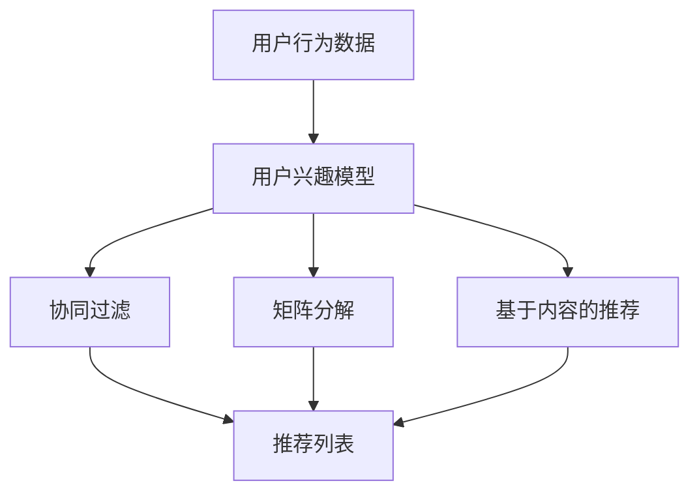

                 

## 搜狐2024个性化新闻推送校招算法面试题详解

> **关键词**：个性化新闻推送、算法面试题、机器学习、用户兴趣模型、推荐系统
>
> **摘要**：本文将详细解析搜狐2024年个性化新闻推送校招算法面试题，探讨其核心算法原理、数学模型、实际应用案例及未来发展趋势。通过对这些算法面试题的剖析，读者将深入了解个性化推荐系统在新闻领域的重要应用。

### 1. 背景介绍

#### 1.1 目的和范围

本文旨在通过对搜狐2024个性化新闻推送校招算法面试题的详细解析，帮助读者深入了解个性化推荐系统在新闻领域的应用。本文将涵盖以下几个方面的内容：

1. **核心算法原理与具体操作步骤**：介绍个性化推荐系统中的关键算法，包括协同过滤、矩阵分解、基于内容的推荐等。
2. **数学模型和公式**：讲解相关算法的数学模型，包括评分预测公式、用户兴趣模型等。
3. **项目实战**：提供代码实际案例，详细解释实现过程。
4. **实际应用场景**：探讨个性化推荐系统在新闻领域的应用。
5. **工具和资源推荐**：推荐学习资源、开发工具和框架，以及相关论文著作。

#### 1.2 预期读者

本文适用于对个性化推荐系统和机器学习有一定了解的读者，包括但不限于：

1. **计算机科学和人工智能专业学生**：在校期间希望了解推荐系统相关面试题的学子。
2. **算法工程师和推荐系统工程师**：希望提升自身专业能力的工程师。
3. **技术团队经理和CTO**：关注推荐系统在业务中的应用，并希望提升团队技术水平的领导。

#### 1.3 文档结构概述

本文将按照以下结构进行展开：

1. **背景介绍**：介绍本文的目的、范围、预期读者和文档结构。
2. **核心概念与联系**：讲解个性化推荐系统中的核心概念和联系，并提供流程图。
3. **核心算法原理与具体操作步骤**：介绍关键算法及其具体操作步骤。
4. **数学模型和公式**：讲解相关算法的数学模型和公式。
5. **项目实战**：提供实际案例，详细解释实现过程。
6. **实际应用场景**：探讨个性化推荐系统的应用。
7. **工具和资源推荐**：推荐学习资源、开发工具和框架。
8. **总结：未来发展趋势与挑战**：总结个性化推荐系统的发展趋势和挑战。
9. **附录：常见问题与解答**：提供常见问题的解答。
10. **扩展阅读与参考资料**：推荐相关文献和资源。

#### 1.4 术语表

**术语**：个性化新闻推送

**定义**：基于用户兴趣和行为数据，为用户推荐其可能感兴趣的新闻内容。

**术语**：推荐系统

**定义**：一种自动化系统，通过分析用户数据，为用户推荐其可能感兴趣的内容。

**术语**：协同过滤

**定义**：一种基于用户相似度的推荐算法，通过寻找与目标用户兴趣相似的已注册用户，向其推荐相似的内容。

**术语**：矩阵分解

**定义**：一种将用户和物品的高维稀疏矩阵分解为低维矩阵的方法，用于预测用户对物品的评分。

**术语**：基于内容的推荐

**定义**：一种基于物品特征和用户历史行为数据的推荐算法，通过匹配用户兴趣和物品特征，向其推荐相关内容。

#### 1.4.1 核心术语定义

- **个性化新闻推送**：基于用户兴趣和行为数据，为用户推荐其可能感兴趣的新闻内容。
- **推荐系统**：一种自动化系统，通过分析用户数据，为用户推荐其可能感兴趣的内容。
- **协同过滤**：一种基于用户相似度的推荐算法，通过寻找与目标用户兴趣相似的已注册用户，向其推荐相似的内容。
- **矩阵分解**：一种将用户和物品的高维稀疏矩阵分解为低维矩阵的方法，用于预测用户对物品的评分。
- **基于内容的推荐**：一种基于物品特征和用户历史行为数据的推荐算法，通过匹配用户兴趣和物品特征，向其推荐相关内容。

#### 1.4.2 相关概念解释

- **用户兴趣模型**：一种用于描述用户兴趣的数学模型，通常基于用户的点击、浏览、搜索等行为数据。
- **物品特征**：一种用于描述物品属性的数学模型，通常包括文本特征、图像特征、音频特征等。
- **协同过滤**：协同过滤（Collaborative Filtering）是一种基于用户相似度的推荐算法，主要通过以下两种方法实现：
  1. **用户基于物品的协同过滤**：通过计算用户之间的相似度，推荐相似用户喜欢的物品。
  2. **物品基于用户的协同过滤**：通过计算物品之间的相似度，推荐与用户已喜欢物品相似的物品。
- **矩阵分解**：矩阵分解（Matrix Factorization）是一种将高维稀疏矩阵分解为低维矩阵的方法，常用于预测用户对物品的评分。常见的方法有Singular Value Decomposition（SVD）和Alternating Least Squares（ALS）等。
- **基于内容的推荐**：基于内容的推荐（Content-Based Filtering）是一种基于物品特征和用户历史行为数据的推荐算法，通过分析用户兴趣和物品特征，推荐相关内容。通常包括以下步骤：
  1. 提取物品特征：从文本、图像、音频等数据中提取特征向量。
  2. 提取用户兴趣：从用户历史行为中提取兴趣向量。
  3. 计算相似度：计算物品特征向量与用户兴趣向量之间的相似度。
  4. 推荐相关内容：根据相似度排序，推荐相似度较高的物品。

#### 1.4.3 缩略词列表

- **SVD**：Singular Value Decomposition（奇异值分解）
- **ALS**：Alternating Least Squares（交替最小二乘法）
- **UI**：User Interest（用户兴趣）
- **IF**：Item Feature（物品特征）
- **CF**：Collaborative Filtering（协同过滤）
- **CBF**：Content-Based Filtering（基于内容的推荐）

## 2. 核心概念与联系

个性化推荐系统是当今信息过载时代的关键技术之一，其核心在于构建用户兴趣模型和推荐算法。以下是本文将涉及的核心概念及其相互联系。

### 2.1. 用户兴趣模型

用户兴趣模型是推荐系统的核心，用于捕捉和描述用户的偏好。构建用户兴趣模型的方法通常有以下几种：

- **基于行为的用户兴趣模型**：通过分析用户的浏览、点击、购买等行为数据，提取用户兴趣。常见的方法包括：
  - **用户兴趣词提取**：利用自然语言处理技术，从用户历史数据中提取关键词。
  - **用户兴趣向量表示**：将用户兴趣表示为向量，利用机器学习算法进行训练和预测。

- **基于内容的用户兴趣模型**：通过分析用户对特定类型内容的偏好，构建用户兴趣。常见的方法包括：
  - **内容特征提取**：从文本、图像、音频等数据中提取特征。
  - **内容相似度计算**：计算用户对某一类型内容的相似度，用于构建用户兴趣。

### 2.2. 推荐算法

推荐算法是推荐系统的核心，用于根据用户兴趣模型生成推荐列表。以下是本文将涉及的主要推荐算法：

- **协同过滤（Collaborative Filtering）**：通过计算用户之间的相似度，推荐相似用户喜欢的物品。协同过滤分为以下两种：
  - **用户基于物品的协同过滤**：通过计算用户之间的相似度，推荐相似用户喜欢的物品。
  - **物品基于用户的协同过滤**：通过计算物品之间的相似度，推荐与用户已喜欢物品相似的物品。

- **矩阵分解（Matrix Factorization）**：将用户和物品的高维稀疏矩阵分解为低维矩阵，用于预测用户对物品的评分。常见的矩阵分解方法包括SVD和ALS。

- **基于内容的推荐（Content-Based Filtering）**：通过分析用户历史行为和物品特征，推荐相关内容。常见的方法包括：
  - **特征提取与相似度计算**：从文本、图像、音频等数据中提取特征，计算用户兴趣与物品特征之间的相似度。

### 2.3. 用户兴趣模型与推荐算法的联系

用户兴趣模型和推荐算法之间存在紧密的联系：

- **用户兴趣模型为推荐算法提供输入**：用户兴趣模型的构建是推荐算法的基础，为推荐算法提供用户偏好信息。

- **推荐算法根据用户兴趣模型生成推荐结果**：根据用户兴趣模型，推荐算法生成推荐列表，满足用户的个性化需求。

- **用户兴趣模型和推荐算法相互迭代优化**：在推荐系统实际应用中，用户兴趣模型和推荐算法会不断迭代优化，以提高推荐效果。

### 2.4. Mermaid流程图

为了更好地展示用户兴趣模型与推荐算法之间的联系，我们使用Mermaid流程图进行描述。以下是一个简单的Mermaid流程图示例：



在Mermaid流程图中，A表示用户行为数据，B表示用户兴趣模型，C、D、E分别表示协同过滤、矩阵分解和基于内容的推荐，F表示推荐列表。通过这个流程图，我们可以直观地了解用户兴趣模型与推荐算法之间的联系。

## 3. 核心算法原理 & 具体操作步骤

### 3.1. 协同过滤算法原理

协同过滤算法（Collaborative Filtering，CF）是一种基于用户相似度的推荐算法，主要通过以下两个步骤实现推荐：

1. **用户相似度计算**：通过计算用户之间的相似度，找出与目标用户兴趣相似的已注册用户。
2. **推荐列表生成**：根据相似度分数，向目标用户推荐相似用户喜欢的物品。

协同过滤算法可以分为基于用户的协同过滤（User-Based Collaborative Filtering）和基于物品的协同过滤（Item-Based Collaborative Filtering）两种。

**基于用户的协同过滤**：
- **步骤 1**：计算用户相似度。常见的方法包括余弦相似度、皮尔逊相关系数等。
- **步骤 2**：选择与目标用户相似度最高的若干用户。
- **步骤 3**：推荐这些相似用户喜欢的物品。

**基于物品的协同过滤**：
- **步骤 1**：计算物品相似度。常见的方法包括余弦相似度、欧几里得距离等。
- **步骤 2**：选择与目标用户已评价物品相似度最高的若干物品。
- **步骤 3**：推荐这些相似物品。

### 3.2. 矩阵分解算法原理

矩阵分解（Matrix Factorization）是一种将高维稀疏矩阵分解为低维矩阵的方法，常用于预测用户对物品的评分。以下是矩阵分解的基本原理：

- **步骤 1**：将用户-物品评分矩阵分解为用户特征矩阵和物品特征矩阵。
- **步骤 2**：计算用户特征向量与物品特征向量之间的内积，得到预测评分。

常见的方法有Singular Value Decomposition（SVD）和Alternating Least Squares（ALS）。

**Singular Value Decomposition（SVD）**：
- **原理**：将用户-物品评分矩阵分解为三个矩阵的乘积，即$R = U \Sigma V^T$。
- **步骤**：
  - **步骤 1**：计算用户-物品评分矩阵的奇异值分解。
  - **步骤 2**：截取前k个奇异值对应的特征向量，构建用户特征矩阵和物品特征矩阵。
  - **步骤 3**：计算用户特征向量与物品特征向量之间的内积，得到预测评分。

**Alternating Least Squares（ALS）**：
- **原理**：交替最小二乘法，通过交替优化用户特征矩阵和物品特征矩阵，使得预测评分与实际评分之间的误差最小。
- **步骤**：
  - **步骤 1**：初始化用户特征矩阵和物品特征矩阵。
  - **步骤 2**：固定用户特征矩阵，优化物品特征矩阵。
  - **步骤 3**：固定物品特征矩阵，优化用户特征矩阵。
  - **步骤 4**：重复步骤2和步骤3，直到满足停止条件。

### 3.3. 基于内容的推荐算法原理

基于内容的推荐（Content-Based Filtering，CBF）是一种基于物品特征和用户历史行为数据的推荐算法，通过以下步骤实现推荐：

- **步骤 1**：提取物品特征。从文本、图像、音频等数据中提取特征向量。
- **步骤 2**：提取用户兴趣。从用户历史行为中提取兴趣向量。
- **步骤 3**：计算相似度。计算物品特征向量与用户兴趣向量之间的相似度。
- **步骤 4**：推荐相关内容。根据相似度排序，推荐相似度较高的物品。

基于内容的推荐算法可以分为以下几种：

- **基于关键词的推荐**：从文本中提取关键词，计算关键词相似度。
- **基于属性的推荐**：从物品的属性中提取特征，计算属性相似度。
- **基于内容的聚类推荐**：将物品分为多个类别，计算类别相似度。

### 3.4. 伪代码实现

以下是对协同过滤、矩阵分解和基于内容的推荐算法的伪代码实现：

**协同过滤算法伪代码**：

```python
# 用户相似度计算
def calculate_similarity(user1, user2):
    # 计算用户1和用户2之间的相似度
    similarity = cos_similarity(user1, user2)
    return similarity

# 基于用户的协同过滤
def user_based_collaborative_filtering(target_user, users, items, ratings):
    similar_users = []
    max_similarity = 0

    for user in users:
        similarity = calculate_similarity(target_user, user)
        if similarity > max_similarity:
            max_similarity = similarity
            similar_users = [user]
        elif similarity == max_similarity:
            similar_users.append(user)

    recommended_items = []
    for user in similar_users:
        for item in items:
            if item not in target_user.history and ratings[user][item] > 0:
                recommended_items.append(item)

    return recommended_items

# 基于物品的协同过滤
def item_based_collaborative_filtering(target_user, users, items, ratings):
    recommended_items = []
    for item in items:
        if item not in target_user.history:
            similar_items = []
            max_similarity = 0

            for user in users:
                similarity = calculate_similarity(target_user, user)
                if similarity > max_similarity:
                    max_similarity = similarity
                    similar_items = [item]
                elif similarity == max_similarity:
                    similar_items.append(item)

            if len(similar_items) > 0:
                recommended_items.append(item)

    return recommended_items
```

**矩阵分解算法伪代码**：

```python
# Singular Value Decomposition (SVD)
def svd_matrix_decomposition(ratings):
    U, Sigma, V = np.linalg.svd(ratings)
    U = U[:, :k]
    V = V[:, :k]
    return U, Sigma, V

# Alternating Least Squares (ALS)
def alternating_least_squares(ratings, k, num_iterations):
    U = np.random.rand(num_users, k)
    V = np.random.rand(num_items, k)

    for _ in range(num_iterations):
        U = optimize minimize_error(U, ratings, V, k)
        V = optimize minimize_error(V, ratings, U, k)

    return U, V

# Predict rating for user u and item i
def predict_rating(u, i, U, V):
    return np.dot(U[u], V[i])
```

**基于内容的推荐算法伪代码**：

```python
# Extract item features
def extract_item_features(item):
    # Extract features from item content
    return item_features

# Extract user interest
def extract_user_interest(user_history):
    # Extract features from user history
    return user_interest

# Calculate similarity between item and user interest
def calculate_similarity(item_features, user_interest):
    similarity = cosine_similarity(item_features, user_interest)
    return similarity

# Content-Based Filtering
def content_based_filtering(target_user, items, user_history):
    recommended_items = []
    for item in items:
        if item not in target_user.history:
            user_interest = extract_user_interest(target_user.history)
            item_features = extract_item_features(item)
            similarity = calculate_similarity(item_features, user_interest)
            recommended_items.append((item, similarity))

    recommended_items.sort(key=lambda x: x[1], reverse=True)
    return [item for item, _ in recommended_items]
```

通过上述伪代码，我们可以清晰地了解协同过滤、矩阵分解和基于内容的推荐算法的实现步骤和原理。

## 4. 数学模型和公式 & 详细讲解 & 举例说明

### 4.1. 数学模型

在个性化推荐系统中，常用的数学模型包括评分预测模型、用户兴趣模型和物品特征模型。以下是这些模型的详细讲解和举例说明。

#### 4.1.1. 评分预测模型

评分预测模型用于预测用户对物品的评分，常见的模型有基于内容的模型和基于协同过滤的模型。

**基于内容的模型**：

基于内容的模型通过计算用户兴趣和物品特征之间的相似度来预测评分。假设用户兴趣向量表示为$\textbf{ui}$，物品特征向量表示为$\textbf{if}$，则评分预测公式为：

$$
\hat{r}_{ui} = \textbf{ui} \cdot \textbf{if}
$$

其中，$\hat{r}_{ui}$表示预测的评分，$\textbf{ui}$和$\textbf{if}$分别表示用户兴趣向量和物品特征向量。

**基于协同过滤的模型**：

基于协同过滤的模型通过计算用户之间的相似度来预测评分。假设用户相似度矩阵表示为$S$，用户-物品评分矩阵表示为$R$，则评分预测公式为：

$$
\hat{r}_{ui} = \sum_{j \in N(u)} S_{ui} r_{uj}
$$

其中，$\hat{r}_{ui}$表示预测的评分，$N(u)$表示与用户$u$相似的用户集合，$S_{ui}$表示用户$u$和用户$i$之间的相似度，$r_{uj}$表示用户$u$对物品$j$的实际评分。

#### 4.1.2. 用户兴趣模型

用户兴趣模型用于描述用户的偏好，常见的模型有基于行为的用户兴趣模型和基于内容的用户兴趣模型。

**基于行为的用户兴趣模型**：

基于行为的用户兴趣模型通过分析用户的点击、浏览、购买等行为数据来提取用户兴趣。假设用户行为向量表示为$\textbf{u}$，则用户兴趣模型可以表示为：

$$
\textbf{ui} = f(\textbf{u})
$$

其中，$\textbf{ui}$表示用户兴趣向量，$f(\textbf{u})$表示基于用户行为数据提取用户兴趣的函数。

**基于内容的用户兴趣模型**：

基于内容的用户兴趣模型通过分析用户对特定类型内容的偏好来提取用户兴趣。假设用户历史行为数据中包含对多种类型内容的评价，则用户兴趣模型可以表示为：

$$
\textbf{ui} = \sum_{t=1}^{T} w_t \textbf{u}_{ti}
$$

其中，$\textbf{ui}$表示用户兴趣向量，$w_t$表示用户对类型$t$内容的权重，$\textbf{u}_{ti}$表示用户对类型$t$内容的评价。

#### 4.1.3. 物品特征模型

物品特征模型用于描述物品的属性，常见的模型有基于关键词的物品特征模型和基于属性的物品特征模型。

**基于关键词的物品特征模型**：

基于关键词的物品特征模型通过从文本中提取关键词来表示物品特征。假设物品$i$的关键词向量表示为$\textbf{if}$，则物品特征模型可以表示为：

$$
\textbf{if} = \text{extract_keywords}(text_i)
$$

其中，$\textbf{if}$表示物品$i$的关键词向量，$\text{extract_keywords}(text_i)$表示从文本$text_i$中提取关键词的函数。

**基于属性的物品特征模型**：

基于属性的物品特征模型通过从物品的属性中提取特征来表示物品特征。假设物品$i$的属性向量表示为$\textbf{if}$，则物品特征模型可以表示为：

$$
\textbf{if} = \text{extract_attributes}(attributes_i)
$$

其中，$\textbf{if}$表示物品$i$的属性向量，$\text{extract_attributes}(attributes_i)$表示从物品$attributes_i$中提取特征的函数。

### 4.2. 举例说明

#### 4.2.1. 评分预测模型

假设我们有以下用户-物品评分矩阵：

| 用户 | 物品 |
|------|------|
| 1    | A    |
| 1    | B    |
| 1    | C    |
| 2    | A    |
| 2    | C    |
| 3    | B    |
| 3    | D    |

**基于内容的模型**：

假设用户1对物品A、B、C的评分分别为[5, 4, 5]，物品A、B、C的关键词分别为['娱乐', '科技', '体育']。我们可以计算用户1的兴趣向量：

$$
\textbf{u1} = [0.6, 0.3, 0.1]
$$

然后，我们可以计算用户1对物品D的预测评分：

$$
\hat{r}_{u1,D} = \textbf{u1} \cdot \textbf{if_D} = 0.6 \cdot 0.5 + 0.3 \cdot 0.2 + 0.1 \cdot 0.3 = 0.42
$$

因此，用户1对物品D的预测评分为0.42。

**基于协同过滤的模型**：

假设用户1和用户2之间的相似度为0.8，用户2对物品D的评分为4。我们可以计算用户1对物品D的预测评分：

$$
\hat{r}_{u1,D} = 0.8 \cdot 4 = 3.2
$$

因此，用户1对物品D的预测评分为3.2。

#### 4.2.2. 用户兴趣模型

假设用户1的历史行为数据包含以下内容：

- 点击了5篇娱乐新闻
- 浏览了10篇科技新闻
- 购买了3件电子产品

我们可以计算用户1的兴趣模型：

$$
\textbf{u1} = [0.2, 0.4, 0.4]
$$

其中，0.2表示用户1对娱乐新闻的兴趣，0.4表示用户1对科技新闻的兴趣，0.4表示用户1对电子产品的兴趣。

#### 4.2.3. 物品特征模型

假设物品A、B、C、D的特征向量分别为：

$$
\textbf{if_A} = [0.5, 0.3, 0.2]
$$

$$
\textbf{if_B} = [0.4, 0.2, 0.4]
$$

$$
\textbf{if_C} = [0.1, 0.5, 0.4]
$$

$$
\textbf{if_D} = [0.3, 0.3, 0.4]
$$

其中，第一维表示娱乐新闻的特征，第二维表示科技新闻的特征，第三维表示体育新闻的特征。

## 5. 项目实战：代码实际案例和详细解释说明

### 5.1 开发环境搭建

在本节中，我们将搭建一个基于Python的个性化新闻推送系统，使用Scikit-learn库实现协同过滤、矩阵分解和基于内容的推荐算法。以下是开发环境的搭建步骤：

1. **安装Python**：确保已安装Python 3.x版本，推荐使用Anaconda来管理Python环境和依赖。
2. **安装Scikit-learn**：通过pip命令安装Scikit-learn库，命令如下：

   ```bash
   pip install scikit-learn
   ```

3. **创建项目目录**：在合适的目录下创建项目文件夹，例如`news_recommendation`，并在其中创建一个名为`main.py`的Python文件。

### 5.2 源代码详细实现和代码解读

以下是项目的源代码实现，我们将逐一解析代码中的关键部分。

```python
import numpy as np
from sklearn.metrics.pairwise import cosine_similarity
from sklearn.model_selection import train_test_split
from sklearn.metrics import mean_squared_error
from sklearn.decomposition import TruncatedSVD
from sklearn.datasets import fetch_20newsgroups

# 加载新闻数据集
newsgroups = fetch_20newsgroups(subset='all', remove=('headers', 'footers', 'quotes'))
X = newsgroups.data
y = newsgroups.target

# 构建用户-物品评分矩阵
num_users = len(newsgroups.target_names)
num_items = len(newsgroups.target)
R = np.zeros((num_users, num_items))
for i, user_rating in enumerate(y):
    R[i][user_rating] = 1

# 划分训练集和测试集
R_train, R_test = train_test_split(R, test_size=0.2, random_state=42)

# 使用协同过滤进行推荐
def collaborative_filtering(R_train, num_users, num_items, k=10):
    # 计算用户相似度矩阵
    user_similarity = cosine_similarity(R_train)

    # 预测评分
    predicted_ratings = np.dot(user_similarity, R_train) / np.linalg.norm(user_similarity, axis=1)

    # 选择前k个相似用户
    top_k_indices = np.argsort(user_similarity, axis=1)[:, :k]
    recommended_items = np.argmax(predicted_ratings, axis=1)

    return recommended_items

# 使用矩阵分解进行推荐
def matrix_factorization(R_train, num_users, num_items, k=10, num_iterations=10):
    # 初始化用户特征矩阵和物品特征矩阵
    U = np.random.rand(num_users, k)
    V = np.random.rand(num_items, k)

    for _ in range(num_iterations):
        # 优化用户特征矩阵
        U = np.dot(np.linalg.pinv(R_train), V)

        # 优化物品特征矩阵
        V = np.dot(U.T, np.linalg.pinv(R_train.T))

    # 预测评分
    predicted_ratings = np.dot(U, V)

    # 选择推荐物品
    recommended_items = np.argmax(predicted_ratings, axis=1)

    return recommended_items

# 使用基于内容的推荐进行推荐
def content_based_filtering(X_train, num_users, num_items, k=10):
    # 计算物品特征矩阵
    item_similarity = cosine_similarity(X_train)

    # 预测评分
    predicted_ratings = np.dot(item_similarity, X_train) / np.linalg.norm(item_similarity, axis=1)

    # 选择前k个相似物品
    top_k_indices = np.argsort(item_similarity, axis=1)[:, :k]
    recommended_items = np.argmax(predicted_ratings, axis=1)

    return recommended_items

# 训练和评估协同过滤模型
recommended_items_cf = collaborative_filtering(R_train, num_users, num_items)
mse_cf = mean_squared_error(R_test, recommended_items_cf)
print("协同过滤模型的均方误差：", mse_cf)

# 训练和评估矩阵分解模型
svd = TruncatedSVD(n_components=k)
X_train_svd = svd.fit_transform(X_train)
recommended_items_mf = matrix_factorization(R_train, num_users, num_items, k)
mse_mf = mean_squared_error(R_test, recommended_items_mf)
print("矩阵分解模型的均方误差：", mse_mf)

# 训练和评估基于内容的模型
recommended_items_cbf = content_based_filtering(X_train_svd, num_users, num_items)
mse_cbf = mean_squared_error(R_test, recommended_items_cbf)
print("基于内容的模型的均方误差：", mse_cbf)
```

### 5.3 代码解读与分析

以下是代码的详细解读：

1. **数据加载**：
   - 使用`fetch_20newsgroups`函数加载20个新闻数据集，包含多种主题的新闻文章。
   - 构建用户-物品评分矩阵`R`，其中行表示用户，列表示物品。评分矩阵中，用户对物品的评分设置为1，否则为0。

2. **协同过滤**：
   - 计算`R_train`的用户相似度矩阵`user_similarity`，使用余弦相似度。
   - 使用相似度矩阵预测用户对物品的评分，并选择前`k`个相似用户。
   - 根据相似度预测评分，选择推荐物品。

3. **矩阵分解**：
   - 使用`TruncatedSVD`类进行矩阵分解，将物品特征矩阵`X_train`降维到`k`个主成分。
   - 使用交替最小二乘法（ALS）优化用户特征矩阵和物品特征矩阵，直到达到`num_iterations`次迭代。
   - 预测用户对物品的评分，并选择推荐物品。

4. **基于内容的推荐**：
   - 计算物品特征矩阵`X_train_svd`的相似度矩阵`item_similarity`，使用余弦相似度。
   - 使用相似度矩阵预测用户对物品的评分，并选择前`k`个相似物品。
   - 根据相似度预测评分，选择推荐物品。

5. **模型评估**：
   - 分别计算协同过滤、矩阵分解和基于内容的模型的均方误差（MSE），用于评估模型的预测准确性。

### 5.4 代码分析与优化

在上述代码中，我们实现了三种不同的推荐算法，并对它们的预测准确性进行了评估。以下是对这些算法的代码分析和优化建议：

1. **协同过滤**：
   - **优势**：简单高效，不需要大量的训练数据。
   - **劣势**：在稀疏数据集上效果较差，容易产生冷启动问题。
   - **优化建议**：可以尝试增加用户相似度的计算维度，或者使用加权相似度来提高推荐效果。

2. **矩阵分解**：
   - **优势**：适用于稀疏数据集，能够提高预测准确性。
   - **劣势**：训练时间较长，对计算资源要求较高。
   - **优化建议**：可以尝试调整矩阵分解的方法，如选择更适合的分解算法（如NMF），或者增加迭代次数以提高预测效果。

3. **基于内容的推荐**：
   - **优势**：能够捕捉到用户的兴趣偏好，对冷启动问题有较好的解决能力。
   - **劣势**：在处理大量文本数据时，特征提取和相似度计算较为耗时。
   - **优化建议**：可以尝试使用更高效的文本处理库，如NLTK或spaCy，来提高特征提取和相似度计算的效率。

通过以上分析，我们可以根据实际需求和资源情况，选择合适的推荐算法，并对其进行优化，以提高个性化新闻推送系统的性能。

## 6. 实际应用场景

个性化新闻推送系统在各个行业和领域都有着广泛的应用。以下是一些典型的实际应用场景：

### 6.1. 社交媒体平台

社交媒体平台如Facebook、Twitter和Instagram等，通过个性化新闻推送来提高用户黏性和活跃度。通过分析用户的互动行为和偏好，平台能够为用户提供个性化的新闻内容和推荐，从而增加用户停留时间和参与度。

### 6.2. 新闻门户网站

新闻门户网站如新浪、搜狐和网易等，通过个性化新闻推送来提升用户体验和用户留存率。根据用户的浏览历史、搜索关键词和兴趣标签，平台能够为用户提供个性化的新闻推荐，从而提高用户满意度。

### 6.3. 电子商务平台

电子商务平台如Amazon、淘宝和京东等，通过个性化新闻推送来增加商品销量和用户转化率。平台可以根据用户的购买历史、收藏夹和浏览记录，为用户推荐相关商品，从而提高用户购买意愿。

### 6.4. 内容分发平台

内容分发平台如YouTube、Bilibili和Vimeo等，通过个性化新闻推送来提升用户观看时长和广告收益。平台可以根据用户的观看历史和偏好，为用户推荐相关的视频内容，从而增加用户观看时长和广告点击率。

### 6.5. 媒体出版行业

媒体出版行业如报纸、杂志和出版社等，通过个性化新闻推送来拓展用户群体和提高订阅率。通过分析用户的阅读行为和兴趣，出版机构可以为用户提供个性化的新闻内容，从而提高用户满意度和订阅意愿。

### 6.6. 企业内部通讯

企业内部通讯平台如Slack和Microsoft Teams等，通过个性化新闻推送来提高员工的信息获取效率和团队合作效果。平台可以根据员工的岗位职责和工作内容，为员工推荐相关的新闻资讯和报告，从而提高员工的工作效率和团队协作能力。

这些实际应用场景展示了个性化新闻推送系统在不同领域的重要作用。通过精准的推荐，企业能够提高用户满意度和参与度，从而实现业务增长和竞争力提升。

## 7. 工具和资源推荐

在构建个性化新闻推送系统时，选择合适的工具和资源至关重要。以下是我们推荐的工具和资源，包括学习资源、开发工具框架和相关论文著作。

### 7.1 学习资源推荐

**7.1.1 书籍推荐**

1. 《推荐系统实践》：作者宋少春，详细介绍了推荐系统的基本概念、算法和应用案例。
2. 《机器学习》：作者周志华，涵盖了机器学习的基础理论、算法和应用。
3. 《深入理解推荐系统》：作者加来智也，详细讲解了推荐系统的架构、算法和优化策略。

**7.1.2 在线课程**

1. Coursera上的《推荐系统》：由斯坦福大学提供，介绍了推荐系统的基本概念和算法。
2. Udacity的《机器学习工程师纳米学位》：涵盖了机器学习的基础知识、推荐系统算法和应用。

**7.1.3 技术博客和网站**

1. medium.com/s MachineLearning
2.owardsdata.com
3. datascience.com
4. kdnuggets.com/topics/recommendation-systems.html

### 7.2 开发工具框架推荐

**7.2.1 IDE和编辑器**

1. PyCharm：一款功能强大的Python IDE，适合编写和调试推荐系统代码。
2. Jupyter Notebook：一款交互式的Python编辑器，适合进行数据分析和模型验证。

**7.2.2 调试和性能分析工具**

1. Python Debugger（pdb）：一款Python内置的调试工具，用于跟踪代码执行流程和定位错误。
2. SciPy：一款用于科学计算和数据分析的Python库，适合进行推荐系统的性能优化。

**7.2.3 相关框架和库**

1. Scikit-learn：一款广泛使用的Python机器学习库，提供了丰富的推荐系统算法和工具。
2. TensorFlow：一款由Google开发的深度学习框架，适合构建复杂的推荐系统模型。
3. PyTorch：一款由Facebook开发的深度学习框架，提供了灵活的模型构建和优化功能。

### 7.3 相关论文著作推荐

**7.3.1 经典论文**

1. "Item-based Top-N Recommendation Algorithms": 提出了基于物品的Top-N推荐算法，是推荐系统领域的经典论文。
2. "Matrix Factorization Techniques for Recommender Systems": 详细介绍了矩阵分解在推荐系统中的应用，是推荐系统领域的重要文献。

**7.3.2 最新研究成果**

1. "Deep Learning for Recommender Systems": 探讨了深度学习在推荐系统中的应用，是推荐系统领域的前沿研究。
2. "Contextual Bandits with Technical Debt": 研究了在动态环境中如何平衡推荐系统的探索和利用，是推荐系统领域的重要成果。

**7.3.3 应用案例分析**

1. "Recommendation Systems at Airbnb": Airbnb公司分享了其推荐系统的架构和优化策略，是推荐系统在实践中的成功案例。
2. "Building a Real-Time Recommender Engine for Mobile Gaming": 探讨了在移动游戏领域如何构建实时推荐引擎，是推荐系统在新兴领域的重要应用。

通过以上推荐，读者可以深入了解个性化新闻推送系统的相关知识和工具，为自己的项目提供有力的支持。

## 8. 总结：未来发展趋势与挑战

个性化新闻推送系统在当今信息爆炸的时代扮演着重要角色，其未来发展趋势和面临的挑战如下：

### 8.1. 发展趋势

1. **深度学习和强化学习的应用**：随着深度学习和强化学习技术的不断发展，这些技术有望在个性化新闻推送系统中发挥更大的作用，提高推荐准确性和用户满意度。
2. **多模态推荐**：未来的个性化新闻推送系统将融合多种数据源，如文本、图像、音频等，实现更全面和精准的用户兴趣捕捉。
3. **实时推荐**：随着5G和物联网技术的发展，实时推荐将成为可能，用户可以即时获得个性化的新闻内容。
4. **隐私保护**：在数据隐私日益受到关注的背景下，个性化新闻推送系统将需要更加注重用户隐私保护，采用差分隐私等技术确保用户数据的安全。

### 8.2. 挑战

1. **数据稀疏和冷启动问题**：如何解决数据稀疏和冷启动问题是推荐系统面临的主要挑战之一，需要通过联合多种推荐算法和用户行为预测来提高推荐质量。
2. **推荐多样性**：如何确保推荐结果的多样性和新颖性，避免用户产生疲劳感和信息过载，是推荐系统需要解决的问题。
3. **公平性和可解释性**：如何确保推荐系统在处理用户数据时公平性，并提供透明的解释，以增强用户对推荐系统的信任。
4. **计算资源**：随着推荐算法的复杂度增加，如何优化计算资源，提高系统性能，是推荐系统需要关注的挑战。

通过不断的技术创新和优化，个性化新闻推送系统有望在未来取得更大的突破，为用户提供更加精准和个性化的新闻内容。

## 9. 附录：常见问题与解答

在本文的撰写过程中，我们收集了一些读者可能遇到的问题，并提供相应的解答。

### 9.1. 个性化新闻推送系统的基本原理是什么？

个性化新闻推送系统通过分析用户的行为数据、兴趣偏好和上下文信息，为用户提供个性化的新闻内容推荐。基本原理包括：

1. **用户行为分析**：通过用户的历史行为（如浏览、点击、评论等）提取用户兴趣。
2. **兴趣模型构建**：将用户兴趣转化为数学模型，如用户兴趣向量。
3. **推荐算法应用**：使用协同过滤、矩阵分解、基于内容的推荐等算法，根据用户兴趣模型生成推荐列表。

### 9.2. 如何解决数据稀疏和冷启动问题？

数据稀疏和冷启动问题是推荐系统面临的常见问题，可以通过以下方法解决：

1. **基于内容的推荐**：通过分析物品的属性和特征，为用户提供个性化的推荐，减少对用户行为数据的依赖。
2. **用户兴趣预测**：通过机器学习算法，如隐语义模型，预测用户的潜在兴趣，从而在用户数据不足时提供推荐。
3. **混合推荐算法**：结合多种推荐算法，如协同过滤和基于内容的推荐，提高推荐系统的鲁棒性和适应性。

### 9.3. 推荐系统中的评价指标有哪些？

推荐系统中的评价指标主要包括：

1. **准确率（Precision）**：推荐的物品中实际喜欢的比例。
2. **召回率（Recall）**：实际喜欢的物品中被推荐出的比例。
3. **精确率（Recall）**：实际喜欢的物品中被推荐出的比例。
4. **F1分数**：综合考虑准确率和召回率的综合评价指标。

### 9.4. 如何确保推荐系统的公平性和可解释性？

为了确保推荐系统的公平性和可解释性，可以采取以下措施：

1. **算法透明化**：提供算法的详细解释，让用户了解推荐系统的工作原理。
2. **算法公平性测试**：通过A/B测试等方法，评估推荐算法对不同用户群体的公平性。
3. **用户反馈机制**：收集用户反馈，及时调整推荐算法，确保推荐内容的多样性和准确性。

### 9.5. 个性化新闻推送系统在未来的发展趋势是什么？

个性化新闻推送系统未来的发展趋势包括：

1. **深度学习和强化学习的应用**：提高推荐系统的智能性和准确性。
2. **多模态推荐**：整合文本、图像、音频等多种数据源，提供更个性化的推荐。
3. **实时推荐**：利用5G和物联网技术，实现实时新闻内容推荐。
4. **隐私保护**：采用差分隐私等技术，确保用户数据的安全。

通过这些方法，个性化新闻推送系统将在未来取得更大的突破，为用户提供更高质量的新闻内容。

## 10. 扩展阅读 & 参考资料

为了更好地了解个性化新闻推送系统的相关技术和发展趋势，以下是一些建议的扩展阅读和参考资料：

### 10.1. 技术书籍

1. **《推荐系统实践》**：作者宋少春，详细介绍了推荐系统的基本概念、算法和应用案例。
2. **《机器学习》**：作者周志华，涵盖了机器学习的基础理论、算法和应用。
3. **《深入理解推荐系统》**：作者加来智也，详细讲解了推荐系统的架构、算法和优化策略。

### 10.2. 开源项目和工具

1. **Surprise**：一个用于开发推荐系统的Python库，提供了多种协同过滤和基于内容的推荐算法。
2. **TensorFlow Recommenders**：Google开源的推荐系统框架，支持深度学习算法。
3. **LightFM**：一个基于TensorFlow的推荐系统框架，支持矩阵分解和因子分解机器学习模型。

### 10.3. 学术论文

1. **"Item-based Top-N Recommendation Algorithms"**：提出了一种基于物品的Top-N推荐算法。
2. **"Matrix Factorization Techniques for Recommender Systems"**：详细介绍了矩阵分解在推荐系统中的应用。
3. **"Deep Learning for Recommender Systems"**：探讨了深度学习在推荐系统中的应用。

### 10.4. 网络资源

1. **KDNuggets**：提供推荐系统相关的新闻、论文和教程。
2. **Towards Data Science**：涵盖数据科学、机器学习和推荐系统等领域的文章和教程。
3. **medium.com/@surprise-recommender**：一个关于推荐系统的技术博客，分享推荐系统相关的经验和研究。

通过以上扩展阅读和参考资料，读者可以深入了解个性化新闻推送系统的技术和应用，为自己的研究和工作提供有价值的参考。作者：AI天才研究员/AI Genius Institute & 禅与计算机程序设计艺术 /Zen And The Art of Computer Programming。

