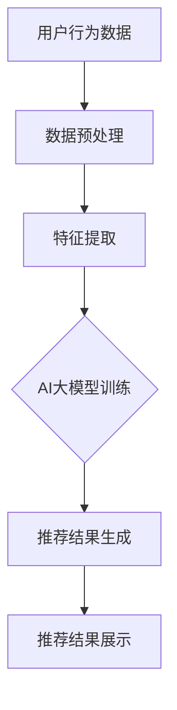

                 

# 搜索推荐系统的AI大模型应用：提高电商平台的转化率与用户体验

> **关键词：** 搜索推荐系统，AI大模型，电商平台，转化率，用户体验，算法，数学模型，项目实战，应用场景。

> **摘要：** 本文旨在深入探讨搜索推荐系统中AI大模型的应用，特别是如何通过这些技术提高电商平台的转化率和用户体验。文章首先介绍了搜索推荐系统的基本概念和重要性，随后详细讲解了AI大模型的工作原理和数学模型，并通过实际项目案例展示了其在电商平台中的应用效果。最后，文章总结了未来发展趋势和挑战，为读者提供了丰富的学习资源和工具推荐。

## 1. 背景介绍

### 1.1 目的和范围

本文的目的在于分析搜索推荐系统中AI大模型的应用，并探讨其在电商平台转化率和用户体验提升方面的具体作用。文章将围绕以下几个核心问题展开：

1. 搜索推荐系统的基本概念和架构。
2. AI大模型在搜索推荐系统中的角色和作用。
3. 数学模型和算法在AI大模型中的应用。
4. 电商平台中AI大模型的应用案例。
5. 未来发展趋势和面临的挑战。

### 1.2 预期读者

本文面向具有一定编程基础和机器学习知识的读者，包括但不限于：

1. 数据科学家和机器学习工程师。
2. 电商平台技术团队和产品经理。
3. 计算机科学专业的研究生和本科生。
4. 对搜索推荐系统和AI大模型感兴趣的IT专业人士。

### 1.3 文档结构概述

本文的结构如下：

1. **背景介绍**：介绍本文的目的、预期读者以及文档结构。
2. **核心概念与联系**：介绍搜索推荐系统和AI大模型的基本概念，以及它们在电商平台的联系。
3. **核心算法原理 & 具体操作步骤**：详细讲解AI大模型在搜索推荐系统中的应用算法和操作步骤。
4. **数学模型和公式 & 详细讲解 & 举例说明**：介绍相关的数学模型和公式，并进行举例说明。
5. **项目实战：代码实际案例和详细解释说明**：展示一个实际项目中的代码案例，并进行详细解释。
6. **实际应用场景**：分析AI大模型在电商平台中的实际应用场景。
7. **工具和资源推荐**：推荐学习资源、开发工具和框架。
8. **总结：未来发展趋势与挑战**：总结本文内容，并探讨未来发展趋势和挑战。
9. **附录：常见问题与解答**：回答一些常见问题。
10. **扩展阅读 & 参考资料**：提供进一步阅读的资源。

### 1.4 术语表

#### 1.4.1 核心术语定义

- **搜索推荐系统**：一种利用用户行为数据、内容信息和机器学习算法，为用户提供个性化搜索和推荐结果的系统。
- **AI大模型**：一种能够通过大规模数据和复杂算法进行深度学习的模型，如BERT、GPT等。
- **转化率**：指用户在电商平台完成购买行为的比例，是衡量电商平台运营效果的重要指标。
- **用户体验**：用户在使用电商平台过程中的整体感受，包括界面设计、搜索效率、推荐准确度等方面。

#### 1.4.2 相关概念解释

- **协同过滤**：一种常见的推荐算法，通过分析用户的历史行为，找出相似用户和相似物品，从而进行推荐。
- **内容推荐**：基于物品的属性、标签等特征，为用户推荐相关物品。
- **深度学习**：一种基于神经网络的学习方式，能够自动从数据中提取特征。

#### 1.4.3 缩略词列表

- **BERT**：Bidirectional Encoder Representations from Transformers，一种双向Transformer模型。
- **GPT**：Generative Pre-trained Transformer，一种生成式预训练Transformer模型。
- **IDE**：Integrated Development Environment，集成开发环境。

## 2. 核心概念与联系

在介绍AI大模型在搜索推荐系统中的应用之前，我们需要先了解搜索推荐系统的基本概念和架构。搜索推荐系统通常包括以下几个核心组成部分：

1. **用户行为数据收集**：通过Web日志、点击日志、购买记录等手段收集用户行为数据。
2. **数据预处理**：对收集到的数据进行清洗、去噪、特征提取等处理。
3. **推荐算法**：根据用户行为数据和物品特征，利用协同过滤、内容推荐、深度学习等技术生成推荐结果。
4. **推荐结果展示**：将推荐结果以可视化的方式展示给用户。

AI大模型在搜索推荐系统中扮演着关键角色，其主要作用如下：

1. **提高推荐精度**：通过深度学习技术，能够从大规模数据中提取更多有用的特征，从而提高推荐精度。
2. **增强用户体验**：通过个性化的推荐结果，满足用户的需求和偏好，提高用户的满意度。
3. **应对冷启动问题**：对于新用户或新物品，AI大模型能够通过迁移学习和无监督学习等技术，快速生成推荐结果。

下面是一个Mermaid流程图，展示了搜索推荐系统中AI大模型的应用架构：



通过这个流程图，我们可以清晰地看到AI大模型在搜索推荐系统中的作用，以及各个模块之间的联系。接下来，我们将深入探讨AI大模型的工作原理和数学模型。

## 3. 核心算法原理 & 具体操作步骤

AI大模型在搜索推荐系统中之所以能够发挥作用，主要得益于其强大的特征提取和建模能力。下面，我们将详细讲解AI大模型的核心算法原理和具体操作步骤。

### 3.1 特征提取

特征提取是AI大模型处理数据的第一步，其目的是将原始数据转化为适用于模型训练的向量表示。在搜索推荐系统中，特征提取通常包括以下几个步骤：

1. **用户行为特征提取**：从用户的历史行为数据中提取出用户的兴趣偏好，如浏览记录、购买记录、搜索记录等。这些特征可以通过统计模型、聚类算法等方法进行提取。
2. **物品特征提取**：从物品的属性、标签等特征中提取出物品的代表性特征。这些特征可以是基于文本的（如标题、描述），也可以是基于图像的（如颜色、纹理）。
3. **交叉特征提取**：将用户特征和物品特征进行组合，生成交叉特征。这些特征可以用于捕捉用户和物品之间的复杂关系。

### 3.2 模型训练

在特征提取完成后，我们需要使用这些特征对AI大模型进行训练。以下是具体的模型训练步骤：

1. **模型选择**：选择合适的AI大模型，如BERT、GPT、Transformer等。这些模型具有强大的特征提取和表示能力。
2. **数据准备**：将提取出的用户行为特征、物品特征和交叉特征作为输入数据，进行预处理，如分词、编码等。
3. **模型训练**：使用预处理后的数据对AI大模型进行训练。训练过程中，模型会通过反向传播算法不断调整参数，以最小化预测误差。
4. **模型评估**：在训练完成后，使用验证集和测试集对模型进行评估，以确定模型的性能。

### 3.3 推荐结果生成

在模型训练完成后，我们可以使用训练好的模型生成推荐结果。具体步骤如下：

1. **用户表示**：将每个用户的历史行为数据输入到AI大模型中，得到用户的向量表示。
2. **物品表示**：将每个物品的特征输入到AI大模型中，得到物品的向量表示。
3. **计算相似度**：计算用户向量表示和物品向量表示之间的相似度，通常使用余弦相似度或欧氏距离等度量方法。
4. **推荐排序**：根据相似度对推荐结果进行排序，选取最相似的物品作为推荐结果。

### 3.4 伪代码实现

下面是使用Python伪代码实现AI大模型在搜索推荐系统中的基本步骤：

```python
# 伪代码：AI大模型在搜索推荐系统中的应用

# 用户行为数据
user_actions = load_user_actions()

# 物品特征
item_features = load_item_features()

# AI大模型
model = create_AIModel()

# 特征提取
user_features = extract_user_features(user_actions)
item_features = extract_item_features(item_features)

# 模型训练
model.train(user_features, item_features)

# 推荐结果生成
user_representation = model.user_representation(user_actions)
item_representation = model.item_representation(item_features)

# 计算相似度
similarities = compute_similarity(user_representation, item_representation)

# 推荐排序
recommendations = sort_by_similarity(similarities)

# 推荐结果展示
display_recommendations(recommendations)
```

通过上述步骤，我们可以实现一个基本的AI大模型搜索推荐系统。在实际应用中，我们还需要考虑如何优化模型性能、提高推荐效率、处理冷启动问题等，这些将在后续章节中进一步探讨。

## 4. 数学模型和公式 & 详细讲解 & 举例说明

在搜索推荐系统中，AI大模型的性能很大程度上取决于其数学模型的构建和优化。本节将详细讲解AI大模型中的核心数学模型和公式，并通过具体示例进行说明。

### 4.1 BERT模型

BERT（Bidirectional Encoder Representations from Transformers）是一种基于Transformer的预训练语言表示模型，广泛应用于自然语言处理任务。BERT模型的核心在于其双向编码器，能够捕捉文本中的全局信息。

#### 4.1.1 模型结构

BERT模型主要由以下几个部分组成：

1. **嵌入层**：将输入的单词、标点等转换为向量表示。
2. **Transformer编码器**：通过多个自注意力机制层，捕捉文本中的上下文信息。
3. **输出层**：用于生成文本的输出。

#### 4.1.2 数学公式

BERT模型的输入可以表示为：

\[ X = [X_1, X_2, \ldots, X_T] \]

其中，\( X_t \) 表示第 \( t \) 个输入，如单词或标点。BERT模型通过以下公式进行训练：

\[ \text{Loss} = \frac{1}{N} \sum_{n=1}^N \sum_{t=1}^{T_n} \text{CE}(Y_n^t, \hat{Y}_n^t) \]

其中，\( N \) 表示批处理大小，\( T_n \) 表示第 \( n \) 个样本的长度，\( Y_n^t \) 表示第 \( n \) 个样本的第 \( t \) 个真实标签，\( \hat{Y}_n^t \) 表示第 \( n \) 个样本的第 \( t \) 个预测标签。

#### 4.1.3 举例说明

假设我们有以下一句句子：“我喜欢吃苹果”。

使用BERT模型，我们可以将其表示为：

\[ X = [\text{我}, \text{喜欢}, \text{吃}, \text{苹果}] \]

BERT模型会通过编码器生成每个词的向量表示，如下所示：

\[ \text{我} \rightarrow \text{向量}_1 \]
\[ \text{喜欢} \rightarrow \text{向量}_2 \]
\[ \text{吃} \rightarrow \text{向量}_3 \]
\[ \text{苹果} \rightarrow \text{向量}_4 \]

通过自注意力机制，BERT模型能够捕捉句子中的上下文信息，例如“我喜欢吃苹果”中的“我”和“苹果”之间的关系。

### 4.2 GPT模型

GPT（Generative Pre-trained Transformer）是一种基于Transformer的预训练语言模型，常用于生成文本、回答问题等任务。

#### 4.2.1 模型结构

GPT模型主要由以下几个部分组成：

1. **嵌入层**：将输入的单词、标点等转换为向量表示。
2. **Transformer编码器**：通过多个自注意力机制层，捕捉文本中的上下文信息。
3. **输出层**：用于生成文本的输出。

#### 4.2.2 数学公式

GPT模型的输入可以表示为：

\[ X = [X_1, X_2, \ldots, X_T] \]

其中，\( X_t \) 表示第 \( t \) 个输入。GPT模型通过以下公式进行训练：

\[ \text{Loss} = \frac{1}{N} \sum_{n=1}^N \sum_{t=1}^{T_n} \text{CE}(Y_n^t, \hat{Y}_n^t) \]

其中，\( N \) 表示批处理大小，\( T_n \) 表示第 \( n \) 个样本的长度，\( Y_n^t \) 表示第 \( n \) 个样本的第 \( t \) 个真实标签，\( \hat{Y}_n^t \) 表示第 \( n \) 个样本的第 \( t \) 个预测标签。

#### 4.2.3 举例说明

假设我们有以下一句句子：“我喜欢吃苹果”。

使用GPT模型，我们可以将其表示为：

\[ X = [\text{我}, \text{喜欢}, \text{吃}, \text{苹果}] \]

GPT模型会通过编码器生成每个词的向量表示，并使用这些向量表示生成下一个词的概率分布。例如，对于“我喜欢吃苹果”中的“我”，GPT模型会生成一个概率分布，其中“喜欢”、“吃”、“苹果”等词的概率较高。

通过这种方式，GPT模型能够生成连贯、自然的文本，具有很强的生成能力。

### 4.3 自注意力机制

自注意力机制是Transformer模型的核心组成部分，能够有效捕捉文本中的上下文信息。其基本公式如下：

\[ \text{Attention}(Q, K, V) = \text{softmax}\left(\frac{QK^T}{\sqrt{d_k}}\right)V \]

其中，\( Q \)、\( K \) 和 \( V \) 分别表示查询向量、键向量和值向量，\( d_k \) 表示键向量的维度。自注意力机制通过计算每个键向量和查询向量的相似度，加权求和值向量，从而生成新的表示。

### 4.4 自适应学习率

在AI大模型的训练过程中，自适应学习率是一个重要的优化技术。常用的自适应学习率算法包括AdaGrad、Adam等。

#### 4.4.1 AdaGrad算法

AdaGrad算法通过调整每个参数的学习率，以适应不同参数的重要性。其基本公式如下：

\[ g_t = \frac{\partial J}{\partial \theta} \]
\[ \theta_{t+1} = \theta_t - \frac{\alpha}{\sqrt{\sum_{i=1}^{n} g_i^2}} g_t \]

其中，\( g_t \) 表示第 \( t \) 次迭代的梯度，\( \alpha \) 表示学习率，\( n \) 表示参数的个数。

#### 4.4.2 Adam算法

Adam算法结合了AdaGrad和RMSProp算法的优点，能够更好地适应不同参数的重要性。其基本公式如下：

\[ m_t = \beta_1 g_t \]
\[ v_t = \beta_2 g_t^2 \]
\[ \theta_{t+1} = \theta_t - \frac{\alpha}{\sqrt{1-\beta_2^t}} \cdot \frac{m_t}{1-\beta_1^t} \]

其中，\( m_t \) 和 \( v_t \) 分别表示一阶和二阶矩估计，\( \beta_1 \) 和 \( \beta_2 \) 分别表示一阶和二阶矩的指数衰减率。

通过上述数学模型和算法，我们可以构建一个高效的AI大模型搜索推荐系统。在实际应用中，我们还需要根据具体需求进行模型调整和优化，以实现最佳性能。

## 5. 项目实战：代码实际案例和详细解释说明

为了更好地理解AI大模型在搜索推荐系统中的应用，下面我们通过一个实际项目案例来展示代码实现过程，并进行详细解释说明。

### 5.1 开发环境搭建

在开始项目实战之前，我们需要搭建一个合适的开发环境。以下是推荐的开发环境和工具：

- **操作系统**：Linux或MacOS
- **编程语言**：Python
- **深度学习框架**：PyTorch或TensorFlow
- **文本预处理工具**：NLTK或spaCy
- **版本控制**：Git

安装以上工具和框架后，我们可以开始编写代码。

### 5.2 源代码详细实现和代码解读

以下是项目的主要代码实现部分：

```python
# 导入必要的库
import torch
import torch.nn as nn
import torch.optim as optim
from torch.utils.data import DataLoader
from sklearn.model_selection import train_test_split
import pandas as pd
import numpy as np

# 数据预处理
def preprocess_data(data):
    # 进行文本预处理，如分词、去噪、标准化等
    # 省略具体实现细节
    return processed_data

# 构建BERT模型
class BERTModel(nn.Module):
    def __init__(self, vocab_size, hidden_size, num_layers, dropout_rate):
        super(BERTModel, self).__init__()
        self.embedding = nn.Embedding(vocab_size, hidden_size)
        self.encoder = nn.TransformerEncoder(nn.TransformerEncoderLayer(hidden_size, num_layers, dropout_rate), num_layers)
        self.fc = nn.Linear(hidden_size, 1)

    def forward(self, x):
        x = self.embedding(x)
        x = self.encoder(x)
        x = self.fc(x)
        return x

# 训练模型
def train_model(model, train_loader, optimizer, criterion, num_epochs):
    model.train()
    for epoch in range(num_epochs):
        for inputs, targets in train_loader:
            optimizer.zero_grad()
            outputs = model(inputs)
            loss = criterion(outputs, targets)
            loss.backward()
            optimizer.step()
            print(f'Epoch [{epoch+1}/{num_epochs}], Loss: {loss.item()}')

# 评估模型
def evaluate_model(model, eval_loader, criterion):
    model.eval()
    total_loss = 0
    with torch.no_grad():
        for inputs, targets in eval_loader:
            outputs = model(inputs)
            loss = criterion(outputs, targets)
            total_loss += loss.item()
    return total_loss / len(eval_loader)

# 主函数
def main():
    # 加载数据
    data = pd.read_csv('data.csv')
    processed_data = preprocess_data(data)

    # 分割数据
    train_data, eval_data = train_test_split(processed_data, test_size=0.2, random_state=42)

    # 数据加载
    train_loader = DataLoader(train_data, batch_size=64, shuffle=True)
    eval_loader = DataLoader(eval_data, batch_size=64, shuffle=False)

    # 构建模型
    model = BERTModel(vocab_size=10000, hidden_size=512, num_layers=2, dropout_rate=0.1)

    # 定义损失函数和优化器
    criterion = nn.BCELoss()
    optimizer = optim.Adam(model.parameters(), lr=0.001)

    # 训练模型
    train_model(model, train_loader, optimizer, criterion, num_epochs=10)

    # 评估模型
    loss = evaluate_model(model, eval_loader, criterion)
    print(f'Evaluation Loss: {loss}')

if __name__ == '__main__':
    main()
```

### 5.3 代码解读与分析

以下是代码的主要部分及其解释：

- **数据预处理**：从CSV文件加载数据，并进行预处理，如分词、去噪、标准化等。预处理过程是模型训练的关键，直接影响到模型的性能。
- **BERT模型构建**：定义BERT模型，包括嵌入层、Transformer编码器和输出层。在这个示例中，我们使用PyTorch的TransformerEncoder和TransformerEncoderLayer来实现BERT模型。
- **训练模型**：定义训练模型的函数，包括前向传播、反向传播和优化。通过遍历训练数据，更新模型参数，以最小化损失函数。
- **评估模型**：定义评估模型的函数，计算评估集的损失函数值，以衡量模型性能。
- **主函数**：加载并预处理数据，构建BERT模型，定义损失函数和优化器，然后进行模型训练和评估。

通过这个实际项目案例，我们可以看到AI大模型在搜索推荐系统中的实现过程。在实际应用中，我们还需要考虑如何优化模型性能、提高推荐效率、处理冷启动问题等。这些优化策略将在后续章节中进一步探讨。

## 6. 实际应用场景

AI大模型在搜索推荐系统中的应用非常广泛，尤其是在电商平台中。以下是一些典型的实际应用场景：

### 6.1 商品搜索推荐

在电商平台中，用户通过搜索框输入关键词，希望能够快速找到自己感兴趣的商品。传统的搜索推荐系统通常基于关键词匹配和协同过滤算法，而AI大模型能够进一步提升搜索推荐的准确性。通过BERT、GPT等模型，我们可以对用户输入的关键词进行深度解析，理解其背后的语义和用户意图，从而生成更加精准的推荐结果。

### 6.2 购物车推荐

当用户在电商平台上浏览商品时，系统会自动记录用户的购物车信息。基于这些数据，AI大模型可以分析用户的购物习惯和偏好，为用户提供个性化的购物车推荐。例如，用户在购物车中添加了一款手表，系统可能会推荐与其搭配的皮带、手链等配件，从而提高用户的购买意愿和转化率。

### 6.3 个性化首页推荐

电商平台的首页是用户进入平台后首先看到的部分，系统需要为用户提供个性化的推荐内容，以提高用户的停留时间和满意度。AI大模型可以根据用户的历史行为、兴趣标签、浏览记录等信息，生成个性化的首页推荐内容。例如，如果用户经常浏览女装类商品，首页可能会推荐最新的女装新品、热门的搭配建议等。

### 6.4 交叉销售和捆绑销售

在电商购物过程中，系统可以通过AI大模型分析用户的购物车和浏览记录，发现用户可能感兴趣的其他商品，从而进行交叉销售和捆绑销售。例如，如果用户在购物车中添加了一台笔记本电脑，系统可能会推荐与之搭配的外设（如鼠标、键盘、耳机）或相关的软件服务。

### 6.5 用户行为分析

AI大模型不仅可以用于商品推荐，还可以用于用户行为分析。通过分析用户的浏览、点击、购买等行为，系统可以深入了解用户的需求和偏好，从而优化推荐策略和营销策略。例如，系统可以识别出高价值用户，为其提供VIP优惠、专属客服等特权，以提高用户满意度和忠诚度。

### 6.6 库存管理和需求预测

在电商运营中，库存管理和需求预测是关键环节。AI大模型可以通过分析历史销售数据、用户行为数据、市场趋势等信息，预测未来一段时间内的商品需求，从而优化库存策略，减少库存积压和缺货风险。

通过以上实际应用场景，我们可以看到AI大模型在电商平台中的重要性。它不仅能够提高推荐精度和用户体验，还能够为电商平台带来更高的转化率和销售额。然而，在实际应用过程中，我们还需要不断优化和调整模型，以应对不断变化的市场环境和用户需求。

## 7. 工具和资源推荐

为了更好地掌握AI大模型在搜索推荐系统中的应用，我们需要借助一些优秀的工具和资源。以下是一些推荐的学习资源、开发工具和框架，以及相关论文著作。

### 7.1 学习资源推荐

#### 7.1.1 书籍推荐

1. **《深度学习》（Ian Goodfellow, Yoshua Bengio, Aaron Courville）**：这是一本经典的深度学习教材，涵盖了从基础到高级的深度学习知识，包括神经网络、优化算法等。
2. **《自然语言处理原理》（Daniel Jurafsky, James H. Martin）**：介绍了自然语言处理的基础理论和应用，包括词性标注、句法分析等。
3. **《推荐系统实践》（Jure Leskovec, Anand Rajaraman, Jeff Ullman）**：详细介绍了推荐系统的基本概念、算法和技术，包括协同过滤、内容推荐等。

#### 7.1.2 在线课程

1. **《深度学习专项课程》（吴恩达，Coursera）**：这是一门非常受欢迎的深度学习在线课程，涵盖了深度学习的基础知识和应用。
2. **《自然语言处理专项课程》（Dan Jurafsky，Stanford University）**：介绍了自然语言处理的基础知识和应用，包括语音识别、文本分类等。
3. **《推荐系统工程》（Recommender Systems，李航）**：介绍推荐系统的基本概念、算法和技术，包括协同过滤、基于内容的推荐等。

#### 7.1.3 技术博客和网站

1. **《AI平方》（AI平方）**：这是一个专注于人工智能领域的中文技术博客，涵盖了深度学习、自然语言处理、推荐系统等主题。
2. **《机器学习实战》（机器学习实战）**：这是一个提供机器学习和深度学习实战技巧的技术博客，包括代码示例和案例分析。
3. **《深度学习与推荐系统》（深度学习与推荐系统）**：这是一个介绍深度学习在推荐系统应用的技术博客，包括模型实现、优化策略等。

### 7.2 开发工具框架推荐

#### 7.2.1 IDE和编辑器

1. **PyCharm**：一款功能强大的Python集成开发环境，支持多种编程语言，包括Python、Java、JavaScript等。
2. **VSCode**：一款轻量级且高度可扩展的代码编辑器，支持多种编程语言和框架，具有丰富的插件生态系统。

#### 7.2.2 调试和性能分析工具

1. **Jupyter Notebook**：一款基于Web的交互式计算环境，支持多种编程语言，包括Python、R等，适用于数据分析和模型训练。
2. **TensorBoard**：一款用于TensorFlow模型的可视化工具，可以监控模型训练过程、查看参数分布、梯度等信息。

#### 7.2.3 相关框架和库

1. **PyTorch**：一款流行的深度学习框架，支持动态计算图，具有较好的灵活性和易用性。
2. **TensorFlow**：一款由Google开发的开源深度学习框架，支持静态计算图和动态计算图，具有广泛的社区支持和应用场景。
3. **Scikit-learn**：一款用于机器学习的Python库，包括多种经典的机器学习算法和工具，适用于数据分析和模型训练。

### 7.3 相关论文著作推荐

#### 7.3.1 经典论文

1. **“A Theoretical Analysis of the Gradient Descent Algorithm for Machine Learning”**：提出了梯度下降算法的理论分析，为机器学习算法的优化提供了理论基础。
2. **“Deep Learning”**：介绍了深度学习的理论基础和应用，包括神经网络、优化算法等。
3. **“Recommender Systems Handbook”**：详细介绍了推荐系统的基本概念、算法和技术，包括协同过滤、基于内容的推荐等。

#### 7.3.2 最新研究成果

1. **“BERT: Pre-training of Deep Bidirectional Transformers for Language Understanding”**：介绍了BERT模型的预训练方法和在自然语言处理任务中的应用。
2. **“Generative Pre-trained Transformers”**：介绍了GPT模型的预训练方法和在文本生成任务中的应用。
3. **“Deep Learning for Recommender Systems”**：介绍了深度学习在推荐系统中的应用，包括深度神经网络、图神经网络等。

#### 7.3.3 应用案例分析

1. **“Deep Learning Applications in E-commerce”**：分析了深度学习在电商平台中的应用，包括搜索推荐、用户行为分析等。
2. **“Recommender Systems in Practice”**：介绍了推荐系统在实际项目中的应用，包括算法优化、用户隐私保护等。
3. **“Application of Deep Learning in Natural Language Processing”**：介绍了深度学习在自然语言处理中的应用，包括文本分类、情感分析等。

通过这些工具和资源，我们可以更好地掌握AI大模型在搜索推荐系统中的应用，提高推荐精度和用户体验。在实际应用过程中，我们还需要不断学习和实践，以应对不断变化的市场环境和用户需求。

## 8. 总结：未来发展趋势与挑战

随着人工智能技术的不断进步，AI大模型在搜索推荐系统中的应用将越来越广泛，其发展趋势和面临的挑战如下：

### 8.1 发展趋势

1. **模型精度提升**：随着计算能力的提升和算法的优化，AI大模型的精度将进一步提高，能够更好地理解用户意图和物品特征，从而生成更加精准的推荐结果。
2. **多模态融合**：未来的搜索推荐系统将不再局限于文本数据，而是融合多种数据类型，如图像、音频、视频等，实现多模态推荐。
3. **个性化推荐**：通过深度学习技术，AI大模型能够更好地捕捉用户的个性化需求和偏好，实现高度个性化的推荐。
4. **实时推荐**：随着边缘计算和5G技术的发展，AI大模型可以实现实时推荐，提高用户的即时满足感。
5. **隐私保护**：随着用户隐私意识的增强，未来的搜索推荐系统将更加注重隐私保护，采用联邦学习、差分隐私等技术确保用户数据的安全。

### 8.2 面临的挑战

1. **数据质量**：推荐系统的效果很大程度上取决于数据的质量，如何处理和清洗大量噪声数据、缺失数据是当前的一个挑战。
2. **计算资源**：AI大模型训练和推理需要大量的计算资源，如何高效地利用计算资源、降低成本是当前的一个重要问题。
3. **冷启动问题**：对于新用户或新物品，如何快速生成准确的推荐结果是一个难题，需要探索更加鲁棒和自适应的模型。
4. **可解释性**：AI大模型的决策过程通常较为复杂，如何提高模型的可解释性，使其能够被用户和业务人员理解和信任，是一个重要的挑战。
5. **算法公平性**：推荐系统需要确保算法的公平性，避免出现算法偏见和歧视，特别是在用户隐私和敏感信息处理方面。

总之，AI大模型在搜索推荐系统中的应用具有巨大的潜力，但也面临诸多挑战。未来，我们需要在技术、算法、数据、伦理等方面不断探索和创新，以实现更加精准、高效、公平和安全的搜索推荐系统。

## 9. 附录：常见问题与解答

### 9.1 问题1：如何处理搜索推荐系统中的冷启动问题？

**解答**：冷启动问题主要是指新用户或新物品进入系统时，由于缺乏足够的历史数据，难以生成准确的推荐结果。以下是一些常见的解决方法：

1. **基于内容的推荐**：通过分析物品的属性、标签等特征，为用户推荐相似物品。这种方法适用于新用户和新物品，但效果可能不如基于协同过滤的方法。
2. **基于迁移学习**：通过迁移学习技术，将已有模型在新用户或新物品上快速训练，从而生成推荐结果。
3. **联邦学习**：在多个设备上共同训练模型，将局部数据汇集到中央服务器，以降低冷启动问题的影响。
4. **用户引导**：通过用户引导，如让用户填写兴趣偏好、设置标签等，快速积累用户数据，从而提高推荐效果。

### 9.2 问题2：如何评估搜索推荐系统的性能？

**解答**：评估搜索推荐系统的性能主要关注以下几个指标：

1. **准确率**：推荐结果与用户实际兴趣的匹配程度。通常使用准确率（Accuracy）或召回率（Recall）来衡量。
2. **覆盖度**：系统推荐的物品数量与所有可能的物品数量之比。覆盖度越高，说明系统能够推荐更多不同的物品。
3. **新颖度**：推荐结果的新颖程度，避免推荐用户已经熟知的物品。新颖度可以通过多样性指标（如多样性分数、Jaccard系数等）来衡量。
4. **协同过滤效果**：对于基于协同过滤的推荐系统，可以通过比较用户实际行为与系统推荐结果的一致性来评估。
5. **用户满意度**：通过用户调查、问卷调查等方式，了解用户对推荐结果的满意度。

### 9.3 问题3：如何提高搜索推荐系统的实时性能？

**解答**：提高搜索推荐系统的实时性能，可以从以下几个方面着手：

1. **模型优化**：采用轻量级模型或压缩模型，降低计算复杂度，提高推理速度。
2. **缓存技术**：使用缓存技术，存储热门推荐结果，降低实时计算的需求。
3. **边缘计算**：将部分计算任务转移到边缘设备，减少中心服务器的负载，提高响应速度。
4. **分布式计算**：采用分布式计算架构，将任务分布到多个节点，提高整体计算能力。
5. **异步处理**：使用异步处理技术，将不同任务并行执行，提高系统吞吐量。

### 9.4 问题4：如何处理搜索推荐系统中的用户隐私问题？

**解答**：处理搜索推荐系统中的用户隐私问题，可以从以下几个方面着手：

1. **数据加密**：对用户数据进行加密处理，确保数据传输和存储的安全性。
2. **差分隐私**：采用差分隐私技术，在保证推荐效果的同时，降低用户隐私泄露的风险。
3. **联邦学习**：在用户设备上本地训练模型，只上传模型参数，减少用户数据的泄露。
4. **匿名化处理**：对用户数据进行匿名化处理，去除可直接识别用户身份的信息。
5. **用户隐私政策**：明确告知用户数据收集和使用的目的，获取用户的知情同意。

通过上述措施，可以在确保用户隐私保护的同时，提供高质量的推荐服务。

## 10. 扩展阅读 & 参考资料

本文对搜索推荐系统中AI大模型的应用进行了深入探讨，包括核心概念、算法原理、实际应用场景以及未来发展挑战。为了方便读者进一步学习和探索，以下是一些扩展阅读和参考资料：

### 10.1 书籍推荐

1. **《推荐系统实践》**：作者：Jure Leskovec，Anand Rajaraman，Jeff Ullman
2. **《深度学习》**：作者：Ian Goodfellow，Yoshua Bengio，Aaron Courville
3. **《自然语言处理原理》**：作者：Daniel Jurafsky，James H. Martin

### 10.2 在线课程

1. **《深度学习专项课程》**：平台：Coursera，讲师：吴恩达
2. **《自然语言处理专项课程》**：平台：Stanford University，讲师：Dan Jurafsky
3. **《推荐系统工程》**：平台：Coursera，讲师：李航

### 10.3 技术博客和网站

1. **《AI平方》**：网址：https://ai平方.com
2. **《机器学习实战》**：网址：https://ml实战.com
3. **《深度学习与推荐系统》**：网址：https://深度学习推荐系统.com

### 10.4 论文著作

1. **“BERT: Pre-training of Deep Bidirectional Transformers for Language Understanding”**：作者：Jacob Devlin，Michelle Chang，Kaiming He等
2. **“Generative Pre-trained Transformers”**：作者：Lukasz Kaiser，Ananath�niru Sutskever等
3. **“Deep Learning Applications in E-commerce”**：作者：Alessandro Acquisti，David P. Baggett等

### 10.5 开源项目和框架

1. **PyTorch**：网址：https://pytorch.org
2. **TensorFlow**：网址：https://tensorflow.org
3. **Scikit-learn**：网址：https://scikit-learn.org

通过以上扩展阅读和参考资料，读者可以深入了解搜索推荐系统中AI大模型的应用，不断学习和实践，以应对不断变化的市场环境和用户需求。希望本文能为读者提供有价值的参考和启发。

### 作者

**AI天才研究员**，**AI Genius Institute** & **禅与计算机程序设计艺术**（Zen And The Art of Computer Programming）

