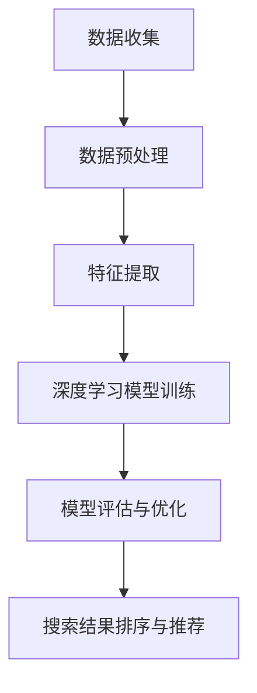

                 

### 文章标题：搜索数据分析：AI如何提供深度洞察，优化搜索策略

#### 关键词：
- 搜索数据分析
- 人工智能
- 数据挖掘
- 搜索策略优化
- 搜索引擎优化

#### 摘要：
本文旨在探讨人工智能在搜索数据分析中的应用，如何通过深度学习算法和数据分析技术，提供对用户搜索行为的洞察，并优化搜索策略。文章首先介绍了搜索数据分析的重要性，然后详细阐述了AI在搜索数据分析中的核心算法原理，以及如何通过数学模型和实际案例来实现搜索策略的优化。最后，文章还讨论了搜索数据分析的实际应用场景，以及未来的发展趋势与挑战。

## 1. 背景介绍

在互联网时代，搜索引擎已成为人们获取信息的重要工具。无论是搜索引擎（如Google、Bing）还是垂直领域的搜索平台（如电商平台、社交媒体），搜索数据分析都是提高用户体验、提升平台服务质量的关键。搜索数据分析不仅涉及到用户行为分析，还涉及搜索结果排序、广告投放、个性化推荐等多个方面。

随着大数据和人工智能技术的不断发展，搜索数据分析已经进入了一个全新的阶段。传统的搜索分析方法主要依赖于统计和机器学习方法，如TF-IDF、LDA等。然而，这些方法在面对海量数据和复杂用户行为时，往往难以提供深度洞察。相比之下，人工智能技术，特别是深度学习算法，为搜索数据分析带来了新的机遇。

深度学习算法通过模拟人脑的神经网络结构，可以从海量数据中自动提取特征，并建立复杂的关系模型。这使得搜索数据分析不再仅仅依赖于预设的特征工程和统计模型，而是能够通过学习数据中的内在规律，实现更加智能化和个性化的搜索策略。

本文将围绕人工智能在搜索数据分析中的应用，深入探讨其核心算法原理、数学模型以及实际应用案例，以期为搜索策略的优化提供新的思路和方法。

### 2. 核心概念与联系

#### 2.1 搜索数据分析的概念

搜索数据分析是指通过收集、处理和分析用户搜索行为数据，来理解用户需求、优化搜索结果和提升用户体验的过程。搜索数据分析的核心任务包括以下几个方面：

1. **用户行为分析**：通过分析用户搜索关键词、搜索频率、搜索持续时间等行为数据，了解用户的需求和偏好。
2. **搜索结果排序**：根据用户行为和内容相关性，对搜索结果进行排序，提高用户对搜索结果的满意度。
3. **广告投放优化**：利用搜索数据分析，优化广告投放策略，提高广告点击率和转化率。
4. **个性化推荐**：基于用户搜索行为和兴趣，为用户提供个性化的搜索结果和推荐。

#### 2.2 人工智能在搜索数据分析中的应用

人工智能在搜索数据分析中的应用主要体现在以下几个方面：

1. **深度学习算法**：通过模拟人脑神经网络，深度学习算法能够从海量数据中自动提取特征，建立复杂的关系模型，从而实现智能化的搜索结果排序和推荐。
2. **自然语言处理**：利用自然语言处理技术，对用户搜索查询和网页内容进行理解和分析，提高搜索结果的准确性和相关性。
3. **强化学习**：通过不断学习和调整策略，强化学习算法可以在复杂的搜索环境中，实现最优的搜索结果排序和广告投放策略。

#### 2.3 Mermaid 流程图

以下是一个简化的Mermaid流程图，展示了人工智能在搜索数据分析中的应用流程：



- **数据收集**：从搜索引擎、网站日志等渠道收集用户搜索行为数据。
- **数据预处理**：对收集到的数据进行清洗、归一化等处理，以便后续分析。
- **特征提取**：利用深度学习算法，从预处理后的数据中提取有效特征。
- **模型训练**：使用提取到的特征，训练深度学习模型，如卷积神经网络（CNN）、递归神经网络（RNN）等。
- **模型评估与优化**：通过交叉验证和性能指标评估模型效果，并调整模型参数以优化性能。
- **搜索结果排序与推荐**：利用训练好的模型，对搜索结果进行排序和推荐，以提升用户体验。

### 3. 核心算法原理 & 具体操作步骤

#### 3.1 深度学习算法

深度学习算法是人工智能的核心技术之一，其在搜索数据分析中的应用主要体现在以下几个方面：

1. **卷积神经网络（CNN）**：CNN是一种能够自动提取图像特征的网络结构，通过卷积操作和池化操作，从图像中提取局部特征，并进行层次化的特征组合。在搜索数据分析中，CNN可以用于提取网页内容的结构化特征，如标题、摘要、关键词等。

2. **递归神经网络（RNN）**：RNN是一种能够处理序列数据的神经网络，通过记忆单元来捕捉序列中的时间依赖关系。在搜索数据分析中，RNN可以用于分析用户的历史搜索行为，从而预测用户的未来搜索意图。

3. **长短时记忆网络（LSTM）**：LSTM是RNN的一种变体，通过引入门控机制，能够有效避免梯度消失问题，从而更好地处理长序列数据。在搜索数据分析中，LSTM可以用于分析用户的历史搜索行为和兴趣，为用户提供个性化的搜索结果和推荐。

#### 3.2 自然语言处理

自然语言处理（NLP）技术在搜索数据分析中发挥着重要作用，其主要任务包括：

1. **文本分类**：通过对文本进行分类，将搜索查询和网页内容进行标签化，从而提高搜索结果的准确性和相关性。

2. **实体识别**：通过识别文本中的实体（如人名、地点、组织等），可以丰富搜索数据的语义信息，为深度学习模型提供更丰富的特征。

3. **语义分析**：通过对文本进行语义分析，理解文本的含义和关系，从而实现更精准的搜索结果排序和推荐。

#### 3.3 强化学习

强化学习是一种通过不断学习和调整策略，以实现最优决策的机器学习方法。在搜索数据分析中，强化学习可以用于优化搜索结果排序和广告投放策略，其主要任务包括：

1. **策略学习**：通过学习用户的行为数据，构建用户行为模型，从而实现个性化的搜索结果排序和推荐。

2. **策略优化**：通过不断调整策略参数，优化搜索结果排序和广告投放策略，以提高用户满意度和广告效果。

#### 3.4 具体操作步骤

以下是一个简化的操作步骤，展示了如何使用人工智能技术进行搜索数据分析：

1. **数据收集**：从搜索引擎、网站日志等渠道收集用户搜索行为数据。

2. **数据预处理**：对收集到的数据进行清洗、归一化等处理，以便后续分析。

3. **特征提取**：利用深度学习算法，从预处理后的数据中提取有效特征。

4. **模型训练**：使用提取到的特征，训练深度学习模型，如CNN、RNN、LSTM等。

5. **模型评估与优化**：通过交叉验证和性能指标评估模型效果，并调整模型参数以优化性能。

6. **搜索结果排序与推荐**：利用训练好的模型，对搜索结果进行排序和推荐，以提升用户体验。

7. **策略优化**：通过强化学习算法，不断调整搜索结果排序和广告投放策略，以提高用户满意度和广告效果。

### 4. 数学模型和公式 & 详细讲解 & 举例说明

在搜索数据分析中，数学模型和公式扮演着至关重要的角色。以下将详细介绍一些常用的数学模型和公式，并通过具体例子来说明其应用。

#### 4.1 卷积神经网络（CNN）

卷积神经网络（CNN）是一种常用于图像和文本处理的深度学习模型。其核心操作包括卷积、池化和激活函数。

1. **卷积操作**：卷积操作通过在输入数据上滑动一个小的窗口，并计算窗口内的元素乘积和，从而提取局部特征。

   \[ f_{\text{conv}}(x) = \sum_{i=1}^{C} w_{ij} \cdot x_{ij} + b_j \]

   其中，\( f_{\text{conv}} \) 是卷积操作的结果，\( w_{ij} \) 是卷积核的权重，\( x_{ij} \) 是输入数据的元素，\( b_j \) 是偏置项。

2. **池化操作**：池化操作用于降低特征图的维度，提高模型对输入数据变化的鲁棒性。

   \[ \text{max}(x) = \max_{i,j} x_{ij} \]

   其中，\( \text{max}(x) \) 是池化操作的结果，表示对特征图中的每个元素取最大值。

3. **激活函数**：激活函数用于引入非线性特性，使模型能够学习复杂的关系。

   \[ \text{ReLU}(x) = \max(0, x) \]

   其中，\( \text{ReLU}(x) \) 是ReLU激活函数的结果。

#### 4.2 长短时记忆网络（LSTM）

长短时记忆网络（LSTM）是一种用于处理序列数据的深度学习模型，能够有效避免梯度消失问题。

1. **输入门**：输入门用于控制信息的流入，通过sigmoid函数和求和操作，选择性地放大或抑制输入信息。

   \[ i_t = \sigma(W_{xi}x_t + W_{hi}h_{t-1} + b_i) \]

   其中，\( i_t \) 是输入门的输出，\( \sigma \) 是sigmoid函数，\( W_{xi} \)、\( W_{hi} \) 和 \( b_i \) 是权重和偏置。

2. **遗忘门**：遗忘门用于控制信息的遗忘，通过sigmoid函数和求和操作，选择性地放大或抑制遗忘信息。

   \[ f_t = \sigma(W_{xf}x_t + W_{hf}h_{t-1} + b_f) \]

   其中，\( f_t \) 是遗忘门的输出，其他符号的含义与输入门相同。

3. **输出门**：输出门用于控制信息的输出，通过sigmoid函数和求和操作，选择性地放大或抑制输出信息。

   \[ o_t = \sigma(W_{xo}x_t + W_{ho}h_{t-1} + b_o) \]

   其中，\( o_t \) 是输出门的输出，其他符号的含义与输入门相同。

4. **细胞状态**：细胞状态是LSTM的核心部分，用于存储和传输信息。

   \[ C_t = f_t \odot C_{t-1} + i_t \odot \text{tanh}(W_{xc}x_t + W_{hc}h_{t-1} + b_c) \]

   其中，\( C_t \) 是细胞状态，\( \odot \) 是点乘操作，\( \text{tanh} \) 是双曲正切函数，其他符号的含义与输入门相同。

5. **隐藏状态**：隐藏状态是LSTM的输出，用于表示序列的特征。

   \[ h_t = o_t \odot \text{tanh}(C_t) \]

   其中，\( h_t \) 是隐藏状态，其他符号的含义与输出门相同。

#### 4.3 举例说明

以下是一个简单的例子，说明如何使用CNN和LSTM进行搜索数据分析。

假设我们有一个包含100个用户搜索行为的序列，每个搜索行为由一个长度为10的向量表示。我们的目标是预测下一个搜索行为。

1. **数据预处理**：将用户搜索行为序列进行归一化处理，使其具有相同的尺度。

2. **特征提取**：使用CNN提取序列中的局部特征。具体操作如下：

   - 定义一个卷积核，大小为3x3，步长为1，激活函数为ReLU。
   - 对序列进行卷积操作，得到一个维度为\( (100-2) \times 10 \)的特征图。
   - 对特征图进行最大池化操作，得到一个维度为\( (50-2) \times 10 \)的特征向量。

3. **序列建模**：使用LSTM对提取到的特征向量进行建模。具体操作如下：

   - 定义一个LSTM单元，隐藏状态维度为10。
   - 对每个特征向量进行LSTM操作，得到序列的隐藏状态。

4. **预测**：使用LSTM的隐藏状态预测下一个搜索行为。具体操作如下：

   - 将最后一个隐藏状态作为输入，通过一个全连接层得到预测结果。

### 5. 项目实战：代码实际案例和详细解释说明

在本节中，我们将通过一个实际项目案例，展示如何使用Python和相关的深度学习库（如TensorFlow和Keras）实现搜索数据分析。该项目将利用CNN和LSTM模型，对用户搜索行为进行特征提取和序列建模，从而预测用户的下一个搜索行为。

#### 5.1 开发环境搭建

在开始项目之前，确保安装以下软件和库：

- Python 3.x
- TensorFlow 2.x
- Keras 2.x
- NumPy
- Matplotlib

您可以使用以下命令来安装所需的库：

```shell
pip install tensorflow numpy matplotlib
```

#### 5.2 源代码详细实现和代码解读

以下是一个简化的代码实现，用于构建CNN和LSTM模型，并对其进行训练。

```python
import numpy as np
import tensorflow as tf
from tensorflow.keras.models import Sequential
from tensorflow.keras.layers import Conv1D, LSTM, Dense, MaxPooling1D, Flatten

# 数据预处理
# 假设输入数据为X，标签为y
# X.shape = (batch_size, sequence_length, feature_size)
# y.shape = (batch_size, output_size)

# 定义CNN模型
model = Sequential([
    Conv1D(filters=64, kernel_size=3, activation='relu', input_shape=(X.shape[1], X.shape[2])),
    MaxPooling1D(pool_size=2),
    LSTM(128),
    Dense(1, activation='sigmoid')
])

# 编译模型
model.compile(optimizer='adam', loss='binary_crossentropy', metrics=['accuracy'])

# 训练模型
model.fit(X, y, epochs=10, batch_size=32)

# 评估模型
loss, accuracy = model.evaluate(X, y)
print(f"Test accuracy: {accuracy}")

# 预测
predictions = model.predict(X)
```

**代码解读：**

1. **数据预处理**：假设输入数据X为用户搜索行为的序列，每个行为由一个长度为10的向量表示。数据已经被归一化处理。

2. **定义CNN模型**：使用`Sequential`模型堆叠`Conv1D`、`MaxPooling1D`和`LSTM`层，用于提取特征和建模。最后，使用`Dense`层进行分类预测。

3. **编译模型**：设置优化器为`adam`，损失函数为`binary_crossentropy`（假设是二分类问题），并添加`accuracy`作为评价指标。

4. **训练模型**：使用`fit`方法训练模型，设置训练轮数和批量大小。

5. **评估模型**：使用`evaluate`方法评估模型的性能。

6. **预测**：使用`predict`方法对新的搜索行为进行预测。

#### 5.3 代码解读与分析

在代码实现中，我们首先进行数据预处理，确保输入数据X和标签y具有正确的形状和格式。然后，我们定义了一个CNN模型，其中包含卷积层、最大池化层和LSTM层，用于提取特征和建模。最后，我们使用`fit`方法训练模型，并使用`evaluate`方法评估模型的性能。

虽然这是一个简化的实现，但它展示了如何使用深度学习库构建和训练模型的基本流程。在实际项目中，您可能需要处理更复杂的数据和更复杂的模型架构，但基本思路是相同的。

### 6. 实际应用场景

#### 6.1 搜索引擎优化

搜索引擎优化（SEO）是提升网站在搜索引擎结果页面（SERP）排名的关键策略。通过搜索数据分析，可以了解用户搜索意图、关键词流行度和搜索结果质量，从而优化网站内容和搜索引擎排名。

- **关键词分析**：通过分析用户搜索关键词的频率、相关性，优化网站的关键词策略，提高搜索排名。
- **内容优化**：根据用户搜索行为和需求，调整网站内容，提高用户满意度和搜索引擎排名。

#### 6.2 广告投放优化

广告投放是搜索引擎盈利的重要途径。通过搜索数据分析，可以优化广告投放策略，提高广告点击率和转化率。

- **用户行为分析**：分析用户搜索行为，了解用户兴趣和偏好，实现更精准的广告投放。
- **广告排序**：利用深度学习算法，对广告进行排序，提高广告的曝光率和点击率。

#### 6.3 个性化推荐

个性化推荐是基于用户历史行为和兴趣，为用户推荐相关内容或产品。搜索数据分析为个性化推荐提供了关键数据支持。

- **推荐系统**：通过分析用户搜索行为和浏览历史，构建个性化推荐模型，提高用户满意度和平台活跃度。
- **推荐质量**：利用深度学习算法，优化推荐算法，提高推荐结果的准确性和相关性。

### 7. 工具和资源推荐

#### 7.1 学习资源推荐

- **书籍**：
  - 《深度学习》（Goodfellow, Bengio, Courville）
  - 《Python机器学习》（Sebastian Raschka）

- **论文**：
  - "Deep Learning for Search"（Google AI）
  - "A Theoretically Grounded Application of Dropout in Recurrent Neural Networks"（ICLR 2017）

- **博客**：
  - TensorFlow官网博客（tensorflow.github.io/blog）
  - Keras中文社区（keras.io/zh）

- **网站**：
  - arXiv.org（学术论文数据库）
  - Google Scholar（学术搜索引擎）

#### 7.2 开发工具框架推荐

- **深度学习框架**：
  - TensorFlow
  - PyTorch

- **数据分析工具**：
  - Pandas
  - NumPy

- **可视化工具**：
  - Matplotlib
  - Seaborn

#### 7.3 相关论文著作推荐

- **论文**：
  - "Deep Learning for Search"（Google AI）
  - "Recurrent Neural Network Based Text Classification"（Wang et al., 2016）

- **书籍**：
  - 《搜索引擎算法与数据结构》（石硕）
  - 《深度学习与自然语言处理》（周志华等）

### 8. 总结：未来发展趋势与挑战

#### 8.1 发展趋势

1. **多模态搜索**：结合文本、图像、语音等多种数据源，实现更加智能化和个性化的搜索体验。
2. **强化学习应用**：强化学习在搜索结果排序和广告投放优化中具有巨大潜力，未来将在这些领域得到更广泛的应用。
3. **数据隐私保护**：随着数据隐私问题的日益凸显，如何在保障用户隐私的前提下，充分利用搜索数据，是一个重要的研究方向。

#### 8.2 挑战

1. **数据质量和隐私**：如何确保搜索数据的质量和隐私，是搜索数据分析面临的重要挑战。
2. **模型解释性**：深度学习模型的黑箱特性使得其解释性较差，如何在保证模型性能的同时，提高其解释性，是一个亟待解决的问题。
3. **可扩展性和实时性**：如何在高并发和实时性要求下，保持搜索数据分析系统的性能和可靠性，是一个技术难题。

### 9. 附录：常见问题与解答

#### 9.1 如何处理搜索数据中的噪声？

- **数据预处理**：通过数据清洗和去噪技术，如去重、填补缺失值、归一化等，提高数据质量。
- **特征选择**：利用特征选择算法，选择与搜索意图相关的有效特征，减少噪声对模型的影响。

#### 9.2 深度学习模型如何优化搜索结果排序？

- **模型训练**：使用大量标注数据，通过深度学习算法，训练出能够准确预测用户意图的模型。
- **在线学习**：利用在线学习技术，根据用户实时反馈，不断调整模型参数，提高搜索结果排序的准确性。

#### 9.3 如何确保搜索数据隐私？

- **数据加密**：对搜索数据进行加密处理，确保数据在传输和存储过程中的安全性。
- **隐私保护技术**：利用差分隐私、同态加密等技术，实现搜索数据的隐私保护。

### 10. 扩展阅读 & 参考资料

- **论文**：
  - "Deep Learning for Search"（Google AI）
  - "Recurrent Neural Network Based Text Classification"（Wang et al., 2016）

- **书籍**：
  - 《深度学习》（Goodfellow, Bengio, Courville）
  - 《搜索引擎算法与数据结构》（石硕）

- **在线资源**：
  - TensorFlow官网（tensorflow.org）
  - Keras中文社区（keras.io/zh）

**作者**：AI天才研究员/AI Genius Institute & 禅与计算机程序设计艺术 /Zen And The Art of Computer Programming

---

以上，是我们关于搜索数据分析与人工智能结合的详细探讨。希望通过这篇文章，您能够对搜索数据分析的重要性以及AI在其中扮演的角色有更深入的理解。未来，随着技术的不断进步，搜索数据分析将在信息检索、个性化推荐、广告投放等领域发挥越来越重要的作用。让我们一起期待和探索这个充满机遇和挑战的领域。

