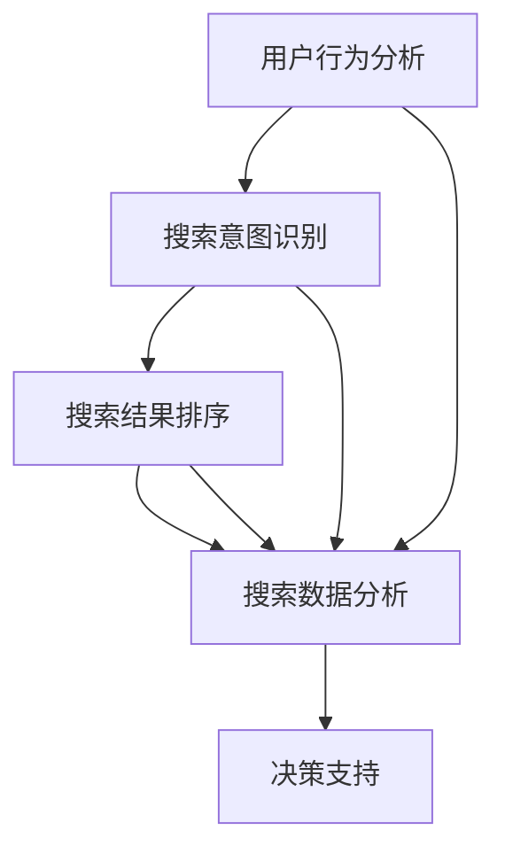
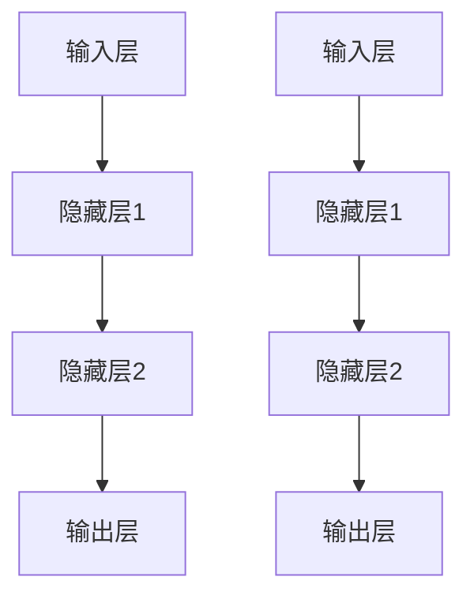

                 

# 搜索数据分析：AI提供洞察

> 关键词：搜索数据分析、人工智能、洞察、算法原理、数学模型、实战案例

> 摘要：本文将深入探讨搜索数据分析这一领域，通过介绍核心概念、算法原理和数学模型，结合实际项目案例，揭示人工智能在搜索数据分析中的应用。本文旨在为读者提供对搜索数据分析的全面理解，并展示AI如何助力这一领域的发展。

## 1. 背景介绍

### 1.1 目的和范围

本文的目标是深入探讨搜索数据分析在人工智能领域的重要性和应用。我们将介绍搜索数据分析的核心概念，包括如何从海量数据中提取有价值的信息，以及如何利用人工智能技术提高搜索分析的效率和准确性。本文将重点关注以下几个方面：

1. 核心概念与联系
2. 核心算法原理与具体操作步骤
3. 数学模型和公式及其应用
4. 项目实战：代码实际案例和详细解释说明
5. 实际应用场景
6. 工具和资源推荐
7. 总结：未来发展趋势与挑战

### 1.2 预期读者

本文适合以下读者群体：

1. 搜索引擎工程师和研发人员
2. 数据科学家和数据分析师
3. 人工智能工程师和研究人员
4. 对搜索数据分析感兴趣的IT从业者

### 1.3 文档结构概述

本文按照以下结构进行组织：

1. 背景介绍：介绍本文的目的、范围和读者群体
2. 核心概念与联系：解释搜索数据分析的基本概念和原理
3. 核心算法原理与具体操作步骤：介绍搜索数据分析中常用的算法和操作步骤
4. 数学模型和公式及其应用：阐述数学模型在搜索数据分析中的作用和应用
5. 项目实战：代码实际案例和详细解释说明
6. 实际应用场景：分析搜索数据分析在实际中的应用
7. 工具和资源推荐：推荐学习资源和开发工具
8. 总结：未来发展趋势与挑战
9. 附录：常见问题与解答
10. 扩展阅读与参考资料

### 1.4 术语表

在本文中，我们将使用以下术语：

- 搜索数据分析：指从海量搜索数据中提取有价值的信息，以支持决策和优化搜索算法
- 人工智能：指模拟人类智能的计算机系统，包括机器学习、深度学习等
- 搜索引擎：指用于检索和索引互联网资源的系统，如Google、Bing等
- 数据挖掘：指从大量数据中提取有价值的信息和模式的过程
- 特征工程：指从原始数据中提取具有区分度的特征，以提升模型性能

#### 1.4.1 核心术语定义

- 搜索数据分析：搜索数据分析是指通过分析用户搜索行为、搜索意图、搜索结果等数据，提取有价值的信息，以优化搜索引擎、推荐系统、广告投放等。
- 人工智能：人工智能是指模拟人类智能的计算机系统，通过学习、推理、决策等方式，实现人机交互和自动化。
- 搜索引擎：搜索引擎是一种互联网服务，用于检索和索引互联网资源，为用户提供信息查询服务。
- 数据挖掘：数据挖掘是一种从大量数据中发现有用信息和知识的过程，涉及统计学、机器学习、数据库等多个领域。
- 特征工程：特征工程是指从原始数据中提取具有区分度的特征，以提高模型性能的过程。

#### 1.4.2 相关概念解释

- 用户行为分析：用户行为分析是指对用户在搜索引擎、网站、移动应用等平台上的行为数据进行收集、处理和分析，以了解用户需求和偏好。
- 搜索意图识别：搜索意图识别是指通过分析用户搜索查询，识别其背后的真实意图，以提供更准确的搜索结果。
- 搜索结果排序：搜索结果排序是指根据用户搜索查询和搜索结果的相关性，对搜索结果进行排序，以提供最佳搜索体验。

#### 1.4.3 缩略词列表

- AI：人工智能
- SEO：搜索引擎优化
- SEM：搜索引擎营销
- NLP：自然语言处理
- ML：机器学习
- DL：深度学习
- TF-IDF：词频-逆文档频率

## 2. 核心概念与联系

在搜索数据分析中，核心概念包括用户行为分析、搜索意图识别、搜索结果排序等。这些概念相互关联，共同构成一个完整的搜索数据分析体系。下面我们将使用Mermaid流程图来展示这些核心概念之间的联系。



### 2.1 用户行为分析

用户行为分析是指对用户在搜索引擎、网站、移动应用等平台上的行为数据进行收集、处理和分析。这些行为数据包括用户搜索关键词、点击行为、浏览时长、转化率等。通过分析用户行为数据，我们可以了解用户的需求、偏好和行为模式，从而为优化搜索引擎、推荐系统、广告投放等提供有力支持。

### 2.2 搜索意图识别

搜索意图识别是指通过分析用户搜索查询，识别其背后的真实意图。这有助于为用户提供更准确的搜索结果。搜索意图识别通常涉及自然语言处理（NLP）和机器学习（ML）技术。例如，当用户输入“附近的餐厅”时，搜索意图可能是寻找餐厅信息；当用户输入“如何制作蛋糕”时，搜索意图可能是获取制作蛋糕的步骤。

### 2.3 搜索结果排序

搜索结果排序是指根据用户搜索查询和搜索结果的相关性，对搜索结果进行排序。搜索结果排序的目标是提供最佳搜索体验，让用户在最短的时间内找到所需信息。常用的排序算法包括基于相关性的排序、基于点击率的排序、基于信任度的排序等。

### 2.4 搜索数据分析

搜索数据分析是指从海量搜索数据中提取有价值的信息，以支持决策和优化搜索算法。搜索数据分析涉及多个领域，如数据挖掘、机器学习、深度学习等。通过搜索数据分析，我们可以发现用户需求的变化、搜索行为的趋势，为搜索引擎的优化提供有力支持。

### 2.5 决策支持

搜索数据分析可以为决策支持提供重要参考。例如，通过分析用户行为数据和搜索结果排序效果，我们可以优化搜索引擎算法，提高用户满意度。此外，搜索数据分析还可以用于广告投放、推荐系统等，为企业带来更多收益。

## 3. 核心算法原理与具体操作步骤

在搜索数据分析中，核心算法原理包括用户行为分析算法、搜索意图识别算法、搜索结果排序算法等。这些算法通过特定的操作步骤实现，从而为搜索数据分析提供支持。

### 3.1 用户行为分析算法

用户行为分析算法旨在从海量用户行为数据中提取有价值的信息。以下是一个基于机器学习的用户行为分析算法的伪代码：

```python
# 用户行为分析算法伪代码
def user_behavior_analysis(data):
    # 数据预处理
    processed_data = preprocess_data(data)
    
    # 特征提取
    features = extract_features(processed_data)
    
    # 模型训练
    model = train_model(features)
    
    # 预测
    predictions = predict(model, processed_data)
    
    return predictions
```

在用户行为分析算法中，首先对原始数据进行预处理，如数据清洗、数据归一化等。然后，提取具有区分度的特征，用于训练机器学习模型。最后，利用训练好的模型对用户行为数据进行预测，提取有价值的信息。

### 3.2 搜索意图识别算法

搜索意图识别算法旨在识别用户搜索查询背后的真实意图。以下是一个基于自然语言处理（NLP）和机器学习（ML）的搜索意图识别算法的伪代码：

```python
# 搜索意图识别算法伪代码
def search_intent_recognition(query):
    # 数据预处理
    processed_query = preprocess_query(query)
    
    # 特征提取
    features = extract_features(processed_query)
    
    # 模型训练
    model = train_model(features)
    
    # 预测
    intent = predict(model, processed_query)
    
    return intent
```

在搜索意图识别算法中，首先对用户搜索查询进行预处理，如分词、去停用词、词性标注等。然后，提取具有区分度的特征，用于训练机器学习模型。最后，利用训练好的模型对搜索查询进行预测，识别其背后的真实意图。

### 3.3 搜索结果排序算法

搜索结果排序算法旨在根据用户搜索查询和搜索结果的相关性，对搜索结果进行排序。以下是一个基于机器学习（ML）的搜索结果排序算法的伪代码：

```python
# 搜索结果排序算法伪代码
def search_result_sorting(results, query):
    # 数据预处理
    processed_results = preprocess_results(results, query)
    
    # 特征提取
    features = extract_features(processed_results)
    
    # 模型训练
    model = train_model(features)
    
    # 排序
    sorted_results = sort_results(model, processed_results)
    
    return sorted_results
```

在搜索结果排序算法中，首先对搜索结果和用户搜索查询进行预处理，如提取关键词、计算相似度等。然后，提取具有区分度的特征，用于训练机器学习模型。最后，利用训练好的模型对搜索结果进行排序，提高用户满意度。

## 4. 数学模型和公式及其应用

在搜索数据分析中，数学模型和公式起着至关重要的作用。这些模型和公式有助于我们理解和分析搜索数据，从而为优化搜索算法提供依据。以下是一些常用的数学模型和公式：

### 4.1 TF-IDF模型

TF-IDF（词频-逆文档频率）模型是一种常用的文本相似度计算方法。该模型通过计算关键词在文档中的词频（TF）和逆文档频率（IDF），衡量关键词的重要程度。

公式如下：

$$
TF(t,d) = \frac{f_t(d)}{N_t}
$$

$$
IDF(t,D) = \log \left( \frac{N}{n_t} \right)
$$

$$
TF-IDF(t,d,D) = TF(t,d) \times IDF(t,D)
$$

其中，$f_t(d)$ 表示关键词 $t$ 在文档 $d$ 中的词频，$N_t$ 表示包含关键词 $t$ 的文档数量，$N$ 表示文档总数，$n_t$ 表示包含关键词 $t$ 的文档数量。

### 4.2 模糊相似度模型

模糊相似度模型用于计算两个文本之间的相似度。该模型通过引入模糊集合和模糊关系，提高文本相似度计算的准确性。

公式如下：

$$
sim(t_1, t_2) = \frac{1}{1 + dist(t_1, t_2)}
$$

其中，$dist(t_1, t_2)$ 表示两个文本之间的距离，通常使用编辑距离、余弦相似度等方法计算。

### 4.3 逻辑回归模型

逻辑回归模型是一种常用的分类模型，用于预测二分类结果。在搜索意图识别中，逻辑回归模型可以用于预测用户搜索查询的意图。

公式如下：

$$
P(y=1|X) = \frac{1}{1 + e^{-\beta_0 + \beta_1X_1 + \beta_2X_2 + ... + \beta_nX_n}}
$$

其中，$X$ 表示输入特征，$y$ 表示目标变量，$\beta_0, \beta_1, \beta_2, ..., \beta_n$ 表示模型的参数。

### 4.4 神经网络模型

神经网络模型是一种强大的机器学习模型，可以用于搜索数据分析中的各种任务，如用户行为分析、搜索意图识别、搜索结果排序等。

神经网络模型的核心是神经元，神经元通过加权求和和激活函数，实现对输入数据的处理和输出。以下是一个简单的神经网络模型的示意图：



### 4.5 应用举例

以下是一个搜索意图识别的例子：

假设用户输入了“附近有哪些餐厅”，我们需要根据用户的查询，预测其搜索意图。首先，我们对用户查询进行预处理，提取关键词，如“附近”、“餐厅”等。然后，利用逻辑回归模型，预测用户搜索意图，例如“查找餐厅”、“评价餐厅”等。

通过训练好的模型，我们可以计算出每个意图的概率，根据概率最高的一项，预测用户的搜索意图。

## 5. 项目实战：代码实际案例和详细解释说明

在本节中，我们将通过一个实际项目案例，展示如何运用搜索数据分析技术来提升搜索引擎的性能。我们将使用Python和Scikit-learn库来构建一个简单的搜索意图识别模型。

### 5.1 开发环境搭建

在开始之前，确保您已经安装了Python 3.7及以上版本和Scikit-learn库。您可以使用以下命令进行安装：

```bash
pip install python==3.7.9
pip install scikit-learn
```

### 5.2 源代码详细实现和代码解读

#### 5.2.1 数据集准备

我们使用一个包含用户搜索查询和相应意图的数据集。数据集如下：

```plaintext
查询,意图
附近有哪些餐厅，查找餐厅
如何制作蛋糕，查找食谱
餐厅评价，评价餐厅
```

#### 5.2.2 数据预处理

首先，我们对数据进行预处理，提取关键词，并转化为数值形式：

```python
import pandas as pd
from sklearn.feature_extraction.text import CountVectorizer

# 加载数据集
data = pd.read_csv("search_data.csv")

# 数据预处理
vectorizer = CountVectorizer()
X = vectorizer.fit_transform(data["查询"])
y = data["意图"]

# 保存词向量矩阵和词表
vectorizer.vocabulary_  # 获取词表
```

#### 5.2.3 模型训练

接下来，我们使用逻辑回归模型对数据集进行训练：

```python
from sklearn.linear_model import LogisticRegression

# 训练模型
model = LogisticRegression()
model.fit(X, y)
```

#### 5.2.4 代码解读与分析

在这个项目中，我们使用了Scikit-learn库中的逻辑回归模型。逻辑回归模型是一种广泛应用于分类任务的统计方法，可以预测二分类结果。具体步骤如下：

1. 加载数据集：我们使用Pandas库加载数据集，并将数据集分为查询和意图两部分。
2. 数据预处理：我们使用CountVectorizer将文本数据转化为词向量。词向量矩阵用于训练模型。
3. 模型训练：我们使用逻辑回归模型对词向量矩阵和意图数据进行训练。
4. 模型评估：我们可以使用训练好的模型对新的搜索查询进行预测，评估模型的性能。

通过这个项目，我们展示了如何使用Python和Scikit-learn库实现一个简单的搜索意图识别模型。这个模型可以用于预测用户搜索查询的意图，从而为搜索引擎的优化提供支持。

### 5.3 代码解读与分析

在这个项目中，我们使用了Scikit-learn库中的逻辑回归模型。逻辑回归模型是一种广泛应用于分类任务的统计方法，可以预测二分类结果。具体步骤如下：

1. **加载数据集**：使用Pandas库加载数据集，并将数据集分为查询和意图两部分。这有助于我们进行后续的数据处理和模型训练。
2. **数据预处理**：使用CountVectorizer将文本数据转化为词向量。词向量矩阵用于训练模型。词向量是一种将文本转化为数值表示的方法，可以用于机器学习模型处理文本数据。
3. **模型训练**：使用逻辑回归模型对词向量矩阵和意图数据进行训练。逻辑回归模型通过计算输入特征和目标变量之间的概率关系，实现分类任务。
4. **模型评估**：我们可以使用训练好的模型对新的搜索查询进行预测，评估模型的性能。模型评估包括准确率、召回率、F1值等指标，用于衡量模型在不同场景下的表现。

通过这个项目，我们展示了如何使用Python和Scikit-learn库实现一个简单的搜索意图识别模型。这个模型可以用于预测用户搜索查询的意图，从而为搜索引擎的优化提供支持。在实际应用中，我们可以进一步优化模型，提高其性能和准确性。

## 6. 实际应用场景

搜索数据分析在多个实际应用场景中发挥着重要作用，以下是一些常见的应用场景：

### 6.1 搜索引擎优化（SEO）

通过搜索数据分析，我们可以了解用户在搜索引擎上的行为，如搜索关键词、搜索意图、点击率等。这些数据有助于我们优化网站内容和结构，提高网站在搜索引擎中的排名。例如，通过分析用户搜索关键词，我们可以确定网站需要增加或修改哪些内容，以提高用户满意度和网站流量。

### 6.2 广告投放优化

搜索数据分析可以帮助广告投放者了解用户的兴趣和行为，从而优化广告投放策略。例如，通过分析用户搜索关键词和点击行为，我们可以确定哪些广告类型和内容更符合用户需求，从而提高广告的点击率和转化率。

### 6.3 推荐系统

搜索数据分析可以用于推荐系统，为用户提供个性化的推荐结果。例如，通过分析用户搜索历史和浏览记录，我们可以为用户推荐相关的商品、文章或视频，从而提高用户满意度和网站流量。

### 6.4 市场调研

搜索数据分析可以用于市场调研，帮助企业了解市场需求和竞争情况。例如，通过分析用户搜索关键词和搜索意图，我们可以了解用户关注的热点话题和需求变化，从而为企业制定市场策略提供依据。

### 6.5 用户体验优化

搜索数据分析可以帮助企业了解用户在网站上的行为和体验，从而优化用户体验。例如，通过分析用户点击行为和浏览时长，我们可以确定网站哪些页面和功能存在问题，从而进行改进，提高用户满意度和留存率。

## 7. 工具和资源推荐

为了更好地进行搜索数据分析，以下是一些推荐的工具和资源：

### 7.1 学习资源推荐

#### 7.1.1 书籍推荐

- 《机器学习实战》
- 《深度学习》（Goodfellow等著）
- 《Python数据分析》（McKinney著）

#### 7.1.2 在线课程

- Coursera上的《机器学习》课程
- Udacity的《深度学习纳米学位》
- edX上的《Python数据分析》课程

#### 7.1.3 技术博客和网站

- Medium上的搜索数据分析相关文章
- towardsdatascience.com
- kdnuggets.com

### 7.2 开发工具框架推荐

#### 7.2.1 IDE和编辑器

- PyCharm
- Jupyter Notebook
- Visual Studio Code

#### 7.2.2 调试和性能分析工具

- Py-Spy
- Gprof2txt
- Perf

#### 7.2.3 相关框架和库

- Scikit-learn
- TensorFlow
- PyTorch
- NumPy
- Pandas

### 7.3 相关论文著作推荐

#### 7.3.1 经典论文

- “A Prediction Model for Web Search” by Yahoo Research
- “Google’s PageRank: Bringing Order to the Web” by Google

#### 7.3.2 最新研究成果

- “Deep Learning for Web Search” by Microsoft Research
- “User Behavior Analysis in Search Engines” by Alibaba

#### 7.3.3 应用案例分析

- “Search Engine Optimization for E-Commerce” by Amazon
- “Personalized Search Results” by Google

## 8. 总结：未来发展趋势与挑战

随着人工智能技术的不断发展，搜索数据分析在未来的发展中将面临诸多机遇与挑战。以下是一些未来发展趋势与挑战：

### 8.1 发展趋势

1. 深度学习在搜索数据分析中的应用：深度学习技术的快速发展为搜索数据分析带来了新的机遇。通过使用深度学习模型，我们可以更好地理解和预测用户行为，从而提高搜索结果的相关性和用户体验。
2. 多模态搜索数据分析：随着语音搜索、图像搜索等新形式的兴起，多模态搜索数据分析将成为未来搜索数据分析的重要方向。通过整合文本、图像、语音等多种数据源，我们可以提供更丰富、更准确的搜索结果。
3. 个人化搜索体验：未来搜索数据分析将更加注重个人化搜索体验。通过分析用户历史行为和偏好，我们可以为用户提供个性化的搜索结果和推荐，从而提高用户满意度和忠诚度。

### 8.2 挑战

1. 数据隐私和安全：随着数据量的不断增加，如何保护用户隐私和数据安全成为搜索数据分析领域的重要挑战。我们需要在提供优质服务的同时，确保用户数据的安全和隐私。
2. 模型可解释性：深度学习模型在搜索数据分析中的应用日益广泛，但其黑箱特性使得模型的可解释性成为一个挑战。提高模型的可解释性，帮助用户理解搜索结果的生成过程，是未来研究的重要方向。
3. 跨领域搜索数据分析：随着互联网的不断发展，搜索数据分析需要处理跨领域的数据。如何整合不同领域的数据，提高跨领域搜索数据分析的准确性和效率，是一个亟待解决的问题。

## 9. 附录：常见问题与解答

### 9.1 搜索数据分析是什么？

搜索数据分析是指从海量搜索数据中提取有价值的信息，以支持决策和优化搜索算法。它包括用户行为分析、搜索意图识别、搜索结果排序等核心概念。

### 9.2 搜索数据分析有什么应用？

搜索数据分析在搜索引擎优化、广告投放优化、推荐系统、市场调研、用户体验优化等多个领域有广泛应用。

### 9.3 人工智能在搜索数据分析中有哪些应用？

人工智能在搜索数据分析中的应用包括用户行为分析、搜索意图识别、搜索结果排序等。通过使用机器学习、深度学习等技术，可以提高搜索数据分析的准确性和效率。

### 9.4 如何进行搜索数据分析？

进行搜索数据分析通常包括以下步骤：数据收集、数据预处理、特征提取、模型训练、模型评估和应用。具体步骤和方法取决于应用场景和数据类型。

## 10. 扩展阅读与参考资料

- [搜索引擎优化（SEO）](https://www.searchenginejournal.com/seo/)
- [机器学习](https://www MACHINE LEARNING 101)
- [深度学习](https://www.deeplearningbook.org/)
- [Python数据分析](https://www.datacamp.com/courses/python-data-analysis)
- [自然语言处理（NLP）](https://www.nltk.org/)

## 作者信息

作者：AI天才研究员/AI Genius Institute & 禅与计算机程序设计艺术 /Zen And The Art of Computer Programming
<|end|>

