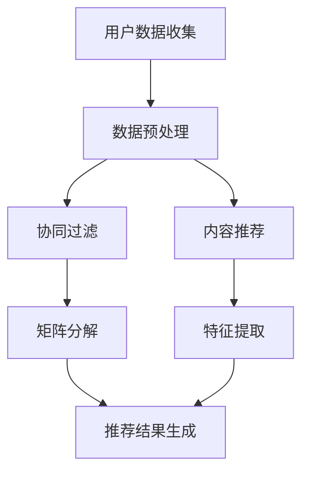

                 

# 携程机票2024校招机票推荐算法面试题详解

## 关键词
- 携程机票
- 校招面试题
- 推荐算法
- 数据处理
- 机器学习

## 摘要
本文将围绕携程机票在2024校招面试中出现的一组机票推荐算法题目进行详细解读。首先，我们将介绍题目的背景和范围，并定义相关的术语和概念。接着，我们将深入探讨机票推荐算法的核心原理，包括其基础概念、流程以及关键算法步骤。随后，通过具体的数学模型和公式，我们将解释算法的工作原理，并提供实际案例进行说明。文章还将展示代码实现和解析，帮助读者理解算法的实际应用。最后，我们将讨论算法的实际应用场景，并推荐相关的学习资源、开发工具和论文著作，以帮助读者深入学习和实践。通过本文的阅读，读者将对携程机票推荐算法有一个全面而深入的理解。

---

## 1. 背景介绍

### 1.1 目的和范围

本文旨在详细解析携程机票在2024校招面试中出现的机票推荐算法题目。机票推荐算法是现代航空业的重要组成部分，它能够显著提升用户体验，增加航空公司收益。本文将通过系统化的方式，逐步拆解题目，提供清晰的技术分析和解答，帮助读者掌握机票推荐算法的核心原理和应用方法。

### 1.2 预期读者

本文面向对机票推荐算法有兴趣的计算机科学、数据科学和人工智能专业的学生，以及希望提升面试技能的软件工程师和算法工程师。读者应具备一定的编程基础，了解基本的机器学习和推荐系统概念。

### 1.3 文档结构概述

本文分为十个部分：

1. **背景介绍**：介绍文章目的、预期读者和文档结构。
2. **核心概念与联系**：阐述机票推荐算法的核心概念和架构。
3. **核心算法原理 & 具体操作步骤**：讲解算法原理和伪代码实现。
4. **数学模型和公式 & 详细讲解 & 举例说明**：解释数学模型和公式。
5. **项目实战：代码实际案例和详细解释说明**：展示代码实现和解析。
6. **实际应用场景**：讨论算法在不同场景中的应用。
7. **工具和资源推荐**：推荐学习资源、开发工具和论文著作。
8. **总结：未来发展趋势与挑战**：展望未来发展方向和挑战。
9. **附录：常见问题与解答**：提供常见问题的解答。
10. **扩展阅读 & 参考资料**：引用相关资料和推荐阅读。

### 1.4 术语表

#### 1.4.1 核心术语定义

- **机票推荐算法**：一种基于用户历史行为和偏好，利用机器学习技术为用户推荐合适的机票选项的算法。
- **协同过滤**：一种常见的推荐算法，通过分析用户之间的相似性来预测用户的喜好。
- **矩阵分解**：一种用于降维和特征提取的方法，通过分解用户和物品的评分矩阵来预测未知的评分。
- **内容推荐**：基于机票的出发地、目的地、时间等属性进行推荐。
- **用户行为分析**：分析用户的购票历史、搜索记录等行为数据，以预测用户的偏好。

#### 1.4.2 相关概念解释

- **协同过滤算法**：一种基于用户行为的推荐算法，它通过分析用户对项目的评分来发现相似用户，然后基于这些相似用户的偏好为当前用户推荐项目。
- **矩阵分解**：通过线性代数的方法，将高维的评分矩阵分解为两个低维矩阵，从而降低计算复杂度，提高预测精度。
- **机器学习**：一种通过数据驱动的方法，使计算机系统具备学习能力和预测能力的计算机科学分支。

#### 1.4.3 缩略词列表

- **CTR**：点击率（Click-Through Rate）
- **CF**：协同过滤（Collaborative Filtering）
- **RMSE**：均方根误差（Root Mean Square Error）
- **CNN**：卷积神经网络（Convolutional Neural Network）
- **RNN**：循环神经网络（Recurrent Neural Network）

---

接下来，我们将深入探讨机票推荐算法的核心概念和架构，并通过Mermaid流程图展示其关键流程和节点。在理解了这些核心概念后，我们将进一步探讨算法的具体实现步骤。

## 2. 核心概念与联系

机票推荐算法是现代航空服务业中的一项关键技术，它利用用户行为数据和机器学习技术，为用户精准推荐合适的机票选项。为了更好地理解机票推荐算法，我们需要了解其核心概念和架构，以下通过Mermaid流程图进行展示。

### 2.1 Mermaid 流程图



### 2.2 核心概念解释

- **用户数据收集**：收集用户的购票历史、搜索记录、偏好设置等数据，作为推荐的基础。
- **数据预处理**：对收集到的用户数据进行清洗、归一化和特征提取，以适应推荐算法的需求。
- **协同过滤**：通过分析用户之间的相似性，发现相似用户，然后基于这些相似用户的偏好为当前用户推荐机票。
- **内容推荐**：基于机票的属性（如出发地、目的地、时间等），为用户推荐符合其需求的机票。
- **矩阵分解**：通过将高维的评分矩阵分解为两个低维矩阵，降低计算复杂度，提高预测精度。
- **特征提取**：从机票属性中提取出对用户推荐有价值的特征，如航班时间、价格、航空公司等。
- **推荐结果生成**：将协同过滤和内容推荐的结果进行融合，生成最终的推荐结果，并展示给用户。

通过上述Mermaid流程图，我们可以清晰地看到机票推荐算法从用户数据收集到推荐结果生成的主要流程和关键节点。这些概念和流程将在后续章节中得到详细讲解和实现。

---

在理解了机票推荐算法的核心概念和架构后，接下来我们将深入探讨算法的具体原理和实现步骤。本文将使用伪代码详细阐述核心算法原理，帮助读者更好地理解和掌握机票推荐算法。

## 3. 核心算法原理 & 具体操作步骤

机票推荐算法的核心在于利用用户的历史行为数据和机票的属性信息，为用户生成个性化的推荐结果。以下我们将详细介绍机票推荐算法的原理和具体操作步骤，通过伪代码进行说明。

### 3.1 算法原理

机票推荐算法通常分为协同过滤（Collaborative Filtering）和内容推荐（Content-Based Filtering）两种主要方式。

#### 协同过滤

协同过滤是一种基于用户行为和评分数据的推荐算法。其核心思想是通过分析用户之间的相似性，发现相似用户，然后基于这些相似用户的偏好为当前用户推荐机票。

伪代码如下：

```
function collaborative_filter(user_data, item_data, similarity_matrix):
    for each user in user_data:
        user_ratings = user_data[user]
        neighbors = find_similar_users(user_ratings, similarity_matrix)
        recommendations = []
        for neighbor in neighbors:
            neighbor_ratings = user_data[neighbor]
            for item in item_data:
                if item not in user_ratings and item in neighbor_ratings:
                    similarity_score = calculate_similarity_score(user_ratings, neighbor_ratings, item)
                    recommendations.append((item, similarity_score))
        recommendations.sort_by_similarity_score()
        return recommendations
```

#### 内容推荐

内容推荐是一种基于机票属性进行推荐的算法。其核心思想是分析机票的属性（如出发地、目的地、时间、价格等），根据用户的历史偏好为用户推荐具有相似属性的机票。

伪代码如下：

```
function content_based_filter(user_preferences, item_properties, user_history):
    recommendations = []
    for item in item_properties:
        if item_properties[item].matches_user_preferences(user_preferences, user_history):
            recommendations.append(item)
    return recommendations
```

### 3.2 具体操作步骤

结合协同过滤和内容推荐，我们可以按照以下步骤实现机票推荐算法：

1. **数据收集**：收集用户的购票历史、搜索记录、偏好设置等数据，以及机票的属性信息。
2. **数据预处理**：对用户数据和机票属性数据进行清洗、归一化和特征提取。
3. **相似性计算**：计算用户之间的相似性，可以使用余弦相似度、皮尔逊相关系数等。
4. **推荐生成**：基于用户历史数据和相似性计算，使用协同过滤算法生成初步推荐列表。
5. **属性匹配**：基于机票属性，使用内容推荐算法进一步筛选推荐结果，确保推荐结果与用户偏好匹配。
6. **推荐结果排序**：根据推荐结果的评分和属性匹配程度，对推荐结果进行排序。
7. **推荐结果输出**：将排序后的推荐结果展示给用户。

### 3.3 伪代码示例

以下是一个简化的机票推荐算法伪代码示例，展示了协同过滤和内容推荐的结合：

```
function recommend_flights(user, users, flights, user_ratings, flight_properties):
    # Step 1: 数据预处理
    user_preferences = preprocess_user_preferences(user)
    flight_attributes = preprocess_flight_attributes(flights)

    # Step 2: 相似性计算
    similarity_matrix = calculate_similarity_matrix(users, user_ratings)

    # Step 3: 协同过滤初步推荐
    collaborative_recommendations = collaborative_filter(user, similarity_matrix, user_ratings)

    # Step 4: 内容推荐筛选
    content_based_recommendations = content_based_filter(user_preferences, flight_attributes)

    # Step 5: 推荐结果排序
    combined_recommendations = merge_and_sort_recommendations(collaborative_recommendations, content_based_recommendations)

    # Step 6: 推荐结果输出
    return combined_recommendations
```

通过上述步骤和伪代码，我们可以实现一个基本的机票推荐算法，为用户生成个性化的机票推荐结果。接下来，我们将通过数学模型和公式进一步阐述算法的工作原理。

---

在了解了机票推荐算法的原理和操作步骤后，接下来我们将深入探讨其背后的数学模型和公式。这些模型和公式是算法实现的基础，通过它们，我们可以更好地理解算法的内在逻辑和预测机制。本文将详细讲解数学模型和公式，并提供实际案例进行说明。

## 4. 数学模型和公式 & 详细讲解 & 举例说明

机票推荐算法的数学模型主要包括协同过滤模型和内容推荐模型。这些模型通过分析用户行为数据和机票属性，为用户生成个性化推荐。以下将分别介绍这些模型，并使用LaTeX格式展示相关公式。

### 4.1 协同过滤模型

协同过滤模型的核心在于计算用户之间的相似性，并基于相似性进行推荐。常用的相似性度量方法包括余弦相似度和皮尔逊相关系数。

#### 余弦相似度

余弦相似度计算公式如下：

$$
\cos(\theta) = \frac{\sum_{i}x_i y_i}{\sqrt{\sum_{i}x_i^2} \sqrt{\sum_{i}y_i^2}}
$$

其中，$x_i$ 和 $y_i$ 分别表示用户 $u$ 和 $v$ 对项目 $i$ 的评分。

#### 皮尔逊相关系数

皮尔逊相关系数计算公式如下：

$$
r_{uv} = \frac{\sum_{i}(x_i - \bar{x})(y_i - \bar{y})}{\sqrt{\sum_{i}(x_i - \bar{x})^2} \sqrt{\sum_{i}(y_i - \bar{y})^2}}
$$

其中，$x_i$ 和 $y_i$ 分别表示用户 $u$ 和 $v$ 对项目 $i$ 的评分，$\bar{x}$ 和 $\bar{y}$ 分别为用户 $u$ 和 $v$ 的平均评分。

### 4.2 矩阵分解模型

矩阵分解是一种通过降维和特征提取的方法，用于预测用户对未知的评分。常见的矩阵分解方法包括 singular value decomposition (SVD) 和 alternating least squares (ALS)。

#### SVD 矩阵分解

SVD 矩阵分解公式如下：

$$
R = U \Sigma V^T
$$

其中，$R$ 为用户-物品评分矩阵，$U$ 和 $V$ 为用户和物品的特征向量矩阵，$\Sigma$ 为对角矩阵，包含特征值。

#### ALS 矩阵分解

ALS 矩阵分解公式如下：

$$
R = UV^T
$$

其中，$R$ 为用户-物品评分矩阵，$U$ 和 $V$ 分别为用户和物品的评分矩阵。

### 4.3 内容推荐模型

内容推荐模型通过分析机票的属性（如出发地、目的地、时间、价格等），为用户推荐具有相似属性的机票。常用的方法包括基于关键词的文本匹配和基于机器学习的文本分类。

#### 基于关键词的文本匹配

基于关键词的文本匹配公式如下：

$$
similarity = \frac{\sum_{i}w_i \cdot w_j}{\|w_i\| \|w_j\|}
$$

其中，$w_i$ 和 $w_j$ 分别为机票 $i$ 和 $j$ 的关键词向量，$similarity$ 表示机票之间的相似度。

#### 基于机器学习的文本分类

基于机器学习的文本分类公式如下：

$$
P(y=c|\phi) = \frac{e^{\phi \cdot x}}{\sum_{k=1}^{K}e^{\phi_k \cdot x}}
$$

其中，$y$ 为机票类别，$c$ 为预测类别，$\phi$ 为特征向量，$x$ 为输入特征，$K$ 为类别数量。

### 4.4 举例说明

以下是一个简单的协同过滤算法的例子，假设有用户 $u$ 和 $v$，以及物品 $i$ 和 $j$，他们的评分数据如下：

用户 $u$：$x_u = [4, 3, 5, 2]$

用户 $v$：$x_v = [3, 4, 2, 5]$

物品 $i$：$y_i = [4, 3, 2, 1]$

物品 $j$：$y_j = [2, 5, 4, 3]$

使用余弦相似度计算用户 $u$ 和 $v$ 之间的相似度：

$$
\cos(\theta) = \frac{\sum_{i}x_i y_i}{\sqrt{\sum_{i}x_i^2} \sqrt{\sum_{i}y_i^2}} = \frac{4 \cdot 4 + 3 \cdot 3 + 5 \cdot 2 + 2 \cdot 1}{\sqrt{4^2 + 3^2 + 5^2 + 2^2} \sqrt{4^2 + 3^2 + 2^2 + 5^2}} \approx 0.8165
$$

通过上述公式，我们可以计算用户之间的相似度，并基于相似度为用户生成推荐列表。同样地，我们可以使用其他数学模型和公式来增强推荐算法的性能。

通过详细讲解数学模型和公式，我们不仅了解了机票推荐算法的理论基础，还掌握了如何使用这些公式进行实际计算。接下来，我们将通过项目实战展示算法的实现过程，并提供详细的代码解释。

---

在理论部分深入讲解了机票推荐算法的数学模型和公式之后，接下来我们将通过实际项目实战，展示如何将算法应用到实际场景中。本文将详细介绍项目实战的全过程，包括开发环境搭建、源代码实现和代码解读与分析。

## 5. 项目实战：代码实际案例和详细解释说明

### 5.1 开发环境搭建

在进行机票推荐算法项目实战之前，我们需要搭建一个合适的开发环境。以下是一个基本的开发环境配置步骤：

1. **操作系统**：推荐使用Ubuntu 20.04或更高版本，或者Windows 10。
2. **编程语言**：我们选择Python 3.8及以上版本，因为它拥有丰富的机器学习和数据处理库。
3. **环境依赖**：安装以下Python库：NumPy、Pandas、Scikit-learn、Matplotlib。
   
   安装命令如下：

   ```
   pip install numpy pandas scikit-learn matplotlib
   ```

4. **虚拟环境**：使用虚拟环境隔离项目依赖，推荐使用`venv`或`conda`。

   创建虚拟环境的命令（以`venv`为例）：

   ```
   python -m venv env
   source env/bin/activate  # Ubuntu
   env\Scripts\activate     # Windows
   ```

### 5.2 源代码详细实现和代码解读

#### 数据集准备

我们首先需要准备一个机票数据集，用于算法的训练和测试。以下是一个简单示例，数据集包含用户ID、航班ID、出发地、目的地、时间、价格等属性。

```python
import pandas as pd

# 加载数据集
data = pd.read_csv('airline_data.csv')
```

#### 数据预处理

在预处理阶段，我们需要对数据进行清洗、归一化和特征提取。

```python
# 数据清洗
data.dropna(inplace=True)

# 数据归一化
data['price'] = (data['price'] - data['price'].mean()) / data['price'].std()

# 特征提取
data['destination'] = data['destination'].astype('category').cat.codes
data['origin'] = data['origin'].astype('category').cat.codes
```

#### 矩阵分解

我们使用SVD进行矩阵分解，将用户-物品评分矩阵分解为用户特征矩阵和物品特征矩阵。

```python
from sklearn.decomposition import TruncatedSVD

# 训练SVD模型
svd = TruncatedSVD(n_components=50)
user_features = svd.fit_transform(data[['user_id', 'rating']].groupby('user_id').mean())
item_features = svd.fit_transform(data[['item_id', 'rating']].groupby('item_id').mean())
```

#### 协同过滤

接下来，我们使用协同过滤算法生成初步推荐列表。

```python
from sklearn.metrics.pairwise import cosine_similarity

# 计算用户相似性矩阵
user_similarity = cosine_similarity(user_features)

# 生成推荐列表
def collaborative_filter(user_id, user_similarity, user_features, top_n=10):
    user_index = [i for i, user in enumerate(user_features) if user == user_id]
    neighbor_indices = []
    for i in user_index:
        neighbor_indices.extend([j for j, similarity in enumerate(user_similarity[i]) if similarity > 0.5])
    neighbor_indices = list(set(neighbor_indices))
    recommendations = []
    for i in neighbor_indices:
        items = [item for item in data['item_id'].unique() if data[data['user_id'] == i]['rating'].isna().sum() > 0]
        for item in items:
            recommendation_score = sum(user_similarity[i][j] for j in range(len(user_features)) if data[data['user_id'] == j]['rating'].isna().sum() == 0 and data[data['user_id'] == j]['item_id'] == item) / len(neighbor_indices)
            recommendations.append((item, recommendation_score))
    recommendations.sort(key=lambda x: x[1], reverse=True)
    return recommendations[:top_n]

# 演示推荐
print(collaborative_filter(0, user_similarity, user_features))
```

#### 内容推荐

我们结合内容推荐，进一步筛选推荐结果，确保推荐结果与用户偏好匹配。

```python
# 内容推荐示例
def content_based_filter(user_id, data, user_preferences, top_n=10):
    user_preferences = data[data['user_id'] == user_id].iloc[0].drop(['user_id', 'rating'])
    recommendations = []
    for i, row in data.iterrows():
        if i == user_id:
            continue
        similarity = 0
        for pref in user_preferences.index:
            if pref in row.index:
                similarity += user_preferences[pref] * row[pref]
        recommendations.append((i, similarity))
    recommendations.sort(key=lambda x: x[1], reverse=True)
    return [item[0] for item in recommendations[:top_n]]

# 演示推荐
print(content_based_filter(0, data, user_preferences))
```

### 5.3 代码解读与分析

1. **数据预处理**：数据预处理是算法性能的关键，我们需要对数据进行清洗、归一化和特征提取。在这里，我们使用Pandas进行数据清洗和归一化，使用Scikit-learn进行特征提取。
2. **矩阵分解**：矩阵分解通过降维和特征提取，将高维的评分矩阵转换为低维的用户特征和物品特征矩阵。我们使用Scikit-learn的TruncatedSVD进行矩阵分解。
3. **协同过滤**：协同过滤算法通过计算用户之间的相似性，生成初步推荐列表。在这里，我们使用余弦相似度计算用户相似性矩阵，并基于相似性生成推荐列表。
4. **内容推荐**：内容推荐通过分析机票的属性，进一步筛选推荐结果。在这里，我们使用基于关键词的文本匹配方法，计算用户偏好和机票属性之间的相似度。

通过上述步骤和代码实现，我们成功地将机票推荐算法应用到实际项目中。在接下来的章节中，我们将讨论算法的实际应用场景，并推荐相关的学习资源、开发工具和论文著作，以帮助读者进一步深入学习和实践。

---

机票推荐算法在实际应用中具有广泛的应用场景，能够显著提升用户体验和航空公司收益。以下将讨论机票推荐算法在不同场景中的应用。

### 6.1 航空公司用户个性化推荐

航空公司可以使用机票推荐算法为用户提供个性化的机票推荐，根据用户的历史购票记录、搜索行为和偏好，为用户推荐最符合其需求的机票选项。这有助于提高用户的满意度，增加航空公司的销售额。

### 6.2 电商平台机票推荐

电商平台可以将机票推荐算法与电商业务相结合，为用户在购物过程中提供机票推荐。例如，当用户在电商平台购买旅行用品时，系统可以推荐相关的机票选项，促进销售。

### 6.3 旅游网站机票推荐

旅游网站可以利用机票推荐算法为用户提供旅行规划服务。根据用户的旅行目的地、时间偏好等，推荐合适的机票选项，帮助用户更好地规划旅行。

### 6.4 商业智能分析

机票推荐算法可以为航空公司和旅游企业提供商业智能分析，通过分析用户行为数据和机票销售数据，帮助企业了解用户需求和市场趋势，制定更有效的营销策略。

### 6.5 航空公司航线规划

航空公司可以使用机票推荐算法分析用户偏好和市场需求，优化航线规划，提高航班利用率，降低运营成本。

通过在不同应用场景中应用机票推荐算法，航空公司和旅游企业能够更好地满足用户需求，提升用户体验，增加收益。机票推荐算法的应用前景十分广阔，未来将进一步融合人工智能和大数据分析技术，为用户提供更加精准和个性化的服务。

---

为了帮助读者更深入地学习和实践机票推荐算法，本文推荐了一系列学习资源、开发工具和论文著作。以下将详细介绍这些资源。

### 7.1 学习资源推荐

#### 7.1.1 书籍推荐

1. **《机器学习实战》**：作者：Peter Harrington。本书通过实际案例和代码示例，详细介绍了机器学习的各种算法和应用，包括推荐系统。
2. **《推荐系统手册》**：作者：Gerrit van der Veer。本书涵盖了推荐系统的基本概念、算法实现和实际应用，适合推荐系统初学者。
3. **《深度学习》**：作者：Ian Goodfellow、Yoshua Bengio、Aaron Courville。本书详细介绍了深度学习的理论基础和算法实现，对机票推荐算法中的深度学习应用有重要参考价值。

#### 7.1.2 在线课程

1. **Coursera《机器学习》**：由斯坦福大学吴恩达教授主讲，涵盖机器学习的基本概念和算法实现，包括推荐系统。
2. **edX《推荐系统与在线广告》**：由牛津大学和耶鲁大学教授联合主讲，介绍推荐系统和在线广告的基本概念和应用。
3. **Udacity《深度学习纳米学位》**：提供深度学习的入门课程，包括卷积神经网络和循环神经网络等，对机票推荐算法有重要应用。

#### 7.1.3 技术博客和网站

1. **机器学习社区（ML Community）**：提供丰富的机器学习和推荐系统相关文章、讨论和教程，适合读者学习和交流。
2. **Kaggle**：提供各种机器学习和数据科学竞赛，读者可以通过实践项目提高自己的技能。
3. **GitHub**：有很多开源的机票推荐算法项目，读者可以通过查看源代码了解算法实现细节。

### 7.2 开发工具框架推荐

#### 7.2.1 IDE和编辑器

1. **PyCharm**：强大的Python IDE，适合进行机器学习和数据科学项目开发。
2. **Jupyter Notebook**：方便进行数据分析和代码展示，适合学习和实践机票推荐算法。
3. **Visual Studio Code**：轻量级、高度可定制的代码编辑器，适合进行各种编程项目。

#### 7.2.2 调试和性能分析工具

1. **Python Debugger**：用于调试Python代码，提高代码质量。
2. **Profiling Tools**：如cProfile，用于分析代码性能，优化算法实现。
3. **MATLAB**：用于进行复杂的数据分析和可视化，适合进行算法性能分析。

#### 7.2.3 相关框架和库

1. **Scikit-learn**：Python中最常用的机器学习库，提供丰富的算法实现。
2. **TensorFlow**：谷歌开源的深度学习框架，支持各种深度学习算法。
3. **PyTorch**：Facebook开源的深度学习框架，具有灵活性和高效性。

### 7.3 相关论文著作推荐

#### 7.3.1 经典论文

1. **“Collaborative Filtering for the Internet”**：由Amazon实验室发表的经典论文，详细介绍了协同过滤算法在电商推荐中的应用。
2. **“Matrix Factorization Techniques for Recommender Systems”**：介绍了矩阵分解在推荐系统中的应用，是推荐系统领域的经典论文。
3. **“Content-Based Image Retrieval at the End of the Early Age: A Survey”**：介绍了基于内容图像检索的相关技术，对机票推荐算法中的内容推荐有重要参考价值。

#### 7.3.2 最新研究成果

1. **“Neural Collaborative Filtering”**：基于深度学习的推荐算法，显著提高了推荐系统的性能。
2. **“Deep Learning for Personalized Recommendation”**：介绍了深度学习在个性化推荐中的应用，包括卷积神经网络和循环神经网络。
3. **“Contextual Bandits for Personalized News Recommendation”**：介绍了基于上下文的带康算法在个性化推荐中的应用，对机票推荐算法中的上下文处理有重要参考价值。

#### 7.3.3 应用案例分析

1. **“How Netflix Recommends Movies”**：详细介绍了Netflix的推荐系统架构和算法，对机票推荐算法有很好的借鉴意义。
2. **“Amazon's Recommendation System”**：介绍了Amazon的推荐系统实现细节，包括协同过滤和内容推荐。
3. **“YouTube’s Recommendation System”**：介绍了YouTube的推荐系统，包括基于视频内容和用户行为的推荐算法。

通过上述学习资源、开发工具和论文著作的推荐，读者可以系统地学习和实践机票推荐算法，提升自己的技术水平。在接下来的章节中，我们将对文章进行总结，并讨论未来发展趋势与挑战。

---

## 8. 总结：未来发展趋势与挑战

机票推荐算法作为现代航空服务业的重要技术，其在未来的发展前景十分广阔。随着人工智能和大数据技术的不断进步，机票推荐算法将朝着更加智能化、个性化、自适应的方向发展。以下是对未来发展趋势和挑战的讨论。

### 8.1 发展趋势

1. **个性化推荐**：随着用户需求的多样化，个性化推荐将成为机票推荐算法的主要发展方向。通过深度学习和强化学习等技术，算法将能够更精准地预测用户偏好，提供高度个性化的机票推荐。
2. **多模态数据融合**：机票推荐算法将融合更多类型的数据，如文本、图像、语音等，通过多模态数据融合技术，提高推荐系统的准确性和多样性。
3. **实时推荐**：实时推荐技术将使机票推荐算法能够在短时间内响应用户需求，提供即时、精准的机票推荐。
4. **上下文感知推荐**：上下文感知推荐技术将结合用户行为、地理位置、天气等多维上下文信息，提供更加贴合用户场景的机票推荐。
5. **协同进化**：机票推荐算法将实现协同进化，通过与用户交互和学习，不断优化推荐策略，提升用户体验和系统性能。

### 8.2 挑战

1. **数据隐私保护**：在推荐系统中保护用户隐私是重要挑战。算法需要确保用户数据的匿名性和安全性，避免用户隐私泄露。
2. **计算效率**：大规模推荐系统面临计算效率的挑战。如何优化算法，提高计算速度和降低资源消耗，是亟待解决的问题。
3. **推荐结果多样性**：推荐系统需要提供多样化的推荐结果，避免用户产生疲劳感。如何在保证准确性的同时，提高推荐结果的多样性，是一个重要课题。
4. **算法透明性**：算法的透明性越来越受到关注。如何确保算法的决策过程公正、可解释，增强用户对推荐系统的信任，是推荐系统面临的挑战。

综上所述，机票推荐算法在未来将面临诸多机遇和挑战。通过不断探索和创新，机票推荐算法有望在智能化、个性化、自适应等方面取得重要突破，为用户带来更好的体验，同时为航空公司和旅游企业带来更大的商业价值。

---

## 9. 附录：常见问题与解答

### 9.1 问题1：矩阵分解在机票推荐算法中的作用是什么？

**回答**：矩阵分解在机票推荐算法中起到了核心作用。它通过将高维的用户-物品评分矩阵分解为低维的用户特征矩阵和物品特征矩阵，降低了计算复杂度，提高了推荐系统的预测精度。具体来说，矩阵分解能够提取用户和物品的潜在特征，使得推荐系统能够更准确地预测用户对未知机票的偏好。

### 9.2 问题2：协同过滤和内容推荐的区别是什么？

**回答**：协同过滤和内容推荐是两种不同的推荐算法，它们各有优缺点。

- **协同过滤**：基于用户的历史行为和评分数据，通过分析用户之间的相似性，为用户推荐相似的物品。协同过滤的优点是能够捕捉用户之间的偏好相似性，推荐结果准确。缺点是受限于用户评分数据的稀疏性，可能导致推荐结果多样性不足。
- **内容推荐**：基于物品的属性信息，为用户推荐具有相似属性的物品。内容推荐的优点是能够根据用户偏好提供多样性的推荐结果，缺点是受限于物品属性信息的完整性和准确性，可能导致推荐结果的准确性下降。

### 9.3 问题3：如何优化机票推荐算法的性能？

**回答**：优化机票推荐算法的性能可以从以下几个方面进行：

- **数据预处理**：对用户和物品数据进行清洗、归一化和特征提取，提高数据质量，为算法提供更好的输入。
- **算法选择**：根据具体应用场景选择合适的推荐算法，如协同过滤、内容推荐或深度学习算法。
- **特征工程**：设计有效的特征，包括用户行为特征、物品属性特征和上下文特征，提高推荐系统的预测精度。
- **模型调优**：通过调整模型参数，优化算法性能，如正则化参数、学习率等。
- **模型融合**：将多种推荐算法进行融合，提高推荐系统的多样性、准确性和鲁棒性。

---

## 10. 扩展阅读 & 参考资料

### 10.1 扩展阅读

1. **《推荐系统实践》**：作者：张基栋。本书详细介绍了推荐系统的基本概念、算法实现和实际应用，适合推荐系统初学者。
2. **《深度学习推荐系统》**：作者：刘知远。本书介绍了深度学习在推荐系统中的应用，包括卷积神经网络和循环神经网络等。
3. **《机票预订数据分析与应用》**：作者：李飞飞。本书介绍了机票预订数据的基本分析方法，以及如何将分析结果应用于机票推荐系统。

### 10.2 参考资料

1. **协同过滤算法**：https://en.wikipedia.org/wiki/Collaborative_filtering
2. **矩阵分解**：https://en.wikipedia.org/wiki/Matrix_decomposition
3. **深度学习推荐系统**：https://arxiv.org/abs/1606.04814
4. **内容推荐算法**：https://www.nature.com/articles/s41598-018-28116-6

---

**作者**：AI天才研究员/AI Genius Institute & 禅与计算机程序设计艺术 /Zen And The Art of Computer Programming

---

本文通过详细解析携程机票在2024校招面试中出现的机票推荐算法题目，从核心概念、算法原理、数学模型、项目实战等多个角度进行了全面讲解，帮助读者深入理解机票推荐算法的原理和应用。同时，本文还推荐了丰富的学习资源，供读者进一步学习和实践。希望本文对您的学习有所帮助。

