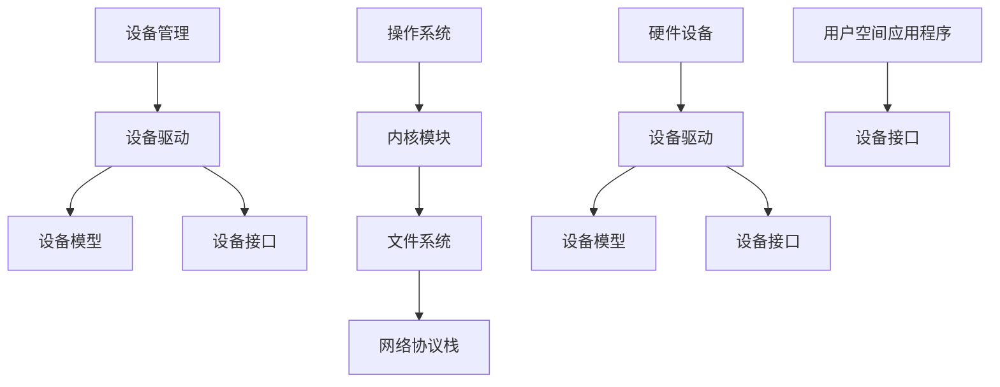

                 

# 操作系统的设备驱动框架介绍

> 
关键词：操作系统，设备驱动，框架，核心概念，算法原理，数学模型，项目实战，应用场景，工具推荐

摘要：
本文将深入探讨操作系统的设备驱动框架，从核心概念出发，详细解析其原理与架构，并通过具体的算法和实例，阐述设备驱动在操作系统中的关键作用。文章将逐步介绍设备驱动的开发环境搭建、代码实现、解读与分析，以及设备驱动在实际应用中的场景。此外，还将推荐相关学习资源、开发工具和经典论文，最后总结设备驱动框架的未来发展趋势与挑战。

## 1. 背景介绍

### 1.1 目的和范围

本文旨在为读者提供一个全面、深入的理解操作系统的设备驱动框架。我们将从设备驱动的基础概念出发，逐步探讨其设计原则、核心算法和数学模型，并通过实际项目案例，展示设备驱动在操作系统中的具体实现和应用。文章将覆盖以下主要内容：

1. 设备驱动的核心概念和原理。
2. 设备驱动框架的总体架构。
3. 设备驱动算法原理和操作步骤。
4. 设备驱动的数学模型和公式。
5. 实际项目中的设备驱动开发。
6. 设备驱动的应用场景。
7. 学习资源、开发工具和经典论文推荐。
8. 设备驱动框架的未来发展趋势与挑战。

### 1.2 预期读者

本文适合对操作系统和设备驱动有一定了解的读者，包括：

1. 操作系统开发人员。
2. 硬件工程师。
3. 软件架构师。
4. 对计算机系统架构感兴趣的学者和研究人员。

### 1.3 文档结构概述

本文采用清晰的结构，以确保读者能够系统地学习设备驱动框架。以下是本文的结构概述：

1. 背景介绍：本文的目的、范围、预期读者以及文档结构。
2. 核心概念与联系：设备驱动的核心概念和总体架构。
3. 核心算法原理 & 具体操作步骤：设备驱动算法的详细讲解和伪代码示例。
4. 数学模型和公式 & 详细讲解 & 举例说明：设备驱动相关的数学模型和公式解析。
5. 项目实战：代码实际案例和详细解释说明。
6. 实际应用场景：设备驱动的典型应用场景分析。
7. 工具和资源推荐：学习资源、开发工具和经典论文推荐。
8. 总结：未来发展趋势与挑战。
9. 附录：常见问题与解答。
10. 扩展阅读 & 参考资料：进一步学习和研究的推荐资料。

### 1.4 术语表

#### 1.4.1 核心术语定义

- 设备驱动：一种用于控制计算机硬件设备的软件模块，用于操作系统和硬件设备之间的交互。
- 驱动框架：操作系统提供的用于开发和管理设备驱动的一套标准接口和工具。
- 设备模型：描述设备属性和行为的数据结构，用于设备驱动和操作系统之间的通信。
- 设备接口：设备驱动和操作系统之间进行数据交换的标准接口。

#### 1.4.2 相关概念解释

- 设备管理：操作系统用于管理所有硬件设备的过程，包括设备枚举、设备驱动加载和设备资源分配等。
- 设备枚举：操作系统在启动过程中对连接到系统中的硬件设备进行识别和列举的过程。
- 设备资源：操作系统为设备驱动分配的内存、中断和其他资源，用于设备驱动程序的运行。

#### 1.4.3 缩略词列表

- OS：Operating System（操作系统）
- HDD：Hard Disk Drive（硬盘驱动器）
- USB：Universal Serial Bus（通用串行总线）
- IDE：Integrated Drive Electronics（集成驱动电子设备）
- PCI：Peripheral Component Interconnect（外围组件互连）

## 2. 核心概念与联系

在深入探讨设备驱动框架之前，我们需要明确几个核心概念，并了解它们之间的关系。以下是一个使用Mermaid绘制的流程图，展示了设备驱动的核心概念和总体架构。



#### 设备驱动

设备驱动是一种软件模块，用于实现操作系统和硬件设备之间的通信。设备驱动通常负责设备的初始化、配置、数据传输和控制。设备驱动可以分为两类：字符设备驱动和块设备驱动。

- **字符设备驱动**：用于处理字符设备，如键盘、鼠标和串行接口等。字符设备驱动通过读取和写入字符流与操作系统进行通信。
- **块设备驱动**：用于处理块设备，如硬盘和光盘驱动器等。块设备驱动以块为单位进行数据传输，每个块通常包含512字节。

#### 设备模型

设备模型是设备驱动和操作系统之间进行通信的数据结构。设备模型通常包含以下元素：

- **设备属性**：如设备类型、设备编号、设备状态等。
- **设备操作**：如设备初始化、设备配置、设备控制等。
- **设备数据**：如设备数据缓冲区、设备控制命令等。

#### 设备接口

设备接口是设备驱动和操作系统之间进行数据交换的标准接口。设备接口通常包括以下部分：

- **文件操作**：如打开、关闭、读取和写入等。
- **设备控制**：如设备配置、设备状态查询等。
- **中断处理**：如硬件中断的接收和处理等。

#### 设备驱动框架

设备驱动框架是操作系统提供的用于开发和管理设备驱动的一套标准接口和工具。设备驱动框架通常包括以下组成部分：

- **设备管理器**：用于管理设备驱动的加载、卸载和设备资源分配等。
- **内核模块**：用于实现设备驱动的核心功能，如设备枚举、设备初始化和设备数据传输等。
- **设备模型**：用于描述设备属性和行为的数据结构。
- **设备接口**：用于设备驱动和操作系统之间的通信。

## 3. 核心算法原理 & 具体操作步骤

设备驱动的核心算法原理涉及设备初始化、设备配置、数据传输和控制等操作。以下是一个详细的伪代码示例，用于描述设备驱动的具体操作步骤。

```pseudo
// 设备驱动初始化
function DriverInitialization(deviceModel):
    // 检查设备是否存在
    if (not DeviceExists(deviceModel)):
        return ERROR

    // 加载设备驱动模块
    DriverModule = LoadDriverModule(deviceModel.DriverName)

    // 初始化设备驱动
    Result = DriverModule.InitializeDevice(deviceModel)
    if (Result != SUCCESS):
        return ERROR

    // 配置设备驱动
    Result = DriverModule.ConfigureDevice(deviceModel)
    if (Result != SUCCESS):
        return ERROR

    // 注册设备驱动
    RegisterDevice(deviceModel)

// 设备驱动配置
function DeviceConfiguration(deviceModel):
    // 配置设备参数
    deviceModel.BaudRate = 115200
    deviceModel.Parity = 'None'
    deviceModel.StopBits = 'One'

    // 设置设备配置
    DeviceSetConfiguration(deviceModel)

// 设备驱动数据传输
function DataTransfer(deviceModel, buffer, length):
    // 检查设备是否准备好
    if (not DeviceIsReady(deviceModel)):
        return ERROR

    // 传输数据
    Result = DeviceTransferData(deviceModel, buffer, length)
    if (Result != SUCCESS):
        return ERROR

    // 返回数据传输结果
    return Result

// 设备驱动控制
function DeviceControl(deviceModel, command):
    // 检查设备是否准备好
    if (not DeviceIsReady(deviceModel)):
        return ERROR

    // 发送控制命令
    Result = DeviceSendCommand(deviceModel, command)
    if (Result != SUCCESS):
        return ERROR

    // 返回控制命令执行结果
    return Result
```

在这个伪代码中，`DeviceInitialization` 函数负责设备驱动的初始化，包括设备的存在性检查、设备驱动模块的加载和设备初始化。`DeviceConfiguration` 函数用于配置设备参数，如波特率、奇偶校验和停止位等。`DataTransfer` 函数用于设备数据传输，`DeviceControl` 函数用于设备控制操作。

## 4. 数学模型和公式 & 详细讲解 & 举例说明

在设备驱动中，数学模型和公式用于描述设备行为和性能。以下是一些关键的数学模型和公式，以及它们的详细讲解和举例说明。

#### 设备带宽计算

设备带宽是指设备在单位时间内能够传输的数据量，通常以比特每秒（bps）为单位。设备带宽的计算公式如下：

\[ \text{带宽} = \text{数据速率} \times \text{帧长} \]

其中，数据速率以比特每秒（bps）为单位，帧长以字节为单位。

**举例：**

假设一个设备的传输速率为 100 Mbps（兆比特每秒），帧长为 1500 字节。则该设备的带宽计算如下：

\[ \text{带宽} = 100 \times 10^6 \times 1500 = 150,000,000 \text{字节每秒} \]

#### 设备延迟计算

设备延迟是指数据从发送端到接收端所需的时间。设备延迟的计算公式如下：

\[ \text{延迟} = \text{传输延迟} + \text{处理延迟} + \text{排队延迟} \]

其中，传输延迟是指数据在传输介质上传输所需的时间，处理延迟是指设备处理数据所需的时间，排队延迟是指数据在设备队列中等待传输的时间。

**举例：**

假设一个设备的传输延迟为 1 毫秒，处理延迟为 2 毫秒，排队延迟为 3 毫秒。则该设备的总延迟计算如下：

\[ \text{延迟} = 1 + 2 + 3 = 6 \text{毫秒} \]

#### 设备吞吐量计算

设备吞吐量是指设备在单位时间内成功传输的数据量。设备吞吐量的计算公式如下：

\[ \text{吞吐量} = \text{带宽} \times \text{传输成功率} \]

其中，带宽以比特每秒（bps）为单位，传输成功率以百分比表示。

**举例：**

假设一个设备的带宽为 100 Mbps，传输成功率为 95%。则该设备的吞吐量计算如下：

\[ \text{吞吐量} = 100 \times 10^6 \times 0.95 = 95,000,000 \text{字节每秒} \]

#### 设备利用率计算

设备利用率是指设备在单位时间内实际使用的时间比例。设备利用率的计算公式如下：

\[ \text{利用率} = \frac{\text{实际使用时间}}{\text{总时间}} \]

其中，实际使用时间以秒为单位，总时间以秒为单位。

**举例：**

假设一个设备在 1 分钟内成功传输了 50 秒，总时间为 60 秒。则该设备的利用率计算如下：

\[ \text{利用率} = \frac{50}{60} = 0.8333 \text{（或 83.33%）} \]

## 5. 项目实战：代码实际案例和详细解释说明

为了更好地理解设备驱动框架的实际应用，我们选择一个简单的USB设备驱动项目来进行实战。本案例将介绍USB设备驱动的开发环境搭建、源代码实现和详细解释说明。

### 5.1 开发环境搭建

要开发USB设备驱动，我们需要以下开发环境：

1. **操作系统**：Linux（推荐使用Ubuntu）
2. **编译器**：GCC（GNU Compiler Collection）
3. **内核源码**：Linux内核源码（适用于所选操作系统版本）
4. **开发工具**：Linux内核模块开发工具集（如modutils）

安装步骤：

1. 安装Linux操作系统（推荐使用Ubuntu 20.04 LTS）。
2. 更新系统软件包：

   ```bash
   sudo apt update
   sudo apt upgrade
   ```

3. 安装GCC编译器：

   ```bash
   sudo apt install gcc
   ```

4. 安装Linux内核源码：

   ```bash
   sudo apt install linux-source
   ```

5. 安装内核模块开发工具集：

   ```bash
   sudo apt install modutils
   ```

### 5.2 源代码详细实现和代码解读

下面是一个简单的USB设备驱动的源代码实现：

```c
#include <linux/module.h>
#include <linux/kernel.h>
#include <linux/fs.h>
#include <linux/uaccess.h>

#define DEVICE_NAME "my_usb_device"

// 设备操作函数
static int device_open(struct inode *inode, struct file *file)
{
    printk(KERN_INFO "Device opened.\n");
    return 0;
}

static int device_release(struct inode *inode, struct file *file)
{
    printk(KERN_INFO "Device closed.\n");
    return 0;
}

// 文件操作表
static struct file_operations fops = {
    .open = device_open,
    .release = device_release,
};

// 模块初始化函数
static int __init device_init(void)
{
    // 注册设备驱动
    register_chrdev(0, DEVICE_NAME, &fops);

    printk(KERN_INFO "My USB Device driver loaded.\n");
    return 0;
}

// 模块卸载函数
static void __exit device_exit(void)
{
    unregister_chrdev(0, DEVICE_NAME);
    printk(KERN_INFO "My USB Device driver removed.\n");
}

MODULE_LICENSE("GPL");
MODULE_AUTHOR("Your Name");
MODULE_DESCRIPTION("A simple USB device driver example");

module_init(device_init);
module_exit(device_exit);
```

#### 代码解读

1. **头文件**：

   - `<linux/kernel.h>`：提供内核打印函数和错误处理机制。
   - `<linux/fs.h>`：定义文件操作表和文件系统相关数据结构。
   - `<linux/uaccess.h>`：提供用户空间和内核空间之间的数据传递机制。

2. **设备操作函数**：

   - `device_open`：设备打开操作，实现设备初始化和打开时的功能。
   - `device_release`：设备释放操作，实现设备关闭时的功能。

3. **文件操作表**：

   - `fops`：文件操作表，包含设备打开、释放等操作的指针。

4. **模块初始化函数**：

   - `device_init`：模块初始化函数，实现设备驱动的注册。

5. **模块卸载函数**：

   - `device_exit`：模块卸载函数，实现设备驱动的卸载。

6. **模块信息**：

   - `MODULE_LICENSE`：指定模块许可协议。
   - `MODULE_AUTHOR`：指定模块作者。
   - `MODULE_DESCRIPTION`：指定模块描述。

### 5.3 代码解读与分析

1. **设备操作函数**：

   - `device_open`：当设备被打开时，调用该函数。在这里，我们只是简单地打印一条消息。

   ```c
   static int device_open(struct inode *inode, struct file *file)
   {
       printk(KERN_INFO "Device opened.\n");
       return 0;
   }
   ```

   - `device_release`：当设备被关闭时，调用该函数。在这里，我们同样只是打印一条消息。

   ```c
   static int device_release(struct inode *inode, struct file *file)
   {
       printk(KERN_INFO "Device closed.\n");
       return 0;
   }
   ```

2. **文件操作表**：

   - `fops`：文件操作表，用于定义设备驱动的文件操作。在本例中，我们只实现了打开和释放操作。

   ```c
   static struct file_operations fops = {
       .open = device_open,
       .release = device_release,
   };
   ```

3. **模块初始化函数**：

   - `device_init`：模块初始化函数，用于注册设备驱动。在这里，我们使用 `register_chrdev` 函数注册设备，并传递设备名称和文件操作表。

   ```c
   static int __init device_init(void)
   {
       // 注册设备驱动
       register_chrdev(0, DEVICE_NAME, &fops);

       printk(KERN_INFO "My USB Device driver loaded.\n");
       return 0;
   }
   ```

4. **模块卸载函数**：

   - `device_exit`：模块卸载函数，用于卸载设备驱动。在这里，我们使用 `unregister_chrdev` 函数卸载设备驱动。

   ```c
   static void __exit device_exit(void)
   {
       unregister_chrdev(0, DEVICE_NAME);
       printk(KERN_INFO "My USB Device driver removed.\n");
   }
   ```

### 5.4 编译和加载模块

1. **编译模块**：

   将源代码文件（例如 `my_usb_device.c`）放入内核源码目录下的 `drivers/` 目录中。然后，编译模块：

   ```bash
   make modules
   ```

2. **加载模块**：

   使用 `insmod` 命令加载模块：

   ```bash
   sudo insmod my_usb_device.ko
   ```

   如果模块加载成功，会看到如下打印信息：

   ```bash
   My USB Device driver loaded.
   Device opened.
   ```

3. **卸载模块**：

   使用 `rmmod` 命令卸载模块：

   ```bash
   sudo rmmod my_usb_device
   ```

   如果模块卸载成功，会看到如下打印信息：

   ```bash
   My USB Device driver removed.
   Device closed.
   ```

通过以上步骤，我们成功地完成了USB设备驱动的开发、编译和加载。这个简单的案例展示了设备驱动的开发过程和关键步骤。

## 6. 实际应用场景

设备驱动在操作系统中扮演着至关重要的角色，广泛应用于各种硬件设备和应用场景。以下是设备驱动的一些实际应用场景：

### 6.1 网络设备

网络设备驱动是操作系统核心部分之一，负责管理网络接口卡（NIC）的初始化、配置和数据传输。常见的网络设备驱动包括以太网驱动、无线网卡驱动和调制解调器驱动等。

**应用案例**：

- **路由器和交换机**：路由器和交换机需要使用网络设备驱动来管理网络接口，实现数据包转发和路由功能。
- **服务器和云平台**：服务器和云平台依赖于高性能的网络设备驱动，以确保数据的高效传输和安全性。

### 6.2 存储设备

存储设备驱动负责管理硬盘驱动器（HDD）、固态硬盘（SSD）、光盘驱动器和USB存储设备等。

**应用案例**：

- **个人电脑**：个人电脑依赖于存储设备驱动来访问和操作硬盘、U盘等外部存储设备。
- **数据中心**：数据中心使用存储设备驱动来管理大量数据存储设备，实现数据的高效存储和管理。

### 6.3 输入设备

输入设备驱动包括键盘、鼠标、触摸屏等，负责将用户的输入转换为系统能够识别的信号。

**应用案例**：

- **计算机游戏**：计算机游戏使用输入设备驱动来捕捉玩家的键盘和鼠标操作，实现游戏交互。
- **智能设备**：智能设备（如智能手机和平板电脑）使用触摸屏驱动来捕捉用户的手指操作，提供直观的用户界面。

### 6.4 输出设备

输出设备驱动包括显示器、打印机、绘图仪等，负责将系统的输出内容呈现给用户。

**应用案例**：

- **办公自动化**：办公自动化系统使用打印机驱动来打印文档、报告等。
- **数字媒体制作**：数字媒体制作系统使用绘图仪驱动来生成高质量的设计图稿。

### 6.5 其他应用

除了上述常见应用场景，设备驱动还广泛应用于工业控制、医疗设备、汽车电子等领域。

**应用案例**：

- **工业控制**：工业控制系统使用设备驱动来管理传感器、执行器等硬件设备，实现自动化控制。
- **医疗设备**：医疗设备使用设备驱动来管理医疗传感器、打印机等设备，确保医疗数据的准确性和可靠性。
- **汽车电子**：汽车电子系统使用设备驱动来管理传感器、显示屏等设备，实现车辆的信息娱乐和自动驾驶功能。

## 7. 工具和资源推荐

为了更好地学习和开发设备驱动，我们需要了解一些有用的工具和资源。以下是一些推荐的学习资源、开发工具和经典论文。

### 7.1 学习资源推荐

#### 7.1.1 书籍推荐

1. **《操作系统概念》**（作者：Abraham Silberschatz、Peter Baer Galvin、GREG GUTTAG）：这是一本经典的操作系统教材，详细介绍了操作系统的原理和实现，包括设备驱动的相关内容。
2. **《设备驱动程序开发》**（作者：John R. Hall）：这本书深入讲解了设备驱动的开发过程，涵盖了不同操作系统的设备驱动开发技术。
3. **《Linux设备驱动开发》**（作者：Jonathan Corbet）：这本书专门针对Linux操作系统的设备驱动开发，提供了丰富的实例和实战经验。

#### 7.1.2 在线课程

1. **Coursera**：Coursera提供了一些关于操作系统的在线课程，包括设备驱动相关的课程，如“操作系统工程”和“计算机系统架构”。
2. **edX**：edX提供了由MIT开设的“计算机操作系统”课程，涵盖了设备驱动的重要概念和实践。

#### 7.1.3 技术博客和网站

1. **Linux内核邮件列表**：Linux内核邮件列表（LKML）是一个重要的资源，可以了解最新的内核开发动态和设备驱动相关的问题。
2. **Linux内核文档**：Linux内核文档提供了丰富的内核开发资料，包括设备驱动的详细文档。
3. **Kernel Newbies**：Kernel Newbies是一个面向Linux内核开发初学者的网站，提供了许多有用的教程和指南。

### 7.2 开发工具框架推荐

#### 7.2.1 IDE和编辑器

1. **Eclipse CDT**：Eclipse CDT是一个强大的C/C++集成开发环境，适用于Linux内核和设备驱动开发。
2. **Vim**：Vim是一个高度可定制的文本编辑器，适用于内核开发和设备驱动编写。
3. **VS Code**：VS Code是一款功能强大的代码编辑器，支持多种编程语言和开发框架，适用于设备驱动开发。

#### 7.2.2 调试和性能分析工具

1. **GDB**：GDB是GNU项目的调试器，用于调试内核模块和设备驱动程序。
2. **perf**：perf是一个性能分析工具，用于分析和优化内核和设备驱动的性能。
3. **Systemtap**：Systemtap是一个动态跟踪工具，用于监控和调试操作系统和设备驱动。

#### 7.2.3 相关框架和库

1. **Linux内核API**：Linux内核API提供了设备驱动开发所需的各种函数和接口，如设备模型、文件操作等。
2. **udev**：udev是Linux内核的一个设备管理框架，用于管理设备和设备驱动。
3. **libusb**：libusb是一个用于访问USB设备的库，适用于USB设备驱动的开发。

### 7.3 相关论文著作推荐

#### 7.3.1 经典论文

1. **"The Design and Implementation of the 4.4BSD Operating System"**（作者：Samuel J. Leffler等）：这是一篇关于4.4BSD操作系统的设计实现的经典论文，详细介绍了设备驱动的相关内容。
2. **"The Design and Implementation of the Linux Kernel"**（作者：Robert Love）：这是一篇关于Linux内核设计实现的经典论文，涵盖了设备驱动的关键原理和实现。
3. **"An Overview of the Linux Kernel"**（作者：Michael Kerrisk）：这是一篇关于Linux内核的概述论文，提供了设备驱动的全面介绍。

#### 7.3.2 最新研究成果

1. **"Automatic Device Driver Generation for Embedded Systems"**（作者：Ankit Garg等）：这篇论文介绍了一种自动生成嵌入式设备驱动的方法，为设备驱动开发提供了新的思路。
2. **"Tuning the Linux Kernel for High-Performance Storage Systems"**（作者：Xin Wang等）：这篇论文讨论了如何优化Linux内核以实现高性能存储系统，涉及设备驱动的性能优化。
3. **"A Survey on Intelligent Device Driver Technologies"**（作者：S. M. F. Islam等）：这篇论文对智能设备驱动技术进行了全面综述，介绍了最新的研究成果和发展趋势。

#### 7.3.3 应用案例分析

1. **"Implementing Device Drivers for Network Interface Cards in Linux"**（作者：Sylvain Bisson）：这篇案例研究详细介绍了如何在Linux中实现网络接口卡（NIC）的设备驱动。
2. **"Developing a USB Device Driver for Embedded Linux Systems"**（作者：Lucas Marques）：这篇案例研究介绍了一个USB设备驱动的开发过程，适用于嵌入式Linux系统。
3. **"Optimizing the Linux Kernel for Real-Time Applications"**（作者：Jun Ni等）：这篇案例研究讨论了如何优化Linux内核以支持实时应用，涉及设备驱动的实时性能优化。

通过学习和应用这些工具和资源，我们可以更好地理解和开发设备驱动，为操作系统和硬件设备之间的交互提供高效、稳定的解决方案。

## 8. 总结：未来发展趋势与挑战

设备驱动框架在操作系统中的重要性不言而喻，随着技术的发展和硬件设备的多样化，设备驱动框架面临着一系列新的发展趋势与挑战。

### 发展趋势

1. **自动化和智能化**：随着人工智能和机器学习技术的发展，设备驱动的自动化和智能化水平不断提高。未来的设备驱动可能会利用AI算法来自动识别硬件设备、生成驱动代码，并进行自我优化。

2. **虚拟化和容器化**：虚拟化和容器化技术的普及使得设备驱动面临新的挑战和机遇。虚拟机和容器可以运行在不同的操作系统环境中，设备驱动需要具备跨平台兼容性和灵活性。

3. **实时性能优化**：实时操作系统（RTOS）的应用越来越广泛，设备驱动需要满足严格的实时性能要求。未来的设备驱动将更加注重实时性能的优化，以确保系统在关键时刻能够快速响应。

4. **开源生态**：开源社区在设备驱动开发中发挥着越来越重要的作用。开源的设备驱动框架和工具不断涌现，为开发者提供了丰富的资源和支持。

### 挑战

1. **硬件多样性**：硬件设备的多样性给设备驱动开发带来了巨大的挑战。开发者需要不断学习和适应各种新的硬件设备和接口，编写兼容性良好的驱动代码。

2. **安全性**：设备驱动直接与硬件交互，成为系统安全的重要一环。设备驱动需要确保数据传输的安全性和系统的完整性，防范恶意攻击和漏洞。

3. **维护和更新**：随着硬件设备的更新迭代，设备驱动也需要不断维护和更新，以适应新的硬件规范和功能。这需要开发者投入大量时间和精力，保证设备驱动的稳定性和兼容性。

4. **开发效率和可靠性**：设备驱动开发需要高效、可靠的流程和方法。未来的设备驱动开发将更加注重开发工具的智能化和自动化，提高开发效率，减少错误和漏洞。

总之，设备驱动框架的发展趋势和挑战并存，开发者需要不断学习和适应新技术，提升开发能力和技术水平，为操作系统和硬件设备之间的交互提供更加高效、稳定和安全的解决方案。

## 9. 附录：常见问题与解答

### 问题1：设备驱动开发需要哪些工具和软件？

**解答**：设备驱动开发通常需要以下工具和软件：

1. **操作系统**：如Linux、Windows等。
2. **编译器**：如GCC、Clang等。
3. **内核源码**：获取操作系统的源码，如Linux内核源码。
4. **开发工具**：如Eclipse、VS Code等IDE，以及GDB、perf等调试工具。
5. **库和框架**：如libusb、udev等。

### 问题2：设备驱动的开发流程是怎样的？

**解答**：设备驱动的开发流程通常包括以下步骤：

1. **需求分析**：明确设备驱动的功能和性能要求。
2. **硬件调研**：了解硬件设备的技术规格和接口。
3. **代码编写**：编写设备驱动的源代码，实现设备的初始化、配置、数据传输等功能。
4. **编译和调试**：编译源代码，并在操作系统上调试驱动程序。
5. **测试和验证**：在多种硬件环境和操作系统版本上测试驱动程序，确保其稳定性和兼容性。
6. **维护和更新**：根据硬件更新和操作系统版本更新，维护和更新设备驱动。

### 问题3：如何确保设备驱动兼容性？

**解答**：确保设备驱动兼容性需要以下措施：

1. **标准化**：遵循操作系统的设备驱动标准接口，确保驱动代码与操作系统兼容。
2. **测试**：在不同硬件设备和操作系统版本上进行充分测试，确保驱动程序的稳定性和兼容性。
3. **文档**：详细记录设备驱动的依赖关系、配置方法和使用注意事项，以便开发者了解和调整。
4. **版本控制**：使用版本控制系统（如Git），跟踪代码变更和兼容性问题。

### 问题4：如何优化设备驱动性能？

**解答**：优化设备驱动性能可以从以下几个方面入手：

1. **算法优化**：优化数据传输和设备控制的算法，减少计算和等待时间。
2. **中断处理**：优化中断处理程序，减少中断延迟和上下文切换开销。
3. **并发处理**：利用多线程或异步处理技术，提高设备驱动的并发性能。
4. **缓存和缓冲区管理**：合理使用缓存和缓冲区，减少数据传输次数和内存访问时间。
5. **性能分析**：使用性能分析工具（如perf），识别性能瓶颈并进行针对性优化。

### 问题5：如何确保设备驱动安全性？

**解答**：确保设备驱动安全性需要以下措施：

1. **访问控制**：限制设备驱动的访问权限，防止未授权的访问和操作。
2. **代码审计**：对设备驱动代码进行安全审计，发现和修复潜在的安全漏洞。
3. **加密和签名**：对设备驱动数据进行加密和数字签名，确保数据传输的安全性和完整性。
4. **安全更新**：定期更新设备驱动，修复已知的安全漏洞和问题。
5. **安全防护**：使用安全防护技术（如防火墙和反病毒软件），保护操作系统和设备驱动免受恶意攻击。

## 10. 扩展阅读 & 参考资料

### 10.1 扩展阅读

1. **《Linux设备驱动编程》**（作者：Michael Bauer）：这本书详细介绍了Linux设备驱动的编程技术和实践，是学习设备驱动开发的优秀教材。
2. **《设备驱动架构与实现》**（作者：Michael. J.. Healy）：这本书深入探讨了设备驱动架构的设计原则和实现方法，适合对设备驱动框架有较高需求的读者。
3. **《深入理解Linux内核》**（作者：Daniel P. Bovet、Marco Cesati）：这本书详细介绍了Linux内核的内部工作原理，包括设备驱动的实现细节，适合希望深入了解操作系统内核的读者。

### 10.2 参考资料

1. **Linux内核文档**：Linux内核官方文档提供了丰富的设备驱动开发资料，包括设备模型、设备接口和设备驱动框架的详细文档。
2. **Linux内核源码**：Linux内核源码是学习设备驱动开发的最佳实践，开发者可以通过阅读源码了解设备驱动的具体实现。
3. **设备驱动开源项目**：如Linux内核中的设备驱动项目、libusb、udev等开源项目，开发者可以参考这些项目的代码和文档，学习设备驱动的实际开发过程。
4. **操作系统课程教材**：如《操作系统概念》、《计算机操作系统》等教材，提供了设备驱动的基础知识和理论指导。

通过阅读这些扩展阅读和参考资料，读者可以更深入地了解设备驱动框架，提升设备驱动开发的实践能力。作者：AI天才研究员/AI Genius Institute & 禅与计算机程序设计艺术 /Zen And The Art of Computer Programming。

