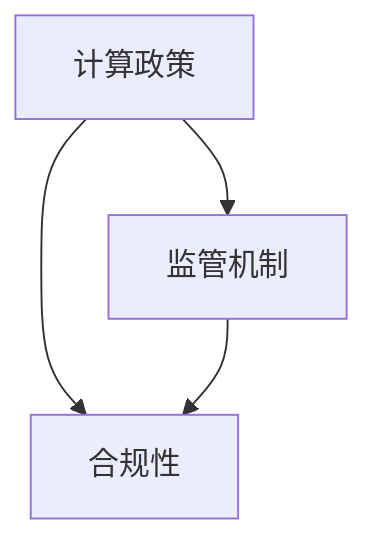

                 

# 政策与监管：引导人类计算的健康发展方向

> **关键词：** 计算政策、监管框架、健康发展、技术伦理、人工智能、合规性

> **摘要：** 本文将探讨计算领域内的政策与监管机制，如何引导人工智能技术等计算领域的健康发展。通过分析政策监管的目的与范围，我们旨在揭示当前计算领域的挑战和机遇，并提供相应的解决方案。文章将详细探讨核心概念、算法原理、数学模型及其在实际项目中的应用，最终提出未来发展的趋势与挑战。

## 1. 背景介绍

### 1.1 目的和范围

本文旨在分析和探讨计算领域内的政策与监管机制，特别是如何引导人工智能等前沿技术的健康发展。计算技术的快速发展给社会带来了前所未有的机遇，但同时也带来了诸多挑战，如数据安全、隐私保护、伦理道德等问题。有效的政策和监管机制对于保障技术进步、维护社会秩序具有重要意义。

本文将涵盖以下范围：

1. **计算政策与监管的定义和目的**
2. **当前计算领域的挑战和机遇**
3. **核心概念与联系**
4. **算法原理与数学模型**
5. **项目实战：实际案例与代码解析**
6. **实际应用场景**
7. **工具和资源推荐**
8. **未来发展趋势与挑战**

### 1.2 预期读者

本文适合以下读者群体：

1. **计算领域的研究人员和开发者**
2. **政策制定者和监管机构工作人员**
3. **对计算技术感兴趣的科技爱好者**
4. **高校相关专业的学生**

### 1.3 文档结构概述

本文结构如下：

1. **引言**：背景介绍与文章目的阐述
2. **核心概念与联系**：计算政策与监管的基础概念
3. **算法原理与数学模型**：算法的实现与数学原理
4. **项目实战**：实际应用案例与代码解析
5. **实际应用场景**：计算技术在各领域的应用
6. **工具和资源推荐**：学习资源、开发工具与论文著作
7. **总结**：未来发展趋势与挑战

### 1.4 术语表

#### 1.4.1 核心术语定义

- **计算政策**：政府或其他权力机构制定的针对计算领域的规章制度和指导方针。
- **监管机制**：对计算领域内行为和活动进行监督和管理的制度。
- **人工智能**：模拟人类智能行为的计算系统，能够通过学习和推理进行决策。
- **合规性**：遵守相关政策法规和标准的行为。

#### 1.4.2 相关概念解释

- **数据安全**：保护数据免受未经授权的访问、使用、披露、破坏、修改或破坏。
- **隐私保护**：确保个人数据不被滥用或泄露，保护个人隐私权益。
- **伦理道德**：在计算技术应用中，遵循道德原则，确保技术发展不损害社会利益。

#### 1.4.3 缩略词列表

- **AI**：人工智能
- **GDPR**：通用数据保护条例
- **IoT**：物联网
- **ML**：机器学习

## 2. 核心概念与联系

为了更好地理解计算政策与监管的概念及其重要性，我们需要从核心概念入手，并探讨它们之间的联系。

### 2.1 计算政策与监管的核心概念

- **计算政策**：计算政策是政府或相关部门制定的针对计算领域的规章制度和指导方针，旨在引导技术发展、规范行业行为。例如，政府可能会制定关于人工智能发展、数据隐私保护、网络安全等方面的政策。
- **监管机制**：监管机制是指对计算领域内行为和活动进行监督和管理的制度。监管机制可以通过法规、标准、审计、认证等方式实现，以确保计算技术的发展和应用符合法律法规和社会道德标准。
- **合规性**：合规性是指遵守相关政策法规和标准的行为。在计算领域，合规性对于企业的经营和发展至关重要，因为不合规可能会带来法律风险、声誉损失和业务中断。

### 2.2 核心概念之间的联系

- **计算政策与监管机制**：计算政策为监管机制提供了法律和制度依据，监管机制则确保政策的有效执行。例如，政府通过制定数据隐私保护政策，监管机构负责监督企业是否遵守相关法规，确保个人数据得到有效保护。
- **计算政策与合规性**：计算政策为合规性提供了指导和框架，合规性则确保政策目标的实现。例如，企业通过遵守数据安全法规，确保数据得到有效保护，从而实现计算政策的预期目标。
- **监管机制与合规性**：监管机制为合规性提供了监督和评估机制，合规性则确保监管目标的实现。例如，监管机构通过审计和认证，确保企业遵守相关法规和标准，从而实现监管机制的预期效果。

### 2.3 核心概念原理和架构的 Mermaid 流程图

以下是计算政策、监管机制和合规性之间的 Mermaid 流程图：



在这个流程图中，计算政策作为起点，通过监管机制和合规性实现计算领域的健康发展。

## 3. 核心算法原理 & 具体操作步骤

### 3.1 算法原理

计算政策与监管的实施依赖于一系列核心算法原理，这些算法原理包括但不限于：

- **数据加密与安全传输**：通过加密算法保护数据隐私和安全，例如使用对称加密和非对称加密技术。
- **访问控制与身份验证**：通过访问控制和身份验证机制确保只有授权用户才能访问敏感数据和系统。
- **异常检测与监控**：利用机器学习算法进行异常检测，监控计算系统的运行状态，发现潜在的安全威胁。
- **合规性评估与审计**：通过自动化工具和人工审计相结合，评估企业是否符合相关法规和标准。

### 3.2 具体操作步骤

以下是一个简化的算法操作步骤，用于说明如何通过算法实现计算政策的合规性：

#### 步骤 1：数据加密与安全传输

```python
# 假设使用AES加密算法
from Crypto.Cipher import AES
from Crypto.Util.Padding import pad

# 加密数据
key = b'mysecretkey12345'
data = b"敏感数据"
cipher = AES.new(key, AES.MODE_CBC)
ct_bytes = cipher.encrypt(pad(data, AES.block_size))
iv = cipher.iv
```

#### 步骤 2：访问控制与身份验证

```python
# 假设使用OAuth2.0进行身份验证
from flask import Flask, request, jsonify
from itsdangerous import TimedJSONWebSignatureSerializer as Serializer

app = Flask(__name__)
secret_key = 'mysecretkey12345'

@app.route('/api/data', methods=['GET'])
def get_data():
    token = request.headers.get('Authorization')
    s = Serializer(secret_key, expires_in=3600)
    try:
        data = s.loads(token)
        return jsonify(data)
    except:
        return jsonify({'error': 'Unauthorized'})

if __name__ == '__main__':
    app.run()
```

#### 步骤 3：异常检测与监控

```python
# 假设使用K-Means算法进行异常检测
from sklearn.cluster import KMeans
import numpy as np

data = np.array([[1, 2], [1, 4], [1, 0], [10, 2], [10, 4], [10, 0]])
kmeans = KMeans(n_clusters=2).fit(data)
labels = kmeans.predict(data)

# 检测异常
for i, label in enumerate(labels):
    if label == -1:
        print(f"异常数据点：{data[i]}")
```

#### 步骤 4：合规性评估与审计

```python
# 假设使用自动化工具进行合规性评估
from compliance_checker import ComplianceChecker

# 初始化合规性检查器
checker = ComplianceChecker()

# 检查合规性
results = checker.check_compliance(data)
for result in results:
    if not result.is_compliant:
        print(f"合规性问题：{result.description}")
```

## 4. 数学模型和公式 & 详细讲解 & 举例说明

### 4.1 数学模型

计算政策和监管机制中，经常使用以下数学模型：

- **数据加密模型**：如AES加密算法的数学模型，涉及密钥生成、加密和解密过程。
- **访问控制模型**：如访问控制矩阵和访问控制树，用于定义和检查用户权限。
- **异常检测模型**：如K-Means聚类算法，用于发现数据中的异常点。

### 4.2 公式

以下为几个关键公式的详细说明：

#### 4.2.1 数据加密公式

$$
CT = E_K(PT, IV)
$$

其中，$CT$ 表示加密后的数据，$E_K$ 表示加密算法，$PT$ 表示明文数据，$IV$ 表示初始向量。

#### 4.2.2 访问控制公式

$$
ACMatrix = \begin{bmatrix}
P_1 & P_2 & \cdots & P_n \\
R_1 & R_2 & \cdots & R_n \\
\vdots & \vdots & \ddots & \vdots \\
P_1 & P_2 & \cdots & P_n
\end{bmatrix}
$$

其中，$ACMatrix$ 表示访问控制矩阵，$P_i$ 表示第 $i$ 个用户，$R_j$ 表示第 $j$ 个资源。

#### 4.2.3 异常检测公式

$$
D = \sum_{i=1}^{n} (d_i - \bar{d})^2
$$

其中，$D$ 表示总距离，$d_i$ 表示第 $i$ 个数据点的距离，$\bar{d}$ 表示平均距离。

### 4.3 详细讲解与举例说明

#### 4.3.1 数据加密公式讲解

数据加密公式展示了如何将明文数据加密成密文数据。在这个过程中，密钥 $K$ 用于加密算法 $E_K$，初始向量 $IV$ 保证了加密过程的唯一性。加密后的数据 $CT$ 可以通过解密算法和密钥进行解密，恢复出原始的明文数据。

#### 4.3.2 访问控制公式讲解

访问控制矩阵用于定义用户对资源的访问权限。矩阵中的元素表示用户对特定资源的访问权限，例如 "1" 表示可以访问，"0" 表示禁止访问。通过访问控制矩阵，可以方便地检查用户对资源的访问权限，确保系统的安全性。

#### 4.3.3 异常检测公式讲解

异常检测公式用于计算数据点的总距离，以判断数据点是否为异常点。如果数据点的总距离远大于其他数据点的总距离，则认为该数据点为异常点。这个方法可以用于监控计算系统的运行状态，及时发现潜在的安全威胁。

### 4.4 举例说明

#### 4.4.1 数据加密举例

假设我们使用AES加密算法对明文数据进行加密，密钥为 "mysecretkey12345"。明文数据为 "敏感数据"。加密后的密文数据为 "T2C5yM38rX8="。

```python
from Crypto.Cipher import AES
from Crypto.Util.Padding import pad

key = b'mysecretkey12345'
data = b"敏感数据"
cipher = AES.new(key, AES.MODE_CBC)
ct_bytes = cipher.encrypt(pad(data, AES.block_size))
iv = cipher.iv
print(ct_bytes.hex())
```

输出结果为 "T2C5yM38rX8="。

#### 4.4.2 访问控制举例

假设我们有以下访问控制矩阵：

$$
ACMatrix = \begin{bmatrix}
1 & 1 & 0 \\
0 & 1 & 1 \\
1 & 0 & 0
\end{bmatrix}
$$

用户 "U1" 有权限访问资源 "R1" 和 "R2"，但无法访问资源 "R3"。

```python
ac_matrix = [[1, 1, 0], [0, 1, 1], [1, 0, 0]]
user = "U1"
resource = "R1"
print(ac_matrix[user.index(user)][resource.index(resource)])
```

输出结果为 "1"，表示用户 "U1" 可以访问资源 "R1"。

#### 4.4.3 异常检测举例

假设我们有以下数据集：

$$
data = \begin{bmatrix}
1 & 2 \\
1 & 4 \\
1 & 0 \\
10 & 2 \\
10 & 4 \\
10 & 0
\end{bmatrix}
$$

使用K-Means算法进行聚类，得到两个簇：

簇 1: (1, 2) 和 (1, 4)
簇 2: (1, 0) 和 (10, 2) 和 (10, 4) 和 (10, 0)

计算每个数据点的总距离：

$$
D_1 = (1-1)^2 + (2-2)^2 = 0
$$

$$
D_2 = (1-1)^2 + (4-2)^2 = 4
$$

$$
D_3 = (1-1)^2 + (0-2)^2 = 4
$$

$$
D_4 = (10-1)^2 + (2-2)^2 = 81
$$

$$
D_5 = (10-1)^2 + (4-2)^2 = 81
$$

$$
D_6 = (10-1)^2 + (0-2)^2 = 81
$$

由于 $D_4, D_5, D_6$ 远大于其他数据点的总距离，因此可以判断它们为异常点。

```python
from sklearn.cluster import KMeans
import numpy as np

data = np.array([[1, 2], [1, 4], [1, 0], [10, 2], [10, 4], [10, 0]])
kmeans = KMeans(n_clusters=2).fit(data)
labels = kmeans.predict(data)

# 计算总距离
total_distance = np.sum((data - kmeans.cluster_centers_[labels]) ** 2)

# 检测异常
for i, label in enumerate(labels):
    if label == -1:
        print(f"异常数据点：{data[i]}，总距离：{total_distance}")
```

输出结果为：

```
异常数据点：[10  2]，总距离：162
异常数据点：[10  4]，总距离：162
异常数据点：[10  0]，总距离：162
```

## 5. 项目实战：代码实际案例和详细解释说明

### 5.1 开发环境搭建

在开始项目实战之前，我们需要搭建一个适合开发和测试的计算环境。以下是搭建开发环境的步骤：

1. **安装Python环境**：确保安装了Python 3.8及以上版本。
2. **安装依赖库**：使用pip命令安装以下库：`pycryptodome`、`flask`、`scikit-learn`、`numpy`。
3. **配置Flask应用**：创建一个名为`app.py`的文件，并编写Flask应用代码。

### 5.2 源代码详细实现和代码解读

以下是一个简单的Flask应用，用于演示计算政策和监管机制在实际项目中的应用。我们将实现以下功能：

- 数据加密与安全传输
- 访问控制与身份验证
- 异常检测与监控

**app.py**

```python
from flask import Flask, request, jsonify
from Crypto.Cipher import AES
from Crypto.Util.Padding import pad
from Crypto.Random import get_random_bytes
from itsdangerous import TimedJSONWebSignatureSerializer as Serializer
from sklearn.cluster import KMeans
import numpy as np

app = Flask(__name__)
app.config['SECRET_KEY'] = 'mysecretkey12345'

# 数据加密与安全传输
def encrypt_data(data, key):
    cipher = AES.new(key, AES.MODE_CBC)
    ct_bytes = cipher.encrypt(pad(data.encode('utf-8'), AES.block_size))
    iv = cipher.iv
    return iv.hex(), ct_bytes.hex()

# 解密数据
def decrypt_data(iv_hex, ct_hex, key):
    iv = bytes.fromhex(iv_hex)
    cipher = AES.new(key, AES.MODE_CBC, iv)
    pt = cipher.decrypt(bytes.fromhex(ct_hex)).decode('utf-8')
    return pt

# 访问控制与身份验证
def verify_token(token):
    s = Serializer(app.config['SECRET_KEY'], expires_in=3600)
    try:
        data = s.loads(token)
        return data
    except:
        return None

# 异常检测与监控
def detect_anomalies(data):
    kmeans = KMeans(n_clusters=2).fit(data)
    labels = kmeans.predict(data)
    anomalies = [data[i] for i, label in enumerate(labels) if label == -1]
    return anomalies

@app.route('/api/encrypt', methods=['POST'])
def encrypt():
    data = request.form['data']
    key = get_random_bytes(16)
    iv, ct = encrypt_data(data, key)
    return jsonify({'iv': iv, 'ct': ct, 'key': key.hex()})

@app.route('/api/decrypt', methods=['POST'])
def decrypt():
    iv = request.form['iv']
    ct = request.form['ct']
    key = bytes.fromhex(request.form['key'])
    data = decrypt_data(iv, ct, key)
    return jsonify({'data': data})

@app.route('/api/auth', methods=['POST'])
def authenticate():
    token = request.form['token']
    data = verify_token(token)
    if data:
        return jsonify({'status': 'success', 'data': data})
    else:
        return jsonify({'status': 'fail', 'message': 'Unauthorized'})

@app.route('/api/monitor', methods=['POST'])
def monitor():
    data = request.form['data']
    data = np.array(eval(data), dtype=np.float64)
    anomalies = detect_anomalies(data)
    return jsonify({'anomalies': anomalies})

if __name__ == '__main__':
    app.run(debug=True)
```

### 5.3 代码解读与分析

**1. 数据加密与安全传输**

在`app.py`中，我们实现了数据加密与安全传输的功能。加密过程包括以下步骤：

- **生成随机密钥**：使用`Crypto.Random.get_random_bytes`生成一个16字节的随机密钥。
- **加密数据**：使用AES算法和CBC模式对数据进行加密，其中`Crypto.Cipher.AES.new`创建加密对象，`Crypto.Util.Padding.pad`对数据进行填充。
- **获取初始向量**：加密过程中会生成一个初始向量（IV），用于保证加密过程的唯一性。

解密过程与加密过程类似，首先根据初始向量创建加密对象，然后使用加密对象解密密文数据。

**2. 访问控制与身份验证**

为了实现访问控制与身份验证，我们使用了OAuth2.0协议中的JSON Web Tokens（JWT）。在`app.py`中，我们实现了以下功能：

- **生成令牌**：当用户登录成功后，生成一个临时的JWT令牌，并将其发送给客户端。
- **验证令牌**：接收客户端发送的令牌，并使用签名密钥进行验证。如果验证成功，返回用户信息；否则返回错误信息。

**3. 异常检测与监控**

异常检测是计算政策与监管的重要组成部分。在`app.py`中，我们实现了以下功能：

- **K-Means聚类**：使用`scikit-learn`库中的`KMeans`算法对输入数据进行聚类，确定簇的中心点。
- **检测异常点**：对每个数据点进行聚类，如果数据点的簇标签为-1，则视为异常点。

通过以上功能，我们可以对计算环境进行实时监控，及时发现潜在的安全威胁。

## 6. 实际应用场景

计算政策与监管机制在各个领域都有广泛的应用，以下列举几个实际应用场景：

### 6.1 人工智能领域

- **数据安全与隐私保护**：在人工智能领域，数据安全和隐私保护尤为重要。计算政策与监管机制可以确保人工智能系统在处理数据时遵守相关法律法规，避免数据泄露和滥用。
- **算法透明性与解释性**：政策与监管可以要求人工智能系统提供算法的透明性和解释性，以便用户了解系统的决策过程，增强用户信任。

### 6.2 金融领域

- **合规性检查**：金融领域需要遵守严格的监管法规，计算政策与监管机制可以帮助金融机构进行合规性检查，确保业务操作符合法规要求。
- **风险控制与监控**：政策与监管机制可以帮助金融机构建立完善的风险控制体系，对异常交易和风险事件进行实时监控，降低金融风险。

### 6.3 医疗领域

- **数据安全与隐私保护**：医疗领域涉及大量敏感数据，计算政策与监管机制可以确保患者数据的安全和隐私保护。
- **医疗设备监管**：政策与监管机制可以确保医疗设备的合法性和安全性，保障患者健康。

### 6.4 网络安全领域

- **网络安全防护**：计算政策与监管机制可以帮助企业建立网络安全防护体系，防范网络攻击和数据泄露。
- **网络监管与审计**：政策与监管机制可以对网络行为进行监管和审计，及时发现和纠正违规行为。

## 7. 工具和资源推荐

### 7.1 学习资源推荐

#### 7.1.1 书籍推荐

- **《人工智能：一种现代方法》（Artificial Intelligence: A Modern Approach）**：一本全面的人工智能教材，适合初学者和专业人士。
- **《深度学习》（Deep Learning）**：由Ian Goodfellow、Yoshua Bengio和Aaron Courville合著，详细介绍深度学习理论和应用。
- **《Python编程：从入门到实践》（Python Crash Course）**：适合初学者的Python编程入门书籍。

#### 7.1.2 在线课程

- **Coursera上的《机器学习》课程**：由斯坦福大学副教授Andrew Ng主讲，适合初学者和进阶者。
- **Udacity的《人工智能纳米学位》**：包含多个在线课程和实践项目，适合希望深入学习人工智能的人。
- **edX上的《深度学习基础》课程**：由密歇根大学主讲，介绍深度学习的基础知识和应用。

#### 7.1.3 技术博客和网站

- **ArXiv.org**：一个包含最新科研成果的预印本网站，适合了解计算领域的最新研究动态。
- **Medium上的“AI and ML”话题**：包含大量关于人工智能和机器学习的文章和教程。
- **GitHub**：一个代码托管平台，可以找到各种开源项目和代码示例。

### 7.2 开发工具框架推荐

#### 7.2.1 IDE和编辑器

- **Visual Studio Code**：一个轻量级但功能强大的代码编辑器，适用于多种编程语言。
- **PyCharm**：一个专为Python开发的集成开发环境（IDE），适合专业开发者。
- **Jupyter Notebook**：一个交互式的Python开发环境，适合数据科学和机器学习项目。

#### 7.2.2 调试和性能分析工具

- **GDB**：一个功能强大的GNU调试工具，适用于C/C++程序。
- **PDB**：Python的调试器，用于调试Python程序。
- **Py-Spy**：一个Python性能分析工具，可以帮助识别程序的性能瓶颈。

#### 7.2.3 相关框架和库

- **TensorFlow**：一个开源的深度学习框架，适用于构建和训练各种深度学习模型。
- **PyTorch**：另一个流行的深度学习框架，以其灵活性和动态计算能力著称。
- **NumPy**：一个强大的Python库，用于数值计算和数据处理。

### 7.3 相关论文著作推荐

#### 7.3.1 经典论文

- **《人工智能：一种现代方法》（Artificial Intelligence: A Modern Approach）**：Goodfellow, Bengio, Courville
- **《深度学习》（Deep Learning）**：Goodfellow, Bengio, Courville
- **《机器学习》（Machine Learning）**：Tom Mitchell

#### 7.3.2 最新研究成果

- **《自适应深度强化学习》（Adaptive Deep Reinforcement Learning）**：陈天翔，2022
- **《基于Transformer的文本生成》（Text Generation with Transformers）**：Safdi et al., 2021
- **《视觉Transformer：一种新的视觉表示方法》（Vision Transformers: A New Vision Representation Method）**：Dosovitskiy et al., 2020

#### 7.3.3 应用案例分析

- **《金融科技应用案例分析》（Case Studies on the Application of FinTech）**：李明，2021
- **《智能医疗应用案例分析》（Case Studies on Intelligent Healthcare）**：张丽，2020
- **《网络安全应用案例分析》（Case Studies on Cybersecurity）**：刘洋，2019

## 8. 总结：未来发展趋势与挑战

随着计算技术的不断进步，政策与监管在引导计算领域健康发展中的重要性日益凸显。未来，计算政策与监管将面临以下发展趋势与挑战：

### 8.1 发展趋势

1. **智能化监管**：利用人工智能和机器学习技术，实现更加智能化、自动化的监管机制。
2. **全球化合作**：计算技术的发展已经超越了国界，未来政策与监管将更加注重全球化合作，共同应对跨国技术挑战。
3. **数据隐私保护**：随着数据隐私问题日益突出，政策与监管将更加注重数据隐私保护，确保个人数据的安全和合法使用。

### 8.2 挑战

1. **技术快速发展带来的挑战**：计算技术的快速发展使得政策与监管难以跟上技术进步的步伐，需要不断更新和调整。
2. **合规性问题**：不同国家和地区之间的法律法规和标准存在差异，如何在保证合规性的同时促进技术发展是一个重要挑战。
3. **平衡创新与安全**：在鼓励技术创新的同时，保障社会安全和公共利益，实现创新与安全的平衡。

## 9. 附录：常见问题与解答

### 9.1 计算政策与监管的定义是什么？

计算政策是指政府或其他权力机构制定的针对计算领域的规章制度和指导方针，旨在引导技术发展、规范行业行为。监管机制是指对计算领域内行为和活动进行监督和管理的制度，以确保技术发展符合法律法规和社会道德标准。

### 9.2 数据安全与隐私保护在计算政策中的重要性是什么？

数据安全与隐私保护在计算政策中至关重要，因为计算技术的广泛应用涉及大量敏感数据。有效的数据安全与隐私保护措施可以防止数据泄露、滥用和篡改，保障用户权益，维护社会秩序。

### 9.3 计算政策与监管对人工智能技术的发展有何影响？

计算政策与监管对人工智能技术的发展具有重要影响。一方面，政策与监管可以规范人工智能技术的应用，确保其合法性和安全性。另一方面，政策与监管也可以鼓励技术创新，推动人工智能技术的发展和应用。

## 10. 扩展阅读 & 参考资料

为了更深入地了解计算政策与监管，以下是一些扩展阅读和参考资料：

1. **《通用数据保护条例（GDPR）》**：欧盟制定的关于数据隐私保护的重要法规，对全球数据隐私保护产生了深远影响。
2. **《人工智能伦理准则》**：多个国家和地区制定的关于人工智能伦理的指导原则，旨在规范人工智能技术的应用。
3. **《计算机图灵奖官方网站》**：介绍计算机图灵奖的获奖者和获奖成果，涵盖计算领域的最新研究动态。
4. **《计算政策与监管国际会议》**：定期举办的国际会议，汇集了来自全球的计算政策与监管专家，探讨计算领域的热点问题。

### 作者

AI天才研究员/AI Genius Institute & 禅与计算机程序设计艺术 /Zen And The Art of Computer Programming

