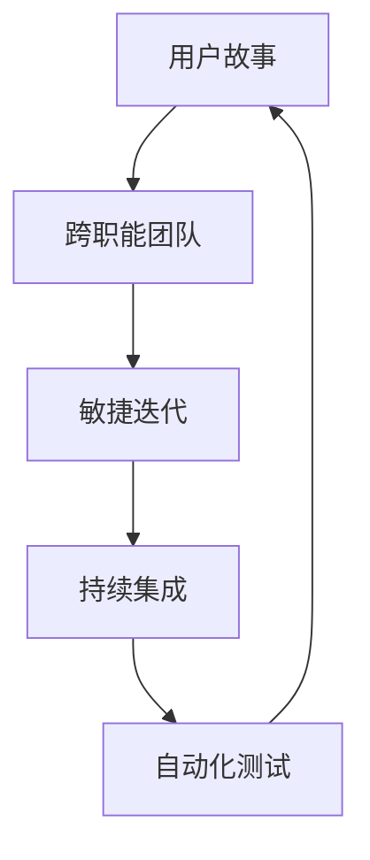
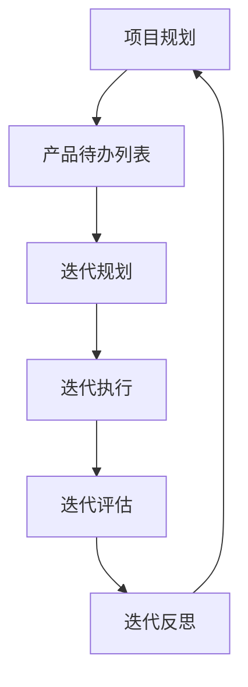
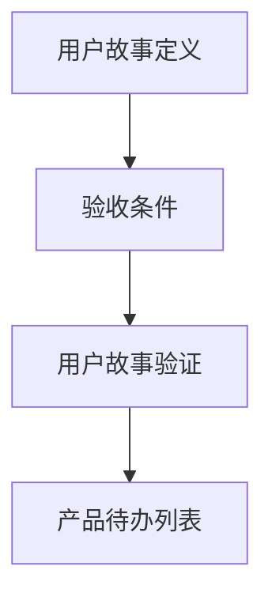
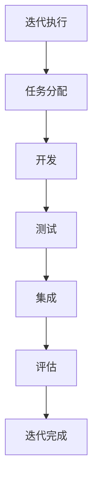
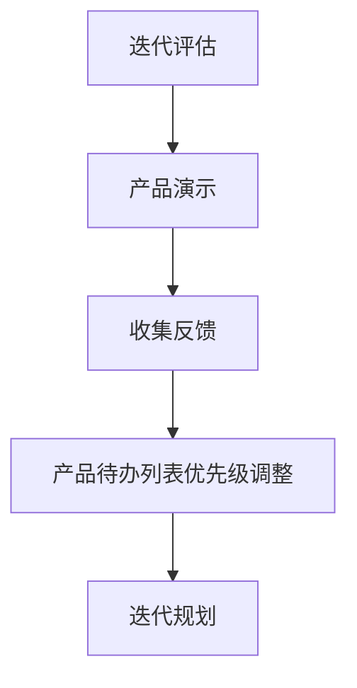
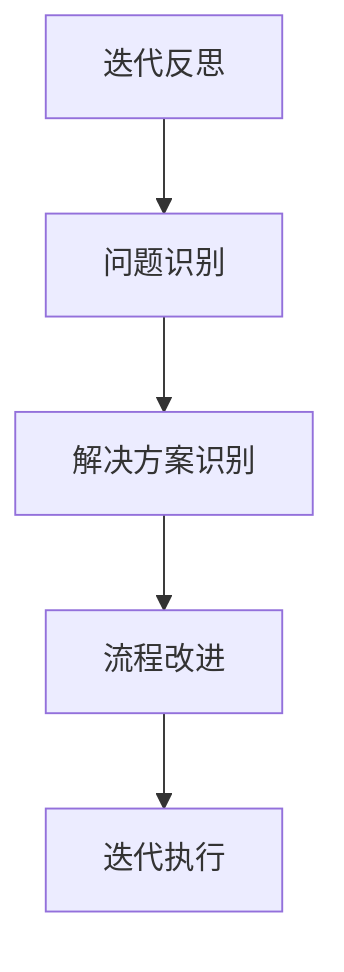

                 

# 敏捷开发的原则与实践分享

## 关键词

- 敏捷开发
- Scrum
- XP
- 跨职能团队
- 用户故事
- 敏捷迭代
- 持续集成
- 自动化测试

## 摘要

本文将深入探讨敏捷开发的原则和实践。通过逐步分析敏捷开发的核心理念，我们将理解其在软件开发项目中的重要性，以及如何有效地实施敏捷方法。我们将从背景介绍开始，详细讨论敏捷开发的核心概念，包括Scrum和XP框架，并使用伪代码和数学模型来阐述其具体操作步骤。接着，我们将通过实际案例和详细解释，展示敏捷开发在项目中的应用，并提供实用的工具和资源推荐。最后，文章将总结敏捷开发的发展趋势和挑战，并附上常见问题与解答。通过本文的阅读，您将获得对敏捷开发的全面了解，并学会如何将其成功应用于实际项目中。

## 1. 背景介绍

### 1.1 目的和范围

敏捷开发是一种以人为核心、迭代和渐进的方法论，旨在快速响应变化、提高软件交付质量和团队满意度。本文旨在分享敏捷开发的核心原则和实践，帮助读者理解其本质和优势，并提供实用的方法和工具。

本文将涵盖以下内容：

1. 敏捷开发的起源和演变
2. 核心概念和框架，包括Scrum和XP
3. 敏捷开发的实施步骤和技巧
4. 敏捷开发在实际项目中的应用
5. 敏捷开发的工具和资源推荐
6. 未来发展趋势和挑战

### 1.2 预期读者

本文适合以下读者群体：

- 软件开发人员和管理者，希望了解和掌握敏捷开发方法
- 项目经理，希望提高项目交付质量和效率
- 产品负责人，希望更好地与开发团队沟通和协作
- 对敏捷开发有兴趣的IT从业者和爱好者

### 1.3 文档结构概述

本文结构如下：

- 背景介绍：介绍敏捷开发的起源、目的和范围
- 核心概念与联系：讨论敏捷开发的核心概念和框架
- 核心算法原理与具体操作步骤：阐述敏捷开发的方法和步骤
- 数学模型和公式：介绍敏捷开发中使用的数学模型
- 项目实战：通过实际案例展示敏捷开发的应用
- 实际应用场景：讨论敏捷开发在不同场景中的应用
- 工具和资源推荐：推荐学习资源和开发工具
- 总结：展望敏捷开发的未来发展趋势和挑战
- 附录：常见问题与解答
- 扩展阅读与参考资料：提供进一步学习的资源

### 1.4 术语表

#### 1.4.1 核心术语定义

- 敏捷开发：一种以人为核心、迭代和渐进的软件开发方法论
- Scrum：一种敏捷开发框架，强调团队合作、迭代和快速反馈
- XP：一种敏捷开发方法，注重简单、透明和持续改进
- 用户故事：描述软件功能或特性的简短描述，通常包含用户角色、目标场景和预期结果
- 敏捷迭代：将项目分为多个短周期（迭代），在每个迭代结束时进行评估和调整
- 持续集成：通过频繁地将代码集成到主分支，快速发现和解决问题
- 自动化测试：使用自动化工具进行测试，提高测试效率和准确性

#### 1.4.2 相关概念解释

- 跨职能团队：由多个不同专业技能的人员组成的团队，能够完成项目的各个阶段
- 产品 backlog：项目待办事项列表，包含所有需要完成的任务
- Sprint：敏捷迭代的一个周期，通常持续2-4周
- Sprint review：每个迭代结束时进行的评估会议，讨论项目的进展和反馈
- Sprint retrospective：每个迭代结束时进行的反思会议，讨论改进点

#### 1.4.3 缩略词列表

- Agile：敏捷开发
- Scrum：Scrum框架
- XP：极限编程
- BDD：行为驱动开发
- TDD：测试驱动开发

## 2. 核心概念与联系

敏捷开发的核心在于其核心理念和框架。在敏捷开发中，核心概念和联系包括：

1. 用户故事：用户故事是敏捷开发中的基本工作单元，描述用户需求或行为。它们通常包含三个部分：用户角色、目标场景和预期结果。
   
   伪代码示例：
   ```plaintext
   As a [用户角色]
   I want [目标场景]
   So that [预期结果]
   ```

2. 跨职能团队：跨职能团队由不同技能背景的成员组成，以确保项目能够快速响应需求变化。团队成员通常包括开发人员、测试人员、UI设计师和项目经理。

3. 敏捷迭代：敏捷迭代是将项目划分为多个短周期（通常为2-4周），在每个迭代结束时进行评估和调整。每个迭代都旨在交付一个可运行的产品版本。

4. 持续集成：持续集成（CI）是一种软件开发实践，通过频繁地将代码集成到主分支，快速发现和解决问题。CI工具通常用于自动化构建、测试和部署。

5. 自动化测试：自动化测试是一种使用自动化工具进行测试的方法，以提高测试效率和准确性。自动化测试包括单元测试、集成测试和验收测试。

以下是一个简化的Mermaid流程图，展示了敏捷开发的核心概念和联系：



## 3. 核心算法原理与具体操作步骤

敏捷开发的核心在于其迭代和渐进的方法论。以下是敏捷开发的具体操作步骤，使用伪代码进行详细阐述：

### 3.1 项目规划



### 3.2 用户故事编写



### 3.3 迭代执行



### 3.4 迭代评估



### 3.5 迭代反思



## 4. 数学模型和公式及详细讲解与举例说明

敏捷开发中的数学模型主要用于项目管理、风险评估和时间估算。以下是几个常见的数学模型及其详细讲解和举例说明。

### 4.1 估算模型

#### 4.1.1 初始估算

初始估算通常基于项目需求和以往经验。可以使用以下公式：

```latex
Estimate = (HistoricalAverage \times Complexity) + SafetyMargin
```

其中，`HistoricalAverage` 是历史平均估算时间，`Complexity` 是项目的复杂性，`SafetyMargin` 是安全边际。

#### 举例：

假设一个项目的历史平均估算时间为10天，项目的复杂性为3，安全边际为2。则估算时间为：

```latex
Estimate = (10 \times 3) + 2 = 32 \text{天}
```

### 4.2 风险评估模型

风险评估模型用于识别和评估项目风险。可以使用以下公式：

```latex
RiskScore = (Probability \times Impact) + DetectionTime
```

其中，`Probability` 是风险发生的概率，`Impact` 是风险发生的影响，`DetectionTime` 是风险被检测的时间。

#### 举例：

假设一个项目的风险发生概率为0.5，影响为重大，检测时间为1天。则风险分数为：

```latex
RiskScore = (0.5 \times 3) + 1 = 2.5
```

### 4.3 时间管理模型

时间管理模型用于确保项目按时交付。可以使用以下公式：

```latex
TimeBuffer = (ProjectDuration \times 0.2) + SafetyMargin
```

其中，`ProjectDuration` 是项目总时长，`SafetyMargin` 是安全边际。

#### 举例：

假设一个项目的总时长为100天，安全边际为10天。则时间缓冲为：

```latex
TimeBuffer = (100 \times 0.2) + 10 = 30 \text{天}
```

## 5. 项目实战：代码实际案例和详细解释说明

### 5.1 开发环境搭建

在开始敏捷开发项目之前，需要搭建一个合适的开发环境。以下是一个简化的步骤：

1. 安装开发工具（如IDE、文本编辑器）
2. 配置版本控制工具（如Git）
3. 安装项目依赖（如库、框架）
4. 配置持续集成工具（如Jenkins）

### 5.2 源代码详细实现和代码解读

以下是一个简单的用户故事示例，描述了如何在项目中实现用户故事功能。

**用户故事：** 作为用户，我希望在网站上能够搜索商品。

**实现步骤：**

1. 设计搜索接口
2. 实现后端搜索逻辑
3. 实现前端搜索功能
4. 进行单元测试和集成测试

**代码解读：**

```python
# 搜索接口设计
from flask import Flask, request, jsonify

app = Flask(__name__)

@app.route('/search', methods=['GET'])
def search():
    query = request.args.get('query')
    # 后端搜索逻辑
    results = perform_search(query)
    return jsonify(results)

# 后端搜索逻辑实现
def perform_search(query):
    # 搜索商品逻辑
    return ["商品1", "商品2", "商品3"]

# 前端搜索功能实现（使用HTML和JavaScript）
<!DOCTYPE html>
<html>
<head>
    <title>商品搜索</title>
</head>
<body>
    <h1>商品搜索</h1>
    <input type="text" id="search_box" />
    <button onclick="search_products()">搜索</button>
    <div id="results"></div>
    <script>
        function search_products() {
            var query = document.getElementById('search_box').value;
            fetch('/search?query=' + query)
                .then(response => response.json())
                .then(data => {
                    var results_div = document.getElementById('results');
                    results_div.innerHTML = '';
                    data.forEach(function(product) {
                        var p = document.createElement('p');
                        p.textContent = product;
                        results_div.appendChild(p);
                    });
                });
        }
    </script>
</body>
</html>
```

### 5.3 代码解读与分析

该示例展示了如何在Flask框架中实现一个简单的商品搜索功能。代码分为三个部分：搜索接口、后端搜索逻辑和前端搜索功能。

1. **搜索接口**：使用Flask提供的`@app.route`装饰器定义了一个 `/search` 接口，接受GET请求，并从请求中获取查询参数。
2. **后端搜索逻辑**：在 `perform_search` 函数中，根据查询参数执行搜索逻辑，并返回搜索结果。
3. **前端搜索功能**：使用HTML和JavaScript实现了一个简单的搜索界面。当用户在输入框中输入查询并点击搜索按钮时，会触发 `search_products` 函数，该函数使用 `fetch` API 向后端发送请求，并更新结果展示部分。

通过这一实际案例，读者可以了解敏捷开发中如何实现用户故事，并理解代码各部分的逻辑和功能。

## 6. 实际应用场景

敏捷开发方法适用于各种类型的软件开发项目，以下是一些常见的实际应用场景：

### 6.1 Web应用开发

在Web应用开发中，敏捷开发方法可以帮助团队快速响应用户需求和市场变化。通过使用用户故事和迭代模型，团队可以分阶段地交付功能，并在每个迭代中收集用户反馈，进行持续改进。

### 6.2 移动应用开发

移动应用开发通常具有严格的时间表和不断变化的需求。敏捷开发方法可以帮助团队保持灵活，快速调整开发方向，确保按时交付高质量的应用。

### 6.3 企业级系统开发

企业级系统开发通常涉及复杂的业务逻辑和大量的用户交互。敏捷开发方法可以通过跨职能团队和持续集成，确保系统的稳定性和可扩展性。

### 6.4 大型项目协作

在大型项目协作中，敏捷开发方法可以帮助团队成员更好地沟通和协作。通过迭代和反思会议，团队能够及时发现和解决问题，提高项目效率和质量。

### 6.5 创新性产品开发

对于创新性产品开发，敏捷开发方法可以帮助团队快速验证产品概念，并通过迭代和用户反馈不断优化产品功能。

## 7. 工具和资源推荐

### 7.1 学习资源推荐

#### 7.1.1 书籍推荐

- 《Scrum敏捷开发实践指南》 - Jeff Sutherland
- 《敏捷软件开发：原则、实践与模式》 - Robert C. Martin
- 《用户故事地图》 - Jeff Patton

#### 7.1.2 在线课程

- Coursera：敏捷开发课程
- Udemy：敏捷方法与实践
- Pluralsight：敏捷项目管理基础

#### 7.1.3 技术博客和网站

- Agile Alliance：敏捷开发官方网站
- InfoQ：敏捷开发相关文章
- Agile Coaching：敏捷教练博客

### 7.2 开发工具框架推荐

#### 7.2.1 IDE和编辑器

- Visual Studio Code
- IntelliJ IDEA
- Eclipse

#### 7.2.2 调试和性能分析工具

- VSCode Debugger
- JProfiler
- XAMPP

#### 7.2.3 相关框架和库

- Flask（Python Web框架）
- React（JavaScript库）
- Spring Boot（Java框架）

### 7.3 相关论文著作推荐

#### 7.3.1 经典论文

- 《Agile Software Development》 - Alistair Cockburn
- 《XP Explained》 - Kent Beck

#### 7.3.2 最新研究成果

- 《Empirical Studies of Agile Development》 - Bas Vodde et al.
- 《Principles of Agile》 -敏捷宣言签署人

#### 7.3.3 应用案例分析

- 《Scrum at Google》 - Google Scrum团队案例
- 《Agile in the Enterprise》 - 企业级敏捷实践

## 8. 总结：未来发展趋势与挑战

敏捷开发作为一种灵活、高效的方法论，正在全球范围内得到广泛应用。未来，敏捷开发将继续向以下几个方向发展：

1. **更加成熟和规范化**：随着敏捷开发方法的普及，越来越多的组织将建立更完善的敏捷实践和流程，以适应不同类型的项目和团队。
2. **持续集成和持续交付**：持续集成（CI）和持续交付（CD）将变得更加重要，以实现更快速的交付和质量保障。
3. **敏捷与人工智能结合**：人工智能技术将被集成到敏捷开发过程中，以自动化测试、预测分析和优化资源分配。
4. **文化变革**：敏捷开发不仅仅是技术和流程的变革，更是一种文化变革。组织需要建立开放、协作和创新的文化，以适应敏捷开发的实践。

尽管敏捷开发具有许多优势，但也面临一些挑战：

1. **团队协作**：在敏捷开发中，团队协作至关重要。然而，在实际操作中，团队成员之间的沟通和协作可能存在问题，需要不断优化。
2. **项目管理**：敏捷开发中的项目管理与传统方法有所不同，项目经理需要具备新的技能和思维方式。
3. **敏捷转型的阻力**：在组织内部，敏捷转型可能面临来自传统思维模式的阻力，需要逐步引导和推动。

通过不断学习和实践，团队能够克服这些挑战，将敏捷开发方法成功应用于实际项目中，实现更高的交付质量和团队满意度。

## 9. 附录：常见问题与解答

### 9.1 什么是敏捷开发？

敏捷开发是一种以人为核心、迭代和渐进的软件开发方法论，强调快速响应变化、提高软件交付质量和团队满意度。

### 9.2 敏捷开发有哪些核心原则？

敏捷开发的核心原则包括：

- 满足用户需求变化
- 快速迭代和反馈
- 跨职能团队合作
- 简化流程
- 自我管理团队

### 9.3 敏捷开发和Scrum有什么区别？

Scrum是一种敏捷开发框架，提供了一套具体的实践和规则。敏捷开发是一种更广泛的方法论，包括多种框架和工具，如Scrum、XP、看板等。

### 9.4 敏捷开发中的用户故事是什么？

用户故事是敏捷开发中的基本工作单元，描述用户需求或行为。它们通常包含三个部分：用户角色、目标场景和预期结果。

### 9.5 敏捷开发如何确保项目按时交付？

敏捷开发通过迭代和反馈机制，确保项目按时交付。在每个迭代结束时，团队评估项目进展，并根据反馈进行必要的调整。

### 9.6 敏捷开发与质量保证有何关系？

敏捷开发强调质量保证，通过持续集成和自动化测试，确保软件质量和稳定性。同时，敏捷开发鼓励团队协作和持续改进，以提高整体质量。

## 10. 扩展阅读与参考资料

为了深入了解敏捷开发，以下是一些扩展阅读和参考资料：

- 敏捷宣言：https://agilemanifesto.org/
- Scrum官方指南：https://www.scrum.org/
- XP官网：https://www.extremeprogramming.org/
- 《敏捷实践指南》 - Stephen Kost and Paul Duvall
- 《敏捷项目管理》 - Bob McGovern
- 《敏捷软件开发：原则、实践与模式》 - Robert C. Martin

通过这些资源，您可以进一步了解敏捷开发的理论和实践，为自己的敏捷之旅提供更多的指导和灵感。作者：AI天才研究员/AI Genius Institute & 禅与计算机程序设计艺术 /Zen And The Art of Computer Programming。

