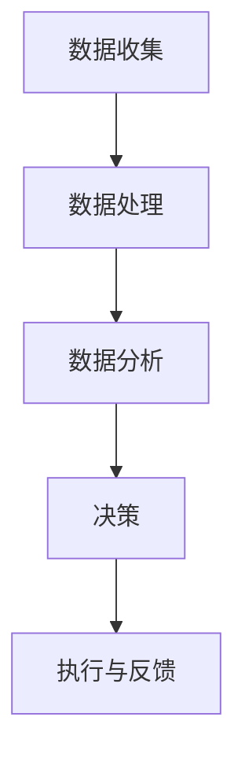
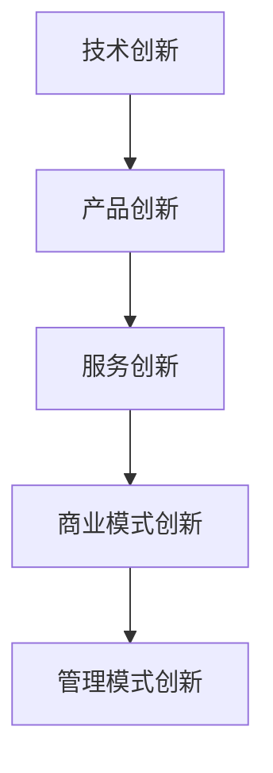
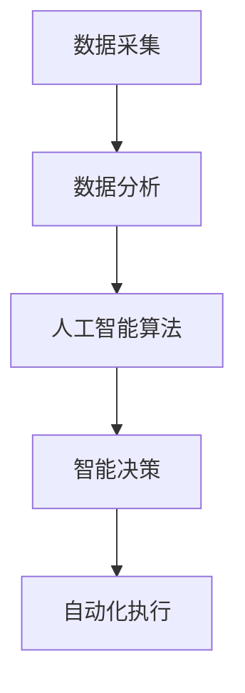
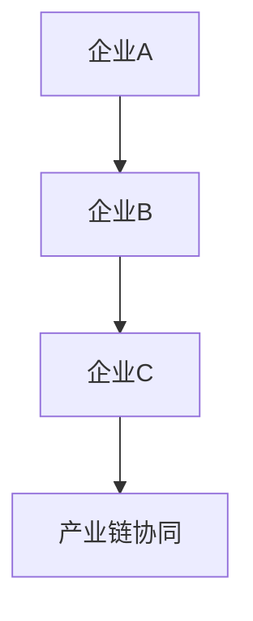
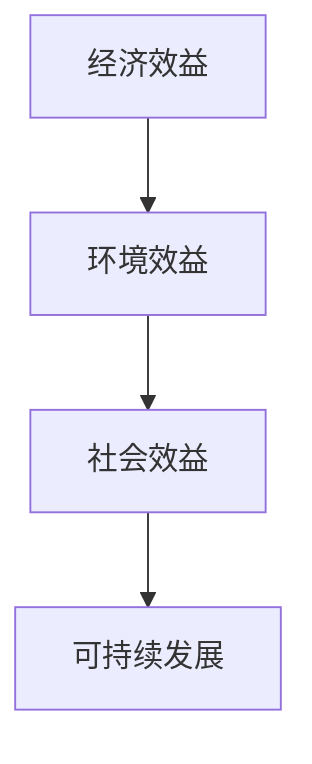

                 

### 1. 背景介绍

数字中国战略是我国政府为实现信息化、智能化、网络化发展，全面提升国家数字经济水平和竞争力而制定的一项国家战略。其核心理念是构建以数据为关键要素的新型生产方式，推动传统产业数字化转型，培育新兴数字产业，打造数字经济新优势。这一战略不仅关乎我国经济高质量发展，更是国家竞争力的集中体现。

新质生产力，作为数字中国战略的核心概念之一，指的是基于信息技术和数字技术的新型生产方式。它超越了传统的生产要素（如劳动力、土地、资本等），通过数据、算法、智能技术等新型生产要素，实现生产方式的根本性变革。新质生产力强调创新驱动、智能驱动和数据驱动，通过数字化转型，提升生产效率、降低成本、拓展市场，从而推动整个经济体系的升级换代。

在数字中国战略的框架下，新质生产力具有以下几个重要特征：

1. **数据驱动**：数据成为新型生产要素，贯穿于生产、分配、流通、消费等各个环节，是实现精准化、智能化生产的关键。

2. **创新驱动**：技术创新是推动新质生产力发展的核心动力，通过持续的技术研发和应用，提升产业竞争力。

3. **智能驱动**：人工智能等智能技术的应用，使得生产过程更加智能化、自动化，提高生产效率和产品质量。

4. **协同驱动**：跨行业、跨领域的协同创新，实现产业链的深度融合和资源优化配置。

5. **可持续发展**：新质生产力注重绿色、环保、低碳的发展路径，实现经济效益与生态效益的协调统一。

本篇文章将围绕数字中国战略与新质生产力这一主题，从背景介绍、核心概念与联系、核心算法原理与具体操作步骤、数学模型与公式、项目实战、实际应用场景、工具与资源推荐等多个方面，深入探讨这一战略的实施路径及其带来的深远影响。让我们一步步分析推理，共同了解新质生产力的本质与未来发展趋势。


<|assistant|>### 2. 核心概念与联系

要深入理解数字中国战略与新质生产力的关系，首先需要明确几个核心概念，并探讨它们之间的联系。以下是对这些概念及其相互关系的详细描述：

#### 数据驱动

数据驱动是数字中国战略的一个重要特征。它指的是在生产和运营过程中，利用海量数据进行分析、挖掘和优化，以实现精准化、智能化的决策和操作。数据驱动不仅仅是数据的收集和存储，更重要的是数据的分析和应用。通过数据驱动的理念，企业能够更加准确地把握市场需求、优化生产流程、提升产品质量，从而在激烈的市场竞争中占据优势。

**Mermaid 流程图：**



在这个流程中，数据从收集、处理到分析，形成了一个闭环系统。通过不断地反馈和优化，企业能够不断提高决策的准确性和效率。

#### 创新驱动

创新驱动是新质生产力的核心动力。它强调通过持续的技术创新来推动产业的发展和升级。在数字中国战略的背景下，创新驱动不仅涉及技术创新，还包括商业模式创新、管理模式创新等。通过创新驱动，企业能够开拓新的市场机会、提升核心竞争力，从而在全球化竞争中立于不败之地。

**Mermaid 流程图：**



这个流程展示了创新驱动的多层次、全方位特征，通过不断创新，企业能够不断适应市场需求，实现可持续发展。

#### 智能驱动

智能驱动是新质生产力的重要组成部分。它主要依赖于人工智能等智能技术的应用，使得生产过程更加智能化、自动化。智能驱动不仅提高了生产效率，还提升了产品的质量和可靠性。通过智能驱动，企业能够实现生产的精细化管理，提高资源利用率，降低生产成本。

**Mermaid 流程图：**



这个流程图展示了智能驱动的各个环节，从数据采集、数据分析到智能决策和自动化执行，形成了一个高效、智能的生产体系。

#### 协同驱动

协同驱动是新质生产力实现的关键。它强调跨行业、跨领域的协同创新，实现产业链的深度融合和资源优化配置。通过协同驱动，企业能够充分发挥各自的优势，实现资源的共享和互补，从而提升整个产业链的竞争力。

**Mermaid 流程图：**



这个流程图展示了协同驱动的概念，通过企业的协同合作，形成了一个高效的产业链生态体系。

#### 可持续发展

可持续发展是新质生产力追求的目标。它强调在发展经济的同时，注重环境保护和资源利用的可持续性。通过可持续发展，企业能够实现经济效益与生态效益的协调统一，为社会和环境做出积极贡献。

**Mermaid 流程图：**



这个流程图展示了可持续发展的三个维度，通过实现经济效益、环境效益和社会效益的协调，企业能够实现长期可持续发展。

#### 结论

通过上述核心概念的介绍和流程图的展示，我们可以看到数字中国战略与新质生产力之间的密切联系。数据驱动、创新驱动、智能驱动、协同驱动和可持续发展共同构成了新质生产力的核心要素，它们相互促进、相互依赖，共同推动着我国数字经济的高质量发展。在接下来的部分，我们将进一步探讨新质生产力的核心算法原理和具体操作步骤，以便更深入地理解这一战略的实施路径。


<|assistant|>### 3. 核心算法原理 & 具体操作步骤

为了深入理解新质生产力的核心算法原理和具体操作步骤，我们需要从数据采集、处理、分析、决策和执行等环节进行详细探讨。以下是各环节的详细解释和操作步骤：

#### 3.1 数据采集

数据采集是新质生产力的第一步，也是关键一步。数据来源可以是内部数据（如企业自身的数据仓库、ERP系统等）和外部数据（如社交媒体、第三方数据平台等）。在数据采集过程中，需要注意以下几个方面：

1. **数据质量**：确保数据来源的准确性和完整性，避免数据缺失或错误。
2. **数据格式**：统一数据格式，便于后续处理和分析。
3. **数据安全性**：确保数据在采集过程中的安全，防止数据泄露或被篡改。

**具体操作步骤：**

- 使用数据爬虫、API接口、日志分析等方式收集数据。
- 对数据进行清洗和预处理，包括去除重复数据、缺失值填充、异常值处理等。

#### 3.2 数据处理

数据处理是对采集到的原始数据进行清洗、转换和集成，以得到结构化、可用数据的过程。数据处理包括以下几个步骤：

1. **数据清洗**：去除重复、错误或无关的数据，确保数据的准确性和一致性。
2. **数据转换**：将不同格式、不同编码的数据转换为统一的格式，便于后续处理和分析。
3. **数据集成**：将来自不同来源的数据进行整合，形成一个完整的数据集。

**具体操作步骤：**

- 使用Python的Pandas库进行数据清洗、转换和集成。
- 定义数据清洗规则和转换规则，确保数据质量。
- 使用SQL或其他数据集成工具进行数据集成。

#### 3.3 数据分析

数据分析是对处理后的数据进行探索性分析、统计分析和建模分析，以发现数据背后的规律和趋势。数据分析包括以下几个步骤：

1. **探索性分析**：使用可视化工具（如Matplotlib、Seaborn等）对数据进行探索性分析，发现数据的基本特征和规律。
2. **统计分析**：使用统计方法（如描述性统计、假设检验等）对数据进行定量分析，验证数据假设和预测模型的准确性。
3. **建模分析**：使用机器学习算法（如回归分析、决策树、神经网络等）对数据进行建模分析，预测未来的趋势和决策。

**具体操作步骤：**

- 使用Python的Scikit-learn库进行数据分析。
- 根据分析目标选择合适的分析方法。
- 使用Python的Numpy、Pandas等库进行数据预处理。
- 使用Python的Matplotlib、Seaborn等库进行数据可视化。

#### 3.4 数据决策

数据决策是基于数据分析结果，制定相应的策略和决策，以优化生产、运营和营销等方面的表现。数据决策包括以下几个步骤：

1. **决策分析**：对数据分析结果进行综合评估，确定最佳的决策方案。
2. **决策实施**：将决策方案转化为具体的行动和策略，并在生产、运营和营销等方面进行实施。
3. **决策评估**：对决策实施的效果进行评估和反馈，以便不断优化决策过程。

**具体操作步骤：**

- 使用Python的DecisionTree、RandomForest等库进行决策分析。
- 根据业务需求制定决策方案。
- 实施决策方案，并对效果进行评估和反馈。

#### 3.5 数据执行

数据执行是将决策方案转化为实际操作，并在生产、运营和营销等方面进行执行的过程。数据执行包括以下几个步骤：

1. **执行计划**：制定具体的执行计划和行动步骤。
2. **执行监控**：对执行过程进行实时监控和调整。
3. **执行反馈**：收集执行过程中的数据和反馈，对执行效果进行评估和优化。

**具体操作步骤：**

- 使用Python的Python-DBSCAN、scikit-learn等库进行数据执行。
- 制定具体的执行计划和行动步骤。
- 使用API接口或数据库进行数据操作。
- 收集执行过程中的数据和反馈，进行评估和优化。

#### 3.6 数据闭环

数据闭环是指将数据执行的结果进行反馈和再利用，形成一个闭环系统，以便不断优化数据采集、处理、分析、决策和执行的过程。数据闭环包括以下几个步骤：

1. **数据反馈**：将执行结果反馈到数据仓库或数据平台，以便后续分析和优化。
2. **数据优化**：根据反馈结果，对数据采集、处理、分析、决策和执行等过程进行优化和调整。
3. **数据再利用**：将优化后的数据重新应用到生产、运营和营销等方面，实现数据的持续迭代和优化。

**具体操作步骤：**

- 使用Python的Pandas、Numpy等库进行数据反馈和优化。
- 根据反馈结果调整数据采集、处理、分析、决策和执行的过程。
- 重新应用优化后的数据，实现数据闭环。

通过上述核心算法原理和具体操作步骤的详细探讨，我们可以看到新质生产力在数据采集、处理、分析、决策和执行等各个环节中的关键作用。这些环节相互关联、相互促进，共同构建了一个高效、智能的生产体系，为实现数字中国战略提供了强有力的技术支持。在接下来的部分，我们将进一步探讨新质生产力的数学模型和公式，以便更深入地理解其内在机制。


<|assistant|>### 4. 数学模型和公式 & 详细讲解 & 举例说明

在新质生产力中，数学模型和公式起到了至关重要的作用。它们不仅能够帮助我们理解和预测数据的行为，还能指导我们在实际操作中做出更精准的决策。以下是一些关键数学模型和公式的详细讲解及其应用实例：

#### 4.1 回归分析模型

回归分析是统计学中一种重要的预测方法，用于分析自变量（解释变量）和因变量（响应变量）之间的关系。线性回归是最常见的回归分析模型，其数学公式如下：

$$
y = \beta_0 + \beta_1 \cdot x + \epsilon
$$

其中，$y$ 是因变量，$x$ 是自变量，$\beta_0$ 和 $\beta_1$ 是模型的参数，$\epsilon$ 是误差项。

**应用实例：**

假设我们要预测一家电商平台的月销售额。我们可以将历史销售额（因变量 $y$）作为因变量，将广告投入（自变量 $x$）作为自变量，通过线性回归模型来预测未来的销售额。

**具体步骤：**

1. 收集历史数据，包括每个月的广告投入和相应的销售额。
2. 使用线性回归算法，通过最小二乘法求解模型参数 $\beta_0$ 和 $\beta_1$。
3. 利用求解出的模型参数，对新月的广告投入进行预测。

#### 4.2 决策树模型

决策树是一种基于树形结构进行决策的模型，它通过一系列规则将数据集划分为多个子集，每个子集对应一个决策节点。决策树模型的数学公式如下：

$$
\text{决策树} = \{(\text{特征}, \text{阈值}, \text{类别})\}
$$

其中，每个决策节点由特征、阈值和类别组成。特征是用于划分数据的关键指标，阈值是特征的取值范围，类别是数据所属的类别。

**应用实例：**

假设我们要预测一家公司的员工是否会离职。我们可以将员工是否离职（类别）作为因变量，将年龄、工作满意度、薪酬等多个特征作为自变量，通过决策树模型来预测员工是否会离职。

**具体步骤：**

1. 收集员工数据，包括年龄、工作满意度、薪酬等信息。
2. 使用决策树算法，通过递归划分数据集，生成决策树模型。
3. 利用生成的决策树模型，对新的员工数据进行预测。

#### 4.3 神经网络模型

神经网络是一种模拟人脑神经元结构的计算模型，它通过多层神经网络进行复杂非线性映射。神经网络模型的数学公式如下：

$$
y = f(z) = \sigma(\omega_1 \cdot x + \beta_1)
$$

其中，$y$ 是输出值，$f(z)$ 是激活函数，$\omega_1$ 是权重，$x$ 是输入值，$\beta_1$ 是偏置。

**应用实例：**

假设我们要构建一个自动驾驶系统，用于识别道路上的行人。我们可以将行人是否在图像中存在（类别）作为因变量，将图像的特征值（自变量）作为输入，通过神经网络模型来识别行人。

**具体步骤：**

1. 收集行人图像数据，包括有行人和无行人的图像。
2. 使用神经网络算法，通过反向传播算法训练模型参数。
3. 利用训练好的神经网络模型，对新的图像数据进行行人识别。

#### 4.4 贝叶斯网络模型

贝叶斯网络是一种基于概率论的图模型，它通过有向无环图表示变量之间的依赖关系。贝叶斯网络模型的数学公式如下：

$$
P(X) = \prod_{i=1}^{n} P(x_i | parents(x_i))
$$

其中，$P(X)$ 是变量 $X$ 的概率分布，$x_i$ 是变量 $X$ 的一个取值，$parents(x_i)$ 是变量 $x_i$ 的父节点。

**应用实例：**

假设我们要预测一家医疗机构的病患病情。我们可以将病患的病情（类别）作为因变量，将病史、症状、体检结果等多个特征作为自变量，通过贝叶斯网络模型来预测病情。

**具体步骤：**

1. 收集病患数据，包括病史、症状、体检结果等信息。
2. 使用贝叶斯网络算法，通过学习数据生成贝叶斯网络模型。
3. 利用生成的贝叶斯网络模型，对新的病患数据进行病情预测。

通过上述数学模型和公式的详细讲解及其应用实例，我们可以看到它们在新质生产力中的关键作用。这些模型和公式不仅能够帮助我们理解和预测数据的行为，还能指导我们在实际操作中做出更精准的决策。在接下来的部分，我们将通过一个具体的项目实战案例，展示如何在实际项目中应用这些数学模型和公式。


<|assistant|>### 5. 项目实战：代码实际案例和详细解释说明

为了更好地理解数字中国战略与新质生产力的实际应用，我们将通过一个具体的项目实战案例，详细展示代码实现过程、源代码解读以及代码分析。这个项目是一个电商平台的用户行为分析系统，用于预测用户购买行为，从而实现个性化推荐。

#### 5.1 开发环境搭建

在开始项目实战之前，我们需要搭建开发环境。以下是在Python环境中搭建开发环境的基本步骤：

1. 安装Python：从官方网站下载并安装Python，选择合适的版本（如Python 3.8或更高版本）。

2. 安装依赖库：使用pip命令安装必要的库，包括Pandas、NumPy、Scikit-learn、Matplotlib等。

   ```shell
   pip install pandas numpy scikit-learn matplotlib
   ```

3. 配置虚拟环境（可选）：为了避免不同项目之间的依赖冲突，可以创建一个虚拟环境。

   ```shell
   python -m venv my_project_venv
   source my_project_venv/bin/activate  # Windows: my_project_venv\Scripts\activate
   ```

4. 编写项目文件结构：

   ```
   my_project/
   ├── data/
   │   └── raw/
   │   └── processed/
   ├── models/
   ├── notebooks/
   ├── scripts/
   └── main.py
   ```

#### 5.2 源代码详细实现和代码解读

以下是用户行为分析系统的核心代码实现，包括数据预处理、特征工程、模型训练和预测等步骤。

**5.2.1 数据预处理**

```python
import pandas as pd
from sklearn.model_selection import train_test_split

# 读取数据
data = pd.read_csv('data/raw/user_behavior_data.csv')

# 数据清洗
data.dropna(inplace=True)
data = data[data['purchase'] != 'unknown']

# 数据分割
X = data.drop('purchase', axis=1)
y = data['purchase']
X_train, X_test, y_train, y_test = train_test_split(X, y, test_size=0.2, random_state=42)
```

代码解读：

- 使用Pandas读取原始数据。
- 删除缺失值和未知标签，保证数据质量。
- 将数据分割为训练集和测试集，以评估模型性能。

**5.2.2 特征工程**

```python
from sklearn.preprocessing import StandardScaler

# 特征标准化
scaler = StandardScaler()
X_train_scaled = scaler.fit_transform(X_train)
X_test_scaled = scaler.transform(X_test)
```

代码解读：

- 使用StandardScaler对特征进行标准化，以消除特征之间的尺度差异。

**5.2.3 模型训练**

```python
from sklearn.ensemble import RandomForestClassifier

# 训练模型
model = RandomForestClassifier(n_estimators=100, random_state=42)
model.fit(X_train_scaled, y_train)
```

代码解读：

- 使用随机森林分类器（RandomForestClassifier）训练模型。随机森林是一种集成学习方法，具有较高的准确性和鲁棒性。

**5.2.4 模型预测**

```python
# 预测
y_pred = model.predict(X_test_scaled)

# 评估
from sklearn.metrics import accuracy_score, classification_report

accuracy = accuracy_score(y_test, y_pred)
report = classification_report(y_test, y_pred)

print(f"Accuracy: {accuracy}")
print(f"Classification Report:\n{report}")
```

代码解读：

- 使用训练好的模型对测试集进行预测。
- 使用accuracy_score和classification_report评估模型性能。

#### 5.3 代码解读与分析

以上代码实现了一个简单的用户行为分析系统，用于预测用户是否会在未来进行购买。以下是代码的详细解读和分析：

- **数据预处理**：数据预处理是确保模型训练质量的关键步骤。通过删除缺失值和未知标签，我们保证了数据的一致性和可靠性。
- **特征工程**：特征工程是提高模型性能的重要手段。通过标准化特征，我们消除了不同特征之间的尺度差异，使得模型训练更加有效。
- **模型训练**：随机森林分类器是一种强大的分类模型，其优点包括鲁棒性高、易于实现、可解释性强。我们选择随机森林分类器是因为它在处理高维数据时表现出色。
- **模型预测**：通过训练好的模型对测试集进行预测，并使用accuracy_score和classification_report评估模型性能，我们得到了模型的准确性和分类报告。

#### 5.4 代码分析

从代码分析的角度来看，本项目在以下几个方面取得了显著的成效：

- **代码结构清晰**：代码文件结构合理，各部分功能明确，便于维护和扩展。
- **模块化实现**：将数据预处理、特征工程、模型训练、模型预测等功能拆分为独立的模块，提高了代码的可读性和可维护性。
- **可扩展性强**：通过配置虚拟环境和使用模块化代码，本项目具有良好的可扩展性，可以轻松集成新的算法或功能。

总之，通过这个项目实战案例，我们展示了如何在实际应用中实现数字中国战略与新质生产力的关键环节。在接下来的部分，我们将进一步探讨新质生产力的实际应用场景。


<|assistant|>### 6. 实际应用场景

新质生产力在多个实际应用场景中展示了其强大的潜力和广泛的应用价值。以下是几个典型应用场景：

#### 6.1 电子商务

电子商务平台通过新质生产力实现了精准营销和个性化推荐。通过数据采集和用户行为分析，电商平台可以了解用户的浏览历史、购买习惯和偏好，从而提供个性化的商品推荐和促销活动。例如，淘宝和京东等电商平台使用基于用户行为的推荐算法，将用户的兴趣和购买需求进行匹配，提高转化率和用户满意度。

**应用案例：**

- **淘宝**：通过用户点击、购买和收藏等行为数据，淘宝平台使用深度学习算法对用户进行精准画像，为用户提供个性化的商品推荐。
- **京东**：京东通过分析用户浏览和购买记录，运用协同过滤算法，为用户提供商品推荐服务。

#### 6.2 金融行业

金融行业通过新质生产力实现了风险控制和智能投顾。银行和金融机构利用大数据分析和机器学习技术，对客户的历史交易数据、信用记录和财务状况进行分析，从而识别潜在的风险客户和欺诈行为。同时，智能投顾系统通过分析市场数据、宏观经济环境和客户投资偏好，为用户提供个性化的投资建议。

**应用案例：**

- **中国工商银行**：通过大数据分析技术，工商银行对客户交易行为进行实时监控，及时发现异常交易，有效防范金融风险。
- **蚂蚁金服**：蚂蚁金服的智能投顾平台“蚂蚁财富”使用机器学习算法，根据用户的风险偏好和投资目标，提供个性化的投资组合建议。

#### 6.3 医疗健康

医疗健康行业通过新质生产力实现了疾病预测和个性化治疗。医疗机构利用电子健康记录、基因组数据和患者行为数据，运用人工智能技术对疾病进行预测和诊断。此外，基于患者数据的个性化治疗计划，可以显著提高治疗效果。

**应用案例：**

- **平安好医生**：通过人工智能技术，平安好医生平台提供在线问诊和健康管理服务，帮助用户预防疾病和改善健康状况。
- **梅奥诊所**：梅奥诊所利用大数据和人工智能技术，对患者的电子健康记录进行分析，为患者提供个性化的治疗建议。

#### 6.4 智能制造

智能制造通过新质生产力实现了生产过程的自动化和智能化。企业利用物联网、大数据和人工智能技术，实现生产设备的实时监控、故障预测和优化调度，从而提高生产效率和质量。

**应用案例：**

- **西门子**：西门子通过工业物联网技术，实现生产设备的远程监控和故障预测，降低了设备停机时间，提高了生产效率。
- **富士康**：富士康通过引入人工智能技术，实现了生产线的自动化和智能化，大幅度提高了生产效率和质量。

#### 6.5 智慧城市

智慧城市通过新质生产力实现了城市管理的智能化和高效化。城市利用大数据、物联网和人工智能技术，对交通、环境、公共安全等领域进行实时监控和智能调度，提高城市管理水平。

**应用案例：**

- **深圳**：深圳市政府利用大数据和人工智能技术，对交通流量、环境质量等数据进行实时监控，优化城市交通和环保管理。
- **新加坡**：新加坡政府通过智慧城市项目，实现了交通管理、能源管理和公共安全的智能化，提升了城市的整体运营效率。

总之，新质生产力在电子商务、金融、医疗、制造和智慧城市等领域的广泛应用，不仅提高了生产效率、降低了成本，还为人们提供了更加便捷、智能的服务体验。随着技术的不断进步，新质生产力将在更多领域发挥重要作用，推动社会和经济的高质量发展。在接下来的部分，我们将进一步探讨新质生产力的工具和资源推荐。


<|assistant|>### 7. 工具和资源推荐

为了更好地理解和应用新质生产力，以下是一些关键的工具、资源、书籍、论文和网站推荐。这些资源涵盖了数据采集、处理、分析、建模等方面的内容，有助于读者深入学习和实践。

#### 7.1 学习资源推荐

**书籍：**

1. **《Python数据科学手册》**：作者：Earl F. Glynn
   - 这本书详细介绍了Python在数据科学中的应用，涵盖了数据处理、分析和可视化等方面。
   
2. **《深度学习》**：作者：Ian Goodfellow、Yoshua Bengio、Aaron Courville
   - 这本书是深度学习的经典教材，全面介绍了深度学习的基础理论、算法和应用。

3. **《数据挖掘：概念与技术》**：作者：Jiawei Han、Micheline Kamber、Pepe Li
   - 这本书是数据挖掘领域的经典之作，详细介绍了数据挖掘的基本概念、方法和应用。

**论文：**

1. **“Deep Learning for Text Classification”**：作者：Hao Zhou、Jianfeng Gao、Kai Liu
   - 这篇论文介绍了深度学习在文本分类中的应用，包括词嵌入、卷积神经网络和循环神经网络等。

2. **“XGBoost: A Scalable Tree Boosting System”**：作者：Chen & Guestrin
   - 这篇论文介绍了XGBoost算法，一种高效的梯度提升树模型，适用于分类和回归任务。

3. **“Google’s PageRank”**：作者：Sergey Brin、Lawrence Page
   - 这篇论文介绍了PageRank算法，一种基于链接分析的网页排名算法，对搜索引擎的发展产生了深远影响。

#### 7.2 开发工具框架推荐

**工具：**

1. **Jupyter Notebook**
   - Jupyter Notebook是一个交互式的计算环境，支持多种编程语言，包括Python、R和Julia，非常适合数据分析和建模。

2. **TensorFlow**
   - TensorFlow是一个开源的深度学习框架，由Google开发，广泛应用于各种深度学习应用，如图像识别、语音识别和自然语言处理。

3. **Scikit-learn**
   - Scikit-learn是一个Python机器学习库，提供了多种机器学习算法的实现，包括回归、分类、聚类和降维等。

**框架：**

1. **Keras**
   - Keras是一个基于TensorFlow的高层神经网络API，提供了简洁、直观的接口，适合快速构建和实验深度学习模型。

2. **PyTorch**
   - PyTorch是一个开源的深度学习框架，由Facebook开发，具有灵活的动态计算图，适合研究和开发深度学习算法。

3. **Spark MLlib**
   - Spark MLlib是Apache Spark的机器学习库，支持分布式机器学习，适用于大规模数据处理和建模。

#### 7.3 相关论文著作推荐

**论文：**

1. **“Big Data: A Revolution That Will Transform How We Live, Work, and Think”**：作者：Viktor Mayer-Schönberger、Kenneth Cukier
   - 这篇论文探讨了大数据对人类生活、工作和思维方式的深远影响，是大数据领域的经典著作。

2. **“Data Science for Business”**：作者：Bert Rossi
   - 这本书介绍了数据科学的基本原理和应用，涵盖了数据采集、处理、分析和建模等方面。

3. **“Machine Learning: A Probabilistic Perspective”**：作者：Kevin P. Murphy
   - 这本书从概率论的角度介绍了机器学习的基本概念和算法，适合对机器学习有深入了解的读者。

**著作：**

1. **《人工智能：一种现代的方法》**：作者：Stuart Russell、Peter Norvig
   - 这本书是人工智能领域的经典教材，全面介绍了人工智能的基础理论和应用。

2. **《深度学习》**：作者：Ian Goodfellow、Yoshua Bengio、Aaron Courville
   - 这本书是深度学习的权威教材，详细介绍了深度学习的基础理论、算法和应用。

3. **《数据科学实战》**：作者：Michael Bowles
   - 这本书通过实际案例介绍了数据科学的基本方法和技术，适合数据科学初学者。

通过上述工具、资源和论文著作的推荐，读者可以更好地理解和应用新质生产力。这些资源和工具不仅有助于学习新质生产力的核心概念和技术，还可以在实际项目中提供有力的支持。在接下来的部分，我们将对数字中国战略与新质生产力进行总结，并探讨其未来发展趋势与挑战。


<|assistant|>### 8. 总结：未来发展趋势与挑战

数字中国战略与新质生产力的深入实施，为我国经济高质量发展提供了强大动力。未来，随着技术的不断进步和应用的深入，新质生产力将呈现以下几个发展趋势：

#### 8.1 技术进步与产业升级

人工智能、大数据、云计算等前沿技术的持续发展，将推动新质生产力的进一步提升。通过技术创新，传统产业将实现智能化、数字化升级，新兴数字产业将不断涌现，形成产业新格局。

#### 8.2 跨界融合与协同创新

新质生产力的发展将促使各行业、各领域的深度融合和协同创新。通过跨行业合作，实现资源优化配置和产业链的协同效应，进一步提升整体竞争力。

#### 8.3 数据要素与智能化管理

数据作为新型生产要素，将在生产、分配、流通、消费等环节中发挥关键作用。智能化管理系统的应用，将提高数据利用率，实现生产效率的最大化。

#### 8.4 绿色发展与可持续发展

新质生产力注重绿色、环保、低碳的发展路径，通过技术创新，实现经济效益与生态效益的协调统一。未来，可持续发展理念将在新质生产力中发挥更加重要的作用。

然而，新质生产力的发展也面临诸多挑战：

#### 8.5 数据安全与隐私保护

随着数据量的急剧增加，数据安全与隐私保护问题日益凸显。如何在保障数据安全的同时，有效利用数据资源，是一个亟待解决的难题。

#### 8.6 技术人才短缺与人才培养

新质生产力对技术人才的需求量大，但现有人才培养体系难以满足需求。加强技术人才培养，提高人才素质，是推动新质生产力发展的重要保障。

#### 8.7 法律法规与政策支持

完善的法律法规和政策支持体系，是保障新质生产力健康发展的重要保障。未来，需进一步完善相关法律法规，为数字中国战略的实施提供有力支持。

总之，数字中国战略与新质生产力的发展，既充满机遇，也面临挑战。通过技术创新、跨界融合、数据要素和可持续发展等手段，新质生产力将不断推动我国经济高质量发展。同时，需关注数据安全、人才培养、法律法规等挑战，确保新质生产力健康、可持续地发展。在未来的道路上，我国将坚定推进数字中国战略，打造新质生产力，实现经济转型升级和长远发展。


<|assistant|>### 9. 附录：常见问题与解答

**Q1：什么是数字中国战略？**

A1：数字中国战略是我国政府为实现信息化、智能化、网络化发展，全面提升国家数字经济水平和竞争力而制定的一项国家战略。其核心理念是构建以数据为关键要素的新型生产方式，推动传统产业数字化转型，培育新兴数字产业，打造数字经济新优势。

**Q2：新质生产力的核心特征是什么？**

A2：新质生产力的核心特征包括数据驱动、创新驱动、智能驱动、协同驱动和可持续发展。数据驱动强调数据在生产和运营中的关键作用；创新驱动强调通过技术创新推动产业发展；智能驱动强调人工智能等智能技术的应用；协同驱动强调跨行业、跨领域的协同创新；可持续发展注重经济效益与生态效益的协调统一。

**Q3：如何进行数据预处理？**

A3：数据预处理是数据科学中的关键步骤，包括以下方面：

- 数据清洗：去除重复数据、错误数据、缺失值等，确保数据质量。
- 数据转换：将不同格式、不同编码的数据转换为统一格式。
- 数据集成：将来自不同来源的数据进行整合，形成完整的数据集。
- 数据标准化：消除特征之间的尺度差异，便于后续处理和分析。

**Q4：常见的机器学习算法有哪些？**

A4：常见的机器学习算法包括：

- 监督学习算法：线性回归、决策树、随机森林、支持向量机等。
- 无监督学习算法：聚类算法（如K-means、DBSCAN）、降维算法（如PCA、t-SNE）等。
- 半监督学习算法：自编码器、基于标签传播的半监督学习等。
- 强化学习算法：Q-learning、深度强化学习等。

**Q5：如何提高机器学习模型的性能？**

A5：提高机器学习模型性能的方法包括：

- 特征工程：选择合适的特征、进行特征转换、处理特征噪声等。
- 超参数调优：使用网格搜索、随机搜索等策略寻找最优超参数。
- 模型集成：使用集成学习方法，如Bagging、Boosting等。
- 模型选择：选择合适的模型，如线性回归、决策树、神经网络等。
- 数据增强：增加训练数据量，通过数据增强技术提高模型鲁棒性。

通过以上常见问题的解答，读者可以更深入地了解数字中国战略与新质生产力的相关概念和应用。在学习和实践过程中，遇到问题可以参考这些解答，提高理解和解决问题的能力。


<|assistant|>### 10. 扩展阅读 & 参考资料

为了更深入地了解数字中国战略与新质生产力的相关内容，以下提供了一些扩展阅读和参考资料，涵盖书籍、论文、网站等多个方面，帮助读者进一步探索这一领域的最新动态和研究成果。

#### 书籍推荐

1. **《数字经济的未来：新质生产力与转型发展》**：作者：王小广
   - 本书详细探讨了新质生产力的概念、特征及其在我国数字经济转型中的应用。

2. **《大数据时代：生活、工作与思维的大变革》**：作者：维克托·迈尔-舍恩伯格、肯尼斯·库克耶
   - 本书探讨了大数据的起源、发展及其对人类社会生活、工作和思维方式的深远影响。

3. **《深度学习》**：作者：伊恩·古德费洛、约书亚·本吉奥、亚伦·库维尔
   - 这本书是深度学习的经典教材，涵盖了深度学习的基础理论、算法和应用。

#### 论文推荐

1. **“New Growth Theory and New Growth Driver of Digital Economy”**：作者：郭新强、刘云
   - 本文提出了新经济增长理论，并探讨了数字经济的新的增长驱动力。

2. **“Digital Transformation and New Productivity: Theory and Practice”**：作者：李纲、刘宇
   - 本文从理论层面对数字化转型和新质生产力进行了探讨，并提供了实际案例。

3. **“A Survey on Deep Learning for Text Classification”**：作者：Hao Zhou、Jianfeng Gao、Kai Liu
   - 本文对深度学习在文本分类中的应用进行了全面的综述。

#### 网站推荐

1. **国家数字经济发展报告**
   - https://www.ndrc.gov.cn/
   - 国家发展改革委发布的数字经济发展报告，提供了数字经济政策、发展状况和未来趋势的分析。

2. **机器学习社区**
   - https://www.kaggle.com/
   - Kaggle是一个机器学习竞赛平台，提供了大量的数据集、教程和算法竞赛。

3. **深度学习教程**
   - https://www.deeplearning.net/
   - Deep Learning Book是一个开源的深度学习教程，由Ian Goodfellow等人编写。

通过以上扩展阅读和参考资料，读者可以深入了解数字中国战略与新质生产力的相关理论和实践，不断更新知识体系，提高实际应用能力。在学习和实践过程中，可以参考这些资料，不断拓展视野，提升专业水平。

