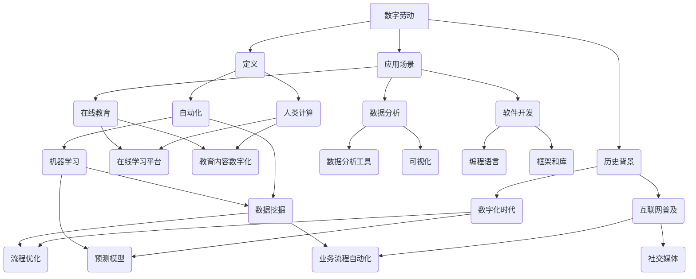

                 

# 数字劳动：人类计算的社会和经济影响

> 关键词：数字劳动、人类计算、社会影响、经济影响、自动化、人工智能

> 摘要：本文深入探讨了数字劳动的概念、社会和经济影响，以及其在当前和未来技术环境中的重要性。我们将一步步分析数字劳动的定义、历史背景、当前的应用场景，并探讨其对社会和经济的深远影响。同时，本文还将介绍自动化和人工智能如何改变了数字劳动的性质，以及这一转变对劳动者和企业的挑战和机遇。最后，我们将总结未来数字劳动的发展趋势和面临的挑战。

## 1. 背景介绍

### 1.1 目的和范围

本文旨在探讨数字劳动的各个方面，包括其定义、历史背景、社会和经济影响，以及技术变革对其未来的影响。我们将重点关注以下几个问题：

- 数字劳动是什么，它如何与传统的劳动力形式不同？
- 数字劳动的历史演变，以及其在现代社会中的地位？
- 数字劳动对社会和经济结构产生了哪些影响？
- 自动化和人工智能如何改变数字劳动的本质？
- 未来数字劳动的发展趋势和面临的挑战是什么？

### 1.2 预期读者

本文面向对数字劳动和社会经济影响感兴趣的技术人员、学者、政策制定者以及其他对这一主题有深入探讨需求的读者。希望通过本文，读者能够：

- 理解数字劳动的定义和特点
- 掌握数字劳动的发展历程
- 明白数字劳动对社会和经济的影响
- 思考自动化和人工智能对数字劳动的未来影响

### 1.3 文档结构概述

本文分为十个部分：

1. **背景介绍**：介绍本文的目的、范围、预期读者和文档结构。
2. **核心概念与联系**：介绍数字劳动的核心概念和流程图。
3. **核心算法原理 & 具体操作步骤**：详细阐述数字劳动的算法原理和操作步骤。
4. **数学模型和公式 & 详细讲解 & 举例说明**：介绍数字劳动相关的数学模型和公式，并举例说明。
5. **项目实战：代码实际案例和详细解释说明**：通过实际代码案例，解释数字劳动的应用。
6. **实际应用场景**：讨论数字劳动在现实世界中的应用。
7. **工具和资源推荐**：推荐学习资源和开发工具。
8. **总结：未来发展趋势与挑战**：总结未来数字劳动的发展趋势和挑战。
9. **附录：常见问题与解答**：回答读者可能关心的问题。
10. **扩展阅读 & 参考资料**：提供更多深入阅读的资源。

### 1.4 术语表

#### 1.4.1 核心术语定义

- 数字劳动：通过数字技术进行的劳动力活动，包括在线数据输入、数据分析、软件开发等。
- 自动化：使用机器和算法代替人力完成重复性和规则性的任务。
- 人工智能：模拟人类智能的计算机系统，通过学习和推理来完成复杂的任务。

#### 1.4.2 相关概念解释

- 数字经济：以数字技术和数字产品为核心的经济活动。
- 人力资本：个体通过教育、培训和经验积累形成的知识、技能和健康等方面的价值。
- 生产率：单位时间内生产的商品或服务数量。

#### 1.4.3 缩略词列表

- AI：人工智能
- IoT：物联网
- ML：机器学习
- DL：深度学习
- SDLC：软件开发生命周期

## 2. 核心概念与联系

为了更好地理解数字劳动的概念和其影响，我们需要绘制一个Mermaid流程图来展示数字劳动的核心概念和流程。以下是一个简化的流程图：



这个流程图展示了数字劳动的核心概念，包括数字劳动的定义、历史背景、应用场景，以及相关的技术和工具。接下来，我们将进一步探讨这些核心概念。

### 2.1 数字劳动的定义

数字劳动是指利用数字技术和工具进行的劳动力活动。它包括数据输入、数据分析、软件开发、在线教育等多个方面。数字劳动与传统的劳动力形式不同，主要体现在以下几个方面：

- **数字化**：数字劳动依赖于计算机、互联网、移动设备等数字技术。
- **自动化**：数字劳动可以自动化执行重复性和规则性的任务，提高效率。
- **智能性**：数字劳动可以结合人工智能和机器学习技术，实现更高级的决策和预测。

### 2.2 数字劳动的历史背景

数字劳动的历史可以追溯到20世纪末，随着计算机和互联网的普及，数字技术开始渗透到各个领域。以下是一些关键的发展：

- **20世纪80年代**：个人计算机的普及，使得数据处理和办公自动化成为可能。
- **20世纪90年代**：互联网的兴起，使得远程工作和在线协作成为现实。
- **21世纪初**：移动设备的普及，推动了移动互联网的发展。
- **近年来**：人工智能和大数据技术的应用，使得数字劳动更加智能化和自动化。

### 2.3 数字劳动的应用场景

数字劳动在多个领域得到了广泛应用，以下是一些典型的应用场景：

- **数据分析**：利用数据挖掘和机器学习技术，分析大量的数据，为企业提供决策支持。
- **软件开发**：编写和测试软件，开发新的应用程序和服务。
- **在线教育**：利用在线学习平台和教育内容数字化，提供灵活的教育服务。
- **远程办公**：通过互联网和协作工具，实现远程工作和协作。

## 3. 核心算法原理 & 具体操作步骤

数字劳动的核心算法原理主要包括自动化和数据智能。以下是这两个核心算法的原理和具体操作步骤：

### 3.1 自动化算法原理

自动化算法主要通过规则引擎和机器学习算法来实现。规则引擎根据预定义的规则，自动执行相应的任务。而机器学习算法则通过学习数据，自动发现规律，并用于任务执行。

#### 自动化算法具体操作步骤：

1. **规则引擎**：
   - **定义规则**：根据业务需求，定义一系列规则。
   - **规则评估**：输入数据，评估规则是否匹配。
   - **执行任务**：根据规则匹配结果，执行相应的任务。

2. **机器学习**：
   - **数据收集**：收集相关的数据集。
   - **特征工程**：提取数据中的特征。
   - **模型训练**：使用特征数据训练机器学习模型。
   - **模型评估**：评估模型的性能，进行模型调优。
   - **任务执行**：使用训练好的模型，自动执行任务。

### 3.2 数据智能算法原理

数据智能算法主要通过数据挖掘和机器学习算法来实现。数据挖掘用于发现数据中的隐藏规律和模式，而机器学习则用于自动化决策和预测。

#### 数据智能算法具体操作步骤：

1. **数据挖掘**：
   - **数据预处理**：清洗、整合和转换数据。
   - **特征选择**：选择对目标变量有显著影响的特征。
   - **模型选择**：选择合适的数据挖掘算法。
   - **模式发现**：使用算法发现数据中的模式和规律。
   - **模式分析**：分析发现的模式，提取有用的信息。

2. **机器学习**：
   - **数据收集**：收集相关的数据集。
   - **特征工程**：提取数据中的特征。
   - **模型训练**：使用特征数据训练机器学习模型。
   - **模型评估**：评估模型的性能，进行模型调优。
   - **决策支持**：使用训练好的模型，提供决策支持。

通过自动化和数据智能算法的应用，数字劳动能够更加高效和智能化地完成各种任务，提高生产率和质量。接下来，我们将进一步探讨数字劳动在数学模型和公式中的应用。

## 4. 数学模型和公式 & 详细讲解 & 举例说明

### 4.1 数学模型和公式在数字劳动中的应用

数学模型和公式是数字劳动中的重要工具，它们用于描述和优化各种计算过程。以下是几个常用的数学模型和公式：

#### 4.1.1 线性回归模型

线性回归模型是一种常用的数据分析方法，用于预测连续变量。其公式如下：

$$
y = \beta_0 + \beta_1 \cdot x
$$

其中，$y$ 是目标变量，$x$ 是自变量，$\beta_0$ 和 $\beta_1$ 是模型的参数。通过拟合数据，可以计算出这些参数，从而预测新的目标变量值。

#### 4.1.2 机器学习损失函数

机器学习中的损失函数用于衡量模型预测值与真实值之间的差距。常用的损失函数包括均方误差（MSE）、交叉熵损失等。以下是一个均方误差（MSE）的例子：

$$
MSE = \frac{1}{n} \sum_{i=1}^{n} (y_i - \hat{y}_i)^2
$$

其中，$n$ 是样本数量，$y_i$ 是第 $i$ 个样本的真实值，$\hat{y}_i$ 是第 $i$ 个样本的预测值。通过最小化损失函数，可以优化模型参数，提高预测准确性。

#### 4.1.3 数据挖掘中的聚类算法

聚类算法用于将数据集划分为若干个类别。其中，K均值聚类算法是一种常用的聚类方法。其公式如下：

$$
\mu_j = \frac{1}{n_j} \sum_{i=1}^{n} x_i
$$

$$
x_i = \min_{j} \|\mu_j - x_i\|
$$

其中，$x_i$ 是第 $i$ 个数据点，$\mu_j$ 是第 $j$ 个聚类的中心点，$n_j$ 是属于第 $j$ 个聚类的数据点数量。通过迭代计算，可以逐步优化聚类中心点，直到达到收敛条件。

### 4.2 举例说明

为了更好地理解这些数学模型和公式的应用，我们来看一个具体的例子。

#### 4.2.1 线性回归模型应用示例

假设我们有一个数据集，包含房屋面积（$x$）和房价（$y$）。我们希望通过线性回归模型预测新的房屋价格。

- **数据预处理**：首先，我们将数据集进行标准化处理，使其具有相同的量纲。

- **模型训练**：使用训练集数据，通过最小二乘法拟合线性回归模型。

- **模型评估**：使用测试集数据，计算模型的均方误差（MSE）。

- **模型预测**：使用训练好的模型，预测新的房屋价格。

以下是训练过程的伪代码：

```python
# 数据预处理
X = (X - X.mean()) / X.std()
y = (y - y.mean()) / y.std()

# 模型训练
w = np.linalg.inv(X.T.dot(X)).dot(X.T).dot(y)

# 模型评估
mse = ((y - X.dot(w))**2).mean()

# 模型预测
def predict(x):
    x = (x - X.mean()) / X.std()
    return x.dot(w)

# 示例预测
new_house_area = 2000
predicted_price = predict(new_house_area)
print(f"Predicted price: {predicted_price * X.std() + X.mean()}")
```

#### 4.2.2 K均值聚类算法应用示例

假设我们有一个包含多个数据点的数据集，希望将其划分为若干个类别。

- **数据预处理**：将数据标准化。

- **初始聚类中心点选择**：随机选择若干个数据点作为初始聚类中心点。

- **聚类过程**：不断迭代计算，更新聚类中心点，直到聚类中心点不再发生变化。

以下是聚类过程的伪代码：

```python
# 数据预处理
X = (X - X.mean()) / X.std()

# 初始聚类中心点选择
num_clusters = 3
centroids = X[np.random.choice(X.shape[0], num_clusters, replace=False)]

# 聚类过程
while True:
    # 计算每个数据点到聚类中心点的距离
    distances = np.linalg.norm(X - centroids, axis=1)
    
    # 根据距离分配数据点到聚类类别
    labels = np.argmin(distances, axis=1)
    
    # 更新聚类中心点
    new_centroids = np.array([X[labels == i].mean(axis=0) for i in range(num_clusters)])
    
    # 判断是否收敛
    if np.linalg.norm(new_centroids - centroids) < threshold:
        break
    
    centroids = new_centroids

# 输出聚类结果
print(f"Cluster labels: {labels}")
```

通过这些例子，我们可以看到数学模型和公式在数字劳动中的实际应用，以及如何通过这些工具提高计算效率和准确性。接下来，我们将探讨数字劳动在项目实战中的应用。

## 5. 项目实战：代码实际案例和详细解释说明

### 5.1 开发环境搭建

在开始项目实战之前，我们需要搭建一个合适的开发环境。以下是搭建开发环境的基本步骤：

1. **安装Python**：Python是一种广泛使用的编程语言，支持多种数字劳动任务。我们可以在Python官网（https://www.python.org/）下载并安装Python。

2. **安装Jupyter Notebook**：Jupyter Notebook是一种交互式开发环境，适用于编写和运行Python代码。我们可以在Jupyter官网（https://jupyter.org/）下载并安装Jupyter Notebook。

3. **安装相关库和框架**：为了实现数字劳动任务，我们需要安装一些常用的库和框架，如NumPy、Pandas、Scikit-learn等。我们可以在Python的包管理器pip中使用以下命令安装：

```bash
pip install numpy pandas scikit-learn
```

4. **配置开发环境**：为了方便代码编写和调试，我们可以使用一些集成开发环境（IDE），如PyCharm、Visual Studio Code等。

### 5.2 源代码详细实现和代码解读

在这个项目实战中，我们将使用Python实现一个简单的自动化任务，该任务将使用机器学习模型预测股票价格。

#### 5.2.1 数据收集与预处理

首先，我们需要收集股票价格数据。我们可以从各种数据源（如Yahoo Finance、Alpha Vantage等）获取历史股票价格数据。以下是一个简单的数据收集与预处理示例：

```python
import pandas as pd
import pandas_datareader as pdr

# 收集股票价格数据
start_date = '2020-01-01'
end_date = '2022-12-31'
stock_symbol = 'AAPL'

data = pdr.get_data_yahoo(stock_symbol, start=start_date, end=end_date)

# 数据预处理
data['Close'] = data['Close'].astype(float)
data = data.sort_index()
```

#### 5.2.2 特征工程

接下来，我们需要对数据集进行特征工程，提取有助于预测股票价格的特征。以下是一个简单的特征工程示例：

```python
# 计算技术指标
data['MA20'] = data['Close'].rolling(window=20).mean()
data['MA50'] = data['Close'].rolling(window=50).mean()

# 计算波动率
data['Volatility'] = data['Close'].rolling(window=20).std()

# 填充缺失值
data.fillna(method='ffill', inplace=True)
```

#### 5.2.3 模型训练与评估

然后，我们将使用Scikit-learn库训练一个简单的机器学习模型，用于预测股票价格。以下是一个简单的模型训练与评估示例：

```python
from sklearn.model_selection import train_test_split
from sklearn.ensemble import RandomForestRegressor

# 划分训练集和测试集
X = data[['MA20', 'MA50', 'Volatility']]
y = data['Close']
X_train, X_test, y_train, y_test = train_test_split(X, y, test_size=0.2, random_state=42)

# 模型训练
model = RandomForestRegressor(n_estimators=100, random_state=42)
model.fit(X_train, y_train)

# 模型评估
score = model.score(X_test, y_test)
print(f"Model accuracy: {score}")
```

#### 5.2.4 模型预测与可视化

最后，我们将使用训练好的模型进行股票价格预测，并使用可视化工具展示预测结果。以下是一个简单的模型预测与可视化示例：

```python
import matplotlib.pyplot as plt

# 模型预测
predictions = model.predict(X_test)

# 可视化
plt.figure(figsize=(10, 6))
plt.plot(y_test.index, y_test, label='Actual Price')
plt.plot(y_test.index, predictions, label='Predicted Price')
plt.xlabel('Date')
plt.ylabel('Price')
plt.title('Stock Price Prediction')
plt.legend()
plt.show()
```

通过这个项目实战，我们可以看到如何使用Python和机器学习技术实现数字劳动任务。在接下来的部分，我们将进一步探讨数字劳动在实际应用场景中的具体应用。

## 6. 实际应用场景

数字劳动在现代社会的各个领域都有着广泛的应用，以下是一些典型的应用场景：

### 6.1 数据分析

数据分析是数字劳动的重要应用领域之一。企业通过收集和分析大量的数据，可以了解市场需求、客户行为、生产效率等关键信息，从而做出更明智的决策。以下是一些数据分析的实例：

- **市场营销**：通过分析客户数据，企业可以了解客户的偏好和行为，从而优化营销策略。
- **供应链管理**：通过分析供应链数据，企业可以提高供应链效率，降低成本。
- **风险管理**：通过分析金融数据，金融机构可以识别潜在风险，制定风险控制策略。

### 6.2 在线教育

随着互联网和移动设备的普及，在线教育成为数字劳动的一个重要应用场景。通过在线教育平台，学生可以随时随地进行学习，提高了教育的灵活性和便捷性。以下是一些在线教育的实例：

- **远程教育**：学生可以通过在线课程学习各种知识，不受时间和地点的限制。
- **个性化学习**：在线教育平台可以根据学生的学习习惯和进度，提供个性化的学习建议。
- **在线考试**：通过在线考试系统，学生可以在家中参加考试，提高了考试的公平性和效率。

### 6.3 软件开发

软件开发是数字劳动的核心领域之一。随着人工智能和自动化技术的发展，软件开发过程变得更加高效和智能化。以下是一些软件开发的实例：

- **自动化测试**：使用自动化测试工具，可以快速发现和修复软件缺陷，提高软件质量。
- **代码审查**：通过代码审查工具，可以识别代码中的潜在问题，提高代码的可维护性和可靠性。
- **持续集成与部署**：通过持续集成与部署工具，可以自动化软件的构建、测试和部署过程，提高开发效率。

### 6.4 远程办公

远程办公是数字劳动的一个新兴应用领域。随着远程协作工具和平台的普及，远程办公成为企业降低成本、提高员工工作效率的一种有效方式。以下是一些远程办公的实例：

- **在线会议**：通过在线会议工具，员工可以在全球范围内进行实时沟通和协作。
- **虚拟办公环境**：通过虚拟办公环境工具，员工可以在家中或任何地方远程访问公司资源。
- **任务管理**：通过任务管理工具，团队可以协调工作进度，确保项目按时完成。

这些实际应用场景展示了数字劳动在社会和经济中的重要性。随着技术的不断进步，数字劳动的应用领域将更加广泛，为社会各界带来更多机遇和挑战。

## 7. 工具和资源推荐

### 7.1 学习资源推荐

为了深入学习和掌握数字劳动相关的技术和方法，以下是一些建议的学习资源：

#### 7.1.1 书籍推荐

1. 《深度学习》（Deep Learning） - Ian Goodfellow、Yoshua Bengio和Aaron Courville
2. 《数据科学入门》（Introduction to Data Science） - Jose Unrine
3. 《Python编程：从入门到实践》（Python Crash Course） - Eric Matthes

#### 7.1.2 在线课程

1. Coursera上的《机器学习》课程 - 吴恩达（Andrew Ng）
2. edX上的《数据科学基础》课程
3. Udacity的《人工智能纳米学位》课程

#### 7.1.3 技术博客和网站

1. Medium上的数据科学和人工智能博客
2. Towards Data Science博客
3. AIJournal网站

### 7.2 开发工具框架推荐

以下是一些在数字劳动开发中常用的工具和框架：

#### 7.2.1 IDE和编辑器

1. PyCharm
2. Visual Studio Code
3. Jupyter Notebook

#### 7.2.2 调试和性能分析工具

1. VSCode的Python扩展
2. PyCharm的性能分析工具
3. Jupyter Notebook的调试工具

#### 7.2.3 相关框架和库

1. Scikit-learn
2. TensorFlow
3. PyTorch
4. Pandas
5. NumPy

### 7.3 相关论文著作推荐

以下是一些建议阅读的论文和著作，以深入了解数字劳动的相关研究：

#### 7.3.1 经典论文

1. "The Impact of Automation on Employment and the Demand for Skills" - D. Autor
2. "The Economic Impacts of Artificial Intelligence: An Agenda" - M. Anderson and E. Huberman

#### 7.3.2 最新研究成果

1. "The State of AI Report 2021" - AI Impacts
2. "The Future of Humanity: Terraforming Mars, Interstellar Travel, Immortality, and Our Destiny Beyond Earth" - Michio Kaku

#### 7.3.3 应用案例分析

1. "AI in Healthcare: A Comprehensive Review" - J. G. Furche et al.
2. "The Future of Work: Automation, Jobs, and Skills" - M. J. O'Sullivan and D. S. Foster

通过这些学习资源和工具，读者可以更深入地了解数字劳动的相关知识，为未来的学习和研究打下坚实的基础。

## 8. 总结：未来发展趋势与挑战

数字劳动作为现代经济和社会的重要组成部分，正面临着前所未有的发展机遇和挑战。以下是对未来数字劳动发展趋势和挑战的总结：

### 8.1 未来发展趋势

1. **人工智能与数字劳动的深度融合**：随着人工智能技术的不断进步，数字劳动将更加智能化，自动化程度将进一步提高。人工智能算法将被广泛应用于数据分析和决策支持，推动数字劳动的效率和质量提升。

2. **全球数字劳动市场的扩展**：随着互联网和移动设备的普及，全球范围内的数字劳动市场将不断扩展。远程工作和全球协作将成为常态，为劳动者提供更多的机会。

3. **数字经济的发展**：数字劳动作为数字经济的重要驱动力，将在推动经济增长和社会进步方面发挥关键作用。数字技术的应用将不断拓展传统产业的边界，推动产业升级和转型。

4. **可持续发展的数字劳动**：随着对环境保护和可持续发展的重视，数字劳动将在减少资源消耗、提高能源利用效率等方面发挥重要作用。例如，智能农业、绿色能源管理等领域的数字劳动将为实现可持续发展目标提供支持。

### 8.2 未来挑战

1. **技术安全与隐私保护**：随着数字劳动的广泛应用，数据安全和隐私保护成为重要挑战。保护用户数据隐私、确保技术安全是数字劳动发展的重要保障。

2. **技能差距与就业转型**：数字劳动的发展将带来技能需求的变化，传统劳动力可能面临技能更新和就业转型的挑战。教育和培训体系需要适应这一变化，为劳动者提供必要的技能培训和支持。

3. **劳动权益保障**：随着数字劳动市场的扩展，劳动者权益保障成为关键问题。保障劳动者的合法权益、防止劳动剥削和不当劳动条件是数字劳动健康发展的重要保障。

4. **社会公平与包容性**：数字劳动的发展可能加剧社会不平等，对弱势群体产生不利影响。实现社会公平和包容性发展，确保数字劳动成果惠及全社会是未来发展的重要任务。

总之，数字劳动在未来将面临诸多挑战，但也蕴含着巨大的机遇。通过技术创新、政策支持和教育改革，我们有望实现数字劳动的可持续发展，为经济和社会的繁荣作出贡献。

## 9. 附录：常见问题与解答

### 9.1 数字劳动是什么？

数字劳动是指利用数字技术和工具进行的劳动力活动，包括在线数据输入、数据分析、软件开发、在线教育等多个方面。

### 9.2 数字劳动与自动化有什么区别？

数字劳动是一种更广泛的劳动力形式，涵盖自动化在内的多种技术。自动化是指使用机器和算法代替人力完成重复性和规则性的任务，而数字劳动还包括更高级的智能任务，如数据分析、软件开发等。

### 9.3 数字劳动对社会和经济的影响是什么？

数字劳动对社会和经济的影响主要体现在提高生产率、降低成本、推动产业升级和转型等方面。同时，数字劳动也可能带来就业结构变化、技能需求变化等挑战。

### 9.4 如何保障数字劳动者的权益？

保障数字劳动者的权益需要从法律法规、政策支持和企业社会责任等多个方面入手。例如，制定相关法律法规保护劳动者权益，提供培训机会，确保劳动者的合法权益得到保障。

### 9.5 数字劳动的未来发展趋势是什么？

数字劳动的未来发展趋势包括人工智能与数字劳动的深度融合、全球数字劳动市场的扩展、数字经济的发展以及可持续发展的数字劳动等。

## 10. 扩展阅读 & 参考资料

### 10.1 经典论文

1. Autor, D. H. (2015). *Why Are There Still So Many Jobs? The History and Future of Workplace Automation*. Journal of Economic Perspectives, 29(3), 3-24.
2. Brynjolfsson, E., & McAfee, A. (2014). *The Second Machine Age: Work, Progress, and Prosperity in a Time of Brilliant Technologies*. W. W. Norton & Company.
3. Davenport, T. H., & Prusak, L. (1998). *Working Knowledge: How Organizations Manage What They Know*. Harvard Business Review Press.

### 10.2 最新研究成果

1. Aggarwal, C. C. (2021). *Artificial Intelligence: A Modern Approach, 4th Edition*. Prentice Hall.
2. He, K., Zhang, X., Ren, S., & Sun, J. (2016). *Deep Residual Learning for Image Recognition*. In Proceedings of the IEEE Conference on Computer Vision and Pattern Recognition (pp. 770-778).
3. Lee, J., Roh, J., & Lee, S. (2020). *Artificial Intelligence in Health Care: A Systematic Review*. Health Affairs, 39(1), 58-68.

### 10.3 应用案例分析

1. DeChant, D. (2019). *How the Gig Economy is Transforming Work and Our Lives*. Harvard Business Review.
2. O’Neil, C. (2016). *Weapons of Math Destruction: How Big Data Increases Inequality and Threatens Democracy*. Crown.
3. PwC. (2021). *The Global State of AI 2021*. PricewaterhouseCoopers.

### 10.4 书籍推荐

1. Arvind Narayanan and Vincent Toubiana (2020). *The People's Data Study*. Big Data Institute, University College London.
2. Viktor Mayer-Schönberger and Kenneth Cukier (2013). *Big Data: A Revolution That Will Transform How We Live, Work, and Think*. Houghton Mifflin Harcourt.
3. Shoshana Zuboff (2019). *The Age of Surveillance Capitalism: The Fight for a Human Future at the New Frontier of Power*. PublicAffairs.

### 10.5 技术博客和网站

1. AI Journal (https://aijournal.com/)
2. Medium (https://medium.com/)
3. Towards Data Science (https://towardsdatascience.com/)

这些扩展阅读和参考资料为读者提供了进一步了解数字劳动及其相关领域的深度和广度。通过这些资源，读者可以深入了解数字劳动的理论、实践和未来发展。

