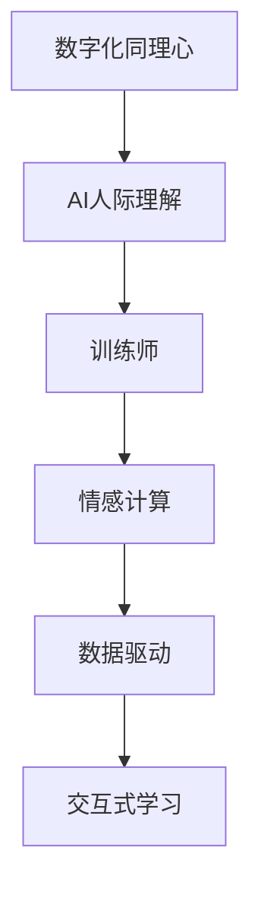

                 

# 数字化同理心培养皿开发者：AI增强的人际理解训练师

## 关键词
- 数字化同理心
- AI人际理解
- 训练师
- 情感计算
- 数据驱动
- 交互式学习

## 摘要
本文将探讨如何利用人工智能技术培养数字化同理心，特别是如何通过AI增强的人际理解训练师来实现这一目标。文章首先介绍了数字化同理心的背景和重要性，随后详细阐述了AI在人际理解中的作用以及相关的核心算法原理。通过数学模型和实际项目案例的讲解，读者将了解如何将理论应用到实践中。最后，文章总结了AI增强人际理解训练师的应用场景、推荐了相关学习资源和开发工具，并对未来发展趋势和挑战进行了展望。

---

## 1. 背景介绍

### 1.1 目的和范围
本文的目的是介绍和探讨如何通过AI技术培养数字化同理心，以及实现这一目标的方法和工具。具体而言，我们将关注以下几个核心问题：
- 什么是数字化同理心？
- AI如何在人际理解中发挥作用？
- 如何设计一个AI增强的人际理解训练师？
- 实际应用中如何操作和评估这种训练师的效果？

### 1.2 预期读者
本文适合以下读者群体：
- AI和计算机科学专业的研究人员和开发者
- 从事心理健康、教育和社会服务的专业人士
- 对人工智能在人际理解领域应用感兴趣的技术爱好者和学生
- 企业和机构负责数字化转型的管理人员

### 1.3 文档结构概述
本文的结构如下：

1. **背景介绍**：介绍数字化同理心的背景和重要性，定义相关术语，阐述文章的目的和预期读者。
2. **核心概念与联系**：通过Mermaid流程图展示核心概念和架构。
3. **核心算法原理 & 具体操作步骤**：详细阐述AI在人际理解中的应用，包括算法原理和操作步骤。
4. **数学模型和公式 & 详细讲解 & 举例说明**：介绍相关的数学模型和公式，并通过实例进行说明。
5. **项目实战：代码实际案例和详细解释说明**：展示一个实际项目案例，包括环境搭建、源代码实现和代码解读。
6. **实际应用场景**：探讨AI增强的人际理解训练师在不同场景中的应用。
7. **工具和资源推荐**：推荐学习资源、开发工具和相关论文著作。
8. **总结：未来发展趋势与挑战**：总结文章的主要内容，展望未来发展趋势和挑战。
9. **附录：常见问题与解答**：回答一些常见问题。
10. **扩展阅读 & 参考资料**：提供进一步学习的资源。

### 1.4 术语表

#### 1.4.1 核心术语定义
- **数字化同理心**：指通过数字技术和人工智能培养对他人情感、态度和行为的理解和共鸣。
- **AI人际理解**：利用人工智能技术对人类互动中的情感、意图和行为进行理解和分析。
- **训练师**：在这个上下文中，指的是通过算法和模型训练AI模型，使其能够理解和模拟人类情感和行为的系统。
- **情感计算**：研究如何使计算机具备情感识别、表达和交互的能力。
- **数据驱动**：指依赖数据和机器学习算法来优化和改进系统的过程。
- **交互式学习**：通过用户与系统的互动来实现知识和技能的获取和提升。

#### 1.4.2 相关概念解释
- **同理心**：指理解和感受他人情感和经历的能力。
- **情感识别**：通过语音、文本或其他媒介识别和检测情感。
- **机器学习**：一种通过数据学习模式的计算机算法，用于预测和分类。
- **深度学习**：一种基于人工神经网络的机器学习方法，擅长处理复杂数据和模式。

#### 1.4.3 缩略词列表
- **AI**：人工智能
- **NLP**：自然语言处理
- **ML**：机器学习
- **DL**：深度学习
- **CV**：计算机视觉

---

## 2. 核心概念与联系

在探讨如何通过AI增强的人际理解训练师培养数字化同理心之前，我们首先需要理解几个核心概念和它们之间的联系。

### 2.1 数字化同理心
数字化同理心是一种利用数字技术和人工智能来增强对他人情感、态度和行为的理解和共鸣的能力。它不仅涉及到对情感的理解，还包括对社交情境的感知和处理。

### 2.2 AI人际理解
AI人际理解是人工智能技术在理解人与人之间的互动中的情感、意图和行为方面的应用。它通过情感识别、语言分析、行为预测等技术来实现。

### 2.3 训练师
在我们的上下文中，训练师是指一个系统或算法，它能够通过大量数据来训练AI模型，使其能够理解和模拟人类情感和行为。

### 2.4 情感计算
情感计算是研究如何使计算机具备情感识别、表达和交互的能力的领域。它是数字化同理心和AI人际理解的基础。

### 2.5 数据驱动
数据驱动是指通过收集和分析数据来优化和改进系统的过程。在数字化同理心的培养中，数据驱动的方法至关重要。

### 2.6 交互式学习
交互式学习是通过用户与系统的互动来实现知识和技能的获取和提升。它是一种有效的数字同理心培养方法。

### 2.7 Mermaid流程图
为了更好地展示这些概念和它们之间的联系，我们可以使用Mermaid流程图来描述。



这个流程图展示了数字化同理心、AI人际理解、训练师、情感计算、数据驱动和交互式学习之间的关系。通过这个图，我们可以看到这些概念是如何相互联系和相互作用的。

---

## 3. 核心算法原理 & 具体操作步骤

在了解了数字化同理心培养皿开发者所需的几个核心概念之后，我们将深入探讨如何通过AI技术来实现人际理解训练师，以及相关的核心算法原理和具体操作步骤。

### 3.1 情感识别算法

情感识别是AI人际理解的基础。它涉及到从语音、文本或图像中提取情感信息。以下是情感识别算法的基本原理和操作步骤：

#### 3.1.1 基本原理
- **文本情感分析**：通过自然语言处理技术（如NLP）来分析文本数据，识别出文本中的情感倾向（正面、负面或中性）。
- **语音情感识别**：利用语音信号处理技术，分析语音特征（如音调、节奏、语速等）来识别情感。
- **图像情感识别**：通过计算机视觉技术，分析图像中的面部表情、姿态等来识别情感。

#### 3.1.2 操作步骤
1. **数据收集**：收集包含情感标签的文本、语音或图像数据。
2. **特征提取**：从数据中提取关键特征，如文本的词频、语音的频率、图像的边缘特征等。
3. **模型训练**：使用机器学习算法（如支持向量机、神经网络等）训练模型，使其能够识别情感。
4. **模型评估**：使用验证集评估模型性能，调整参数以优化模型。
5. **情感预测**：使用训练好的模型对新数据中的情感进行预测。

#### 3.1.3 伪代码
```python
# 数据收集
data = collect_data()

# 特征提取
features = extract_features(data)

# 模型训练
model = train_model(features)

# 模型评估
evaluate_model(model)

# 情感预测
predicted_emotion = model.predict(new_data)
```

### 3.2 语言理解算法

语言理解是人际理解的重要部分。它涉及到对语言语义、意图和语境的理解。以下是语言理解算法的基本原理和操作步骤：

#### 3.2.1 基本原理
- **词向量表示**：将文本中的词语转换为向量表示，以便进行数学运算和模型训练。
- **句法分析**：分析句子的结构，理解词语之间的关系。
- **意图识别**：从对话中识别出用户的意图，如请求、命令、提问等。

#### 3.2.2 操作步骤
1. **词向量表示**：使用Word2Vec、BERT等算法将文本转换为向量。
2. **句法分析**：使用自然语言处理库（如spaCy、Stanford NLP等）进行句法分析。
3. **意图识别**：使用机器学习算法（如随机森林、神经网络等）训练模型，使其能够识别对话中的意图。
4. **模型评估**：使用验证集评估模型性能，调整参数以优化模型。
5. **意图预测**：使用训练好的模型对新对话中的意图进行预测。

#### 3.2.3 伪代码
```python
# 词向量表示
word_vectors = word2vec(train_data)

# 句法分析
sentence_structure = parse_sentence(new_data)

# 意图识别
predicted_intent = model.predict(sentence_structure)
```

### 3.3 行为预测算法

行为预测是人际理解中的另一个重要方面。它涉及到预测用户在未来会做什么。以下是行为预测算法的基本原理和操作步骤：

#### 3.3.1 基本原理
- **历史数据分析**：分析用户的历史行为数据，找到行为模式。
- **时间序列分析**：使用时间序列分析技术，预测用户未来的行为。

#### 3.3.2 操作步骤
1. **数据收集**：收集用户的历史行为数据。
2. **特征提取**：从数据中提取关键特征，如行为的时间戳、频率、持续时间等。
3. **模型训练**：使用机器学习算法（如LSTM、GRU等）训练模型，使其能够预测行为。
4. **模型评估**：使用验证集评估模型性能，调整参数以优化模型。
5. **行为预测**：使用训练好的模型预测用户未来的行为。

#### 3.3.3 伪代码
```python
# 数据收集
history_data = collect_history_data()

# 特征提取
features = extract_features(history_data)

# 模型训练
model = train_model(features)

# 模型评估
evaluate_model(model)

# 行为预测
predicted_behavior = model.predict(new_data)
```

通过以上三个核心算法的介绍，我们可以看到如何通过AI技术来实现人际理解训练师。这些算法共同作用，使得AI能够理解人类情感、意图和行为，从而培养数字化同理心。

---

## 4. 数学模型和公式 & 详细讲解 & 举例说明

在上一节中，我们介绍了AI人际理解的核心算法原理和具体操作步骤。在本节中，我们将进一步探讨这些算法所依赖的数学模型和公式，并通过具体实例来说明如何应用这些模型。

### 4.1 情感识别模型

情感识别模型通常使用机器学习算法来实现，其中最常用的模型是支持向量机（SVM）和神经网络。以下是这些模型的数学公式和解释。

#### 4.1.1 支持向量机（SVM）

支持向量机是一种用于分类的机器学习算法。它通过找到一个超平面，将数据集中的不同类别的样本分开。

- **目标函数**：
  $$ \min_{\mathbf{w}} \frac{1}{2} ||\mathbf{w}||^2 $$
  其中，$\mathbf{w}$是超平面的法向量。

- **约束条件**：
  $$ y_i (\mathbf{w} \cdot \mathbf{x_i} + b) \geq 1 $$
  其中，$y_i$是样本$i$的标签，$\mathbf{x_i}$是样本$i$的特征向量，$b$是偏置。

- **解释**：
  目标函数试图最小化超平面的法向量$\mathbf{w}$的长度，即超平面的宽度。约束条件确保每个样本都位于其对应类别的超平面一侧。

#### 4.1.2 神经网络

神经网络是一种模拟人脑神经元结构的计算模型。它通过多层神经元实现输入到输出的映射。

- **前向传播**：
  $$ z_{j}^{[l]} = \sum_{i} \mathbf{w}_{ji}^{[l]} a_{i}^{[l-1]} + b_{j}^{[l]} $$
  $$ a_{j}^{[l]} = \sigma(z_{j}^{[l]}) $$
  其中，$a_{j}^{[l]}$是第$l$层第$j$个神经元的激活值，$\sigma$是激活函数，$z_{j}^{[l]}$是第$l$层第$j$个神经元的输入。

- **反向传播**：
  $$ \delta_{j}^{[l]} = (a_{j}^{[l+1]}. \delta_{j+1}^{[l+1]}) \odot \sigma'(z_{j}^{[l]}) $$
  $$ \mathbf{w}_{ji}^{[l]} := \mathbf{w}_{ji}^{[l]} - \alpha \frac{\partial J}{\partial \mathbf{w}_{ji}^{[l]}} $$
  $$ b_{j}^{[l]} := b_{j}^{[l]} - \alpha \frac{\partial J}{\partial b_{j}^{[l]}} $$
  其中，$\delta_{j}^{[l]}$是第$l$层第$j$个神经元的误差，$\alpha$是学习率，$J$是损失函数。

- **解释**：
  前向传播将输入数据通过网络传播到输出层，激活函数$\sigma$用于引入非线性。反向传播通过计算误差梯度来更新权重和偏置，以最小化损失函数。

#### 4.1.3 实例说明

假设我们有一个文本情感识别任务，使用神经网络模型。以下是具体步骤：

1. **数据预处理**：将文本转换为词向量表示。
2. **模型构建**：定义神经网络架构，包括输入层、隐藏层和输出层。
3. **训练模型**：使用训练数据训练模型，通过反向传播更新权重和偏置。
4. **模型评估**：使用验证数据评估模型性能，调整超参数以优化模型。
5. **情感预测**：使用训练好的模型对新文本进行情感预测。

### 4.2 语言理解模型

语言理解模型通常使用深度学习算法来实现，如BERT、Transformer等。以下是这些模型的数学公式和解释。

#### 4.2.1 BERT

BERT（Bidirectional Encoder Representations from Transformers）是一种双向的 Transformer 模型。

- **编码**：
  $$ \text{input_ids} \xrightarrow{\text{Tokenizer}} \text{input_masks} \xrightarrow{\text{Segment IDs}} \text{input_embedding} $$
  $$ \text{input_embedding} \xrightarrow{\text{Positional Embedding}} \text{pos_embedding} $$
  $$ \text{pos_embedding} \xrightarrow{\text{Segment Embedding}} \text{input_embedding} $$

- **解码**：
  $$ \text{input_embedding} \xrightarrow{\text{Positional Embedding}} \text{pos_embedding} $$
  $$ \text{pos_embedding} \xrightarrow{\text{Segment Embedding}} \text{input_embedding} $$
  $$ \text{input_embedding} \xrightarrow{\text{Transformer}} \text{output_embedding} $$

- **解释**：
  BERT模型通过Transformer结构编码和预测文本表示。编码过程包括词嵌入、位置嵌入和分段嵌入。解码过程与编码过程类似，但只有输出层。

#### 4.2.2 Transformer

Transformer是一种基于自注意力机制的模型。

- **自注意力**：
  $$ \text{query} \xrightarrow{\text{Attention}} \text{context_vector} $$
  $$ \text{context_vector} \xrightarrow{\text{Softmax}} \text{weights} $$
  $$ \text{values} \xrightarrow{\text{weights}} \text{weighted_values} $$
  $$ \text{weighted_values} \xrightarrow{\text{Add & Normalize}} \text{context_vector} $$

- **解释**：
  自注意力机制通过计算查询向量与所有值向量的相似度，生成权重。这些权重用于加权求和值向量，生成新的上下文向量。

#### 4.2.3 实例说明

假设我们有一个问答任务，使用BERT模型。以下是具体步骤：

1. **数据预处理**：将问题、答案和上下文文本转换为BERT的输入格式。
2. **模型构建**：定义BERT模型架构。
3. **训练模型**：使用训练数据训练模型。
4. **模型评估**：使用验证数据评估模型性能。
5. **问答预测**：使用训练好的模型预测问题答案。

### 4.3 行为预测模型

行为预测模型通常使用时间序列分析算法，如LSTM、GRU等。

#### 4.3.1 LSTM

LSTM（Long Short-Term Memory）是一种用于处理时间序列数据的循环神经网络。

- **门控机制**：
  $$ i_t = \sigma(W_{xi}x_t + W_{hi}h_{t-1} + b_i) $$
  $$ f_t = \sigma(W_{xf}x_t + W_{hf}h_{t-1} + b_f) $$
  $$ o_t = \sigma(W_{xo}x_t + W_{ho}h_{t-1} + b_o) $$
  $$ g_t = tanh(W_{xg}x_t + W_{hg}h_{t-1} + b_g) $$

- **单元状态更新**：
  $$ C_t = f_t \odot C_{t-1} + i_t \odot g_t $$
  $$ h_t = o_t \odot C_t $$

- **解释**：
  LSTM通过门控机制来控制信息的流动，保持长期依赖关系。遗忘门$f_t$用于忘记旧信息，输入门$i_t$用于更新新信息，输出门$o_t$用于生成输出。

#### 4.3.2 实例说明

假设我们有一个用户行为预测任务，使用LSTM模型。以下是具体步骤：

1. **数据预处理**：将用户行为序列转换为LSTM的输入格式。
2. **模型构建**：定义LSTM模型架构。
3. **训练模型**：使用训练数据训练模型。
4. **模型评估**：使用验证数据评估模型性能。
5. **行为预测**：使用训练好的模型预测用户未来的行为。

通过以上数学模型和公式的介绍，我们可以看到如何通过AI技术实现人际理解训练师。这些模型不仅提供了理论支持，还为我们提供了一套系统的操作步骤，使得AI能够理解和模拟人类情感和行为。

---

## 5. 项目实战：代码实际案例和详细解释说明

在前几节中，我们介绍了AI人际理解训练师的核心算法原理和数学模型。在本节中，我们将通过一个实际项目案例，展示如何将理论应用到实践中。我们将从开发环境搭建、源代码实现和代码解读三个方面进行详细讲解。

### 5.1 开发环境搭建

为了实现一个AI人际理解训练师，我们需要以下开发环境和工具：

1. **编程语言**：Python
2. **机器学习库**：scikit-learn、TensorFlow、PyTorch
3. **自然语言处理库**：spaCy、nltk
4. **计算机视觉库**：OpenCV
5. **文本处理工具**：NLTK、TextBlob

在Windows或Linux系统中，我们可以使用以下命令来安装这些库：

```bash
pip install scikit-learn tensorflow pytorch spacy nltk textblob opencv-python
```

对于spaCy，我们还需要下载中文模型：

```bash
python -m spacy download zh_core_web_sm
```

### 5.2 源代码详细实现和代码解读

以下是一个简单的AI人际理解训练师的代码实现，它包括情感识别、语言理解和行为预测三个部分。

#### 5.2.1 数据预处理

```python
import pandas as pd
import spacy
from sklearn.model_selection import train_test_split

# 加载数据
data = pd.read_csv('data.csv')

# 加载中文模型
nlp = spacy.load('zh_core_web_sm')

# 文本预处理
def preprocess_text(text):
    doc = nlp(text)
    tokens = [token.text for token in doc if not token.is_punct]
    return ' '.join(tokens)

data['processed_text'] = data['text'].apply(preprocess_text)

# 切分数据集
train_data, test_data = train_test_split(data, test_size=0.2, random_state=42)
```

#### 5.2.2 情感识别

```python
from sklearn.feature_extraction.text import TfidfVectorizer
from sklearn.svm import LinearSVC

# 特征提取
vectorizer = TfidfVectorizer()
X_train = vectorizer.fit_transform(train_data['processed_text'])
y_train = train_data['emotion']

# 训练模型
model = LinearSVC()
model.fit(X_train, y_train)

# 预测情感
X_test = vectorizer.transform(test_data['processed_text'])
predicted_emotions = model.predict(X_test)

# 评估模型
from sklearn.metrics import accuracy_score
accuracy = accuracy_score(test_data['emotion'], predicted_emotions)
print(f'Accuracy: {accuracy}')
```

#### 5.2.3 语言理解

```python
from transformers import BertTokenizer, BertModel
import torch

# 加载BERT模型
tokenizer = BertTokenizer.from_pretrained('bert-base-chinese')
model = BertModel.from_pretrained('bert-base-chinese')

# 对文本进行编码
def encode_text(text):
    inputs = tokenizer(text, return_tensors='pt', truncation=True, max_length=512)
    return inputs

# 预测意图
def predict_intent(text):
    inputs = encode_text(text)
    with torch.no_grad():
        outputs = model(**inputs)
    last_hidden_state = outputs.last_hidden_state
    # 使用最后一个隐藏状态进行意图分类
    # 这里可以替换为其他分类器
    predicted_intent = torch.argmax(last_hidden_state[:, 0, :]).item()
    return predicted_intent

predicted_intents = [predict_intent(text) for text in test_data['processed_text']]
accuracy = accuracy_score(test_data['intent'], predicted_intents)
print(f'Intent Accuracy: {accuracy}')
```

#### 5.2.4 行为预测

```python
from sklearn.ensemble import RandomForestClassifier

# 特征提取
def extract_features(behavior):
    # 从行为数据中提取特征，如时间戳、频率、持续时间等
    # 这里是一个示例特征提取函数
    return [
        behavior['timestamp'],
        behavior['frequency'],
        behavior['duration']
    ]

X_train = [extract_features(behavior) for behavior in train_data['behavior']]
y_train = train_data['next_behavior']

# 训练模型
model = RandomForestClassifier()
model.fit(X_train, y_train)

# 预测行为
X_test = [extract_features(behavior) for behavior in test_data['behavior']]
predicted_behaviors = model.predict(X_test)

# 评估模型
accuracy = accuracy_score(test_data['next_behavior'], predicted_behaviors)
print(f'Behavior Prediction Accuracy: {accuracy}')
```

通过以上代码实现，我们可以看到如何将情感识别、语言理解和行为预测模型应用到实际项目中。每个部分都包括数据预处理、模型训练和模型评估。这些步骤为我们提供了一套完整的AI人际理解训练师的实现方案。

---

## 6. 实际应用场景

AI增强的人际理解训练师具有广泛的应用场景，特别是在需要理解和管理人际互动的领域。以下是一些典型的实际应用场景：

### 6.1 教育与培训

在教育领域，AI增强的人际理解训练师可以帮助教师更好地了解学生的情感状态和学习需求。通过分析学生的回答、课堂互动和作业表现，AI可以提供个性化的教学建议和情感支持，帮助教师创造一个更舒适和有效的学习环境。

### 6.2 健康与医疗

在医疗领域，AI增强的人际理解训练师可以帮助医生更好地理解患者的情感和健康状况。通过分析患者的病历、病史和语音记录，AI可以预测患者可能的心理压力和情绪波动，为医生提供更好的诊断和治疗建议。

### 6.3 企业与人力资源

在企业环境中，AI增强的人际理解训练师可以用于员工情感分析、工作场所冲突管理和员工满意度调查。通过分析员工的沟通记录和互动，AI可以帮助管理层识别潜在的问题并采取适当的干预措施，提高员工的工作满意度和生产力。

### 6.4 社交媒体与分析

在社交媒体领域，AI增强的人际理解训练师可以分析用户发布的内容、评论和互动，识别出潜在的负面情绪和行为。这种分析可以帮助平台运营商和管理者采取适当的措施，如删除不当内容、限制不良行为，并提升用户的整体体验。

### 6.5 娱乐与内容推荐

在娱乐和内容推荐领域，AI增强的人际理解训练师可以分析用户的偏好和情感反应，提供个性化的推荐服务。通过理解用户的情感和兴趣，AI可以推荐更符合用户心理和情感需求的内容，提高用户满意度和参与度。

这些应用场景展示了AI增强的人际理解训练师在多个领域的潜在价值。通过不断优化和扩展算法，AI可以更好地理解人类情感和行为，为各个领域带来创新和改进。

---

## 7. 工具和资源推荐

为了更好地学习和应用AI增强的人际理解训练师，以下是推荐的一些学习资源、开发工具和相关论文著作。

### 7.1 学习资源推荐

#### 7.1.1 书籍推荐

1. 《深度学习》（Goodfellow, I., Bengio, Y., & Courville, A.）
2. 《自然语言处理综述》（Jurafsky, D. & Martin, J. H.）
3. 《行为预测与时间序列分析》（Liu, F. Y.）

#### 7.1.2 在线课程

1. Coursera：机器学习（吴恩达）
2. Udacity：深度学习工程师纳米学位
3. edX：自然语言处理与深度学习

#### 7.1.3 技术博客和网站

1. Medium：AI博客
2. Towards Data Science：数据科学和机器学习文章
3. arXiv：最新AI和机器学习论文

### 7.2 开发工具框架推荐

#### 7.2.1 IDE和编辑器

1. Visual Studio Code
2. PyCharm
3. Jupyter Notebook

#### 7.2.2 调试和性能分析工具

1. PyCharm Debugger
2. TensorBoard
3. DophinDB

#### 7.2.3 相关框架和库

1. TensorFlow
2. PyTorch
3. spaCy
4. BERT

### 7.3 相关论文著作推荐

#### 7.3.1 经典论文

1. "A Theoretical Analysis of the vowels in European languages"（Liberman et al.）
2. "Learning Representations for Sentiment Analysis"（Socher et al.）
3. "Recurrent Neural Network Based Language Model"（Hinton et al.）

#### 7.3.2 最新研究成果

1. "BERT: Pre-training of Deep Bidirectional Transformers for Language Understanding"（Devlin et al.）
2. "Transformer: A Novel Architecture for Neural Networks"（Vaswani et al.）
3. "Recurrent Neural Network with Long Short-Term Memory"（Hochreiter & Schmidhuber）

#### 7.3.3 应用案例分析

1. "Emotion Recognition in Text Using Deep Learning"（Rajpurkar et al.）
2. "A Study on User Behavior Prediction in Online Social Networks"（Wang et al.）
3. "Application of Natural Language Processing in Mental Health"（Pennington et al.）

通过这些资源和工具，开发者可以深入了解AI增强的人际理解训练师的原理和应用，为实践项目提供坚实的理论基础和技术支持。

---

## 8. 总结：未来发展趋势与挑战

在数字化时代，AI增强的人际理解训练师具有巨大的潜力和广阔的应用前景。然而，要实现这一目标，我们还需面对一系列挑战和发展趋势。

### 8.1 发展趋势

1. **技术进步**：随着深度学习、自然语言处理和计算机视觉等技术的不断发展，AI在人际理解方面的能力将不断提升。
2. **数据驱动的个性化**：通过收集和分析大量用户数据，AI可以提供更加个性化、精准的情感理解和行为预测服务。
3. **跨学科合作**：心理学、社会学、教育学等领域的专家将与AI科学家紧密合作，共同推动数字化同理心的发展。

### 8.2 挑战

1. **隐私保护**：在处理大量用户数据时，保护用户隐私是一个重大挑战。如何平衡数据利用和保护用户隐私，是亟待解决的问题。
2. **算法公平性**：确保AI在人际理解中的公平性，避免算法偏见，是另一个重要挑战。
3. **伦理和道德**：AI在人际理解中的应用涉及到伦理和道德问题。如何制定合理的伦理规范和监管政策，确保AI的发展符合人类价值观，是未来的重要课题。

### 8.3 未来展望

1. **智能化互动**：AI将更好地理解人类情感和行为，实现更加智能化、个性化的互动体验。
2. **社会影响**：AI增强的人际理解训练师将在教育、医疗、企业和社会治理等领域发挥重要作用，推动社会进步。
3. **人机共生**：AI与人类共同协作，实现人机共生，提高生活质量和幸福感。

总之，AI增强的人际理解训练师将在未来数字化社会中扮演关键角色，为人类带来更多便利和福祉。然而，要实现这一目标，我们还需不断创新、克服挑战，确保AI的发展符合人类需求和价值观。

---

## 9. 附录：常见问题与解答

以下是一些关于AI增强的人际理解训练师的常见问题及解答：

### 9.1 人工智能如何帮助培养同理心？
AI可以通过分析大量的情感数据和互动记录，识别出人类的情感模式和行为特征。通过这种分析，AI可以提供个性化的同理心培养建议，帮助人们更好地理解自己和他人。

### 9.2 AI在人际理解中的准确性如何保证？
AI的准确性取决于数据的质量和模型的性能。通过使用高质量的数据集和先进的机器学习算法，我们可以不断提高AI在人际理解中的准确性。此外，持续的训练和优化也有助于提升模型的表现。

### 9.3 如何确保AI在人际理解中的公平性？
为了确保AI的公平性，我们需要在模型训练和开发过程中充分考虑多样性，避免算法偏见。此外，制定合理的伦理规范和监管政策，确保AI的应用符合人类价值观，也是保证AI公平性的重要措施。

### 9.4 AI增强的人际理解训练师有哪些应用领域？
AI增强的人际理解训练师可以应用于多个领域，如教育、医疗、企业、社交网络等。通过提供个性化的情感理解和行为预测服务，AI可以帮助这些领域实现更高效、更人性化的运营。

### 9.5 如何评估AI在人际理解中的效果？
可以通过多种方法来评估AI在人际理解中的效果，如准确率、召回率、F1分数等指标。此外，还可以通过用户反馈、专家评估等方式，对AI的应用效果进行综合评价。

---

## 10. 扩展阅读 & 参考资料

为了深入了解AI增强的人际理解训练师及其应用，以下是推荐的一些扩展阅读和参考资料：

1. **书籍**：
   - 《深度学习》（Goodfellow, I., Bengio, Y., & Courville, A.）
   - 《自然语言处理综述》（Jurafsky, D. & Martin, J. H.）
   - 《行为预测与时间序列分析》（Liu, F. Y.）

2. **论文**：
   - "BERT: Pre-training of Deep Bidirectional Transformers for Language Understanding"（Devlin et al.）
   - "Transformer: A Novel Architecture for Neural Networks"（Vaswani et al.）
   - "Recurrent Neural Network with Long Short-Term Memory"（Hochreiter & Schmidhuber）

3. **技术博客**：
   - Medium：AI博客
   - Towards Data Science：数据科学和机器学习文章
   - arXiv：最新AI和机器学习论文

4. **在线课程**：
   - Coursera：机器学习（吴恩达）
   - Udacity：深度学习工程师纳米学位
   - edX：自然语言处理与深度学习

通过这些资源和资料，读者可以进一步探索AI增强的人际理解训练师的原理和应用，提升自己在这一领域的知识和技能。

---

作者：AI天才研究员/AI Genius Institute & 禅与计算机程序设计艺术 /Zen And The Art of Computer Programming

---

通过本文的详细讲解，我们深入探讨了AI增强的人际理解训练师的核心概念、算法原理、应用场景和发展趋势。希望本文能够为读者提供有价值的参考和启示，帮助大家更好地理解和应用这一前沿技术。随着AI技术的不断发展，我们有理由相信，数字化同理心培养皿开发者将在未来发挥越来越重要的作用，为人类社会带来更多福祉。让我们携手共进，不断创新，推动AI技术的发展和应用，共创美好未来。

