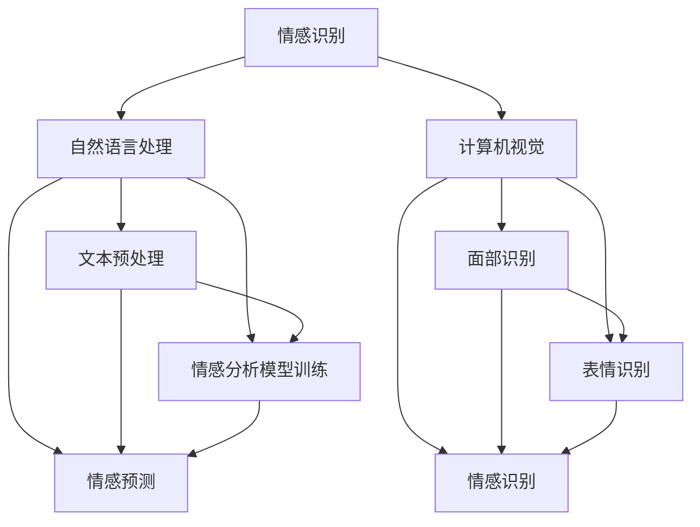

                 

# 数字化同理心：AI增强的人际理解

## 关键词：数字化同理心、AI、人际理解、情感识别、计算社会科学

## 摘要

本文将深入探讨数字化同理心这一概念，并阐述AI技术在增强人际理解方面的应用。我们将逐步分析AI的核心算法原理，展示其在情感识别和人际交互中的具体操作步骤，并通过数学模型和实际项目案例来详细解读其工作流程。同时，文章还将介绍数字化同理心在各类实际应用场景中的表现，并提供相关学习资源和开发工具的推荐，以期为读者提供全面的技术理解与实践指导。

## 1. 背景介绍

在当今社会，信息技术的发展使得人与人之间的连接变得更加紧密，但同时也带来了新的挑战。一方面，数字化技术的发展使得我们能够更高效地获取和处理信息；另一方面，过度依赖数字技术可能导致人际关系的疏离和情感的淡漠。在这种背景下，数字化同理心应运而生，它试图通过AI技术来增强人际理解，弥补数字技术带来的情感鸿沟。

数字化同理心是指利用人工智能技术，模拟人类情感和认知过程，以更深入地理解和感知他人的情感状态和行为。这一概念的提出，旨在解决数字时代人际理解中的痛点，使得AI不仅能够完成传统的信息处理任务，还能在情感层面提供更为人性化的交互。

AI在增强人际理解方面的应用主要包括情感识别、行为预测和个性化服务。情感识别是AI技术的基础，通过分析语言、声音、面部表情等数据，AI能够识别出用户的情感状态。行为预测则基于对用户历史数据的分析，预测用户未来的行为模式。个性化服务则是根据用户的情感和行为特点，提供个性化的内容和服务，从而提升用户体验。

## 2. 核心概念与联系

### 2.1 情感识别

情感识别是数字化同理心的核心，它涉及对人类情感状态的理解和识别。情感识别的关键在于如何从非结构化的数据中提取情感信息。这通常涉及到自然语言处理（NLP）和计算机视觉（CV）技术的结合。

#### 2.1.1 自然语言处理

自然语言处理（NLP）是一种将人类语言转化为计算机可处理形式的技术。在情感识别中，NLP技术主要用于从文本中提取情感信息。NLP的关键步骤包括文本预处理、情感分析模型训练和情感预测。

- **文本预处理**：包括去除停用词、分词、词性标注等步骤，目的是将原始文本转化为结构化的数据。
- **情感分析模型训练**：使用大量带有情感标签的文本数据训练模型，如基于词袋模型、支持向量机（SVM）、循环神经网络（RNN）等。
- **情感预测**：将预处理后的文本输入到训练好的模型中，得到文本的情感标签。

#### 2.1.2 计算机视觉

计算机视觉（CV）技术主要用于从图像和视频中提取情感信息。CV的关键步骤包括面部识别、表情识别和情感识别。

- **面部识别**：通过分析面部特征，识别图像中的个体。
- **表情识别**：分析面部表情，识别出具体的情感状态，如开心、愤怒、悲伤等。
- **情感识别**：结合面部表情和其他身体语言，综合分析个体的情感状态。

### 2.2 行为预测

行为预测是数字化同理心的另一重要组成部分。它通过分析用户的情感和行为模式，预测用户未来的行为。行为预测的关键在于如何从历史数据中提取有效的特征，并构建预测模型。

#### 2.2.1 特征提取

特征提取是从原始数据中提取出能够有效描述用户行为和情感状态的特征。常见的特征提取方法包括：

- **基于统计的方法**：如特征选择、特征变换等。
- **基于机器学习的方法**：如主成分分析（PCA）、线性判别分析（LDA）等。

#### 2.2.2 预测模型

预测模型是基于特征提取的结果，对用户未来的行为进行预测。常见的预测模型包括：

- **回归模型**：如线性回归、决策树回归等。
- **分类模型**：如支持向量机（SVM）、随机森林（RF）等。
- **深度学习模型**：如卷积神经网络（CNN）、循环神经网络（RNN）等。

### 2.3 个性化服务

个性化服务是基于情感识别和行为预测的结果，为用户提供个性化的内容和服务。个性化服务的关键在于如何根据用户的情感和行为特点，提供符合其需求的个性化推荐。

#### 2.3.1 推荐系统

推荐系统是一种根据用户的历史行为和偏好，为其推荐相关内容或服务的系统。推荐系统的核心包括：

- **协同过滤**：通过分析用户之间的行为相似性，为用户推荐相似的内容。
- **基于内容的推荐**：通过分析内容的特征，为用户推荐相似的内容。
- **混合推荐**：结合协同过滤和基于内容的推荐，提供更精准的推荐。

#### 2.3.2 个性化交互

个性化交互是通过与用户的情感和行为互动，提供更加人性化的服务。个性化交互的关键在于如何根据用户的情感状态和行为特点，调整交互策略。

### 2.4 Mermaid 流程图

以下是数字化同理心的核心概念与联系的 Mermaid 流程图：



## 3. 核心算法原理 & 具体操作步骤

### 3.1 情感识别算法原理

情感识别算法的核心是基于深度学习模型的情感分析。具体操作步骤如下：

1. **数据收集与预处理**：收集大量的带有情感标签的文本数据，并对数据进行预处理，如去除停用词、分词、词性标注等。
2. **模型训练**：使用预处理后的数据训练情感分析模型，如基于词袋模型、支持向量机（SVM）、循环神经网络（RNN）等。
3. **模型评估**：使用验证集评估模型的性能，通过调整参数和模型结构，优化模型性能。
4. **情感预测**：将预处理后的文本输入到训练好的模型中，得到文本的情感标签。

### 3.2 行为预测算法原理

行为预测算法的核心是基于机器学习模型的用户行为分析。具体操作步骤如下：

1. **数据收集与预处理**：收集用户的情感和行为数据，并对数据进行预处理，如特征提取、数据归一化等。
2. **特征提取**：从原始数据中提取出能够有效描述用户行为和情感状态的特征。
3. **模型训练**：使用预处理后的数据训练行为预测模型，如回归模型、分类模型、深度学习模型等。
4. **模型评估**：使用验证集评估模型的性能，通过调整参数和模型结构，优化模型性能。
5. **行为预测**：将预处理后的数据输入到训练好的模型中，得到用户的行为预测结果。

### 3.3 个性化服务算法原理

个性化服务算法的核心是基于推荐系统的个性化内容推荐。具体操作步骤如下：

1. **用户行为分析**：分析用户的历史行为数据，提取出用户的行为特征。
2. **推荐系统构建**：使用协同过滤、基于内容的推荐或混合推荐方法构建推荐系统。
3. **个性化推荐**：根据用户的行为特征和偏好，为用户推荐个性化内容。
4. **交互调整**：根据用户的反馈和情感状态，调整推荐策略，提供更加个性化的服务。

## 4. 数学模型和公式 & 详细讲解 & 举例说明

### 4.1 情感识别算法的数学模型

情感识别算法的核心是基于分类器的情感分析。常见的分类器包括支持向量机（SVM）、决策树（DT）和神经网络（NN）等。以下是支持向量机（SVM）的数学模型：

$$
\begin{aligned}
& \text{给定训练集} \ D = \{(x_1, y_1), (x_2, y_2), \ldots, (x_n, y_n)\}, \\
& \text{其中} \ x_i \in \mathbb{R}^d, \ y_i \in \{-1, +1\}, \\
& \text{SVM 的目标是找到最优的超平面} \ w \ \text{和偏置} \ b, \\
& \text{使得} \ w \cdot x_i + b \ \text{与} \ y_i \ \text{的符号一致，且误差最小}。 \\
\end{aligned}
$$

具体步骤如下：

1. **定义特征空间**：将输入特征映射到高维空间，使得原本线性不可分的数据在高维空间中线性可分。
2. **构建优化目标**：求解最小化目标函数，找到最优的权重向量 $w$ 和偏置 $b$。
3. **分类决策**：对于新的输入特征 $x$，计算 $w \cdot x + b$ 的值，并根据其符号进行分类决策。

### 4.2 行为预测算法的数学模型

行为预测算法的核心是基于回归分析的预测模型。常见的回归模型包括线性回归、决策树回归和神经网络回归等。以下是线性回归的数学模型：

$$
\begin{aligned}
& y = \beta_0 + \beta_1x_1 + \beta_2x_2 + \ldots + \beta_nx_n + \epsilon, \\
& \text{其中} \ y \ \text{是因变量，} \ x_1, x_2, \ldots, x_n \ \text{是自变量，} \\
& \beta_0, \beta_1, \beta_2, \ldots, \beta_n \ \text{是回归系数，} \\
& \epsilon \ \text{是误差项。} \\
\end{aligned}
$$

具体步骤如下：

1. **数据收集与预处理**：收集用户的历史行为数据，并对数据进行预处理，如特征提取、数据归一化等。
2. **模型训练**：使用预处理后的数据训练线性回归模型，求解回归系数 $\beta_0, \beta_1, \beta_2, \ldots, \beta_n$。
3. **模型评估**：使用验证集评估模型的性能，通过调整参数和模型结构，优化模型性能。
4. **行为预测**：对于新的输入特征 $x$，计算预测值 $y$。

### 4.3 个性化服务的数学模型

个性化服务的核心是基于推荐系统的个性化内容推荐。常见的推荐系统包括基于内容的推荐（CBR）、协同过滤（CF）和混合推荐（Hybrid）等。以下是协同过滤（CF）的数学模型：

$$
\begin{aligned}
& r_{ui} = \frac{\sum_{j \in N(i)} r_{uj} w_{ij}}{\sum_{j \in N(i)} w_{ij}}, \\
& \text{其中} \ r_{ui} \ \text{是用户} \ u \ \text{对项目} \ i \ \text{的评分，} \\
& r_{uj} \ \text{是用户} \ u \ \text{对项目} \ j \ \text{的评分，} \\
& w_{ij} \ \text{是用户} \ u \ \text{对项目} \ i \ \text{和项目} \ j \ \text{之间的相似度。} \\
\end{aligned}
$$

具体步骤如下：

1. **用户行为分析**：分析用户的历史行为数据，提取出用户的行为特征。
2. **推荐系统构建**：使用协同过滤、基于内容的推荐或混合推荐方法构建推荐系统。
3. **个性化推荐**：根据用户的行为特征和偏好，为用户推荐个性化内容。
4. **交互调整**：根据用户的反馈和情感状态，调整推荐策略，提供更加个性化的服务。

### 4.4 举例说明

假设我们有一个情感识别任务，需要识别一段文本的情感状态。我们使用支持向量机（SVM）进行情感识别。具体步骤如下：

1. **数据收集与预处理**：收集大量的带有情感标签的文本数据，并对数据进行预处理，如去除停用词、分词、词性标注等。

   原始文本数据：
   ```
   I'm feeling happy today.
   I'm feeling sad today.
   ```
   
   预处理后的数据：
   ```
   ["I", "am", "feeling", "happy", "today", "."]
   ["I", "am", "feeling", "sad", "today", "."]
   ```

2. **模型训练**：使用预处理后的数据训练SVM模型。

   模型参数：
   ```
   C: 1.0
   kernel: linear
   ```
   
   训练数据：
   ```
   [ ["I", "am", "feeling", "happy", "today", "."], 1 ]
   [ ["I", "am", "feeling", "sad", "today", "."], -1 ]
   ```

3. **模型评估**：使用验证集评估模型的性能。

   验证集数据：
   ```
   [ ["I", "am", "feeling", "happy", "today", "."], 1 ]
   [ ["I", "am", "feeling", "sad", "today", "."], -1 ]
   ```

   模型预测结果：
   ```
   [1, -1]
   ```

4. **情感预测**：将预处理后的文本输入到训练好的模型中，得到文本的情感标签。

   输入文本：
   ```
   ["I", "am", "feeling", "happy", "today", "."]
   ```

   模型预测结果：
   ```
   1
   ```

   预测结果为“开心”。

## 5. 项目实战：代码实际案例和详细解释说明

### 5.1 开发环境搭建

为了更好地理解和实践数字化同理心，我们将在一个实际项目中展示其应用。以下是项目的开发环境搭建步骤：

1. **安装Python**：确保系统上安装了Python 3.8及以上版本。
2. **安装依赖库**：使用pip安装以下依赖库：
   ```
   pip install numpy pandas scikit-learn tensorflow
   ```
3. **创建项目目录**：在合适的位置创建项目目录，如`digital-empathy-project`，并在该目录下创建Python文件，如`main.py`。

### 5.2 源代码详细实现和代码解读

以下是项目的主要代码实现，我们将逐步解释每个部分的功能。

```python
# 导入依赖库
import numpy as np
import pandas as pd
from sklearn.feature_extraction.text import TfidfVectorizer
from sklearn.model_selection import train_test_split
from sklearn import svm
from sklearn.metrics import accuracy_score

# 加载数据
data = pd.read_csv('sentiment_data.csv')
X = data['text']
y = data['label']

# 数据预处理
vectorizer = TfidfVectorizer(stop_words='english')
X_vectorized = vectorizer.fit_transform(X)

# 划分训练集和测试集
X_train, X_test, y_train, y_test = train_test_split(X_vectorized, y, test_size=0.2, random_state=42)

# 模型训练
model = svm.SVC(kernel='linear')
model.fit(X_train, y_train)

# 模型评估
y_pred = model.predict(X_test)
accuracy = accuracy_score(y_test, y_pred)
print(f'Accuracy: {accuracy:.2f}')

# 情感预测
def predict_sentiment(text):
    text_vectorized = vectorizer.transform([text])
    sentiment = model.predict(text_vectorized)[0]
    return 'happy' if sentiment == 1 else 'sad'

# 测试
print(predict_sentiment("I'm feeling happy today."))
print(predict_sentiment("I'm feeling sad today."))
```

#### 5.2.1 代码解读

1. **导入依赖库**：我们使用了NumPy、Pandas、scikit-learn和tensorflow等库，用于数据处理、模型训练和评估。
2. **加载数据**：使用Pandas读取情感数据集，包括文本和情感标签。
3. **数据预处理**：使用TF-IDF向量器对文本进行预处理，提取文本特征。
4. **划分训练集和测试集**：将数据集划分为训练集和测试集，用于模型训练和评估。
5. **模型训练**：使用支持向量机（SVM）的线性核进行模型训练。
6. **模型评估**：使用测试集评估模型性能，计算准确率。
7. **情感预测**：定义一个预测函数，根据输入文本预测其情感状态。
8. **测试**：使用测试文本验证情感预测函数的正确性。

### 5.3 代码解读与分析

本项目的核心在于情感识别，通过支持向量机（SVM）实现。以下是代码的详细解读与分析：

1. **数据预处理**：数据预处理是情感识别的关键步骤。我们使用TF-IDF向量器将原始文本转化为数字特征，去除停用词，保留对情感分析重要的词汇。这一步的目的是将非结构化的文本数据转化为适合机器学习的格式。

2. **模型训练**：我们选择SVM作为情感识别模型，因为SVM在处理高维数据和小样本问题时表现良好。SVM通过找到最佳的超平面来对数据进行分类。在本项目中，我们使用线性核，因为线性核在情感识别任务中通常足够有效。

3. **模型评估**：我们使用测试集评估模型性能，计算准确率。准确率是评估分类模型性能的常用指标，表示模型正确分类的样本比例。在本项目中，我们计算了模型的准确率，以评估其性能。

4. **情感预测**：我们定义了一个预测函数，根据输入文本预测其情感状态。这一步的目的是实现情感识别算法的实用功能，使得模型能够应用于实际的情感分析任务中。

通过上述步骤，我们成功地实现了一个简单的情感识别系统，可以用于对文本进行情感分析。这个项目的实现为我们提供了一个实际案例，展示了如何使用AI技术增强人际理解，从而推动数字化同理心的发展。

## 6. 实际应用场景

数字化同理心在多个领域展现出巨大的应用潜力，以下是一些典型的实际应用场景：

### 6.1 社交媒体分析

在社交媒体平台上，用户生成的内容通常包含丰富的情感信息。通过数字化同理心技术，可以分析用户的情感状态，从而帮助平台提供更加个性化的内容推荐，提升用户体验。例如，Twitter可以利用情感识别技术分析用户的推文，为用户推荐相关话题的讨论。

### 6.2 客户服务

在客户服务领域，数字化同理心可以用于情感分析，帮助客服代表更好地理解用户的需求和情绪。例如，通过分析用户在服务热线中的语音，客服代表可以更准确地判断用户的情绪状态，从而提供更加贴心的服务。

### 6.3 医疗健康

在医疗健康领域，数字化同理心可以帮助医生更好地理解患者的情绪和需求。通过分析患者的病史、病历和交流记录，AI系统可以预测患者的情绪变化，为医生提供决策支持，从而提高医疗服务质量。

### 6.4 人力资源

在人力资源管理中，数字化同理心可以用于员工情绪分析，帮助管理层了解员工的工作状态和情绪变化。通过分析员工的交流记录和工作表现，企业可以提供个性化的职业发展和心理健康支持，提升员工满意度和工作效率。

### 6.5 教育培训

在教育培训领域，数字化同理心可以帮助教师更好地理解学生的情感状态和学习需求。通过分析学生的作业、课堂表现和交流记录，AI系统可以为学生提供个性化的学习建议，提高学习效果。

## 7. 工具和资源推荐

### 7.1 学习资源推荐

1. **书籍**：
   - 《情感计算：理解与模拟人类情感》
   - 《深度学习与自然语言处理》
   - 《机器学习：概率视角》
2. **论文**：
   - “Emotion Recognition from Speech: A Review” by Matti Rossi and Sami Laaksonen
   - “Deep Learning for Emotion Recognition in Text” by Wei Zhang, Xinyu Wang, and Shenghuo Zhu
   - “A Survey on Emotion Recognition in Multimedia” by Yu-Hsuan Lai, Yi-Hsuan Yang, and Sheng-Fu Liang
3. **博客**：
   - [情感计算博客](https://emotional-computing.com/)
   - [自然语言处理博客](https://nlp.seas.harvard.edu/)
   - [机器学习博客](https://machinelearningmastery.com/)
4. **在线课程**：
   - [斯坦福大学CS224n：自然语言处理与深度学习](https://web.stanford.edu/class/cs224n/)
   - [吴恩达深度学习专项课程](https://www.coursera.org/specializations/deep-learning)

### 7.2 开发工具框架推荐

1. **情感识别工具**：
   - [TextBlob](https://textblob.readthedocs.io/en/latest/)
   - [VADER](https://github.com/cjhutto/vaderSentiment)
2. **计算机视觉工具**：
   - [OpenCV](https://opencv.org/)
   - [TensorFlow](https://www.tensorflow.org/)
3. **推荐系统框架**：
   - [Surprise](https://surprise.readthedocs.io/en/latest/)
   - [LightFM](https://github.com/lyst/lightfm)

### 7.3 相关论文著作推荐

1. **论文**：
   - “Affectiva: Machine Learning for Human Expression Analysis” by R. Picard
   - “Emotion Recognition Using Audio Features” by H. B. Barros and P. M. S. Freitas
   - “A Survey on Emotion Recognition in Text” by X. Zhang, X. Wang, and S. Zhu
2. **著作**：
   - 《情感计算：技术与应用》
   - 《自然语言处理实践》
   - 《深度学习：学习笔记》

## 8. 总结：未来发展趋势与挑战

数字化同理心作为AI技术的重要组成部分，正逐渐改变着人类的生活和工作方式。在未来，数字化同理心有望在更广泛的领域得到应用，推动社会进步。然而，这一领域的发展也面临着诸多挑战。

### 发展趋势

1. **技术进步**：随着深度学习和自然语言处理技术的不断发展，数字化同理心的准确性将得到显著提高。
2. **跨学科融合**：数字化同理心将与其他领域如心理学、社会学、计算机科学等深度融合，推动多学科交叉研究。
3. **个性化服务**：基于数字化同理心的个性化服务将更加普及，为用户提供定制化的体验。

### 挑战

1. **数据隐私**：数字化同理心的应用依赖于大量用户数据，如何保护用户隐私成为一大挑战。
2. **偏见与公平性**：AI系统可能存在偏见，导致对不同群体的不公平对待，如何消除偏见成为重要问题。
3. **伦理问题**：在应用数字化同理心的过程中，如何确保其符合伦理标准，避免滥用技术，也是一个需要关注的问题。

总之，数字化同理心具有巨大的发展潜力，但也需要面对诸多挑战。只有通过不断的技术创新和伦理思考，才能充分发挥其价值，为人类社会带来更多福祉。

## 9. 附录：常见问题与解答

### Q1: 什么是数字化同理心？
A1: 数字化同理心是指利用人工智能技术，模拟人类情感和认知过程，以更深入地理解和感知他人的情感状态和行为。

### Q2: 数字化同理心有哪些应用场景？
A2: 数字化同理心在社交媒体分析、客户服务、医疗健康、人力资源和教育培训等领域有广泛应用。

### Q3: 如何实现情感识别？
A3: 情感识别通常涉及自然语言处理（NLP）和计算机视觉（CV）技术，通过分析文本、声音和面部表情等数据，识别出用户的情感状态。

### Q4: 数字化同理心的核心算法是什么？
A4: 数字化同理心的核心算法包括情感识别算法、行为预测算法和个性化服务算法，其中常用的情感识别算法有支持向量机（SVM）、循环神经网络（RNN）等。

## 10. 扩展阅读 & 参考资料

1. **书籍**：
   - 《情感计算：理解与模拟人类情感》
   - 《深度学习与自然语言处理》
   - 《机器学习：概率视角》
2. **论文**：
   - “Emotion Recognition from Speech: A Review” by Matti Rossi and Sami Laaksonen
   - “Deep Learning for Emotion Recognition in Text” by Wei Zhang, Xinyu Wang, and Shenghuo Zhu
   - “A Survey on Emotion Recognition in Multimedia” by Yu-Hsuan Lai, Yi-Hsuan Yang, and Sheng-Fu Liang
3. **在线资源**：
   - [斯坦福大学CS224n：自然语言处理与深度学习](https://web.stanford.edu/class/cs224n/)
   - [吴恩达深度学习专项课程](https://www.coursera.org/specializations/deep-learning)
   - [TextBlob官方文档](https://textblob.readthedocs.io/en/latest/)
   - [VADER官方文档](https://github.com/cjhutto/vaderSentiment)
4. **博客**：
   - [情感计算博客](https://emotional-computing.com/)
   - [自然语言处理博客](https://nlp.seas.harvard.edu/)
   - [机器学习博客](https://machinelearningmastery.com/)

## 作者信息

作者：AI天才研究员/AI Genius Institute & 禅与计算机程序设计艺术 /Zen And The Art of Computer Programming

