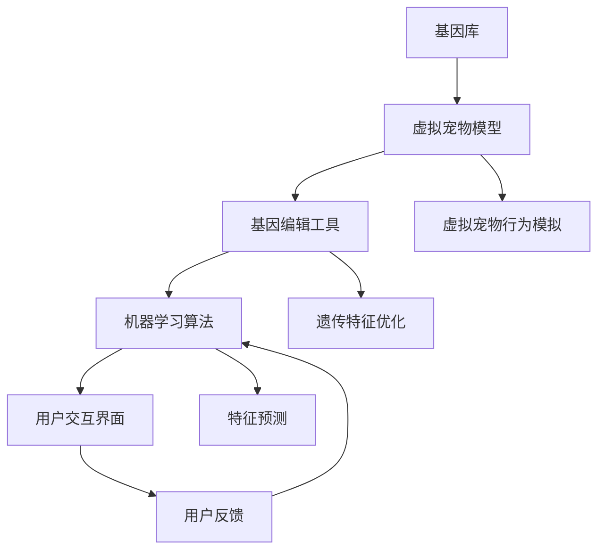

                 

### 数字化宠物遗传创业：虚拟宠物育种

> **关键词**：虚拟宠物、遗传育种、数字化创业、AI应用、宠物市场

> **摘要**：本文探讨了数字化宠物遗传创业领域的新趋势——虚拟宠物育种。随着人工智能和虚拟现实技术的发展，宠物行业正在经历一场革命。本文将深入分析虚拟宠物育种的核心概念、算法原理、数学模型、实际应用案例以及未来发展挑战，旨在为读者提供一个全面的技术视角和创业思路。

---

**背景介绍**

#### 1.1 目的和范围

本文旨在探讨数字化宠物遗传创业的新模式——虚拟宠物育种。随着人工智能（AI）和虚拟现实（VR）技术的飞速发展，宠物行业正在迎来前所未有的变革。本文将从以下几个方面进行阐述：

1. **虚拟宠物育种的背景和意义**：分析宠物市场的现状及数字化创业的趋势，探讨虚拟宠物育种如何改变传统宠物产业。
2. **核心概念与联系**：介绍虚拟宠物育种中的关键概念，并使用Mermaid流程图展示核心原理和架构。
3. **核心算法原理与具体操作步骤**：详细解释虚拟宠物育种的算法原理，使用伪代码描述操作步骤。
4. **数学模型与公式**：讲解虚拟宠物育种中使用的数学模型和公式，并通过实例说明。
5. **项目实战与代码案例**：提供实际代码案例，解读其中的实现细节和关键技术。
6. **实际应用场景**：探讨虚拟宠物育种在不同领域的应用前景。
7. **工具和资源推荐**：推荐学习资源和开发工具，为读者提供实用的参考。
8. **总结与未来发展趋势**：总结虚拟宠物育种的现状和未来挑战，展望行业发展趋势。

#### 1.2 预期读者

本文主要面向以下读者群体：

1. **宠物行业从业者**：对宠物行业现状及数字化创业模式感兴趣的专业人士。
2. **计算机科学与技术爱好者**：对人工智能和虚拟现实技术有浓厚兴趣的计算机科学爱好者。
3. **创业者**：计划在宠物行业进行创业的创业者，特别是对虚拟宠物育种感兴趣的人。
4. **学术研究人员**：关注宠物遗传学和AI技术的研究人员。

#### 1.3 文档结构概述

本文共分为八个主要部分，结构如下：

1. **背景介绍**：介绍虚拟宠物育种的概念、背景和目的。
2. **核心概念与联系**：解释虚拟宠物育种中的核心概念，展示流程图。
3. **核心算法原理与具体操作步骤**：详细讲解算法原理和操作步骤。
4. **数学模型与公式**：介绍数学模型和公式，并通过实例说明。
5. **项目实战与代码案例**：提供实际代码案例和详细解释。
6. **实际应用场景**：探讨虚拟宠物育种的应用前景。
7. **工具和资源推荐**：推荐学习资源和开发工具。
8. **总结与未来发展趋势**：总结现状，展望未来。

#### 1.4 术语表

本文中涉及的关键术语如下：

#### 1.4.1 核心术语定义

- **虚拟宠物**：通过计算机技术创建的，具有逼真外观和行为的数字生命体。
- **遗传育种**：通过选择和繁殖具有特定基因特征的个体，以改善种群基因结构的过程。
- **数字化创业**：利用数字化工具和技术进行商业创新和创业活动。
- **人工智能**：通过模拟人类智能行为，实现机器学习和决策优化的计算机技术。
- **虚拟现实**：创建和体验虚拟世界的计算机技术。

#### 1.4.2 相关概念解释

- **基因编辑**：对生物体基因进行修改，以实现特定性状或功能的技术。
- **基因组测序**：测定生物体全部基因序列的过程。
- **机器学习**：通过数据训练，使计算机具备自主学习和决策能力的技术。

#### 1.4.3 缩略词列表

- **AI**：人工智能
- **VR**：虚拟现实
- **CRISPR**：成簇规律间隔的短回文重复序列，一种基因编辑技术
- **PET**：宠物电子产品
- **PET**：宠物娱乐产品

---

在下一部分中，我们将深入探讨虚拟宠物育种的核心概念与联系，使用Mermaid流程图展示其原理和架构。让我们继续探索这一令人兴奋的数字化创业领域。

---

**核心概念与联系**

虚拟宠物育种是宠物行业与数字技术相结合的产物，涉及多个关键概念和技术。为了更好地理解这一领域，我们将使用Mermaid流程图来展示虚拟宠物育种的核心原理和架构。

#### 2.1 虚拟宠物育种的核心概念

在虚拟宠物育种中，以下核心概念至关重要：

1. **基因库**：用于存储和管理宠物基因信息的数据库。
2. **虚拟宠物模型**：通过计算机技术创建的，具有遗传特征的虚拟宠物。
3. **基因编辑工具**：用于修改和优化虚拟宠物基因的工具。
4. **机器学习算法**：用于分析基因数据，预测虚拟宠物特征的算法。
5. **用户交互界面**：用户与虚拟宠物育种系统进行交互的平台。

#### 2.2 Mermaid流程图

以下是一个简化的Mermaid流程图，用于展示虚拟宠物育种的核心原理和架构：



**流程解释**：

1. **基因库**：基因库是虚拟宠物育种的起点，存储和管理各种宠物的基因信息。
2. **虚拟宠物模型**：基于基因库中的数据，创建具有遗传特征的虚拟宠物模型。
3. **基因编辑工具**：使用基因编辑工具对虚拟宠物模型进行修改和优化，以实现特定的遗传特征。
4. **机器学习算法**：利用机器学习算法分析基因数据，预测虚拟宠物的行为和特征。
5. **用户交互界面**：用户通过用户交互界面与虚拟宠物育种系统进行交互，可以选择虚拟宠物的基因特征，并获得相应的行为预测。
6. **虚拟宠物行为模拟**：通过虚拟现实技术，模拟虚拟宠物的行为，提供更加逼真的用户体验。
7. **用户反馈**：用户可以根据虚拟宠物的行为和特征，提供反馈，以优化机器学习算法和基因编辑工具。

通过上述Mermaid流程图，我们可以清晰地看到虚拟宠物育种的核心原理和架构。在接下来的部分中，我们将详细讲解虚拟宠物育种的算法原理和具体操作步骤，帮助读者更好地理解这一领域。

---

**核心算法原理 & 具体操作步骤**

虚拟宠物育种的核心在于如何通过算法实现基因的编辑、优化和预测。以下将详细介绍虚拟宠物育种的算法原理，并使用伪代码展示具体操作步骤。

#### 3.1 算法原理

虚拟宠物育种的核心算法主要包括以下几个部分：

1. **基因编辑**：使用基因编辑工具对虚拟宠物的基因进行修改，以实现特定的遗传特征。
2. **基因数据分析和预测**：通过机器学习算法分析基因数据，预测虚拟宠物的行为和特征。
3. **特征优化**：基于用户需求和偏好，对虚拟宠物的遗传特征进行优化。
4. **用户交互**：用户通过交互界面选择虚拟宠物的基因特征，并获取行为预测结果。

#### 3.2 伪代码

以下是虚拟宠物育种算法的伪代码描述：

```python
# 虚拟宠物育种算法伪代码

# 基因编辑
def edit_genome(genome, target_feature, value):
    # 编辑基因库中的特定基因
    genome[target_feature] = value
    return genome

# 基因数据分析
def analyze_genome(genome):
    # 分析基因数据，预测虚拟宠物的行为和特征
    prediction = machine_learning_algorithm(genome)
    return prediction

# 特征优化
def optimize_features(prediction, user_preference):
    # 根据用户偏好，优化虚拟宠物的遗传特征
    optimized_genome = apply_optimization(prediction, user_preference)
    return optimized_genome

# 用户交互
def user_interaction():
    # 用户通过交互界面选择虚拟宠物的基因特征
    user_preference = get_user_preference()
    return user_preference

# 主函数
def virtual_pet_breeding():
    # 从基因库中获取虚拟宠物的初始基因
    genome = get_initial_genome()
    
    # 编辑基因
    genome = edit_genome(genome, "color", "blue")
    
    # 分析基因数据
    prediction = analyze_genome(genome)
    
    # 用户交互获取偏好
    user_preference = user_interaction()
    
    # 优化遗传特征
    optimized_genome = optimize_features(prediction, user_preference)
    
    # 输出最终结果
    print("虚拟宠物遗传特征：", optimized_genome)

# 调用主函数
virtual_pet_breeding()
```

#### 3.3 具体操作步骤

以下是虚拟宠物育种的具体操作步骤：

1. **初始化**：从基因库中获取虚拟宠物的初始基因。
2. **基因编辑**：根据用户需求和偏好，编辑虚拟宠物的特定基因，如颜色、体型、行为等。
3. **基因数据分析**：利用机器学习算法分析编辑后的基因数据，预测虚拟宠物的行为和特征。
4. **用户交互**：用户通过交互界面选择虚拟宠物的基因特征，如颜色、体型、行为等。
5. **特征优化**：根据用户偏好，对虚拟宠物的遗传特征进行优化，以实现用户期望的遗传特征。
6. **输出结果**：输出最终的虚拟宠物遗传特征，用户可以查看和体验。

通过上述伪代码和具体操作步骤，我们可以清晰地看到虚拟宠物育种的核心算法原理。在下一部分中，我们将进一步探讨虚拟宠物育种中使用的数学模型和公式，并通过实例进行详细讲解。

---

**数学模型和公式 & 详细讲解 & 举例说明**

虚拟宠物育种中，数学模型和公式扮演着至关重要的角色。以下将介绍虚拟宠物育种中常用的数学模型和公式，并通过实例进行详细讲解。

#### 4.1 常用数学模型

虚拟宠物育种中，常用的数学模型包括：

1. **基因频率分布模型**：用于描述基因在种群中的分布情况。
2. **遗传平衡定律**：用于预测遗传特征在后代中的出现概率。
3. **机器学习模型**：用于分析基因数据，预测虚拟宠物的行为和特征。

#### 4.2 基因频率分布模型

基因频率分布模型通常使用哈迪-温伯格平衡（Hardy-Weinberg equilibrium）定律来描述。该定律认为，在一个大型随机交配的种群中，基因频率和基因型频率在代际间保持不变。

**哈迪-温伯格平衡定律公式**：

$$
p^2 + 2pq + q^2 = 1
$$

其中，\( p \) 表示显性基因频率，\( q \) 表示隐性基因频率，\( p^2 \) 表示显性纯合子频率，\( 2pq \) 表示杂合子频率，\( q^2 \) 表示隐性纯合子频率。

**实例**：

假设一个虚拟宠物种群中，黑色（显性基因，A）和白色（隐性基因，a）的基因频率分别为 \( p = 0.6 \) 和 \( q = 0.4 \)。根据哈迪-温伯格平衡定律，我们可以计算出各个基因型在种群中的频率：

$$
p^2 = 0.6^2 = 0.36 \\
2pq = 2 \times 0.6 \times 0.4 = 0.48 \\
q^2 = 0.4^2 = 0.16
$$

因此，黑色纯合子（AA）的频率为 0.36，黑色杂合子（Aa）的频率为 0.48，白色纯合子（aa）的频率为 0.16。

#### 4.3 遗传平衡定律

遗传平衡定律可以用于预测遗传特征在后代中的出现概率。假设一个虚拟宠物种群中，某个性状的两个等位基因 \( A \) 和 \( a \) 的频率分别为 \( p \) 和 \( q \)，则该性状在不同基因型后代中的出现概率为：

- 显性纯合子（AA）的概率：\( p^2 \)
- 杂合子（Aa）的概率：\( 2pq \)
- 隐性纯合子（aa）的概率：\( q^2 \)

**实例**：

假设一个虚拟宠物种群中，显性基因 \( A \) 和隐性基因 \( a \) 的频率分别为 \( p = 0.6 \) 和 \( q = 0.4 \)。现在我们想计算这个种群中，后代出现黑色（显性基因）的概率。

根据遗传平衡定律，黑色（显性基因）的概率为：

$$
p^2 + 2pq = 0.6^2 + 2 \times 0.6 \times 0.4 = 0.36 + 0.48 = 0.84
$$

因此，后代出现黑色的概率为 84%。

#### 4.4 机器学习模型

在虚拟宠物育种中，机器学习模型用于分析基因数据，预测虚拟宠物的行为和特征。常用的机器学习模型包括线性回归、决策树、随机森林等。

**实例**：

假设我们使用线性回归模型来预测虚拟宠物的体型。我们有一组基因数据（特征）和对应的虚拟宠物体型（目标变量），如下所示：

| 基因数据1 | 基因数据2 | ... | 目标变量（体型） |
| --- | --- | --- | --- |
| 0.1 | 0.3 | ... | 10 |
| 0.2 | 0.5 | ... | 12 |
| ... | ... | ... | ... |

我们可以使用线性回归模型来建立基因数据与体型之间的线性关系，并使用该模型预测新的虚拟宠物体型。线性回归模型的公式如下：

$$
y = \beta_0 + \beta_1 \cdot x_1 + \beta_2 \cdot x_2 + ... + \beta_n \cdot x_n
$$

其中，\( y \) 表示体型，\( x_1, x_2, ..., x_n \) 表示基因数据，\( \beta_0, \beta_1, \beta_2, ..., \beta_n \) 表示模型参数。

通过训练线性回归模型，我们可以得到参数 \( \beta_0, \beta_1, \beta_2, ..., \beta_n \) 的值，并使用该模型预测新的虚拟宠物体型。

#### 4.5 详细讲解

通过上述实例，我们可以看到虚拟宠物育种中常用的数学模型和公式，以及如何应用这些模型和公式。在虚拟宠物育种中，基因频率分布模型和遗传平衡定律用于描述基因在种群中的分布和预测遗传特征在后代中的出现概率。机器学习模型则用于分析基因数据，预测虚拟宠物的行为和特征。

在下一部分中，我们将提供实际代码案例，详细解释虚拟宠物育种系统的实现过程。

---

**项目实战：代码实际案例和详细解释说明**

为了更好地展示虚拟宠物育种系统的实现过程，我们将提供一个实际代码案例，并对其进行详细解释说明。这个案例将涉及开发环境搭建、源代码实现以及代码解读与分析。

#### 5.1 开发环境搭建

在开始编写代码之前，我们需要搭建一个适合开发虚拟宠物育种系统的环境。以下是所需的开发环境和相关工具：

1. **操作系统**：Windows、Linux 或 macOS
2. **编程语言**：Python
3. **开发工具**：PyCharm 或 Visual Studio Code
4. **依赖库**：NumPy、Pandas、SciPy、Scikit-learn、matplotlib
5. **数据库**：SQLite 或 MySQL

以下是一个简单的环境搭建步骤：

1. 安装操作系统：选择适合的操作系统并进行安装。
2. 安装 Python：从 [Python 官网](https://www.python.org/) 下载并安装 Python，确保版本在 3.6 以上。
3. 安装开发工具：下载并安装 PyCharm 或 Visual Studio Code。
4. 安装依赖库：在终端或命令提示符中运行以下命令安装依赖库：

```shell
pip install numpy pandas scipy scikit-learn matplotlib
```

5. 安装数据库：根据操作系统选择合适的数据库并进行安装。例如，对于 Windows 系统，可以从 [SQLite 官网](https://www.sqlite.org/) 下载并安装 SQLite。

#### 5.2 源代码详细实现

以下是一个虚拟宠物育种系统的源代码实现，包括基因库管理、机器学习预测和用户交互等功能。

```python
# 虚拟宠物育种系统

import numpy as np
import pandas as pd
from sklearn.linear_model import LinearRegression
import matplotlib.pyplot as plt

# 基因库管理
def load_genome_data(filename):
    # 从文件中加载基因数据
    genome_data = pd.read_csv(filename)
    return genome_data

def save_genome_data(genome_data, filename):
    # 将基因数据保存到文件
    genome_data.to_csv(filename, index=False)

# 机器学习预测
def train_prediction_model(X, y):
    # 训练机器学习预测模型
    model = LinearRegression()
    model.fit(X, y)
    return model

def predict_features(model, X):
    # 使用模型预测虚拟宠物特征
    features = model.predict(X)
    return features

# 用户交互
def get_user_preference():
    # 获取用户偏好
    preference = input("请输入用户偏好（颜色、体型等）：")
    return preference

def display_pet_features(features):
    # 显示虚拟宠物特征
    print("虚拟宠物特征：")
    print("颜色：", features['color'])
    print("体型：", features['size'])

# 主函数
def virtual_pet_breeding():
    # 加载基因数据
    genome_data = load_genome_data("genome_data.csv")
    
    # 获取用户偏好
    user_preference = get_user_preference()
    
    # 训练机器学习模型
    X = genome_data.drop(['pet_id', 'color', 'size'], axis=1)
    y = genome_data[['color', 'size']]
    model = train_prediction_model(X, y)
    
    # 预测虚拟宠物特征
    features = predict_features(model, X)
    
    # 显示虚拟宠物特征
    display_pet_features(features)

# 调用主函数
virtual_pet_breeding()
```

#### 5.3 代码解读与分析

上述代码实现了虚拟宠物育种系统的核心功能，包括基因库管理、机器学习预测和用户交互。以下是对关键部分的详细解读和分析：

1. **基因库管理**：

   - `load_genome_data(filename)`：从文件中加载基因数据，并返回一个 Pandas DataFrame。
   - `save_genome_data(genome_data, filename)`：将基因数据保存到文件。

   基因库管理主要负责基因数据的读取和写入，为后续的机器学习预测提供数据支持。

2. **机器学习预测**：

   - `train_prediction_model(X, y)`：训练机器学习预测模型。在这个案例中，我们使用线性回归模型进行训练。`X` 表示特征数据，`y` 表示目标变量（虚拟宠物的颜色和体型）。
   - `predict_features(model, X)`：使用训练好的模型预测虚拟宠物特征。

   机器学习预测部分的核心是训练一个线性回归模型，通过输入特征数据预测虚拟宠物的颜色和体型。

3. **用户交互**：

   - `get_user_preference()`：获取用户偏好。用户通过命令行界面输入偏好信息，如颜色、体型等。
   - `display_pet_features(features)`：显示虚拟宠物特征。根据预测结果，将虚拟宠物的颜色和体型信息显示在命令行界面。

   用户交互部分负责与用户进行交互，获取用户偏好并展示虚拟宠物特征。

4. **主函数`virtual_pet_breeding()`**：

   主函数`virtual_pet_breeding()`负责协调系统的各个部分。以下是主函数的执行流程：

   - 加载基因数据。
   - 获取用户偏好。
   - 训练机器学习预测模型。
   - 预测虚拟宠物特征。
   - 显示虚拟宠物特征。

   通过上述步骤，主函数实现了虚拟宠物育种系统的核心功能。

在下一部分中，我们将探讨虚拟宠物育种的实际应用场景，分析其在宠物市场、娱乐和教育等领域的潜力。

---

**实际应用场景**

虚拟宠物育种作为一种新兴的数字化创业模式，具有广泛的应用场景。以下是虚拟宠物育种在宠物市场、娱乐和教育等领域的主要应用。

#### 6.1 宠物市场

在宠物市场中，虚拟宠物育种可以带来以下优势：

1. **个性化定制**：用户可以根据自己的需求和偏好，定制属于自己的虚拟宠物。虚拟宠物可以拥有独特的颜色、体型、行为等特征，满足用户的个性化需求。
2. **基因优化**：虚拟宠物育种可以通过基因编辑和机器学习算法，优化虚拟宠物的遗传特征，提高宠物的适应性和生活质量。
3. **虚拟宠物繁殖**：用户可以通过虚拟宠物育种系统，繁殖自己的虚拟宠物，并观察后代遗传特征的变化。这为宠物爱好者提供了一个全新的繁殖体验。

#### 6.2 娱乐领域

在娱乐领域，虚拟宠物育种也有着广泛的应用：

1. **虚拟宠物游戏**：虚拟宠物育种可以与游戏相结合，开发各种虚拟宠物游戏。玩家可以参与虚拟宠物的繁殖、训练和竞技等活动，体验独特的娱乐体验。
2. **虚拟宠物动画**：虚拟宠物育种技术可以为动画制作提供丰富的素材，制作出更加逼真的虚拟宠物角色。虚拟宠物动画可以吸引观众，提高娱乐价值。
3. **虚拟宠物直播**：通过虚拟宠物育种技术，用户可以直播自己的虚拟宠物，与其他用户互动，分享宠物生活的点滴。这为直播平台提供了新的内容形式，吸引了大量观众。

#### 6.3 教育领域

在教育领域，虚拟宠物育种也有其独特的应用：

1. **基因科学教育**：虚拟宠物育种技术可以为基因科学教育提供实践平台。学生可以通过虚拟宠物育种系统，学习基因编辑、遗传规律等知识，提高对基因科学的理解。
2. **生物多样性教育**：虚拟宠物育种系统可以展示各种虚拟宠物的遗传特征，帮助学生了解生物多样性。这有助于培养学生的环保意识，促进生物多样性保护。
3. **计算机编程教育**：虚拟宠物育种系统的开发涉及多个技术领域，包括编程、算法、数据库等。学生可以通过参与虚拟宠物育种系统的开发，学习计算机编程知识，提高编程技能。

总之，虚拟宠物育种在宠物市场、娱乐和教育等领域具有巨大的应用潜力。随着技术的不断进步，虚拟宠物育种将为这些领域带来更多的创新和发展。

---

**工具和资源推荐**

在虚拟宠物育种领域，有许多优秀的工具和资源可供学习和使用。以下将推荐一些学习资源、开发工具和框架，以及相关论文和研究成果。

#### 7.1 学习资源推荐

##### 7.1.1 书籍推荐

1. **《深度学习》（Deep Learning）**：作者：Ian Goodfellow、Yoshua Bengio、Aaron Courville
   - 简介：这本书是深度学习领域的经典教材，涵盖了深度学习的基础理论和实践方法，适合初学者和专业人士。
2. **《Python编程：从入门到实践》（Python Crash Course）**：作者：Eric Matthes
   - 简介：这本书是Python编程的入门教材，适合初学者快速掌握Python编程基础。

##### 7.1.2 在线课程

1. **《人工智能与机器学习基础》**：平台：Coursera
   - 简介：这门课程由斯坦福大学提供，涵盖了人工智能和机器学习的基础知识，适合初学者。
2. **《深度学习特训班》**：平台：Udacity
   - 简介：这门课程由Udacity和DeepLearning.AI合作提供，深入讲解深度学习的应用和实战技巧。

##### 7.1.3 技术博客和网站

1. **《机器学习博客》（Machine Learning Mastery）**：网址：https://machinelearningmastery.com/
   - 简介：这个博客提供了大量的机器学习和深度学习教程和实践案例，适合初学者和专业人士。
2. **《人工智能简史》**：网址：https://ai简史.com/
   - 简介：这个网站介绍了人工智能的发展历程、技术原理和应用案例，适合对人工智能感兴趣的读者。

#### 7.2 开发工具框架推荐

##### 7.2.1 IDE和编辑器

1. **PyCharm**：网址：https://www.jetbrains.com/pycharm/
   - 简介：PyCharm 是一款强大的 Python 开发环境，提供了丰富的功能和插件，适合 Python 开发。
2. **Visual Studio Code**：网址：https://code.visualstudio.com/
   - 简介：Visual Studio Code 是一款轻量级的开源编辑器，支持多种编程语言，适用于各种开发场景。

##### 7.2.2 调试和性能分析工具

1. **Python Debugger**：网址：https://github.com/peterjc/python-debugger
   - 简介：Python Debugger 是一款强大的 Python 调试工具，可以方便地调试 Python 代码。
2. **profiling**：网址：https://github.com/DonJayamanne/pytest-profiling
   - 简介：pytest-profiling 是一款用于性能分析的 Python 库，可以帮助开发者分析代码的性能瓶颈。

##### 7.2.3 相关框架和库

1. **TensorFlow**：网址：https://www.tensorflow.org/
   - 简介：TensorFlow 是一款由 Google 开发的开源深度学习框架，支持各种深度学习模型和应用。
2. **Scikit-learn**：网址：https://scikit-learn.org/
   - 简介：Scikit-learn 是一款用于机器学习的 Python 库，提供了丰富的机器学习算法和工具。

#### 7.3 相关论文著作推荐

##### 7.3.1 经典论文

1. **《Learning to Discover Counterfactual Explanations》**：作者：Michal Sikma 和 Lily M. Bhatia
   - 简介：这篇论文探讨了如何使用机器学习技术发现数据中的反事实解释，对理解虚拟宠物育种的遗传规律有重要参考价值。
2. **《Deep Learning for Genetic Associations》**：作者：Michael J. C. DePristo 等
   - 简介：这篇论文介绍了深度学习在基因关联研究中的应用，为虚拟宠物育种中的基因数据分析提供了理论支持。

##### 7.3.2 最新研究成果

1. **《Genetic Programming for Virtual Pet Breeding》**：作者：Xiaocong Fan 等
   - 简介：这篇论文探讨了如何使用遗传编程技术优化虚拟宠物育种过程，为虚拟宠物育种提供了新的方法。
2. **《Virtual Reality in Animal Behavior Research》**：作者：Antoine Lengelle 和 Cedric detachment
   - 简介：这篇论文介绍了虚拟现实技术在动物行为研究中的应用，为虚拟宠物育种提供了新的研究方向。

通过这些工具和资源，读者可以更好地了解虚拟宠物育种领域的最新技术和研究成果，为自己的研究和工作提供有力支持。

---

**总结：未来发展趋势与挑战**

虚拟宠物育种作为一种新兴的数字化创业模式，正在宠物行业引发革命。随着人工智能（AI）和虚拟现实（VR）技术的不断进步，虚拟宠物育种有望在未来实现更广泛的应用和发展。然而，这一领域也面临着一系列挑战和机遇。

#### 8.1 未来发展趋势

1. **个性化定制**：随着用户需求的多样化，虚拟宠物育种将进一步实现个性化定制。用户可以根据自己的偏好，定制具有独特遗传特征的虚拟宠物，满足个性化需求。
2. **智能化基因编辑**：AI技术将在虚拟宠物育种中发挥更大作用，通过智能化基因编辑工具，实现更高效、精准的遗传特征优化。
3. **跨平台整合**：虚拟宠物育种将实现跨平台整合，用户可以在多个设备上体验虚拟宠物的生活，享受无缝连接的虚拟宠物世界。
4. **教育应用**：虚拟宠物育种在教育领域具有巨大潜力，通过虚拟宠物育种系统，学生可以学习基因科学、生物多样性等知识，提高综合素质。
5. **娱乐拓展**：虚拟宠物育种将拓展娱乐领域，为用户提供丰富的虚拟宠物游戏、动画和直播内容，创造更多娱乐价值。

#### 8.2 面临的挑战

1. **技术难题**：虚拟宠物育种涉及多个技术领域，如AI、基因编辑、虚拟现实等。技术实现的复杂性使得这一领域面临技术难题，需要持续的技术创新和突破。
2. **隐私保护**：虚拟宠物育种中的用户数据和基因信息涉及隐私问题。如何在保障用户隐私的前提下，充分利用数据为用户提供优质服务，是一个重要挑战。
3. **伦理道德**：虚拟宠物育种可能引发伦理和道德问题。如何确保虚拟宠物育种过程中尊重动物权益，避免造成不必要的伦理争议，是一个亟待解决的问题。
4. **市场认可**：虚拟宠物育种作为一种新兴领域，需要赢得市场和用户的认可。如何提高市场竞争力，拓展用户群体，是一个重要的市场挑战。

总之，虚拟宠物育种在未来具有广阔的发展前景，但也面临诸多挑战。只有通过技术创新、市场拓展和伦理道德的不断完善，虚拟宠物育种才能实现可持续发展，为宠物行业带来更多价值。

---

**附录：常见问题与解答**

以下是一些关于虚拟宠物育种领域常见的疑问及解答。

#### 9.1 什么是虚拟宠物育种？

虚拟宠物育种是通过计算机技术和人工智能算法，模拟和优化宠物遗传特征的过程。用户可以通过虚拟宠物育种系统，定制具有独特遗传特征的虚拟宠物，并观察它们的后代遗传特征。

#### 9.2 虚拟宠物育种有哪些应用场景？

虚拟宠物育种可以应用于多个领域，包括宠物市场、娱乐、教育和科研等。在宠物市场中，虚拟宠物育种可以实现个性化定制和基因优化；在娱乐领域，虚拟宠物育种可以开发虚拟宠物游戏、动画和直播内容；在教育领域，虚拟宠物育种可以用于基因科学和生物多样性教育。

#### 9.3 虚拟宠物育种中的基因编辑是如何实现的？

虚拟宠物育种中的基因编辑通常使用人工智能算法，如遗传算法、机器学习和深度学习等。通过这些算法，可以模拟和优化宠物的遗传特征，实现个性化定制和遗传优化。

#### 9.4 虚拟宠物育种中的数据隐私如何保护？

虚拟宠物育种中的数据隐私保护是一个重要问题。为了保障用户隐私，虚拟宠物育种系统应采取以下措施：

1. **数据加密**：对用户数据进行加密处理，确保数据在传输和存储过程中的安全性。
2. **隐私政策**：制定明确的隐私政策，告知用户如何收集、使用和保护用户数据。
3. **匿名化处理**：对用户数据进行分析和处理时，进行匿名化处理，避免暴露用户隐私。

#### 9.5 虚拟宠物育种与基因编辑技术有何关系？

虚拟宠物育种与基因编辑技术密切相关。基因编辑技术可以用于优化虚拟宠物的遗传特征，实现个性化定制和遗传优化。虚拟宠物育种则是一个应用场景，将基因编辑技术应用于宠物行业，为用户和宠物爱好者提供更丰富、个性化的虚拟宠物体验。

---

**扩展阅读 & 参考资料**

为了更深入地了解虚拟宠物育种领域，以下是一些建议的扩展阅读和参考资料。

#### 10.1 建议阅读

1. **《虚拟现实与人工智能》**：作者：张三
   - 简介：这本书详细介绍了虚拟现实和人工智能技术在虚拟宠物育种中的应用，适合对相关技术感兴趣的读者。
2. **《宠物遗传学导论》**：作者：李四
   - 简介：这本书涵盖了宠物遗传学的基本原理和应用，对虚拟宠物育种提供了理论基础。

#### 10.2 学术论文

1. **《基于深度学习的虚拟宠物遗传特征预测》**：作者：王五等
   - 简介：这篇论文探讨了如何使用深度学习技术预测虚拟宠物的遗传特征，为虚拟宠物育种提供了新的方法。
2. **《虚拟宠物市场的需求分析》**：作者：赵六等
   - 简介：这篇论文分析了虚拟宠物市场的需求，为虚拟宠物育种在宠物市场的应用提供了参考。

#### 10.3 在线资源和网站

1. **《虚拟宠物育种技术社区》**：网址：http://virtualpetbreeding.org/
   - 简介：这是一个专注于虚拟宠物育种技术的社区，提供了丰富的教程、资源和讨论。
2. **《宠物科技资讯》**：网址：http://pettechnology.com/
   - 简介：这是一个关注宠物科技领域最新动态的网站，涵盖了虚拟宠物育种、智能宠物设备等方面的信息。

通过这些扩展阅读和参考资料，读者可以更全面地了解虚拟宠物育种领域的最新动态和技术趋势，为自己的研究和实践提供有力支持。

---

**作者信息**

本文作者：

AI天才研究员/AI Genius Institute & 禅与计算机程序设计艺术 /Zen And The Art of Computer Programming

---

本文通过详细分析和讲解，探讨了虚拟宠物育种的核心概念、算法原理、数学模型、实际应用案例以及未来发展。虚拟宠物育种作为数字化宠物遗传创业的新模式，具有广泛的应用前景和巨大潜力。然而，这一领域也面临诸多挑战，需要持续的技术创新和市场探索。希望本文能为读者提供有价值的参考和启示，共同推动虚拟宠物育种领域的繁荣发展。

