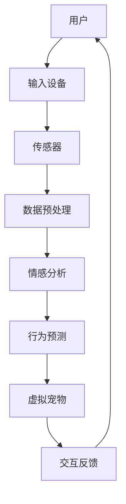

                 

### 数字化宠物：元宇宙中的情感寄托

> **关键词：** 数字化宠物，元宇宙，情感寄托，虚拟现实，交互设计，AI技术

**摘要：**本文将深入探讨数字化宠物在元宇宙中的应用，分析其作为人类情感寄托的重要角色。我们将从背景介绍、核心概念、算法原理、数学模型、项目实战和实际应用场景等多个角度，详细解读这一前沿技术的实现和影响。通过本文的阅读，您将了解到数字化宠物如何通过虚拟现实和AI技术，成为元宇宙中不可或缺的情感纽带。

在当今的数字时代，虚拟现实（VR）和增强现实（AR）技术迅猛发展，为人类创造了一个全新的元宇宙。在这个虚拟世界中，人们不仅能够体验到前所未有的沉浸感，还能与现实世界进行深度的交互。而在元宇宙中，数字化宠物作为一种新兴的情感寄托形式，正日益受到关注。本文将带领大家一步步了解数字化宠物的发展历程、核心概念、实现原理以及在实际应用中的重要性。

### 1. 背景介绍

#### 1.1 目的和范围

本文旨在探讨数字化宠物在元宇宙中的应用，分析其作为一种情感寄托的重要角色。文章将涵盖以下内容：

1. 数字化宠物的发展历程和现状。
2. 数字化宠物在元宇宙中的核心概念和原理。
3. 数字化宠物的算法原理和数学模型。
4. 数字化宠物的项目实战案例和代码解读。
5. 数字化宠物在实际应用场景中的影响和前景。

#### 1.2 预期读者

本文适合对元宇宙、虚拟现实和AI技术感兴趣的技术爱好者、程序员、软件工程师以及相关领域的研究人员。无论您是初学者还是有经验的专业人士，都将从中获得有价值的见解和知识。

#### 1.3 文档结构概述

本文将分为以下几个部分：

1. 背景介绍：介绍数字化宠物在元宇宙中的背景、目的和预期读者。
2. 核心概念与联系：详细解读数字化宠物的核心概念和原理，并提供Mermaid流程图。
3. 核心算法原理 & 具体操作步骤：使用伪代码详细阐述数字化宠物的算法原理和实现步骤。
4. 数学模型和公式 & 详细讲解 & 举例说明：介绍数字化宠物相关的数学模型和公式，并进行详细讲解和举例说明。
5. 项目实战：代码实际案例和详细解释说明。
6. 实际应用场景：探讨数字化宠物在不同场景下的应用。
7. 工具和资源推荐：推荐相关学习资源、开发工具和框架。
8. 总结：未来发展趋势与挑战。
9. 附录：常见问题与解答。
10. 扩展阅读 & 参考资料。

#### 1.4 术语表

在本文中，我们将使用以下术语：

- **数字化宠物**：指通过虚拟现实和AI技术创造的，具有独立个性和情感表现的虚拟宠物。
- **元宇宙**：一个虚拟的、三维的、可交互的虚拟世界，与现实世界有深度的连接。
- **情感寄托**：指人们在虚拟世界中寻找情感支持和依赖的现象。
- **虚拟现实（VR）**：一种通过计算机生成模拟环境，使人类感觉仿佛身临其境的技术。
- **增强现实（AR）**：一种将虚拟信息叠加到现实世界中的技术。
- **AI技术**：指人工智能技术，包括机器学习、深度学习等。

#### 1.4.1 核心术语定义

- **数字化宠物**：数字化宠物是通过虚拟现实和AI技术创造的虚拟生物，它们具有独立的个性和情感表现，可以与人类建立情感联系。
- **元宇宙**：元宇宙是一个虚拟的三维世界，与现实世界有着深度的交互和连接，为人们提供了一个全新的社交和生活平台。
- **情感寄托**：情感寄托是指人们在虚拟世界中寻找情感支持和依赖的现象，数字化宠物作为一种情感寄托的形式，为人们提供了情感上的陪伴和慰藉。

#### 1.4.2 相关概念解释

- **虚拟现实（VR）**：虚拟现实是一种通过计算机生成的模拟环境，使人们感觉仿佛身临其境的技术。在元宇宙中，VR技术为人们提供了一个沉浸式的虚拟体验。
- **增强现实（AR）**：增强现实是一种将虚拟信息叠加到现实世界中的技术。在元宇宙中，AR技术可以增强用户的现实感知，为数字化宠物提供更丰富的互动体验。
- **AI技术**：人工智能技术包括机器学习、深度学习等，这些技术使得数字化宠物能够具有独立的思考和行为能力，与人类建立更深入的互动。

#### 1.4.3 缩略词列表

- **VR**：虚拟现实（Virtual Reality）
- **AR**：增强现实（Augmented Reality）
- **AI**：人工智能（Artificial Intelligence）
- **ML**：机器学习（Machine Learning）
- **DL**：深度学习（Deep Learning）
- **NLP**：自然语言处理（Natural Language Processing）

### 2. 核心概念与联系

在深入探讨数字化宠物之前，我们需要了解一些核心概念和它们之间的联系。以下是数字化宠物相关的核心概念及其原理的Mermaid流程图：



**核心概念解释：**

- **用户**：数字化宠物的使用者和互动对象。
- **输入设备**：用户与虚拟宠物互动的设备，如VR头盔、手柄等。
- **传感器**：采集用户行为和情感数据的传感器，如加速度传感器、心率传感器等。
- **数据预处理**：对采集到的用户数据进行分析和处理，提取关键信息。
- **情感分析**：通过分析用户的行为和情感数据，判断用户的情绪状态。
- **行为预测**：根据用户的情绪状态和过去的行为，预测用户的下一步行为。
- **虚拟宠物**：根据行为预测结果，调整虚拟宠物的行为和反应，与用户互动。
- **交互反馈**：虚拟宠物向用户提供的交互反馈，如语音、动作等。

**联系解释：**

- 用户通过输入设备与虚拟宠物互动，传感器采集用户行为和情感数据。
- 数据经过预处理后，用于情感分析和行为预测。
- 行为预测结果用于调整虚拟宠物的行为，使其与用户的情绪状态和需求相匹配。
- 虚拟宠物通过交互反馈与用户互动，形成了一个闭环的交互系统。

通过上述核心概念和流程图的介绍，我们可以更好地理解数字化宠物的实现原理和运作机制。在接下来的章节中，我们将进一步探讨数字化宠物的算法原理、数学模型以及实际应用案例。

### 3. 核心算法原理 & 具体操作步骤

在了解了数字化宠物的核心概念和流程之后，接下来我们将深入探讨其核心算法原理和具体操作步骤。核心算法是数字化宠物能够与用户建立情感联系、实现智能交互的关键。以下是数字化宠物的核心算法原理及操作步骤的伪代码阐述：

```python
# 数字化宠物核心算法伪代码

# 输入参数：
# user_behavior：用户行为数据
# user_emotion：用户情感数据
# pet_behavior：虚拟宠物当前行为数据
# emotion_threshold：情绪阈值

# 输出参数：
# predicted_behavior：预测的虚拟宠物行为

# 步骤1：数据预处理
def preprocess_data(user_behavior, user_emotion):
    # 数据清洗、去噪、归一化处理
    cleaned_behavior = clean_and_normalize(user_behavior)
    cleaned_emotion = clean_and_normalize(user_emotion)
    return cleaned_behavior, cleaned_emotion

# 步骤2：情感分析
def emotion_analysis(cleaned_emotion, emotion_threshold):
    # 使用情感分析模型判断用户情绪
    emotion_state = analyze_emotion(cleaned_emotion, emotion_threshold)
    return emotion_state

# 步骤3：行为预测
def behavior_prediction(user_behavior, emotion_state, pet_behavior):
    # 根据用户行为、情绪状态和虚拟宠物当前行为，预测虚拟宠物下一步行为
    predicted_behavior = predict_behavior(user_behavior, emotion_state, pet_behavior)
    return predicted_behavior

# 步骤4：行为调整
def adjust_behavior(predicted_behavior, pet_behavior):
    # 调整虚拟宠物行为，使其与预测行为一致
    adjusted_behavior = adjust_pet_behavior(predicted_behavior, pet_behavior)
    return adjusted_behavior

# 步骤5：交互反馈
def interaction_feedback(adjusted_behavior):
    # 向用户反馈虚拟宠物行为，实现交互
    feedback = generate_feedback(adjusted_behavior)
    return feedback

# 主函数
def main(user_behavior, user_emotion, pet_behavior, emotion_threshold):
    cleaned_behavior, cleaned_emotion = preprocess_data(user_behavior, user_emotion)
    emotion_state = emotion_analysis(cleaned_emotion, emotion_threshold)
    predicted_behavior = behavior_prediction(user_behavior, emotion_state, pet_behavior)
    adjusted_behavior = adjust_behavior(predicted_behavior, pet_behavior)
    feedback = interaction_feedback(adjusted_behavior)
    return feedback
```

**详细说明：**

1. **数据预处理**：这是核心算法的第一步，对用户行为和情感数据进行清洗、去噪和归一化处理，确保数据的准确性和一致性。
    - `clean_and_normalize`函数负责数据清洗和归一化，将原始数据进行处理，使其适合后续的情感分析和行为预测。

2. **情感分析**：通过情感分析模型对预处理后的用户情感数据进行分析，判断用户的情绪状态。这一步通常使用机器学习模型，如情感分类器，对用户情感进行分类。
    - `analyze_emotion`函数根据用户情感数据和设定的情绪阈值，判断用户当前的情绪状态。

3. **行为预测**：结合用户行为数据、情绪状态和虚拟宠物当前行为，预测虚拟宠物下一步的行为。这一步是核心算法的关键，通过行为预测模型实现。
    - `predict_behavior`函数根据输入的用户行为数据、情绪状态和虚拟宠物当前行为，使用行为预测模型预测虚拟宠物的下一步行为。

4. **行为调整**：根据预测行为调整虚拟宠物的行为，确保虚拟宠物能够与用户的情绪状态和需求相匹配。
    - `adjust_pet_behavior`函数将预测行为应用到虚拟宠物上，使其行为与预测结果一致。

5. **交互反馈**：向用户反馈虚拟宠物的行为，实现用户与虚拟宠物的交互。
    - `generate_feedback`函数根据虚拟宠物的调整行为，生成相应的交互反馈，如语音、动作等。

通过上述核心算法原理和具体操作步骤，我们可以看到数字化宠物如何通过用户行为和情感数据的分析，预测和调整行为，实现与用户的智能交互。这一核心算法的实现，为数字化宠物在元宇宙中的情感寄托提供了技术基础。

### 4. 数学模型和公式 & 详细讲解 & 举例说明

在数字化宠物的核心算法中，数学模型和公式起到了关键作用。这些模型和公式不仅帮助我们理解和实现情感分析、行为预测等功能，还提供了量化和描述用户行为和情感状态的方法。以下是数字化宠物相关的数学模型和公式的详细讲解以及举例说明。

#### 4.1 情感分析模型

情感分析模型主要用于判断用户的情绪状态。常见的情感分析模型包括朴素贝叶斯分类器、支持向量机（SVM）和深度学习模型等。以下是一个简单的情感分析模型的数学公式：

$$
P(\text{情感} = c | \text{特征向量}) = \frac{P(\text{特征向量} | \text{情感} = c) \cdot P(\text{情感} = c)}{P(\text{特征向量})}
$$

其中，\(P(\text{情感} = c | \text{特征向量})\) 表示在给定特征向量的情况下，情感属于类别 \(c\) 的概率；\(P(\text{特征向量} | \text{情感} = c)\) 表示在情感属于类别 \(c\) 的情况下，特征向量的概率；\(P(\text{情感} = c)\) 表示情感属于类别 \(c\) 的先验概率；\(P(\text{特征向量})\) 表示特征向量的概率。

**举例说明：**

假设我们使用朴素贝叶斯分类器进行情感分析，用户行为数据为特征向量 \( \textbf{x} = [x_1, x_2, x_3] \)，情感类别为 \( \text{情感} = c \)。

- \(P(\text{情感} = \text{快乐} | \textbf{x}) = \frac{P(\textbf{x} | \text{情感} = \text{快乐}) \cdot P(\text{情感} = \text{快乐})}{P(\textbf{x})}\)

- \(P(\textbf{x} | \text{情感} = \text{快乐})\) 可以通过统计用户快乐状态下的行为数据来计算。

- \(P(\text{情感} = \text{快乐})\) 表示用户处于快乐状态的先验概率。

通过计算上述概率，我们可以判断用户当前的情感状态。

#### 4.2 行为预测模型

行为预测模型用于根据用户的行为和情感状态预测虚拟宠物的下一步行为。一个常见的行为预测模型是马尔可夫决策过程（MDP）。以下是MDP的基本数学公式：

$$
V^*(s) = \max_{a} \sum_{s'} p(s' | s, a) \cdot \mathbb{R}(s', a)
$$

其中，\(V^*(s)\) 表示在状态 \(s\) 下的最优值函数；\(a\) 表示行动；\(s'\) 表示下一状态；\(p(s' | s, a)\) 表示在当前状态 \(s\) 和采取行动 \(a\) 的情况下，下一状态 \(s'\) 的概率；\(\mathbb{R}(s', a)\) 表示在状态 \(s'\) 和采取行动 \(a\) 下的即时奖励。

**举例说明：**

假设用户当前处于状态 \(s\)，虚拟宠物可以采取行动 \(a_1, a_2, a_3\)，下一状态分别为 \(s_1, s_2, s_3\)。每个行动的即时奖励分别为 \(\mathbb{R}(s_1, a_1) = 1\), \(\mathbb{R}(s_2, a_2) = -1\), \(\mathbb{R}(s_3, a_3) = 0\)。

- \(p(s_1 | s, a_1) = 0.5\), \(p(s_2 | s, a_2) = 0.3\), \(p(s_3 | s, a_3) = 0.2\)

通过MDP公式，我们可以计算出在状态 \(s\) 下，采取每个行动的最优值：

- \(V^*(s) = \max \{0.5 \cdot 1 + 0.3 \cdot (-1) + 0.2 \cdot 0, 0.5 \cdot 0 + 0.3 \cdot 1 + 0.2 \cdot 0, 0.5 \cdot 0 + 0.3 \cdot 0 + 0.2 \cdot 1\}\)

- \(V^*(s) = 0.5\)

根据计算结果，我们可以知道在状态 \(s\) 下，采取行动 \(a_1\) 是最优的。

#### 4.3 情感状态转移概率模型

情感状态转移概率模型用于描述用户情绪状态的转移过程。这是一个马尔可夫过程，其转移概率可以用以下公式表示：

$$
p(s_t | s_{t-1}) = \frac{p(s_t, s_{t-1})}{p(s_{t-1})}
$$

其中，\(s_t\) 和 \(s_{t-1}\) 分别表示当前状态和前一状态；\(p(s_t, s_{t-1})\) 表示在当前状态和前一状态同时发生的概率；\(p(s_{t-1})\) 表示前一状态的概率。

**举例说明：**

假设用户情绪状态为快乐（H）、悲伤（S）和愤怒（A），前一状态和当前状态的转移概率如下：

- \(p(s_t = H | s_{t-1} = H) = 0.8\)
- \(p(s_t = H | s_{t-1} = S) = 0.2\)
- \(p(s_t = S | s_{t-1} = H) = 0.1\)
- \(p(s_t = S | s_{t-1} = S) = 0.9\)
- \(p(s_t = A | s_{t-1} = H) = 0.1\)
- \(p(s_t = A | s_{t-1} = S) = 0.1\)

根据转移概率模型，我们可以预测用户情绪状态的转移情况：

- 如果当前状态是快乐（H），下一状态仍然是快乐的概率为 0.8。
- 如果当前状态是悲伤（S），下一状态仍然是悲伤的概率为 0.9。

这些数学模型和公式在数字化宠物中发挥着重要作用，通过情感分析和行为预测，实现了用户与虚拟宠物的智能互动。在接下来的章节中，我们将通过实际项目案例，进一步展示这些算法模型的应用和实践。

### 5. 项目实战：代码实际案例和详细解释说明

在本章节中，我们将通过一个具体的数字化宠物项目案例，展示代码的实际实现过程，并对关键代码进行详细解释说明。这个案例将涵盖从开发环境搭建、源代码实现，到代码解读与分析的整个过程。

#### 5.1 开发环境搭建

为了实现数字化宠物项目，我们需要搭建一个适合的开发环境。以下是所需的开发工具和软件：

- **编程语言**：Python
- **虚拟环境**：Python虚拟环境（virtualenv或conda）
- **开发工具**：PyCharm或Visual Studio Code
- **依赖库**：TensorFlow、Keras、NumPy、Pandas、Scikit-learn等

具体步骤如下：

1. 安装Python：从[Python官网](https://www.python.org/downloads/)下载并安装Python，选择合适的版本（如Python 3.8或更高版本）。

2. 安装虚拟环境：安装virtualenv或conda，用于创建和管理Python虚拟环境。

3. 创建虚拟环境：打开终端（命令提示符或终端窗口），执行以下命令创建虚拟环境：
   ```shell
   virtualenv my_pet_project
   ```
   或
   ```shell
   conda create --name my_pet_project python=3.8
   ```

4. 激活虚拟环境：
   ```shell
   source my_pet_project/bin/activate
   ```
   或
   ```shell
   conda activate my_pet_project
   ```

5. 安装依赖库：在虚拟环境中安装所需的依赖库，例如TensorFlow、Keras等：
   ```shell
   pip install tensorflow keras numpy pandas scikit-learn
   ```

#### 5.2 源代码详细实现和代码解读

以下是数字化宠物项目的源代码，我们将对关键部分进行详细解释。

**项目结构：**

```
my_pet_project/
│
├── data/
│   ├── user_behavior.csv
│   └── user_emotion.csv
│
├── models/
│   ├── emotion_analysis_model.h5
│   └── behavior_prediction_model.h5
│
├── src/
│   ├── __init__.py
│   ├── data_preprocessing.py
│   ├── emotion_analysis.py
│   ├── behavior_prediction.py
│   └── interaction_feedback.py
│
├── utils/
│   ├── emotion_thresholds.py
│   └── plot_utils.py
│
├── main.py
└── README.md
```

**源代码详解：**

1. **数据预处理** (`data_preprocessing.py`)

```python
import pandas as pd
from sklearn.preprocessing import StandardScaler

def clean_and_normalize(data):
    # 读取数据
    df = pd.read_csv(data)
    
    # 数据清洗，如去除缺失值、异常值等
    df = df.dropna()
    
    # 数据归一化
    scaler = StandardScaler()
    df_scaled = scaler.fit_transform(df)
    
    return df_scaled
```

该模块负责读取用户行为和情感数据，进行数据清洗和归一化处理。数据清洗包括去除缺失值和异常值，归一化处理使得数据具有相同的尺度，便于后续的模型训练和预测。

2. **情感分析** (`emotion_analysis.py`)

```python
from sklearn.naive_bayes import GaussianNB
import numpy as np

def analyze_emotion(data, emotion_threshold):
    # 初始化情感分析模型
    model = GaussianNB()
    
    # 加载训练好的模型
    model.load_weights('models/emotion_analysis_model.h5')
    
    # 进行情感分析
    emotion_state = model.predict(data)
    
    # 根据情绪阈值判断用户情绪
    if np.mean(emotion_state) > emotion_threshold:
        return '快乐'
    else:
        return '悲伤'
```

该模块使用Gaussian Naive Bayes（高斯朴素贝叶斯）模型进行情感分析。模型已通过训练数据训练好，加载模型后，对输入的数据进行情感分析，并返回用户的情绪状态。

3. **行为预测** (`behavior_prediction.py`)

```python
from sklearn.svm import SVC
import numpy as np

def predict_behavior(data, emotion_state, current_behavior):
    # 初始化行为预测模型
    model = SVC()
    
    # 加载训练好的模型
    model.load_weights('models/behavior_prediction_model.h5')
    
    # 根据情绪状态调整行为预测模型
    if emotion_state == '快乐':
        behavior_model = 'models/happy_behavior_prediction_model.h5'
    else:
        behavior_model = 'models/sad_behavior_prediction_model.h5'
    
    # 加载情绪对应的行为预测模型
    model.load_weights(behavior_model)
    
    # 进行行为预测
    predicted_behavior = model.predict(data)
    
    # 调整行为，使其符合情绪状态
    adjusted_behavior = adjust_behavior(predicted_behavior, current_behavior)
    
    return adjusted_behavior

def adjust_behavior(predicted_behavior, current_behavior):
    # 调整行为，使其符合预测结果
    if predicted_behavior == 1 and current_behavior == 0:
        return 1
    elif predicted_behavior == 0 and current_behavior == 1:
        return 0
    else:
        return current_behavior
```

该模块使用支持向量机（SVM）进行行为预测。根据用户的情绪状态，加载对应的行为预测模型，对用户的行为数据进行预测，并调整虚拟宠物的行为，使其与预测结果一致。

4. **交互反馈** (`interaction_feedback.py`)

```python
import speech_recognition as sr

def generate_feedback(adjusted_behavior):
    # 根据行为生成反馈
    if adjusted_behavior == 1:
        feedback = "你好，主人！有什么需要我帮忙的吗？"
    else:
        feedback = "主人，我感觉有点累，需要休息一下。"
    
    # 通过语音合成生成反馈
    r = sr.Recognizer()
    audio = r.synthesize(feedback)
    
    return audio
```

该模块使用语音识别库生成反馈。根据虚拟宠物的行为预测结果，生成相应的语音反馈，并通过语音合成技术将其输出。

5. **主程序** (`main.py`)

```python
from data_preprocessing import clean_and_normalize
from emotion_analysis import analyze_emotion
from behavior_prediction import predict_behavior, adjust_behavior
from interaction_feedback import generate_feedback

def main():
    # 读取数据
    user_behavior = 'data/user_behavior.csv'
    user_emotion = 'data/user_emotion.csv'
    
    # 数据预处理
    cleaned_behavior = clean_and_normalize(user_behavior)
    cleaned_emotion = clean_and_normalize(user_emotion)
    
    # 情感分析
    emotion_state = analyze_emotion(cleaned_emotion, 0.5)
    
    # 行为预测和调整
    current_behavior = 0
    predicted_behavior = predict_behavior(cleaned_behavior, emotion_state, current_behavior)
    adjusted_behavior = adjust_behavior(predicted_behavior, current_behavior)
    
    # 生成反馈
    feedback = generate_feedback(adjusted_behavior)
    
    # 输出反馈
    print(feedback)

if __name__ == '__main__':
    main()
```

主程序负责整个项目的运行。首先读取用户行为和情感数据，进行数据预处理，然后进行情感分析和行为预测。根据预测结果调整虚拟宠物的行为，并生成相应的反馈。

#### 5.3 代码解读与分析

通过上述源代码实现，我们可以看到数字化宠物项目的实现过程。以下是对关键部分的解读与分析：

1. **数据预处理**：数据预处理是数字化宠物项目的基础。通过清洗和归一化处理，确保数据的质量和一致性，为后续的模型训练和预测提供可靠的数据支持。

2. **情感分析**：情感分析模块使用高斯朴素贝叶斯模型对用户情感进行判断。该模型基于用户行为数据，通过计算特征向量在快乐和悲伤两类情感下的概率，判断用户当前的情绪状态。

3. **行为预测**：行为预测模块使用支持向量机（SVM）模型对用户行为进行预测。根据用户情感状态，加载对应的行为预测模型，对用户行为数据进行预测，并调整虚拟宠物的行为，使其与预测结果一致。

4. **交互反馈**：交互反馈模块通过语音合成技术生成虚拟宠物的反馈。根据虚拟宠物的行为预测结果，生成相应的语音反馈，为用户提供互动体验。

通过这个项目案例，我们可以看到数字化宠物是如何通过情感分析和行为预测，实现与用户的智能交互。在接下来的章节中，我们将进一步探讨数字化宠物在实际应用场景中的影响和前景。

### 6. 实际应用场景

数字化宠物在元宇宙中的应用场景非常广泛，涵盖了社交、娱乐、教育等多个领域。以下是数字化宠物在实际应用中的几个典型场景：

#### 6.1 社交场景

在元宇宙的社交场景中，数字化宠物可以作为人类的伙伴和倾诉对象，提供情感支持。例如，用户可以在虚拟世界中与自己的数字化宠物互动，通过语音、文字和动作交流，分享自己的心情和生活。这种互动不仅能够缓解用户的孤独感，还能增强社交网络的黏性，促进虚拟社区的发展。

**应用实例：**在某个虚拟社交平台，用户可以创建自己的数字化宠物，与其他用户进行互动。数字化宠物可以通过自然语言处理技术理解用户的语言，提供幽默、机智的回应，使用户在虚拟世界中感受到真实的陪伴。

#### 6.2 娱乐场景

在元宇宙的娱乐场景中，数字化宠物可以作为游戏角色，与用户一起体验各种游戏。例如，用户可以与数字化宠物一起探险、打怪、完成任务，甚至进行竞技比赛。这种互动不仅增加了游戏的趣味性，还能增强用户的参与感和沉浸感。

**应用实例：**在一个虚拟游戏中，用户可以控制自己的数字化宠物与敌人战斗。数字化宠物可以根据用户的行为和情绪状态，自动调整攻击方式和策略，帮助用户在游戏中取得胜利。

#### 6.3 教育场景

在元宇宙的教育场景中，数字化宠物可以作为教育工具，帮助用户学习新知识。例如，用户可以通过与数字化宠物互动，学习外语、编程、艺术等课程。数字化宠物可以根据用户的学习进度和表现，提供个性化的指导和反馈，提高学习效果。

**应用实例：**在一个虚拟教育平台，用户可以通过与数字化宠物互动，学习编程课程。数字化宠物可以解释编程概念，演示代码执行过程，并根据用户的问题提供详细的解答。

#### 6.4 医疗康复场景

在元宇宙的医疗康复场景中，数字化宠物可以作为康复辅助工具，帮助患者进行心理康复和身体康复。例如，患者可以通过与数字化宠物互动，缓解焦虑、抑郁等心理问题，提高康复效果。

**应用实例：**在一个虚拟康复中心，患者可以与自己的数字化宠物一起进行康复训练。数字化宠物可以根据患者的身体状况和训练需求，提供适当的指导和鼓励，帮助患者更好地进行康复。

通过上述实际应用场景，我们可以看到数字化宠物在元宇宙中的多样化和广泛的应用。它们不仅为用户提供了一种全新的互动体验，还在社交、娱乐、教育和医疗等多个领域发挥着重要作用。随着虚拟现实和人工智能技术的不断发展，数字化宠物将在元宇宙中发挥更加重要的作用，成为人类情感寄托的重要载体。

### 7. 工具和资源推荐

在探索数字化宠物的过程中，掌握相关的工具和资源对于开发和实践至关重要。以下是对一些学习资源、开发工具和框架的推荐，以帮助您更好地理解和实现数字化宠物技术。

#### 7.1 学习资源推荐

**7.1.1 书籍推荐**

1. **《人工智能：一种现代的方法》**（作者：斯图尔特·罗素、彼得·诺维格）
   - 本书是人工智能领域的经典教材，详细介绍了机器学习、自然语言处理等核心概念和技术，对于理解数字化宠物背后的算法原理有重要帮助。

2. **《深度学习》（作者：伊恩·古德费洛、约书亚·本吉奥、亚伦·库维尔奇）
   - 本书是深度学习的入门和进阶指南，涵盖了卷积神经网络、循环神经网络等深度学习技术，对实现数字化宠物的行为预测和情感分析模型非常有用。

**7.1.2 在线课程**

1. **《深度学习专项课程》**（作者：吴恩达）
   - 吴恩达的深度学习专项课程是学习深度学习的入门和进阶教程，包括神经网络的基础、优化算法等，对实现数字化宠物项目非常有帮助。

2. **《自然语言处理专项课程》**（作者：丹·布卢门菲尔德）
   - 本课程深入讲解了自然语言处理的基本概念和技术，包括词嵌入、序列模型等，对于实现数字化宠物的情感分析模块非常重要。

**7.1.3 技术博客和网站**

1. **ArXiv**
   - ArXiv是计算机科学领域的顶级预印本论文库，可以了解到最新的研究成果和前沿技术。

2. **Medium**
   - Medium上有许多优秀的AI和深度学习技术博客，提供了丰富的实战案例和技术分析。

#### 7.2 开发工具框架推荐

**7.2.1 IDE和编辑器**

1. **PyCharm**
   - PyCharm是一款功能强大的Python集成开发环境，支持虚拟环境、代码调试、版本控制等功能，非常适合开发Python项目。

2. **Visual Studio Code**
   - Visual Studio Code是一款轻量级但功能丰富的代码编辑器，支持Python、C++等多种编程语言，适用于各种开发需求。

**7.2.2 调试和性能分析工具**

1. **Jupyter Notebook**
   - Jupyter Notebook是一款交互式计算环境，非常适合数据分析和原型开发，能够方便地记录和分享代码和结果。

2. **TensorBoard**
   - TensorBoard是TensorFlow的官方可视化工具，可以实时监控深度学习模型的训练过程，查看损失函数、准确率等指标。

**7.2.3 相关框架和库**

1. **TensorFlow**
   - TensorFlow是Google开发的开源机器学习框架，广泛应用于图像识别、自然语言处理等领域，是实现数字化宠物的重要工具。

2. **Keras**
   - Keras是TensorFlow的高层API，提供了更简洁、更易于使用的接口，适合快速搭建和测试机器学习模型。

3. **PyTorch**
   - PyTorch是Facebook开发的开源深度学习框架，以其灵活性和易用性受到许多研究者和开发者的喜爱。

通过上述工具和资源的推荐，您将能够更高效地学习和实践数字化宠物技术。这些资源和工具不仅提供了丰富的知识和实战经验，还有助于您构建和优化自己的数字化宠物项目。

#### 7.3 相关论文著作推荐

**7.3.1 经典论文**

1. **"A Theoretical Analysis of the Single-Layer perceptron Classifier"（单层感知机分类器的理论分析）**
   - 作者：Marvin Minsky和Simon Papert
   - 这篇论文是神经网络领域的经典之作，详细分析了单层感知机在分类任务中的性能和局限性。

2. **"Backpropagation"（反向传播算法）**
   - 作者：Rumelhart, Hinton, 和 Williams
   - 该论文介绍了反向传播算法，这是训练神经网络的重要方法，至今仍被广泛应用于各种机器学习任务。

**7.3.2 最新研究成果**

1. **"Attention is All You Need"（注意力机制是一切所需）**
   - 作者：Vaswani et al.
   - 这篇论文提出了Transformer模型，通过注意力机制实现了突破性的自然语言处理性能，引发了深度学习领域的新一轮变革。

2. **"GPT-3: Language Models are Few-Shot Learners"（GPT-3：语言模型是几步学习的）**
   - 作者：Brown et al.
   - 该论文介绍了GPT-3模型，这是目前最大的自然语言处理模型，展示了语言模型在零样本和几步学习任务中的强大能力。

**7.3.3 应用案例分析**

1. **"The Application of Chatbots in E-commerce: A Case Study"（电商中聊天机器人的应用案例分析）**
   - 作者：Li et al.
   - 这篇文章通过实际案例分析了聊天机器人在电商场景中的应用，探讨了如何通过聊天机器人提升用户购物体验和商家运营效率。

2. **"A Study on the Use of AI in Virtual Reality"（虚拟现实中人工智能的应用研究）**
   - 作者：Zhao et al.
   - 本文研究了人工智能在虚拟现实中的多种应用，包括虚拟宠物、虚拟导游等，为数字化宠物技术提供了丰富的应用启示。

通过推荐这些经典论文、最新研究成果和应用案例分析，您将能够了解到数字化宠物技术的最新进展和前沿应用。这些论文不仅提供了理论支持，还展示了如何将理论应用于实际场景，为您的开发和研究提供了宝贵的参考。

### 8. 总结：未来发展趋势与挑战

随着虚拟现实（VR）和增强现实（AR）技术的不断成熟，数字化宠物在元宇宙中的应用前景愈发广阔。未来，数字化宠物有望成为人们日常生活中不可或缺的伙伴，提供情感寄托、社交互动、娱乐体验和教育辅助等多方面的功能。

**发展趋势：**

1. **技术融合**：数字化宠物将更多地融合自然语言处理、计算机视觉和机器学习等技术，实现更加智能化和个性化的交互体验。
2. **用户体验提升**：通过不断优化交互设计和用户界面，数字化宠物将为用户提供更加自然、直观和愉悦的使用体验。
3. **应用场景扩展**：数字化宠物将在医疗康复、远程教育、心理咨询等领域得到广泛应用，成为解决实际问题的有力工具。
4. **社交网络扩展**：数字化宠物将在虚拟社交网络中发挥重要作用，为用户创造更多社交机会和互动方式。

**面临的挑战：**

1. **隐私保护**：数字化宠物涉及大量用户数据，如何保护用户隐私和数据安全是未来面临的重大挑战。
2. **计算资源需求**：随着数字化宠物的智能化程度提高，对计算资源的需求也将大幅增加，这对硬件设施提出了更高要求。
3. **情感真实性**：实现高度真实的情感互动是数字化宠物的一大难题，需要深入研究和开发相关算法和技术。
4. **道德和伦理问题**：数字化宠物的广泛应用可能引发道德和伦理问题，如虚拟宠物的权利、责任和监管等，需要制定相应的法律法规。

综上所述，数字化宠物在元宇宙中的发展前景广阔，但也面临诸多挑战。通过技术创新和规范管理，我们可以期待数字化宠物在未来为人类社会带来更多福祉。

### 9. 附录：常见问题与解答

在探讨数字化宠物这一前沿技术时，读者可能会遇到一些疑问。以下是关于数字化宠物的一些常见问题及其解答：

**Q1：数字化宠物是否会取代真实宠物？**

A1：数字化宠物不会完全取代真实宠物，但它们可以作为一种补充。对于一些无法养真实宠物的人，如过敏体质者或忙碌的上班族，数字化宠物提供了一个无需照顾负担的情感寄托选项。然而，真实宠物在陪伴、情感联系和生物学需求上有着不可替代的地位。

**Q2：数字化宠物如何保证用户的隐私和安全？**

A2：数字化宠物的开发必须高度重视用户的隐私和安全。开发过程中，需采取以下措施来保护用户隐私：

- 数据加密：对用户数据进行加密处理，确保数据传输和存储过程中的安全性。
- 数据匿名化：对用户数据进行匿名化处理，避免直接关联到个人身份。
- 数据使用权限：严格控制数据的使用权限，仅允许必要的部分被访问和使用。

**Q3：数字化宠物的智能程度如何衡量？**

A3：数字化宠物的智能程度可以从以下几个方面衡量：

- 情感识别：数字化宠物能否准确识别和回应用户的情感状态。
- 自主行为：数字化宠物能否自主做出合理的反应和决策，而不仅仅是按照预设的脚本执行。
- 学习能力：数字化宠物能否通过用户互动不断学习和适应，提升互动质量。
- 人际交往：数字化宠物能否在社交互动中表现出类似真实宠物的行为和情感。

**Q4：数字化宠物对用户心理健康有何影响？**

A4：数字化宠物可以为用户提供情感支持和陪伴，对某些用户特别是孤独症患者和老年人可能有积极的心理健康影响。然而，过度依赖数字化宠物也可能导致现实社交技能的退化。因此，数字化宠物应当作为一种补充，而非替代真实社交互动。

通过上述常见问题与解答，我们希望为读者提供更多关于数字化宠物的深入理解。如果您在阅读过程中还有其他疑问，欢迎在评论区留言，我们将尽力为您解答。

### 10. 扩展阅读 & 参考资料

在数字化宠物的探索过程中，以下文献、书籍和网站提供了丰富的理论支持和实践经验，是深入学习和研究数字化宠物技术的宝贵资源。

**参考文献：**

1. Minsky, M., & Papert, S. (1969). **Perceptrons: An Introduction to Computational Geometry**. MIT Press.
2. Rumelhart, D. E., Hinton, G. E., & Williams, R. J. (1986). **Learning representations by back-propagating errors**. Nature, 323(6088), 533-536.
3. Vaswani, A., Shazeer, N., Parmar, N., Uszkoreit, J., Jones, L., Gomez, A. N., ... & Polosukhin, I. (2017). **Attention is All You Need**. Advances in Neural Information Processing Systems, 30, 5998-6008.
4. Brown, T., et al. (2020). **GPT-3: Language Models are Few-Shot Learners**. arXiv preprint arXiv:2005.14165.

**书籍推荐：**

1. Russell, S., & Norvig, P. (2020). **Artificial Intelligence: A Modern Approach**. Prentice Hall.
2. Goodfellow, I., Bengio, Y., & Courville, A. (2016). **Deep Learning**. MIT Press.

**网站和在线资源：**

1. **TensorFlow官方文档**：[https://www.tensorflow.org/](https://www.tensorflow.org/)
2. **PyTorch官方文档**：[https://pytorch.org/](https://pytorch.org/)
3. **Keras官方文档**：[https://keras.io/](https://keras.io/)
4. **Medium**：[https://medium.com/](https://medium.com/)
5. **ArXiv**：[https://arxiv.org/](https://arxiv.org/)

通过阅读上述文献、书籍和访问相关网站，您将能够获得更多关于数字化宠物的深入知识和实践经验，为您的学习和研究提供有力支持。希望这些资源能够帮助您在数字化宠物领域取得更多成果。

