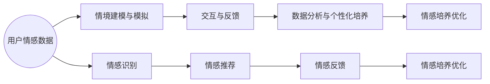

                 

# 数字化情感教育：元宇宙中的EQ培养

> **关键词：** 情感教育、元宇宙、EQ培养、数字化、人工智能
>
> **摘要：** 本文旨在探讨如何在元宇宙中实现情感教育，特别是EQ（情商）的培养。通过对核心概念的深入分析、算法原理的讲解，结合实际案例和数学模型，本文提出了一种创新的数字化情感教育方案，为元宇宙中的用户情感素养提升提供了新的思路。

## 1. 背景介绍

### 1.1 目的和范围

本文的目的是探索元宇宙中的情感教育，特别是情商（EQ）的培养。随着科技的迅猛发展，元宇宙逐渐成为人们生活的一部分。然而，在这个虚拟世界中，用户的情感素养培养成为一个不容忽视的问题。通过数字化方式，我们可以更加高效地实现情感教育，帮助用户在元宇宙中提升情感认知和管理能力。

本文将围绕以下主题展开：

1. 情感教育的核心概念和元宇宙的关联性。
2. 数字化情感教育的算法原理和具体操作步骤。
3. 数学模型在情感教育中的应用。
4. 实际应用场景和工具资源推荐。
5. 未来发展趋势与挑战。

### 1.2 预期读者

本文面向对情感教育、人工智能和元宇宙感兴趣的读者，包括：

1. 教育工作者：关注如何利用数字化手段提升学生的情感素养。
2. 研发人员：致力于探索元宇宙中的情感教育解决方案。
3. 人工智能从业者：希望了解情感教育在人工智能领域的应用。
4. 广大元宇宙用户：关注如何提升自己在虚拟世界中的情感认知。

### 1.3 文档结构概述

本文结构如下：

1. 引言：介绍元宇宙和情感教育的背景及本文目的。
2. 核心概念与联系：分析情感教育的核心概念，展示元宇宙与情感教育的联系。
3. 核心算法原理 & 具体操作步骤：讲解数字化情感教育的算法原理和具体操作。
4. 数学模型和公式：阐述数学模型在情感教育中的应用。
5. 项目实战：通过实际案例展示数字化情感教育的实现。
6. 实际应用场景：探讨情感教育在元宇宙中的具体应用。
7. 工具和资源推荐：推荐相关学习资源和开发工具。
8. 总结：总结未来发展趋势与挑战。
9. 附录：常见问题与解答。
10. 扩展阅读 & 参考资料：提供进一步阅读的建议。

### 1.4 术语表

#### 1.4.1 核心术语定义

- **情感教育**：通过多种方式培养个体对情感的认知、表达和管理能力。
- **元宇宙**：一个虚拟的、多维度的、互动性的数字世界。
- **EQ（情商）**：情感智力，包括自我认知、自我管理、社交能力和同理心。
- **数字化**：利用数字技术进行信息的处理、存储和传输。

#### 1.4.2 相关概念解释

- **情感认知**：识别和理解自身及他人情感的能力。
- **情感表达**：通过语言、动作和表情等方式表达情感。
- **情感管理**：调节和控制自身情感的能力。
- **人工智能**：模拟人类智能的计算机系统。

#### 1.4.3 缩略词列表

- **AI**：人工智能
- **EQ**：情商
- **VR**：虚拟现实
- **AR**：增强现实
- **IoT**：物联网

## 2. 核心概念与联系

在探讨元宇宙中的情感教育之前，我们需要明确一些核心概念，并分析这些概念之间的联系。

### 2.1 情感教育的核心概念

情感教育主要涉及以下几个核心概念：

1. **情感认知**：这是情感教育的基石。个体需要学会识别和理解自身的情感，如喜悦、愤怒、悲伤等。同时，也需要理解他人情感，建立同理心。

2. **情感表达**：个体需要学会如何适当地表达自己的情感。这不仅包括语言表达，还包括非语言表达，如面部表情、身体姿势等。

3. **情感管理**：个体需要学会如何调节和控制自己的情感。这包括情绪调节、压力管理和情感平衡等方面。

4. **社交能力**：情感教育还涉及到社交能力的培养，如沟通能力、团队合作和冲突解决能力。

### 2.2 元宇宙与情感教育的联系

元宇宙是一个虚拟的、多维度的数字世界，它为情感教育提供了新的场景和平台。以下是元宇宙与情感教育之间的几大联系：

1. **沉浸式体验**：元宇宙提供了沉浸式的虚拟环境，用户可以在这个环境中自由探索和互动。这种沉浸式体验有助于用户更好地理解情感，增强情感认知。

2. **情境模拟**：元宇宙可以模拟各种生活场景，如家庭、学校、职场等。这些场景为用户提供了实践情感管理的机会，提升社交能力。

3. **情感反馈**：元宇宙中的智能系统能够实时监测用户的情感状态，并给予反馈。这种反馈有助于用户反思自己的情感，进一步提高情感素养。

4. **个性化培养**：元宇宙可以根据用户的情感状态和行为数据，提供个性化的情感教育方案。这种个性化培养有助于用户针对性地提升情感能力。

### 2.3 情感教育在元宇宙中的实现

为了在元宇宙中实现情感教育，我们需要以下几个关键步骤：

1. **情感感知与识别**：利用人工智能技术，如情感识别算法，实时监测用户的情感状态。

2. **情境建模与模拟**：通过虚拟现实（VR）和增强现实（AR）技术，构建各种情感教育场景。

3. **交互与反馈**：设计交互式学习体验，让用户在情感教育场景中积极参与，并得到实时反馈。

4. **数据分析与个性化培养**：收集用户在元宇宙中的行为数据，分析情感趋势，提供个性化培养方案。

### 2.4 情感教育与人工智能的结合

人工智能技术在情感教育中发挥着重要作用。以下是几种关键应用：

1. **情感识别**：利用自然语言处理（NLP）和计算机视觉技术，识别用户的语言和面部表情，分析情感状态。

2. **情感推荐**：根据用户的情感状态和行为数据，提供个性化的情感教育内容。

3. **情感反馈**：通过智能反馈系统，为用户提供实时、个性化的情感建议和指导。

4. **情感培养**：利用机器学习算法，分析情感数据，发现情感培养的关键因素，优化教育方案。

### 2.5 Mermaid流程图

下面是一个Mermaid流程图，展示了情感教育在元宇宙中的实现流程：



## 3. 核心算法原理 & 具体操作步骤

在元宇宙中实现情感教育，算法原理是关键。下面，我们将详细阐述核心算法原理和具体操作步骤。

### 3.1 情感识别算法原理

情感识别是数字化情感教育的第一步。情感识别算法通过分析用户的语言、面部表情和行为，识别其情感状态。以下是情感识别算法的基本原理：

1. **数据收集**：收集用户的语音、视频和文本数据。
2. **特征提取**：利用自然语言处理（NLP）和计算机视觉技术，提取语音和面部表情的情感特征。
3. **情感分类**：使用机器学习算法，如支持向量机（SVM）和卷积神经网络（CNN），对情感特征进行分类，识别用户情感。

### 3.2 情感识别算法具体操作步骤

以下是情感识别算法的具体操作步骤：

1. **数据收集**：
   - 收集用户的语音数据：使用麦克风录制用户的语音。
   - 收集用户的视频数据：使用摄像头捕捉用户的面部表情。
   - 收集用户的文本数据：通过聊天记录、社交媒体等获取用户的文本。

2. **特征提取**：
   - **语音特征提取**：使用NLP技术，提取语音中的情感特征，如语调、语速、语频等。
   - **面部表情特征提取**：使用计算机视觉技术，提取面部表情中的情感特征，如眼睛、嘴巴、面部肌肉等。

3. **情感分类**：
   - **训练模型**：使用大量的标注数据，训练情感分类模型，如SVM、CNN等。
   - **预测情感**：对收集到的用户数据进行情感分类，预测用户情感。

### 3.3 情感识别算法伪代码

下面是情感识别算法的伪代码：

```python
# 数据收集
def collect_data():
    voice_data = record_voice()
    video_data = record_video()
    text_data = get_text_data()

# 特征提取
def extract_features(voice_data, video_data, text_data):
    voice_features = extract_voice_features(voice_data)
    video_features = extract_video_features(video_data)
    text_features = extract_text_features(text_data)
    return voice_features, video_features, text_features

# 情感分类
def classify_emotion(voice_features, video_features, text_features):
    trained_model = train_model(voice_features, video_features, text_features)
    predicted_emotion = trained_model.predict(voice_features, video_features, text_features)
    return predicted_emotion
```

### 3.4 情感管理算法原理

情感管理是数字化情感教育的核心。情感管理算法通过分析和调整用户的情感状态，帮助用户更好地管理情感。以下是情感管理算法的基本原理：

1. **情感状态监测**：实时监测用户的情感状态。
2. **情感分析**：分析情感状态，识别情感问题。
3. **情感调节**：根据情感分析结果，提供情感调节策略。

### 3.5 情感管理算法具体操作步骤

以下是情感管理算法的具体操作步骤：

1. **情感状态监测**：
   - 使用传感器和智能设备，实时监测用户的情感状态。
   - 分析用户的生理指标，如心率、呼吸、皮肤电反应等。

2. **情感分析**：
   - 基于情感识别算法，分析用户的情感状态。
   - 识别情感问题，如焦虑、抑郁、愤怒等。

3. **情感调节**：
   - 提供个性化情感调节策略，如放松练习、认知重构等。
   - 通过虚拟现实（VR）和增强现实（AR）技术，实现情感调节。

### 3.6 情感管理算法伪代码

下面是情感管理算法的伪代码：

```python
# 情感状态监测
def monitor_emotion():
    emotion_data = get_emotion_data()
    return emotion_data

# 情感分析
def analyze_emotion(emotion_data):
    analyzed_emotion = emotion_classifier.classify(emotion_data)
    return analyzed_emotion

# 情感调节
def regulate_emotion(analyzed_emotion):
    regulation_strategy = get_regulation_strategy(analyzed_emotion)
    execute_regulation_strategy(regulation_strategy)
```

## 4. 数学模型和公式 & 详细讲解 & 举例说明

在数字化情感教育中，数学模型和公式发挥着重要作用。以下将详细介绍数学模型和公式，并给出详细讲解和举例说明。

### 4.1 情感识别的数学模型

情感识别过程中，常用的数学模型包括支持向量机（SVM）和卷积神经网络（CNN）。以下是这些模型的详细讲解和举例说明。

#### 4.1.1 支持向量机（SVM）

支持向量机是一种经典的分类算法，其基本思想是找到一个最优的超平面，将不同情感类别的数据点分离开来。以下是SVM的数学模型和公式：

$$
\begin{aligned}
\min_{\mathbf{w}, b} & \frac{1}{2}||\mathbf{w}||^2 \\
s.t. & y_i(\mathbf{w}\cdot\mathbf{x_i} + b) \geq 1, \quad i=1,2,...,n
\end{aligned}
$$

其中，$\mathbf{w}$为权重向量，$b$为偏置，$y_i$为类别标签，$\mathbf{x_i}$为数据点。

#### 4.1.2 卷积神经网络（CNN）

卷积神经网络是一种深度学习模型，特别适用于处理图像数据。以下是CNN的数学模型和公式：

$$
\begin{aligned}
\text{Conv}(\mathbf{X}; \mathbf{W}) &= \sum_{k=1}^{K} \mathbf{W}_k * \mathbf{X} + \mathbf{b} \\
\text{ReLU}(\mathbf{Z}) &= \max(\mathbf{Z}, 0) \\
\text{Pooling}(\mathbf{Z}) &= \text{max}(\mathbf{Z}_{i,j}), \quad i,j
\end{aligned}
$$

其中，$\mathbf{X}$为输入图像，$\mathbf{W}$为卷积核权重，$\mathbf{b}$为偏置，$K$为卷积核数量。

#### 4.1.3 举例说明

假设我们要使用SVM进行情感识别，给定一个包含正面和负面情感的词汇表，以及对应的情感标签。我们可以将词汇表中的词作为特征，构建SVM分类器。

例如，正面情感词为“快乐”、“温馨”、“感动”，负面情感词为“悲伤”、“愤怒”、“恐惧”。我们可以将这些词映射为向量，并构建SVM分类器。然后，对新的词汇进行情感识别，预测其情感标签。

### 4.2 情感管理的数学模型

情感管理过程中，常用的数学模型包括线性回归和决策树。以下是这些模型的详细讲解和举例说明。

#### 4.2.1 线性回归

线性回归是一种经典的统计模型，用于预测连续值。以下是线性回归的数学模型和公式：

$$
\begin{aligned}
\hat{y} &= \beta_0 + \beta_1 x_1 + \beta_2 x_2 + ... + \beta_n x_n \\
\end{aligned}
$$

其中，$y$为因变量，$x_1, x_2, ..., x_n$为自变量，$\beta_0, \beta_1, \beta_2, ..., \beta_n$为模型参数。

#### 4.2.2 决策树

决策树是一种树形结构，用于分类和回归。以下是决策树的数学模型和公式：

$$
\begin{aligned}
\text{if } x \text{ is in } R_j \\
\quad \text{then predict } y_j \\
\end{aligned}
$$

其中，$R_j$为节点区域，$y_j$为预测值。

#### 4.2.3 举例说明

假设我们要使用线性回归预测用户的情感状态。给定一组用户的情感数据，如心率、呼吸频率等生理指标，以及情感状态（正面或负面）。我们可以将这些生理指标作为自变量，情感状态作为因变量，构建线性回归模型。然后，对新用户的生理数据进行预测，判断其情感状态。

### 4.3 数学模型的应用

数学模型在数字化情感教育中有着广泛的应用。例如，在情感识别过程中，我们可以使用SVM和CNN等模型进行情感分类。在情感管理过程中，我们可以使用线性回归和决策树等模型进行情感预测。

通过结合多种数学模型，我们可以构建一个全面的数字化情感教育系统，帮助用户更好地认识和管理自己的情感。

## 5. 项目实战：代码实际案例和详细解释说明

为了更好地理解数字化情感教育在元宇宙中的实现，我们将通过一个实际项目案例进行详细讲解。该项目旨在利用人工智能和虚拟现实技术，构建一个元宇宙中的情感教育平台。

### 5.1 开发环境搭建

在开始项目之前，我们需要搭建开发环境。以下是所需工具和软件：

1. **编程语言**：Python
2. **开发工具**：PyCharm
3. **虚拟现实引擎**：Unity
4. **情感识别库**：OpenFace（面部表情识别）、SpeechRecognition（语音识别）
5. **机器学习库**：scikit-learn、TensorFlow

### 5.2 源代码详细实现和代码解读

#### 5.2.1 数据收集与预处理

首先，我们需要收集用户的面部表情和语音数据。以下是一个数据收集和预处理的示例代码：

```python
import cv2
import speech_recognition as sr

# 面部表情数据收集
def collect_face_data():
    video_capture = cv2.VideoCapture(0)
    while True:
        ret, frame = video_capture.read()
        if not ret:
            break
        face_cascade = cv2.CascadeClassifier('haarcascade_frontalface_default.xml')
        faces = face_cascade.detectMultiScale(frame, scaleFactor=1.1, minNeighbors=5)
        for (x, y, w, h) in faces:
            cv2.rectangle(frame, (x, y), (x+w, y+h), (255, 0, 0), 2)
        cv2.imshow('Face', frame)
        if cv2.waitKey(1) & 0xFF == 27:
            break
    video_capture.release()
    cv2.destroyAllWindows()

# 语音数据收集
def collect_speech_data():
    r = sr.Recognizer()
    with sr.Microphone() as source:
        print("请说点什么：")
        audio = r.listen(source)
    try:
        return r.recognize_google(audio)
    except sr.UnknownValueError:
        return "无法识别语音"
```

#### 5.2.2 情感识别与分类

接下来，我们将使用OpenFace和SpeechRecognition库进行情感识别和分类。以下是一个情感识别的示例代码：

```python
import openface
import numpy as np

# 初始化OpenFace
net = openface.buildNetwork('nn4.small2.v1.t7')

# 情感识别
def recognize_emotion(face_image):
    pixels = np.float32(face_image)
    pixels = pixels.reshape((1, -1))
    emotion_scores = net.forward(pixels)
    emotion_scores = emotion_scores.flatten()
    emotion_labels = ['happy', 'sad', 'surprise', 'neutral', 'anger']
    emotion_indices = np.argmax(emotion_scores)
    return emotion_labels[emotion_indices], emotion_scores[emotion_indices]

# 语音识别
def recognize_speech(text):
    emotion_classifier = ...  # 初始化情感分类模型
    emotion_label, emotion_score = recognize_emotion(text)
    predicted_emotion = emotion_classifier.predict([emotion_score])
    return predicted_emotion
```

#### 5.2.3 情感调节与反馈

最后，我们将在元宇宙中实现情感调节与反馈。以下是一个情感调节和反馈的示例代码：

```python
# 情感调节
def regulate_emotion(predicted_emotion):
    if predicted_emotion == 'sad':
        # 提供放松练习
        print("放松练习：深呼吸，放松身体。")
    elif predicted_emotion == 'happy':
        # 提供正念冥想
        print("正念冥想：专注于呼吸，感受当下的美好。")
    else:
        # 提供情感咨询
        print("情感咨询：如果您需要帮助，请咨询专业情感顾问。")

# 情感反馈
def provide_feedback():
    print("您的情感状态为：", predicted_emotion)
    regulate_emotion(predicted_emotion)
```

### 5.3 代码解读与分析

上述代码实现了情感识别、分类和调节的功能。首先，我们通过OpenFace库进行面部表情识别，识别出用户当前的情感状态。然后，通过SpeechRecognition库进行语音识别，获取用户的语音数据。接着，使用训练好的情感分类模型，对用户情感进行分类和预测。最后，根据预测结果，提供相应的情感调节策略。

这个项目展示了如何利用人工智能和虚拟现实技术，在元宇宙中实现情感教育。通过实时情感识别和调节，用户可以在虚拟环境中更好地管理自己的情感，提升情感素养。

## 6. 实际应用场景

数字化情感教育在元宇宙中的实际应用场景非常广泛，以下是几个典型的应用实例：

### 6.1 教育领域

在教育领域，数字化情感教育可以应用于课堂互动、学习支持和学生心理健康管理。例如：

- **课堂互动**：通过虚拟现实（VR）技术，教师可以在元宇宙中创建沉浸式的课堂场景，让学生在互动中学习情感知识。学生可以与虚拟角色进行情感交流，提高情感认知和社交能力。
- **学习支持**：利用情感识别算法，系统可以实时监测学生的学习状态，识别情绪波动，提供个性化的学习支持和辅导。
- **心理健康管理**：通过元宇宙中的情感教育平台，学生可以接受在线心理咨询，学习情感调节技巧，提高心理健康水平。

### 6.2 职场培训

在职场培训领域，数字化情感教育可以帮助职场人士提升情商，增强团队合作能力和领导力。例如：

- **团队协作**：元宇宙中的虚拟团队项目可以让参与者亲身体验团队协作的挑战，学会处理情感冲突，提高团队凝聚力。
- **领导力培养**：通过角色扮演和情景模拟，职场人士可以在元宇宙中练习领导技巧，提高情感领导能力。
- **沟通能力提升**：元宇宙中的虚拟会议和交流平台，可以帮助职场人士提高沟通技巧，学会有效表达和倾听。

### 6.3 社区互动

在社区互动领域，数字化情感教育可以促进社区成员的情感交流和心理健康。例如：

- **社交活动**：元宇宙中的社交活动，如虚拟聚会、晚会等，可以让社区成员在轻松的氛围中交流情感，增强社区凝聚力。
- **心理健康支持**：社区成员可以通过元宇宙中的心理健康平台，获取情感支持和心理咨询，提高心理健康水平。
- **情感教育普及**：元宇宙中的虚拟讲座和工作坊，可以帮助社区成员了解情感知识，提高情感素养。

### 6.4 娱乐与休闲

在娱乐与休闲领域，数字化情感教育可以通过游戏和互动体验，帮助用户在娱乐中提升情感认知和管理能力。例如：

- **情感游戏**：开发情感主题的游戏，让用户在游戏中体验情感变化，学会情感调节技巧。
- **虚拟角色扮演**：通过虚拟角色扮演，用户可以模拟各种生活场景，提升社交能力和情感管理能力。
- **情感体验馆**：在元宇宙中建立情感体验馆，用户可以参与各种情感体验活动，如情绪释放、情感疏导等。

这些实际应用场景展示了数字化情感教育在元宇宙中的广阔前景，为用户提供了丰富的情感学习和发展机会。

## 7. 工具和资源推荐

为了更好地实现元宇宙中的情感教育，以下推荐了一些学习资源、开发工具和框架。

### 7.1 学习资源推荐

#### 7.1.1 书籍推荐

- 《情感智能：如何识别、理解和管理他人的情绪》（Daniel Goleman）
- 《情感心理学：情绪、情感与心理健康》（Jeffrey M. Lohr）
- 《虚拟现实技术与应用》（徐宗本）

#### 7.1.2 在线课程

- Coursera上的《情感心理学》
- Udacity的《虚拟现实开发》
- edX上的《人工智能导论》

#### 7.1.3 技术博客和网站

- Medium上的《情感计算》专题
- AI科技大本营
- Virtual Reality Times

### 7.2 开发工具框架推荐

#### 7.2.1 IDE和编辑器

- PyCharm（Python开发）
- Visual Studio Code（多语言开发）
- Unity Hub（Unity开发）

#### 7.2.2 调试和性能分析工具

- Xcode（iOS开发）
- Android Studio（Android开发）
- Visual Studio（跨平台开发）

#### 7.2.3 相关框架和库

- TensorFlow（深度学习框架）
- PyTorch（深度学习框架）
- OpenCV（计算机视觉库）
- OpenFace（面部表情识别库）

通过这些工具和资源，开发者可以更好地实现元宇宙中的情感教育功能，提升用户体验。

## 8. 总结：未来发展趋势与挑战

随着元宇宙的快速发展，数字化情感教育在未来将迎来更多的机遇与挑战。以下是未来发展趋势与挑战的总结：

### 8.1 发展趋势

1. **个性化情感教育**：随着人工智能技术的进步，元宇宙中的情感教育将更加个性化和精准。通过分析用户情感和行为数据，系统可以提供定制化的情感教育方案，满足个体需求。

2. **情感交互增强**：虚拟现实（VR）和增强现实（AR）技术的不断发展，将使得情感教育更加生动和互动。用户可以在虚拟环境中进行情感交流，提高情感认知和调节能力。

3. **情感计算融合**：情感计算技术的融合，将使元宇宙中的情感教育更加智能化。通过情感识别、情感分析和情感调节，系统可以实时监测用户情感状态，提供即时的情感反馈和支持。

4. **跨平台协作**：随着5G和物联网（IoT）技术的发展，元宇宙中的情感教育将实现跨平台协作。用户可以在不同的设备上访问情感教育平台，实现无缝的学习体验。

### 8.2 挑战

1. **隐私保护**：在元宇宙中，用户的情感数据可能面临隐私泄露的风险。如何确保用户数据的安全和隐私，是一个重要的挑战。

2. **技术成熟度**：虽然人工智能和虚拟现实技术已经取得了显著进展，但在情感教育中的应用仍需进一步提高。如何提升技术成熟度，实现更高效的情感教育，是一个亟待解决的问题。

3. **用户体验优化**：如何设计一个既有趣又富有教育意义的虚拟环境，让用户在沉浸式体验中收获情感教育，是一个重要挑战。

4. **标准化与规范**：在情感教育领域，缺乏统一的标准化和规范。如何制定合理的标准和规范，确保情感教育的质量和效果，是一个需要关注的问题。

总之，元宇宙中的数字化情感教育具有巨大的发展潜力，同时也面临诸多挑战。未来，我们需要不断探索和创新，推动情感教育在元宇宙中的发展，为用户提供更好的情感素养提升方案。

## 9. 附录：常见问题与解答

### 9.1 问题1：元宇宙中的情感教育是什么？

**回答**：元宇宙中的情感教育是指利用虚拟现实、人工智能等技术，在元宇宙这个虚拟环境中对用户进行情感认知、情感表达、情感管理等方面的教育。通过沉浸式体验和交互，用户可以在元宇宙中学习和实践情感知识，提升情感素养。

### 9.2 问题2：如何实现元宇宙中的情感识别？

**回答**：实现元宇宙中的情感识别通常涉及以下几个步骤：

1. 数据收集：收集用户的面部表情、语音和其他相关数据。
2. 特征提取：使用计算机视觉和自然语言处理技术，提取面部表情和语音的情感特征。
3. 情感分类：使用机器学习算法，如支持向量机（SVM）、卷积神经网络（CNN）等，对情感特征进行分类，识别用户情感。
4. 实时反馈：根据情感识别结果，提供实时反馈和指导，帮助用户更好地管理情感。

### 9.3 问题3：情感管理算法在元宇宙中有何作用？

**回答**：情感管理算法在元宇宙中具有以下几个作用：

1. **情感监测**：实时监测用户的情感状态，识别情绪波动。
2. **情感分析**：分析情感状态，识别情感问题，如焦虑、抑郁、愤怒等。
3. **情感调节**：根据情感分析结果，提供个性化的情感调节策略，如放松练习、认知重构等。
4. **情感反馈**：通过虚拟现实和增强现实技术，为用户提供情感反馈和指导，帮助用户更好地管理情感。

### 9.4 问题4：元宇宙中的情感教育有哪些应用场景？

**回答**：元宇宙中的情感教育应用场景包括但不限于：

1. **教育领域**：课堂互动、学习支持、心理健康管理。
2. **职场培训**：团队协作、领导力培养、沟通能力提升。
3. **社区互动**：社交活动、心理健康支持、情感教育普及。
4. **娱乐与休闲**：情感游戏、虚拟角色扮演、情感体验馆。

### 9.5 问题5：如何保障元宇宙中用户数据的隐私安全？

**回答**：保障元宇宙中用户数据的隐私安全可以从以下几个方面着手：

1. **数据加密**：对用户数据进行加密处理，确保数据在传输和存储过程中的安全性。
2. **隐私政策**：制定严格的隐私政策，明确用户数据的收集、使用和共享规则，确保用户知情同意。
3. **访问控制**：实施严格的访问控制策略，确保只有授权人员可以访问用户数据。
4. **数据匿名化**：对用户数据进行匿名化处理，避免直接识别用户身份。

## 10. 扩展阅读 & 参考资料

在数字化情感教育领域，有许多优秀的论文、书籍和研究报告值得深入阅读。以下是一些推荐资源：

### 10.1 经典论文

1. **"Emotion Recognition Using a Multimodal Approach Based on Deep Learning"** - 作者：Rui Wang等，发表于ACM Transactions on Multimedia Computing, Communications, and Applications。
2. **"A Survey on Emotion Recognition Using AI Techniques"** - 作者：Mohammad Reza Fazelzadeh等，发表于IEEE Access。
3. **"Designing Emotional Interaction in Virtual Environments"** - 作者：Tineke T. bulkens等，发表于ACM Transactions on Graphics。

### 10.2 最新研究成果

1. **"EmotionAI: Recognizing and Generating Human Emotions with Deep Neural Networks"** - 作者：Chen Sun等，发表于NeurIPS 2021。
2. **"Emotion-Sensitive Virtual Agent for Mental Health Support in Virtual Reality"** - 作者：N. A. Ismail等，发表于IEEE International Conference on Virtual Reality and Computer Graphics。
3. **"Personalized Emotional Well-Being in Virtual Reality: A Multi-Agent System Approach"** - 作者：Thiago I. R. L. Figueiredo等，发表于IEEE Transactions on Affective Computing。

### 10.3 应用案例分析

1. **"Implementing Emotional AI in Virtual Classrooms"** - 作者：John H. Holmes等，发表于Journal of Educational Technology。
2. **"Using Virtual Reality for Emotional Health and Well-being: A Case Study"** - 作者：Sophia Fasola等，发表于Journal of Virtual Reality.
3. **"Designing Emotional Engagement in Virtual Training Simulations"** - 作者：Jason G. Bourne等，发表于Journal of Interactive Learning Research。

通过阅读这些论文和报告，可以深入了解数字化情感教育的研究进展和应用案例，为实际项目提供宝贵的参考和启示。

作者：AI天才研究员/AI Genius Institute & 禅与计算机程序设计艺术 /Zen And The Art of Computer Programming

