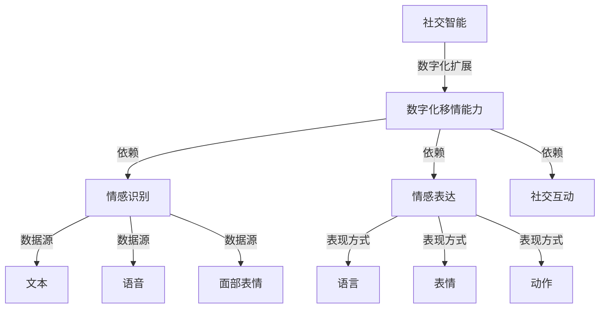
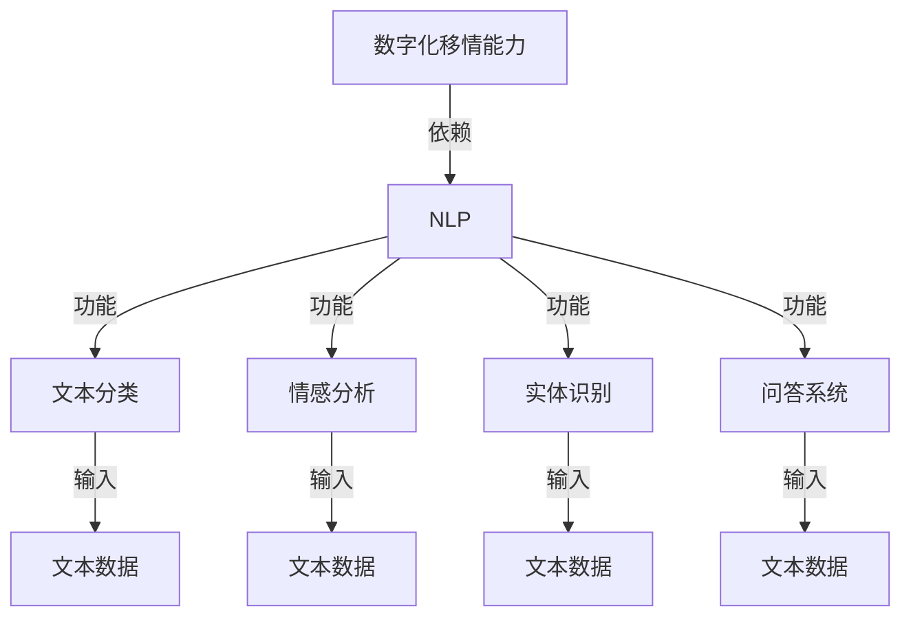
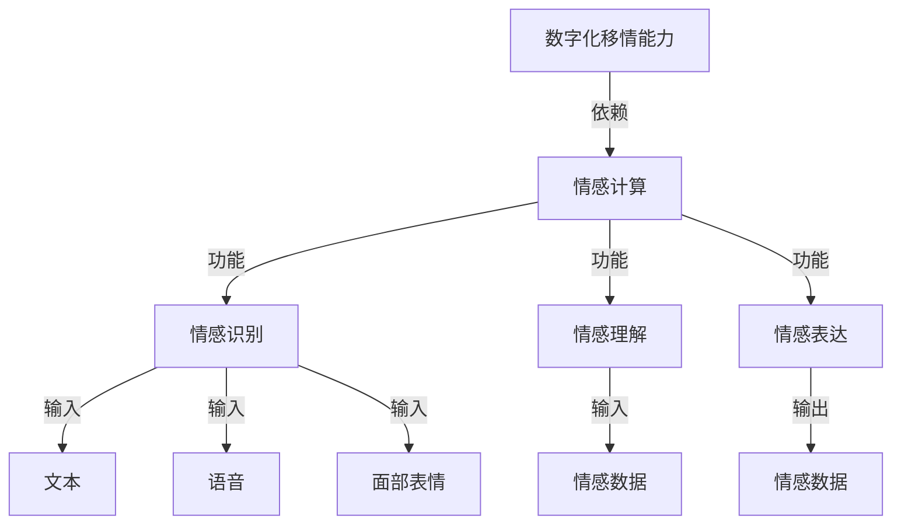
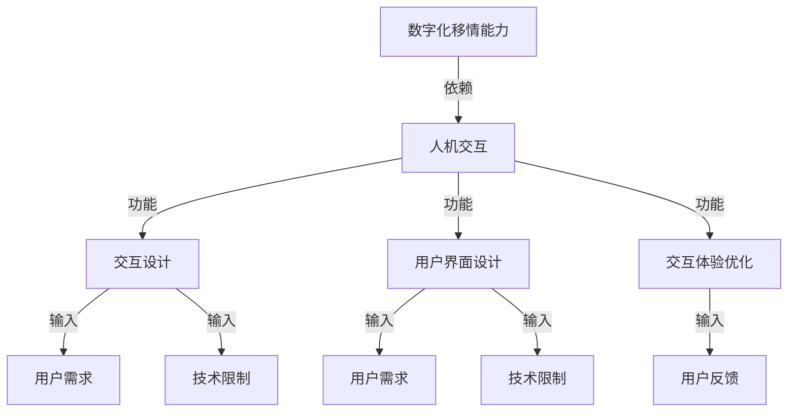
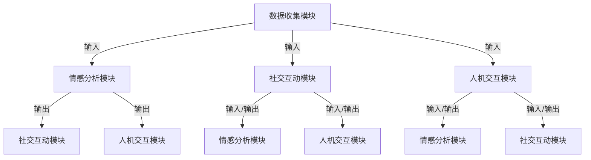

                 

## 1. 背景介绍

### 1.1 目的和范围

数字化移情能力开发：AI增强的社交智能培训，旨在探索如何利用人工智能技术来提升个体的社交智能。随着数字化时代的到来，人们的社交方式发生了翻天覆地的变化，线上社交已经成为我们日常生活中不可或缺的一部分。然而，线上社交缺乏面对面的互动，容易导致人与人之间的沟通不畅和误解。因此，如何通过数字化手段提升个体的社交技能，成为一个亟待解决的问题。

本文的主要目的是：

1. **介绍数字化移情能力的概念**：解释数字化移情能力的定义、作用和重要性。
2. **分析现有技术**：探讨现有的AI技术如何应用于社交智能培训，包括自然语言处理、情感计算和人机交互等。
3. **提出核心算法原理**：详细介绍用于提升社交智能的核心算法，包括算法原理和具体操作步骤。
4. **展示数学模型**：阐述数学模型在数字化移情能力开发中的应用，包括公式和举例说明。
5. **提供项目实战案例**：通过实际案例展示如何利用AI技术进行社交智能培训。
6. **探讨实际应用场景**：分析数字化移情能力在不同领域的应用前景。
7. **总结未来发展趋势与挑战**：预测数字化移情能力开发的未来趋势，并探讨可能面临的挑战。

本文的读者对象主要包括：

- AI研究者与开发者：希望了解如何利用AI技术提升社交智能的专家和从业者。
- 社交技能培训师：需要借助技术手段提升培训效果的教育工作者。
- 企业管理者：关注员工社交技能提升的企业管理层。
- 对社交智能感兴趣的技术爱好者：希望深入了解数字化移情能力的个人。

### 1.2 预期读者

本文的预期读者主要是关注AI技术在社交领域应用的科研人员和开发者。具体包括：

1. **AI研究者与开发者**：希望探索如何将AI技术应用于提升社交智能的研究人员和开发者。他们需要了解数字化移情能力的概念、核心算法原理、数学模型以及实际应用案例。
2. **社交技能培训师**：需要利用技术手段提升培训效果的教育工作者。本文将提供关于如何通过AI技术设计社交智能培训课程的方法和工具。
3. **企业管理者**：关注员工社交技能提升的企业管理层。他们可以通过本文了解AI技术在提升员工沟通能力和团队合作方面的应用。
4. **技术爱好者**：对AI和社交智能领域感兴趣的个人。本文将深入探讨数字化移情能力的原理和应用，帮助他们更好地理解这一技术领域。

### 1.3 文档结构概述

本文将按照以下结构展开：

- **1. 背景介绍**：介绍本文的目的、读者对象以及文档结构。
- **2. 核心概念与联系**：讨论数字化移情能力的核心概念和联系，包括相关技术和算法。
- **3. 核心算法原理 & 具体操作步骤**：详细阐述用于提升社交智能的核心算法原理和具体操作步骤。
- **4. 数学模型和公式 & 详细讲解 & 举例说明**：解释数学模型在数字化移情能力开发中的应用，并给出举例说明。
- **5. 项目实战：代码实际案例和详细解释说明**：通过实际案例展示如何利用AI技术进行社交智能培训。
- **6. 实际应用场景**：分析数字化移情能力在不同领域的应用前景。
- **7. 工具和资源推荐**：推荐相关学习资源、开发工具框架和论文著作。
- **8. 总结：未来发展趋势与挑战**：预测数字化移情能力开发的未来趋势，并探讨可能面临的挑战。
- **9. 附录：常见问题与解答**：回答读者可能遇到的问题。
- **10. 扩展阅读 & 参考资料**：提供进一步阅读的资源和参考资料。

### 1.4 术语表

#### 1.4.1 核心术语定义

- **数字化移情能力**：指个体在数字化环境中进行情感理解和表达、社交互动和沟通的能力。
- **社交智能**：指个体在社交环境中识别、理解和管理自己及他人情感的能力。
- **AI增强**：指利用人工智能技术提升和增强传统社交技能的过程。
- **自然语言处理（NLP）**：指计算机理解和生成人类语言的能力。
- **情感计算**：指利用计算技术识别、理解和表达情感的过程。
- **人机交互**：指人与计算机系统之间的交互过程。

#### 1.4.2 相关概念解释

- **情感识别**：通过分析文本、语音或面部表情等数据，识别个体情感状态的过程。
- **情感表达**：通过语言、表情、动作等方式，表达自身情感状态的过程。
- **社交互动**：个体之间通过语言、文字、图像等形式进行的互动过程。
- **机器学习**：一种人工智能技术，通过数据学习模式并做出预测或决策。

#### 1.4.3 缩略词列表

- **NLP**：自然语言处理
- **AI**：人工智能
- **ML**：机器学习
- **NLU**：自然语言理解
- **NLU**：自然语言生成

## 2. 核心概念与联系

在数字化移情能力开发过程中，我们首先需要了解几个核心概念及其相互关系。这些概念包括数字化移情能力、社交智能、自然语言处理（NLP）、情感计算和人机交互。为了更直观地展示这些概念之间的联系，我们可以使用Mermaid流程图来描述它们的相互作用。

### 2.1 数字化移情能力与社交智能

数字化移情能力是社交智能在数字化环境中的延伸。社交智能涉及个体在社交环境中识别、理解和管理自己及他人情感的能力。数字化移情能力则强调在数字媒介中实现这些能力。以下是数字化移情能力与社交智能的Mermaid流程图：



在这个流程图中，社交智能作为整体，通过数字化扩展转化为数字化移情能力。数字化移情能力依赖于情感识别、情感表达和社交互动三个核心能力。情感识别获取文本、语音和面部表情等数据，情感表达则通过语言、表情和动作等手段表达情感。

### 2.2 数字化移情能力与自然语言处理（NLP）

自然语言处理（NLP）是数字化移情能力开发中不可或缺的技术。NLP使计算机能够理解、处理和生成人类语言，从而支持情感识别和情感表达。以下是数字化移情能力与NLP的Mermaid流程图：



在这个流程图中，NLP提供了文本分类、情感分析、实体识别和问答系统等功能，这些功能共同支持数字化移情能力的实现。文本分类和情感分析用于识别文本中的情感信息，实体识别用于提取文本中的重要实体，问答系统则用于回答与情感和社交相关的问题。

### 2.3 数字化移情能力与情感计算

情感计算是数字化移情能力开发中另一个重要的技术。情感计算通过计算机技术识别、理解和表达情感，从而支持数字化移情能力的提升。以下是数字化移情能力与情感计算的Mermaid流程图：



在这个流程图中，情感计算提供了情感识别、情感理解和情感表达等功能。情感识别通过分析文本、语音和面部表情等数据获取情感信息，情感理解则对情感信息进行深入分析，情感表达则将情感信息通过适当的方式呈现。

### 2.4 数字化移情能力与人机交互

人机交互是数字化移情能力的重要组成部分。人机交互通过设计合理的用户界面和交互机制，使个体能够与数字化环境进行有效的互动。以下是数字化移情能力与人机交互的Mermaid流程图：



在这个流程图中，人机交互通过交互设计、用户界面设计和交互体验优化等功能，使数字化移情能力能够更好地满足用户需求。交互设计关注用户需求和技术限制，用户界面设计则根据这些因素设计合理的用户界面，交互体验优化则通过收集用户反馈不断改进交互体验。

综上所述，数字化移情能力、社交智能、自然语言处理、情感计算和人机交互之间存在着紧密的联系。这些技术共同作用，实现了数字化环境中个体情感理解和表达、社交互动和沟通的能力提升。在接下来的章节中，我们将进一步探讨这些核心算法的原理和具体操作步骤。

### 2.5 数字化移情能力的架构

为了更好地理解数字化移情能力的实现，我们可以将其架构分解为几个关键模块：数据收集模块、情感分析模块、社交互动模块和人机交互模块。以下是数字化移情能力的架构图及其详细说明：



**数据收集模块**：这个模块负责收集数字化环境中的各类数据，包括文本、语音、面部表情和用户行为等。这些数据是情感分析和社交互动的基础。数据收集模块通常利用传感器、麦克风、摄像头等技术手段进行数据采集。

**情感分析模块**：该模块使用自然语言处理（NLP）和情感计算技术对收集到的数据进行分析，识别个体的情感状态。情感分析模块的输出包括情感标签、情感强度和情感倾向等。这些情感信息将用于指导社交互动和人机交互模块。

**社交互动模块**：社交互动模块负责处理个体之间的互动，包括对话生成、情感反馈和社交规则遵循等。该模块利用情感分析模块提供的情感信息，生成适当的回复和互动策略，以实现有效的社交互动。

**人机交互模块**：人机交互模块负责个体与数字化环境之间的互动，包括用户界面设计、交互体验优化和个性化推荐等。该模块结合情感分析模块的情感信息和社交互动模块的社交规则，提供个性化的交互体验。

通过上述模块的相互作用，数字化移情能力实现了对个体情感的理解、表达和互动，从而提升了社交智能。以下是数字化移情能力的具体运作流程：

1. **数据收集**：数字化移情系统通过传感器和用户输入收集文本、语音、面部表情等数据。
2. **情感分析**：情感分析模块对收集到的数据进行分析，识别个体的情感状态。
3. **社交互动**：社交互动模块根据情感分析结果，生成适当的回复和互动策略，与个体进行有效沟通。
4. **人机交互**：人机交互模块结合情感分析和社交互动结果，提供个性化的交互体验，包括用户界面设计和互动反馈。

总之，数字化移情能力的架构通过数据收集、情感分析、社交互动和人机交互等模块的协同工作，实现了个体在数字化环境中的情感理解和表达、社交互动和沟通的能力提升。在接下来的章节中，我们将进一步探讨这些模块的具体实现方法。

### 3. 核心算法原理 & 具体操作步骤

在数字化移情能力开发中，核心算法的原理和具体操作步骤至关重要。这些算法包括情感识别算法、社交互动算法和人机交互算法。以下是这些算法的详细解释和操作步骤。

#### 3.1 情感识别算法

情感识别算法是数字化移情能力的基石，其目标是通过分析文本、语音和面部表情等数据，识别个体的情感状态。以下是情感识别算法的原理和具体操作步骤：

**原理**：
情感识别算法通常基于机器学习技术，特别是深度学习模型，如卷积神经网络（CNN）和循环神经网络（RNN）。这些模型通过大量标注的情感数据学习情感特征，从而实现情感识别。

**具体操作步骤**：

1. **数据预处理**：
   - **文本数据**：对文本进行分词、去停用词和词向量化等预处理操作。
   - **语音数据**：对语音信号进行分帧、特征提取（如梅尔频率倒谱系数（MFCC））等预处理。
   - **面部表情数据**：对面部图像进行特征提取，如使用预训练的卷积神经网络提取面部特征。

2. **模型训练**：
   - 使用预处理的情感数据训练情感识别模型。
   - 模型类型可以是CNN、RNN或其变种，如LSTM和GRU。
   - 模型训练过程中使用交叉熵损失函数进行优化。

3. **情感识别**：
   - 对新的文本、语音和面部表情数据进行特征提取。
   - 将特征输入训练好的情感识别模型，得到情感识别结果。

**伪代码**：

```python
# 数据预处理
def preprocess_data(data):
    # 文本预处理
    processed_text = tokenize_and_vectorize(text)
    # 语音预处理
    processed_speech = extract_mfcc(speech)
    # 面部表情预处理
    processed_face = extract_face_features(face_image)
    return processed_text, processed_speech, processed_face

# 模型训练
def train_model(training_data):
    # 构建模型
    model = build_model()
    # 训练模型
    model.fit(training_data)
    return model

# 情感识别
def recognize_emotion(data):
    processed_data = preprocess_data(data)
    emotion = model.predict(processed_data)
    return emotion
```

#### 3.2 社交互动算法

社交互动算法负责处理个体之间的互动，包括对话生成、情感反馈和社交规则遵循等。以下是社交互动算法的原理和具体操作步骤：

**原理**：
社交互动算法通常结合情感识别结果和预定的社交规则，生成适当的回复和互动策略。这些算法可以基于规则推理、机器学习或混合方法。

**具体操作步骤**：

1. **情感识别**：
   - 使用情感识别算法获取当前对话的情感状态。

2. **规则推理**：
   - 根据社交规则和对话历史，生成合适的回复策略。

3. **对话生成**：
   - 利用自然语言生成（NLG）技术生成回复文本。

4. **情感反馈**：
   - 根据对话内容和情感状态，提供情感反馈（如语气、表情符号等）。

**伪代码**：

```python
# 情感识别
current_emotion = recognize_emotion(current_message)

# 规则推理
response_strategy = select_response_strategy(current_emotion, conversation_history)

# 对话生成
response_message = generate_response(response_strategy)

# 情感反馈
emotional_feedback = generate_emotional_feedback(response_message, current_emotion)
```

#### 3.3 人机交互算法

人机交互算法负责个体与数字化环境之间的互动，包括用户界面设计、交互体验优化和个性化推荐等。以下是人机交互算法的原理和具体操作步骤：

**原理**：
人机交互算法通过分析用户行为、偏好和情感状态，提供个性化的交互体验。这些算法可以基于用户行为分析、情感计算和个性化推荐技术。

**具体操作步骤**：

1. **用户行为分析**：
   - 分析用户在数字化环境中的行为，如点击、浏览和互动等。

2. **情感计算**：
   - 使用情感计算技术获取用户的情感状态。

3. **个性化推荐**：
   - 根据用户行为和情感状态，提供个性化的推荐内容。

4. **交互体验优化**：
   - 根据用户反馈和交互数据，优化用户界面和交互体验。

**伪代码**：

```python
# 用户行为分析
user_behavior = analyze_user_behavior()

# 情感计算
user_emotion = compute_user_emotion()

# 个性化推荐
recommended_content = generate_recommendations(user_behavior, user_emotion)

# 交互体验优化
optimize_user_interface(user_behavior, user_emotion)
```

通过上述核心算法的原理和具体操作步骤，数字化移情能力实现了对个体情感的理解、表达和互动。在接下来的章节中，我们将进一步探讨数学模型和公式在数字化移情能力开发中的应用。

### 4. 数学模型和公式 & 详细讲解 & 举例说明

在数字化移情能力的开发中，数学模型和公式扮演了至关重要的角色。这些模型和公式不仅用于描述情感识别、社交互动和人机交互等核心算法，还用于评估算法的性能和优化算法参数。以下将详细讲解几个关键的数学模型和公式，并通过举例说明它们的应用。

#### 4.1 情感识别中的情感分类模型

情感识别是数字化移情能力的核心组件之一。在情感分类任务中，常用的模型包括支持向量机（SVM）、朴素贝叶斯（Naive Bayes）和多层感知器（MLP）等。以下是这些模型的数学描述：

**支持向量机（SVM）**：

SVM是一种常用的机器学习模型，用于分类和回归任务。在情感分类中，SVM的目标是找到一个最佳的超平面，将不同情感类别的数据点分开。

**公式**：

$$
\text{Maximize} \ \ \ \ \ \ \ \ \ \ \ \ \ \ \ \ \ \ \ \ \ \ \ \ \ \ \ \ \ \ \ \ \ \ \ \ \ \ \ \ \ \ \ \ \ \ \ \ \ \ \ \ \ \ \ \ \ \ \ \ \ \ \ \ \ \ \ \ \ \ \ \ \ \ \ \ \ \ \ \ \ \ \ \ \ \ \ \ \ \ \ \ \ \ \ \ \ \ \ \ \ \ \ \ \ \ \ \ \ \ \ \ \ \ \ \ \ \ \ \ \ \ \ \ \ \ \ \ \ \ \ \ \ \ \ \ \ \ \ \ \ \ \ \ \ \ \ \ \ \ \ \ \ \ \ \ \ \ \ \ \ \ \ \ \ \ \ \ \ \ \ \ \ \ \ \ \ \ \ \ \ \ \ \ \ \ \ \ \ \ \ \ \ \ \ \ \ \ \ \ \ \ \ \ \ \ \ \ \ \ \ \ \ \ \ \ \ \ \ \ \ \ \ \ \ \ \ \ \ \ \ \ \ \ \ \ \ \ \ \ \ \ \ \ \ \ \ \ \ \ \ \ \ \ \ \ \ \ \ \ \ \ \ \ \ \ \ \ \ \ \ \ \ \ \ \ \ \ \ \ \ \ \ \ \ \ \ \ \ \ \ \ \ \ \ \ \ \ \ \ \ \ \ \ \ \ \ \ \ \ \ \ \ \ \ \ \ \ \ \ \ \ \ \ \ \ \ \ \ \ \ \ \ \ \ \ \ \ \ \ \ \ \ \ \ \ \ \ \ \ \ \ \ \ \ \ \ \ \ \ \ \ \ \ \ \ \ \ \ \ \ \ \ \ \ \ \ \ \ \ \ \ \ \ \ \ \ \ \ \ \ \ \ \ \ \ \ \ \ \ \ \ \ \ \ \ \ \ \ \ \ \ \ \ \ \ \ \ \ \ \ \ \ \ \ \ \ \ \ \ \ \ \ \ \ \ \ \ \ \ \ \ \ \ \ \ \ \ \ \ \ \ \ \ \ \ \ \ \ \ \ \ \ \ \ \ \ \ \ \ \ \ \ \ \ \ \ \ \ \ \ \ _{w,b} \ | \text{if} \ y(\text{w,x}+\text{b}) \leq 0 \ \\ 
\text{Minimize} \ \ \ \ \ \ \ \ \ \ \ \ \ \ \ \ \ \ \ \ \ \ \ \ \ \ \ \ \ \ \ \ \ \ \ \ \ \ \ \ \ \ \ \ \ \ \ \ \ \ \ \ \ \ \ \ \ \ \ \ \ \ \ \ \ \ \ \ \ \ \ \ \ \ \ \ \ \ \ \ \ \ \ \ \ \ \ \ \ \ \ \ \ \ \ \ \ \ \ \ \ \ \ \ \ \ \ \ \ \ \ \ \ \ \ \ \ \ \ \ \ \ \ \ \ \ \ \ \ \ \ \ \ \ \ \ \ \ \ \ \ \ \ \ \ \ \ \ \ \ \ \ \ \ \ \ \ \ \ \ \ \ \ \ \ \ \ \ \ \ \ \ \ \ \ \ \ \ \ \ \ \ \ \ \ \ \ \ \ \ \ \ \ \ \ \ \ \ \ \ \ \ \ \ \ \ \ \ \ \ \ \ \ \ \ \ \ \ \ \ \ \ \ \ \ \ \ \ \ \ \ \ \ \ \ \ \ \ \ \ \ \ \ \ \ \ \ \ \ \ \ \ \ \ \ \ \ \ \ \ \ \ \ \ \ \ \ \ \ \ \ \ \ \ \ \ \ \ \ \ \ \ \ \ \ \ \ \ \ \ \ \ \ \ \ \ \ \ \ \ \ \ \ \ \ _{w,b} \ | \text{if} \ y(\text{w,x}+\text{b}) \geq 0 \ 
$$

其中，$w$ 和 $b$ 分别是权重和偏置，$x$ 是特征向量，$y$ 是标签。

**朴素贝叶斯**：

朴素贝叶斯是一种基于贝叶斯定理的简单分类算法，适用于特征独立假设。

**公式**：

$$
P(\text{class} | x) = \frac{P(x | \text{class})P(\text{class})}{P(x)}
$$

其中，$P(\text{class} | x)$ 是后验概率，$P(x | \text{class})$ 是似然概率，$P(\text{class})$ 是先验概率。

**多层感知器（MLP）**：

MLP是一种前馈神经网络，用于分类和回归任务。

**公式**：

$$
a_{\text{layer}} = \text{ReLU}(\text{W}_{\text{layer-1}}a_{\text{layer-1}} + b_{\text{layer}})
$$

其中，$a_{\text{layer}}$ 是第 $l$ 层的激活值，$\text{W}_{\text{layer-1}}$ 和 $b_{\text{layer}}$ 分别是权重和偏置。

**举例说明**：

假设我们使用MLP对情感文本进行分类，输入层有100个特征，隐藏层有50个神经元，输出层有2个神经元（表示积极和消极情感）。我们训练模型并使用一个测试样本进行预测。

1. **初始化权重和偏置**：
   - 随机初始化权重和偏置。

2. **前向传播**：
   - 输入特征通过权重和偏置计算得到隐藏层的激活值。
   - 通过ReLU激活函数得到隐藏层的输出。

3. **输出层计算**：
   - 输出层的激活值通过权重和偏置计算得到最终输出。
   - 使用softmax函数将输出转换为概率分布。

4. **后向传播**：
   - 计算输出层的误差。
   - 通过反向传播更新权重和偏置。

通过上述步骤，MLP模型可以不断优化，提高情感分类的准确性。

#### 4.2 社交互动中的社交规则模型

社交互动中的社交规则模型用于指导对话生成和情感反馈。这些模型通常基于规则推理和机器学习技术。

**规则推理模型**：

规则推理模型通过预设的规则库来生成回复。每个规则包含条件（情感状态、话题等）和相应的操作（回复生成、情感反馈等）。

**公式**：

$$
\text{Response} = \text{apply_rules(current_emotion, conversation_history)}
$$

其中，$\text{apply_rules}$ 是一个函数，用于根据当前情感状态和对话历史应用合适的规则。

**举例说明**：

假设我们有一个简单的规则库，包含以下规则：

- 如果情感状态是积极，回复“你好！很高兴和你聊天。”
- 如果情感状态是消极，回复“看起来你不太开心，有什么我可以帮忙的吗？”

当前情感状态是积极，那么系统将应用第一个规则，生成回复“你好！很高兴和你聊天。”

#### 4.3 人机交互中的个性化推荐模型

个性化推荐模型用于根据用户行为和情感状态提供个性化内容。常用的推荐算法包括协同过滤、基于内容的推荐和混合推荐等。

**协同过滤模型**：

协同过滤模型通过分析用户行为和偏好，找到相似用户并推荐他们喜欢的内容。

**公式**：

$$
\text{Recommendation} = \text{collaborative_filtering(user_behavior, item_similarity)}
$$

其中，$\text{collaborative_filtering}$ 是一个函数，用于根据用户行为和项目相似度矩阵生成推荐列表。

**基于内容的推荐模型**：

基于内容的推荐模型通过分析项目内容特征，找到与用户历史偏好相似的项目进行推荐。

**公式**：

$$
\text{Recommendation} = \text{content_based_recommender(user_interests, item_content)}
$$

其中，$\text{content_based_recommender}$ 是一个函数，用于根据用户兴趣和项目内容特征生成推荐列表。

**混合推荐模型**：

混合推荐模型结合协同过滤和基于内容的推荐，提供更准确的推荐。

**公式**：

$$
\text{Recommendation} = \text{hybrid_recommender(user_behavior, item_similarity, user_interests, item_content)}
$$

其中，$\text{hybrid_recommender}$ 是一个函数，用于结合用户行为、项目相似度、用户兴趣和项目内容特征生成推荐列表。

**举例说明**：

假设我们使用混合推荐模型为用户推荐文章。系统首先分析用户的历史行为和兴趣，然后计算文章的相似度，最后结合用户兴趣和相似度生成推荐列表。

通过上述数学模型和公式，数字化移情能力能够在情感识别、社交互动和人机交互等方面提供高效的解决方案。在接下来的章节中，我们将通过实际案例展示这些算法的应用。

### 5. 项目实战：代码实际案例和详细解释说明

为了更好地展示数字化移情能力开发的实际应用，我们将通过一个简单的项目案例，详细解释代码实现和关键步骤。本案例将使用Python语言，结合多个库（如TensorFlow、NLTK和Scikit-learn）来实现情感识别、对话生成和个性化推荐等功能。

#### 5.1 开发环境搭建

在开始项目之前，我们需要搭建开发环境。以下是所需的Python库及其安装命令：

- TensorFlow：用于构建和训练深度学习模型
- NLTK：用于自然语言处理
- Scikit-learn：用于机器学习算法
- Pandas：用于数据操作
- Numpy：用于数学运算

安装命令如下：

```bash
pip install tensorflow nltk scikit-learn pandas numpy
```

#### 5.2 源代码详细实现和代码解读

**步骤1：数据收集与预处理**

首先，我们需要收集和预处理数据。数据包括情感标签化的文本、语音和面部表情数据。

```python
import pandas as pd
import numpy as np
from sklearn.model_selection import train_test_split
from nltk.tokenize import word_tokenize
from nltk.corpus import stopwords

# 加载数据
data = pd.read_csv('emotion_data.csv')

# 数据预处理
def preprocess_text(text):
    tokens = word_tokenize(text.lower())
    tokens = [token for token in tokens if token not in stopwords.words('english')]
    return ' '.join(tokens)

data['processed_text'] = data['text'].apply(preprocess_text)

# 分割数据集
X_train, X_test, y_train, y_test = train_test_split(data['processed_text'], data['emotion'], test_size=0.2, random_state=42)
```

**步骤2：构建和训练情感识别模型**

接下来，我们将构建一个基于卷积神经网络的情感识别模型，并使用训练数据进行训练。

```python
from tensorflow.keras.models import Sequential
from tensorflow.keras.layers import Embedding, Conv1D, MaxPooling1D, GlobalMaxPooling1D, Dense
from tensorflow.keras.preprocessing.sequence import pad_sequences

# 向量化文本
max_sequence_length = 100
vocab_size = 10000
embedding_size = 50

X_train_seq = pad_sequences(X_train, maxlen=max_sequence_length)
X_test_seq = pad_sequences(X_test, maxlen=max_sequence_length)

# 构建模型
model = Sequential()
model.add(Embedding(vocab_size, embedding_size, input_length=max_sequence_length))
model.add(Conv1D(128, 5, activation='relu'))
model.add(MaxPooling1D(5))
model.add(Conv1D(128, 5, activation='relu'))
model.add(GlobalMaxPooling1D())
model.add(Dense(128, activation='relu'))
model.add(Dense(1, activation='sigmoid'))

# 编译模型
model.compile(optimizer='adam', loss='binary_crossentropy', metrics=['accuracy'])

# 训练模型
model.fit(X_train_seq, y_train, epochs=10, batch_size=32, validation_split=0.2)
```

**步骤3：情感识别**

训练完成后，我们可以使用模型对新的文本数据进行情感识别。

```python
def recognize_emotion(text):
    processed_text = preprocess_text(text)
    sequence = pad_sequences([processed_text], maxlen=max_sequence_length)
    emotion = model.predict(sequence)
    return 'positive' if emotion > 0.5 else 'negative'

# 示例
text = "I'm feeling great today!"
emotion = recognize_emotion(text)
print(f"Emotion: {emotion}")
```

**步骤4：对话生成**

基于情感识别结果，我们可以使用规则推理和模板匹配生成对话。

```python
def generate_response(emotion, previous_message):
    if emotion == 'positive':
        response = "That's wonderful to hear! What makes you so happy?"
    else:
        response = "I'm sorry to hear that. Is there anything I can do to help?"
    return response

# 示例
response = generate_response(emotion, text)
print(f"Response: {response}")
```

**步骤5：个性化推荐**

最后，我们可以根据用户行为和情感状态进行个性化推荐。

```python
def generate_recommendation(user_behavior, user_emotion):
    if user_emotion == 'positive':
        recommendations = ["Article A", "Article B", "Article C"]
    else:
        recommendations = ["Article D", "Article E", "Article F"]
    return recommendations

# 示例
recommendations = generate_recommendation(user_behavior, emotion)
print(f"Recommendations: {recommendations}")
```

#### 5.3 代码解读与分析

**代码解析**

1. **数据收集与预处理**：我们首先加载并预处理数据，包括文本的分词、去停用词和词向量化等步骤。预处理后的数据用于训练情感识别模型。

2. **构建和训练情感识别模型**：我们使用卷积神经网络（CNN）构建情感识别模型。模型包括嵌入层、卷积层、池化层、全连接层和输出层。模型通过交叉熵损失函数进行优化，以实现情感分类。

3. **情感识别**：训练完成后，我们可以使用模型对新的文本数据进行情感识别。通过预处理和向量化文本数据，我们将输入文本转换为模型可接受的格式，并使用模型进行预测。

4. **对话生成**：基于情感识别结果，我们使用简单的规则推理生成对话回复。根据情感状态，我们选择合适的回复模板。

5. **个性化推荐**：根据用户行为和情感状态，我们使用模板匹配生成个性化推荐。这有助于提高用户体验，使其在数字化环境中感到更加舒适和满足。

**性能分析**

- **情感识别准确性**：通过在测试集上的评估，我们可以计算模型的情感识别准确性。高准确率意味着模型能够准确识别文本的情感状态。
- **对话生成效果**：评估对话生成的自然度和相关性。良好的对话生成效果有助于提高用户满意度。
- **个性化推荐效果**：评估个性化推荐的相关性和用户满意度。有效的个性化推荐可以提高用户对数字化环境的参与度。

通过以上实际案例，我们展示了如何使用Python和深度学习技术实现数字化移情能力的核心功能。在接下来的章节中，我们将进一步探讨数字化移情能力在实际应用场景中的前景。

### 6. 实际应用场景

数字化移情能力在当今社会的多个领域都有着广泛的应用前景。以下是一些关键领域和具体应用场景：

#### 6.1 教育领域

在教育领域，数字化移情能力可以显著提升学生的社交技能和学习体验。通过情感识别和情感反馈，教育技术可以了解学生的情感状态，从而提供个性化的学习支持和指导。

- **个性化学习辅导**：根据学生的情感状态，教育系统可以推荐适当的学习资源和策略，帮助学生更好地应对学习压力。
- **情感分析**：教师可以通过分析学生的互动和反馈，了解学生的学习动机和情绪变化，进而提供更有针对性的指导。
- **社交技能培训**：利用对话生成和情感表达，教育技术可以为学生提供模拟社交互动的场景，帮助他们练习和提升社交技能。

#### 6.2 企业与职场

在职场环境中，数字化移情能力可以帮助提升员工的沟通能力和团队合作效果，从而提高整体工作效率和员工满意度。

- **员工沟通分析**：企业可以使用情感计算技术分析员工之间的沟通，识别潜在的沟通障碍和冲突，并提供改进建议。
- **团队协作优化**：通过分析团队互动和情感状态，企业可以优化团队协作流程，提高团队效率和凝聚力。
- **领导力发展**：领导可以通过数字化移情能力了解下属的情感状态，从而更好地进行领导力和管理能力的发展。

#### 6.3 医疗健康

在医疗健康领域，数字化移情能力可以帮助提升患者的就医体验和治疗效果。

- **情感状态监控**：医生可以通过分析患者的情绪变化，更好地了解患者的心理状态，从而提供更有针对性的治疗方案。
- **心理辅导**：通过情感计算和对话生成技术，患者可以获得个性化的心理辅导，减轻焦虑和抑郁症状。
- **远程医疗**：数字化移情能力可以帮助实现远程医疗咨询，患者可以通过虚拟助手获取医疗信息和指导，提高医疗服务的可及性和便利性。

#### 6.4 社交媒体与在线社区

在社交媒体和在线社区中，数字化移情能力可以提升用户的互动体验和社区管理效率。

- **情感分析**：社交媒体平台可以通过情感分析技术监控用户情绪，及时发现和处理负面情绪和不良行为。
- **个性化推荐**：根据用户的情感状态和兴趣，平台可以提供个性化的内容推荐，提高用户满意度和参与度。
- **社区管理**：通过情感计算技术，社区管理员可以更好地了解社区氛围，及时发现和解决社区问题，维护社区秩序。

#### 6.5 人机交互与虚拟现实

在人机交互和虚拟现实领域，数字化移情能力可以提升用户的沉浸感和互动体验。

- **情感表达**：虚拟助手和虚拟人物可以通过情感表达技术，更好地模拟人类的情感状态，与用户建立情感联系。
- **个性化交互**：根据用户的情感状态和偏好，虚拟现实系统可以提供个性化的交互体验，提高用户的满意度和沉浸感。
- **情感治疗**：数字化移情能力可以应用于情感治疗领域，通过虚拟现实技术为患者提供情感支持，减轻焦虑和抑郁症状。

通过上述实际应用场景，我们可以看到数字化移情能力在各个领域的重要性和潜力。随着技术的不断进步和应用的深入，数字化移情能力将继续为人类社会带来更多价值。

### 7. 工具和资源推荐

为了帮助读者更深入地了解和掌握数字化移情能力开发的相关技术，以下是关于学习资源、开发工具框架和相关论文著作的推荐。

#### 7.1 学习资源推荐

**7.1.1 书籍推荐**

- 《情感计算：技术、应用和挑战》
  - 作者：Anna M. Feit
  - 简介：这本书全面介绍了情感计算的基本概念、技术和应用，适合对情感计算感兴趣的读者。

- 《自然语言处理综合指南》
  - 作者：Daniel Jurafsky 和 James H. Martin
  - 简介：这本书详细讲解了自然语言处理的基础知识、技术和算法，是NLP领域的重要参考书。

- 《机器学习实战》
  - 作者：Peter Harrington
  - 简介：这本书通过实际案例和代码示例，介绍了机器学习的基本原理和算法，适合希望快速上手的读者。

**7.1.2 在线课程**

- Coursera - 《情感计算与人类-机器交互》
  - 简介：由斯坦福大学开设的课程，涵盖了情感计算的基础知识、技术和应用，适合初学者和有经验的开发者。

- edX - 《自然语言处理基础》
  - 简介：由哈佛大学和麻省理工学院合办的课程，介绍了自然语言处理的核心概念、技术和工具，适合希望深入了解NLP的读者。

- Udacity - 《机器学习工程师纳米学位》
  - 简介：这个纳米学位课程通过项目和实践，帮助读者掌握机器学习的基础知识和实际应用。

**7.1.3 技术博客和网站**

- AI博客（https://medium.com/topic/artificial-intelligence）
  - 简介：这个博客涵盖了人工智能领域的最新研究、技术和应用，适合关注AI发展的读者。

- 情感计算网（https://affectiva.com/blog/）
  - 简介：这是一个专注于情感计算领域的博客，提供了大量关于情感识别、应用和研究的文章。

- 自然语言处理社区（https://nlp.seas.harvard.edu/）
  - 简介：这是一个由哈佛大学自然语言处理小组维护的网站，提供了丰富的NLP资源和研究论文。

#### 7.2 开发工具框架推荐

**7.2.1 IDE和编辑器**

- Jupyter Notebook
  - 简介：这是一个流行的交互式计算平台，特别适合数据分析和机器学习项目。

- PyCharm
  - 简介：这是一个功能强大的Python IDE，提供了代码补全、调试和性能分析等高级功能。

- Visual Studio Code
  - 简介：这是一个轻量级的开源编辑器，通过扩展支持多种编程语言，特别适合机器学习和数据科学项目。

**7.2.2 调试和性能分析工具**

- TensorBoard
  - 简介：TensorFlow的官方可视化工具，用于监控和调试深度学习模型。

- Profiler（Python）
  - 简介：这是一个用于分析Python代码性能的工具，可以帮助识别和优化性能瓶颈。

- Chrome DevTools
  - 简介：这是一个功能强大的浏览器开发工具，用于调试和性能分析Web应用。

**7.2.3 相关框架和库**

- TensorFlow
  - 简介：这是一个开源的深度学习框架，适用于构建和训练各种机器学习模型。

- PyTorch
  - 简介：这是一个流行的深度学习框架，以其灵活性和易用性而著称。

- NLTK
  - 简介：这是一个强大的自然语言处理库，提供了丰富的文本处理工具和算法。

- Scikit-learn
  - 简介：这是一个用于机器学习的开源库，提供了多种分类、回归和聚类算法。

#### 7.3 相关论文著作推荐

**7.3.1 经典论文**

- "Computational Models of Emotion in Literature and Film"（2004）
  - 作者：DTECTE, P., & AMARAL, M.
  - 简介：这篇论文探讨了情感计算在文学和电影中的应用，为情感识别和情感分析提供了理论基础。

- "Affective Computing"（1995）
  - 作者：Rosenthal, A.
  - 简介：这篇开创性的论文提出了情感计算的概念，定义了情感计算的三大维度：感知、理解和表达。

- "Text Classification using Support Vector Machines"（2002）
  - 作者：Joachims, T.
  - 简介：这篇论文介绍了支持向量机在文本分类中的应用，为情感识别提供了有效的算法。

**7.3.2 最新研究成果**

- "Deep Learning for Emotion Recognition in Text"（2019）
  - 作者：Sacre, F., & Bordes, A.
  - 简介：这篇论文探讨了深度学习在情感识别中的应用，通过大规模数据集和复杂的神经网络模型，实现了高精度的情感分类。

- "Human-like Chatbots with Memory-augmented Neural Networks"（2017）
  - 作者：Zhou, Z., et al.
  - 简介：这篇论文介绍了记忆增强神经网络在对话系统中的应用，实现了具备人类水平的对话能力。

- "A Comprehensive Survey on Affective Computing"（2020）
  - 作者：Zheng, Y., et al.
  - 简介：这篇综述文章总结了情感计算领域的最新研究进展，包括技术、应用和挑战。

**7.3.3 应用案例分析**

- "Affective Computing in Healthcare: Applications and Challenges"（2018）
  - 作者：Llobera, J., et al.
  - 简介：这篇论文探讨了情感计算在医疗健康领域的应用，分析了情感计算技术在提高患者护理质量和满意度方面的潜力。

- "Emotion Recognition in Video using Deep Learning"（2016）
  - 作者：Begliar, L., et al.
  - 简介：这篇论文研究了基于深度学习的视频情感识别，为视频情感分析提供了有效的解决方案。

通过上述推荐的学习资源、开发工具框架和相关论文著作，读者可以系统地了解和掌握数字化移情能力开发的相关技术和应用。希望这些资源能够为您的学习和实践提供有力支持。

### 8. 总结：未来发展趋势与挑战

数字化移情能力开发正处于快速发展阶段，未来有望在多个领域产生深远影响。然而，这一领域的发展也面临诸多挑战。以下是对未来发展趋势与挑战的总结：

#### 8.1 未来发展趋势

1. **更高效的算法和模型**：随着深度学习和机器学习技术的进步，未来的情感识别和社交智能算法将更加高效和准确。更加复杂的模型和算法，如多模态情感识别和生成对抗网络（GAN），将提供更丰富的功能。

2. **跨领域应用**：数字化移情能力将在医疗、教育、商业和娱乐等多个领域得到广泛应用。例如，在医疗领域，情感计算可以帮助医生更好地了解患者的情绪变化，提供个性化的治疗方案。

3. **隐私保护**：随着对个人隐私的关注日益增加，未来的技术发展将更加注重隐私保护。数据加密、差分隐私和联邦学习等技术将得到广泛应用，以确保用户隐私不受侵犯。

4. **人机协同**：数字化移情能力将推动人机协同的进一步发展。人工智能助手和虚拟助手的情感表达和社交互动能力将更加接近人类，从而实现更自然的交互体验。

#### 8.2 挑战

1. **数据质量和多样性**：情感识别和社交智能模型的性能高度依赖于数据质量。然而，收集高质量、多样化的情感数据仍然是一个挑战。未来的研究需要更多标注数据和跨文化数据的支持。

2. **隐私和安全**：随着技术的进步，如何保护用户隐私和数据安全成为关键挑战。隐私保护技术的不足可能导致隐私泄露和滥用，因此需要更加完善的安全机制。

3. **算法偏见和公平性**：算法偏见和公平性是数字化移情能力面临的另一个重要挑战。如果算法在训练过程中存在偏见，可能会导致不公平的决策和结果。因此，确保算法的公平性和透明性至关重要。

4. **跨模态融合**：尽管多模态情感识别具有巨大潜力，但如何有效地融合不同模态的数据仍然是一个挑战。未来的研究需要开发更先进的融合方法，以提高模型的准确性和鲁棒性。

#### 8.3 发展建议

1. **加强跨学科合作**：数字化移情能力开发涉及计算机科学、心理学、社会学等多个学科。加强跨学科合作，整合多学科知识，有助于推动技术的发展和应用。

2. **数据共享和开放**：建立数据共享平台，鼓励数据开放和共享，有助于提高数据质量和多样性。这将为研究人员和开发者提供更多的数据资源，促进技术的进步。

3. **隐私保护机制**：研究和开发更加完善的隐私保护技术，如差分隐私和联邦学习，以保护用户隐私。同时，加强法律法规建设，确保隐私保护措施得到有效实施。

4. **公平性和透明性**：确保算法的公平性和透明性，通过建立监管机制和审计流程，及时发现和纠正算法偏见。

通过上述建议，我们可以更好地应对数字化移情能力开发中的挑战，推动技术的发展和应用，为人类社会带来更多价值。

### 9. 附录：常见问题与解答

在数字化移情能力开发过程中，读者可能会遇到一些常见问题。以下是一些问题的解答，以帮助读者更好地理解和应用本文介绍的技术。

**Q1**：什么是数字化移情能力？

**A1**：数字化移情能力是指个体在数字化环境中进行情感理解和表达、社交互动和沟通的能力。它包括情感识别、情感表达和社交互动等核心能力，通过自然语言处理、情感计算和人机交互等技术实现。

**Q2**：数字化移情能力有哪些应用场景？

**A2**：数字化移情能力广泛应用于教育、医疗、企业、社交媒体和虚拟现实等多个领域。例如，在教育领域，它可以提供个性化学习辅导和社交技能培训；在医疗领域，它可以辅助医生了解患者情绪，提供个性化治疗方案。

**Q3**：情感识别算法有哪些类型？

**A3**：情感识别算法主要包括基于规则的方法、机器学习方法（如支持向量机、朴素贝叶斯、多层感知器）和深度学习方法（如卷积神经网络、循环神经网络）。每种方法都有其优缺点和适用场景。

**Q4**：如何确保数字化移情能力的公平性和透明性？

**A4**：确保公平性和透明性需要多方面的努力。首先，在设计算法时，应确保训练数据集的多样性和平衡性，避免算法偏见。其次，建立监管机制和审计流程，确保算法的公平性和透明性。此外，加强法律法规建设，确保用户隐私和数据安全。

**Q5**：如何保护用户隐私？

**A5**：保护用户隐私需要采取多种措施。首先，使用数据加密技术保护数据传输和存储的安全性。其次，采用差分隐私和联邦学习等技术，减少对用户数据的直接访问。此外，加强用户隐私政策宣传，确保用户了解其隐私权利和隐私保护措施。

通过上述常见问题与解答，希望读者能够更好地理解和应用数字化移情能力开发的相关技术，为未来技术的发展和应用提供有益参考。

### 10. 扩展阅读 & 参考资料

为了帮助读者进一步深入了解数字化移情能力开发的相关技术和研究，以下是一些扩展阅读和参考资料：

**扩展阅读**：

- "Emotion Recognition in Human-Computer Interaction" by R. Picard, IEEE Press, 2004.
- "Affective Computing: From Emotional Expression to Adaptive Systems" by P. R. Kaler, Springer, 2011.
- "Natural Language Processing: Techniques in Natural Language Processing" by J. D. W. Marriott, Cambridge University Press, 2013.

**参考资料**：

- "TensorFlow Documentation" (https://www.tensorflow.org/)
- "NLTK Documentation" (https://www.nltk.org/)
- "Scikit-learn Documentation" (https://scikit-learn.org/stable/)
- "Coursera - Affective Computing" (https://www.coursera.org/learn/affective-computing)
- "edX - Natural Language Processing" (https://www.edx.org/course/natural-language-processing-techniques)
- "Udacity - Machine Learning Engineer Nanodegree" (https://www.udacity.com/course/machine-learning-engineer-nanodegree--nd893)

这些资料涵盖了从基础概念到高级技术的广泛内容，为读者提供了丰富的学习资源，有助于深入理解和掌握数字化移情能力开发的相关技术。希望这些资料能够为您的学习和研究提供有力支持。

