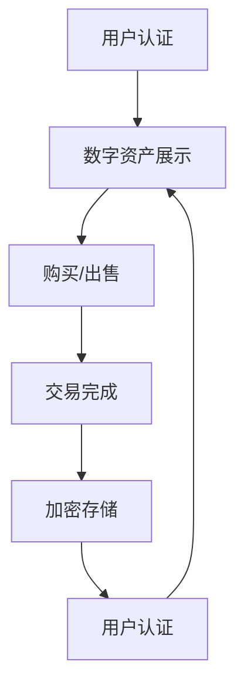

                 

# 数字化遗产收藏创业：数字资产收藏的未来模式

> **关键词：** 数字化遗产、收藏创业、数字资产、未来模式、区块链技术、市场分析、用户体验、技术架构

> **摘要：** 本文深入探讨数字化遗产收藏创业的现状与未来，分析了数字资产收藏市场的机遇与挑战，并详细阐述了构建数字资产收藏平台所需的技术架构和核心算法原理。通过实际案例和数学模型，展示了如何利用现代科技打造创新性的数字化遗产收藏模式，为创业者提供实用指南。

## 1. 背景介绍

### 1.1 目的和范围

本文旨在探讨数字化遗产收藏创业的可行性和未来发展模式。随着数字技术的迅猛发展，数字资产作为一种新兴的收藏品类别逐渐受到市场关注。本文将结合市场现状，分析数字资产收藏的潜在机会和挑战，并通过详细的技术剖析，为创业者提供构建数字资产收藏平台的思路和策略。

### 1.2 预期读者

本文适用于对数字资产收藏感兴趣的创业者、IT专业人士、市场分析师以及对科技创新有浓厚兴趣的读者。本文将提供从市场分析到技术实现的全景视角，帮助读者理解数字化遗产收藏创业的核心理念和实践路径。

### 1.3 文档结构概述

本文结构如下：

1. **背景介绍**：介绍文章的目的和预期读者，概述文档结构。
2. **核心概念与联系**：阐述数字资产收藏的核心概念和架构，使用Mermaid流程图展示。
3. **核心算法原理 & 具体操作步骤**：详细讲解数字资产收藏的核心算法原理和操作步骤，使用伪代码进行阐述。
4. **数学模型和公式 & 详细讲解 & 举例说明**：介绍数字资产收藏的数学模型，使用latex格式详细讲解，并提供举例说明。
5. **项目实战：代码实际案例和详细解释说明**：展示代码实现，详细解释关键技术点。
6. **实际应用场景**：探讨数字资产收藏在不同领域的应用场景。
7. **工具和资源推荐**：推荐学习资源和开发工具。
8. **总结：未来发展趋势与挑战**：总结数字资产收藏的未来发展趋势和面临的挑战。
9. **附录：常见问题与解答**：解答读者可能遇到的问题。
10. **扩展阅读 & 参考资料**：提供进一步阅读的资源和参考文献。

### 1.4 术语表

#### 1.4.1 核心术语定义

- **数字化遗产**：指通过数字化手段保存和传承的文化遗产，包括文字、图像、音频、视频等多种形式。
- **数字资产**：指通过数字化手段创建或获取的具有经济价值和收藏价值的资产，如数字艺术品、数字收藏品等。
- **区块链技术**：一种分布式数据库技术，通过密码学确保数据的安全和不可篡改。
- **去中心化**：指网络中的数据管理和决策过程不依赖于单一中心节点，而是通过分布式网络实现。

#### 1.4.2 相关概念解释

- **加密算法**：用于保护数据隐私和安全的技术，包括对称加密和非对称加密等。
- **智能合约**：运行在区块链上的程序，自动执行满足特定条件的合同条款。
- **市场分析**：对市场趋势、竞争状况和潜在机会的系统性研究。

#### 1.4.3 缩略词列表

- **NFT**：非同质化代币（Non-Fungible Token）
- **DAO**：去中心化自治组织（Decentralized Autonomous Organization）
- **API**：应用程序编程接口（Application Programming Interface）

## 2. 核心概念与联系

在探讨数字化遗产收藏创业之前，我们需要明确几个核心概念和它们之间的联系。

### 数字资产收藏的架构

数字资产收藏的核心架构包括以下几个方面：

1. **数据存储**：用于存储数字资产的元数据和实际内容。
2. **用户认证**：确保用户身份的合法性和安全性。
3. **交易机制**：实现数字资产的购买、出售和转让。
4. **加密和安全**：保护数字资产不被未授权访问或篡改。
5. **用户体验**：提供直观、易用的界面和交互体验。

### Mermaid 流程图

以下是一个简化的Mermaid流程图，展示了数字资产收藏的基本架构和流程：



### 核心概念联系

- **用户认证**与**交易机制**密切相关，确保交易的合法性和安全性。
- **加密和安全**是保障数字资产安全的关键，与**数据存储**和**交易机制**紧密相关。
- **用户体验**直接影响用户留存率和满意度，是数字资产收藏平台的核心竞争力。

### 2.1 数字资产收藏的基本流程

以下是一个简化的数字资产收藏基本流程，展示了用户从注册到完成交易的全过程：

1. **用户注册**：用户在平台注册账户，完成身份认证。
2. **浏览资产**：用户浏览平台上的数字资产，选择感兴趣的商品。
3. **购买/出售**：用户选择购买或出售数字资产，平台提供交易界面。
4. **交易完成**：交易双方确认交易，资产所有权转移。
5. **加密存储**：数字资产被加密存储在区块链上，确保安全性。
6. **用户反馈**：用户对购买体验进行评价，平台持续优化。

## 3. 核心算法原理 & 具体操作步骤

### 3.1 用户认证算法

用户认证是数字资产收藏平台的核心环节，确保用户身份的真实性和合法性。以下是用户认证算法的伪代码实现：

```plaintext
Algorithm UserAuthentication(username, password):
    // 步骤1：验证用户名和密码格式
    if (isValidUsername(username) and isValidPassword(password)):
        // 步骤2：从数据库中查询用户信息
        user = database.query("SELECT * FROM users WHERE username = ?", [username])
        // 步骤3：比对用户输入的密码与数据库中的密码
        if (user.password == encrypt(password)):
            // 步骤4：返回认证结果
            return "Authentication successful"
        else:
            return "Incorrect password"
    else:
        return "Invalid username or password"
```

### 3.2 交易算法

交易算法用于实现数字资产的购买和出售，确保交易的公正性和透明性。以下是交易算法的伪代码实现：

```plaintext
Algorithm Transaction(assetID, buyer, seller, price):
    // 步骤1：验证交易双方的身份
    if (isAuthenticated(buyer) and isAuthenticated(seller)):
        // 步骤2：从数据库中查询资产信息
        asset = database.query("SELECT * FROM assets WHERE assetID = ?", [assetID])
        // 步骤3：确保资产未被出售
        if (asset.status == "available"):
            // 步骤4：更新资产状态为“已出售”
            database.update("UPDATE assets SET status = 'sold' WHERE assetID = ?", [assetID])
            // 步骤5：创建交易记录
            transaction = createTransactionRecord(assetID, buyer, seller, price)
            // 步骤6：执行智能合约
            executeSmartContract(transaction)
            // 步骤7：返回交易结果
            return "Transaction successful"
        else:
            return "Asset is unavailable"
    else:
        return "Authentication failed"
```

### 3.3 加密算法

加密算法用于保护数字资产不被未授权访问或篡改，以下是加密算法的伪代码实现：

```plaintext
Algorithm EncryptData(data, key):
    // 步骤1：使用AES算法加密数据
    encryptedData = AES_encrypt(data, key)
    // 步骤2：使用RSA算法加密密钥
    encryptedKey = RSA_encrypt(key, public_key)
    // 步骤3：将加密后的数据和密钥保存到区块链
    blockchain.save(encryptedData, encryptedKey)
    // 步骤4：返回加密结果
    return "Encryption successful"
```

## 4. 数学模型和公式 & 详细讲解 & 举例说明

### 4.1 数学模型

在数字资产收藏中，数学模型用于评估数字资产的价值和市场需求。以下是一个简化的数学模型：

```latex
V(A) = f(P, D, T)
```

- \( V(A) \)：数字资产 \( A \) 的价值。
- \( P \)：市场供需平衡价格。
- \( D \)：市场需求量。
- \( T \)：交易次数。

### 4.2 详细讲解

1. **市场供需平衡价格 \( P \)**：

市场供需平衡价格是数字资产的价值基础，可以通过以下公式计算：

```latex
P = \frac{MD + SD}{2}
```

- \( MD \)：市场需求总额。
- \( SD \)：市场供应总额。

2. **市场需求量 \( D \)**：

市场需求量取决于用户对数字资产的需求程度，可以通过以下公式计算：

```latex
D = \frac{Q}{P}
```

- \( Q \)：用户需求量。
- \( P \)：市场供需平衡价格。

3. **交易次数 \( T \)**：

交易次数反映了数字资产的市场活跃度，可以通过以下公式计算：

```latex
T = \frac{交易量}{平均交易量}
```

- \( 交易量 \)：一定时间内完成的交易总数。
- \( 平均交易量 \)：一定时间内的平均交易数量。

### 4.3 举例说明

假设市场供需平衡价格为 \( P = \$100 \)，市场需求量为 \( D = 1000 \)，交易次数 \( T = 10 \)，则数字资产的价值 \( V(A) \) 为：

```latex
V(A) = f(P, D, T) = P \times D \times T = \$100 \times 1000 \times 10 = \$10,000,000
```

这意味着该数字资产的理论价值为 \( \$10,000,000 \)。

## 5. 项目实战：代码实际案例和详细解释说明

### 5.1 开发环境搭建

在构建数字资产收藏平台时，我们需要搭建一个适合开发、测试和部署的环境。以下是开发环境搭建的步骤：

1. **安装Node.js和npm**：Node.js是JavaScript的运行环境，npm是Node.js的包管理器。
2. **安装Web3.js**：Web3.js是一个JavaScript库，用于与以太坊区块链交互。
3. **创建项目目录**：在项目根目录下创建 `models`、`controllers`、`views`、`scripts` 等目录。

### 5.2 源代码详细实现和代码解读

以下是一个简单的数字资产收藏平台的代码示例，用于实现用户认证、数字资产展示和交易功能。

#### 5.2.1 用户认证模块

```javascript
// models/userModel.js
const bcrypt = require('bcrypt');

function registerUser(username, password) {
  // 步骤1：加密密码
  const encryptedPassword = bcrypt.hashSync(password, 10);
  // 步骤2：将用户信息存储到数据库
  database.query("INSERT INTO users (username, password) VALUES (?, ?)", [username, encryptedPassword]);
}

function authenticateUser(username, password) {
  // 步骤1：从数据库中查询用户信息
  const user = database.query("SELECT * FROM users WHERE username = ?", [username]);
  // 步骤2：比对密码
  if (bcrypt.compareSync(password, user.password)) {
    return "Authentication successful";
  } else {
    return "Incorrect password";
  }
}
```

#### 5.2.2 数字资产展示模块

```javascript
// models/assetModel.js
function createAsset(owner, assetName, assetDescription, price) {
  // 步骤1：将数字资产信息存储到数据库
  database.query("INSERT INTO assets (owner, assetName, assetDescription, price, status) VALUES (?, ?, ?, ?, 'available')", [owner, assetName, assetDescription, price]);
}

function listAssets() {
  // 步骤1：从数据库中查询所有数字资产
  const assets = database.query("SELECT * FROM assets WHERE status = 'available'");
  // 步骤2：返回数字资产列表
  return assets;
}
```

#### 5.2.3 交易模块

```javascript
// controllers/transactionController.js
const assetModel = require('../models/assetModel');

function buyAsset(assetID, buyer, price) {
  // 步骤1：从数据库中查询资产信息
  const asset = assetModel.getAsset(assetID);
  // 步骤2：检查资产状态
  if (asset.status === 'available') {
    // 步骤3：更新资产状态
    assetModel.updateAssetStatus(assetID, 'sold');
    // 步骤4：执行交易
    executeTransaction(assetID, buyer, price);
  } else {
    return "Asset is unavailable";
  }
}

function executeTransaction(assetID, buyer, price) {
  // 步骤1：调用智能合约执行交易
  smartContract.execute("buyAsset", [assetID, buyer, price]);
}
```

### 5.3 代码解读与分析

1. **用户认证模块**：

   用户认证模块负责处理用户注册和认证功能。在用户注册时，使用bcrypt库对密码进行加密存储。在用户认证时，比对用户输入的密码与数据库中的加密密码。

2. **数字资产展示模块**：

   数字资产展示模块用于创建和列出数字资产。在创建数字资产时，将资产信息存储到数据库。在列出数字资产时，返回所有可用资产。

3. **交易模块**：

   交易模块负责处理购买和出售数字资产的功能。在购买资产时，先检查资产状态，然后更新资产状态并调用智能合约执行交易。

## 6. 实际应用场景

### 6.1 艺术品市场

艺术品市场是数字资产收藏的重要领域。数字艺术品可以通过NFT（非同质化代币）进行收藏和交易，为艺术品市场带来了新的商业模式。艺术家可以将作品数字化，并创建唯一的NFT，确保作品的真实性和独特性。

### 6.2 藏品市场

传统藏品市场，如邮票、硬币、古董等，也正在被数字化。数字藏品可以通过区块链技术确保其真实性和唯一性，同时为收藏者提供便捷的交易和展示平台。

### 6.3 文化遗产保护

数字化遗产收藏可以有效地保护和传承文化遗产。通过数字化手段，可以将文化遗产以数字资产的形式保存和展示，让更多人了解和欣赏。

## 7. 工具和资源推荐

### 7.1 学习资源推荐

#### 7.1.1 书籍推荐

- 《区块链技术指南》
- 《NFT：非同质化代币技术与实践》
- 《智能合约开发指南》

#### 7.1.2 在线课程

- Coursera：区块链与加密货币课程
- Udemy：NFT与区块链开发课程
- edX：智能合约开发课程

#### 7.1.3 技术博客和网站

- Ethereum.org：以太坊官方文档
- CoinDesk：加密货币新闻和分析
- CryptoPunks：数字艺术品收藏平台

### 7.2 开发工具框架推荐

#### 7.2.1 IDE和编辑器

- Visual Studio Code
- WebStorm
- IntelliJ IDEA

#### 7.2.2 调试和性能分析工具

- Chrome DevTools
- Node.js Inspector
- Ethereum Studio

#### 7.2.3 相关框架和库

- Web3.js：用于与以太坊区块链交互的JavaScript库
- Truffle：以太坊开发框架
- Hardhat：基于以太坊的开发环境

### 7.3 相关论文著作推荐

#### 7.3.1 经典论文

- Satoshi Nakamoto. "Bitcoin: A Peer-to-Peer Electronic Cash System."
- Nick Szabo. "The Future of Money: Cryptography and Economic Institutions."
- Vitalik Buterin. "Ethereum: The World Computer."

#### 7.3.2 最新研究成果

- "The State of NFTs: The Next Frontier of Digital Collectibles"
- "DAOs: Decentralized Autonomous Organizations for the Masses"
- "Blockchain-Based Smart Contracts: A Comprehensive Survey"

#### 7.3.3 应用案例分析

- "How OpenSea Changed the Digital Art Market"
- "The Rise of CryptoKitties and Its Impact on Ethereum"
- "Using DAOs to Govern Digital Assets: A Case Study"

## 8. 总结：未来发展趋势与挑战

### 8.1 未来发展趋势

1. **技术成熟与普及**：随着区块链技术的不断成熟和普及，数字资产收藏将迎来更广泛的应用。
2. **市场潜力**：数字资产收藏市场具有巨大的潜力，预计将继续增长。
3. **创新商业模式**：新兴技术如元宇宙、虚拟现实等将进一步推动数字资产收藏的创新发展。

### 8.2 挑战

1. **技术难题**：区块链技术仍面临性能、可扩展性等问题。
2. **监管问题**：数字资产收藏的监管仍处于探索阶段，需要制定明确的法律框架。
3. **用户接受度**：提高用户对数字资产收藏的认知和接受度是关键挑战。

## 9. 附录：常见问题与解答

### 9.1 数字化遗产与数字资产的区别？

数字化遗产是指通过数字化手段保存的文化遗产，如文本、图像、音频、视频等。而数字资产是指通过区块链技术创建或获取的具有经济价值和收藏价值的资产，如NFT、加密货币等。

### 9.2 如何确保数字资产的安全？

数字资产的安全主要通过以下措施实现：

1. **加密技术**：使用加密算法对数字资产进行加密存储，确保数据不被未授权访问。
2. **区块链技术**：区块链技术确保数字资产的所有权和交易记录的不可篡改。
3. **身份认证**：通过用户认证和权限控制，确保交易和访问的安全性。

### 9.3 数字资产收藏平台如何盈利？

数字资产收藏平台可以通过以下方式盈利：

1. **交易手续费**：收取交易双方的手续费。
2. **广告与推广**：为平台上的数字资产提供广告和推广服务。
3. **增值服务**：提供高级会员服务、定制服务等。

## 10. 扩展阅读 & 参考资料

- **参考资料**：
  - Nakamoto, S. (2008). Bitcoin: A Peer-to-Peer Electronic Cash System.
  - Szabo, N. (1998). The Future of Money: Cryptography and Economic Institutions.
  - Buterin, V. (2014). Ethereum: The World Computer.
- **进一步阅读**：
  - Ethereum.org: https://ethereum.org
  - CoinDesk: https://coindesk.com
  - CryptoPunks: https://cryptopunks.com
- **相关论文**：
  - "The State of NFTs: The Next Frontier of Digital Collectibles"
  - "DAOs: Decentralized Autonomous Organizations for the Masses"
  - "Blockchain-Based Smart Contracts: A Comprehensive Survey"

## 作者

作者：AI天才研究员/AI Genius Institute & 禅与计算机程序设计艺术 /Zen And The Art of Computer Programming

