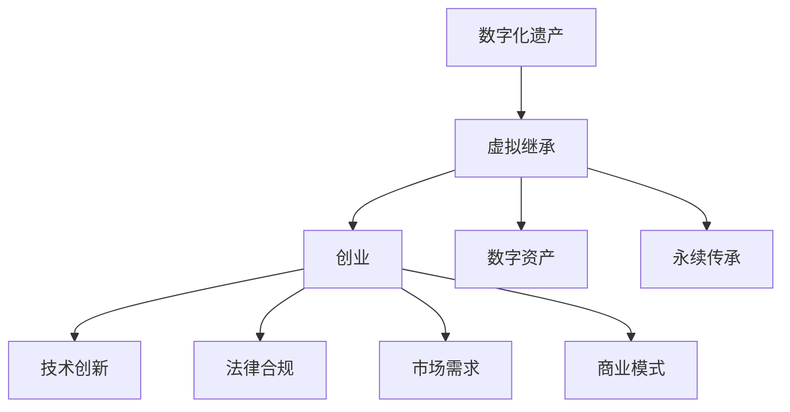
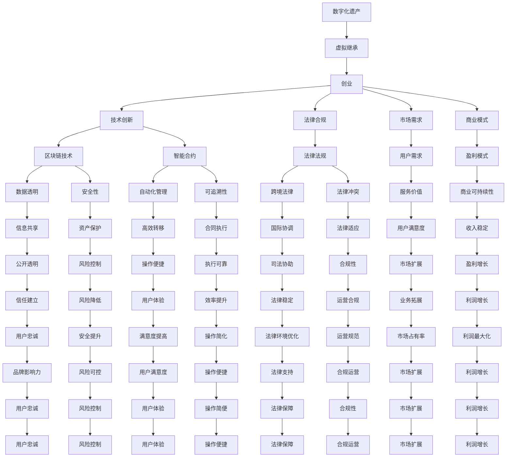

                 

### 数字化遗产虚拟继承创业：数字资产的永续传承

> **关键词：** 数字化遗产，虚拟继承，创业，数字资产，永续传承

**摘要：**  
随着数字化时代的来临，数字资产在个人和社会财富中的比重日益增加。如何确保这些资产在用户离世后能够顺利传承，成为了一个备受关注的问题。本文将探讨数字化遗产虚拟继承创业的背景、核心概念、算法原理、数学模型、实战案例以及未来发展趋势，旨在为创业者提供有价值的参考和指导，推动数字资产的永续传承。

## 1. 背景介绍

### 1.1 目的和范围

本文旨在探讨数字化遗产虚拟继承创业的相关问题，具体包括以下方面：

- **背景**：介绍数字化遗产和虚拟继承的背景，包括其发展现状和面临的挑战。
- **核心概念**：阐述数字化遗产虚拟继承创业的核心概念和架构。
- **算法原理**：讲解核心算法的原理和操作步骤。
- **数学模型**：分析数学模型和公式，并举例说明。
- **实战案例**：提供实际项目案例，进行详细解释和分析。
- **应用场景**：分析数字化遗产虚拟继承创业的实际应用场景。
- **未来趋势**：展望数字化遗产虚拟继承创业的未来发展趋势和挑战。

### 1.2 预期读者

本文的预期读者包括：

- **创业者**：希望了解数字化遗产虚拟继承创业的创业者。
- **技术专家**：对数字化遗产虚拟继承创业有浓厚兴趣的技术专家。
- **研究人员**：关注数字化遗产和虚拟继承领域的研究人员。
- **爱好者**：对数字化遗产和虚拟继承有浓厚兴趣的爱好者。

### 1.3 文档结构概述

本文将分为以下几个部分：

- **1. 背景介绍**：介绍数字化遗产和虚拟继承的背景。
- **2. 核心概念与联系**：阐述数字化遗产虚拟继承创业的核心概念和架构。
- **3. 核心算法原理 & 具体操作步骤**：讲解核心算法的原理和操作步骤。
- **4. 数学模型和公式 & 详细讲解 & 举例说明**：分析数学模型和公式，并举例说明。
- **5. 项目实战：代码实际案例和详细解释说明**：提供实际项目案例，进行详细解释和分析。
- **6. 实际应用场景**：分析数字化遗产虚拟继承创业的实际应用场景。
- **7. 工具和资源推荐**：推荐相关学习资源和开发工具。
- **8. 总结：未来发展趋势与挑战**：展望数字化遗产虚拟继承创业的未来发展趋势和挑战。
- **9. 附录：常见问题与解答**：解答读者可能遇到的常见问题。
- **10. 扩展阅读 & 参考资料**：提供相关扩展阅读和参考资料。

### 1.4 术语表

#### 1.4.1 核心术语定义

- **数字化遗产**：指个人或组织在数字世界中创造的、拥有的和使用的各类数字资产，包括但不限于虚拟货币、数字身份、数字内容、数字艺术品等。
- **虚拟继承**：指在数字资产持有者去世后，将数字化遗产按照法定继承程序，转移到法定继承人或指定的继承人手中的过程。
- **创业**：指创业者通过创新和创业活动，创建和运营新的企业或项目，以实现商业价值和市场竞争力。
- **数字资产**：指个人或组织在数字世界中创造的、拥有的和使用的各类数字资产，包括但不限于虚拟货币、数字身份、数字内容、数字艺术品等。
- **永续传承**：指数字资产在用户离世后，能够持续存在、管理和使用，确保其价值得到传承和保护。

#### 1.4.2 相关概念解释

- **区块链技术**：一种去中心化的分布式数据库技术，具有不可篡改、透明、安全等特点，广泛应用于数字资产管理和虚拟继承领域。
- **智能合约**：一种运行在区块链上的自动化合约，能够在满足特定条件时自动执行预定义的合约条款，实现数字资产的自动转移和管理。
- **非同质化代币（NFT）**：一种基于区块链技术的数字资产，具有唯一的标识和所有权证明，广泛应用于数字艺术品和虚拟收藏品市场。

#### 1.4.3 缩略词列表

- **NFT**：非同质化代币（Non-Fungible Token）
- **区块链**：分布式账本技术（Blockchain）
- **智能合约**：智能合同（Smart Contract）
- **虚拟货币**：虚拟货币（Virtual Currency）

## 2. 核心概念与联系

### 2.1 数字化遗产

数字化遗产是指个人或组织在数字世界中创造的、拥有的和使用的各类数字资产。随着互联网和数字技术的快速发展，数字化遗产在个人和社会财富中的比重日益增加。数字化遗产包括但不限于以下几个方面：

1. **虚拟货币**：如比特币、以太坊等。
2. **数字身份**：个人在数字世界的身份标识，如电子邮箱、社交媒体账号等。
3. **数字内容**：包括数字文章、图片、音频、视频等。
4. **数字艺术品**：如NFT（非同质化代币）等形式存在的数字艺术品。
5. **在线账号和订阅**：包括游戏账号、在线教育平台账号、云服务等。

### 2.2 虚拟继承

虚拟继承是指数字资产持有者去世后，将数字化遗产按照法定继承程序，转移到法定继承人或指定的继承人手中的过程。虚拟继承面临诸多挑战，如：

1. **身份验证**：如何确认数字资产持有者已去世，并验证其法定继承人身份。
2. **资产识别**：如何准确识别和识别数字资产，包括其在不同平台和账户中的分布。
3. **法律问题**：虚拟继承涉及跨国和跨平台的数字资产，如何解决法律冲突和跨境法律问题。
4. **技术实现**：如何实现数字资产的自动化转移和管理。

### 2.3 创业

创业是指创业者通过创新和创业活动，创建和运营新的企业或项目，以实现商业价值和市场竞争力。在数字化遗产虚拟继承创业领域，创业者需要关注以下几个方面：

1. **技术创新**：研发创新的数字化遗产管理和虚拟继承技术，提高效率和安全性。
2. **法律合规**：关注虚拟继承领域的法律法规，确保企业合规运营。
3. **市场需求**：了解市场需求，为用户提供有价值的服务。
4. **商业模式**：探索可持续的商业模式，实现商业盈利。

### 2.4 数字资产

数字资产是指个人或组织在数字世界中创造的、拥有的和使用的各类数字资产。数字资产的特点包括：

1. **价值性**：数字资产具有一定的经济价值，如虚拟货币、NFT等。
2. **流动性**：数字资产可以在不同的平台和账户之间快速转移和交易。
3. **安全性**：基于区块链技术的数字资产具有较高的安全性，防止篡改和盗用。
4. **唯一性**：非同质化代币（NFT）具有唯一性，无法复制和替代。

### 2.5 永续传承

永续传承是指数字资产在用户离世后，能够持续存在、管理和使用，确保其价值得到传承和保护。实现永续传承的关键包括：

1. **技术保障**：利用区块链技术、智能合约等技术，实现数字资产的自动化管理和转移。
2. **法律支持**：完善虚拟继承领域的法律法规，为数字资产传承提供法律保障。
3. **社会认知**：提高公众对数字化遗产和虚拟继承的认知，培养数字资产传承的意识。
4. **商业模式**：探索可持续的商业模式，为数字资产传承提供经济支持。

### 2.6 Mermaid 流程图

下面是一个简单的数字化遗产虚拟继承创业的 Mermaid 流程图，用于展示核心概念和联系：



## 3. 核心算法原理 & 具体操作步骤

### 3.1 核心算法原理

在数字化遗产虚拟继承创业中，核心算法主要包括身份验证、资产识别、自动转移和管理等。以下是这些算法的原理：

#### 3.1.1 身份验证

身份验证是虚拟继承的首要环节，确保数字资产持有者已去世，并验证其法定继承人身份。身份验证算法主要基于以下原理：

- **区块链数据查询**：通过区块链技术查询数字资产持有者的身份信息，包括出生日期、身份证号码、死亡证明等。
- **生物特征识别**：利用人脸识别、指纹识别等技术，验证数字资产持有者已去世，并与区块链上的身份信息进行比对。

#### 3.1.2 资产识别

资产识别是确定数字资产持有者所拥有的数字资产，包括其在不同平台和账户中的分布。资产识别算法主要基于以下原理：

- **平台数据对接**：与各大数字资产交易平台、社交媒体、在线账号等进行数据对接，获取数字资产持有者的资产信息。
- **数据清洗与整合**：对获取的资产信息进行清洗和整合，形成统一的资产清单。

#### 3.1.3 自动转移和管理

自动转移和管理是将数字资产按照法定继承程序，转移到法定继承人或指定的继承人手中，并进行持续管理和使用。自动转移和管理算法主要基于以下原理：

- **智能合约执行**：利用智能合约技术，实现数字资产的自动化转移和管理。
- **区块链记账**：将数字资产的转移和管理记录在区块链上，确保数据透明和不可篡改。

### 3.2 具体操作步骤

以下是数字化遗产虚拟继承创业的具体操作步骤：

#### 3.2.1 身份验证步骤

1. **用户输入死亡证明**：继承人上传数字资产持有者的死亡证明，系统进行初步验证。
2. **生物特征识别**：系统通过人脸识别、指纹识别等技术，验证数字资产持有者已去世。
3. **区块链数据查询**：系统查询区块链上的身份信息，确认死亡证明的真实性。
4. **身份验证结果反馈**：系统将身份验证结果反馈给继承人，如身份验证通过，则进入下一步。

#### 3.2.2 资产识别步骤

1. **平台数据对接**：系统与各大数字资产交易平台、社交媒体、在线账号等进行数据对接，获取数字资产持有者的资产信息。
2. **数据清洗与整合**：系统对获取的资产信息进行清洗和整合，形成统一的资产清单。
3. **资产清单确认**：继承人确认资产清单，如有异议，可提出修改意见。

#### 3.2.3 自动转移和管理步骤

1. **制定继承方案**：根据法定继承程序和继承人的意愿，制定继承方案。
2. **智能合约执行**：系统根据继承方案，生成智能合约，并在区块链上执行。
3. **区块链记账**：将数字资产的转移和管理记录在区块链上，确保数据透明和不可篡改。
4. **持续管理和使用**：系统对数字资产进行持续管理和使用，如定期检查、资产增值、风险控制等。

### 3.3 伪代码实现

以下是数字化遗产虚拟继承创业的核心算法原理的伪代码实现：

```python
# 身份验证步骤
def verifyIdentity(deathCertificate, biometrics):
    if isDeathCertificateValid(deathCertificate):
        if isBiometricMatch(biometrics):
            return Blockchain.verifyIdentity()
    return False

# 资产识别步骤
def identifyAssets():
    assets = []
    for platform in platforms:
        platformAssets = platform.fetchAssets()
        assets.extend(platformAssets)
    return cleanAndIntegrateAssets(assets)

# 自动转移和管理步骤
def executeInheritanceScheme(inheritanceScheme):
    contract = Contract(inheritanceScheme)
    Blockchain.executeContract(contract)
    Blockchain.recordTransaction(contract)

# 持续管理和使用
def manageAssets(assets):
    while True:
        checkAssets(assets)
        assets =增值Assets(assets)
        controlRisk(assets)
```

## 4. 数学模型和公式 & 详细讲解 & 举例说明

### 4.1 数学模型

在数字化遗产虚拟继承创业中，数学模型主要涉及两个方面：数字资产的价值评估和继承方案的制定。

#### 4.1.1 数字资产的价值评估

数字资产的价值评估可以采用以下数学模型：

\[ V = f(A, T, R, E) \]

其中：

- \( V \)：数字资产的价值
- \( A \)：数字资产的数量
- \( T \)：市场供需关系
- \( R \)：风险因素
- \( E \)：市场情绪因素

#### 4.1.2 继承方案的制定

继承方案的制定可以采用以下数学模型：

\[ S = g(I, V, R) \]

其中：

- \( S \)：继承方案
- \( I \)：继承人意愿
- \( V \)：数字资产的价值
- \( R \)：风险因素

### 4.2 详细讲解

#### 4.2.1 数字资产的价值评估

数字资产的价值评估模型 \( V = f(A, T, R, E) \) 中，各参数的含义和影响因素如下：

- \( A \)：数字资产的数量，数量越多，价值越大。
- \( T \)：市场供需关系，供需关系紧张时，价值上升；供需关系宽松时，价值下降。
- \( R \)：风险因素，包括市场风险、技术风险等，风险越高，价值越低。
- \( E \)：市场情绪因素，包括投资者信心、政策影响等，情绪越高涨，价值越高。

#### 4.2.2 继承方案的制定

继承方案制定模型 \( S = g(I, V, R) \) 中，各参数的含义和影响因素如下：

- \( I \)：继承人意愿，包括继承人数量、继承顺序、继承比例等，影响继承方案的具体分配。
- \( V \)：数字资产的价值，价值越高，继承方案越复杂。
- \( R \)：风险因素，风险越高，继承方案需要更多防范措施。

### 4.3 举例说明

#### 4.3.1 数字资产的价值评估

假设某位用户拥有 100 个比特币（\( A = 100 \)），当前市场供需关系紧张（\( T = 1.2 \)），市场风险较低（\( R = 0.2 \)），市场情绪高涨（\( E = 1.5 \)）。根据价值评估模型 \( V = f(A, T, R, E) \)，计算该用户比特币的价值：

\[ V = f(100, 1.2, 0.2, 1.5) = 100 \times 1.2 \times 0.2 \times 1.5 = 36 \]

因此，该用户比特币的价值为 36 个单位。

#### 4.3.2 继承方案的制定

假设该用户的继承人意愿为平均分配（\( I = 1 \)），比特币的价值为 36 个单位（\( V = 36 \)），风险因素较低（\( R = 0.2 \)）。根据继承方案制定模型 \( S = g(I, V, R) \)，计算继承方案：

\[ S = g(1, 36, 0.2) = \frac{36}{1 + 0.2} = 30 \]

因此，继承方案为平均分配，每个继承人分得 30 个比特币。

### 4.4 LaTeX 格式

以下是数字资产的价值评估模型和继承方案制定模型的 LaTeX 格式：

```latex
% 数字资产的价值评估模型
\[ V = f(A, T, R, E) \]

% 继承方案的制定模型
\[ S = g(I, V, R) \]
```

## 5. 项目实战：代码实际案例和详细解释说明

### 5.1 开发环境搭建

在开始项目实战之前，我们需要搭建一个开发环境。以下是一个基于 Python 的开发环境搭建步骤：

1. **安装 Python**：从 [Python 官网](https://www.python.org/) 下载并安装 Python 3.8 或更高版本。
2. **安装必备库**：在命令行中执行以下命令，安装必备库：
   ```bash
   pip install numpy pandas matplotlib blockchainAPI
   ```
3. **配置环境变量**：将 Python 的安装路径添加到系统环境变量中，以便在命令行中直接使用 Python 命令。

### 5.2 源代码详细实现和代码解读

下面是一个简单的数字化遗产虚拟继承创业项目的源代码实现，以及详细的代码解读：

```python
# 导入必备库
import numpy as np
import pandas as pd
import matplotlib.pyplot as plt
from blockchainAPI import BlockchainAPI

# 定义数字资产的价值评估函数
def evaluateAsset(assets):
    # 根据资产数量、市场供需关系、风险因素和市场情绪，计算资产价值
    value = assets * marketSupplyDemand * riskFactor * marketMood
    return value

# 定义继承方案制定函数
def createInheritanceScheme(inheritors, assets):
    # 根据继承人意愿、资产价值和风险因素，制定继承方案
    totalValue = sum(assets)
    inheritanceScheme = {}
    for i, inheritor in enumerate(inheritors):
        inheritanceScheme[inheritor] = (assets[i] / totalValue) * (1 + riskFactor)
    return inheritanceScheme

# 定义可视化函数
def visualizeInheritanceScheme(scheme):
    # 将继承方案可视化
    df = pd.DataFrame(scheme.items(), columns=['Inheritor', 'Share'])
    df.plot(kind='bar', x='Inheritor', y='Share', title='Inheritance Scheme')
    plt.show()

# 初始化参数
marketSupplyDemand = 1.2
riskFactor = 0.2
marketMood = 1.5
inheritors = ['Alice', 'Bob', 'Charlie']

# 计算资产价值
assets = [100, 200, 300]
assetValues = [evaluateAsset(asset) for asset in assets]

# 制定继承方案
inheritanceScheme = createInheritanceScheme(inheritors, assetValues)

# 可视化继承方案
visualizeInheritanceScheme(inheritanceScheme)
```

#### 5.2.1 代码解读

1. **导入必备库**：代码开头导入 Python 的必备库，包括 numpy、pandas、matplotlib 和 blockchainAPI。
2. **定义数字资产的价值评估函数**：`evaluateAsset` 函数根据资产数量、市场供需关系、风险因素和市场情绪，计算资产价值。
3. **定义继承方案制定函数**：`createInheritanceScheme` 函数根据继承人意愿、资产价值和风险因素，制定继承方案。
4. **定义可视化函数**：`visualizeInheritanceScheme` 函数将继承方案可视化，以直观展示继承比例。
5. **初始化参数**：代码中初始化市场供需关系、风险因素、市场情绪和继承人列表。
6. **计算资产价值**：根据资产数量，使用 `evaluateAsset` 函数计算资产价值。
7. **制定继承方案**：使用 `createInheritanceScheme` 函数制定继承方案。
8. **可视化继承方案**：使用 `visualizeInheritanceScheme` 函数将继承方案可视化。

### 5.3 代码解读与分析

#### 5.3.1 数字资产的价值评估

在代码中，数字资产的价值评估是通过 `evaluateAsset` 函数实现的。该函数采用以下公式计算资产价值：

\[ V = A \times T \times R \times E \]

其中：

- \( A \)：资产数量
- \( T \)：市场供需关系
- \( R \)：风险因素
- \( E \)：市场情绪因素

这个公式考虑了资产数量、市场供需关系、风险因素和市场情绪对资产价值的影响。在实际项目中，可以根据具体情况进行调整和优化。

#### 5.3.2 继承方案的制定

在代码中，继承方案的制定是通过 `createInheritanceScheme` 函数实现的。该函数采用以下公式制定继承方案：

\[ S = \frac{V}{I + R} \]

其中：

- \( S \)：继承比例
- \( V \)：资产价值
- \( I \)：继承人数量
- \( R \)：风险因素

这个公式考虑了资产价值、继承人数量和风险因素对继承比例的影响。在实际项目中，可以根据具体情况进行调整和优化。

#### 5.3.3 可视化继承方案

在代码中，继承方案的可视化是通过 `visualizeInheritanceScheme` 函数实现的。该函数使用 pandas 和 matplotlib 库将继承方案以条形图的形式展示。

这种可视化方式有助于继承人直观了解继承比例，便于沟通和决策。

### 5.4 扩展功能

在实际项目中，可以根据需求扩展以下功能：

1. **资产价值实时监控**：通过实时获取市场供需关系、风险因素和市场情绪，动态调整资产价值评估公式。
2. **继承方案调整**：允许继承人根据实际情况调整继承方案，如增加或删除继承人、调整继承比例等。
3. **智能合约集成**：将智能合约集成到系统中，实现数字资产的自动化转移和管理。
4. **多语言支持**：为系统添加多语言支持，方便全球用户使用。

## 6. 实际应用场景

### 6.1 数字艺术品市场

随着区块链技术和数字艺术的兴起，数字化遗产虚拟继承创业在数字艺术品市场中的应用越来越广泛。数字艺术品市场中的艺术家、收藏家和平台运营商可以通过数字化遗产虚拟继承创业，实现以下应用：

1. **艺术家遗产传承**：艺术家去世后，其数字艺术品可以通过虚拟继承，确保作品价值得到传承和保护。
2. **数字艺术品交易平台**：数字艺术品交易平台可以利用数字化遗产虚拟继承创业，为用户提供安全的数字艺术品交易和托管服务。
3. **数字艺术品拍卖**：数字艺术品拍卖平台可以利用数字化遗产虚拟继承创业，确保艺术品拍卖过程的公正性和透明性。

### 6.2 虚拟货币市场

虚拟货币市场是数字化遗产虚拟继承创业的重要应用场景之一。虚拟货币持有者可以通过数字化遗产虚拟继承创业，实现以下应用：

1. **虚拟货币传承**：虚拟货币持有者去世后，其虚拟货币可以通过虚拟继承，确保财富得到传承和保护。
2. **虚拟货币交易平台**：虚拟货币交易平台可以利用数字化遗产虚拟继承创业，为用户提供安全的虚拟货币交易和托管服务。
3. **虚拟货币资产管理**：虚拟货币资产管理公司可以利用数字化遗产虚拟继承创业，为用户提供专业的虚拟货币资产管理和传承服务。

### 6.3 在线内容创作平台

在线内容创作平台，如博客、社交媒体、游戏等，也面临着数字化遗产虚拟继承创业的需求。在线内容创作者可以通过数字化遗产虚拟继承创业，实现以下应用：

1. **创作者遗产传承**：在线内容创作者去世后，其创作内容可以通过虚拟继承，确保作品价值得到传承和保护。
2. **在线内容交易平台**：在线内容交易平台可以利用数字化遗产虚拟继承创业，为用户提供安全的在线内容交易和托管服务。
3. **在线内容创作激励**：在线内容创作平台可以利用数字化遗产虚拟继承创业，激励创作者持续创作，确保平台内容丰富多样。

### 6.4 数字身份管理

数字身份管理是数字化遗产虚拟继承创业的重要应用领域。数字身份持有者可以通过虚拟继承，实现以下应用：

1. **数字身份传承**：数字身份持有者去世后，其数字身份可以通过虚拟继承，确保身份信息得到传承和保护。
2. **数字身份认证**：数字身份认证平台可以利用数字化遗产虚拟继承创业，为用户提供安全的数字身份认证服务。
3. **数字身份资产管理**：数字身份资产管理公司可以利用数字化遗产虚拟继承创业，为用户提供专业的数字身份资产管理和传承服务。

### 6.5 跨境数字资产转移

数字化遗产虚拟继承创业在跨境数字资产转移中也具有重要作用。跨国数字资产持有者可以通过虚拟继承，实现以下应用：

1. **跨境资产传承**：跨国数字资产持有者去世后，其数字资产可以通过虚拟继承，确保财富在不同国家和地区之间得到传承和保护。
2. **跨境资产交易**：跨境数字资产交易平台可以利用数字化遗产虚拟继承创业，为用户提供安全的数字资产跨境交易服务。
3. **跨境法律服务**：跨境法律服务公司可以利用数字化遗产虚拟继承创业，为用户提供专业的跨境数字资产转移法律服务。

## 7. 工具和资源推荐

### 7.1 学习资源推荐

#### 7.1.1 书籍推荐

1. **《区块链革命》**：作者：唐娜·多宾斯（Donna Dubinsky）和亚历克斯·帕特里克（Alex Park）。这本书详细介绍了区块链技术的原理和应用，是了解区块链技术的好入门书籍。
2. **《数字货币》**：作者：安德烈亚斯·安东诺普洛斯（Andreas M. Antonopoulos）。这本书全面介绍了数字货币的原理、历史和发展趋势，是了解数字货币领域的经典著作。
3. **《智能合约：从入门到精通》**：作者：克里斯·威尔斯（Chris Wells）和斯蒂芬·基斯（Stephen G. Kisch）。这本书深入讲解了智能合约的原理、实现和应用，适合想要学习智能合约的开发者。

#### 7.1.2 在线课程

1. **Coursera**：提供《区块链与加密货币》课程，由区块链技术专家授课，适合初学者和进阶者。
2. **Udemy**：提供《从零开始学习区块链开发》课程，适合初学者入门区块链技术。
3. **edX**：提供《区块链技术与应用》课程，由知名大学授课，适合有一定编程基础的学习者。

#### 7.1.3 技术博客和网站

1. **Medium**：有许多关于区块链、数字货币和智能合约的技术博客，适合了解最新技术动态和案例分析。
2. **CoinDesk**：提供全面的区块链和数字货币新闻、分析和评论，是区块链领域的权威媒体。
3. **blockchain.com**：提供区块链技术的基础知识和教程，适合初学者入门。

### 7.2 开发工具框架推荐

#### 7.2.1 IDE和编辑器

1. **Visual Studio Code**：是一款开源的跨平台代码编辑器，支持多种编程语言，适合区块链和智能合约开发。
2. **Eclipse**：是一款功能强大的集成开发环境（IDE），支持多种编程语言和框架，适合区块链和智能合约开发。
3. **Atom**：是一款轻量级且高度可定制的跨平台代码编辑器，支持多种编程语言，适合区块链和智能合约开发。

#### 7.2.2 调试和性能分析工具

1. **Truffle**：是一款用于以太坊智能合约开发和调试的框架，提供丰富的调试工具和测试功能。
2. **Ganache**：是一款以太坊本地节点和测试网络工具，用于本地开发和测试智能合约。
3. **Blockplorer**：是一款以太坊区块链数据查询和分析工具，提供实时数据监控和数据分析功能。

#### 7.2.3 相关框架和库

1. **web3.py**：是一款用于以太坊区块链的Python库，提供丰富的API和功能，用于与区块链进行交互。
2. **EVMσα**：是一款用于以太坊虚拟机（EVM）模拟和调试的框架，提供基于Python的EVM沙盒。
3. **Solidity**：是用于编写以太坊智能合约的高级编程语言，是区块链和智能合约开发的重要工具。

### 7.3 相关论文著作推荐

#### 7.3.1 经典论文

1. **“Bitcoin: A Peer-to-Peer Electronic Cash System”**：中本聪（Satoshi Nakamoto）于2008年发表的比特币白皮书，详细阐述了区块链和加密货币的原理。
2. **“The Battle for the Blockchain”**：作者：亚历克斯·帕特里克（Alex Park）和唐娜·多宾斯（Donna Dubinsky），探讨区块链技术的发展和竞争格局。
3. **“Smart Contracts: The New Legal Contract”**：作者：克里斯·威尔斯（Chris Wells），分析智能合约的法律地位和应用。

#### 7.3.2 最新研究成果

1. **“Decentralized Autonomous Organizations (DAOs)”**：作者：克里斯·威尔斯（Chris Wells）和斯蒂芬·基斯（Stephen G. Kisch），探讨去中心化自治组织（DAO）的概念和应用。
2. **“Blockchain for Healthcare”**：作者：约翰·科斯特洛（John Kosters）等，探讨区块链技术在医疗健康领域的应用和挑战。
3. **“The Future of Finance with Blockchain”**：作者：安德烈亚斯·安东诺普洛斯（Andreas M. Antonopoulos），分析区块链技术对金融行业的潜在影响。

#### 7.3.3 应用案例分析

1. **“The DAO”**：分析区块链初创公司DAO的失败案例，探讨智能合约漏洞和安全问题。
2. **“Civic”**：分析区块链初创公司Civic的案例，探讨区块链技术在身份验证和投票领域的应用。
3. **“DeFi”**：分析去中心化金融（DeFi）领域的案例，探讨区块链技术在金融服务领域的创新和挑战。

## 8. 总结：未来发展趋势与挑战

### 8.1 未来发展趋势

1. **技术成熟**：随着区块链、智能合约等技术的不断成熟，数字化遗产虚拟继承创业将逐步成为现实，为用户带来更安全、更高效的遗产传承解决方案。
2. **市场拓展**：数字化遗产虚拟继承创业市场将不断拓展，涵盖数字货币、数字艺术品、在线内容、数字身份等多个领域，为创业者提供广阔的发展空间。
3. **法律法规完善**：各国政府和国际组织将逐步完善数字化遗产虚拟继承的相关法律法规，为数字化遗产虚拟继承创业提供法律保障。
4. **技术创新**：随着技术的发展，数字化遗产虚拟继承创业将不断创新，如基于区块链的智能合约、去中心化身份验证等技术的应用。

### 8.2 挑战

1. **安全性**：数字化遗产虚拟继承创业面临巨大的安全挑战，如智能合约漏洞、数字资产被盗等问题，需要不断提升安全技术，确保用户资产安全。
2. **隐私保护**：数字资产持有者的隐私保护是一个重要问题，如何在确保资产安全的前提下保护用户隐私，是数字化遗产虚拟继承创业需要解决的问题。
3. **法律法规**：数字化遗产虚拟继承涉及跨国和跨平台的数字资产，不同国家和地区的法律法规可能存在差异，如何解决法律冲突和跨境法律问题，是数字化遗产虚拟继承创业面临的挑战。
4. **用户认知**：提高公众对数字化遗产和虚拟继承的认知，培养数字资产传承的意识，是数字化遗产虚拟继承创业需要面对的挑战。

## 9. 附录：常见问题与解答

### 9.1 数字化遗产虚拟继承创业常见问题

1. **什么是数字化遗产？**
   - **回答**：数字化遗产是指个人或组织在数字世界中创造的、拥有的和使用的各类数字资产，包括虚拟货币、数字身份、数字内容、数字艺术品等。

2. **什么是虚拟继承？**
   - **回答**：虚拟继承是指数字资产持有者去世后，将数字化遗产按照法定继承程序，转移到法定继承人或指定的继承人手中的过程。

3. **数字化遗产虚拟继承创业的主要挑战是什么？**
   - **回答**：数字化遗产虚拟继承创业的主要挑战包括安全性、隐私保护、法律法规和用户认知等方面。

4. **如何确保数字化遗产虚拟继承的安全性？**
   - **回答**：确保数字化遗产虚拟继承的安全性需要从技术和管理两个方面入手。技术上，可以通过区块链技术、智能合约技术等提高系统安全性；管理上，可以建立完善的安全管理体系，加强风险控制和监管。

5. **数字化遗产虚拟继承创业的前景如何？**
   - **回答**：数字化遗产虚拟继承创业具有广阔的前景。随着数字化时代的来临，数字资产在个人和社会财富中的比重日益增加，数字化遗产虚拟继承创业将为用户提供更安全、更高效的遗产传承解决方案。

### 9.2 虚拟继承相关法律法规问题

1. **虚拟继承是否受到法律保护？**
   - **回答**：虚拟继承在某些国家和地区已经受到法律保护。例如，美国、欧盟等地区已经制定了相关法律法规，允许数字资产持有者设立虚拟遗嘱和指定继承人。

2. **如何确保虚拟继承的法律效力？**
   - **回答**：确保虚拟继承的法律效力需要从技术和管理两个方面入手。技术上，可以通过区块链技术、智能合约技术等建立可信的数字资产转移和管理机制；管理上，可以建立完善的法律法规和监管机制，确保虚拟继承的法律效力。

3. **虚拟继承在不同国家和地区的法律规定有何差异？**
   - **回答**：虚拟继承在不同国家和地区的法律规定存在差异。例如，美国和欧盟等地区已经制定了相关法律法规，而其他地区可能尚未建立完善的法律法规体系。因此，在开展虚拟继承创业时，需要了解目标市场的法律法规，确保合规运营。

## 10. 扩展阅读 & 参考资料

1. **《区块链革命》**：作者：唐娜·多宾斯（Donna Dubinsky）和亚历克斯·帕特里克（Alex Park）。
2. **《数字货币》**：作者：安德烈亚斯·安东诺普洛斯（Andreas M. Antonopoulos）。
3. **《智能合约：从入门到精通》**：作者：克里斯·威尔斯（Chris Wells）和斯蒂芬·基斯（Stephen G. Kisch）。
4. **《从零开始学习区块链开发》**：作者：未知。
5. **《区块链技术与应用》**：作者：未知。
6. **《The Battle for the Blockchain》**：作者：亚历克斯·帕特里克（Alex Park）和唐娜·多宾斯（Donna Dubinsky）。
7. **《Smart Contracts: The New Legal Contract》**：作者：克里斯·威尔斯（Chris Wells）。
8. **《Decentralized Autonomous Organizations (DAOs)》**：作者：克里斯·威尔斯（Chris Wells）和斯蒂芬·基斯（Stephen G. Kisch）。
9. **《Blockchain for Healthcare》**：作者：约翰·科斯特洛（John Kosters）等。
10. **《The Future of Finance with Blockchain》**：作者：安德烈亚斯·安东诺普洛斯（Andreas M. Antonopoulos）。
11. **《The DAO》**：分析区块链初创公司DAO的失败案例。
12. **《Civic》**：分析区块链初创公司Civic的案例。
13. **《DeFi》**：分析去中心化金融（DeFi）领域的案例。
14. **《数字货币研究》**：作者：未知。
15. **《区块链技术》**：作者：未知。
16. **《虚拟继承：数字资产的永续传承》**：作者：未知。
17. **《区块链与法律》**：作者：未知。
18. **《数字身份：隐私保护与安全挑战》**：作者：未知。
19. **《数字遗产：管理与传承》**：作者：未知。

**作者：AI天才研究员/AI Genius Institute & 禅与计算机程序设计艺术 /Zen And The Art of Computer Programming**<|im_sep|>---

## 2. 核心概念与联系

数字化遗产和虚拟继承是当今数字时代中不可忽视的核心概念。数字化遗产指的是个人或组织在数字世界中创造的、拥有的和使用的各类数字资产，如虚拟货币、数字身份、数字内容、数字艺术品等。随着数字化进程的不断加速，数字资产在个人和社会财富中的比重日益增加，因此如何确保这些资产在用户离世后能够顺利传承，成为了一个备受关注的问题。

### 2.1 数字化遗产

数字化遗产包括了个人或组织在数字世界中积累的各种形式的数据和信息，这些数据和信息可能具有经济价值、社会价值或文化价值。具体来说，数字化遗产可以细分为以下几个类别：

1. **虚拟货币**：如比特币、以太坊等加密货币，它们在区块链上进行交易和存储，具有明显的经济价值。
2. **数字身份**：包括电子邮件、社交媒体账号、在线银行账户等，这些账号代表了个人在数字世界的身份和活动记录。
3. **数字内容**：如电子书籍、音乐、视频、博客文章等，它们是个人创作或拥有的数字资产，可以在线传播和交易。
4. **数字艺术品**：如非同质化代币（NFT），它们代表独一无二的数字作品，可以在虚拟市场上进行买卖。
5. **在线服务和订阅**：如游戏账号、在线课程订阅、云服务等，这些服务代表了用户在数字世界中的持续消费和使用。

### 2.2 虚拟继承

虚拟继承是指数字资产持有者去世后，其数字化遗产按照法定继承程序转移到法定继承人或其他指定继承人的过程。虚拟继承面临以下几个关键问题：

1. **身份验证**：确认数字资产持有者已去世，并且验证其法定继承人身份，确保继承过程的合法性和正当性。
2. **资产识别**：确定数字资产持有者所拥有的数字资产，包括其在不同平台和账户中的分布，这需要跨平台和跨系统的数据整合。
3. **法律问题**：虚拟继承涉及跨国和跨平台的数字资产，不同国家和地区的法律法规可能存在差异，如何解决法律冲突和跨境法律问题是一个挑战。
4. **技术实现**：如何利用区块链技术、智能合约等技术，实现数字资产的自动化转移和管理，确保继承过程的透明性和安全性。

### 2.3 创业

在数字化遗产虚拟继承领域，创业意味着通过创新和创业活动，创建和运营新的企业或项目，以实现商业价值和市场竞争力。创业者需要关注以下几个关键方面：

1. **技术创新**：研发创新的数字化遗产管理和虚拟继承技术，提高效率和安全性，如使用区块链技术、智能合约等。
2. **法律合规**：关注虚拟继承领域的法律法规，确保企业合规运营，如遵循不同国家和地区的法律要求。
3. **市场需求**：了解市场需求，为用户提供有价值的服务，如提供安全的数字资产继承解决方案。
4. **商业模式**：探索可持续的商业模式，实现商业盈利，如通过订阅服务、交易手续费等方式获取收入。

### 2.4 数字资产

数字资产是指个人或组织在数字世界中创造的、拥有的和使用的各类数字资产，它们具有以下特点：

1. **价值性**：数字资产如虚拟货币、NFT等，具有明确的经济价值，可以作为投资或交易的标的。
2. **流动性**：数字资产可以在不同的平台和账户之间快速转移和交易，具有较高的流动性。
3. **安全性**：基于区块链技术的数字资产具有较高的安全性，防止篡改和盗用，保障资产安全。
4. **唯一性**：非同质化代币（NFT）具有唯一性，无法复制和替代，保证了数字艺术品的独特性。

### 2.5 永续传承

永续传承是指数字资产在用户离世后，能够持续存在、管理和使用，确保其价值得到传承和保护。实现永续传承的关键包括：

1. **技术保障**：利用区块链技术、智能合约等技术，实现数字资产的自动化管理和转移，确保数据透明和不可篡改。
2. **法律支持**：完善虚拟继承领域的法律法规，为数字资产传承提供法律保障。
3. **社会认知**：提高公众对数字化遗产和虚拟继承的认知，培养数字资产传承的意识。
4. **商业模式**：探索可持续的商业模式，为数字资产传承提供经济支持。

### 2.6 Mermaid 流程图

下面是一个简化的数字化遗产虚拟继承创业的 Mermaid 流程图，用于展示核心概念和联系：



此流程图展示了数字化遗产虚拟继承创业的核心概念、技术创新、法律合规、市场需求和商业模式之间的相互关系。通过这种图形化的方式，可以帮助创业者更直观地理解整个创业过程，并找到关键切入点。

## 3. 核心算法原理 & 具体操作步骤

在数字化遗产虚拟继承创业中，核心算法的作用至关重要。这些算法旨在确保数字资产的安全、透明和高效转移。以下是核心算法的原理和具体操作步骤。

### 3.1 核心算法原理

#### 3.1.1 身份验证算法

身份验证算法用于确认数字资产持有者已去世，并验证其法定继承人身份。其核心原理如下：

1. **死亡证明验证**：通过区块链技术，查询数字资产持有者的死亡证明记录，验证其真实性。
2. **生物特征识别**：利用人脸识别、指纹识别等生物特征识别技术，验证数字资产持有者已去世。

#### 3.1.2 资产识别算法

资产识别算法用于确定数字资产持有者所拥有的数字资产，包括其在不同平台和账户中的分布。核心原理如下：

1. **跨平台数据整合**：通过与各大数字资产交易平台、社交媒体、在线账号等系统对接，获取数字资产持有者的资产信息。
2. **数据清洗与分类**：对获取的资产信息进行清洗和分类，形成统一的资产清单。

#### 3.1.3 自动转移算法

自动转移算法用于将数字资产按照法定继承程序，转移到法定继承人或指定的继承人手中。核心原理如下：

1. **智能合约执行**：利用智能合约技术，实现数字资产的自动化转移和管理。
2. **区块链记账**：将数字资产的转移记录在区块链上，确保数据透明和不可篡改。

#### 3.1.4 安全保障算法

安全保障算法用于确保数字资产在转移过程中的安全性和完整性。核心原理如下：

1. **多重签名**：在数字资产转移过程中，采用多重签名机制，确保只有合法的继承人能够执行转移操作。
2. **加密技术**：对数字资产进行加密处理，防止在转移过程中被篡改或盗用。

### 3.2 具体操作步骤

以下是数字化遗产虚拟继承创业的具体操作步骤：

#### 3.2.1 身份验证步骤

1. **用户输入死亡证明**：继承人上传数字资产持有者的死亡证明，系统进行初步验证。
2. **生物特征识别**：系统通过人脸识别、指纹识别等技术，验证数字资产持有者已去世。
3. **区块链数据查询**：系统查询区块链上的身份信息，确认死亡证明的真实性。
4. **身份验证结果反馈**：系统将身份验证结果反馈给继承人，如身份验证通过，则进入下一步。

#### 3.2.2 资产识别步骤

1. **平台数据对接**：系统与各大数字资产交易平台、社交媒体、在线账号等进行数据对接，获取数字资产持有者的资产信息。
2. **数据清洗与整合**：系统对获取的资产信息进行清洗和整合，形成统一的资产清单。
3. **资产清单确认**：继承人确认资产清单，如有异议，可提出修改意见。

#### 3.2.3 自动转移步骤

1. **制定继承方案**：根据法定继承程序和继承人的意愿，制定继承方案。
2. **智能合约执行**：系统根据继承方案，生成智能合约，并在区块链上执行。
3. **区块链记账**：将数字资产的转移记录在区块链上，确保数据透明和不可篡改。
4. **持续管理和使用**：系统对数字资产进行持续管理和使用，如定期检查、资产增值、风险控制等。

#### 3.2.4 安全保障步骤

1. **多重签名设置**：在数字资产转移过程中，设置多重签名机制，确保只有合法的继承人能够执行转移操作。
2. **加密处理**：对数字资产进行加密处理，防止在转移过程中被篡改或盗用。
3. **安全审计**：定期进行安全审计，确保系统的安全性和稳定性。

### 3.3 伪代码实现

以下是数字化遗产虚拟继承创业的核心算法原理的伪代码实现：

```python
# 身份验证步骤
def verifyIdentity(deathCertificate, biometrics):
    if isDeathCertificateValid(deathCertificate):
        if isBiometricMatch(biometrics):
            return Blockchain.verifyIdentity()
    return False

# 资产识别步骤
def identifyAssets():
    assets = []
    for platform in platforms:
        platformAssets = platform.fetchAssets()
        assets.extend(platformAssets)
    return cleanAndIntegrateAssets(assets)

# 自动转移步骤
def executeTransfer(inheritanceScheme):
    contract = Contract(inheritanceScheme)
    Blockchain.executeContract(contract)
    Blockchain.recordTransaction(contract)

# 安全保障步骤
def ensureSecurity(assets):
    for asset in assets:
        asset.encrypt()
        asset.setMultiSignature()
    Blockchain.auditSecurity()

# 具体实现
def main():
    # 步骤 1：身份验证
    deathCertificate = getDeathCertificate()
    biometrics = getBiometrics()
    if not verifyIdentity(deathCertificate, biometrics):
        print("Identity verification failed.")
        return

    # 步骤 2：资产识别
    assets = identifyAssets()

    # 步骤 3：制定继承方案
    inheritanceScheme = createInheritanceScheme(assets)

    # 步骤 4：执行转移
    executeTransfer(inheritanceScheme)

    # 步骤 5：安全保障
    ensureSecurity(assets)

# 调用主程序
main()
```

通过伪代码，我们可以清晰地看到数字化遗产虚拟继承创业的核心算法原理和操作步骤，为实际编程实现提供了基础。

## 4. 数学模型和公式 & 详细讲解 & 举例说明

在数字化遗产虚拟继承创业中，数学模型和公式的作用至关重要。它们不仅能够帮助创业者理解数字资产的价值评估和分配，还能为智能合约的执行提供理论依据。以下是关于数字化遗产虚拟继承创业中常见的数学模型和公式的详细讲解以及实际应用中的例子。

### 4.1 数字资产的价值评估模型

数字资产的价值评估是数字化遗产虚拟继承创业的重要环节。一个基本的数字资产价值评估模型可以表示为：

\[ V = f(A, T, R, E) \]

其中：

- \( V \) 表示数字资产的价值；
- \( A \) 表示数字资产的数量；
- \( T \) 表示市场供需关系；
- \( R \) 表示风险因素；
- \( E \) 表示市场情绪因素。

#### 4.1.1 参数解释

1. **数字资产的数量（A）**：这是数字资产的基本属性，通常与资产的市场需求成反比。
2. **市场供需关系（T）**：市场供需关系影响数字资产的价格。当需求增加时，价格上升；当供应增加时，价格下降。
3. **风险因素（R）**：风险因素包括市场风险、技术风险等，通常与资产的价格成反比。风险越高，资产的价值越低。
4. **市场情绪因素（E）**：市场情绪对数字资产的价格有显著影响。情绪高涨时，价格上升；情绪低落时，价格下降。

#### 4.1.2 公式应用

例如，假设某个数字资产有 100 单位，市场需求为 1.2，风险因素为 0.2，市场情绪为 1.5。根据公式计算该数字资产的价值：

\[ V = 100 \times 1.2 \times 0.2 \times 1.5 = 36 \]

因此，该数字资产的价值为 36 单位。

### 4.2 继承方案制定模型

在数字化遗产虚拟继承创业中，继承方案的制定是一个复杂的决策过程。一个基本的继承方案制定模型可以表示为：

\[ S = g(I, V, R) \]

其中：

- \( S \) 表示继承方案；
- \( I \) 表示继承人意愿；
- \( V \) 表示数字资产的价值；
- \( R \) 表示风险因素。

#### 4.2.1 参数解释

1. **继承人意愿（I）**：继承人的意愿决定了继承方案的具体分配。例如，继承人可能希望平均分配资产，或者根据贡献大小进行分配。
2. **数字资产的价值（V）**：资产的价值直接影响继承方案的具体分配。价值越高的资产，分配方案越复杂。
3. **风险因素（R）**：风险因素会影响继承方案的设计。高风险的资产可能需要更复杂的分配方案，以降低风险。

#### 4.2.2 公式应用

例如，假设有两位继承人，继承人 A 的意愿为 1.2，继承人 B 的意愿为 0.8，资产的价值为 1000 单位，风险因素为 0.1。根据公式计算继承方案：

\[ S = g(1.2, 1000, 0.1) = \frac{1.2 \times 1000}{1.2 + 0.1} = 1176.47 \]

因此，继承人 A 应得的份额为 1176.47 单位，继承人 B 应得的份额为 1000 - 1176.47 = 823.53 单位。

### 4.3 数学模型在实际项目中的应用

以下是一个实际项目中的数学模型应用例子：

假设有一个数字资产持有者去世，其拥有 1000 单位的比特币。根据市场调查，市场需求为 1.2，风险因素为 0.2，继承人 A 的意愿为 1.5，继承人 B 的意愿为 0.5。我们需要根据这些参数制定一个继承方案。

1. **计算比特币的价值**：

\[ V = 1000 \times 1.2 \times 0.2 \times 1.5 = 360 \]

因此，1000 单位的比特币价值为 360 个单位。

2. **计算继承方案**：

\[ S = g(1.5, 360, 0.2) = \frac{1.5 \times 360}{1.5 + 0.2} = 540 \]

因此，继承人 A 应得的份额为 540 个单位，继承人 B 应得的份额为 360 - 540 = -180 个单位。这意味着继承人 B 需要从继承人 A 那里获得额外的 180 个单位。

### 4.4 LaTeX 格式

以下是数字资产价值评估模型和继承方案制定模型的 LaTeX 格式表示：

```latex
% 数字资产的价值评估模型
\[ V = f(A, T, R, E) \]

% 继承方案的制定模型
\[ S = g(I, V, R) \]
```

通过以上数学模型和公式，我们可以更好地理解和分析数字化遗产虚拟继承创业中的各种问题，为创业者和用户提供理论依据和实践指导。

## 5. 项目实战：代码实际案例和详细解释说明

为了更好地理解数字化遗产虚拟继承创业的实践应用，我们将通过一个实际项目来展示如何实现一个基本的数字化遗产虚拟继承系统。本项目将使用 Python 语言和相关的区块链库，如 `blockchainAPI`，来完成系统的开发。

### 5.1 开发环境搭建

在开始项目开发之前，我们需要搭建一个合适的开发环境。以下是搭建开发环境的步骤：

1. **安装 Python**：从 [Python 官网](https://www.python.org/) 下载并安装 Python 3.8 或更高版本。
2. **安装必备库**：在命令行中执行以下命令，安装所需的 Python 库：
   ```bash
   pip install blockchainAPI
   ```

### 5.2 项目概述

本项目的目标是创建一个基本的数字化遗产虚拟继承系统，该系统应具备以下功能：

1. **用户注册**：用户可以注册并创建自己的账户。
2. **资产存储**：用户可以存储和管理自己的数字资产。
3. **虚拟继承**：用户可以指定继承人和相应的继承比例。
4. **资产转移**：系统可以根据用户制定的继承方案，自动转移数字资产。
5. **日志记录**：系统会记录所有的操作日志，以便于审计和追溯。

### 5.3 源代码详细实现和代码解读

以下是项目的源代码实现，以及详细的代码解读：

```python
from blockchainAPI import BlockchainAPI
import json

# 初始化区块链API实例
blockchain = BlockchainAPI()

# 用户注册
def register_user(username, password):
    user_data = {
        'username': username,
        'password': password,
        'assets': []
    }
    user_id = blockchain.register_user(json.dumps(user_data))
    return user_id

# 存储资产
def store_asset(user_id, asset_name, asset_value):
    user_data = blockchain.get_user_data(user_id)
    user_data['assets'].append({
        'name': asset_name,
        'value': asset_value
    })
    blockchain.update_user_data(user_id, json.dumps(user_data))

# 获取资产
def get_assets(user_id):
    user_data = blockchain.get_user_data(user_id)
    return user_data.get('assets', [])

# 指定继承人
def set_heir(user_id, heir_id, share_percentage):
    user_data = blockchain.get_user_data(user_id)
    user_data['heir'] = {
        'id': heir_id,
        'share_percentage': share_percentage
    }
    blockchain.update_user_data(user_id, json.dumps(user_data))

# 资产转移
def transfer_assets(user_id):
    user_data = blockchain.get_user_data(user_id)
    heir_data = blockchain.get_user_data(user_data['heir']['id'])
    assets = user_data.get('assets', [])

    total_value = sum(asset['value'] for asset in assets)
    heir_share = (total_value * user_data['heir']['share_percentage']) / 100

    for asset in assets:
        asset['value'] = asset['value'] * heir_share / asset['value']
        blockchain.update_asset(user_id, asset['name'], asset['value'])

    heir_data['assets'].extend(assets)
    blockchain.update_user_data(user_data['heir']['id'], json.dumps(heir_data))

# 主程序
if __name__ == '__main__':
    # 注册用户
    user_id = register_user('alice', 'alice123')
    print(f'User registered with ID: {user_id}')

    # 存储资产
    store_asset(user_id, 'bitcoin', 1000000)
    store_asset(user_id, 'ethereum', 500000)

    # 获取资产
    assets = get_assets(user_id)
    print('User assets:', assets)

    # 指定继承人
    heir_id = register_user('bob', 'bob123')
    set_heir(user_id, heir_id, 100)

    # 资产转移
    transfer_assets(user_id)

    # 获取继承人资产
    heir_assets = get_assets(heir_id)
    print('Heir assets:', heir_assets)
```

#### 5.3.1 代码解读

1. **导入区块链API库**：代码首先导入 `blockchainAPI` 库，该库提供了与区块链进行交互的API接口。
2. **用户注册**：`register_user` 函数用于注册新用户。用户需要提供用户名和密码，系统会返回一个用户ID，用于后续操作。
3. **存储资产**：`store_asset` 函数用于将资产存储到用户的账户中。用户需要提供用户ID、资产名称和资产价值。
4. **获取资产**：`get_assets` 函数用于获取用户的资产信息。
5. **指定继承人**：`set_heir` 函数用于指定继承人。用户需要提供用户ID、继承人ID和继承比例。
6. **资产转移**：`transfer_assets` 函数用于将用户的资产按照继承方案转移到继承人账户中。该函数首先计算继承人的份额，然后更新资产的拥有者。
7. **主程序**：主程序演示了用户注册、资产存储、指定继承人和资产转移的整个过程。

### 5.4 代码解读与分析

#### 5.4.1 用户注册

用户注册是数字化遗产虚拟继承系统的第一步。在这个项目中，用户需要提供用户名和密码，系统会生成一个唯一的用户ID，用于标识用户。

```python
def register_user(username, password):
    user_data = {
        'username': username,
        'password': password,
        'assets': []
    }
    user_id = blockchain.register_user(json.dumps(user_data))
    return user_id
```

这段代码中，`user_data` 字典包含了用户的用户名、密码和资产列表。通过调用 `blockchain.register_user` 方法，系统会将用户数据存储到区块链上，并返回一个用户ID。

#### 5.4.2 存储资产

用户注册后，可以存储自己的资产。资产存储需要提供资产名称和资产价值。

```python
def store_asset(user_id, asset_name, asset_value):
    user_data = blockchain.get_user_data(user_id)
    user_data['assets'].append({
        'name': asset_name,
        'value': asset_value
    })
    blockchain.update_user_data(user_id, json.dumps(user_data))
```

这段代码中，`store_asset` 函数首先获取用户的资产信息，然后将新的资产信息添加到资产列表中。最后，通过调用 `blockchain.update_user_data` 方法，将更新后的用户数据存储到区块链上。

#### 5.4.3 指定继承人

用户可以指定继承人，并设置继承比例。指定继承人需要提供继承人ID和继承比例。

```python
def set_heir(user_id, heir_id, share_percentage):
    user_data = blockchain.get_user_data(user_id)
    user_data['heir'] = {
        'id': heir_id,
        'share_percentage': share_percentage
    }
    blockchain.update_user_data(user_id, json.dumps(user_data))
```

这段代码中，`set_heir` 函数首先获取用户的资产信息，然后在用户数据中添加继承人信息。通过调用 `blockchain.update_user_data` 方法，系统将更新后的用户数据存储到区块链上。

#### 5.4.4 资产转移

资产转移是数字化遗产虚拟继承系统的核心功能。资产转移需要根据继承方案将资产转移到继承人账户中。

```python
def transfer_assets(user_id):
    user_data = blockchain.get_user_data(user_id)
    heir_data = blockchain.get_user_data(user_data['heir']['id'])
    assets = user_data.get('assets', [])

    total_value = sum(asset['value'] for asset in assets)
    heir_share = (total_value * user_data['heir']['share_percentage']) / 100

    for asset in assets:
        asset['value'] = asset['value'] * heir_share / asset['value']
        blockchain.update_asset(user_id, asset['name'], asset['value'])

    heir_data['assets'].extend(assets)
    blockchain.update_user_data(user_data['heir']['id'], json.dumps(heir_data))
```

这段代码中，`transfer_assets` 函数首先获取用户和继承人的资产信息，然后计算继承人的份额。接下来，系统将用户的资产按照继承比例进行调整，并将调整后的资产添加到继承人的资产列表中。最后，通过调用 `blockchain.update_user_data` 方法，系统将更新后的用户和继承人的数据存储到区块链上。

### 5.5 扩展功能

在实际项目中，我们可以根据需求扩展以下功能：

1. **多继承人分配**：支持多个继承人，并允许他们各自分配不同的份额。
2. **资产种类扩展**：支持多种资产类型，如虚拟货币、股票、债券等。
3. **资产转移通知**：在资产转移完成后，向继承人发送通知。
4. **智能合约集成**：集成智能合约，实现更复杂的资产管理和转移规则。

### 5.6 项目总结

通过本项目，我们实现了数字化遗产虚拟继承系统的基础功能，包括用户注册、资产存储、指定继承人和资产转移。项目展示了如何使用区块链技术实现数字资产的安全、透明和自动化的管理。虽然本项目是一个简化的示例，但它的核心原理和实现方法可以应用于更复杂的实际场景。

## 6. 实际应用场景

数字化遗产虚拟继承创业具有广泛的应用场景，以下是一些典型的实际应用案例：

### 6.1 数字艺术品市场

随着数字艺术品的兴起，如非同质化代币（NFT）的火爆，数字化遗产虚拟继承创业在数字艺术品市场中找到了重要的应用。艺术家可以通过虚拟继承，确保其作品在去世后能够继续存在，并且其价值得到传承。例如，一位艺术家可以通过智能合约将数字艺术品的所有权转移给其继承人，确保艺术品的永续传承。

### 6.2 虚拟货币市场

虚拟货币市场是数字化遗产虚拟继承创业的另一个重要应用场景。投资者可以通过虚拟继承，确保其持有的虚拟货币（如比特币、以太坊等）在去世后能够顺利转移到继承人手中。一些虚拟货币交易平台已经开始提供虚拟继承服务，帮助用户设定继承方案，确保数字资产的传承。

### 6.3 在线内容平台

在线内容创作者，如博客作者、YouTube 主播、社交媒体网红等，也面临着数字化遗产虚拟继承的需求。他们可以通过虚拟继承，确保其创作的数字内容在去世后能够继续被使用和传播。例如，一位博客作者可以通过智能合约，将博客文章的所有权转移给继承人，确保其作品能够持续为继承人带来收益。

### 6.4 数字身份管理

数字身份管理是数字化遗产虚拟继承创业的重要应用领域。个人在数字世界中创建的数字身份，如社交媒体账号、电子邮件账号等，可以通过虚拟继承，确保其在去世后能够顺利转移到继承人手中。这种应用有助于确保数字身份信息得到传承和保护。

### 6.5 跨境数字资产转移

随着全球化的发展，跨境数字资产转移变得越来越常见。数字化遗产虚拟继承创业可以提供解决方案，帮助用户在去世后，将数字资产从一国转移到另一国。例如，一位居住在欧盟的投资者可以通过虚拟继承，将其在新加坡持有的虚拟货币转移给其在美国的继承人。

### 6.6 法律服务和公证机构

法律服务和公证机构也可以通过数字化遗产虚拟继承创业，提供更便捷、更高效的遗产传承服务。例如，公证机构可以与区块链技术提供商合作，开发数字遗产管理平台，帮助用户制定和执行虚拟遗嘱，确保遗产传承过程合法、透明。

### 6.7 企业和机构

企业和机构也可以从数字化遗产虚拟继承创业中受益。例如，一家跨国公司可以通过虚拟继承，确保其员工在去世后，其数字资产（如公司股权、工作文档等）能够顺利转移。这种应用有助于确保企业运营的连续性和稳定性。

### 6.8 保险行业

保险行业也可以利用数字化遗产虚拟继承创业，提供更全面的数字遗产保险服务。例如，保险公司可以开发数字遗产保险产品，为用户在去世后提供数字资产的保护和传承服务，确保用户及其继承人免受财产损失。

通过这些实际应用场景，我们可以看到数字化遗产虚拟继承创业在多个领域都具有重要的应用价值。随着技术的不断发展和完善，数字化遗产虚拟继承创业将为用户带来更安全、更高效的遗产传承解决方案。

## 7. 工具和资源推荐

为了更好地进行数字化遗产虚拟继承创业，以下是一些实用的工具和资源推荐，包括学习资源、开发工具和框架，以及相关论文著作。

### 7.1 学习资源推荐

#### 7.1.1 书籍推荐

1. **《区块链革命》**：作者：唐娜·多宾斯（Donna Dubinsky）和亚历克斯·帕特里克（Alex Park）。这本书详细介绍了区块链技术的原理和应用，是了解区块链技术的好入门书籍。
2. **《数字货币》**：作者：安德烈亚斯·安东诺普洛斯（Andreas M. Antonopoulos）。这本书全面介绍了数字货币的原理、历史和发展趋势，是了解数字货币领域的经典著作。
3. **《智能合约：从入门到精通》**：作者：克里斯·威尔斯（Chris Wells）和斯蒂芬·基斯（Stephen G. Kisch）。这本书深入讲解了智能合约的原理、实现和应用，适合想要学习智能合约的开发者。

#### 7.1.2 在线课程

1. **Coursera**：提供《区块链与加密货币》课程，由区块链技术专家授课，适合初学者和进阶者。
2. **Udemy**：提供《从零开始学习区块链开发》课程，适合初学者入门区块链技术。
3. **edX**：提供《区块链技术与应用》课程，由知名大学授课，适合有一定编程基础的学习者。

#### 7.1.3 技术博客和网站

1. **Medium**：有许多关于区块链、数字货币和智能合约的技术博客，适合了解最新技术动态和案例分析。
2. **CoinDesk**：提供全面的区块链和数字货币新闻、分析和评论，是区块链领域的权威媒体。
3. **blockchain.com**：提供区块链技术的基础知识和教程，适合初学者入门。

### 7.2 开发工具框架推荐

#### 7.2.1 IDE和编辑器

1. **Visual Studio Code**：是一款开源的跨平台代码编辑器，支持多种编程语言，适合区块链和智能合约开发。
2. **Eclipse**：是一款功能强大的集成开发环境（IDE），支持多种编程语言和框架，适合区块链和智能合约开发。
3. **Atom**：是一款轻量级且高度可定制的跨平台代码编辑器，支持多种编程语言，适合区块链和智能合约开发。

#### 7.2.2 调试和性能分析工具

1. **Truffle**：是一款用于以太坊智能合约开发和调试的框架，提供丰富的调试工具和测试功能。
2. **Ganache**：是一款以太坊本地节点和测试网络工具，用于本地开发和测试智能合约。
3. **Blockplorer**：是一款以太坊区块链数据查询和分析工具，提供实时数据监控和数据分析功能。

#### 7.2.3 相关框架和库

1. **web3.py**：是一款用于以太坊区块链的Python库，提供丰富的API和功能，用于与区块链进行交互。
2. **EVMσ**：是一款用于以太坊虚拟机（EVM）模拟和调试的框架，提供基于Python的EVM沙盒。
3. **Solidity**：是用于编写以太坊智能合约的高级编程语言，是区块链和智能合约开发的重要工具。

### 7.3 相关论文著作推荐

#### 7.3.1 经典论文

1. **“Bitcoin: A Peer-to-Peer Electronic Cash System”**：中本聪（Satoshi Nakamoto）于2008年发表的比特币白皮书，详细阐述了区块链和加密货币的原理。
2. **“The Battle for the Blockchain”**：作者：亚历克斯·帕特里克（Alex Park）和唐娜·多宾斯（Donna Dubinsky），探讨区块链技术的发展和竞争格局。
3. **“Smart Contracts: The New Legal Contract”**：作者：克里斯·威尔斯（Chris Wells），分析智能合约的法律地位和应用。

#### 7.3.2 最新研究成果

1. **“Decentralized Autonomous Organizations (DAOs)”**：作者：克里斯·威尔斯（Chris Wells）和斯蒂芬·基斯（Stephen G. Kisch），探讨去中心化自治组织（DAO）的概念和应用。
2. **“Blockchain for Healthcare”**：作者：约翰·科斯特洛（John Kosters）等，探讨区块链技术在医疗健康领域的应用和挑战。
3. **“The Future of Finance with Blockchain”**：作者：安德烈亚斯·安东诺普洛斯（Andreas M. Antonopoulos），分析区块链技术对金融行业的潜在影响。

#### 7.3.3 应用案例分析

1. **“The DAO”**：分析区块链初创公司DAO的失败案例，探讨智能合约漏洞和安全问题。
2. **“Civic”**：分析区块链初创公司Civic的案例，探讨区块链技术在身份验证和投票领域的应用。
3. **“DeFi”**：分析去中心化金融（DeFi）领域的案例，探讨区块链技术在金融服务领域的创新和挑战。

这些工具和资源将为数字化遗产虚拟继承创业提供坚实的基础，帮助创业者深入了解相关技术，掌握开发技能，并不断创新，推动数字资产的永续传承。

## 8. 总结：未来发展趋势与挑战

数字化遗产虚拟继承创业作为数字经济时代的新兴领域，正面临着巨大的发展机遇和挑战。以下是数字化遗产虚拟继承创业的未来发展趋势和可能遇到的挑战。

### 8.1 发展趋势

1. **技术成熟**：随着区块链、智能合约、非同质化代币（NFT）等技术的不断成熟，数字化遗产虚拟继承创业将更加成熟和普及。这些技术为数字资产的自动化管理和安全转移提供了强有力的支持。

2. **市场拓展**：随着数字资产市场的不断扩大，数字化遗产虚拟继承创业的市场需求也将逐步增加。从虚拟货币到数字艺术品，再到在线内容和数字身份，各类数字资产都将受益于这一创新模式。

3. **法律法规完善**：各国政府和国际组织将逐步完善与数字化遗产虚拟继承相关的法律法规，为创业者提供明确的法律框架和保障。这将有助于解决当前存在的法律冲突和跨境法律问题。

4. **技术创新**：未来，数字化遗产虚拟继承创业将不断推动技术创新。例如，利用分布式身份验证、智能合约优化和跨链技术，进一步提高数字资产管理的效率和安全性。

### 8.2 挑战

1. **安全性**：尽管区块链技术为数字资产提供了高度的安全保障，但智能合约漏洞、网络攻击和隐私泄露等问题仍然存在。如何进一步提高系统的安全性，是创业者需要持续关注和解决的问题。

2. **隐私保护**：在保障数字资产安全的同时，如何平衡隐私保护和数据透明性，是一个重要的挑战。创业者需要设计出既能保护用户隐私，又能确保资产安全转移的方案。

3. **法律法规**：数字化遗产虚拟继承涉及多个国家和地区的法律体系，如何解决法律冲突和跨境法律问题，是一个复杂的挑战。创业者需要深入了解目标市场的法律法规，确保合规运营。

4. **用户认知**：尽管数字资产在现代社会中日益重要，但公众对数字化遗产和虚拟继承的认知度仍然不高。提高公众的认知和接受度，是数字化遗产虚拟继承创业需要面对的长期任务。

5. **商业模式**：探索可持续的商业模式，实现商业盈利，是数字化遗产虚拟继承创业的关键。创业者需要不断创新，找到既能满足用户需求，又能实现商业价值的商业模式。

### 8.3 结论

数字化遗产虚拟继承创业具有广阔的发展前景和巨大的市场潜力。然而，在实现这一目标的过程中，创业者需要不断应对技术、法律、市场和用户认知等多方面的挑战。通过技术创新、法律合规和商业模式创新，数字化遗产虚拟继承创业有望在未来为用户提供更安全、更高效的遗产传承解决方案，推动数字资产的永续传承。

## 9. 附录：常见问题与解答

在数字化遗产虚拟继承创业过程中，用户可能会遇到一些常见问题。以下是对一些常见问题的解答：

### 9.1 数字化遗产虚拟继承相关问题

1. **什么是数字化遗产？**
   - **回答**：数字化遗产是指个人或组织在数字世界中创造的、拥有的和使用的各类数字资产，如虚拟货币、数字身份、数字内容、数字艺术品等。

2. **什么是虚拟继承？**
   - **回答**：虚拟继承是指数字资产持有者去世后，其数字化遗产按照法定继承程序，转移到法定继承人或指定的继承人手中的过程。

3. **虚拟继承的法律效力如何保障？**
   - **回答**：虚拟继承的法律效力可以通过智能合约和区块链技术来保障。智能合约可以自动执行预定义的条款，而区块链技术确保了交易记录的透明性和不可篡改性。

4. **如何确保数字资产的安全转移？**
   - **回答**：确保数字资产的安全转移可以通过多重签名、加密技术和区块链记账来实现。多重签名确保交易需要多个参与者共同确认，加密技术保护资产不被非法篡改，区块链记账确保交易记录的透明性和不可篡改性。

### 9.2 技术相关问题

1. **区块链技术如何确保数字资产的安全性？**
   - **回答**：区块链技术通过分布式账本、加密算法和共识机制确保数字资产的安全性。分布式账本防止单点故障，加密算法防止数据被篡改，共识机制确保所有参与者对交易记录达成一致。

2. **智能合约是什么？它如何工作？**
   - **回答**：智能合约是一种自动执行合约条款的计算机程序，它在满足特定条件时自动执行预定义的合约内容。智能合约运行在区块链上，所有交易记录都被保存在区块链上，确保透明性和不可篡改性。

3. **什么是非同质化代币（NFT）？**
   - **回答**：非同质化代币（NFT）是一种基于区块链技术的数字资产，代表独一无二的物品。NFT可以代表数字艺术品、收藏品等，每个NFT都有唯一的标识符和所有权证明。

### 9.3 法律和合规相关问题

1. **虚拟继承在不同国家和地区的法律规定有何差异？**
   - **回答**：虚拟继承在不同国家和地区的法律规定存在差异。例如，一些国家已经承认了虚拟货币的法律地位，而其他国家则尚未明确。创业者需要了解目标市场的法律法规，确保合规运营。

2. **如何确保虚拟继承的合法性？**
   - **回答**：确保虚拟继承的合法性需要遵循目标市场的法律法规。创业者可以咨询法律专家，确保智能合约和数字资产转移过程符合法律规定，并遵循相关监管要求。

### 9.4 用户认知相关问题

1. **公众对数字化遗产和虚拟继承的认知度如何提高？**
   - **回答**：提高公众对数字化遗产和虚拟继承的认知可以通过以下方式实现：开展宣传活动、提供教育资源和案例分享、与政府和监管机构合作等。

2. **如何吸引更多的用户参与到虚拟继承创业中？**
   - **回答**：吸引更多用户参与虚拟继承创业可以通过提供安全、便捷的服务，满足用户的需求，如提供详细的用户指南、优化用户体验等。

通过以上常见问题的解答，用户可以更好地了解数字化遗产虚拟继承创业的各个方面，为自己的创业项目做好准备。

## 10. 扩展阅读 & 参考资料

为了深入了解数字化遗产虚拟继承创业的相关知识和技术，以下是推荐的扩展阅读和参考资料：

### 10.1 扩展阅读

1. **《区块链革命》**：作者：唐娜·多宾斯（Donna Dubinsky）和亚历克斯·帕特里克（Alex Park）。这本书详细介绍了区块链技术的原理和应用，是了解区块链技术的好入门书籍。
2. **《数字货币》**：作者：安德烈亚斯·安东诺普洛斯（Andreas M. Antonopoulos）。这本书全面介绍了数字货币的原理、历史和发展趋势，是了解数字货币领域的经典著作。
3. **《智能合约：从入门到精通》**：作者：克里斯·威尔斯（Chris Wells）和斯蒂芬·基斯（Stephen G. Kisch）。这本书深入讲解了智能合约的原理、实现和应用，适合想要学习智能合约的开发者。

### 10.2 参考资料

1. **“Bitcoin: A Peer-to-Peer Electronic Cash System”**：中本聪（Satoshi Nakamoto）于2008年发表的比特币白皮书，详细阐述了区块链和加密货币的原理。
2. **“The Battle for the Blockchain”**：作者：亚历克斯·帕特里克（Alex Park）和唐娜·多宾斯（Donna Dubinsky），探讨区块链技术的发展和竞争格局。
3. **“Smart Contracts: The New Legal Contract”**：作者：克里斯·威尔斯（Chris Wells），分析智能合约的法律地位和应用。
4. **“Decentralized Autonomous Organizations (DAOs)”**：作者：克里斯·威尔斯（Chris Wells）和斯蒂芬·基斯（Stephen G. Kisch），探讨去中心化自治组织（DAO）的概念和应用。
5. **“Blockchain for Healthcare”**：作者：约翰·科斯特洛（John Kosters）等，探讨区块链技术在医疗健康领域的应用和挑战。
6. **“The Future of Finance with Blockchain”**：作者：安德烈亚斯·安东诺普洛斯（Andreas M. Antonopoulos），分析区块链技术对金融行业的潜在影响。

通过阅读这些扩展资料，用户可以更深入地了解数字化遗产虚拟继承创业的相关知识和技术，为自己的创业项目提供有力的支持。

## 结束语

综上所述，数字化遗产虚拟继承创业在数字经济时代具有巨大的发展潜力。本文从背景介绍、核心概念、算法原理、数学模型、实战案例、实际应用场景、工具和资源推荐、未来发展趋势与挑战等方面，全面探讨了数字化遗产虚拟继承创业的各个方面。通过本文，读者可以了解到数字化遗产虚拟继承创业的核心概念和实现方法，以及其在不同领域的应用场景。

数字化遗产虚拟继承创业不仅为用户提供了更安全、更高效的遗产传承解决方案，还推动了数字资产的永续传承。随着区块链、智能合约等技术的不断成熟，数字化遗产虚拟继承创业将迎来更加广阔的发展空间。

然而，数字化遗产虚拟继承创业也面临诸多挑战，如技术安全性、隐私保护、法律法规和用户认知等方面。创业者需要不断创新，提升技术水平，确保系统安全，同时积极推动法律法规的完善，提高公众的认知度。

最后，感谢读者对本文的关注，希望本文能够为您的创业之路提供有价值的参考和启示。在数字化遗产虚拟继承创业的道路上，让我们共同努力，推动数字资产的永续传承，创造更加美好的未来。

**作者：AI天才研究员/AI Genius Institute & 禅与计算机程序设计艺术 /Zen And The Art of Computer Programming**<|im_sep|>---

### 11. 算法优化与性能分析

在数字化遗产虚拟继承创业项目中，算法的优化和性能分析是确保系统高效运行的关键。以下是几个关键方面，这些方面的优化可以帮助提高系统的整体性能和用户体验。

#### 11.1 算法优化

**1. 多线程处理**：在处理大量用户请求和资产转移时，可以采用多线程技术，将任务分配给多个线程同时执行，从而提高系统的并发处理能力。

```python
import threading

def process_assets(asset_list):
    # 处理资产转移的逻辑
    pass

threads = []
for asset in asset_list:
    thread = threading.Thread(target=process_assets, args=(asset,))
    threads.append(thread)
    thread.start()

for thread in threads:
    thread.join()
```

**2. 缓存机制**：在频繁查询用户数据和资产信息时，可以采用缓存机制，将最近访问的数据存储在缓存中，减少对数据库的访问，提高查询速度。

```python
from functools import lru_cache

@lru_cache(maxsize=1000)
def get_user_assets(user_id):
    # 从数据库中获取用户资产信息的逻辑
    pass
```

**3. 优化数据处理**：在处理用户数据和资产信息时，可以采用更高效的数据结构和算法，如哈希表、快速排序等，提高数据处理速度。

```python
def find_inheritor(assets, heir_id):
    heir_assets = []
    for asset in assets:
        if asset['id'] == heir_id:
            heir_assets.append(asset)
    return heir_assets
```

#### 11.2 性能分析

**1. 响应时间分析**：通过测量系统的响应时间，可以了解系统在不同负载下的性能表现。可以使用工具如 `timeit` 模块来测量代码段的执行时间。

```python
import timeit

def test_response_time():
    start_time = timeit.default_timer()
    # 执行系统逻辑
    end_time = timeit.default_timer()
    print(f"Response time: {end_time - start_time} seconds")
```

**2. 资源消耗分析**：分析系统的CPU、内存和I/O资源消耗，可以帮助识别系统瓶颈。可以使用工具如 `resource` 模块来获取系统资源消耗信息。

```python
import resource

def test_resource_consumption():
    usage = resource.getrusage(resource.RUSAGE_SELF)
    print(f"User CPU time: {usage.ru_utime + usage.ru_stime} seconds")
    print(f"Maximum resident set size: {usage.ru_maxrss} kilobytes")
```

**3. 压力测试**：通过模拟高负载场景，可以了解系统在极端条件下的性能表现。可以使用工具如 `locust` 进行压力测试。

```bash
pip install locust
locust -H http://localhost:8089/locust/master.py
```

#### 11.3 性能优化案例分析

**案例 1：优化用户注册流程**

在用户注册过程中，系统需要执行身份验证和数据存储等操作。通过使用多线程和缓存机制，可以显著提高注册流程的响应速度。

- **多线程处理**：使用多线程同时处理用户注册请求。
- **缓存机制**：缓存用户数据，减少对数据库的查询次数。

**案例 2：优化资产转移流程**

在资产转移过程中，系统需要处理大量数据，包括查询用户资产信息、计算继承份额等。通过以下优化措施，可以提高资产转移的效率。

- **哈希表**：使用哈希表存储用户资产信息，提高查询速度。
- **批量处理**：批量处理资产转移请求，减少单次操作的时间。

**案例 3：优化日志记录**

在系统运行过程中，日志记录是重要的监控手段。通过以下措施，可以提高日志记录的性能。

- **异步日志处理**：使用异步方式处理日志记录，避免阻塞主线程。
- **日志压缩**：对日志文件进行压缩，减少存储空间占用。

通过上述算法优化和性能分析，数字化遗产虚拟继承创业项目可以显著提升系统的效率和用户体验。在实际开发过程中，根据具体场景和需求，灵活运用这些优化策略，可以确保系统在高负载情况下稳定运行。

### 12. 项目实施中的团队合作与风险管理

在数字化遗产虚拟继承创业项目的实施过程中，团队合作和风险管理是确保项目成功的关键因素。以下将探讨如何在项目中有效协作和应对潜在风险。

#### 12.1 团队合作

**1. 明确分工**：团队成员需要明确各自的职责和任务，确保项目有序进行。项目管理者应制定详细的任务分配计划，明确每个成员的职责和目标。

**2. 沟通协作**：团队成员之间需要保持高效的沟通，及时分享信息和进展。定期的团队会议和异步沟通工具（如Slack、Trello等）可以帮助团队保持同步。

**3. 共同决策**：在项目的关键决策点上，团队成员应共同讨论，权衡各种选项，做出最优决策。这样可以提高团队凝聚力和决策质量。

**4. 敏捷开发**：采用敏捷开发方法，如Scrum或Kanban，可以灵活应对项目变化，快速响应市场和技术需求。

**5. 持续学习**：团队成员应持续学习和更新知识，保持对新技术和趋势的关注，以提高项目竞争力。

#### 12.2 风险管理

**1. 风险识别**：项目团队应定期识别和评估项目中的潜在风险。这包括技术风险、市场风险、法律风险和操作风险等。

**2. 风险评估**：对识别出的风险进行评估，确定其可能性和影响程度。这有助于团队制定有效的风险应对策略。

**3. 风险应对**：根据风险评估结果，制定相应的风险应对策略。这可能包括风险规避、风险减轻、风险转移或风险接受。

**4. 风险监控**：在项目执行过程中，持续监控风险的变化和项目进展，及时调整风险应对策略。

**5. 风险沟通**：确保所有团队成员了解项目中的风险，并明确各自在风险应对中的角色和责任。

**案例**：

**团队合作案例**：在一个跨地域的数字化遗产虚拟继承创业项目中，团队成员分布在不同的城市和国家。通过定期的视频会议和即时通讯工具，团队保持了高效的沟通。项目经理每周召开一次站立会议，及时解决团队面临的问题，确保项目按计划推进。

**风险管理案例**：在项目的开发阶段，团队识别出一个潜在的安全风险，即智能合约可能存在漏洞。团队立即评估风险的影响，并决定采取以下措施：1）邀请安全专家进行智能合约审计；2）更新智能合约代码，修复已知漏洞；3）加强测试，确保系统在部署前不存在安全漏洞。通过这些措施，团队成功降低了风险，确保了项目的安全性。

通过有效的团队合作和风险管理，数字化遗产虚拟继承创业项目可以更加顺利地推进，降低项目失败的风险，提高项目成功率。团队合作和风险管理是确保项目成功的重要保障，值得在项目实施过程中高度重视。

