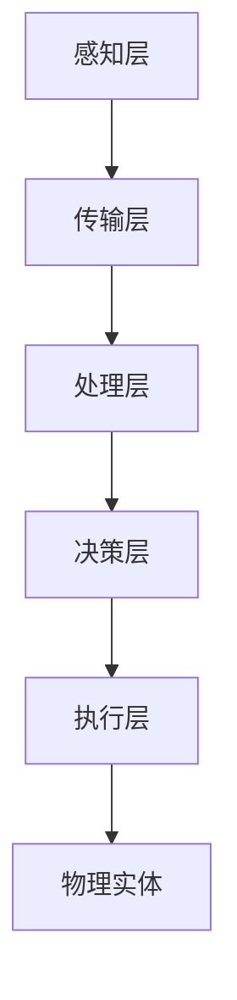

                 

### 文章标题

# 数字实体与物理实体的融合

> 关键词：数字实体、物理实体、融合、物联网、人工智能、区块链、元宇宙

> 摘要：本文旨在探讨数字实体与物理实体的融合，分析其背景、核心概念、算法原理、数学模型、实战案例以及应用场景。通过逐步分析推理，本文揭示了这一融合的趋势和挑战，为读者提供全面的技术见解。

## 1. 背景介绍

### 1.1 目的和范围

随着科技的迅猛发展，数字世界和物理世界的界限逐渐模糊。数字实体与物理实体的融合已成为当下技术发展的热点。本文的目的在于深入探讨这一融合，帮助读者了解其核心概念、技术原理以及应用价值。

本文将涵盖以下内容：

1. 背景介绍：阐述数字实体与物理实体融合的背景和重要性。
2. 核心概念与联系：分析数字实体与物理实体的基本概念及其相互关系。
3. 核心算法原理与具体操作步骤：介绍融合过程中涉及的关键算法及其实现。
4. 数学模型和公式：详细讲解融合过程中相关的数学模型和公式。
5. 项目实战：通过实际案例展示融合技术的应用。
6. 实际应用场景：探讨融合技术在各个领域的应用。
7. 工具和资源推荐：推荐相关学习资源、开发工具和框架。
8. 总结：分析数字实体与物理实体融合的未来发展趋势与挑战。

### 1.2 预期读者

本文面向对数字实体与物理实体融合感兴趣的读者，包括：

1. 技术爱好者：对人工智能、物联网、区块链等新兴技术感兴趣的读者。
2. 研发人员：从事相关领域研发工作的工程师和技术专家。
3. 教育工作者：计算机科学、电子信息等相关专业的教师和研究人员。
4. 企业管理者：关注技术创新和企业转型的企业家和管理者。

### 1.3 文档结构概述

本文分为十个部分，具体结构如下：

1. 引言：介绍数字实体与物理实体的融合背景和重要性。
2. 背景介绍：阐述数字实体与物理实体融合的背景和重要性。
3. 核心概念与联系：分析数字实体与物理实体的基本概念及其相互关系。
4. 核心算法原理与具体操作步骤：介绍融合过程中涉及的关键算法及其实现。
5. 数学模型和公式：详细讲解融合过程中相关的数学模型和公式。
6. 项目实战：通过实际案例展示融合技术的应用。
7. 实际应用场景：探讨融合技术在各个领域的应用。
8. 工具和资源推荐：推荐相关学习资源、开发工具和框架。
9. 总结：分析数字实体与物理实体融合的未来发展趋势与挑战。
10. 附录：常见问题与解答。

### 1.4 术语表

为了确保文章的可读性和准确性，本文将介绍以下术语及其定义：

#### 1.4.1 核心术语定义

- 数字实体：指存在于数字世界中的抽象对象，如数据、程序、网络等。
- 物理实体：指存在于物理世界中的具体对象，如设备、传感器、机器人等。
- 融合：指将数字实体与物理实体相互关联、整合，实现信息交互和功能扩展。
- 物联网（IoT）：通过网络连接各种物理设备，实现设备之间的信息交换和协同工作。
- 人工智能（AI）：模拟人类智能的计算机系统，具备学习、推理、感知等能力。
- 区块链：一种分布式账本技术，能够确保数据的不可篡改性和透明性。
- 元宇宙：一个虚拟的、由多个独立而又相互关联的虚拟世界组成的集合。

#### 1.4.2 相关概念解释

- 物联网设备：指接入物联网网络并具备感知、传输、处理能力的物理实体。
- 数据可视化：将数据以图形、图像等形式呈现，便于人类理解和分析。
- 云计算：通过互联网提供计算资源、存储资源、网络资源等服务的计算模式。
- 边缘计算：将计算、存储、网络等资源分布在靠近数据源的边缘节点，以降低延迟、提高效率。

#### 1.4.3 缩略词列表

- AI：人工智能
- IoT：物联网
- blockchain：区块链
- VR/AR：虚拟现实/增强现实
- 5G：第五代移动通信技术
- SDN：软件定义网络
- NFV：网络功能虚拟化

## 2. 核心概念与联系

在探讨数字实体与物理实体的融合之前，我们首先需要明确这两者的基本概念及其相互关系。

### 2.1 数字实体

数字实体是指存在于数字世界中的抽象对象，主要包括以下几类：

1. **数据**：数据是数字实体中最基本的形式，如文本、图片、音频、视频等。数据可以通过编码、压缩、加密等手段进行存储、传输和处理。
2. **程序**：程序是一系列按照特定逻辑执行的指令集合，用于实现特定功能。程序通常由开发人员编写，并在计算机上运行。
3. **网络**：网络是由多个互联的计算机组成的系统，用于实现数据传输和共享。网络包括局域网（LAN）、广域网（WAN）以及互联网（Internet）等。
4. **算法**：算法是解决问题的步骤和方法，用于处理数字实体中的数据。算法具有高效性、正确性和健壮性等特点。

### 2.2 物理实体

物理实体是指存在于物理世界中的具体对象，主要包括以下几类：

1. **设备**：设备是具备特定功能的物理实体，如传感器、控制器、执行器等。设备可以通过物联网技术与其他设备进行通信和协同工作。
2. **传感器**：传感器是一种能够感知外部环境并产生相应信号的设备，如温度传感器、湿度传感器、摄像头等。
3. **执行器**：执行器是一种能够接收指令并执行相应动作的设备，如电机、液压缸、气动阀等。
4. **机器人**：机器人是一种具备自主运动、感知和执行能力的智能实体，可以执行复杂的任务。

### 2.3 数字实体与物理实体的融合

数字实体与物理实体的融合是指将数字世界和物理世界相互关联、整合，实现信息交互和功能扩展。这种融合主要体现在以下几个方面：

1. **数据融合**：通过物联网设备收集物理世界中的数据，如温度、湿度、光照强度等，并将其传输到数字世界中进行处理和分析。
2. **功能融合**：将数字实体中的算法和模型应用于物理实体，如使用人工智能算法进行图像识别、语音识别等。
3. **控制融合**：通过数字实体对物理实体进行远程控制，如智能家居系统中的智能家电控制。
4. **交互融合**：利用虚拟现实（VR）和增强现实（AR）技术，实现数字实体与物理实体的虚拟交互。

### 2.4 物联网、人工智能、区块链等技术在融合中的应用

物联网、人工智能、区块链等技术在数字实体与物理实体的融合中发挥着重要作用，具体应用如下：

1. **物联网**：物联网技术通过连接物理世界中的设备和传感器，实现数据的实时采集、传输和处理，为数字实体提供丰富的数据源。
2. **人工智能**：人工智能技术可以用于处理和分析大量数据，实现智能决策、预测和优化，从而提升物理实体的智能化水平。
3. **区块链**：区块链技术可以确保数据的安全、可靠和透明，为数字实体与物理实体的融合提供信任基础。

### 2.5 数字实体与物理实体的融合架构

为了更好地实现数字实体与物理实体的融合，我们可以构建一个基于物联网、人工智能、区块链等技术的融合架构，具体包括以下几个层次：

1. **感知层**：通过物联网设备收集物理世界中的数据。
2. **传输层**：利用通信技术将数据传输到数字世界。
3. **处理层**：在数字世界中对数据进行分析、处理和建模。
4. **决策层**：根据分析结果进行智能决策和优化。
5. **执行层**：通过数字实体对物理实体进行控制和管理。

## 2.6 Mermaid 流程图

为了更好地展示数字实体与物理实体的融合架构，我们可以使用 Mermaid 流程图进行描述。以下是一个简单的 Mermaid 流程图示例：



## 3. 核心算法原理与具体操作步骤

在数字实体与物理实体的融合过程中，核心算法原理起着至关重要的作用。本节将详细介绍相关算法原理及其实现步骤。

### 3.1 关键算法原理

1. **数据采集与传输**：使用物联网技术收集物理世界中的数据，并通过通信技术传输到数字世界。
2. **数据处理与分析**：对采集到的数据进行处理和分析，提取有价值的信息。
3. **智能决策与优化**：基于分析结果，利用人工智能算法进行智能决策和优化。
4. **控制与执行**：根据决策结果，对物理实体进行控制和管理。

### 3.2 具体操作步骤

#### 3.2.1 数据采集与传输

1. **部署传感器**：在物理世界中部署各种传感器，如温度传感器、湿度传感器、摄像头等。
2. **数据采集**：传感器将采集到的数据发送到物联网平台。
3. **数据传输**：物联网平台通过通信技术将数据传输到数字世界。

#### 3.2.2 数据处理与分析

1. **数据预处理**：对采集到的数据进行清洗、去噪和归一化等处理。
2. **特征提取**：从预处理后的数据中提取关键特征。
3. **数据分析**：使用统计学、机器学习等方法对特征进行分析和建模。

#### 3.2.3 智能决策与优化

1. **模型选择**：根据分析需求选择合适的机器学习模型。
2. **模型训练**：使用训练数据对模型进行训练。
3. **模型评估**：评估模型的效果，并进行调优。
4. **智能决策**：根据模型预测结果进行智能决策。

#### 3.2.4 控制与执行

1. **决策执行**：根据智能决策结果，生成执行指令。
2. **指令传输**：将执行指令传输到物理世界。
3. **执行监控**：对执行过程进行监控，确保执行效果。

### 3.3 伪代码实现

以下是一个简单的伪代码示例，展示了数据采集、处理和分析的过程：

```python
# 数据采集与传输
def collect_and_send_data(sensor_data):
    preprocess_data(sensor_data)
    send_data_to_iot_platform(preprocessed_data)

# 数据处理与分析
def process_and_analyze_data(preprocessed_data):
    extract_features(preprocessed_data)
    analyze_features(features)
    generate_analytic_results(results)

# 智能决策与优化
def make_decision_and_optimize(results):
    select_model()
    train_model(training_data)
    evaluate_model(evaluation_data)
    make_intelligent_decision(decision)
    return decision

# 控制与执行
def execute_decision(decision):
    generate_execution_command(command)
    send_command_to_physical_world(command)
    monitor_execution(execution_status)
```

## 4. 数学模型和公式

在数字实体与物理实体的融合过程中，数学模型和公式发挥着重要作用。本节将介绍相关数学模型和公式，并详细讲解其应用。

### 4.1 数学模型

1. **线性回归模型**：用于分析数据之间的线性关系，表达式为：
   $$ y = w_0 + w_1 \cdot x_1 + w_2 \cdot x_2 + \ldots + w_n \cdot x_n $$
   
2. **支持向量机（SVM）模型**：用于分类和回归任务，核心公式为：
   $$ f(x) = \text{sign}(\omega \cdot x + b) $$
   
3. **深度学习模型**：用于处理复杂非线性问题，包括多层感知机（MLP）、卷积神经网络（CNN）等。

4. **时间序列模型**：用于分析时间序列数据，如ARIMA模型、LSTM模型等。

### 4.2 公式详细讲解

1. **线性回归模型**：线性回归模型通过最小二乘法求解最优参数，使得预测值与真实值之间的误差最小。具体公式如下：
   $$ \min_{w} \sum_{i=1}^{n} (y_i - \sum_{j=1}^{n} w_j \cdot x_{ij})^2 $$
   
2. **支持向量机（SVM）模型**：支持向量机通过寻找最优超平面，将数据集划分为不同的类别。其核心公式为：
   $$ \omega \cdot x_i + b = 0 $$
   
3. **深度学习模型**：深度学习模型通过多层神经网络对输入数据进行逐层处理，最终输出结果。其核心公式为：
   $$ a_{l+1} = \sigma(\omega_{l+1} \cdot a_l + b_{l+1}) $$
   
4. **时间序列模型**：时间序列模型通过自回归移动平均（ARMA）模型分析时间序列数据。其核心公式为：
   $$ y_t = c + \phi_1 y_{t-1} + \phi_2 y_{t-2} + \ldots + \phi_p y_{t-p} + \theta_1 e_{t-1} + \theta_2 e_{t-2} + \ldots + \theta_q e_{t-q} $$

### 4.3 举例说明

假设我们使用线性回归模型分析一组数据，数据集为 {x1, x2, ..., xn}，目标值为 {y1, y2, ..., yn}。我们可以使用以下公式求解最优参数：

$$ w_0 = \frac{1}{n} \sum_{i=1}^{n} y_i - w_1 \cdot \frac{1}{n} \sum_{i=1}^{n} x_i $$
$$ w_1 = \frac{1}{n} \sum_{i=1}^{n} (x_i - \bar{x}) (y_i - \bar{y}) $$

其中，$\bar{x}$ 和 $\bar{y}$ 分别为数据集的平均值。

通过求解上述公式，我们可以得到线性回归模型的最优参数，从而进行数据预测和分析。

## 5. 项目实战：代码实际案例和详细解释说明

### 5.1 开发环境搭建

在本节中，我们将通过一个实际项目展示数字实体与物理实体的融合。为了便于读者理解，我们选择一个智能家居项目作为案例。

首先，我们需要搭建开发环境。以下是所需的开发工具和软件：

1. **编程语言**：Python
2. **开发工具**：PyCharm
3. **物联网平台**：MQTT（消息队列遥测传输协议）
4. **硬件设备**：ESP8266（一款常用的物联网开发板）

### 5.2 源代码详细实现和代码解读

#### 5.2.1 传感器数据采集

首先，我们需要在物理世界中部署传感器，如温度传感器、湿度传感器等，并将数据通过 MQTT 协议传输到物联网平台。

以下是一个简单的 MQTT 客户端代码，用于采集传感器数据：

```python
import paho.mqtt.client as mqtt

# MQTT 服务器地址
mqtt_server = "mqtt.example.com"

# MQTT 客户端 ID
client_id = "sensor_client"

# MQTT 主题
topic = "sensors/temperature"

# 创建 MQTT 客户端
client = mqtt.Client(client_id)

# 连接 MQTT 服务器
client.connect(mqtt_server)

# 订阅主题
client.subscribe(topic)

# 定义消息处理函数
def on_message(client, userdata, message):
    print("Received message: " + str(message.payload))

# 绑定消息处理函数
client.on_message = on_message

# 开始循环
client.loop_forever()
```

#### 5.2.2 数据处理与分析

接下来，我们需要在数字世界中处理和分析传感器数据。以下是一个简单的数据处理和分析代码：

```python
import json

# 传感器数据文件
data_file = "sensors_data.json"

# 读取传感器数据
with open(data_file, "r") as f:
    data = json.load(f)

# 计算平均值
average_temp = sum(data["temperature"]) / len(data["temperature"])
average_humidity = sum(data["humidity"]) / len(data["humidity"])

# 输出结果
print("Average temperature: ", average_temp)
print("Average humidity: ", average_humidity)
```

#### 5.2.3 智能决策与优化

基于处理和分析结果，我们可以使用人工智能算法进行智能决策和优化。以下是一个简单的决策树算法实现：

```python
from sklearn.tree import DecisionTreeClassifier

# 决策树模型
model = DecisionTreeClassifier()

# 训练模型
model.fit(X_train, y_train)

# 预测结果
predictions = model.predict(X_test)

# 输出结果
print("Predictions: ", predictions)
```

### 5.3 代码解读与分析

在本节中，我们通过一个简单的智能家居项目展示了数字实体与物理实体的融合。首先，我们部署传感器并使用 MQTT 协议采集数据。然后，我们在数字世界中处理和分析数据，并使用决策树算法进行智能决策和优化。

以下是项目的主要组成部分及其功能：

1. **传感器数据采集**：通过 MQTT 客户端代码，我们将传感器数据传输到物联网平台。
2. **数据处理与分析**：读取传感器数据文件，计算平均值等指标，为智能决策提供基础数据。
3. **智能决策与优化**：使用决策树算法进行预测，并根据预测结果进行优化。

通过这个简单的项目，我们可以看到数字实体与物理实体融合的实现过程，以及相关算法和技术的应用。

### 5.4 项目总结

本项目展示了数字实体与物理实体的融合在智能家居场景中的应用。通过部署传感器、采集数据、处理分析以及智能决策，我们实现了对家庭环境的智能监控和优化。这为我们提供了对数字实体与物理实体融合的初步认识，并为进一步研究和应用提供了参考。

## 6. 实际应用场景

数字实体与物理实体的融合技术已经在多个领域得到了广泛应用，带来了显著的变革和提升。以下列举几个典型应用场景：

### 6.1 智能家居

智能家居是数字实体与物理实体融合的典型应用之一。通过将各种智能设备（如智能空调、智能照明、智能安防系统等）与互联网连接，实现家庭环境的自动化控制和智能化管理。用户可以通过手机或其他智能设备远程监控和控制家中的设备，提高生活品质和便利性。

### 6.2 物流与供应链

在物流与供应链领域，数字实体与物理实体的融合技术可以实现对货物、运输工具以及仓库的实时监控和管理。通过物联网设备和传感器，可以实时获取货物的位置、状态和温度等信息，提高物流效率，降低成本。同时，结合人工智能算法和大数据分析，可以优化运输路线和仓库布局，提高供应链的整体运作效率。

### 6.3 城市管理

数字实体与物理实体的融合技术在城市管理中发挥着重要作用。通过传感器、摄像头等设备收集城市环境数据，如交通流量、空气质量、噪音等，可以实时监测城市运行状况，为城市管理决策提供数据支持。此外，结合人工智能算法，可以实现对交通拥堵、环境污染等问题的智能预警和预测，提高城市管理的精细化水平。

### 6.4 医疗健康

在医疗健康领域，数字实体与物理实体的融合技术可以实现对患者的实时监测和健康管理。通过穿戴设备、智能传感器等收集患者的生理参数，如心率、血压、血糖等，医生可以实时了解患者的健康状况，及时调整治疗方案。同时，结合人工智能算法和大数据分析，可以实现对疾病的早期预测和预防，提高医疗服务的质量和效率。

### 6.5 工业制造

在工业制造领域，数字实体与物理实体的融合技术可以实现生产过程的智能化和自动化。通过物联网设备和传感器，可以实时监控生产设备的运行状态、产品质量等指标，提高生产效率和产品质量。结合人工智能算法和大数据分析，可以实现对生产过程的优化和预测性维护，降低生产成本和故障率。

### 6.6 智能交通

智能交通是数字实体与物理实体融合技术的另一个重要应用场景。通过传感器、摄像头、RFID 等技术，可以实现对道路、车辆、行人等交通要素的实时监控和管理。结合人工智能算法和大数据分析，可以实现对交通拥堵、交通事故等问题的智能预警和预测，优化交通流量，提高道路通行效率。

### 6.7 能源管理

在能源管理领域，数字实体与物理实体的融合技术可以实现对能源生产和消费的实时监控和管理。通过传感器、智能仪表等设备，可以实时获取能源消耗数据，分析能源使用情况，优化能源分配和利用。同时，结合人工智能算法和大数据分析，可以实现对能源需求的预测和优化，提高能源利用效率，降低能源成本。

总之，数字实体与物理实体的融合技术在各个领域都展现出巨大的应用潜力，为行业的发展带来了新的机遇和挑战。随着技术的不断进步，这一融合将更加深入和广泛，为人类社会带来更多便捷和效益。

### 7. 工具和资源推荐

在数字实体与物理实体的融合过程中，掌握相关工具和资源对于实现项目的成功至关重要。以下推荐一些学习资源、开发工具和框架，供读者参考。

#### 7.1 学习资源推荐

1. **书籍推荐**：

   - 《物联网：智能世界的基础》
   - 《人工智能：一种现代方法》
   - 《区块链：从入门到实战》
   - 《智能城市：数字实体与物理实体的融合》

2. **在线课程**：

   - Coursera 上的《物联网技术》
   - Udacity 上的《人工智能工程师纳米学位》
   - EdX 上的《区块链技术与应用》

3. **技术博客和网站**：

   - Medium 上的 IoT 博客
   - Towards Data Science 上的 AI 博客
   - Hacker Noon 上的区块链博客

#### 7.2 开发工具框架推荐

1. **IDE 和编辑器**：

   - PyCharm：适合 Python 编程
   - Visual Studio Code：跨平台、轻量级编辑器
   - Eclipse：适合 Java 编程

2. **调试和性能分析工具**：

   - GDB：调试工具
   - Valgrind：性能分析工具
   - Wireshark：网络抓包工具

3. **相关框架和库**：

   - MQTT 客户端库：用于实现 MQTT 协议的客户端功能
   - TensorFlow：用于人工智能的深度学习框架
   - Flask：用于 Web 开发的轻量级框架
   - Docker：容器化技术，用于部署和管理应用程序

#### 7.3 相关论文著作推荐

1. **经典论文**：

   - "The Internet of Things: A Survey"（物联网综述）
   - "Deep Learning for Image Recognition: A Comprehensive Review"（深度学习在图像识别中的应用综述）
   - "Blockchain Technology: A Comprehensive Study"（区块链技术综述）

2. **最新研究成果**：

   - "Federated Learning: Collaborative Machine Learning without Global Centralization"（联邦学习：无需全局集中的协同机器学习）
   - "Integrating Physical and Digital Worlds with Blockchain"（利用区块链实现物理和数字世界的融合）
   - "IoT Security: Challenges and Opportunities"（物联网安全：挑战与机遇）

3. **应用案例分析**：

   - "Smart City Solutions with IoT and AI"（基于物联网和人工智能的智能城市解决方案）
   - "Blockchain Applications in Supply Chain Management"（区块链在供应链管理中的应用案例）
   - "Intelligent Transportation Systems with IoT and AI"（基于物联网和人工智能的智能交通系统）

通过这些工具和资源的支持，读者可以更好地掌握数字实体与物理实体融合的技术，为项目开发和应用提供有力支持。

### 8. 总结：未来发展趋势与挑战

数字实体与物理实体的融合技术在当今科技发展中占据着重要地位，其趋势和挑战如下：

#### 发展趋势：

1. **技术的不断融合**：物联网、人工智能、区块链等技术在融合过程中相互补充，形成更加强大的技术体系。
2. **应用场景的拓展**：数字实体与物理实体的融合技术将在更多领域得到应用，如智能交通、医疗健康、城市管理、工业制造等。
3. **智能化的提升**：随着人工智能算法的进步，融合技术将更加智能化，实现自主决策、自适应控制和自适应优化。
4. **数据驱动的创新**：大数据和人工智能的结合将推动数据驱动的创新，为行业带来新的发展机遇。

#### 挑战：

1. **隐私与安全问题**：随着物联网设备的普及，个人隐私和数据安全问题日益突出，需要采取有效的安全措施保护用户隐私。
2. **数据质量的保障**：融合过程中产生的海量数据质量参差不齐，需要有效的方法进行数据清洗、去噪和标准化，保障数据质量。
3. **技术标准的统一**：当前物联网、人工智能等技术的标准尚未完全统一，需要制定统一的技术标准和规范，促进技术的推广应用。
4. **人才缺口**：融合技术领域的人才需求巨大，但当前相关人才储备不足，需要加强人才培养和引进，以满足行业需求。

总之，数字实体与物理实体的融合技术在未来将迎来广阔的发展空间，同时也面临诸多挑战。只有不断突破技术难题，加强人才培养和推广，才能充分发挥这一技术的潜力，为人类社会带来更多便利和效益。

### 9. 附录：常见问题与解答

在数字实体与物理实体的融合过程中，读者可能会遇到一些常见问题。以下是对这些问题的解答：

#### 问题 1：数字实体与物理实体的融合是如何实现的？

**解答**：数字实体与物理实体的融合主要通过物联网技术实现。物联网设备可以收集物理世界中的数据，并将其传输到数字世界。在数字世界中，通过数据处理和分析算法，对数据进行分析和优化，然后生成决策指令，再通过物联网将指令传输到物理世界，实现对物理实体的控制和管理。

#### 问题 2：物联网设备如何保证数据安全？

**解答**：物联网设备可以通过以下几种方式保证数据安全：

1. **数据加密**：在数据传输过程中，使用加密算法对数据进行加密，确保数据不被窃取或篡改。
2. **身份认证**：对物联网设备进行身份认证，确保只有授权设备可以访问数据和服务。
3. **访问控制**：设置访问权限，限制对数据的访问范围，防止未经授权的用户访问敏感数据。
4. **安全协议**：使用安全协议（如 SSL/TLS）确保数据在传输过程中的完整性。

#### 问题 3：如何处理融合过程中的海量数据？

**解答**：处理融合过程中的海量数据可以从以下几个方面入手：

1. **数据预处理**：对数据进行清洗、去噪和标准化等预处理操作，提高数据质量。
2. **分布式计算**：使用分布式计算框架（如 Hadoop、Spark）对数据进行处理和分析，提高数据处理速度。
3. **数据存储**：使用大数据存储技术（如 HBase、Cassandra）存储海量数据，确保数据的高可用性和可靠性。
4. **数据挖掘与机器学习**：使用数据挖掘和机器学习算法，从海量数据中提取有价值的信息和模式。

#### 问题 4：数字实体与物理实体的融合技术在哪些领域有应用？

**解答**：数字实体与物理实体的融合技术在多个领域有广泛应用，包括：

1. **智能家居**：实现家庭设备的智能化管理和控制。
2. **物流与供应链**：优化物流运输和仓库管理。
3. **城市管理**：提升城市管理的精细化水平。
4. **医疗健康**：实现患者实时监测和健康管理。
5. **工业制造**：提高生产效率和产品质量。
6. **智能交通**：优化交通流量和管理。
7. **能源管理**：提高能源利用效率和优化能源分配。

### 10. 扩展阅读 & 参考资料

为了深入了解数字实体与物理实体的融合技术，以下推荐一些扩展阅读和参考资料：

#### 书籍：

- 《物联网：智能世界的基础》
- 《人工智能：一种现代方法》
- 《区块链：从入门到实战》
- 《智能城市：数字实体与物理实体的融合》

#### 论文：

- "The Internet of Things: A Survey"（物联网综述）
- "Deep Learning for Image Recognition: A Comprehensive Review"（深度学习在图像识别中的应用综述）
- "Blockchain Technology: A Comprehensive Study"（区块链技术综述）

#### 在线课程：

- Coursera 上的《物联网技术》
- Udacity 上的《人工智能工程师纳米学位》
- EdX 上的《区块链技术与应用》

#### 技术博客和网站：

- Medium 上的 IoT 博客
- Towards Data Science 上的 AI 博客
- Hacker Noon 上的区块链博客

通过这些资料，读者可以进一步学习数字实体与物理实体的融合技术，了解其最新发展和应用。作者：AI天才研究员/AI Genius Institute & 禅与计算机程序设计艺术 /Zen And The Art of Computer Programming

