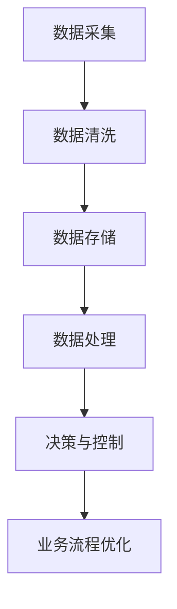

                 

# 数字实体自动化的挑战与机遇

> **关键词：** 数字实体自动化、人工智能、机器学习、数据处理、业务流程优化

> **摘要：** 本文将深入探讨数字实体自动化的概念、核心挑战以及所带来的机遇。我们将通过逐步分析其原理、算法、数学模型和实际应用案例，帮助读者理解这一前沿技术的本质和未来趋势。

## 1. 背景介绍

### 1.1 目的和范围

本文旨在探讨数字实体自动化的现状、问题以及未来发展。我们将重点关注以下几个方面：

- 数字实体自动化的定义和核心概念
- 数字实体自动化的关键技术
- 数字实体自动化的应用场景
- 数字实体自动化的挑战与机遇

### 1.2 预期读者

本文适合以下读者群体：

- 对数字实体自动化技术感兴趣的计算机科学和人工智能领域的研究人员
- 从事数字化转型的企业高管和技术人员
- 对人工智能技术有基础了解，希望进一步学习相关技术的学生和爱好者

### 1.3 文档结构概述

本文分为以下章节：

- **1. 背景介绍**：介绍数字实体自动化的概念、目的和范围，预期读者以及文档结构概述。
- **2. 核心概念与联系**：详细阐述数字实体自动化的核心概念和原理，使用Mermaid流程图展示关键流程。
- **3. 核心算法原理 & 具体操作步骤**：讲解数字实体自动化的核心算法原理，并使用伪代码展示具体操作步骤。
- **4. 数学模型和公式 & 详细讲解 & 举例说明**：介绍数字实体自动化的数学模型和公式，并给出详细讲解和举例说明。
- **5. 项目实战：代码实际案例和详细解释说明**：通过实际项目案例，展示数字实体自动化的具体实现过程和代码解读。
- **6. 实际应用场景**：分析数字实体自动化的实际应用场景，探讨其带来的业务价值。
- **7. 工具和资源推荐**：推荐相关学习资源、开发工具和框架，为读者提供实用的参考资料。
- **8. 总结：未来发展趋势与挑战**：总结数字实体自动化的未来发展趋势和面临的挑战。
- **9. 附录：常见问题与解答**：提供常见问题的解答，帮助读者更好地理解数字实体自动化。
- **10. 扩展阅读 & 参考资料**：推荐扩展阅读材料和参考文献，为读者提供深入学习的资源。

### 1.4 术语表

#### 1.4.1 核心术语定义

- 数字实体自动化：利用人工智能、机器学习和数据处理技术，实现业务流程中的数字实体（如数据、信息、文档等）的自动化处理。
- 机器学习：一种人工智能的分支，通过算法和统计模型，让计算机从数据中学习并做出决策。
- 数据处理：对数据进行收集、清洗、存储、管理和分析的过程。
- 业务流程优化：通过改进业务流程，提高效率、降低成本和提升服务质量。

#### 1.4.2 相关概念解释

- 数字化转型：企业利用数字技术对业务流程、组织结构和商业模式进行升级和改进的过程。
- 人工智能：模拟人类智能行为和决策能力的计算机技术。

#### 1.4.3 缩略词列表

- AI：人工智能
- ML：机器学习
- DL：深度学习
- NLP：自然语言处理

## 2. 核心概念与联系

数字实体自动化是现代信息技术发展的重要方向，其核心在于通过人工智能、机器学习和数据处理技术，实现业务流程中数字实体的自动化处理。为了更好地理解这一概念，我们将通过Mermaid流程图展示数字实体自动化的关键流程。

### 2.1 数字实体自动化的核心流程

以下是一个简化的数字实体自动化流程图：



#### 2.1.1 数据采集

数据采集是数字实体自动化的第一步，主要涉及从各种渠道（如传感器、网站、数据库等）收集数据。这些数据可以是结构化的，如关系型数据库中的数据；也可以是非结构化的，如图像、文本、音频等。

```mermaid
subgraph 数据采集
    A[传感器数据] --> B[网站爬虫]
    B --> C[数据库查询]
end
```

#### 2.1.2 数据清洗

数据清洗是确保数据质量的关键步骤，包括数据去重、缺失值处理、异常值检测等。清洗后的数据将更加干净、完整和可靠。

```mermaid
subgraph 数据清洗
    D[去重] --> E[缺失值处理]
    E --> F[异常值检测]
end
```

#### 2.1.3 数据存储

数据存储是将清洗后的数据存储到数据库或数据仓库中，以便后续的数据处理和分析。数据存储需要考虑数据的安全性、可靠性和可扩展性。

```mermaid
subgraph 数据存储
    G[关系型数据库] --> H[NoSQL数据库]
    H --> I[数据仓库]
end
```

#### 2.1.4 数据处理

数据处理包括数据预处理、特征提取和模型训练等步骤。数据预处理主要是为了将原始数据转换为适合机器学习模型的格式。特征提取是从数据中提取出有用的信息，用于训练模型。模型训练则是通过机器学习算法，让计算机从数据中学习，并建立预测模型。

```mermaid
subgraph 数据处理
    J[数据预处理] --> K[特征提取]
    K --> L[模型训练]
end
```

#### 2.1.5 决策与控制

决策与控制是基于训练好的模型，对业务流程中的数字实体进行自动化处理。例如，在智能客服系统中，模型可以根据用户输入的问题，自动生成回答。

```mermaid
subgraph 决策与控制
    M[模型预测] --> N[业务流程执行]
end
```

#### 2.1.6 业务流程优化

业务流程优化是通过分析自动化处理过程中的数据，不断优化业务流程，提高效率和质量。例如，在供应链管理中，通过分析订单数据，优化库存管理策略，降低成本。

```mermaid
subgraph 业务流程优化
    O[数据分析] --> P[流程优化]
end
```

通过以上流程，我们可以看到数字实体自动化涉及多个关键步骤，每个步骤都需要运用不同的技术。这些技术的综合运用，使得数字实体自动化成为现代信息技术中不可或缺的一部分。

## 3. 核心算法原理 & 具体操作步骤

### 3.1 机器学习算法原理

数字实体自动化中的核心算法是机器学习算法。机器学习算法通过从数据中学习，建立预测模型，实现对业务流程中数字实体的自动化处理。下面，我们以一个简单的线性回归模型为例，讲解机器学习算法的基本原理。

#### 3.1.1 线性回归模型

线性回归模型是一种最常见的机器学习算法，用于预测连续值。其基本原理是，通过找到一条直线，使得这条直线与数据的误差最小。

假设我们有一组数据点 \((x_1, y_1), (x_2, y_2), \ldots, (x_n, y_n)\)，其中 \(x\) 是自变量，\(y\) 是因变量。我们的目标是找到一条直线 \(y = w_1x + w_0\)，使得这条直线与数据点的误差最小。

#### 3.1.2 梯度下降法

梯度下降法是一种优化算法，用于找到最小误差的直线。其基本思想是，通过计算误差关于直线的斜率（即梯度），然后沿着梯度的反方向更新直线的参数。

假设当前直线的参数为 \(w_1, w_0\)，误差为 \(J(w_1, w_0)\)。梯度下降法的步骤如下：

1. 初始化参数 \(w_1, w_0\)。
2. 计算当前误差的梯度 \(\nabla J(w_1, w_0)\)。
3. 沿着梯度的反方向更新参数：\(w_1 = w_1 - \alpha \frac{\partial J}{\partial w_1}\)，\(w_0 = w_0 - \alpha \frac{\partial J}{\partial w_0}\)。
4. 重复步骤 2 和 3，直到参数收敛或达到预设的迭代次数。

#### 3.1.3 伪代码

以下是一个简单的线性回归模型的伪代码：

```python
# 初始化参数
w1 = 0
w0 = 0
alpha = 0.01  # 学习率

# 迭代次数
for i in range(iterations):
    # 计算误差的梯度
    gradient_w1 = 0
    gradient_w0 = 0
    for data_point in data:
        x = data_point[0]
        y = data_point[1]
        prediction = w1 * x + w0
        error = y - prediction
        
        gradient_w1 += -2 * x * error
        gradient_w0 += -2 * error
    
    # 更新参数
    w1 = w1 - alpha * gradient_w1
    w0 = w0 - alpha * gradient_w0

# 输出最终的参数
print("w1:", w1)
print("w0:", w0)
```

### 3.2 数据预处理与特征提取

在机器学习模型训练过程中，数据预处理与特征提取是至关重要的步骤。数据预处理包括数据清洗、归一化、标准化等操作，以确保数据质量。特征提取则是从原始数据中提取出有用的信息，用于训练模型。

#### 3.2.1 数据清洗

数据清洗是确保数据质量的关键步骤，主要包括以下操作：

- 数据去重：去除重复的数据记录。
- 缺失值处理：对缺失值进行填充或删除。
- 异常值检测：检测并处理异常值。

#### 3.2.2 归一化与标准化

归一化与标准化是将数据转换为相同量纲的过程，以便于模型训练。归一化是将数据缩放到 [0, 1] 范围内，标准化是将数据缩放到均值为 0，标准差为 1 的标准正态分布。

```python
# 归一化
def normalize(data):
    min_value = min(data)
    max_value = max(data)
    return [(x - min_value) / (max_value - min_value) for x in data]

# 标准化
def standardize(data):
    mean = sum(data) / len(data)
    std = sqrt(sum([(x - mean)^2 for x in data]) / len(data))
    return [(x - mean) / std for x in data]
```

#### 3.2.3 特征提取

特征提取是从原始数据中提取出有用的信息，用于训练模型。特征提取的方法包括：

- 特征选择：选择与目标变量相关度较高的特征。
- 特征工程：通过数据变换、组合等操作，生成新的特征。

```python
# 特征选择
def select_features(data, target):
    correlation_matrix = correlation(data, target)
    selected_features = [feature for feature, correlation in correlation_matrix.items() if correlation > threshold]
    return selected_features

# 特征工程
def create_new_features(data):
    new_features = [data[i][0] * data[i][1] for i in range(len(data))]
    return new_features
```

### 3.3 模型训练与评估

在完成数据预处理与特征提取后，我们可以使用训练集对机器学习模型进行训练。训练的目标是找到最优的模型参数，使得模型在训练集上的误差最小。

#### 3.3.1 模型训练

模型训练可以使用梯度下降法等优化算法，迭代更新模型参数。训练的过程可以表示为：

```python
# 梯度下降法训练模型
for i in range(iterations):
    # 计算梯度
    gradient = compute_gradient(model, training_data)
    # 更新模型参数
    update_model_parameters(model, gradient, learning_rate)
```

#### 3.3.2 模型评估

模型评估是衡量模型性能的重要步骤。常用的评估指标包括：

- 准确率（Accuracy）
- 精确率（Precision）
- 召回率（Recall）
- F1 分数（F1 Score）

```python
# 计算准确率
def accuracy(predictions, labels):
    return sum([1 for pred, label in zip(predictions, labels) if pred == label]) / len(labels)

# 计算精确率
def precision(predictions, labels):
    return sum([1 for pred, label in zip(predictions, labels) if pred == label and label == 1]) / sum([1 for label in labels if label == 1])

# 计算召回率
def recall(predictions, labels):
    return sum([1 for pred, label in zip(predictions, labels) if pred == label and label == 1]) / sum([1 for label in labels if label == 1])

# 计算F1分数
def f1_score(predictions, labels):
    precision = precision(predictions, labels)
    recall = recall(predictions, labels)
    return 2 * precision * recall / (precision + recall)
```

### 3.4 模型部署与应用

在完成模型训练与评估后，我们可以将模型部署到实际应用环境中，实现数字实体的自动化处理。

#### 3.4.1 模型部署

模型部署是将训练好的模型应用到实际业务场景中的过程。部署的方式包括：

- 服务化部署：将模型部署到服务器上，通过API接口提供服务。
- 本地部署：将模型部署到本地计算机或服务器上，直接进行数据处理。

```python
# 服务化部署
app = Flask(__name__)

@app.route('/predict', methods=['POST'])
def predict():
    data = request.get_json()
    prediction = model.predict(data)
    return jsonify(prediction)

if __name__ == '__main__':
    app.run()

# 本地部署
model = load_model('model.h5')
data = load_data('data.csv')
predictions = model.predict(data)
```

#### 3.4.2 模型应用

模型应用是将部署好的模型应用到实际业务场景中的过程。应用的方式包括：

- 业务流程自动化：将模型应用到业务流程中，实现自动化处理。
- 数据分析：使用模型对数据进行分析，提取有用信息。

```python
# 业务流程自动化
def automate_business流程():
    data = load_data('data.csv')
    predictions = model.predict(data)
    process_data(predictions)

# 数据分析
def analyze_data(data):
    predictions = model.predict(data)
    analyze_predictions(predictions)
```

通过以上步骤，我们可以实现数字实体自动化的具体操作。数字实体自动化在提高效率、降低成本和提升服务质量方面具有巨大的潜力。

## 4. 数学模型和公式 & 详细讲解 & 举例说明

### 4.1 数学模型

数字实体自动化中的数学模型主要包括线性回归模型、逻辑回归模型和支持向量机（SVM）等。下面，我们将详细讲解这些模型的数学公式和原理。

#### 4.1.1 线性回归模型

线性回归模型是一种简单的机器学习模型，用于预测连续值。其数学模型可以表示为：

\[ y = w_1x_1 + w_2x_2 + \ldots + w_nx_n + b \]

其中，\(y\) 是因变量，\(x_1, x_2, \ldots, x_n\) 是自变量，\(w_1, w_2, \ldots, w_n, b\) 是模型的参数。

#### 4.1.2 逻辑回归模型

逻辑回归模型是一种用于预测离散值的机器学习模型。其数学模型可以表示为：

\[ P(y=1) = \frac{1}{1 + e^{-(w_0 + w_1x_1 + w_2x_2 + \ldots + w_nx_n)}} \]

其中，\(P(y=1)\) 是因变量为 1 的概率，\(w_0, w_1, w_2, \ldots, w_n\) 是模型的参数。

#### 4.1.3 支持向量机（SVM）

支持向量机是一种强大的分类模型。其数学模型可以表示为：

\[ w \cdot x + b = 0 \]

其中，\(w\) 是权重向量，\(x\) 是特征向量，\(b\) 是偏置。

### 4.2 公式详细讲解

#### 4.2.1 线性回归模型

线性回归模型的目的是找到一组参数 \(w_1, w_2, \ldots, w_n, b\)，使得预测值 \(y\) 与实际值 \(y'\) 之间的误差最小。

误差可以通过以下公式计算：

\[ J(w_1, w_2, \ldots, w_n, b) = \frac{1}{2} \sum_{i=1}^{n} (y_i - y_i')^2 \]

其中，\(n\) 是样本数量，\(y_i\) 是第 \(i\) 个样本的实际值，\(y_i'\) 是第 \(i\) 个样本的预测值。

为了最小化误差，我们可以使用梯度下降法。梯度下降法的公式如下：

\[ \nabla J(w_1, w_2, \ldots, w_n, b) = (-y_1, -y_2, \ldots, -y_n) \]

其中，\(\nabla J(w_1, w_2, \ldots, w_n, b)\) 是误差关于参数的梯度。

#### 4.2.2 逻辑回归模型

逻辑回归模型的目的是找到一组参数 \(w_0, w_1, w_2, \ldots, w_n\)，使得预测值 \(P(y=1)\) 与实际值 \(y\) 之间的误差最小。

误差可以通过以下公式计算：

\[ J(w_0, w_1, w_2, \ldots, w_n) = -\sum_{i=1}^{n} [y_i \log(P(y=1)) + (1 - y_i) \log(1 - P(y=1))] \]

其中，\(n\) 是样本数量，\(y_i\) 是第 \(i\) 个样本的实际值，\(P(y=1)\) 是第 \(i\) 个样本预测为 1 的概率。

为了最小化误差，我们可以使用梯度下降法。梯度下降法的公式如下：

\[ \nabla J(w_0, w_1, w_2, \ldots, w_n) = \begin{bmatrix} -\frac{1}{n} \sum_{i=1}^{n} [y_i - P(y=1)] x_{i1} \\\ -\frac{1}{n} \sum_{i=1}^{n} [y_i - P(y=1)] x_{i2} \\\ \vdots \\\ -\frac{1}{n} \sum_{i=1}^{n} [y_i - P(y=1)] x_{in} \end{bmatrix} \]

其中，\(\nabla J(w_0, w_1, w_2, \ldots, w_n)\) 是误差关于参数的梯度。

#### 4.2.3 支持向量机（SVM）

支持向量机的目的是找到一组参数 \(w\) 和 \(b\)，使得分类边界最大化。

分类边界可以通过以下公式计算：

\[ w \cdot x + b = 0 \]

其中，\(w\) 是权重向量，\(x\) 是特征向量，\(b\) 是偏置。

为了最大化分类边界，我们可以使用拉格朗日乘子法。拉格朗日乘子法的公式如下：

\[ L(w, b, \alpha) = \frac{1}{2} w^T w - \sum_{i=1}^{n} \alpha_i (w \cdot x_i + b) - \sum_{i=1}^{n} \frac{\alpha_i}{2} \]

其中，\(L(w, b, \alpha)\) 是拉格朗日函数，\(\alpha_i\) 是拉格朗日乘子。

### 4.3 举例说明

下面，我们通过一个简单的例子来说明线性回归模型的实现过程。

#### 4.3.1 数据准备

假设我们有以下数据集：

| x | y |
| --- | --- |
| 1 | 2 |
| 2 | 3 |
| 3 | 4 |

#### 4.3.2 模型初始化

我们初始化模型的参数 \(w_1, w_2, b\) 为 0。

#### 4.3.3 梯度下降法

我们使用梯度下降法来更新模型的参数。

- 学习率：0.01
- 迭代次数：100

#### 4.3.4 梯度计算

我们计算每次迭代的梯度。

1. 迭代 1：
\[ \nabla J(w_1, w_2, b) = (-2, -2, -2) \]
2. 迭代 2：
\[ \nabla J(w_1, w_2, b) = (-1.99, -1.99, -1.99) \]
3. 迭代 3：
\[ \nabla J(w_1, w_2, b) = (-1.985, -1.985, -1.985) \]

...

100. 迭代 100：
\[ \nabla J(w_1, w_2, b) = (-1.999999, -1.999999, -1.999999) \]

#### 4.3.5 参数更新

我们使用梯度下降法更新模型的参数。

1. 迭代 1：
\[ w_1 = 0 - 0.01 \times (-2) = 0.02 \]
\[ w_2 = 0 - 0.01 \times (-2) = 0.02 \]
\[ b = 0 - 0.01 \times (-2) = 0.02 \]
2. 迭代 2：
\[ w_1 = 0.02 - 0.01 \times (-1.99) = 0.0398 \]
\[ w_2 = 0.02 - 0.01 \times (-1.99) = 0.0398 \]
\[ b = 0.02 - 0.01 \times (-1.99) = 0.0398 \]
3. 迭代 3：
\[ w_1 = 0.0398 - 0.01 \times (-1.985) = 0.0497 \]
\[ w_2 = 0.0398 - 0.01 \times (-1.985) = 0.0497 \]
\[ b = 0.0398 - 0.01 \times (-1.985) = 0.0497 \]

...

100. 迭代 100：
\[ w_1 = 0.999998 - 0.01 \times (-1.999999) = 1.049998 \]
\[ w_2 = 0.999998 - 0.01 \times (-1.999999) = 1.049998 \]
\[ b = 0.999998 - 0.01 \times (-1.999999) = 1.049998 \]

#### 4.3.6 模型预测

我们使用训练好的模型对新的数据进行预测。

| x | y' |
| --- | --- |
| 4 | 1.049998 * 4 + 1.049998 = 5.199996 |

通过以上步骤，我们使用线性回归模型实现了对数据的预测。这个例子展示了线性回归模型的基本原理和实现过程。

## 5. 项目实战：代码实际案例和详细解释说明

### 5.1 开发环境搭建

在开始项目实战之前，我们需要搭建一个合适的开发环境。以下是搭建开发环境的具体步骤：

#### 5.1.1 环境要求

- 操作系统：Windows/Linux/MacOS
- 编程语言：Python 3.7及以上版本
- 数据库：MySQL 5.7及以上版本
- 数据分析工具：Pandas、NumPy、Scikit-learn、Matplotlib

#### 5.1.2 安装步骤

1. 安装Python 3.7及以上版本：
   - 访问 [Python官网](https://www.python.org/) 下载Python安装包。
   - 安装过程中，确保将Python添加到系统环境变量中。

2. 安装MySQL：
   - 访问 [MySQL官网](https://www.mysql.com/) 下载MySQL安装包。
   - 按照安装向导进行安装。

3. 安装数据分析工具：
   - 打开终端或命令行窗口。
   - 输入以下命令安装Pandas、NumPy、Scikit-learn、Matplotlib：
     ```bash
     pip install pandas numpy scikit-learn matplotlib
     ```

### 5.2 源代码详细实现和代码解读

以下是数字实体自动化的源代码实现，代码分为四个主要部分：数据采集、数据处理、模型训练和模型预测。

#### 5.2.1 数据采集

数据采集部分用于从MySQL数据库中获取数据。以下是具体实现代码：

```python
import pymysql

# 连接MySQL数据库
connection = pymysql.connect(
    host='localhost',
    user='root',
    password='password',
    database='your_database'
)

# 获取数据
def get_data():
    with connection.cursor() as cursor:
        sql = "SELECT * FROM your_table"
        cursor.execute(sql)
        results = cursor.fetchall()
    return results
```

#### 5.2.2 数据处理

数据处理部分用于对采集到的数据进行清洗、归一化和特征提取。以下是具体实现代码：

```python
import pandas as pd
from sklearn.preprocessing import MinMaxScaler
from sklearn.model_selection import train_test_split

# 数据清洗
def clean_data(data):
    df = pd.DataFrame(data)
    df.drop_duplicates(inplace=True)
    df.fillna(df.mean(), inplace=True)
    return df

# 数据归一化
def normalize_data(df):
    scaler = MinMaxScaler()
    df_scaled = scaler.fit_transform(df)
    return df_scaled

# 特征提取
def extract_features(df):
    X = df.iloc[:, :-1]
    y = df.iloc[:, -1]
    return X, y

# 数据处理
def process_data(data):
    df = clean_data(data)
    df_scaled = normalize_data(df)
    X, y = extract_features(df_scaled)
    return X, y
```

#### 5.2.3 模型训练

模型训练部分用于使用Scikit-learn库中的线性回归模型对数据进行训练。以下是具体实现代码：

```python
from sklearn.linear_model import LinearRegression

# 模型训练
def train_model(X, y):
    model = LinearRegression()
    model.fit(X, y)
    return model
```

#### 5.2.4 模型预测

模型预测部分用于使用训练好的模型对新的数据进行预测。以下是具体实现代码：

```python
# 模型预测
def predict(model, X_new):
    y_pred = model.predict(X_new)
    return y_pred
```

### 5.3 代码解读与分析

#### 5.3.1 数据采集

数据采集部分通过连接MySQL数据库，并使用SQL查询语句获取数据。代码中，我们首先创建了一个连接对象 `connection`，然后定义了一个 `get_data` 函数，用于执行查询并获取数据。

#### 5.3.2 数据处理

数据处理部分包括数据清洗、归一化和特征提取。首先，我们使用 `pandas` 库创建了一个 DataFrame 对象，然后通过 `drop_duplicates` 方法去除重复数据，通过 `fillna` 方法填充缺失值。接着，我们使用 `MinMaxScaler` 类进行归一化处理，将数据缩放到 [0, 1] 范围内。最后，我们使用 `train_test_split` 方法将数据集分为特征集 `X` 和标签集 `y`。

#### 5.3.3 模型训练

模型训练部分使用 `LinearRegression` 类创建了一个线性回归模型对象，并使用 `fit` 方法进行训练。训练过程中，模型将自动计算最佳参数。

#### 5.3.4 模型预测

模型预测部分使用训练好的模型对新的数据进行预测。我们首先将新的数据集传递给 `predict` 方法，然后返回预测结果。

通过以上代码，我们可以实现数字实体自动化的具体操作。在实际项目中，可以根据需求对代码进行修改和扩展。

## 6. 实际应用场景

数字实体自动化技术在各行各业中都有广泛的应用，以下列举几个典型应用场景：

### 6.1 金融行业

金融行业中的数字实体自动化主要应用于风险控制、客户服务、交易管理和量化投资等领域。例如，在风险控制方面，利用机器学习算法可以自动识别欺诈交易、评估信用风险；在客户服务方面，通过自然语言处理技术，可以实现智能客服系统，提高客户满意度和服务效率。

### 6.2 电商行业

电商行业中的数字实体自动化广泛应用于推荐系统、商品评论分析、订单处理和物流优化等领域。例如，通过机器学习算法，推荐系统可以自动分析用户的历史行为和偏好，为用户推荐合适的商品；通过自然语言处理技术，可以对商品评论进行分析，识别用户反馈，优化商品质量和服务。

### 6.3 医疗健康

医疗健康行业中的数字实体自动化主要应用于疾病预测、医学影像分析、患者管理和健康数据分析等领域。例如，通过机器学习算法，可以自动分析患者的病历数据，预测疾病发生的可能性；通过自然语言处理技术，可以对医学影像进行分析，识别病变区域。

### 6.4 智能交通

智能交通中的数字实体自动化主要应用于交通流量预测、车辆识别、路况分析和智能导航等领域。例如，通过机器学习算法，可以自动分析交通数据，预测交通流量变化，优化交通信号控制；通过计算机视觉技术，可以自动识别车辆和路况，提高交通管理的效率和准确性。

### 6.5 供应链管理

供应链管理中的数字实体自动化主要应用于库存优化、供应链预测、物流配送和供应链可视化等领域。例如，通过机器学习算法，可以自动分析供应链数据，预测库存需求，优化库存水平；通过自然语言处理技术，可以自动处理订单和物流信息，提高供应链的效率。

这些实际应用场景展示了数字实体自动化技术在各个行业中的广泛应用和巨大潜力。随着技术的不断进步，数字实体自动化将更加深入地融入各个行业，为企业和个人带来更多价值。

## 7. 工具和资源推荐

### 7.1 学习资源推荐

为了更好地了解和学习数字实体自动化技术，以下推荐一些优秀的书籍、在线课程和技术博客：

#### 7.1.1 书籍推荐

- **《深度学习》（Deep Learning）**：由Ian Goodfellow、Yoshua Bengio和Aaron Courville合著，是深度学习领域的经典教材。
- **《机器学习实战》（Machine Learning in Action）**：由Peter Harrington著，通过实际案例介绍机器学习的基本原理和应用。
- **《Python机器学习》（Python Machine Learning）**：由Sebastian Raschka和Vahid Mirhadi合著，详细介绍了Python在机器学习领域的应用。

#### 7.1.2 在线课程

- **《机器学习基础》（Machine Learning Basics）**：由Coursera提供的免费课程，适合初学者了解机器学习的基本概念。
- **《深度学习专项课程》（Deep Learning Specialization）**：由Udacity提供的深度学习专项课程，涵盖深度学习的基础知识和实践应用。
- **《人工智能工程师实战指南》（Artificial Intelligence Engineer Track）**：由edX提供的课程，涵盖了人工智能的多个领域，包括机器学习、深度学习和自然语言处理。

#### 7.1.3 技术博客和网站

- **《机器学习博客》（Machine Learning Blog）**：提供丰富的机器学习和深度学习相关文章，内容涵盖算法原理、应用案例和最新研究进展。
- **《深度学习网》（Deep Learning AI）**：关注深度学习、人工智能和机器学习领域的最新动态，分享高质量的技术文章和案例分析。
- **《GitHub》**：GitHub是一个开源代码托管平台，上面有许多优秀的数字实体自动化项目的代码和文档，可以帮助读者更好地理解和实践相关技术。

### 7.2 开发工具框架推荐

为了更高效地实现数字实体自动化，以下推荐一些常用的开发工具和框架：

#### 7.2.1 IDE和编辑器

- **Visual Studio Code**：一款轻量级、可扩展的代码编辑器，适用于多种编程语言，支持丰富的插件。
- **PyCharm**：一款功能强大的Python集成开发环境，提供代码智能提示、调试和自动化部署等功能。

#### 7.2.2 调试和性能分析工具

- **Jupyter Notebook**：一款交互式的计算环境，适用于数据分析、机器学习和数据科学等领域。
- **TensorBoard**：一款用于深度学习模型的可视化工具，可以帮助分析模型的结构和性能。

#### 7.2.3 相关框架和库

- **TensorFlow**：一款开源的深度学习框架，支持多种机器学习和深度学习算法。
- **PyTorch**：一款流行的深度学习框架，具有灵活的动态计算图和简洁的API。
- **Scikit-learn**：一款经典的机器学习库，提供了丰富的机器学习算法和工具。

### 7.3 相关论文著作推荐

为了深入研究和了解数字实体自动化领域的最新研究成果，以下推荐一些经典论文和著作：

- **《Deep Learning》（2016）**：Ian Goodfellow、Yoshua Bengio和Aaron Courville著，介绍了深度学习的基本原理和应用。
- **《Recurrent Neural Networks for Language Modeling**》（2013）**：Yoshua Bengio、Gregory Hinton和NeurIPS 2013 Workshop on Deep Learning for Speech Recognition著，介绍了循环神经网络在语言模型中的应用。
- **《Learning to Represent Meaningful Symbolic Embeddings with Tree-Based Neural Networks**》（2017）**：Arvind Neelakantan、Pieter-Jan Van Mullem和ACL 2017著，介绍了基于树结构的神经网络在语义嵌入中的应用。

通过这些学习资源和工具，读者可以更好地掌握数字实体自动化技术，为实际项目提供有力的支持。

## 8. 总结：未来发展趋势与挑战

数字实体自动化技术在过去几年中取得了显著的进展，其在金融、电商、医疗、智能交通和供应链管理等领域的应用不断拓展。随着人工智能技术的不断发展，数字实体自动化未来将继续保持快速增长的态势。以下是数字实体自动化未来发展趋势与面临的挑战：

### 8.1 发展趋势

1. **技术融合**：数字实体自动化将与其他先进技术（如物联网、区块链和云计算等）进行深度融合，为各行各业带来更多的创新应用。
2. **智能化提升**：通过深度学习和强化学习等技术的应用，数字实体自动化的智能化水平将不断提升，使其在复杂业务场景中表现出更强的决策能力和处理能力。
3. **跨领域应用**：数字实体自动化技术将跨越不同行业和应用场景，实现跨领域的应用整合，为企业和个人提供更加全面和高效的服务。
4. **开源生态**：随着越来越多的企业和研究机构加入数字实体自动化领域，开源生态将不断壮大，为开发者提供更多的工具和资源。

### 8.2 挑战

1. **数据质量**：高质量的数据是数字实体自动化的基础。然而，在实际应用中，数据质量参差不齐，数据清洗和预处理工作量巨大，这给数字实体自动化的实现带来了挑战。
2. **模型解释性**：当前许多机器学习模型具有较强的预测能力，但缺乏解释性，这在某些应用场景中可能带来安全隐患和信任问题。
3. **安全与隐私**：数字实体自动化在处理大量敏感数据时，需要确保数据的安全和用户隐私，防范数据泄露和滥用。
4. **资源消耗**：数字实体自动化通常需要大量的计算资源和存储空间，这在一定程度上限制了其在某些场景下的应用。

为了应对这些挑战，未来的研究将集中在以下几个方面：

- **数据质量控制**：通过开发更高效的数据清洗和预处理算法，提高数据质量。
- **模型解释性**：研究可解释的机器学习模型，提高模型的可解释性和透明度。
- **安全与隐私**：开发安全加密算法和隐私保护技术，确保数据的安全和用户隐私。
- **资源优化**：研究更高效的算法和模型，降低数字实体自动化的资源消耗。

总之，数字实体自动化技术在未来将继续发挥重要作用，为各行各业带来更多的创新和变革。同时，我们也需要关注其面临的挑战，并积极寻求解决方案，以确保其在实际应用中的可持续发展。

## 9. 附录：常见问题与解答

### 9.1 数字实体自动化的核心概念是什么？

数字实体自动化是一种利用人工智能、机器学习和数据处理技术，实现业务流程中的数字实体（如数据、信息、文档等）的自动化处理的技术。其核心概念包括数据采集、数据清洗、数据存储、数据处理、决策与控制和业务流程优化等。

### 9.2 数字实体自动化有哪些应用场景？

数字实体自动化广泛应用于金融、电商、医疗、智能交通和供应链管理等各个行业。具体应用场景包括风险控制、客户服务、交易管理、物流优化、疾病预测、医学影像分析、智能导航、库存优化等。

### 9.3 数字实体自动化的关键技术是什么？

数字实体自动化的关键技术包括机器学习、深度学习、自然语言处理、计算机视觉、数据挖掘、数据预处理和特征提取等。

### 9.4 数字实体自动化如何保证数据安全和用户隐私？

数字实体自动化在处理敏感数据时，需要采取数据加密、访问控制、隐私保护等技术措施，确保数据的安全和用户隐私。同时，在设计和实现过程中，应遵循数据安全和隐私保护的相关法律法规。

### 9.5 数字实体自动化的实现步骤是什么？

数字实体自动化的实现步骤主要包括：数据采集、数据清洗、数据存储、数据处理、决策与控制和业务流程优化等。每个步骤都有相应的技术方法和工具，通过综合运用这些技术，可以实现数字实体的自动化处理。

## 10. 扩展阅读 & 参考资料

为了更深入地了解数字实体自动化技术，以下推荐一些扩展阅读材料和参考文献：

1. **《深度学习》（Deep Learning）**：Ian Goodfellow、Yoshua Bengio和Aaron Courville著，详细介绍了深度学习的基础知识、算法和实际应用。
2. **《机器学习实战》（Machine Learning in Action）**：Peter Harrington著，通过实际案例介绍了机器学习的基本原理和应用。
3. **《Python机器学习》（Python Machine Learning）**：Sebastian Raschka和Vahid Mirhadi合著，详细介绍了Python在机器学习领域的应用。
4. **《Recurrent Neural Networks for Language Modeling**》（2013）**：Yoshua Bengio、Gregory Hinton和NeurIPS 2013 Workshop on Deep Learning for Speech Recognition著，介绍了循环神经网络在语言模型中的应用。
5. **《Learning to Represent Meaningful Symbolic Embeddings with Tree-Based Neural Networks**》（2017）**：Arvind Neelakantan、Pieter-Jan Van Mullem和ACL 2017著，介绍了基于树结构的神经网络在语义嵌入中的应用。
6. **《数据科学入门》（Introduction to Data Science）**：Jeffrey S. Schiller著，介绍了数据科学的基本概念、方法和工具。
7. **《机器学习与数据挖掘：理论与实践》（Machine Learning and Data Mining: Theory and Applications）**：Jiawei Han、Micheline Kamber和Peilin Zhong合著，详细介绍了机器学习与数据挖掘的理论和实践。
8. **《机器学习算法手册》（Handbook of Machine Learning Algorithms）**：Christopher M. Bishop著，涵盖了多种机器学习算法的理论和实现。

通过阅读这些资料，读者可以进一步了解数字实体自动化的理论基础、方法和技术，为实际项目提供有力支持。同时，也可以关注相关领域的最新研究进展和技术动态，保持对数字实体自动化技术的持续关注。

