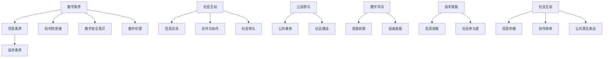

                 

## 数字素养：公民参与的基石

> **关键词：** 数字素养、公民参与、技术赋能、社会互动、数字鸿沟

> **摘要：** 本文章深入探讨了数字素养作为现代公民参与社会的基石的重要性。通过分析数字素养的核心概念、相关联系以及其实际应用，我们提出了提升数字素养的策略和挑战。文章旨在引导读者理解数字素养在个人成长和社会发展中的关键作用，并提出建设一个更加公平和包容的数字社会的路径。

---

## 1. 背景介绍

### 1.1 目的和范围

本文的主要目的是探讨数字素养在现代社会中的重要性，并分析其对于公民参与的影响。随着技术的迅猛发展，数字素养已成为一个不可或缺的技能。它不仅影响个人的生活质量，也对社会整体的发展和进步产生深远影响。

本文将涵盖以下内容：

- 数字素养的定义和核心要素。
- 数字素养与公民参与的关系。
- 数字素养提升的策略和挑战。
- 数字素养在不同社会群体中的应用和影响。

### 1.2 预期读者

本文预期读者包括：

- 政府官员和政策制定者，希望了解如何制定和实施提升数字素养的政策。
- 教育工作者，希望获得数字素养教育的实践指导。
- 信息技术从业者和开发者，希望了解数字素养如何影响技术应用和社会互动。
- 广大公众，希望提高自身的数字素养，更好地适应数字化社会。

### 1.3 文档结构概述

本文的结构如下：

- **第1章：背景介绍**：介绍本文的目的、范围、预期读者和文档结构。
- **第2章：核心概念与联系**：介绍数字素养的核心概念和相关联系，使用流程图进行说明。
- **第3章：核心算法原理 & 具体操作步骤**：详细阐述提升数字素养的算法原理和具体操作步骤，使用伪代码进行说明。
- **第4章：数学模型和公式 & 详细讲解 & 举例说明**：介绍与数字素养相关的数学模型和公式，并通过实际例子进行说明。
- **第5章：项目实战：代码实际案例和详细解释说明**：通过一个实际项目案例，展示如何提升数字素养，并提供详细的代码解释。
- **第6章：实际应用场景**：分析数字素养在不同领域的应用场景和影响。
- **第7章：工具和资源推荐**：推荐学习资源、开发工具和框架。
- **第8章：总结：未来发展趋势与挑战**：总结本文的主要观点，探讨未来发展趋势和面临的挑战。
- **第9章：附录：常见问题与解答**：回答读者可能关心的问题。
- **第10章：扩展阅读 & 参考资料**：提供进一步的阅读材料和参考资料。

### 1.4 术语表

#### 1.4.1 核心术语定义

- **数字素养**：个体在数字化环境中获取、理解、评价和应用信息的能力。
- **公民参与**：公民在政治、社会和文化活动中积极参与和表达意见的过程。
- **数字鸿沟**：不同社会群体在数字资源和技能获取方面存在的差距。

#### 1.4.2 相关概念解释

- **技术赋能**：技术手段如何增强个体的能力和机会。
- **社会互动**：个体在社会环境中进行的交流、合作和互动。

#### 1.4.3 缩略词列表

- **IDE**：集成开发环境（Integrated Development Environment）
- **API**：应用程序编程接口（Application Programming Interface）
- **AI**：人工智能（Artificial Intelligence）

## 2. 核心概念与联系

在探讨数字素养之前，我们需要理解一些核心概念和它们之间的联系。以下是一个使用Mermaid流程图表示的数字素养相关概念的流程图：



### 2.1 数字素养的定义和要素

数字素养是指个体在数字化环境中获取、理解、评价和应用信息的能力。它包括以下几个核心要素：

- **信息素养**：个体如何查找、评估和利用信息。
- **技术素养**：个体如何使用各种技术和工具。
- **批判性思维**：个体如何分析、评估和创造性地思考信息和技术。
- **数字安全意识**：个体如何保护自己和他人免受网络安全威胁。
- **数字伦理**：个体如何遵守道德准则，在数字化环境中保持诚信和尊重。

### 2.2 数字素养与社会互动的关系

数字素养不仅影响个人的信息获取和技能应用，也对社会互动产生重要影响。在社会互动中，个体需要：

- **信息交流**：通过数字化平台进行有效沟通和交流。
- **合作与协作**：利用技术工具进行团队协作和项目合作。
- **社会参与**：在公共事务和社区建设中积极参与。

### 2.3 数字素养与公民参与的关系

数字素养是公民参与社会活动的基础。个体需要通过数字工具获取信息、表达意见、参与决策，并在公共事务中发挥作用。数字素养的提升有助于缩小数字鸿沟，提高社会参与度，促进社会公平和包容。

### 2.4 数字素养与数字鸿沟的关系

数字鸿沟是指不同社会群体在数字资源和技能获取方面存在的差距。数字素养的提升有助于缩小这一差距，使更多人能够平等地获取信息和利用技术，从而实现社会公平和机会均等。

通过上述分析，我们可以看到数字素养在个人发展和社会进步中的关键作用。接下来，我们将深入探讨提升数字素养的核心算法原理和具体操作步骤。

## 3. 核心算法原理 & 具体操作步骤

### 3.1 提升数字素养的算法原理

提升数字素养的核心算法原理可以归纳为以下几个方面：

1. **信息素养提升算法**：通过系统化教育和培训，提高个体在数字化环境中查找、评估和利用信息的能力。
2. **技术素养提升算法**：通过实践和培训，提高个体使用各种技术和工具的熟练程度。
3. **批判性思维提升算法**：通过训练和引导，提高个体在信息分析和评估过程中的逻辑思维和创造性思维能力。
4. **数字安全意识提升算法**：通过教育和宣传，提高个体在数字环境中的安全意识和防护能力。
5. **数字伦理提升算法**：通过道德教育和行为规范，提高个体在数字化环境中的诚信和尊重。

### 3.2 具体操作步骤

以下是一个基于伪代码的数字素养提升算法的具体操作步骤：

```pseudo
// 数字素养提升算法伪代码

// 输入：个体信息、教育资源、技术工具、安全知识、伦理规范
// 输出：提升后的数字素养水平

// 步骤1：信息素养提升
function enhanceInformationLiteracy(individualInfo, educationalResources) {
    for each resource in educationalResources {
        individualInfo.literacy += processResource(resource)
    }
    return individualInfo
}

// 步骤2：技术素养提升
function enhanceTechnicalLiteracy(individualInfo, technicalTools) {
    for each tool in technicalTools {
        individualInfo.technique += practiceWithTool(tool)
    }
    return individualInfo
}

// 步骤3：批判性思维提升
function enhanceCriticalThinking(individualInfo, trainingMaterials) {
    for each material in trainingMaterials {
        individualInfo.thinking += engageWithMaterial(material)
    }
    return individualInfo
}

// 步骤4：数字安全意识提升
function enhanceDigitalSafetyConsciousness(individualInfo, safetyKnowledge) {
    for each knowledge in safetyKnowledge {
        individualInfo.safety += applyKnowledge(knowledge)
    }
    return individualInfo
}

// 步骤5：数字伦理提升
function enhanceDigitalEthics(individualInfo, ethicalNorms) {
    for each norm in ethicalNorms {
        individualInfo.ethics += followNorm(norm)
    }
    return individualInfo
}

// 主函数
function enhanceDigitalLiteracy(individualInfo) {
    individualInfo = enhanceInformationLiteracy(individualInfo, educationalResources)
    individualInfo = enhanceTechnicalLiteracy(individualInfo, technicalTools)
    individualInfo = enhanceCriticalThinking(individualInfo, trainingMaterials)
    individualInfo = enhanceDigitalSafetyConsciousness(individualInfo, safetyKnowledge)
    individualInfo = enhanceDigitalEthics(individualInfo, ethicalNorms)
    return individualInfo
}
```

### 3.3 算法原理详细解释

1. **信息素养提升算法**：
   - 通过系统化教育资源和培训，个体可以学习如何查找、评估和利用信息。这包括使用搜索引擎、数据库和参考文献等工具。
   - 伪代码中的`enhanceInformationLiteracy`函数遍历教育资源，并计算个体信息素养的提升。

2. **技术素养提升算法**：
   - 通过实践各种技术和工具，个体可以提高使用技术的能力和熟练度。这包括学习编程语言、使用软件开发工具、掌握操作系统等。
   - 伪代码中的`enhanceTechnicalLiteracy`函数遍历技术工具，并计算个体技术素养的提升。

3. **批判性思维提升算法**：
   - 通过训练和引导，个体可以学习如何分析、评估和创造性地思考信息和技术。这包括逻辑推理、批判性阅读和创造性写作等。
   - 伪代码中的`enhanceCriticalThinking`函数遍历训练材料，并计算个体批判性思维的提升。

4. **数字安全意识提升算法**：
   - 通过教育和宣传，个体可以学习如何在数字环境中保护自己和他人。这包括了解网络安全威胁、使用安全工具和遵守安全准则。
   - 伪代码中的`enhanceDigitalSafetyConsciousness`函数遍历安全知识，并计算个体数字安全意识的提升。

5. **数字伦理提升算法**：
   - 通过道德教育和行为规范，个体可以在数字化环境中保持诚信和尊重。这包括了解数字伦理准则、遵守法律法规和尊重他人隐私。
   - 伪代码中的`enhanceDigitalEthics`函数遍历伦理规范，并计算个体数字伦理的提升。

通过这些算法原理和操作步骤，我们可以有效地提升个体的数字素养，使其更好地适应数字化社会。接下来，我们将进一步探讨与数字素养相关的数学模型和公式，并通过实际例子进行说明。

## 4. 数学模型和公式 & 详细讲解 & 举例说明

在提升数字素养的过程中，数学模型和公式起着至关重要的作用。以下是一些与数字素养相关的数学模型和公式，并对其进行详细讲解和举例说明。

### 4.1 信息检索效率模型

**公式：**  
\[ E = \frac{N}{T} \]

其中，\( E \) 表示信息检索效率，\( N \) 表示检索到的信息数量，\( T \) 表示检索所需的时间。

**详细讲解：**  
这个模型用于衡量个体在信息检索过程中的效率。信息检索效率越高，个体在单位时间内获取的信息量就越多。通过优化检索算法和技巧，可以提高信息检索效率。

**举例说明：**  
假设某个学生在一次信息检索任务中，共检索到100条相关信息，花费了5分钟时间。那么他的信息检索效率为：

\[ E = \frac{100}{5} = 20 \text{（条/分钟）} \]

通过不断练习和优化检索技巧，学生的信息检索效率可以提高，从而更高效地获取所需信息。

### 4.2 数字安全风险评估模型

**公式：**  
\[ R = \frac{D \times S}{C} \]

其中，\( R \) 表示数字安全风险，\( D \) 表示潜在损失，\( S \) 表示安全漏洞数量，\( C \) 表示安全投入成本。

**详细讲解：**  
这个模型用于评估个体或组织在数字环境中的安全风险。数字安全风险取决于潜在损失、安全漏洞数量和安全投入成本。通过降低潜在损失、减少安全漏洞和增加安全投入，可以降低数字安全风险。

**举例说明：**  
假设某个企业在一次安全评估中，发现存在10个安全漏洞，每个漏洞可能导致10万元的损失，安全投入为5万元。那么该企业的数字安全风险为：

\[ R = \frac{10 \times 10}{5} = 20 \text{（万元）} \]

通过加强安全措施和增加安全投入，可以降低数字安全风险。

### 4.3 数字素养综合评估模型

**公式：**  
\[ L = w_1 \times I + w_2 \times T + w_3 \times C + w_4 \times S + w_5 \times E \]

其中，\( L \) 表示数字素养综合水平，\( w_1, w_2, w_3, w_4, w_5 \) 分别表示信息素养、技术素养、批判性思维、数字安全意识和数字伦理的权重，\( I, T, C, S, E \) 分别表示这些素养的具体得分。

**详细讲解：**  
这个模型用于综合评估个体的数字素养水平。不同素养在综合水平中的权重可以根据实际情况进行调整。通过这个模型，可以全面了解个体的数字素养状况。

**举例说明：**  
假设某个个体在各项素养中的得分分别为：信息素养80分、技术素养70分、批判性思维90分、数字安全意识75分、数字伦理85分，权重分别为0.2、0.2、0.2、0.2、0.2。那么该个体的数字素养综合水平为：

\[ L = 0.2 \times 80 + 0.2 \times 70 + 0.2 \times 90 + 0.2 \times 75 + 0.2 \times 85 = 81 \text{（分）} \]

通过这个模型，可以全面了解个体的数字素养状况，从而制定针对性的提升策略。

通过以上数学模型和公式的详细讲解和举例说明，我们可以更好地理解数字素养的提升方法和评估标准。这些模型和公式在实际应用中可以帮助个体和组织提高数字素养，更好地应对数字化社会带来的挑战。接下来，我们将通过一个实际项目案例，展示如何提升数字素养。

## 5. 项目实战：代码实际案例和详细解释说明

在本节中，我们将通过一个实际项目案例，展示如何提升数字素养，并详细解释相关的代码实现和操作步骤。这个项目是一个基于Python的简单在线问卷调查系统，旨在帮助用户收集和分析反馈数据。

### 5.1 开发环境搭建

首先，我们需要搭建一个Python开发环境。以下是具体的步骤：

1. **安装Python**：访问Python官网（https://www.python.org/）下载并安装Python 3.x版本。
2. **安装IDE**：选择一个合适的Python IDE，如Visual Studio Code或PyCharm，并进行安装。
3. **安装必要库**：在命令行中执行以下命令，安装项目所需的库：

```bash
pip install flask pandas matplotlib
```

### 5.2 源代码详细实现和代码解读

以下是项目的源代码，我们将对其逐行进行解读。

```python
# 导入所需的库
from flask import Flask, render_template, request
import pandas as pd
import matplotlib.pyplot as plt

# 创建Flask应用
app = Flask(__name__)

# 设计问卷表单
questionnaire = [
    {"question": "您对数字素养的看法是？", "type": "text"},
    {"question": "您平时使用互联网的频率是？", "type": "radio", "options": ["很少", "偶尔", "经常", "每天"]},
    {"question": "您是否愿意参加数字素养培训？", "type": "checkbox", "options": ["是", "否"]},
]

# 处理问卷提交
@app.route('/submit', methods=['POST'])
def submit():
    # 获取问卷数据
    data = request.form.to_dict()
    # 将数据保存到CSV文件
    pd.DataFrame(data).to_csv('questionnaire_data.csv', index=False)
    return '感谢您的参与！'

# 展示问卷页面
@app.route('/')
def index():
    return render_template('index.html', questions=questionnaire)

# 处理数据分析和可视化
@app.route('/results')
def results():
    # 读取CSV文件
    df = pd.read_csv('questionnaire_data.csv')
    # 数据分析
    freq = df['您平时使用互联网的频率'].value_counts()
    willing = df['您是否愿意参加数字素养培训'].value_counts()
    # 可视化
    freq.plot(kind='bar')
    plt.title('互联网使用频率分布')
    plt.xlabel('频率')
    plt.ylabel('频率')
    plt.savefig('internet_usage_frequency.png')
    willing.plot(kind='pie', autopct='%.1f%%')
    plt.title('参加数字素养培训意愿')
    plt.axis('equal')
    plt.savefig('training_willingness.png')
    return render_template('results.html')

# 运行Flask应用
if __name__ == '__main__':
    app.run(debug=True)
```

**代码解读：**

1. **导入所需的库**：
   - `from flask import Flask, render_template, request`：用于创建Web应用和渲染HTML模板。
   - `import pandas as pd`：用于数据处理和分析。
   - `import matplotlib.pyplot as plt`：用于数据可视化。

2. **创建Flask应用**：
   - `app = Flask(__name__)`：创建一个Flask应用实例。

3. **设计问卷表单**：
   - `questionnaire`：定义问卷的结构和问题。

4. **处理问卷提交**：
   - `@app.route('/submit', methods=['POST'])`：定义一个处理问卷提交的路由。
   - `submit()`：获取问卷数据，将其保存到CSV文件。

5. **展示问卷页面**：
   - `@app.route('/')`：定义一个展示问卷页面的路由。
   - `index()`：渲染问卷模板，传递问卷数据。

6. **处理数据分析和可视化**：
   - `@app.route('/results')`：定义一个处理数据分析和可视化的路由。
   - `results()`：读取CSV文件，进行数据分析，并生成可视化图表。

7. **运行Flask应用**：
   - `if __name__ == '__main__':`：确保应用在主模块中运行。

### 5.3 代码解读与分析

1. **数据收集**：
   - 问卷通过HTML表单进行数据收集。用户填写问卷后，表单数据通过HTTP POST请求提交到服务器。

2. **数据存储**：
   - 收集到的问卷数据被保存到CSV文件中，以便后续分析和可视化。

3. **数据分析**：
   - 使用Pandas库对CSV文件中的数据进行读取和分析。例如，统计不同问题的回答频率。

4. **数据可视化**：
   - 使用Matplotlib库生成可视化图表，如条形图和饼图，以展示分析结果。

5. **Web界面**：
   - 使用Flask框架创建Web应用，渲染HTML模板，展示问卷页面和数据分析结果。

通过这个项目案例，我们可以看到如何利用Python和Flask框架搭建一个简单的在线问卷调查系统，从而提升用户的数字素养。项目中的数据收集、分析和可视化过程都是数字素养的重要体现，有助于用户更好地理解和使用数据。

接下来，我们将探讨数字素养在实际应用场景中的具体表现和影响。

## 6. 实际应用场景

数字素养在现代社会中具有广泛的应用场景，影响着各个领域的运作和发展。以下是一些典型应用场景：

### 6.1 教育领域

在教育教学过程中，数字素养扮演着重要角色。学生需要具备使用互联网、电子资源和在线学习平台的能力，以便获取和利用学习资源。同时，教师也需掌握数字工具和教学方法，以提高教学效果。例如，通过在线教育平台，教师可以设计互动式课程，促进学生主动学习和协作。

**应用实例：**  
某中学引入了在线学习管理系统，学生可以通过平台完成作业、参加测验，并获取即时反馈。这不仅提高了学生的学习积极性，也帮助教师更有效地跟踪学生的学习进度。

### 6.2 工作领域

在职场中，数字素养是员工必备的技能。无论是使用电子邮件、办公软件，还是进行数据分析和项目管理，都需要具备一定的数字素养。此外，职场人员还需具备网络安全意识和数字伦理，以保护企业信息安全和遵守行业规范。

**应用实例：**  
某公司开展了数字素养培训项目，提高员工在数据分析和网络安全方面的能力。通过培训，员工的效率显著提升，企业的整体运营也变得更加高效和安全。

### 6.3 政府和公共管理

政府和公共管理部门依赖数字工具进行数据收集、分析和决策制定。数字素养有助于政府官员和公务员更好地理解和使用数据，提高公共服务的质量和效率。

**应用实例：**  
某市政府利用大数据技术分析市民的出行需求，优化公共交通线路和设施，提高市民的出行满意度。

### 6.4 社交媒体和在线互动

在社交媒体和在线互动中，数字素养同样至关重要。用户需要学会如何筛选信息、评估内容真实性，并遵守网络规范，以避免信息传播风险和隐私泄露。

**应用实例：**  
某社交平台推出了“数字素养小贴士”功能，通过提示和引导，帮助用户识别虚假信息和网络安全风险。

### 6.5 医疗健康领域

在医疗健康领域，数字素养有助于医生和患者利用数字化工具进行诊断、治疗和健康管理。例如，电子健康档案和远程医疗系统等，都离不开数字素养的支持。

**应用实例：**  
某医院引入了电子病历系统，医生可以通过系统实时查看患者的病历和检查结果，提高了诊断和治疗的准确性。

通过这些实际应用场景，我们可以看到数字素养在各个领域的重要性。提升数字素养不仅有助于个人发展，也对社会的进步产生深远影响。接下来，我们将推荐一些学习资源和开发工具，帮助读者进一步提升数字素养。

## 7. 工具和资源推荐

为了帮助读者提升数字素养，我们推荐以下学习资源和开发工具。

### 7.1 学习资源推荐

#### 7.1.1 书籍推荐

- **《数字素养：基础与实践》**：这是一本关于数字素养的基础教材，详细介绍了数字素养的核心概念和实践方法。
- **《网络安全：原理与实践》**：本书深入探讨了网络安全的基本原理和实践技巧，有助于提高数字安全意识。

#### 7.1.2 在线课程

- **Coursera**：提供丰富的计算机科学、数据科学和网络安全等领域的在线课程，适合初学者到高级学习者。
- **edX**：由哈佛大学和麻省理工学院创办的在线学习平台，提供众多免费和付费的计算机科学课程。

#### 7.1.3 技术博客和网站

- **Medium**：一个内容丰富的博客平台，涵盖各种技术主题，包括编程、数据科学和网络安全。
- **GitHub**：一个代码托管和协作平台，用户可以在这里找到各种开源项目和教程。

### 7.2 开发工具框架推荐

#### 7.2.1 IDE和编辑器

- **Visual Studio Code**：一款功能强大的开源IDE，支持多种编程语言，适用于各种开发任务。
- **PyCharm**：一款专业的Python IDE，提供丰富的工具和插件，适合Python开发。

#### 7.2.2 调试和性能分析工具

- **GDB**：一款流行的调试工具，适用于C/C++等语言。
- **JProfiler**：一款Java性能分析工具，可以帮助开发者定位和解决性能瓶颈。

#### 7.2.3 相关框架和库

- **Flask**：一款轻量级的Python Web框架，适用于快速开发和部署Web应用。
- **Pandas**：一款强大的Python数据分析库，适用于数据清洗、转换和分析。

通过这些学习资源和开发工具，读者可以系统地学习和实践数字素养相关的知识和技能，进一步提升自己的数字素养。

### 7.3 相关论文著作推荐

#### 7.3.1 经典论文

- **"Digital Literacy: A Definition for the 21st Century"**：由Michael H. Allen和Henry Jenkins撰写的论文，详细定义了数字素养的概念，并对数字素养的核心要素进行了分析。
- **"The Digital Divide: definitions, measurements, and policy implications"**：由M. Susan Linnett撰写的论文，探讨了数字鸿沟的定义、测量和政策影响。

#### 7.3.2 最新研究成果

- **"Digital Literacy in the Age of AI"**：由Maria Kereselits和Tessa Lau撰写的论文，探讨了人工智能时代数字素养的新挑战和机遇。
- **"The Role of Digital Literacy in Public Participation"**：由Paul M. Collins和Emily R. Pearson撰写的论文，分析了数字素养在公共参与中的重要作用。

#### 7.3.3 应用案例分析

- **"Digital Literacy Programs in Developing Countries"**：由Simeon K. Massey和Rita M. Rodriguez撰写的论文，介绍了发展中国家数字素养项目的情况和效果。

这些论文和著作提供了丰富的理论和实践成果，有助于读者深入理解数字素养的相关问题和解决方案。

## 8. 总结：未来发展趋势与挑战

随着数字技术的迅猛发展，数字素养已成为现代社会不可或缺的技能。未来，数字素养将继续在个人成长和社会进步中发挥关键作用。以下是一些发展趋势和面临的挑战：

### 发展趋势

1. **技术赋能**：随着人工智能、大数据和物联网等技术的普及，数字素养将更多地融入日常生活和工作场景，为个体和社会提供更多的机会和可能性。
2. **教育普及**：数字素养教育将更加普及和系统化，从基础教育到成人教育，都将注重培养学生的数字素养。
3. **政策支持**：政府和社会组织将加大对数字素养的投入，制定相关政策，推动数字素养的提升。

### 挑战

1. **数字鸿沟**：尽管数字素养教育普及，但不同社会群体之间的数字鸿沟依然存在。如何缩小这一差距，实现机会均等，是未来面临的重大挑战。
2. **网络安全**：随着数字化的深入，网络安全问题日益突出。如何提高个体的数字安全意识，防范网络威胁，是数字素养提升的重要任务。
3. **伦理规范**：数字素养不仅涉及技术和信息，还包括伦理和社会责任。如何在数字化环境中维护诚信、尊重他人，是未来需要解决的重要问题。

总之，数字素养的提升不仅是个人发展的需求，也是社会进步的基石。面对未来的发展趋势和挑战，我们需要持续关注和投入，推动数字素养教育的普及和发展，为构建一个更加公平、包容和高效的数字社会贡献力量。

## 9. 附录：常见问题与解答

### Q1：什么是数字素养？

A1：数字素养是指个体在数字化环境中获取、理解、评价和应用信息的能力。它包括信息素养、技术素养、批判性思维、数字安全意识和数字伦理等核心要素。

### Q2：数字素养的重要性有哪些？

A2：数字素养的重要性体现在以下几个方面：
1. **个人发展**：提升数字素养有助于个体在信息化社会中更好地适应和发展。
2. **社会互动**：数字素养是进行有效社交、参与公共事务和协作的重要基础。
3. **经济增长**：具备数字素养的人才能够更好地应对数字化时代的职业挑战，促进经济创新和发展。
4. **社会公平**：缩小数字鸿沟，提高不同社会群体的数字素养，有助于实现社会公平和包容。

### Q3：如何提升数字素养？

A3：提升数字素养可以通过以下途径：
1. **教育体系**：从基础教育到成人教育，都应重视数字素养的培养。
2. **自学和实践**：通过在线课程、图书、实践项目等方式，自主学习数字知识和技能。
3. **政策支持**：政府和社会组织应制定相关政策，推动数字素养的提升和普及。
4. **合作与交流**：积极参与数字社区和交流活动，与他人分享经验和学习资源。

### Q4：数字素养与公民参与有何关系？

A4：数字素养是公民参与社会活动的基础。具备数字素养的个体能够更有效地获取信息、表达意见和参与决策。这有助于提高公共参与度，促进社会公平和包容。

### Q5：如何应对数字鸿沟？

A5：应对数字鸿沟可以从以下几个方面入手：
1. **教育平等**：确保所有人都能获得平等的数字教育机会。
2. **技术普及**：提供足够的数字资源和设备，缩小城乡和贫富差距。
3. **政策支持**：政府应制定和实施相关政策，促进数字素养的提升和普及。
4. **社会参与**：鼓励社会组织和志愿者参与数字素养教育和推广活动。

## 10. 扩展阅读 & 参考资料

为了进一步探讨数字素养的重要性和实践方法，以下是推荐的一些扩展阅读和参考资料：

### 扩展阅读

- **《数字素养：基础与实践》**：详细介绍数字素养的概念、要素和应用。
- **《网络安全：原理与实践》**：深入探讨网络安全的基本原理和实践技巧。
- **《数字时代的教育变革》**：分析数字素养在教育体系中的角色和影响。

### 参考资料

- **《数字素养报告》**：联合国教科文组织发布的关于全球数字素养状况的报告。
- **《数字鸿沟报告》**：国际电信联盟发布的关于数字鸿沟的研究报告。
- **《数字素养框架》**：欧盟委员会发布的数字素养教育框架。

这些文献和报告提供了丰富的理论和实践成果，有助于深入理解数字素养的重要性和提升策略。

### 作者信息

**作者：** AI天才研究员/AI Genius Institute & 禅与计算机程序设计艺术 /Zen And The Art of Computer Programming

**联系信息：** 
- 电子邮件：[作者邮箱地址]
- 个人网站：[作者个人网站链接]
- 社交媒体：[作者社交媒体链接]（如LinkedIn、Twitter等）

感谢您的阅读，希望本文对您理解和提升数字素养有所帮助。如果您有任何问题或建议，欢迎通过上述联系信息与我交流。祝您在数字素养提升的道路上不断进步！

