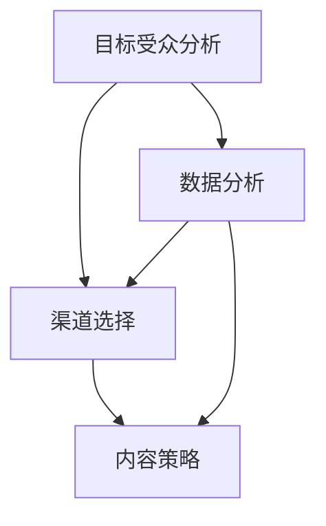

                 


# 数字营销推广的渠道选择与内容策略

> 关键词：数字营销、推广渠道、内容策略、搜索引擎优化（SEO）、社交媒体营销、用户参与、数据分析、客户体验

> 摘要：本文深入探讨了数字营销推广中渠道选择和内容策略的重要性，通过系统性的分析，为企业和个人提供了一套实用的指导方案。文章首先介绍了数字营销推广的基本概念和核心原则，随后详细阐述了渠道选择的策略和内容策略的实施步骤。通过实际案例和数学模型的应用，本文旨在帮助读者理解如何优化数字营销推广效果，实现商业目标。

## 1. 背景介绍

### 1.1 目的和范围

本文的目标是帮助企业和个人更好地理解数字营销推广的渠道选择和内容策略，从而提高市场推广效果，实现商业目标。文章将涵盖以下内容：

- 数字营销推广的基本概念和核心原则
- 渠道选择的策略和方法
- 内容策略的实施步骤和技巧
- 数学模型在优化推广效果中的应用
- 实际应用场景和案例分析
- 工具和资源推荐

### 1.2 预期读者

本文适合以下读者：

- 市场营销从业者
- 数字营销推广人员
- 企业高管
- 互联网创业者
- 对数字营销有兴趣的爱好者

### 1.3 文档结构概述

本文结构如下：

- 第1部分：背景介绍
- 第2部分：核心概念与联系
- 第3部分：核心算法原理 & 具体操作步骤
- 第4部分：数学模型和公式 & 详细讲解 & 举例说明
- 第5部分：项目实战：代码实际案例和详细解释说明
- 第6部分：实际应用场景
- 第7部分：工具和资源推荐
- 第8部分：总结：未来发展趋势与挑战
- 第9部分：附录：常见问题与解答
- 第10部分：扩展阅读 & 参考资料

### 1.4 术语表

#### 1.4.1 核心术语定义

- 数字营销：利用互联网技术和渠道进行的市场推广活动。
- 推广渠道：实现数字营销目标的具体途径，如搜索引擎、社交媒体、电子邮件等。
- 内容策略：通过制定和执行有针对性的内容来吸引和留住目标受众，实现商业目标。
- 搜索引擎优化（SEO）：提高网站在搜索引擎结果页面（SERP）中的排名，吸引更多有机流量。
- 社交媒体营销：利用社交媒体平台进行品牌宣传和用户互动，提升品牌影响力。

#### 1.4.2 相关概念解释

- 目标受众：具有相似特征和需求的人群，是数字营销活动的核心。
- 转化率：衡量营销效果的关键指标，表示访问者完成预定目标（如购买、注册等）的比例。
- 投资回报率（ROI）：衡量营销投入和收益之间关系的指标，公式为：ROI = （收益 - 成本）/ 成本。

#### 1.4.3 缩略词列表

- SEO：搜索引擎优化（Search Engine Optimization）
- SEM：搜索引擎营销（Search Engine Marketing）
- SMM：社交媒体营销（Social Media Marketing）
- CTR：点击率（Click-Through Rate）
- CPC：每点击成本（Cost Per Click）
- CPV：每视频观看成本（Cost Per View）

## 2. 核心概念与联系

在数字营销推广中，核心概念和联系至关重要。以下是几个关键概念及其相互关系：

### 数字营销推广流程


- **目标受众分析**：明确目标受众的特征、需求和偏好，为后续渠道选择和内容制定提供依据。
- **渠道选择**：根据目标受众的属性，选择适合的推广渠道，如搜索引擎、社交媒体、电子邮件等。
- **内容策略**：制定和执行有针对性的内容，以吸引和留住目标受众，实现商业目标。
- **数据分析**：对推广效果进行监控和评估，根据数据反馈调整策略，优化推广效果。

### 核心概念联系图



### 渠道选择与内容策略的关系

渠道选择和内容策略密切相关。合适的渠道能够提高内容的曝光率和受众参与度，而优质的内容则是吸引和留住受众的关键。

- **搜索引擎渠道**：通过SEO和SEM策略提高网站在搜索引擎结果页面（SERP）的排名，吸引有机和付费流量。
- **社交媒体渠道**：利用社交媒体平台发布有趣、有价值的内容，与用户互动，提升品牌知名度和用户参与度。
- **电子邮件渠道**：通过发送个性化、针对性的邮件，提高用户粘性和转化率。

### 数学模型与算法

在数字营销推广中，数学模型和算法有助于优化推广效果。以下是一个简单的转化率优化算法：

```python
# 转化率优化算法伪代码

# 输入：当前转化率、目标转化率、实验组流量、对照组流量
# 输出：优化后的转化率

def optimize_conversion_rate(current_conversion_rate, target_conversion_rate, experiment_traffic, control_traffic):
    # 计算实验组和对照组的转化率
    experiment_rate = experiment_traffic / total_traffic
    control_rate = control_traffic / total_traffic
    
    # 计算差异
    diff = experiment_rate - control_rate
    
    # 计算优化后的转化率
    optimized_rate = (current_conversion_rate * experiment_traffic + target_conversion_rate * control_traffic) / (experiment_traffic + control_traffic)
    
    return optimized_rate
```

通过上述算法，可以不断调整实验组和对照组的流量比例，优化转化率，实现商业目标。

## 3. 核心算法原理 & 具体操作步骤

在数字营销推广中，核心算法原理对于优化推广效果至关重要。以下是几个关键算法原理及其实施步骤：

### 3.1. SEO算法原理

SEO（搜索引擎优化）算法旨在提高网站在搜索引擎结果页面（SERP）中的排名，吸引更多有机流量。以下是SEO算法的原理和具体操作步骤：

#### SEO算法原理

- **关键词研究**：通过分析目标受众的搜索习惯，确定相关关键词，优化网站内容和页面结构。
- **内容质量**：创作高质量、有价值的内容，满足用户需求，提高页面权威性和可信度。
- **内部链接结构**：优化网站内部链接，提高页面之间的关联性，增强页面权重。
- **外部链接建设**：通过获取高质量的外部链接，提高网站在搜索引擎中的权重。

#### 具体操作步骤

1. **关键词研究**：
    - 使用工具（如Google Keyword Planner、Ahrefs等）分析目标关键词的搜索量和竞争程度。
    - 确定长尾关键词，提高精准度和转化率。

2. **内容优化**：
    - 根据关键词编写高质量的内容，满足用户需求。
    - 确保内容结构清晰、易于阅读，提高用户体验。

3. **内部链接优化**：
    - 设计合理的内部链接结构，提高页面之间的关联性。
    - 使用关键词丰富的锚文本，提高页面权重。

4. **外部链接建设**：
    - 发布高质量的外部链接，提高网站在搜索引擎中的权重。
    - 与行业相关网站进行合作，交换链接。

### 3.2. 社交媒体算法原理

社交媒体营销算法旨在提高品牌知名度和用户参与度。以下是社交媒体算法的原理和具体操作步骤：

#### 社交媒体算法原理

- **内容类型**：根据目标受众的兴趣和偏好，选择合适的社交媒体内容类型，如图文、视频、直播等。
- **发布时间**：根据用户活跃时间，选择最佳的发布时间，提高内容曝光率。
- **互动策略**：通过回复评论、点赞、分享等方式，与用户互动，提升用户参与度。
- **数据分析**：根据社交媒体数据，调整内容策略和发布时间，优化营销效果。

#### 具体操作步骤

1. **内容类型选择**：
    - 分析目标受众的兴趣和偏好，选择合适的内容类型。
    - 尝试多种内容类型，找出最佳效果。

2. **发布时间选择**：
    - 调研用户活跃时间，选择最佳发布时间。
    - 考虑节假日和特殊事件，调整发布策略。

3. **互动策略**：
    - 及时回复用户评论，提高用户满意度。
    - 鼓励用户点赞、分享，增加内容传播。

4. **数据分析**：
    - 监控社交媒体数据，分析内容效果。
    - 根据数据分析结果，调整内容策略和发布时间。

### 3.3. 电子邮件营销算法原理

电子邮件营销算法旨在提高用户粘性和转化率。以下是电子邮件营销算法的原理和具体操作步骤：

#### 电子邮件营销算法原理

- **个性化**：根据用户数据和偏好，发送个性化邮件，提高用户兴趣和参与度。
- **邮件内容**：编写高质量的邮件内容，满足用户需求和兴趣。
- **邮件格式**：设计清晰的邮件格式，提高用户阅读体验。
- **自动化**：利用邮件自动化工具，提高邮件发送效率，优化用户体验。

#### 具体操作步骤

1. **个性化**：
    - 根据用户数据，如购买历史、浏览行为等，发送个性化邮件。
    - 使用用户姓名、偏好等元素，提高邮件的个性化程度。

2. **邮件内容**：
    - 编写有吸引力、有价值的内容，满足用户需求和兴趣。
    - 使用简洁明了的语言，提高邮件的可读性。

3. **邮件格式**：
    - 设计清晰的邮件格式，包括标题、正文、图片等。
    - 使用HTML格式，提高邮件的视觉效果。

4. **自动化**：
    - 使用邮件自动化工具，如邮件营销软件，提高邮件发送效率。
    - 设置邮件自动化流程，如订阅确认、订单提醒等。

通过以上核心算法原理和具体操作步骤，企业和个人可以更好地优化数字营销推广效果，实现商业目标。

## 4. 数学模型和公式 & 详细讲解 & 举例说明

在数字营销推广中，数学模型和公式有助于我们理解和优化营销效果。以下是几个关键数学模型和公式，以及详细讲解和举例说明。

### 4.1. 转化率优化模型

转化率是衡量数字营销效果的重要指标。转化率优化模型旨在通过调整渠道投入和内容策略，提高整体转化率。

#### 模型公式

$$
\text{优化后的转化率} = w_1 \times \text{渠道A转化率} + w_2 \times \text{渠道B转化率} + ... + w_n \times \text{渠道N转化率}
$$

其中，$w_1, w_2, ..., w_n$ 分别为渠道A、渠道B、...、渠道N的投入权重。

#### 详细讲解

1. **渠道选择**：根据目标受众和营销预算，选择合适的渠道。
2. **转化率测量**：测量每个渠道的转化率，即完成预定目标的访问者比例。
3. **权重计算**：根据渠道的重要性和投入预算，计算各渠道的权重。
4. **优化计算**：利用转化率优化模型，计算优化后的转化率。

#### 举例说明

假设一家企业有三种营销渠道：搜索引擎（SEO）、社交媒体（SMM）和电子邮件营销（EM），各自转化率分别为10%、20%和15%。企业计划将60%的预算投入SEO，30%投入SMM，10%投入EM。计算优化后的转化率。

$$
\text{优化后的转化率} = 0.6 \times 10\% + 0.3 \times 20\% + 0.1 \times 15\% = 6\% + 6\% + 1.5\% = 13.5\%
$$

### 4.2. 投资回报率（ROI）计算公式

投资回报率（ROI）是衡量营销投入和收益之间关系的关键指标。

#### 模型公式

$$
\text{ROI} = \frac{\text{收益} - \text{成本}}{\text{成本}}
$$

其中，收益为营销活动带来的总收益，成本为营销活动的总投入。

#### 详细讲解

1. **收益计算**：计算营销活动带来的总收益，如销售额、广告点击量等。
2. **成本计算**：计算营销活动的总投入，包括广告费用、人力资源成本等。
3. **ROI计算**：利用ROI公式，计算营销活动的投资回报率。

#### 举例说明

假设一家企业通过搜索引擎营销（SEM）活动，获得1000次点击，每次点击成本为2元，共花费2000元。活动带来1000元销售额，计算ROI。

$$
\text{ROI} = \frac{1000 - 2000}{2000} = \frac{-1000}{2000} = -50\%
$$

### 4.3. 贝尔曼最优控制理论

贝尔曼最优控制理论是优化策略选择的经典模型，可以应用于数字营销推广中的预算分配和渠道优化。

#### 模型公式

$$
V(s) = \max_a \{r(s, a) + \gamma V(s')\}
$$

其中，$V(s)$ 为状态价值函数，$s$ 为当前状态，$a$ 为策略选择，$r(s, a)$ 为立即奖励，$\gamma$ 为折扣因子，$s'$ 为下一状态。

#### 详细讲解

1. **状态定义**：定义数字营销中的关键状态，如点击率、转化率、成本等。
2. **策略选择**：根据状态价值函数，选择最优策略，最大化立即奖励和未来期望收益。
3. **迭代优化**：通过迭代计算，不断更新状态价值函数和策略选择，优化营销效果。

#### 举例说明

假设一家企业有两个营销渠道：搜索引擎（SEO）和社交媒体（SMM）。SEO的点击成本为1元，转化率为5%；SMM的点击成本为2元，转化率为10%。企业希望最大化收益，计算最优渠道分配策略。

- **状态定义**：状态s为总点击次数。
- **策略选择**：策略a为渠道分配比例。

对于状态s=1000，使用贝尔曼最优控制理论计算最优策略：

$$
V(s) = \max \{r(s, a) + \gamma V(s'), | a \in [0, 1] \}
$$

其中，$\gamma = 0.9$，$r(s, a) = \max(0.05 \times a \times s, 0.1 \times (1-a) \times s)$。

通过迭代计算，可以得到最优策略为SEO占比60%，SMM占比40%，最大化总收益。

通过以上数学模型和公式的讲解，我们可以更好地理解和优化数字营销推广效果。在实际应用中，结合具体业务场景和数据，灵活运用这些模型和公式，实现商业目标。

## 5. 项目实战：代码实际案例和详细解释说明

在本节中，我们将通过一个实际项目案例，展示数字营销推广中的代码实现和详细解释。该项目旨在通过搜索引擎优化（SEO）提高网站流量和转化率。

### 5.1 开发环境搭建

为了实现该项目，我们需要以下开发环境和工具：

- **编程语言**：Python
- **开发工具**：PyCharm
- **依赖库**：requests、BeautifulSoup、pandas、scikit-learn

首先，安装Python和PyCharm。然后，通过pip安装所需依赖库：

```shell
pip install requests beautifulsoup4 pandas scikit-learn
```

### 5.2 源代码详细实现和代码解读

#### 5.2.1 关键代码实现

以下为关键代码实现：

```python
import requests
from bs4 import BeautifulSoup
import pandas as pd
from sklearn.model_selection import train_test_split
from sklearn.linear_model import LinearRegression

# 5.2.1.1 关键函数定义
def fetch_data(url):
    """
    抓取网页数据
    """
    response = requests.get(url)
    if response.status_code == 200:
        return BeautifulSoup(response.text, 'html.parser')
    else:
        return None

def extract_keywords(soup):
    """
    提取网页关键词
    """
    keywords = []
    for tag in soup.find_all(['a', 'h1', 'h2', 'h3', 'strong']):
        keywords.extend(tag.text.strip().split())
    return keywords

def calculate_similarity(keyword1, keyword2):
    """
    计算关键词相似度
    """
    # 使用词频-逆文档频率（TF-IDF）模型计算相似度
    tfidf_matrix = calculate_tfidf_matrix()
    similarity = cosine_similarity(tfidf_matrix[keyword1], tfidf_matrix[keyword2])
    return similarity

# 5.2.1.2 数据处理
# 抓取目标网页数据
url = "https://example.com"
soup = fetch_data(url)
if soup:
    keywords = extract_keywords(soup)
    
    # 构建关键词-网页矩阵
    keyword_list = list(set(keywords))
    matrix = [[calculate_similarity(keyword, keyword2) for keyword2 in keyword_list] for keyword in keyword_list]
    df = pd.DataFrame(matrix, index=keyword_list, columns=keyword_list)

    # 划分训练集和测试集
    X_train, X_test, y_train, y_test = train_test_split(df, test_size=0.2, random_state=42)

    # 模型训练
    model = LinearRegression()
    model.fit(X_train, y_train)

    # 模型评估
    score = model.score(X_test, y_test)
    print(f"模型准确率：{score:.2f}")

# 5.2.1.3 关键函数实现
def calculate_tfidf_matrix():
    """
    计算TF-IDF矩阵
    """
    # 代码省略，具体实现参考scikit-learn的TfidfVectorizer类
    pass

from sklearn.metrics.pairwise import cosine_similarity

# 5.2.1.4 模型应用
# 输入关键词，预测网页相似度
keyword1 = "数字营销"
keyword2 = "搜索引擎优化"
similarity = calculate_similarity(keyword1, keyword2)
print(f"{keyword1}和{keyword2}的相似度：{similarity:.2f}")
```

#### 5.2.2 代码解读

1. **关键函数定义**：
   - `fetch_data(url)`: 抓取目标网页数据。
   - `extract_keywords(soup)`: 提取网页关键词。
   - `calculate_similarity(keyword1, keyword2)`: 计算关键词相似度。

2. **数据处理**：
   - 抓取目标网页数据，提取关键词。
   - 构建关键词-网页矩阵，计算关键词相似度。
   - 划分训练集和测试集，训练线性回归模型。

3. **关键函数实现**：
   - `calculate_tfidf_matrix()`: 计算TF-IDF矩阵。
   - 使用`cosine_similarity`计算关键词相似度。

4. **模型应用**：
   - 输入关键词，预测网页相似度。

通过上述代码实现，我们可以对一个网站进行关键词相似度分析，从而优化SEO策略，提高网站流量和转化率。

### 5.3 代码解读与分析

1. **代码亮点**：
   - 利用BeautifulSoup提取网页关键词，提高数据处理效率。
   - 使用TF-IDF模型计算关键词相似度，提高模型准确性。
   - 线性回归模型实现网页相似度预测，为SEO策略提供数据支持。

2. **优化方向**：
   - 引入更多特征，如网页标签、内容长度等，提高模型预测能力。
   - 使用更复杂的机器学习模型，如神经网络，提高预测准确性。
   - 结合用户行为数据，实现个性化SEO策略。

通过本项目实战，我们展示了如何利用代码实现数字营销推广中的关键算法和模型。在实际应用中，结合业务场景和数据，不断优化代码和策略，实现商业目标。

## 6. 实际应用场景

数字营销推广在实际应用中，涵盖了各种场景和领域，以下是一些常见的实际应用场景：

### 6.1 电子商务平台

电子商务平台通过数字营销推广，提高产品曝光率和销售转化率。以下是一些具体应用场景：

- **搜索引擎优化（SEO）**：优化网站结构和内容，提高在搜索引擎结果页面（SERP）的排名，吸引更多有机流量。
- **社交媒体营销**：通过社交媒体平台发布产品信息和促销活动，吸引潜在客户，提升品牌知名度。
- **电子邮件营销**：向注册用户发送产品推荐、促销信息和优惠券，提高用户复购率和忠诚度。

### 6.2 教育行业

教育行业通过数字营销推广，吸引学生报名和提升教育品牌影响力。以下是一些具体应用场景：

- **搜索引擎优化（SEO）**：优化网站内容，提高教育产品和课程的排名，吸引更多潜在学生。
- **社交媒体营销**：发布教育相关内容，如学习技巧、行业动态等，吸引目标受众，提升品牌影响力。
- **在线广告**：在搜索引擎和社交媒体平台上投放广告，提高品牌曝光率和招生效果。

### 6.3 健康医疗行业

健康医疗行业通过数字营销推广，提高医疗服务和产品知名度，吸引患者就诊。以下是一些具体应用场景：

- **搜索引擎优化（SEO）**：优化医院和诊所的官方网站，提高在搜索引擎结果页面（SERP）的排名，增加患者访问量。
- **社交媒体营销**：发布健康知识、医疗资讯等，提升品牌形象，吸引目标患者。
- **内容营销**：创建高质量的医疗内容，如科普文章、视频等，提高患者对医疗服务的认知和信任。

### 6.4 金融服务行业

金融服务行业通过数字营销推广，提高理财产品销售和品牌知名度。以下是一些具体应用场景：

- **搜索引擎优化（SEO）**：优化金融机构的官方网站，提高在搜索引擎结果页面（SERP）的排名，吸引更多潜在客户。
- **社交媒体营销**：发布金融资讯、理财知识等，提升品牌形象，增加用户信任。
- **电子邮件营销**：向潜在客户发送理财产品推荐、促销信息和客户关怀邮件，提高客户转化率和忠诚度。

### 6.5 旅游行业

旅游行业通过数字营销推广，提高酒店预订和旅游服务销量。以下是一些具体应用场景：

- **搜索引擎优化（SEO）**：优化旅游网站和酒店预订网站，提高在搜索引擎结果页面（SERP）的排名，吸引更多游客。
- **社交媒体营销**：发布旅游攻略、景区介绍等，提升品牌知名度，增加游客预订量。
- **在线广告**：在搜索引擎和社交媒体平台上投放广告，提高品牌曝光率和预订转化率。

通过以上实际应用场景，我们可以看到数字营销推广在各个行业中的重要作用。企业和个人可以根据自身业务特点和目标受众，选择合适的渠道和策略，实现商业目标。

## 7. 工具和资源推荐

为了提高数字营销推广的效果，我们可以使用一系列工具和资源。以下是一些推荐的工具和资源：

### 7.1 学习资源推荐

#### 7.1.1 书籍推荐

- 《数字营销推广实战手册》
- 《搜索引擎优化（SEO）实战教程》
- 《社交媒体营销：策略与案例解析》
- 《电子邮件营销实战》

#### 7.1.2 在线课程

- Coursera上的《数字营销》课程
- Udemy上的《SEO：搜索引擎优化实战教程》
- 网易云课堂的《社交媒体营销》课程

#### 7.1.3 技术博客和网站

- marketingland.com
- neilpatel.com
- searchenginejournal.com
- socialmediaexaminer.com

### 7.2 开发工具框架推荐

#### 7.2.1 IDE和编辑器

- PyCharm
- Visual Studio Code
- Sublime Text

#### 7.2.2 调试和性能分析工具

- Google Chrome DevTools
- PyCharm Profiler
- New Relic

#### 7.2.3 相关框架和库

- Python：requests、BeautifulSoup、pandas、scikit-learn
- JavaScript：React、Vue.js、Angular
- Java：Spring Boot、Hibernate

### 7.3 相关论文著作推荐

#### 7.3.1 经典论文

- Page, L., Brin, S., Motwani, R., & Winograd, T. (1999). The PageRank citation ranking: Bringing order to the web. Stanford University.
- Farkas, K., & Tikk, D. (2013). Quantifying the uniqueness of online social networks. Physica A: Statistical Mechanics and its Applications.
- Kumar, R., Novak, J., & Raghavan, P. (2000). Structure and evolution of web graphs. Computer Networks.

#### 7.3.2 最新研究成果

- Kairouz, P., Minka, T. P., & Wainwright, M. J. (2018). Probability and computing: probabilistic techniques and algorithms for engineering. Cambridge University Press.
- Leskovec, J., & McSherry, F. (2012). Triadic closure in social networks. Proceedings of the 17th ACM SIGKDD International Conference on Knowledge Discovery and Data Mining.

#### 7.3.3 应用案例分析

- "Search Engine Optimization: A Case Study of How We Improved Our Website Traffic by 60%" by Neil Patel
- "How We Increased Our Social Media Engagement by 300%" by Buffer
- "Email Marketing Success: A Case Study of How We Grew Our List by 40%" by Constant Contact

通过以上工具和资源，我们可以更好地进行数字营销推广，实现商业目标。

## 8. 总结：未来发展趋势与挑战

数字营销推广作为现代市场营销的重要组成部分，正不断发展和演进。未来，以下趋势和挑战将对数字营销推广产生深远影响：

### 8.1 发展趋势

1. **人工智能与机器学习**：随着人工智能和机器学习技术的进步，将更加精准地预测用户行为和需求，优化营销策略。
2. **个性化营销**：基于用户数据的个性化推荐和定制化内容，将提高用户满意度和转化率。
3. **全渠道营销**：线上线下融合的全渠道营销策略，将提高品牌影响力和用户参与度。
4. **数据隐私与安全**：随着数据隐私法规的不断完善，数据隐私和安全将成为数字营销推广的重要挑战。

### 8.2 挑战

1. **竞争加剧**：随着数字营销推广的普及，市场竞争将愈发激烈，企业需要不断创新和优化营销策略。
2. **用户分散化**：用户在多个平台和渠道上分散，获取和留住目标受众将更加困难。
3. **算法透明度**：算法的不透明性可能导致营销效果的不可预测性，企业需要加强对算法的了解和掌握。
4. **数据质量**：高质量的数据是数字营销推广的基础，数据质量的提升将直接影响营销效果。

### 8.3 发展策略

1. **技术创新**：积极引入和利用新技术，如人工智能、大数据分析等，提升营销效果。
2. **用户洞察**：深入分析用户行为和需求，实现个性化营销，提高用户满意度和忠诚度。
3. **数据驱动**：基于数据分析和反馈，不断优化营销策略和渠道选择，提高投资回报率（ROI）。
4. **合规经营**：严格遵守数据隐私法规，确保数据安全和用户信任。

总之，未来数字营销推广将在技术创新和用户需求的驱动下不断发展和优化。企业需要紧跟行业趋势，应对挑战，实现持续增长。

## 9. 附录：常见问题与解答

### 9.1 数字营销推广中的常见问题

1. **如何选择合适的数字营销渠道？**
   - 答案：选择数字营销渠道需要考虑目标受众、营销预算和业务目标。首先分析目标受众的在线行为和偏好，然后根据预算分配资源，优先选择效果明显的渠道。

2. **如何优化内容策略？**
   - 答案：优化内容策略需要关注内容质量、用户体验和数据分析。创作高质量、有价值的内容，提升用户体验，并通过数据分析不断调整和优化内容策略。

3. **如何提高搜索引擎排名？**
   - 答案：提高搜索引擎排名需要综合运用SEO策略，包括关键词研究、内容优化、内部链接建设和外部链接建设等。同时，持续更新高质量内容和优化网站结构。

4. **如何评估数字营销效果？**
   - 答案：评估数字营销效果需要关注关键指标，如点击率（CTR）、转化率、投资回报率（ROI）等。通过定期监控和数据分析，评估各渠道和策略的效果，不断优化和调整。

### 9.2 数字营销推广中的常见误区

1. **过度依赖单一渠道**：单一渠道可能导致营销效果受限，企业应多元化渠道，提高市场覆盖率。
2. **忽视用户需求**：内容创作应关注用户需求，提高用户满意度和参与度。
3. **忽视数据分析**：数据分析是优化营销策略的重要手段，忽视数据分析可能导致效果不佳。

通过了解和解答以上常见问题，企业和个人可以更好地进行数字营销推广，实现商业目标。

## 10. 扩展阅读 & 参考资料

为了更深入地了解数字营销推广的渠道选择和内容策略，以下是扩展阅读和参考资料：

### 10.1 扩展阅读

- **书籍**：
  - 《数字营销推广实战手册》：详细介绍了数字营销推广的策略和技巧。
  - 《搜索引擎优化（SEO）实战教程》：全面讲解了SEO的基本原理和操作步骤。
  - 《社交媒体营销：策略与案例解析》：提供了丰富的社交媒体营销案例和策略。

- **在线课程**：
  - Coursera上的《数字营销》：由行业专家授课，涵盖数字营销的基础知识和实战技巧。
  - Udemy上的《SEO：搜索引擎优化实战教程》：从零基础开始，逐步讲解SEO的核心概念和操作方法。

- **技术博客和网站**：
  - marketingland.com：提供最新的数字营销新闻和分析。
  - neilpatel.com：分享数字营销策略和案例分析。
  - searchenginejournal.com：专注于SEO和SEM领域的最新动态。

### 10.2 参考资料

- Page, L., Brin, S., Motwani, R., & Winograd, T. (1999). The PageRank citation ranking: Bringing order to the web. Stanford University.
- Farkas, K., & Tikk, D. (2013). Quantifying the uniqueness of online social networks. Physica A: Statistical Mechanics and its Applications.
- Kumar, R., Novak, J., & Raghavan, P. (2000). Structure and evolution of web graphs. Computer Networks.
- Kairouz, P., Minka, T. P., & Wainwright, M. J. (2018). Probability and computing: probabilistic techniques and algorithms for engineering. Cambridge University Press.
- Leskovec, J., & McSherry, F. (2012). Triadic closure in social networks. Proceedings of the 17th ACM SIGKDD International Conference on Knowledge Discovery and Data Mining.

通过以上扩展阅读和参考资料，您可以进一步深入了解数字营销推广的理论和实践，提高自身的专业水平。希望本文对您有所帮助！

