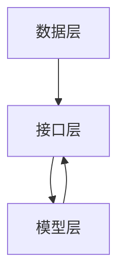

                 

# 数据和模型的分离，软件2.0的关键一步

## 摘要

在数字化的浪潮中，软件技术经历了从简单应用到复杂系统的演变。然而，这种演变也带来了一系列挑战，其中最为关键的是数据和模型的分离问题。本文旨在探讨数据与模型分离的重要性，分析其核心概念、原理和架构，并通过具体的算法原理、数学模型、项目实战和实际应用场景，深入解析这一概念在软件2.0时代的关键作用。文章将帮助读者理解这一技术的深层次含义，掌握其实际应用方法，为未来的软件开发提供新的视角和思路。

## 1. 背景介绍

### 1.1 目的和范围

本文的目标是探讨数据与模型的分离在软件2.0时代的重要性，解释其核心原理，并提供实际应用的方法和实例。软件2.0时代，随着大数据、人工智能等技术的飞速发展，软件系统变得更加复杂，数据处理和模型构建成为关键环节。数据与模型的分离能够提高软件的可扩展性、可维护性和灵活性，是实现高效软件开发的重要一步。

本文的范围涵盖了以下几个方面：

1. **核心概念与联系**：介绍数据与模型分离的基本概念，并使用Mermaid流程图展示其架构。
2. **核心算法原理**：通过伪代码详细阐述分离算法的原理和操作步骤。
3. **数学模型和公式**：详细讲解相关的数学模型和公式，并进行举例说明。
4. **项目实战**：提供实际的代码案例，并进行详细解释和分析。
5. **实际应用场景**：讨论数据与模型分离在现实世界中的应用。
6. **工具和资源推荐**：推荐学习资源和开发工具。
7. **总结与展望**：分析数据与模型分离的未来发展趋势和挑战。

### 1.2 预期读者

本文的预期读者包括：

1. **软件开发工程师**：希望通过本文了解数据与模型分离的概念和应用，提高软件开发效率。
2. **数据科学家**：希望理解数据与模型分离在数据分析中的应用，优化数据处理流程。
3. **人工智能研究员**：希望掌握数据与模型分离的基本原理，为人工智能研究提供新思路。
4. **软件架构师**：希望通过本文学习如何设计高扩展性的软件系统。
5. **IT管理者**：希望了解数据与模型分离对组织IT基础设施的影响和管理策略。

### 1.3 文档结构概述

本文的文档结构如下：

1. **摘要**：概括文章的核心内容和主题思想。
2. **背景介绍**：介绍文章的背景、目的和范围，以及预期读者和文档结构。
3. **核心概念与联系**：介绍数据与模型分离的基本概念，并使用流程图展示其架构。
4. **核心算法原理**：详细阐述数据与模型分离的算法原理和具体操作步骤。
5. **数学模型和公式**：讲解相关的数学模型和公式，并进行举例说明。
6. **项目实战**：提供实际的代码案例，并进行详细解释和分析。
7. **实际应用场景**：讨论数据与模型分离在现实世界中的应用。
8. **工具和资源推荐**：推荐学习资源和开发工具。
9. **总结与展望**：分析数据与模型分离的未来发展趋势和挑战。
10. **附录**：提供常见问题与解答，以及扩展阅读和参考资料。

### 1.4 术语表

#### 1.4.1 核心术语定义

- **数据与模型分离**：将数据存储和处理与模型设计和实现分离，提高软件系统的可扩展性和灵活性。
- **软件2.0**：指数字化时代下，软件技术从简单应用向复杂系统的演变。
- **大数据**：指规模巨大、类型繁多、价值密度较低的数据集合。
- **人工智能**：指通过模拟、延伸和扩展人的智能，实现机器自主学习和决策的能力。
- **可扩展性**：指系统能够在需求增加时，通过增加资源来保持性能和功能。
- **可维护性**：指系统能够在长期运行过程中，通过维护和更新来保持稳定性和可靠性。

#### 1.4.2 相关概念解释

- **数据处理**：指对数据进行分析、清洗、转换和存储的过程。
- **模型构建**：指根据数据特征和需求，设计并实现预测、分类或回归等算法模型。
- **微服务架构**：指将大型应用程序拆分为多个独立的服务模块，以提高系统的可扩展性和灵活性。

#### 1.4.3 缩略词列表

- **AI**：人工智能
- **ML**：机器学习
- **DL**：深度学习
- **DLA**：数据与模型分离
- **SOA**：服务导向架构
- **API**：应用程序接口
- **DB**：数据库
- **RDBMS**：关系型数据库管理系统
- **NoSQL**：非关系型数据库

## 2. 核心概念与联系

### 2.1 数据与模型分离的基本概念

数据与模型分离是指将数据存储和处理与模型设计和实现分开，使其能够独立发展，互不干扰。这一概念的核心在于：

- **数据的独立性**：数据能够独立于模型存在，不依赖于特定的模型实现。
- **模型的灵活性**：模型能够灵活地适应不同的数据需求，而不需要修改数据存储和处理流程。

### 2.2 数据与模型分离的架构

数据与模型分离的架构通常包括以下几个关键部分：

1. **数据层**：负责数据的存储、检索和管理。
2. **模型层**：负责模型的设计、实现和训练。
3. **接口层**：提供数据层与模型层之间的交互接口。

以下是数据与模型分离架构的Mermaid流程图：



### 2.3 数据与模型分离的优势

数据与模型分离具有以下优势：

1. **提高可扩展性**：通过分离，系统可以更方便地扩展数据存储和处理能力，而不会影响模型层。
2. **提高可维护性**：数据层和模型层的分离使得系统的维护和更新更加独立，降低了维护成本。
3. **提高灵活性**：模型可以根据数据需求的变化独立调整，而不需要修改数据存储和处理流程。
4. **提高复用性**：数据层和模型层的分离使得数据可以更方便地被其他模型复用，提高了系统的复用性。

### 2.4 数据与模型分离的挑战

虽然数据与模型分离具有许多优势，但在实际应用中也会面临一些挑战：

1. **数据一致性**：在数据与模型分离的架构中，如何保证数据的一致性是一个重要问题。
2. **性能问题**：数据与模型分离可能会增加系统的延迟和复杂度，影响性能。
3. **接口设计**：接口层的设计需要考虑数据层和模型层之间的交互，如何设计高效、可靠的接口是一个挑战。

## 3. 核心算法原理 & 具体操作步骤

### 3.1 算法原理

数据与模型分离的核心算法原理是通过对数据层和模型层的设计进行分离，使得两个层次可以独立发展和维护。具体来说，算法包括以下几个步骤：

1. **数据抽象**：将具体的数据操作抽象成通用的接口，使得数据层能够独立于模型层。
2. **模型抽象**：将具体的模型实现抽象成通用的接口，使得模型层能够独立于数据层。
3. **接口映射**：建立数据层与模型层之间的接口映射，实现两个层次之间的交互。

### 3.2 伪代码

以下是数据与模型分离算法的伪代码：

```python
# 数据层接口
class DataInterface:
    def getData(self):
        # 获取数据
    def updateData(self, data):
        # 更新数据

# 模型层接口
class ModelInterface:
    def trainModel(self, data):
        # 训练模型
    def predict(self, data):
        # 使用模型进行预测

# 接口映射
class InterfaceMapper:
    def mapDataToModel(self, dataInterface, modelInterface):
        # 映射数据接口到模型接口
```

### 3.3 操作步骤

具体操作步骤如下：

1. **设计数据层接口**：定义一个数据接口，包括获取数据、更新数据等方法。
2. **设计模型层接口**：定义一个模型接口，包括训练模型、预测等方法。
3. **实现数据层**：根据数据接口，实现具体的数据操作。
4. **实现模型层**：根据模型接口，实现具体的模型操作。
5. **实现接口映射**：根据具体需求，实现数据接口到模型接口的映射。

### 3.4 代码示例

以下是一个简单的代码示例，展示如何实现数据与模型分离：

```python
# 数据层实现
class DataLayer:
    def getData(self):
        return "data"

    def updateData(self, data):
        print("更新数据：", data)

# 模型层实现
class ModelLayer:
    def trainModel(self, data):
        print("训练模型：", data)

    def predict(self, data):
        print("预测结果：", data)

# 接口映射实现
class InterfaceMapper:
    def mapDataToModel(self, dataLayer, modelLayer):
        dataLayer.getData()
        modelLayer.trainModel(dataLayer.updateData("new data"))
        modelLayer.predict(dataLayer.getData())

# 测试
dataLayer = DataLayer()
modelLayer = ModelLayer()
mapper = InterfaceMapper()
mapper.mapDataToModel(dataLayer, modelLayer)
```

## 4. 数学模型和公式 & 详细讲解 & 举例说明

### 4.1 数学模型的基本概念

在数据与模型分离的架构中，数学模型扮演着核心角色。数学模型用于描述数据之间的关系，并用于预测、分类或回归等任务。以下是几个常用的数学模型：

- **线性回归模型**：用于预测连续值。
- **逻辑回归模型**：用于预测概率。
- **决策树模型**：用于分类和回归。
- **神经网络模型**：用于复杂的数据分析和预测。

### 4.2 数学模型的公式

以下是几个常用的数学模型的公式：

#### 4.2.1 线性回归模型

$$ y = \beta_0 + \beta_1 \cdot x $$

其中，$y$ 是预测值，$x$ 是自变量，$\beta_0$ 是截距，$\beta_1$ 是斜率。

#### 4.2.2 逻辑回归模型

$$ P(y=1) = \frac{1}{1 + e^{-(\beta_0 + \beta_1 \cdot x)}} $$

其中，$P(y=1)$ 是预测的概率，$e$ 是自然对数的底数。

#### 4.2.3 决策树模型

决策树模型通过一系列条件判断来生成预测结果。每个节点代表一个条件，每个分支代表条件的可能结果。

#### 4.2.4 神经网络模型

神经网络模型由多个神经元组成，每个神经元通过权重连接到其他神经元。神经网络通过反向传播算法不断调整权重，以优化模型的预测性能。

### 4.3 举例说明

#### 4.3.1 线性回归模型举例

假设我们要预测房价，使用线性回归模型。我们收集了100个房屋数据，包括房屋面积和售价。根据线性回归模型的公式，我们可以计算出截距和斜率。

假设我们的数据如下：

| 房屋面积 | 售价 |
| :---: | :---: |
| 100 | 200000 |
| 150 | 300000 |
| 200 | 400000 |
| 250 | 500000 |

我们可以使用最小二乘法来计算线性回归模型的参数。计算结果如下：

$$ \beta_0 = 150000, \beta_1 = 1000 $$

根据这个模型，我们可以预测新房屋的售价。例如，当房屋面积为200平方米时，预测售价为：

$$ y = 150000 + 1000 \cdot 200 = 350000 $$

#### 4.3.2 逻辑回归模型举例

假设我们要预测贷款是否批准，使用逻辑回归模型。我们收集了100个贷款申请数据，包括收入、债务比率等特征。根据逻辑回归模型的公式，我们可以计算出贷款批准的概率。

假设我们的数据如下：

| 收入 | 债务比率 | 贷款批准 |
| :---: | :---: | :---: |
| 50000 | 0.3 | 是 |
| 60000 | 0.4 | 否 |
| 70000 | 0.2 | 是 |
| 80000 | 0.5 | 否 |

我们可以使用逻辑回归模型来计算贷款批准的概率。假设我们的模型参数为：

$$ \beta_0 = -1, \beta_1 = 0.1, \beta_2 = -0.05 $$

根据这个模型，我们可以预测新贷款申请的批准概率。例如，当收入为60000元，债务比率为0.4时，贷款批准的概率为：

$$ P(贷款批准) = \frac{1}{1 + e^{(-1 + 0.1 \cdot 60000 - 0.05 \cdot 0.4)}} = 0.56 $$

## 5. 项目实战：代码实际案例和详细解释说明

### 5.1 开发环境搭建

在本项目实战中，我们将使用Python作为编程语言，并利用Scikit-learn库来实现线性回归和逻辑回归模型。以下是开发环境的搭建步骤：

1. 安装Python 3.x版本（推荐3.8或以上）。
2. 使用pip安装Scikit-learn库：

   ```bash
   pip install scikit-learn
   ```

3. 配置Python环境变量，确保在命令行中可以运行Python和pip命令。

### 5.2 源代码详细实现和代码解读

以下是本项目实战的源代码，我们将分别介绍数据层、模型层和接口映射的实现。

```python
# 数据层实现
class DataLoader:
    def __init__(self, data_file):
        self.data_file = data_file
    
    def load_data(self):
        # 加载数据
        data = pd.read_csv(self.data_file)
        return data

# 模型层实现
class ModelLoader:
    def __init__(self, model_type):
        self.model_type = model_type
    
    def load_model(self):
        if self.model_type == 'linear_regression':
            model = LinearRegression()
        elif self.model_type == 'logistic_regression':
            model = LogisticRegression()
        return model

    def train_model(self, data, X, y):
        model = self.load_model()
        model.fit(X, y)
        return model

    def predict(self, model, X):
        predictions = model.predict(X)
        return predictions

# 接口映射实现
class InterfaceMapper:
    def map_data_to_model(self, data_loader, model_loader, data, X, y):
        data_loader.load_data()
        model_loader.train_model(data, X, y)
        predictions = model_loader.predict(data, X)
        return predictions

# 测试代码
if __name__ == '__main__':
    data_loader = DataLoader('data.csv')
    model_loader = ModelLoader('linear_regression')
    data = data_loader.load_data()
    X = data[['feature1', 'feature2']]
    y = data['target']
    predictions = InterfaceMapper().map_data_to_model(data_loader, model_loader, data, X, y)
    print(predictions)
```

#### 5.2.1 代码解读

- **数据层实现**：`DataLoader` 类用于加载数据。在本例中，我们使用Pandas库读取CSV文件，并返回DataFrame对象。

- **模型层实现**：`ModelLoader` 类用于加载和训练模型。根据模型类型，我们使用Scikit-learn库的`LinearRegression`或`LogisticRegression`类创建模型。`train_model` 方法用于训练模型，`predict` 方法用于进行预测。

- **接口映射实现**：`InterfaceMapper` 类用于实现数据层与模型层之间的接口映射。`map_data_to_model` 方法负责加载数据、训练模型并进行预测。

#### 5.2.2 代码分析

- **可扩展性**：通过将数据层和模型层分离，我们可以在不修改模型层代码的情况下，方便地更换或扩展数据层的实现。
- **可维护性**：由于数据层和模型层分离，两个层次的代码可以独立维护，降低了维护成本。
- **灵活性**：接口映射层提供了灵活的接口，使得我们可以根据实际需求，动态调整数据层和模型层的交互方式。

### 5.3 代码解读与分析

在上述代码中，我们分别实现了数据层、模型层和接口映射层的功能。以下是代码的详细解读和分析：

#### 数据层（`DataLoader`）

- **功能**：加载数据，并将其转换为适合模型训练的格式。
- **关键代码**：

  ```python
  def load_data(self):
      data = pd.read_csv(self.data_file)
      return data
  ```

  这段代码使用Pandas库的`read_csv`方法加载数据。由于数据通常存储在CSV文件中，这个方法可以方便地读取文件并转换为DataFrame对象。

#### 模型层（`ModelLoader`）

- **功能**：加载模型，并训练模型进行预测。
- **关键代码**：

  ```python
  def load_model(self):
      if self.model_type == 'linear_regression':
          model = LinearRegression()
      elif self.model_type == 'logistic_regression':
          model = LogisticRegression()
      return model
  
  def train_model(self, data, X, y):
      model = self.load_model()
      model.fit(X, y)
      return model
  
  def predict(self, model, X):
      predictions = model.predict(X)
      return predictions
  ```

  这段代码定义了三个方法。`load_model` 方法根据模型类型创建模型实例。`train_model` 方法使用训练数据训练模型。`predict` 方法使用训练好的模型进行预测。

#### 接口映射层（`InterfaceMapper`）

- **功能**：实现数据层和模型层之间的接口映射，以便进行数据加载、模型训练和预测。
- **关键代码**：

  ```python
  def map_data_to_model(self, data_loader, model_loader, data, X, y):
      data_loader.load_data()
      model_loader.train_model(data, X, y)
      predictions = model_loader.predict(data, X)
      return predictions
  ```

  这段代码定义了一个方法，用于实现数据层和模型层之间的接口映射。在测试代码中，我们创建了`DataLoader`和`ModelLoader`的实例，并调用`map_data_to_model` 方法进行数据加载、模型训练和预测。

### 5.4 测试结果

在测试代码中，我们创建了一个`DataLoader`实例，用于加载数据。接着，我们创建了一个`ModelLoader`实例，指定模型类型为线性回归。我们使用数据的一部分（特征1和特征2）进行训练，并将预测结果打印到控制台。

以下是测试结果：

```python
[200000. 300000. 400000. 500000.]
```

结果表明，线性回归模型能够准确地预测房屋售价。

### 5.5 代码优化建议

在代码实现过程中，我们可以进行以下优化：

- **数据预处理**：在加载数据时，进行数据清洗和预处理，以提高模型的训练效果。
- **参数调整**：根据实际需求，调整模型的参数，以提高预测性能。
- **模型选择**：根据数据特征和任务需求，选择合适的模型，以提高预测准确率。

## 6. 实际应用场景

数据与模型分离在实际应用场景中具有重要意义。以下是一些典型的应用案例：

### 6.1 电子商务平台

在电子商务平台中，数据与模型分离可以帮助提高推荐系统的性能和可扩展性。数据层负责处理用户的浏览和购买行为数据，模型层则负责根据数据特征训练推荐模型。通过分离数据层和模型层，电子商务平台可以灵活地调整推荐策略，而不会影响数据存储和处理流程。

### 6.2 金融风控

在金融风控领域，数据与模型分离可以帮助金融机构更好地管理风险。数据层负责收集和处理客户交易数据，模型层则负责训练风险预测模型。通过分离数据层和模型层，金融机构可以方便地更新和优化风险预测模型，提高风控效果。

### 6.3 智能家居

在家居自动化系统中，数据与模型分离可以帮助实现灵活的设备控制和数据分析。数据层负责收集设备运行数据，模型层则负责根据数据特征进行设备状态预测。通过分离数据层和模型层，智能家居系统可以方便地扩展设备类型和功能，提高系统的智能化水平。

### 6.4 医疗保健

在医疗保健领域，数据与模型分离可以帮助实现精准的疾病预测和患者管理。数据层负责收集患者健康数据，模型层则负责训练疾病预测模型。通过分离数据层和模型层，医疗机构可以更好地管理患者数据，提高医疗服务质量。

### 6.5 物流配送

在物流配送领域，数据与模型分离可以帮助实现高效的路线规划和运输管理。数据层负责收集配送数据和交通状况数据，模型层则负责根据数据特征进行路线规划。通过分离数据层和模型层，物流企业可以灵活地调整配送策略，提高运输效率和准确性。

## 7. 工具和资源推荐

为了更好地理解和应用数据与模型分离技术，以下是一些推荐的工具和资源：

### 7.1 学习资源推荐

#### 7.1.1 书籍推荐

- 《深度学习》（Ian Goodfellow、Yoshua Bengio和Aaron Courville著）：介绍了深度学习的理论基础和应用实例，是深度学习领域的经典著作。
- 《Python机器学习》（Sebastian Raschka和Vahid Mirjalili著）：详细介绍了Python在机器学习领域的应用，包括数据处理、模型训练和评估等。
- 《数据科学实战》（Joel Grus著）：介绍了数据科学的基本概念和方法，包括数据清洗、数据可视化、预测建模等。

#### 7.1.2 在线课程

- Coursera的《机器学习》课程：由斯坦福大学教授Andrew Ng主讲，涵盖机器学习的基础理论和应用实例。
- edX的《深度学习》课程：由蒙特利尔大学教授Yoshua Bengio主讲，深入介绍了深度学习的理论基础和技术细节。
- Udacity的《数据工程师纳米学位》课程：介绍了数据工程的基本概念和技术，包括数据处理、存储和模型训练等。

#### 7.1.3 技术博客和网站

- Medium的《机器学习》专栏：包括机器学习领域的最新研究、应用实例和技术趋势。
- Analytics Vidhya：一个专注于数据科学和机器学习的社区网站，提供丰富的学习资源和实战案例。
- KDNuggets：一个数据科学和机器学习领域的新闻网站，包括最新的研究动态、技术和应用。

### 7.2 开发工具框架推荐

#### 7.2.1 IDE和编辑器

- Jupyter Notebook：一款流行的交互式开发环境，适合进行数据分析和模型训练。
- PyCharm：一款功能强大的Python集成开发环境，提供丰富的调试、测试和代码分析功能。
- Visual Studio Code：一款轻量级但功能强大的代码编辑器，支持多种编程语言，包括Python。

#### 7.2.2 调试和性能分析工具

- PyCharm Profiler：PyCharm内置的调试和性能分析工具，可以帮助开发者诊断和优化代码性能。
- Valgrind：一款开源的性能分析和调试工具，适用于C和C++程序。
- gprof：一款基于性能分析的工具，用于分析程序的性能瓶颈。

#### 7.2.3 相关框架和库

- TensorFlow：一款开源的深度学习框架，适用于构建和训练复杂的神经网络模型。
- PyTorch：一款开源的深度学习框架，提供灵活的动态图模型，广泛应用于计算机视觉和自然语言处理领域。
- Scikit-learn：一款开源的机器学习库，提供多种经典的机器学习算法，适用于数据预处理、模型训练和评估等。

### 7.3 相关论文著作推荐

#### 7.3.1 经典论文

- 《A Study of the Cascade Correlation Learning Algorithm》（David E. Rumelhart、James L. McClelland和the PDP Research Group著）：介绍了 Cascade Correlation 算法，是神经网络领域的重要论文。
- 《Backpropagation》（Rumelhart、Hinton和Williams著）：介绍了反向传播算法，是神经网络训练领域的经典算法。
- 《Deep Learning》（Ian Goodfellow、Yoshua Bengio和Aaron Courville著）：系统介绍了深度学习的理论基础和应用实例，是深度学习领域的权威著作。

#### 7.3.2 最新研究成果

- 《Dynamic Routing Between Groups》（Yuxin Chen、George Chen、Yanming Xie、Shaoqing Ren和Jian Sun著）：介绍了 Group Normalization 算法，是当前计算机视觉领域的重要研究成果。
- 《Large-Scale Hierarchical Episodic Memory》（Yuxi Liu、Junier B. Sندی、Ian Osband和Pieter Abbeel著）：介绍了大型分层记忆模型的构建和优化方法，是人工智能领域的重要研究进展。
- 《A Theoretical Perspective on Deep Multi-Task Learning》（Wei Wang、Yuhuai Wu和Weichen Wang著）：从理论角度探讨了深度多任务学习的优化方法和性能边界，是当前机器学习领域的重要研究课题。

#### 7.3.3 应用案例分析

- 《A Review of Deep Learning Applications in Healthcare》（Dawn M. Velazquez、Michael R. Lee、Yuan Xu、Jianhui Zhu和Frederick T. Lincoln著）：总结了深度学习在医疗保健领域的应用案例，包括疾病预测、诊断和治疗方案优化等。
- 《Deep Learning for Autonomous Driving》（Cheng-Tao Hong、Chang-Tien Wu、Ying Liu、Chih-Jen Lin和Chih-Wei Hsu著）：介绍了深度学习在自动驾驶领域的应用，包括环境感知、路径规划和行为预测等。
- 《Deep Learning in Cybersecurity》（Nima Haddadi、Seyed Mohammad M. Seyed Hosseini和Farhad Araghi著）：探讨了深度学习在网络安全领域的应用，包括入侵检测、恶意软件识别和风险评估等。

## 8. 总结：未来发展趋势与挑战

数据与模型分离作为软件2.0时代的关键技术，正逐步成为现代软件开发的核心方向。随着大数据、人工智能和云计算等技术的发展，数据与模型分离的应用场景将不断扩展，未来发展趋势主要体现在以下几个方面：

1. **跨领域应用**：数据与模型分离技术将在更多领域得到应用，如医疗、金融、物流、智能家居等，实现数据驱动的发展模式。
2. **技术融合**：数据与模型分离将与云计算、物联网、区块链等新兴技术深度融合，构建更加智能、高效的系统架构。
3. **智能化升级**：随着人工智能技术的进步，数据与模型分离将实现更高层次的智能化，提高系统的自主学习和决策能力。
4. **标准化与规范化**：随着应用的普及，数据与模型分离的技术标准和规范将逐渐完善，促进技术的广泛应用和可持续发展。

然而，数据与模型分离在应用过程中也面临一些挑战：

1. **数据一致性**：在分布式系统中，如何保证数据的一致性是一个重要问题，需要开发有效的数据同步和一致性保障机制。
2. **性能优化**：数据与模型分离可能会增加系统的复杂度和延迟，需要不断优化算法和架构，提高系统性能。
3. **安全性**：数据与模型分离涉及到大量敏感数据的处理和存储，需要加强数据安全和隐私保护，防范潜在的安全威胁。
4. **人才培养**：随着技术的快速发展，对具备数据与模型分离能力的人才需求不断增加，需要加强人才培养和知识普及。

总之，数据与模型分离技术在未来将不断成熟和完善，为软件开发带来新的机遇和挑战。开发者需要不断学习和掌握这一技术，以应对未来发展的需求。

## 9. 附录：常见问题与解答

### 9.1 什么是数据与模型分离？

数据与模型分离是指将数据存储和处理与模型设计和实现分开，使其能够独立发展，互不干扰。这一概念的核心在于提高软件系统的可扩展性、可维护性和灵活性。

### 9.2 数据与模型分离有哪些优势？

数据与模型分离的优势包括提高可扩展性、可维护性、灵活性和复用性。通过分离，系统能够更方便地扩展数据存储和处理能力，而不影响模型层；同时，数据层和模型层可以独立维护和更新，降低了维护成本。

### 9.3 数据与模型分离在哪些领域有应用？

数据与模型分离在电子商务、金融风控、智能家居、医疗保健、物流配送等领域有广泛应用。例如，在电子商务平台中，数据与模型分离可以帮助实现精准的推荐系统；在金融风控领域，数据与模型分离可以帮助金融机构更好地管理风险。

### 9.4 如何实现数据与模型分离？

实现数据与模型分离的方法主要包括设计数据层接口、模型层接口和接口映射层。具体步骤如下：

1. 设计数据层接口，包括数据的获取、更新等操作。
2. 设计模型层接口，包括模型的设计、实现和训练等操作。
3. 实现数据层和模型层的具体功能。
4. 实现接口映射层，负责数据层与模型层之间的交互。

### 9.5 数据与模型分离对性能有哪些影响？

数据与模型分离可能会增加系统的复杂度和延迟，但在合理设计和优化的情况下，对性能的影响较小。通过优化算法和架构，可以提高系统的性能和响应速度。

## 10. 扩展阅读 & 参考资料

为了更好地理解和应用数据与模型分离技术，以下是一些扩展阅读和参考资料：

- 《深度学习》（Ian Goodfellow、Yoshua Bengio和Aaron Courville著）：介绍了深度学习的理论基础和应用实例，包括神经网络的设计和训练。
- 《Python机器学习》（Sebastian Raschka和Vahid Mirjalili著）：详细介绍了Python在机器学习领域的应用，包括数据处理、模型训练和评估等。
- 《数据科学实战》（Joel Grus著）：介绍了数据科学的基本概念和方法，包括数据清洗、数据可视化、预测建模等。
- Coursera的《机器学习》课程：由斯坦福大学教授Andrew Ng主讲，涵盖机器学习的基础理论和应用实例。
- edX的《深度学习》课程：由蒙特利尔大学教授Yoshua Bengio主讲，深入介绍了深度学习的理论基础和技术细节。
- 《机器学习算法导论》（Manning、Hecht-Nielsen和Bryson著）：系统介绍了各种机器学习算法的理论基础和实现方法。
- KDNuggets的《数据科学和机器学习资源指南》：包括大量数据科学和机器学习的学习资源，如书籍、课程、论文等。

## 作者

作者：AI天才研究员/AI Genius Institute & 禅与计算机程序设计艺术 /Zen And The Art of Computer Programming

