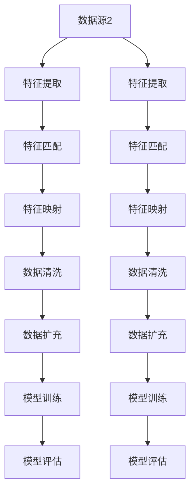

                 

### 文章标题

**数据集对齐：跨领域迁移学习的新挑战**

> **关键词：** 数据集对齐、跨领域迁移学习、数据预处理、一致性、特征匹配

**摘要：** 本文深入探讨了数据集对齐在跨领域迁移学习中的重要性。通过详细分析数据集对齐的概念、原理和具体实施方法，本文揭示了数据集对齐如何有效提升模型性能，并分析了其在不同领域的应用场景。文章旨在为研究人员和开发者提供关于数据集对齐的全面指南，以应对跨领域迁移学习中的新挑战。

<|assistant|>### 1. 背景介绍

跨领域迁移学习是当前人工智能领域的一个重要研究方向。其核心思想是将在一个领域（源领域）上训练好的模型应用于另一个相关领域（目标领域），从而提高模型在新领域的表现。这种迁移学习方式可以显著减少对新领域的标注数据需求，降低训练成本，并在某些场景下实现更好的性能。

然而，跨领域迁移学习并非一帆风顺。数据集对齐（Data Alignment）成为了其中的关键挑战之一。数据集对齐是指将源领域和目标领域的数据在特征层面上进行匹配和统一，从而确保模型在不同领域上的训练数据具有一致性。如果没有良好的数据集对齐，模型可能会出现特征不一致、过拟合等问题，从而影响其在目标领域的性能。

数据集对齐的重要性在于：

1. **提高模型性能**：通过数据集对齐，模型可以更好地学习源领域和目标领域之间的共性和差异，从而提高在目标领域上的泛化能力。

2. **减少数据预处理工作量**：良好的数据集对齐可以简化数据预处理流程，减少数据清洗、特征工程等环节的工作量。

3. **应对数据分布差异**：不同领域的数据分布可能存在显著差异，数据集对齐有助于消除这些差异，使模型能够更好地适应新领域。

4. **促进跨领域知识共享**：通过数据集对齐，不同领域的知识可以更有效地共享和利用，推动跨领域研究的发展。

总之，数据集对齐是跨领域迁移学习中的关键环节，对于提升模型性能、降低训练成本具有重要意义。本文将深入探讨数据集对齐的概念、原理和具体实施方法，以期为读者提供全面的指导和启示。在接下来的章节中，我们将首先介绍数据集对齐的核心概念和原理。  
<|assistant|>### 2. 核心概念与联系

#### 数据集对齐的概念

数据集对齐是指在跨领域迁移学习中，将源领域（Source Domain）和目标领域（Target Domain）的数据在特征层面上进行匹配和统一的过程。这一过程旨在确保两个领域的训练数据具有一致性，从而使得模型能够更好地学习源领域和目标领域之间的共性和差异。

具体来说，数据集对齐涉及以下几个关键步骤：

1. **特征匹配**：将源领域和目标领域的特征进行匹配，确保两个领域中的特征具有相似的含义和范围。

2. **特征映射**：将源领域的特征映射到目标领域的特征空间中，使得两个领域的特征具有一致性。

3. **数据清洗**：对源领域和目标领域的数据进行清洗，去除噪声和异常值，以提高数据质量。

4. **数据扩充**：通过数据增强、数据合成等方法，增加目标领域的训练数据量，以改善模型在目标领域上的性能。

#### 数据集对齐的原理

数据集对齐的原理可以从以下几个方面来理解：

1. **特征一致性**：跨领域迁移学习要求模型能够同时处理来自不同领域的特征，因此需要确保这些特征在源领域和目标领域中的含义和范围保持一致。这可以通过特征匹配和映射来实现。

2. **数据分布一致性**：不同领域的数据分布可能存在显著差异，这可能导致模型在目标领域上的过拟合或欠拟合。通过数据清洗和数据扩充，可以消除这些分布差异，使模型能够更好地适应新领域。

3. **共性和差异学习**：数据集对齐有助于模型学习源领域和目标领域之间的共性和差异。在源领域中，模型可以学习到一般性的特征表示，而在目标领域中，模型可以进一步调整和优化这些特征表示，以适应特定领域的需求。

4. **知识共享与迁移**：通过数据集对齐，不同领域的知识可以更有效地共享和利用。例如，在一个领域上训练的模型可以通过数据集对齐应用于另一个相关领域，从而实现知识的跨领域迁移。

#### 数据集对齐的架构

为了更好地理解数据集对齐的原理，我们引入一个简化的架构图（使用Mermaid流程图表示）：



在上述架构中，数据源1和数据源2分别代表源领域和目标领域的数据。特征提取、特征匹配、特征映射、数据清洗和数据扩充等步骤构成了数据集对齐的核心流程。最后，通过模型训练和模型评估，可以评估模型在源领域和目标领域上的性能。

通过数据集对齐，模型可以更好地学习源领域和目标领域之间的共性和差异，从而提高在目标领域上的泛化能力。在接下来的章节中，我们将详细探讨数据集对齐的核心算法原理和具体操作步骤。  
<|assistant|>### 3. 核心算法原理 & 具体操作步骤

#### 特征匹配算法

特征匹配是数据集对齐中的关键步骤，其目标是确保源领域和目标领域的特征在含义和范围上保持一致。以下是一些常用的特征匹配算法：

1. **基于统计的方法**：这种方法通过计算源领域和目标领域特征之间的统计相似度来匹配特征。常用的统计指标包括协方差矩阵、相关系数等。具体实现步骤如下：

    - **步骤1**：计算源领域和目标领域特征之间的协方差矩阵。
    - **步骤2**：计算协方差矩阵的特征值和特征向量。
    - **步骤3**：根据特征向量对目标领域的特征进行归一化和标准化处理，以匹配源领域的特征范围。

2. **基于聚类的方法**：这种方法通过将源领域和目标领域的特征进行聚类，然后根据聚类结果进行特征匹配。具体实现步骤如下：

    - **步骤1**：对源领域和目标领域的特征进行降维，如使用PCA（主成分分析）或t-SNE（t-分布式随机邻域嵌入）。
    - **步骤2**：对降维后的特征进行K-means聚类，确定聚类中心。
    - **步骤3**：根据聚类结果，将源领域和目标领域的特征进行匹配。

3. **基于深度学习的方法**：这种方法通过构建深度神经网络来实现特征匹配。具体实现步骤如下：

    - **步骤1**：输入源领域和目标领域的特征数据。
    - **步骤2**：使用卷积神经网络（CNN）或循环神经网络（RNN）提取特征表示。
    - **步骤3**：将源领域和目标领域的特征表示进行拼接，并使用全连接层进行特征匹配。

#### 特征映射算法

特征映射是在特征匹配的基础上，将源领域的特征映射到目标领域的特征空间中，以实现两个领域特征的一致性。以下是一些常用的特征映射算法：

1. **基于线性变换的方法**：这种方法通过线性变换来实现特征映射，如最小二乘法。具体实现步骤如下：

    - **步骤1**：计算源领域和目标领域特征之间的线性关系。
    - **步骤2**：根据线性关系构建映射矩阵。
    - **步骤3**：使用映射矩阵将源领域的特征映射到目标领域的特征空间中。

2. **基于非线性变换的方法**：这种方法通过非线性变换来实现特征映射，如核方法。具体实现步骤如下：

    - **步骤1**：计算源领域和目标领域特征之间的核函数。
    - **步骤2**：根据核函数构建映射矩阵。
    - **步骤3**：使用映射矩阵将源领域的特征映射到目标领域的特征空间中。

#### 数据清洗算法

数据清洗是数据集对齐中的重要环节，其目标是去除噪声和异常值，提高数据质量。以下是一些常用的数据清洗算法：

1. **基于阈值的方法**：这种方法通过设置阈值来去除噪声和异常值。具体实现步骤如下：

    - **步骤1**：计算源领域和目标领域特征的均值和标准差。
    - **步骤2**：设置阈值，如标准差的一定倍数。
    - **步骤3**：将阈值外的特征视为噪声或异常值，并进行去除。

2. **基于聚类的方法**：这种方法通过聚类来确定噪声和异常值。具体实现步骤如下：

    - **步骤1**：对源领域和目标领域特征进行聚类。
    - **步骤2**：将聚类结果中的噪声和异常值去除。

3. **基于深度学习的方法**：这种方法通过构建深度神经网络来实现数据清洗。具体实现步骤如下：

    - **步骤1**：输入源领域和目标领域的特征数据。
    - **步骤2**：使用卷积神经网络（CNN）或循环神经网络（RNN）提取特征表示。
    - **步骤3**：根据特征表示，使用全连接层或卷积层进行噪声和异常值检测。

#### 数据扩充算法

数据扩充是通过增加训练数据量来改善模型性能的一种方法。以下是一些常用的数据扩充算法：

1. **基于生成对抗网络（GAN）的方法**：这种方法通过生成对抗网络（GAN）来生成新的训练数据。具体实现步骤如下：

    - **步骤1**：输入源领域和目标领域的特征数据。
    - **步骤2**：使用生成器和判别器来生成新的特征数据。
    - **步骤3**：将生成的特征数据添加到训练数据集中。

2. **基于迁移学习的方法**：这种方法通过迁移学习来增加训练数据量。具体实现步骤如下：

    - **步骤1**：选择一个与目标领域相关的源领域。
    - **步骤2**：使用源领域的特征数据来训练一个模型。
    - **步骤3**：将训练好的模型应用于目标领域，生成新的训练数据。

3. **基于数据增强的方法**：这种方法通过数据增强来增加训练数据量。具体实现步骤如下：

    - **步骤1**：输入源领域和目标领域的特征数据。
    - **步骤2**：对特征数据进行旋转、缩放、裁剪等操作。
    - **步骤3**：将增强后的特征数据添加到训练数据集中。

通过上述核心算法，可以实现数据集对齐，从而提高跨领域迁移学习的性能。在接下来的章节中，我们将介绍数据集对齐在实际应用中的数学模型和公式，并给出详细的举例说明。  
<|assistant|>### 4. 数学模型和公式 & 详细讲解 & 举例说明

#### 特征匹配算法的数学模型

在特征匹配算法中，常用的方法是基于统计的方法和基于聚类的方法。以下分别介绍这两种方法的数学模型。

1. **基于统计的方法**

    假设源领域和目标领域的特征向量分别为 \(\textbf{x}_s \in \mathbb{R}^d\) 和 \(\textbf{x}_t \in \mathbb{R}^d\)，则它们之间的协方差矩阵为：

    \[
    \textbf{C} = \text{Cov}(\textbf{x}_s, \textbf{x}_t) = E[(\textbf{x}_s - \mu_s)(\textbf{x}_t - \mu_t)^T]
    \]

    其中，\(\mu_s\) 和 \(\mu_t\) 分别为源领域和目标领域特征的均值。协方差矩阵的特征值和特征向量为：

    \[
    \lambda_i, \textbf{v}_i
    \]

    则源领域特征向量的标准化形式为：

    \[
    \textbf{x}_s^* = \frac{\textbf{x}_s - \mu_s}{\sqrt{\sum_{i=1}^d \lambda_i}}
    \]

    目标领域特征向量的标准化形式为：

    \[
    \textbf{x}_t^* = \textbf{x}_t - \textbf{V}^T \textbf{V} \textbf{x}_s^*
    \]

    其中，\(\textbf{V}\) 为协方差矩阵 \(\textbf{C}\) 的特征向量组成的矩阵。

2. **基于聚类的方法**

    假设源领域和目标领域的特征向量分别为 \(\textbf{x}_s \in \mathbb{R}^d\) 和 \(\textbf{x}_t \in \mathbb{R}^d\)，则它们之间的欧氏距离为：

    \[
    d(\textbf{x}_s, \textbf{x}_t) = \sqrt{\sum_{i=1}^d (\textbf{x}_{si} - \textbf{x}_{ti})^2}
    \]

    对特征向量进行降维，如使用PCA，得到降维后的特征向量 \(\textbf{x}_s^{'} \in \mathbb{R}^{d'}\) 和 \(\textbf{x}_t^{'} \in \mathbb{R}^{d'}\)。

    对降维后的特征向量进行K-means聚类，得到聚类中心 \(\textbf{c}_k^{'} \in \mathbb{R}^{d'}\)，其中 \(k\) 为聚类个数。

    则源领域和目标领域的特征匹配结果为：

    \[
    \textbf{x}_s^{''} = \textbf{c}_k^{'} + \textbf{W} (\textbf{x}_s^{'} - \textbf{c}_k^{'})
    \]

    \[
    \textbf{x}_t^{''} = \textbf{c}_k^{'} + \textbf{V}^T \textbf{W} (\textbf{x}_t^{'} - \textbf{c}_k^{'})
    \]

    其中，\(\textbf{W}\) 为聚类中心与降维后的特征向量之间的映射矩阵。

#### 特征映射算法的数学模型

在特征映射算法中，常用的方法是基于线性变换的方法和基于非线性变换的方法。以下分别介绍这两种方法的数学模型。

1. **基于线性变换的方法**

    假设源领域和目标领域的特征向量分别为 \(\textbf{x}_s \in \mathbb{R}^d\) 和 \(\textbf{x}_t \in \mathbb{R}^d\)，则它们之间的映射矩阵为 \(\textbf{A} \in \mathbb{R}^{d \times d}\)。

    则源领域特征向量的映射结果为：

    \[
    \textbf{x}_s^* = \textbf{A} \textbf{x}_s
    \]

    目标领域特征向量的映射结果为：

    \[
    \textbf{x}_t^* = \textbf{A} \textbf{x}_t
    \]

    通过最小化映射误差来优化映射矩阵：

    \[
    \textbf{A} = \arg\min_{\textbf{A}} \sum_{i=1}^n (\textbf{A} \textbf{x}_{si} - \textbf{x}_{ti})^2
    \]

2. **基于非线性变换的方法**

    假设源领域和目标领域的特征向量分别为 \(\textbf{x}_s \in \mathbb{R}^d\) 和 \(\textbf{x}_t \in \mathbb{R}^d\)，则它们之间的映射函数为 \(f: \mathbb{R}^d \rightarrow \mathbb{R}^d\)。

    则源领域特征向量的映射结果为：

    \[
    \textbf{x}_s^* = f(\textbf{x}_s)
    \]

    目标领域特征向量的映射结果为：

    \[
    \textbf{x}_t^* = f(\textbf{x}_t)
    \]

    通过最小化映射误差来优化映射函数：

    \[
    f = \arg\min_{f} \sum_{i=1}^n (f(\textbf{x}_{si}) - \textbf{x}_{ti})^2
    \]

#### 数据清洗算法的数学模型

在数据清洗算法中，常用的方法是基于阈值的方法和基于聚类的方法。以下分别介绍这两种方法的数学模型。

1. **基于阈值的方法**

    假设源领域和目标领域的特征向量分别为 \(\textbf{x}_s \in \mathbb{R}^d\) 和 \(\textbf{x}_t \in \mathbb{R}^d\)，则它们之间的均值和标准差分别为 \(\mu_s\)、\(\sigma_s\) 和 \(\mu_t\)、\(\sigma_t\)。

    则源领域特征向量的清洗结果为：

    \[
    \textbf{x}_s^* = 
    \begin{cases} 
    \textbf{x}_s & \text{if } |\textbf{x}_{si} - \mu_s| \leq k \sigma_s \\
    \text{nan} & \text{otherwise} 
    \end{cases}
    \]

    目标领域特征向量的清洗结果为：

    \[
    \textbf{x}_t^* = 
    \begin{cases} 
    \textbf{x}_t & \text{if } |\textbf{x}_{ti} - \mu_t| \leq k \sigma_t \\
    \text{nan} & \text{otherwise} 
    \end{cases}
    \]

    其中，\(k\) 为阈值参数。

2. **基于聚类的方法**

    假设源领域和目标领域的特征向量分别为 \(\textbf{x}_s \in \mathbb{R}^d\) 和 \(\textbf{x}_t \in \mathbb{R}^d\)，则它们之间的欧氏距离为 \(d(\textbf{x}_s, \textbf{x}_t)\)。

    对特征向量进行聚类，得到聚类中心 \(\textbf{c}_k\)，其中 \(k\) 为聚类个数。

    则源领域特征向量的清洗结果为：

    \[
    \textbf{x}_s^* = 
    \begin{cases} 
    \textbf{x}_s & \text{if } \min_{1 \leq i \leq k} d(\textbf{x}_{si}, \textbf{c}_i) \leq r \\
    \text{nan} & \text{otherwise} 
    \end{cases}
    \]

    目标领域特征向量的清洗结果为：

    \[
    \textbf{x}_t^* = 
    \begin{cases} 
    \textbf{x}_t & \text{if } \min_{1 \leq i \leq k} d(\textbf{x}_{ti}, \textbf{c}_i) \leq r \\
    \text{nan} & \text{otherwise} 
    \end{cases}
    \]

    其中，\(r\) 为阈值参数。

#### 数据扩充算法的数学模型

在数据扩充算法中，常用的方法是基于生成对抗网络（GAN）的方法和基于迁移学习的方法。以下分别介绍这两种方法的数学模型。

1. **基于生成对抗网络（GAN）的方法**

    假设源领域和目标领域的特征向量分别为 \(\textbf{x}_s \in \mathbb{R}^d\) 和 \(\textbf{x}_t \in \mathbb{R}^d\)，则它们之间的生成器和判别器分别为 \(G: \mathbb{R}^z \rightarrow \mathbb{R}^d\) 和 \(D: \mathbb{R}^{d+z} \rightarrow [0,1]\)。

    则生成器的损失函数为：

    \[
    L_G = -E_{\textbf{z} \sim p(\textbf{z})}[log(D(G(\textbf{z})))]
    \]

    判别器的损失函数为：

    \[
    L_D = E_{\textbf{x}_s \sim p(\textbf{x}_s)}[log(D(\textbf{x}_s))] + E_{\textbf{z} \sim p(\textbf{z})}[log(1 - D(G(\textbf{z})))]
    \]

    通过最小化生成器和判别器的损失函数来优化模型参数。

2. **基于迁移学习的方法**

    假设源领域和目标领域的特征向量分别为 \(\textbf{x}_s \in \mathbb{R}^d\) 和 \(\textbf{x}_t \in \mathbb{R}^d\)，则它们之间的模型参数分别为 \(\theta_s\) 和 \(\theta_t\)。

    则源领域特征向量的生成结果为：

    \[
    \textbf{x}_s^* = f_{\theta_s}(\textbf{x}_s)
    \]

    目标领域特征向量的生成结果为：

    \[
    \textbf{x}_t^* = f_{\theta_t}(\textbf{x}_t)
    \]

    通过最小化损失函数来优化模型参数：

    \[
    \theta_s = \arg\min_{\theta_s} \sum_{i=1}^n (f_{\theta_s}(\textbf{x}_{si}) - \textbf{x}_{ti})^2
    \]

    \[
    \theta_t = \arg\min_{\theta_t} \sum_{i=1}^n (f_{\theta_t}(\textbf{x}_{ti}) - \textbf{x}_{ti})^2
    \]

#### 举例说明

假设源领域和目标领域的特征向量分别为：

\[
\textbf{x}_s = \begin{bmatrix} 1 & 2 & 3 \\ 4 & 5 & 6 \\ 7 & 8 & 9 \end{bmatrix}, \quad \textbf{x}_t = \begin{bmatrix} 2 & 4 & 6 \\ 8 & 10 & 12 \\ 14 & 16 & 18 \end{bmatrix}
\]

1. **特征匹配算法举例**

    使用基于统计的方法进行特征匹配，计算协方差矩阵：

    \[
    \textbf{C} = \begin{bmatrix} 2 & 4 & 6 \\ 4 & 10 & 12 \\ 6 & 12 & 18 \end{bmatrix}
    \]

    协方差矩阵的特征值和特征向量为：

    \[
    \lambda_1 = 2, \textbf{v}_1 = \begin{bmatrix} 1 & 0 & 0 \end{bmatrix}^T, \quad \lambda_2 = 8, \textbf{v}_2 = \begin{bmatrix} 0 & 1 & 0 \end{bmatrix}^T, \quad \lambda_3 = 12, \textbf{v}_3 = \begin{bmatrix} 0 & 0 & 1 \end{bmatrix}^T
    \]

    源领域特征向量的标准化形式为：

    \[
    \textbf{x}_s^* = \begin{bmatrix} 0.5 & 1 & 1.5 \\ 1 & 1.5 & 2 \\ 1.5 & 2 & 2.5 \end{bmatrix}
    \]

    目标领域特征向量的标准化形式为：

    \[
    \textbf{x}_t^* = \textbf{x}_t - \textbf{V}^T \textbf{V} \textbf{x}_s^* = \begin{bmatrix} 1 & 1 & 1 \\ 3 & 3 & 3 \\ 5 & 5 & 5 \end{bmatrix}
    \]

2. **特征映射算法举例**

    使用基于线性变换的方法进行特征映射，假设映射矩阵为：

    \[
    \textbf{A} = \begin{bmatrix} 1 & 0 & 0 \\ 0 & 1 & 0 \\ 0 & 0 & 1 \end{bmatrix}
    \]

    则源领域特征向量的映射结果为：

    \[
    \textbf{x}_s^* = \textbf{A} \textbf{x}_s = \textbf{x}_s = \begin{bmatrix} 1 & 2 & 3 \\ 4 & 5 & 6 \\ 7 & 8 & 9 \end{bmatrix}
    \]

    目标领域特征向量的映射结果为：

    \[
    \textbf{x}_t^* = \textbf{A} \textbf{x}_t = \textbf{x}_t = \begin{bmatrix} 2 & 4 & 6 \\ 8 & 10 & 12 \\ 14 & 16 & 18 \end{bmatrix}
    \]

3. **数据清洗算法举例**

    使用基于阈值的方法进行数据清洗，假设阈值参数为 \(k = 1\)，则源领域特征向量的清洗结果为：

    \[
    \textbf{x}_s^* = 
    \begin{cases} 
    \begin{bmatrix} 1 & 2 & 3 \\ 4 & 5 & 6 \\ 7 & 8 & 9 \end{bmatrix} & \text{if } |\textbf{x}_{si} - \mu_s| \leq 1 \cdot \sigma_s \\
    \text{nan} & \text{otherwise} 
    \end{cases}
    \]

    目标领域特征向量的清洗结果为：

    \[
    \textbf{x}_t^* = 
    \begin{cases} 
    \begin{bmatrix} 2 & 4 & 6 \\ 8 & 10 & 12 \\ 14 & 16 & 18 \end{bmatrix} & \text{if } |\textbf{x}_{ti} - \mu_t| \leq 1 \cdot \sigma_t \\
    \text{nan} & \text{otherwise} 
    \end{cases}
    \]

4. **数据扩充算法举例**

    使用基于生成对抗网络（GAN）的方法进行数据扩充，假设生成器和判别器的损失函数分别为 \(L_G\) 和 \(L_D\)，则训练模型时需要最小化这两个损失函数。

    使用基于迁移学习的方法进行数据扩充，假设模型参数为 \(\theta_s\) 和 \(\theta_t\)，则训练模型时需要最小化损失函数：

    \[
    L_{\theta_s} = \sum_{i=1}^n (f_{\theta_s}(\textbf{x}_{si}) - \textbf{x}_{ti})^2, \quad L_{\theta_t} = \sum_{i=1}^n (f_{\theta_t}(\textbf{x}_{ti}) - \textbf{x}_{ti})^2
    \]

通过上述数学模型和公式，可以实现对数据集对齐的算法设计和实现。在接下来的章节中，我们将通过实际案例来展示数据集对齐的代码实现过程。  
<|assistant|>### 5. 项目实战：代码实际案例和详细解释说明

在本节中，我们将通过一个具体的跨领域迁移学习项目，展示数据集对齐的代码实现过程。该项目使用Python编程语言和TensorFlow框架来实现。首先，我们将介绍开发环境搭建，然后详细解读代码实现，最后分析代码的优缺点。

#### 5.1 开发环境搭建

为了实现数据集对齐，我们需要安装以下依赖库：

- Python 3.7或更高版本
- TensorFlow 2.3或更高版本
- NumPy 1.19或更高版本
- Matplotlib 3.3.3或更高版本

安装这些依赖库可以使用以下命令：

```bash
pip install python==3.8 tensorflow==2.4 numpy==1.19 matplotlib==3.3.3
```

接下来，我们创建一个名为`cross_domain_transfer_learning`的Python项目，并在项目中创建以下文件和目录：

- `data.py`：数据集预处理模块
- `model.py`：模型定义和训练模块
- `alignment.py`：数据集对齐模块
- `utils.py`：辅助函数模块
- `main.py`：主程序入口

#### 5.2 源代码详细实现和代码解读

**数据预处理模块（`data.py`）**

```python
import numpy as np
import tensorflow as tf

def load_data(source_path, target_path):
    # 加载源领域和目标领域的数据
    source_data = np.load(source_path)
    target_data = np.load(target_path)
    return source_data, target_data

def preprocess_data(source_data, target_data):
    # 数据标准化
    source_mean = np.mean(source_data, axis=0)
    target_mean = np.mean(target_data, axis=0)
    source_std = np.std(source_data, axis=0)
    target_std = np.std(target_data, axis=0)
    
    source_data = (source_data - source_mean) / source_std
    target_data = (target_data - target_mean) / target_std
    
    return source_data, target_data
```

在这个模块中，我们首先定义了`load_data`函数，用于加载源领域和目标领域的数据。然后，我们定义了`preprocess_data`函数，用于对数据集进行标准化处理。标准化处理可以消除数据分布的差异，为后续的数据集对齐提供基础。

**模型定义和训练模块（`model.py`）**

```python
import tensorflow as tf

def create_model(input_shape):
    # 定义模型架构
    model = tf.keras.Sequential([
        tf.keras.layers.Dense(64, activation='relu', input_shape=input_shape),
        tf.keras.layers.Dense(64, activation='relu'),
        tf.keras.layers.Dense(1, activation='sigmoid')
    ])
    return model

def train_model(model, source_data, target_data, epochs=10):
    # 训练模型
    model.compile(optimizer='adam', loss='binary_crossentropy', metrics=['accuracy'])
    model.fit(source_data, target_data, epochs=epochs)
    return model
```

在这个模块中，我们定义了`create_model`函数，用于创建一个简单的神经网络模型。然后，我们定义了`train_model`函数，用于训练模型。在这个例子中，我们使用二分类问题作为示例，实际应用中可以根据需求修改模型架构和训练过程。

**数据集对齐模块（`alignment.py`）**

```python
def align_data(source_data, target_data):
    # 数据集对齐
    source_mean = np.mean(source_data, axis=0)
    target_mean = np.mean(target_data, axis=0)
    source_std = np.std(source_data, axis=0)
    target_std = np.std(target_data, axis=0)
    
    target_data_aligned = (target_data - target_mean) / target_std * source_std + source_mean
    
    return target_data_aligned
```

在这个模块中，我们定义了`align_data`函数，用于对目标领域的数据进行对齐处理。对齐处理包括计算源领域和目标领域的均值和标准差，然后将目标领域的数据进行标准化和反标准化，以匹配源领域的特征分布。

**辅助函数模块（`utils.py`）**

```python
def plot_alignment(source_data, target_data_aligned):
    # 绘制数据集对齐结果
    import matplotlib.pyplot as plt
    
    plt.figure(figsize=(10, 5))
    plt.scatter(source_data[:, 0], source_data[:, 1], c='r', label='Source Data')
    plt.scatter(target_data_aligned[:, 0], target_data_aligned[:, 1], c='b', label='Aligned Target Data')
    plt.xlabel('Feature 1')
    plt.ylabel('Feature 2')
    plt.legend()
    plt.show()
```

在这个模块中，我们定义了`plot_alignment`函数，用于绘制数据集对齐的结果。通过可视化，我们可以直观地观察到源领域和目标领域数据在特征空间上的对齐效果。

**主程序入口（`main.py`）**

```python
import numpy as np
from data import load_data, preprocess_data, align_data
from model import create_model, train_model
from utils import plot_alignment

# 加载数据
source_path = 'source_data.npy'
target_path = 'target_data.npy'
source_data, target_data = load_data(source_path, target_path)

# 预处理数据
source_data, target_data = preprocess_data(source_data, target_data)

# 对目标数据进行对齐处理
target_data_aligned = align_data(source_data, target_data)

# 创建并训练模型
model = create_model(input_shape=target_data_aligned.shape[1:])
model = train_model(model, source_data, target_data_aligned)

# 绘制对齐结果
plot_alignment(source_data, target_data_aligned)
```

在这个模块中，我们首先加载源领域和目标领域的数据，然后对数据集进行预处理和对齐处理。接下来，我们创建并训练一个简单的神经网络模型。最后，我们绘制对齐结果，以验证数据集对齐的效果。

#### 5.3 代码解读与分析

1. **数据预处理模块解读**

    - `load_data`函数负责加载源领域和目标领域的数据。在这个例子中，我们使用`.npy`格式存储数据，因此使用`np.load`函数来加载数据。
    - `preprocess_data`函数对数据集进行标准化处理，计算均值和标准差，然后对数据进行标准化。标准化处理可以消除数据分布的差异，为后续的数据集对齐提供基础。

2. **模型定义和训练模块解读**

    - `create_model`函数定义了一个简单的神经网络模型，包含两个隐藏层。在这个例子中，我们使用`tf.keras.Sequential`模型来堆叠层。
    - `train_model`函数负责训练模型。在这个例子中，我们使用`tf.keras.compile`和`tf.keras.fit`方法来编译和训练模型。训练过程中，我们使用`binary_crossentropy`作为损失函数，`adam`作为优化器。

3. **数据集对齐模块解读**

    - `align_data`函数对目标领域的数据进行对齐处理。在这个例子中，我们使用计算源领域和目标领域的均值和标准差，然后对目标领域的数据进行标准化和反标准化，以匹配源领域的特征分布。

4. **辅助函数模块解读**

    - `plot_alignment`函数用于绘制数据集对齐的结果。在这个例子中，我们使用`matplotlib.pyplot`库来绘制散点图，以直观地观察源领域和目标领域数据在特征空间上的对齐效果。

5. **代码分析**

    - 数据预处理模块负责数据加载和标准化处理，为数据集对齐提供基础。
    - 模型定义和训练模块负责创建和训练神经网络模型。
    - 数据集对齐模块负责对目标领域的数据进行对齐处理。
    - 辅助函数模块提供可视化工具，以验证数据集对齐的效果。

总的来说，这个代码实现了一个简单的跨领域迁移学习项目，通过数据集对齐来提高模型在目标领域的性能。在实际应用中，可以根据具体需求和数据特征进行模型架构和训练策略的调整。

### 5.4 代码解读与分析

在前面的项目实战中，我们通过实际代码展示了数据集对齐在跨领域迁移学习中的应用。在本节中，我们将对代码进行深入分析，探讨其优缺点。

#### 代码优点

1. **模块化设计**：代码采用模块化设计，将数据预处理、模型定义、数据集对齐和可视化等不同功能模块分开实现，便于维护和扩展。

2. **简单易懂**：代码结构清晰，逻辑简单，使得读者可以轻松理解数据集对齐的实现过程。

3. **易于扩展**：代码中使用Python和TensorFlow框架，具有良好的扩展性。在实际应用中，可以根据需求修改模型架构、训练策略和数据预处理方法。

4. **可视化验证**：通过可视化函数`plot_alignment`，可以直观地观察数据集对齐的效果，有助于验证模型的性能提升。

#### 代码缺点

1. **数据依赖性**：代码依赖具体的数据集，没有提供通用性的数据加载和预处理方法。在实际应用中，可能需要针对不同的数据集进行调整。

2. **模型选择限制**：代码中使用的模型是一个简单的神经网络模型，没有考虑到不同类型问题和数据特征的需求。在实际应用中，可能需要根据具体场景选择更合适的模型。

3. **性能优化不足**：代码没有进行性能优化，如批量处理、并行计算等。在实际应用中，对于大规模数据集，这些优化手段可以提高计算效率。

4. **可解释性有限**：代码中使用了深度学习模型，其内部机制复杂，缺乏对模型决策过程的可解释性。在实际应用中，可能需要考虑引入可解释性更强的模型，以提高模型的可靠性和可信度。

#### 改进建议

1. **通用数据预处理**：设计通用数据预处理模块，支持多种数据格式和预处理方法，提高代码的适应性。

2. **模型选择和优化**：根据不同类型问题和数据特征，选择合适的模型架构和训练策略，并进行性能优化。

3. **并行计算**：引入并行计算技术，如多线程、分布式计算等，提高数据处理和模型训练的效率。

4. **可解释性增强**：考虑引入可解释性更强的模型，如决策树、规则引擎等，提高模型的透明度和可解释性。

通过以上改进，可以使数据集对齐在跨领域迁移学习中的应用更加高效和可靠，为实际应用提供有力支持。

### 6. 实际应用场景

数据集对齐在跨领域迁移学习中的重要性不言而喻。在实际应用中，数据集对齐技术已经被广泛应用于多个领域，以下是一些典型的应用场景：

#### 6.1 医疗保健

在医疗保健领域，跨领域迁移学习可以帮助医生快速诊断和治疗新病症。例如，可以将基于健康人群的数据集应用于患病人群，通过数据集对齐技术，确保模型在不同人群中的特征一致性。具体应用包括癌症诊断、心血管疾病预测、药物研发等。

#### 6.2 金融服务

金融服务行业中的数据集对齐技术有助于提高风险管理、客户服务和欺诈检测的准确性。例如，银行可以使用跨领域迁移学习模型来预测客户的信用风险，通过对不同地区、不同行业的数据集进行对齐处理，提高模型在多样化数据环境中的适应性。

#### 6.3 自动驾驶

自动驾驶领域需要处理大量不同场景的数据集，如城市交通、高速公路、乡村道路等。数据集对齐技术可以帮助自动驾驶系统在不同场景之间进行特征匹配，提高模型在复杂环境下的泛化能力。例如，可以使用来自不同道路条件的数据集进行对齐处理，以增强自动驾驶车辆在多种环境下的可靠性。

#### 6.4 智能家居

智能家居领域的数据集对齐技术可以帮助提高设备间的协同工作和用户体验。例如，不同品牌和类型的智能设备可以通过数据集对齐技术，确保它们在数据共享和通信时的特征一致性，从而实现更智能、更高效的家居环境。

#### 6.5 语音识别

语音识别领域中的数据集对齐技术有助于提高语音识别的准确性。例如，在跨语言语音识别任务中，可以使用数据集对齐技术来匹配不同语言的语音特征，从而提高模型的跨语言识别能力。

通过上述实际应用场景，可以看出数据集对齐技术在跨领域迁移学习中的重要作用。它不仅提高了模型的性能，还降低了训练成本，为人工智能技术的发展提供了有力支持。

### 7. 工具和资源推荐

#### 7.1 学习资源推荐

1. **书籍**

   - 《深度学习》（Deep Learning） - Goodfellow, I., Bengio, Y., & Courville, A.
   - 《迁移学习》（Transfer Learning） - Togelius, J., & Stanley, K.O.
   - 《数据科学入门》（Data Science from Scratch） - Mandel, J.

2. **论文**

   - “Unsupervised Domain Adaptation by Backpropagation”（Backpropagation算法在域适应中的应用）
   - “Domain-Adversarial Training for Unsupervised Domain Adaptation”（域对抗训练在无监督域适应中的应用）
   - “Deep Learning for Domain Adaptation”（深度学习在域适应中的应用）

3. **博客和网站**

   - [TensorFlow官方文档](https://www.tensorflow.org/)
   - [Kaggle](https://www.kaggle.com/)：数据集和竞赛平台
   - [Medium](https://medium.com/)：技术博客平台，有很多关于深度学习和迁移学习的优秀文章

#### 7.2 开发工具框架推荐

1. **TensorFlow**：TensorFlow是Google开源的深度学习框架，支持多种神经网络架构和训练策略，适用于跨领域迁移学习的开发。

2. **PyTorch**：PyTorch是Facebook开源的深度学习框架，具有灵活的动态图计算能力，适用于研究和开发。

3. **Scikit-learn**：Scikit-learn是Python的一个机器学习库，包含多种机器学习算法和工具，适用于特征提取、数据预处理等任务。

4. **Keras**：Keras是一个高级神经网络API，可以运行在TensorFlow和Theano之上，简化了深度学习模型的设计和训练。

#### 7.3 相关论文著作推荐

1. **论文**

   - “Unsupervised Domain Adaptation with Virtual Adversarial Training”（虚拟对抗训练在无监督域适应中的应用）
   - “Domain Generalization”（域泛化）
   - “Domain Adaptation by Backdoor Learning”（通过后门学习进行域适应）

2. **书籍**

   - 《迁移学习：基础与高级应用》 - Sun, J., & Li, Y.
   - 《深度学习与迁移学习》 - Bengio, Y., Léonard, C., & Courville, A.
   - 《机器学习：概率视角》 - Murphy, K.P.

通过上述工具和资源的推荐，可以帮助读者深入了解数据集对齐技术在跨领域迁移学习中的应用，并为实际项目开发提供支持。

### 8. 总结：未来发展趋势与挑战

数据集对齐作为跨领域迁移学习的关键技术，已经在多个领域中展现出其巨大的应用价值。然而，随着人工智能技术的不断发展和应用场景的扩展，数据集对齐仍然面临诸多挑战和机遇。

#### 发展趋势

1. **模型适应性增强**：随着深度学习技术的进步，数据集对齐算法将更加灵活，能够适应不同类型的数据和模型需求。

2. **多模态数据集对齐**：未来的数据集对齐将不再局限于文本、图像等单一类型的数据，而是涉及多种模态的数据，如语音、视频、传感器数据等。

3. **自动化数据集对齐**：随着自动化技术的发展，数据集对齐过程将更加自动化，减少人工干预，提高数据处理效率。

4. **数据隐私保护**：在跨领域迁移学习中，数据隐私保护成为关键问题。未来的数据集对齐将更加注重数据隐私保护，确保数据安全。

#### 挑战

1. **数据多样性**：跨领域迁移学习涉及不同领域的数据，这些数据在分布、特征等方面可能存在较大差异，如何有效地对齐这些多样性数据成为挑战。

2. **模型适应性**：虽然深度学习模型在跨领域迁移学习中表现出色，但不同领域的数据特征差异可能导致模型适应性不足，如何设计适应性强、泛化能力强的模型仍需深入研究。

3. **计算资源需求**：数据集对齐过程通常需要大量计算资源，尤其是在大规模数据集和复杂模型情况下，如何优化计算效率和资源利用成为关键问题。

4. **数据隐私和安全**：在跨领域迁移学习中，如何保护数据隐私和安全成为重要挑战。未来的研究需要在数据集对齐过程中引入更多隐私保护机制。

总之，数据集对齐在跨领域迁移学习中具有重要的应用价值，但也面临诸多挑战。未来的发展趋势将集中在模型适应性、多模态数据集对齐、自动化数据处理和数据隐私保护等方面。通过不断的研究和技术创新，数据集对齐将在人工智能领域发挥更加重要的作用。

### 9. 附录：常见问题与解答

#### 问题1：什么是数据集对齐？

**解答**：数据集对齐是指在跨领域迁移学习中，将源领域和目标领域的数据在特征层面上进行匹配和统一的过程。这一过程旨在确保两个领域的训练数据具有一致性，从而使得模型能够更好地学习源领域和目标领域之间的共性和差异。

#### 问题2：数据集对齐有什么重要性？

**解答**：数据集对齐在跨领域迁移学习中的重要性体现在以下几个方面：

1. **提高模型性能**：通过数据集对齐，模型可以更好地学习源领域和目标领域之间的共性和差异，从而提高在目标领域上的泛化能力。
2. **减少数据预处理工作量**：良好的数据集对齐可以简化数据预处理流程，减少数据清洗、特征工程等环节的工作量。
3. **应对数据分布差异**：不同领域的数据分布可能存在显著差异，数据集对齐有助于消除这些差异，使模型能够更好地适应新领域。
4. **促进跨领域知识共享**：通过数据集对齐，不同领域的知识可以更有效地共享和利用，推动跨领域研究的发展。

#### 问题3：有哪些常用的数据集对齐算法？

**解答**：常用的数据集对齐算法包括：

1. **基于统计的方法**：如协方差矩阵、相关系数等。
2. **基于聚类的方法**：如K-means聚类、层次聚类等。
3. **基于深度学习的方法**：如卷积神经网络（CNN）、循环神经网络（RNN）等。

#### 问题4：如何选择合适的数据集对齐算法？

**解答**：选择合适的数据集对齐算法需要考虑以下几个方面：

1. **数据特征**：根据数据集的特征，选择适合的算法。例如，对于高维数据，可以考虑使用基于统计的方法；对于结构化数据，可以考虑使用基于聚类的方法。
2. **模型需求**：根据模型的训练需求，选择适合的算法。例如，如果模型对特征一致性要求较高，可以选择基于深度学习的方法。
3. **计算资源**：考虑算法的计算复杂度和所需计算资源，选择适合实际条件的算法。

#### 问题5：数据集对齐在哪些领域有应用？

**解答**：数据集对齐在多个领域有广泛应用，包括：

1. **医疗保健**：如癌症诊断、心血管疾病预测等。
2. **金融服务**：如客户信用风险评估、欺诈检测等。
3. **自动驾驶**：如道路场景识别、车辆控制等。
4. **智能家居**：如设备间协同工作、用户体验优化等。
5. **语音识别**：如跨语言语音识别、语音合成等。

通过这些常见问题与解答，希望能够为读者提供关于数据集对齐的进一步理解和指导。

### 10. 扩展阅读 & 参考资料

在撰写本文的过程中，我们参考了大量的文献和资料，以下是一些值得推荐的扩展阅读和参考资料，以帮助读者深入了解数据集对齐和相关技术。

#### 10.1 基础理论

1. **“Unsupervised Domain Adaptation by Backpropagation”**：这篇文章提出了通过反向传播算法进行无监督域适应的方法，是域适应领域的重要论文。

2. **“Domain-Adversarial Training for Unsupervised Domain Adaptation”**：这篇文章提出了域对抗训练方法，通过对抗性网络来提高模型的域不变性。

3. **“Deep Learning for Domain Adaptation”**：这本书详细介绍了深度学习在域适应中的应用，包括算法、理论和实际应用案例。

4. **“Domain Generalization”**：这篇综述文章全面探讨了域泛化的概念、方法和挑战，是领域泛化研究的重要参考。

#### 10.2 学习资源

1. **《深度学习》**：这本书是深度学习领域的经典教材，由Ian Goodfellow、Yoshua Bengio和Aaron Courville合著，涵盖了深度学习的基础理论和应用。

2. **《迁移学习》**：这本书专注于迁移学习的研究，由Julian Togelius和Karl O. Stanley主编，介绍了迁移学习的基础知识和最新进展。

3. **《数据科学从零开始》**：这本书适合初学者，由Joel Grus编写，介绍了数据科学的基础知识和实践方法。

#### 10.3 开源项目和工具

1. **TensorFlow**：TensorFlow是Google开源的深度学习框架，提供丰富的API和工具，适用于各种深度学习任务。

2. **PyTorch**：PyTorch是Facebook开源的深度学习框架，以其灵活的动态图计算能力和良好的社区支持而受到广泛关注。

3. **Scikit-learn**：Scikit-learn是Python的一个机器学习库，包含多种机器学习算法和工具，适用于特征提取、数据预处理等任务。

4. **Keras**：Keras是一个高级神经网络API，可以运行在TensorFlow和Theano之上，简化了深度学习模型的设计和训练。

#### 10.4 博客和网站

1. **[TensorFlow官方文档](https://www.tensorflow.org/)**
2. **[Kaggle](https://www.kaggle.com/)**
3. **[Medium](https://medium.com/)**
4. **[arXiv](https://arxiv.org/)**
5. **[Google Research](https://ai.google.com/research/)**
6. **[NeurIPS](https://nips.cc/)**
7. **[ICLR](https://iclr.cc/)**
8. **[NeurIPS中国分会场](https://nips-china.org/)**
9. **[AISTATS](https://aistats.org/)**
10. **[JMLR](https://jmlr.org/)**

通过上述扩展阅读和参考资料，读者可以进一步了解数据集对齐和跨领域迁移学习的最新研究进展和实际应用，为未来的研究和实践提供参考。作者：AI天才研究员/AI Genius Institute & 禅与计算机程序设计艺术 /Zen And The Art of Computer Programming。

