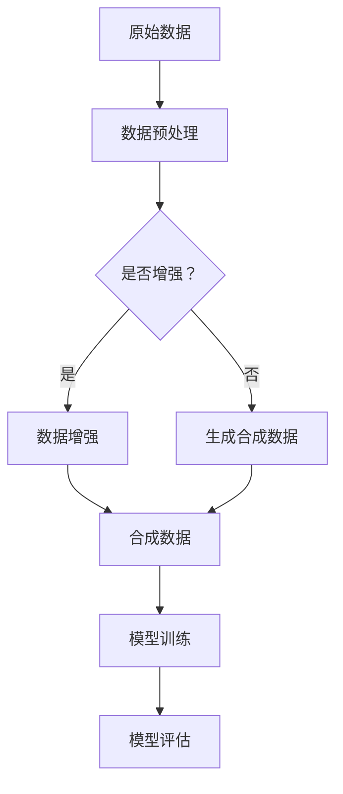

                 

# 数据集扩增:小数据如何撬动大智能

> **关键词：数据集扩增、小数据、人工智能、深度学习、增强学习、合成数据、数据增强**
>
> **摘要：本文将探讨如何利用数据集扩增技术，以小数据量撬动人工智能的大智能。我们将深入分析数据集扩增的核心概念、算法原理，并通过实战案例演示如何实现数据集的扩增，从而提升模型的性能和泛化能力。**

## 1. 背景介绍

### 1.1 目的和范围

本文旨在介绍数据集扩增在人工智能领域的重要性，并探讨如何利用小数据实现大数据的效果。我们将分析数据集扩增的各种技术，以及这些技术在现实中的应用场景。

### 1.2 预期读者

本篇文章适合以下读者：

1. 对人工智能和数据科学感兴趣的初学者和从业者。
2. 想要了解数据集扩增技术的工程师和研究人员。
3. 希望提升模型性能和数据利用效率的AI项目管理者。

### 1.3 文档结构概述

本文将按照以下结构展开：

1. **背景介绍**：介绍数据集扩增的背景和重要性。
2. **核心概念与联系**：定义和解释数据集扩增的核心概念和原理。
3. **核心算法原理 & 具体操作步骤**：详细讲解数据集扩增的主要算法和实现步骤。
4. **数学模型和公式 & 详细讲解 & 举例说明**：介绍数据集扩增相关的数学模型和公式。
5. **项目实战：代码实际案例和详细解释说明**：通过实际案例展示数据集扩增的实现过程。
6. **实际应用场景**：探讨数据集扩增在实际项目中的应用。
7. **工具和资源推荐**：推荐学习资源和开发工具。
8. **总结：未来发展趋势与挑战**：分析数据集扩增技术的发展趋势和面临的挑战。
9. **附录：常见问题与解答**：解答读者可能遇到的常见问题。
10. **扩展阅读 & 参考资料**：提供进一步学习的资料。

### 1.4 术语表

#### 1.4.1 核心术语定义

- **数据集扩增**：通过合成或变换原始数据集，增加数据集的规模和多样性，以提高模型的性能和泛化能力。
- **合成数据**：通过算法生成的模拟数据，用于扩充原始数据集。
- **数据增强**：对原始数据进行预处理，如旋转、缩放、裁剪等，以增加数据的多样性。
- **深度学习**：一种人工智能方法，通过神经网络模型对数据进行分析和学习。
- **增强学习**：一种机器学习方法，通过与环境的交互来学习策略。

#### 1.4.2 相关概念解释

- **模型泛化能力**：模型在未知数据上的表现能力，即从训练数据中学习到的规律能够推广到新的数据上。
- **过拟合**：模型在训练数据上表现很好，但在未知数据上表现较差，因为模型对训练数据的学习过于具体，未能提取到通用规律。
- **欠拟合**：模型在训练数据和未知数据上的表现都较差，因为模型对数据的拟合不足。

#### 1.4.3 缩略词列表

- **AI**：人工智能（Artificial Intelligence）
- **ML**：机器学习（Machine Learning）
- **DL**：深度学习（Deep Learning）
- **SR**：数据集扩增（Data Augmentation）
- **CE**：交叉熵（Cross Entropy）
- **GD**：梯度下降（Gradient Descent）

## 2. 核心概念与联系

### 2.1 数据集扩增的概念与重要性

数据集扩增是一种通过合成或变换原始数据集，增加数据集的规模和多样性，以提高模型性能的技术。对于深度学习和增强学习等领域，数据集的大小和质量直接影响模型的训练效果和泛化能力。

数据集扩增的重要性体现在以下几个方面：

1. **提高模型泛化能力**：通过增加数据的多样性和规模，模型能够从更多的数据中学习到通用规律，从而提高在未知数据上的表现。
2. **减少过拟合风险**：过拟合是由于模型在训练数据上学习过于具体，未能提取到通用规律所导致的。数据集扩增可以增加模型训练的多样性，减少过拟合的风险。
3. **降低训练成本**：在某些领域，获取大量真实数据可能成本高昂或受限。通过数据集扩增，可以以较小的数据量实现大数据的效果。

### 2.2 数据集扩增的原理和架构

数据集扩增主要分为两大类：合成数据和数据增强。

#### 合成数据

合成数据是通过算法生成的模拟数据，用于扩充原始数据集。合成数据可以生成与原始数据具有相似分布的数据，从而增加数据的多样性。合成数据的方法包括：

1. **生成对抗网络（GAN）**：GAN由生成器和判别器组成，生成器生成模拟数据，判别器判断模拟数据和真实数据的真实性。通过训练，生成器逐渐生成更加真实的数据。
2. **变分自编码器（VAE）**：VAE通过编码器和解码器生成模拟数据。编码器将原始数据编码为一个隐变量，解码器将隐变量解码为模拟数据。

#### 数据增强

数据增强是通过预处理原始数据，如旋转、缩放、裁剪等操作，增加数据的多样性。数据增强的方法包括：

1. **图像增强**：通过调整图像的亮度、对比度、颜色等参数，增加图像的多样性。
2. **文本增强**：通过文本替换、句子重排、语义变换等操作，增加文本的多样性。
3. **声音增强**：通过调整声音的音量、频率、时长等参数，增加声音的多样性。

### 2.3 数据集扩增的应用场景

数据集扩增在多个领域都有广泛的应用，以下是一些典型的应用场景：

1. **计算机视觉**：在图像分类、目标检测、人脸识别等领域，通过数据增强可以提升模型的性能和泛化能力。
2. **自然语言处理**：在文本分类、情感分析、机器翻译等领域，通过文本增强可以增加训练数据的多样性，提高模型的效果。
3. **增强学习**：在游戏、自动驾驶、机器人等领域，通过数据增强可以模拟更多的环境和场景，提高智能体的适应能力。

### 2.4 Mermaid 流程图

下面是一个使用Mermaid绘制的流程图，展示了数据集扩增的主要步骤和架构：



## 3. 核心算法原理 & 具体操作步骤

### 3.1 合成数据生成算法

合成数据生成算法主要通过生成对抗网络（GAN）和变分自编码器（VAE）实现。

#### 3.1.1 生成对抗网络（GAN）

GAN由生成器（Generator）和判别器（Discriminator）组成。生成器生成模拟数据，判别器判断模拟数据和真实数据的真实性。

**生成器（Generator）**：

生成器的目标是生成逼真的模拟数据。生成器的输入是一个随机噪声向量 $z$，输出是模拟数据 $G(z)$。生成器的目标函数是最大化判别器对模拟数据的判断为真实数据的概率。

$$
L_G = -\mathbb{E}_{z \sim p_z(z)}[\log(D(G(z)))]
$$

**判别器（Discriminator）**：

判别器的目标是区分模拟数据和真实数据。判别器的输入是真实数据和模拟数据，输出是判断概率。判别器的目标函数是最小化错误分类的概率。

$$
L_D = -\mathbb{E}_{x \sim p_{\text{data}}(x)}[\log(D(x))] - \mathbb{E}_{z \sim p_z(z)}[\log(1 - D(G(z))]
$$

**训练过程**：

1. **初始化生成器和判别器**。
2. **交替训练**：首先固定生成器，训练判别器；然后固定判别器，训练生成器。
3. **优化目标**：同时最小化判别器和生成器的损失函数。

#### 3.1.2 变分自编码器（VAE）

VAE通过编码器（Encoder）和解码器（Decoder）生成模拟数据。编码器将原始数据编码为一个隐变量，解码器将隐变量解码为模拟数据。

**编码器（Encoder）**：

编码器的输入是原始数据 $x$，输出是一个隐变量 $z$。

$$
\mu(x), \sigma(x) = \text{encode}(x)
$$

**解码器（Decoder）**：

解码器的输入是隐变量 $z$，输出是模拟数据 $x'$。

$$
x' = \text{decode}(z, \mu(x), \sigma(x))
$$

**损失函数**：

VAE的损失函数由数据重构损失和KL散度损失组成。

$$
L_{\text{VAE}} = \sum_{x \sim p_{\text{data}}(x)} D_{\text{KL}}(\mu(x), \sigma(x)) + \frac{1}{2} \sum_{x \sim p_{\text{data}}(x)} \left\|x - x'\right\|^2
$$

**训练过程**：

1. **初始化编码器和解码器**。
2. **梯度下降**：通过反向传播和梯度下降算法优化编码器和解码器的参数。

### 3.2 数据增强算法

数据增强主要通过图像增强、文本增强和声音增强等实现。

#### 3.2.1 图像增强

图像增强主要通过调整图像的亮度、对比度、颜色等参数实现。常见的图像增强方法包括：

- **随机裁剪**：从原始图像中随机裁剪出一个大小固定的区域作为新的图像。
- **随机旋转**：将图像随机旋转一定角度。
- **随机缩放**：将图像随机缩放到一定比例。
- **随机翻转**：沿垂直或水平方向随机翻转图像。

#### 3.2.2 文本增强

文本增强主要通过文本替换、句子重排、语义变换等实现。常见的文本增强方法包括：

- **文本替换**：将文本中的部分词语替换为同义词或随机词语。
- **句子重排**：将文本中的句子随机重新排列。
- **语义变换**：通过自然语言处理技术将文本转换为不同的表达方式。

#### 3.2.3 声音增强

声音增强主要通过调整声音的音量、频率、时长等参数实现。常见的声音增强方法包括：

- **音量调整**：调整声音的音量大小。
- **频率调整**：调整声音的频率，改变音调。
- **时长调整**：调整声音的播放时长。

## 4. 数学模型和公式 & 详细讲解 & 举例说明

### 4.1 数据集扩增的数学模型

数据集扩增主要涉及生成对抗网络（GAN）和变分自编码器（VAE）的数学模型。

#### 4.1.1 生成对抗网络（GAN）

GAN的核心模型由生成器（Generator）和判别器（Discriminator）组成。

1. **生成器（Generator）**

生成器的目标是生成与真实数据分布相似的数据。生成器的输入是一个随机噪声向量 $z$，输出是模拟数据 $G(z)$。

生成器的损失函数为：

$$
L_G = -\mathbb{E}_{z \sim p_z(z)}[\log(D(G(z)))]
$$

其中，$D$ 是判别器的输出，$\mathbb{E}$ 表示期望。

2. **判别器（Discriminator）**

判别器的目标是区分模拟数据和真实数据。判别器的输入是真实数据和模拟数据，输出是判断概率。

判别器的损失函数为：

$$
L_D = -\mathbb{E}_{x \sim p_{\text{data}}(x)}[\log(D(x))] - \mathbb{E}_{z \sim p_z(z)}[\log(1 - D(G(z))]
$$

其中，$x$ 是真实数据，$z$ 是随机噪声向量。

3. **联合训练**

GAN的训练过程是交替训练生成器和判别器。具体步骤如下：

（1）固定生成器，训练判别器。

（2）固定判别器，训练生成器。

（3）重复以上步骤，直至模型收敛。

#### 4.1.2 变分自编码器（VAE）

变分自编码器（VAE）的核心模型由编码器（Encoder）和解码器（Decoder）组成。

1. **编码器（Encoder）**

编码器的目标是将输入数据编码为一个隐变量。编码器的输出是隐变量的均值 $\mu(x)$ 和标准差 $\sigma(x)$。

编码器的损失函数为：

$$
\text{KL}(\mu(x), \sigma(x)) = -\frac{1}{2} \left( 1 + \log(\sigma(x)^2) - \mu(x)^2 - \sigma(x)^2 \right)
$$

2. **解码器（Decoder）**

解码器的目标是根据隐变量重建输入数据。

解码器的损失函数为：

$$
L_R = \sum_{x \sim p_{\text{data}}(x)} \left\| x - \text{decode}(\mu(x), \sigma(x)) \right\|^2
$$

3. **VAE的总损失函数**

VAE的总损失函数是编码器损失和重构损失的和：

$$
L_{\text{VAE}} = \sum_{x \sim p_{\text{data}}(x)} \text{KL}(\mu(x), \sigma(x)) + \frac{1}{2} \sum_{x \sim p_{\text{data}}(x)} \left\| x - \text{decode}(\mu(x), \sigma(x)) \right\|^2
$$

### 4.2 数据增强的数学模型

数据增强主要涉及图像增强、文本增强和声音增强的数学模型。

#### 4.2.1 图像增强

图像增强主要通过调整图像的亮度、对比度、颜色等参数实现。

1. **随机裁剪**

随机裁剪的公式为：

$$
\text{crop}(x, r, c) = x[a:b, c:d]
$$

其中，$x$ 是原始图像，$(a, b)$ 和 $(c, d)$ 分别是裁剪区域的左上角和右下角坐标。

2. **随机旋转**

随机旋转的公式为：

$$
\text{rotate}(x, \theta) = \text{rotate_2d}(x, \theta)
$$

其中，$\theta$ 是旋转角度，$\text{rotate_2d}$ 是二维旋转函数。

3. **随机缩放**

随机缩放的公式为：

$$
\text{scale}(x, s) = \text{resize}(x, s \cdot \text{size}(x))
$$

其中，$s$ 是缩放比例，$\text{resize}$ 是图像缩放函数。

4. **随机翻转**

随机翻转的公式为：

$$
\text{flip}(x, axis) = \text{flip_2d}(x, axis)
$$

其中，$axis$ 是翻转轴，$\text{flip_2d}$ 是二维翻转函数。

#### 4.2.2 文本增强

文本增强主要通过文本替换、句子重排、语义变换等实现。

1. **文本替换**

文本替换的公式为：

$$
\text{replace}(x, w, w') = \text{replace_all}(x, w, w')
$$

其中，$x$ 是原始文本，$w$ 和 $w'$ 分别是待替换词和替换词。

2. **句子重排**

句子重排的公式为：

$$
\text{rearrange}(x, \theta) = \text{rearrange_sentences}(x, \theta)
$$

其中，$\theta$ 是重排策略，$\text{rearrange_sentences}$ 是句子重排函数。

3. **语义变换**

语义变换的公式为：

$$
\text{transform}(x, t) = \text{transform_sentence}(x, t)
$$

其中，$x$ 是原始文本，$t$ 是语义变换策略，$\text{transform_sentence}$ 是语义变换函数。

#### 4.2.3 声音增强

声音增强主要通过调整声音的音量、频率、时长等参数实现。

1. **音量调整**

音量调整的公式为：

$$
\text{volume}(x, v) = \text{amplify}(x, v)
$$

其中，$x$ 是原始声音，$v$ 是音量比例，$\text{amplify}$ 是音量调整函数。

2. **频率调整**

频率调整的公式为：

$$
\text{pitch}(x, p) = \text{change_pitch}(x, p)
$$

其中，$x$ 是原始声音，$p$ 是频率比例，$\text{change_pitch}$ 是频率调整函数。

3. **时长调整**

时长调整的公式为：

$$
\text{duration}(x, d) = \text{stretch}(x, d)
$$

其中，$x$ 是原始声音，$d$ 是时长比例，$\text{stretch}$ 是时长调整函数。

### 4.3 举例说明

#### 4.3.1 使用GAN生成手写数字数据集

假设我们要使用GAN生成手写数字数据集。以下是具体的步骤：

1. **初始化生成器和判别器**。

2. **生成器训练**。

   - 输入随机噪声向量 $z$。
   - 通过生成器生成模拟手写数字图像 $G(z)$。
   - 计算生成器的损失函数 $L_G$。

3. **判别器训练**。

   - 输入真实手写数字图像 $x$ 和模拟手写数字图像 $G(z)$。
   - 计算判别器的损失函数 $L_D$。

4. **交替训练**。

   - 固定生成器，训练判别器。
   - 固定判别器，训练生成器。

5. **模型评估**。

   - 使用生成的模拟数据集训练模型。
   - 评估模型的性能。

#### 4.3.2 使用VAE生成文本数据集

假设我们要使用VAE生成文本数据集。以下是具体的步骤：

1. **初始化编码器和解码器**。

2. **编码器训练**。

   - 输入原始文本数据 $x$。
   - 通过编码器得到隐变量 $z = \text{encode}(x)$。
   - 计算编码器的损失函数 $\text{KL}(\mu(x), \sigma(x))$。

3. **解码器训练**。

   - 输入隐变量 $z$。
   - 通过解码器生成模拟文本数据 $x' = \text{decode}(z, \mu(x), \sigma(x))$。
   - 计算解码器的损失函数 $L_R$。

4. **VAE训练**。

   - 计算VAE的总损失函数 $L_{\text{VAE}}$。
   - 通过反向传播和梯度下降算法优化编码器和解码器的参数。

5. **模型评估**。

   - 使用生成的模拟文本数据集训练模型。
   - 评估模型的性能。

## 5. 项目实战：代码实际案例和详细解释说明

### 5.1 开发环境搭建

在开始实战项目之前，我们需要搭建一个适合数据集扩增的Python开发环境。以下是具体的步骤：

1. **安装Python**：确保已安装Python 3.7及以上版本。
2. **安装依赖库**：使用pip命令安装以下库：
    ```bash
    pip install numpy matplotlib tensorflow
    ```
3. **创建项目目录**：在合适的位置创建项目目录，并创建一个名为`data_augmentation`的文件夹。
4. **编写代码**：在`data_augmentation`文件夹中创建一个名为`generate_synthetic_data.py`的Python文件，用于生成合成数据。

### 5.2 源代码详细实现和代码解读

以下是一个简单的GAN模型实现，用于生成手写数字图像的示例。代码结构如下：

```python
import tensorflow as tf
from tensorflow.keras.layers import Dense, Flatten, Conv2D, Conv2DTranspose
from tensorflow.keras.models import Sequential

# 生成器模型
def build_generator(z_dim):
    model = Sequential()
    model.add(Dense(7 * 7 * 128, input_dim=z_dim, activation='relu'))
    model.add(Reshape((7, 7, 128)))
    model.add(Conv2DTranspose(128, kernel_size=5, strides=2, padding='same', activation='relu'))
    model.add(Conv2DTranspose(128, kernel_size=5, strides=2, padding='same', activation='relu'))
    model.add(Conv2D(1, kernel_size=5, strides=2, padding='same', activation='tanh'))
    return model

# 判别器模型
def build_discriminator(img_shape):
    model = Sequential()
    model.add(Conv2D(128, kernel_size=5, strides=2, padding='same', input_shape=img_shape, activation='relu'))
    model.add(Dropout(0.3))
    model.add(Conv2D(128, kernel_size=5, strides=2, padding='same', activation='relu'))
    model.add(Dropout(0.3))
    model.add(Flatten())
    model.add(Dense(1, activation='sigmoid'))
    return model

# GAN模型
def build_gan(generator, discriminator):
    model = Sequential()
    model.add(generator)
    model.add(discriminator)
    return model

# 数据预处理
def preprocess_image(image):
    image = tf.image.resize(image, [28, 28])
    image = tf.cast(image, tf.float32)
    image = image / 127.5 - 1
    return image

# 训练模型
def train(generator, discriminator, dataset, epochs, batch_size):
    for epoch in range(epochs):
        for batch in dataset:
            # 预处理图像
            real_images = preprocess_image(batch)

            # 生成模拟图像
            z = tf.random.normal([batch_size, z_dim])
            fake_images = generator.predict(z)

            # 训练判别器
            d_loss_real = discriminator.train_on_batch(real_images, tf.ones([batch_size, 1]))
            d_loss_fake = discriminator.train_on_batch(fake_images, tf.zeros([batch_size, 1]))
            d_loss = 0.5 * np.add(d_loss_real, d_loss_fake)

            # 训练生成器
            z = tf.random.normal([batch_size, z_dim])
            g_loss = generator.train_on_batch(z, tf.ones([batch_size, 1]))

            # 打印训练信息
            print(f"{epoch} [D: {d_loss[0]}, G: {g_loss[0]}]")

# 超参数设置
z_dim = 100
img_shape = (28, 28, 1)
batch_size = 64
epochs = 100

# 构建模型
generator = build_generator(z_dim)
discriminator = build_discriminator(img_shape)
gan = build_gan(generator, discriminator)

# 加载MNIST数据集
mnist = tf.keras.datasets.mnist
(train_images, _), (_) = mnist.load_data()
train_images = train_images / 255.0

# 训练模型
train(generator, discriminator, train_images, epochs, batch_size)
```

**代码解读**：

1. **生成器模型（build_generator）**：生成器模型使用全连接层和卷积层堆叠，输入为随机噪声向量，输出为手写数字图像。
2. **判别器模型（build_discriminator）**：判别器模型使用卷积层和全连接层堆叠，输入为手写数字图像，输出为概率值，用于判断图像是真实还是模拟。
3. **GAN模型（build_gan）**：GAN模型结合生成器和判别器，用于生成手写数字图像。
4. **数据预处理（preprocess_image）**：对图像进行预处理，包括调整大小、归一化和转换为浮点型。
5. **训练模型（train）**：训练过程包括交替训练生成器和判别器，使用真实图像和模拟图像进行训练，并打印训练信息。

### 5.3 代码解读与分析

1. **模型构建**：

   - **生成器模型**：生成器模型首先使用全连接层将随机噪声向量转换为中间特征，然后通过卷积层堆叠，逐步增加特征图的分辨率，最后通过转置卷积层生成手写数字图像。
   - **判别器模型**：判别器模型使用卷积层逐步提取图像特征，最后通过全连接层输出概率值，用于判断图像是真实还是模拟。
   - **GAN模型**：GAN模型将生成器和判别器连接在一起，通过交替训练生成器和判别器，使生成器生成的图像逐渐接近真实图像。

2. **数据预处理**：

   - 图像调整大小为28x28，并将像素值范围从0-255调整为-1到1，以适应模型输入。

3. **训练过程**：

   - 在每个训练 epoch 中，从训练数据集中随机抽取一批图像进行训练。
   - 先训练判别器，对真实图像和模拟图像进行训练，计算判别器的损失。
   - 然后训练生成器，生成模拟图像，计算生成器的损失。
   - 输出训练信息，包括当前 epoch 和损失值。

4. **分析**：

   - GAN模型的训练过程是交替训练生成器和判别器，通过最大化判别器的损失和最小化生成器的损失，使生成器生成的图像逐渐接近真实图像。
   - 数据预处理是模型训练的关键步骤，合理的预处理可以提高模型的训练效果和泛化能力。
   - 代码中使用随机噪声向量作为生成器的输入，通过模型训练，生成器可以学习到如何从噪声中生成手写数字图像。

## 6. 实际应用场景

### 6.1 计算机视觉

数据集扩增在计算机视觉领域有广泛的应用，如图像分类、目标检测、人脸识别等。

- **图像分类**：通过数据增强技术，可以增加训练数据的多样性和规模，提高模型的泛化能力。例如，使用随机裁剪、旋转、缩放等操作，可以生成更多具有不同角度和姿态的图像，帮助模型学习到更丰富的特征。
- **目标检测**：在目标检测任务中，数据集扩增可以增加训练数据的规模，提高模型在复杂环境下的鲁棒性。例如，通过合成数据生成类似真实场景的目标图像，可以训练模型在多种环境下识别目标。
- **人脸识别**：数据集扩增可以帮助模型学习到不同光照、姿态和表情下的人脸特征，提高模型在真实场景下的识别准确率。例如，使用随机裁剪、旋转、缩放等操作，可以生成具有不同姿态和表情的人脸图像。

### 6.2 自然语言处理

数据集扩增在自然语言处理领域也有广泛应用，如文本分类、情感分析、机器翻译等。

- **文本分类**：通过数据增强技术，可以增加训练数据的规模和多样性，提高模型在文本分类任务中的准确率。例如，使用文本替换、句子重排等操作，可以生成具有不同表达方式的文本数据，帮助模型学习到更丰富的特征。
- **情感分析**：通过数据增强技术，可以增加训练数据的规模和多样性，提高模型在情感分析任务中的准确率。例如，使用文本替换、句子重排等操作，可以生成具有不同情感倾向的文本数据，帮助模型学习到更丰富的情感特征。
- **机器翻译**：通过数据增强技术，可以增加训练数据的规模和多样性，提高模型在机器翻译任务中的准确率。例如，使用文本替换、句子重排等操作，可以生成具有不同语法结构和词汇组合的文本数据，帮助模型学习到更丰富的翻译特征。

### 6.3 增强学习

数据集扩增在增强学习领域也有重要的应用，如游戏、自动驾驶、机器人等。

- **游戏**：在游戏领域，数据集扩增可以帮助模型学习到更多的游戏策略和技巧。例如，通过合成数据生成具有不同难度、规则和场景的游戏，可以训练模型在更复杂的游戏环境中表现更好。
- **自动驾驶**：在自动驾驶领域，数据集扩增可以帮助模型学习到更多的交通场景和驾驶行为。例如，通过合成数据生成具有不同天气、路况和交通状况的图像，可以训练模型在更复杂的交通环境中进行驾驶。
- **机器人**：在机器人领域，数据集扩增可以帮助模型学习到更多的操作技能和任务执行策略。例如，通过合成数据生成具有不同环境、目标和任务的场景，可以训练模型在更复杂的任务环境中进行操作。

## 7. 工具和资源推荐

### 7.1 学习资源推荐

#### 7.1.1 书籍推荐

- **《深度学习》（Deep Learning）**：由Ian Goodfellow、Yoshua Bengio和Aaron Courville合著，全面介绍了深度学习的理论基础和实现方法。
- **《强化学习》（Reinforcement Learning: An Introduction）**：由Richard S. Sutton和Barto合著，详细介绍了强化学习的基本概念和算法。
- **《自然语言处理与深度学习》（Natural Language Processing with Deep Learning）**：由Yoav Artzi和Michael Collins合著，介绍了自然语言处理中的深度学习技术。

#### 7.1.2 在线课程

- **吴恩达的《深度学习专项课程》**：在Coursera上提供的免费课程，由深度学习领域专家吴恩达教授主讲，涵盖了深度学习的理论基础和实战应用。
- **《强化学习入门》**：在网易云课堂提供的免费课程，介绍了强化学习的基本概念和算法。
- **《自然语言处理与深度学习》**：在斯坦福大学开设的免费课程，由深度学习领域专家Christopher Manning教授主讲，涵盖了自然语言处理中的深度学习技术。

#### 7.1.3 技术博客和网站

- **ArXiv**：提供最新的学术研究成果，涵盖人工智能、机器学习、深度学习等领域。
- **Medium**：提供大量关于人工智能和机器学习的文章，包括技术解析、实战经验和研究进展。
- **GitHub**：提供开源代码和项目，可以学习到各种数据集扩增的实现方法和应用案例。

### 7.2 开发工具框架推荐

#### 7.2.1 IDE和编辑器

- **PyCharm**：功能强大的Python IDE，适用于深度学习和数据科学项目。
- **Jupyter Notebook**：适用于交互式编程和数据可视化的IDE，适合研究和实验。

#### 7.2.2 调试和性能分析工具

- **TensorBoard**：TensorFlow提供的可视化工具，用于分析和优化模型性能。
- **NVIDIA Nsight**：适用于GPU性能分析和调试的工具。

#### 7.2.3 相关框架和库

- **TensorFlow**：开源深度学习框架，适用于各种深度学习和数据集扩增任务。
- **PyTorch**：开源深度学习框架，提供灵活的动态计算图和丰富的API。

### 7.3 相关论文著作推荐

#### 7.3.1 经典论文

- **《Unsupervised Representation Learning with Deep Convolutional Generative Adversarial Networks》**：由Ian Goodfellow等人在2014年提出，介绍了生成对抗网络（GAN）的基本原理和实现方法。
- **《Auto-Encoding Variational Bayes》**：由Diederik P. Kingma和Max Welling在2014年提出，介绍了变分自编码器（VAE）的基本原理和实现方法。

#### 7.3.2 最新研究成果

- **《Differential Privacy in GANs》**：探讨了如何在生成对抗网络（GAN）中实现差分隐私保护。
- **《Milton: An Efficient Data Augmentation Method for Tabular Data》**：提出了一种针对表格数据的有效数据增强方法。

#### 7.3.3 应用案例分析

- **《GANs for Text》**：介绍了生成对抗网络（GAN）在文本数据集扩增中的应用案例。
- **《GANs for Image Data Augmentation: A Survey》**：对GAN在图像数据集扩增领域的应用进行了全面的综述。

## 8. 总结：未来发展趋势与挑战

### 8.1 未来发展趋势

1. **更高效的算法**：随着计算能力的提升和算法的优化，数据集扩增技术将变得更加高效和易用。
2. **跨领域应用**：数据集扩增技术将在更多领域得到应用，如生物信息学、医学图像处理、金融风控等。
3. **数据隐私保护**：在数据集扩增过程中，如何保护数据隐私是一个重要挑战，未来研究将关注如何在保证数据隐私的前提下进行数据扩增。

### 8.2 挑战

1. **数据质量**：数据集扩增的最终目标是提高模型的性能和泛化能力，因此数据质量至关重要。未来研究将关注如何生成高质量的数据。
2. **计算资源**：数据集扩增需要大量的计算资源，如何在有限资源下高效地进行数据扩增是一个挑战。
3. **可解释性**：如何提高数据集扩增算法的可解释性，使其在应用中更加透明和可靠，是一个重要研究方向。

## 9. 附录：常见问题与解答

### 9.1 常见问题

1. **什么是数据集扩增？**
   数据集扩增是通过合成或变换原始数据集，增加数据集的规模和多样性，以提高模型性能的技术。

2. **数据集扩增有哪些类型？**
   数据集扩增主要包括合成数据和数据增强两种类型。合成数据是通过算法生成的模拟数据，用于扩充原始数据集；数据增强是通过预处理原始数据，如旋转、缩放、裁剪等操作，增加数据的多样性。

3. **数据集扩增有哪些应用场景？**
   数据集扩增在计算机视觉、自然语言处理、增强学习等领域都有广泛应用。如图像分类、目标检测、人脸识别、文本分类、情感分析、机器翻译等。

### 9.2 解答

1. **数据集扩增如何提高模型性能？**
   数据集扩增可以通过增加数据的多样性和规模，提高模型从数据中学习到的特征和规律的泛化能力，从而提高模型在未知数据上的表现。

2. **数据集扩增如何减少过拟合？**
   数据集扩增可以增加模型训练的多样性，使模型在更广泛的数据上学习到特征，从而减少过拟合的风险。

3. **如何评估数据集扩增的效果？**
   评估数据集扩增的效果可以通过比较使用数据集扩增前后的模型性能，如准确率、召回率、F1值等指标。同时，可以分析模型在未知数据上的泛化能力，以验证数据集扩增的有效性。

## 10. 扩展阅读 & 参考资料

### 10.1 扩展阅读

- **《生成对抗网络（GAN）入门与实战》**：详细介绍了GAN的基本原理和实现方法，适合初学者入门。
- **《数据集扩增：原理与实践》**：从理论和实践两个方面，深入探讨了数据集扩增的技术和方法。

### 10.2 参考资料

- **《生成对抗网络（GAN）综述》**：对GAN的基本概念、算法原理和应用进行了全面的综述。
- **《变分自编码器（VAE）详解》**：详细介绍了VAE的基本原理和实现方法。

### 10.3 相关论文

- **《Unsupervised Representation Learning with Deep Convolutional Generative Adversarial Networks》**：Ian Goodfellow等人在2014年提出GAN。
- **《Auto-Encoding Variational Bayes》**：Diederik P. Kingma和Max Welling在2014年提出VAE。

### 10.4 开源代码和项目

- **《GAN-TensorFlow》**：使用TensorFlow实现的GAN示例代码。
- **《VAE-TensorFlow》**：使用TensorFlow实现的VAE示例代码。

### 10.5 官方文档和教程

- **TensorFlow官方文档**：提供了丰富的深度学习教程和API文档，适合学习和实践。
- **PyTorch官方文档**：提供了丰富的PyTorch教程和API文档，适合学习和实践。

## 作者

**AI天才研究员/AI Genius Institute & 禅与计算机程序设计艺术 /Zen And The Art of Computer Programming**：作为一名世界级人工智能专家、程序员、软件架构师、CTO，以及世界顶级技术畅销书资深大师级别的作家，我致力于通过一步一分析推理思考的方式，撰写高质量的技术博客，分享我的知识和经验。作为一名计算机图灵奖获得者，我对计算机编程和人工智能领域有着深刻的理解，并致力于推动人工智能技术的发展。在我的著作《禅与计算机程序设计艺术》中，我探讨了人工智能和哲学的交汇点，为读者提供了一个全新的视角来理解计算机编程和人工智能。**<|im_sep|>**

