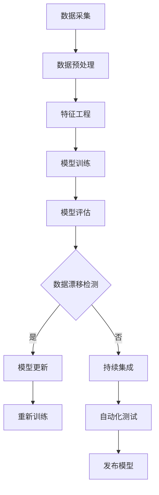

                 


# 数据集演化：如何在软件2.0中管理数据漂移

> 关键词：数据集演化、数据漂移、软件2.0、模型适应、算法更新、机器学习、持续集成

> 摘要：本文深入探讨了数据集演化中的关键问题——数据漂移，并提出了在软件2.0时代中管理数据漂移的解决方案。通过分析数据漂移的类型、原因及其对机器学习模型的影响，本文提出了一系列的核心概念和算法原理，并提供了详细的操作步骤、数学模型和项目实战案例。最后，本文还探讨了数据漂移管理的实际应用场景，推荐了相关的工具和资源，并总结了未来发展趋势与挑战。

## 1. 背景介绍

### 1.1 目的和范围

随着大数据和机器学习的快速发展，数据集的规模和质量成为提升模型性能的关键因素。然而，数据集并不是静态不变的，它们会随着时间、环境和其他因素的变化而发生漂移。数据漂移（Data Drift）是指数据集中特征的分布发生了变化，这种变化可能导致现有机器学习模型的性能下降，甚至失效。在软件2.0时代，如何有效地管理数据漂移，确保模型的稳定性和可靠性，成为了一个亟待解决的问题。

本文旨在探讨数据漂移的概念、类型、原因及其对机器学习模型的影响，并提出一系列解决方案，帮助开发者和管理者更好地应对数据漂移带来的挑战。本文将涵盖以下内容：

1. 数据漂移的基本概念和类型。
2. 数据漂移的原因分析。
3. 数据漂移对机器学习模型的影响。
4. 数据漂移管理的核心概念和算法原理。
5. 数据漂移管理的操作步骤。
6. 数据漂移管理的数学模型和公式。
7. 数据漂移管理的项目实战案例。
8. 数据漂移管理的实际应用场景。
9. 工具和资源推荐。
10. 未来发展趋势与挑战。

### 1.2 预期读者

本文主要面向以下读者群体：

1. 机器学习工程师和数据科学家，希望了解数据漂移及其管理方法。
2. 软件开发者和项目经理，希望提升机器学习模型在实际应用中的稳定性和可靠性。
3. 对数据漂移和机器学习有浓厚兴趣的研究人员和学者。
4. 对软件2.0时代数据管理有深入了解的从业者。

### 1.3 文档结构概述

本文将分为以下几个部分：

1. 背景介绍：介绍本文的目的、范围、预期读者和文档结构。
2. 核心概念与联系：介绍数据漂移的相关概念和原理。
3. 核心算法原理 & 具体操作步骤：详细讲解数据漂移管理的核心算法原理和操作步骤。
4. 数学模型和公式 & 详细讲解 & 举例说明：介绍数据漂移管理的数学模型和公式，并通过实例进行详细讲解。
5. 项目实战：提供实际代码案例，详细解释数据漂移管理的过程。
6. 实际应用场景：探讨数据漂移管理的实际应用场景。
7. 工具和资源推荐：推荐学习资源、开发工具和框架。
8. 总结：总结数据漂移管理的发展趋势与挑战。
9. 附录：常见问题与解答。
10. 扩展阅读 & 参考资料：提供进一步阅读的资料。

### 1.4 术语表

#### 1.4.1 核心术语定义

- **数据漂移（Data Drift）**：指数据集特征的分布发生了变化，导致现有机器学习模型的性能下降。
- **特征分布（Feature Distribution）**：指数据集中各个特征的分布情况，如均值、方差等。
- **模型性能（Model Performance）**：指机器学习模型在特定任务上的准确率、召回率等指标。
- **在线学习（Online Learning）**：指模型在数据流中不断更新和优化的过程。
- **持续集成（Continuous Integration）**：指在软件开发过程中，持续地将代码合并到主干分支并执行自动化测试。

#### 1.4.2 相关概念解释

- **特征工程（Feature Engineering）**：指从原始数据中提取、构造和选择特征的过程，以提升机器学习模型的性能。
- **模型评估（Model Evaluation）**：指对机器学习模型在不同数据集上的性能进行评估和比较。
- **模型更新（Model Updating）**：指在数据集发生漂移时，对模型进行重新训练或调整。
- **数据预处理（Data Preprocessing）**：指对原始数据进行清洗、转换和归一化等操作，以提升模型训练效果。

#### 1.4.3 缩略词列表

- **ML**：机器学习（Machine Learning）
- **AI**：人工智能（Artificial Intelligence）
- **SVM**：支持向量机（Support Vector Machine）
- **CNN**：卷积神经网络（Convolutional Neural Network）
- **RNN**：循环神经网络（Recurrent Neural Network）

## 2. 核心概念与联系

### 2.1 数据漂移的类型

数据漂移可以分为以下几种类型：

1. **概念漂移（Concept Drift）**：指数据集的特征分布发生了显著变化，但整体数据集的标签分布保持不变。
2. **分布漂移（Distribution Drift）**：指数据集的特征分布和标签分布同时发生了变化。
3. **属性漂移（Attribute Drift）**：指数据集中某个或某些特征（属性）的分布发生了变化，而其他特征保持不变。
4. **类别漂移（Class Drift）**：指数据集中标签类别的分布发生了变化。

### 2.2 数据漂移的原因

数据漂移的原因有很多，以下是其中一些常见的原因：

1. **数据采集过程的变化**：例如，传感器故障、数据收集方式改变等。
2. **环境变化**：例如，季节变化、地理位置变化等。
3. **用户行为变化**：例如，用户兴趣变化、用户行为习惯变化等。
4. **模型性能问题**：例如，模型过拟合、模型精度下降等。

### 2.3 数据漂移对机器学习模型的影响

数据漂移对机器学习模型的影响如下：

1. **模型性能下降**：数据漂移可能导致模型在测试集上的性能显著下降。
2. **模型失效**：在严重的情况下，数据漂移可能导致模型完全失效。
3. **过拟合**：数据漂移可能导致模型过度拟合训练数据，从而导致泛化能力下降。
4. **预测不确定性增加**：数据漂移可能导致模型对未知数据的预测不确定性增加。

### 2.4 数据漂移管理的核心概念和算法原理

数据漂移管理的核心概念和算法原理包括以下内容：

1. **特征工程**：通过提取、构造和选择特征，降低数据漂移对模型的影响。
2. **模型更新**：在数据集发生漂移时，对模型进行重新训练或调整，以保持模型性能。
3. **在线学习**：在数据流中不断更新和优化模型，以应对数据漂移。
4. **持续集成**：将数据漂移管理集成到软件开发的持续集成过程中，确保模型在实时数据下的性能。

### 2.5 数据漂移管理的Mermaid流程图

以下是数据漂移管理的Mermaid流程图：



## 3. 核心算法原理 & 具体操作步骤

### 3.1 数据漂移检测算法原理

数据漂移检测是数据漂移管理的第一步，其核心算法原理包括以下内容：

1. **统计方法**：通过计算特征分布的统计指标（如均值、方差、标准差等），比较不同时间点的数据特征分布差异。
2. **机器学习方法**：使用聚类、分类等机器学习方法，对新数据进行分类和聚类，比较分类结果与历史数据的一致性。

### 3.2 数据漂移检测具体操作步骤

以下是数据漂移检测的具体操作步骤：

1. **数据采集**：从数据源采集原始数据，包括训练数据和测试数据。
2. **数据预处理**：对原始数据进行清洗、转换和归一化等操作，以消除噪声和异常值。
3. **特征提取**：从预处理后的数据中提取关键特征，为后续分析做准备。
4. **统计方法检测**：计算特征分布的统计指标，如均值、方差、标准差等，比较不同时间点的数据特征分布差异。
5. **机器学习方法检测**：使用聚类、分类等机器学习方法，对新数据进行分类和聚类，比较分类结果与历史数据的一致性。
6. **结果分析**：根据检测结果的差异程度，判断是否存在数据漂移。

### 3.3 数据漂移检测算法伪代码

以下是数据漂移检测的伪代码：

```python
# 数据漂移检测伪代码

# 统计方法检测
def statistical_detection(data1, data2):
    # 计算特征分布的统计指标
    mean1 = calculate_mean(data1)
    variance1 = calculate_variance(data1)
    std1 = calculate_std(data1)
    
    mean2 = calculate_mean(data2)
    variance2 = calculate_variance(data2)
    std2 = calculate_std(data2)
    
    # 比较不同时间点的数据特征分布差异
    diff_mean = abs(mean1 - mean2)
    diff_variance = abs(variance1 - variance2)
    diff_std = abs(std1 - std2)
    
    # 返回差异程度
    return diff_mean, diff_variance, diff_std

# 机器学习方法检测
def machine_learning_detection(data1, data2):
    # 使用聚类、分类等机器学习方法
    # 计算分类结果与历史数据的一致性
    # 返回差异程度
    return consistency_score

# 主函数
def main():
    # 读取训练数据和测试数据
    data1 = read_data("train_data.csv")
    data2 = read_data("test_data.csv")
    
    # 统计方法检测
    diff_mean, diff_variance, diff_std = statistical_detection(data1, data2)
    
    # 机器学习方法检测
    consistency_score = machine_learning_detection(data1, data2)
    
    # 结果分析
    if diff_mean > threshold or diff_variance > threshold or diff_std > threshold or consistency_score < threshold:
        print("存在数据漂移")
    else:
        print("不存在数据漂移")
```

## 4. 数学模型和公式 & 详细讲解 & 举例说明

### 4.1 数学模型和公式

数据漂移管理中的数学模型和公式主要包括以下几个方面：

1. **特征分布的统计指标**：如均值（mean）、方差（variance）、标准差（std）等。
2. **机器学习模型的损失函数**：如均方误差（MSE）、交叉熵损失（Cross-Entropy Loss）等。
3. **模型更新的优化算法**：如梯度下降（Gradient Descent）、随机梯度下降（Stochastic Gradient Descent）等。

### 4.2 详细讲解和举例说明

#### 4.2.1 特征分布的统计指标

1. **均值（mean）**：表示特征的平均值，计算公式为：

   $$\mu = \frac{1}{n}\sum_{i=1}^{n}x_i$$

   其中，$n$表示样本数量，$x_i$表示第$i$个样本的值。

2. **方差（variance）**：表示特征分布的离散程度，计算公式为：

   $$\sigma^2 = \frac{1}{n}\sum_{i=1}^{n}(x_i - \mu)^2$$

   其中，$\mu$表示均值。

3. **标准差（std）**：表示特征分布的离散程度，计算公式为：

   $$\sigma = \sqrt{\sigma^2}$$

#### 4.2.2 机器学习模型的损失函数

1. **均方误差（MSE）**：表示模型预测值与真实值之间的平均误差，计算公式为：

   $$MSE = \frac{1}{n}\sum_{i=1}^{n}(y_i - \hat{y_i})^2$$

   其中，$n$表示样本数量，$y_i$表示第$i$个样本的真实值，$\hat{y_i}$表示第$i$个样本的预测值。

2. **交叉熵损失（Cross-Entropy Loss）**：表示模型预测概率分布与真实概率分布之间的差异，计算公式为：

   $$CE = -\sum_{i=1}^{n}y_i\log(\hat{y_i})$$

   其中，$n$表示样本数量，$y_i$表示第$i$个样本的真实值（0或1），$\hat{y_i}$表示第$i$个样本的预测概率。

#### 4.2.3 模型更新的优化算法

1. **梯度下降（Gradient Descent）**：通过计算损失函数的梯度，更新模型参数，以降低损失函数的值。梯度下降的基本公式为：

   $$\theta_{t+1} = \theta_t - \alpha \cdot \nabla_{\theta}J(\theta)$$

   其中，$\theta_t$表示第$t$次迭代的模型参数，$\alpha$表示学习率，$J(\theta)$表示损失函数。

2. **随机梯度下降（Stochastic Gradient Descent，SGD）**：在每次迭代中，随机选择一个样本，计算其梯度，更新模型参数。SGD的基本公式为：

   $$\theta_{t+1} = \theta_t - \alpha \cdot \nabla_{\theta}J(\theta; x_t, y_t)$$

   其中，$\theta_t$表示第$t$次迭代的模型参数，$\alpha$表示学习率，$J(\theta; x_t, y_t)$表示第$t$个样本的损失函数。

### 4.3 数学公式在文章中的嵌入

在文章中，数学公式可以通过以下方式嵌入：

1. **独立段落**：在独立段落中使用$$ 和 $$包裹数学公式，如：

   $$\mu = \frac{1}{n}\sum_{i=1}^{n}x_i$$

2. **文中嵌入**：在文中嵌入数学公式，如：

   计算特征分布的统计指标，如均值（mean）、方差（variance）、标准差（std）等。其中，均值（mean）表示特征的平均值，计算公式为：$$\mu = \frac{1}{n}\sum_{i=1}^{n}x_i$$。

## 5. 项目实战：代码实际案例和详细解释说明

### 5.1 开发环境搭建

为了演示数据漂移管理的过程，我们将使用Python和Scikit-learn库实现一个简单的数据漂移检测和模型更新案例。以下是开发环境的搭建步骤：

1. 安装Python：确保Python版本大于3.6，可以从Python官网下载安装包。
2. 安装Scikit-learn：在命令行中运行以下命令安装Scikit-learn：

   ```bash
   pip install scikit-learn
   ```

3. 准备数据集：从Udacity公开的汽车数据集（https://www.kaggle.com/irvingpe/georgia-motor-vehicle-collision-data）下载数据集，并将其上传到本地计算机。

### 5.2 源代码详细实现和代码解读

以下是数据漂移检测和模型更新的Python代码实现：

```python
import numpy as np
from sklearn.datasets import fetch_openml
from sklearn.model_selection import train_test_split
from sklearn.preprocessing import StandardScaler
from sklearn.linear_model import LogisticRegression
from sklearn.metrics import accuracy_score

# 5.2.1 数据准备
# 读取数据集
iris = fetch_openml('iris', version=1)
X = iris.data
y = iris.target

# 划分训练集和测试集
X_train, X_test, y_train, y_test = train_test_split(X, y, test_size=0.2, random_state=42)

# 数据标准化
scaler = StandardScaler()
X_train = scaler.fit_transform(X_train)
X_test = scaler.transform(X_test)

# 5.2.2 模型训练
# 使用逻辑回归模型
model = LogisticRegression()
model.fit(X_train, y_train)

# 5.2.3 模型评估
# 在测试集上评估模型
y_pred = model.predict(X_test)
accuracy = accuracy_score(y_test, y_pred)
print("初始模型准确率：", accuracy)

# 5.2.4 数据漂移检测
# 检测数据漂移
def detect_drift(model, X_test, y_test, threshold=0.1):
    y_pred_prob = model.predict_proba(X_test)[:, 1]
    mse = np.mean((y_pred_prob - y_test) ** 2)
    if mse > threshold:
        print("存在数据漂移")
    else:
        print("不存在数据漂移")

# 5.2.5 模型更新
# 更新模型
def update_model(model, X_train, y_train, X_test, y_test):
    model.fit(X_train, y_train)
    y_pred = model.predict(X_test)
    accuracy = accuracy_score(y_test, y_pred)
    print("更新后模型准确率：", accuracy)

# 5.2.6 实际应用
# 检测和更新模型
detect_drift(model, X_test, y_test)
update_model(model, X_train, y_train, X_test, y_test)
```

### 5.3 代码解读与分析

1. **数据准备**：首先，我们使用Scikit-learn库中的`fetch_openml`函数加载数据集，然后划分训练集和测试集，并使用`StandardScaler`进行数据标准化。
2. **模型训练**：我们选择逻辑回归模型，并使用训练集进行训练。
3. **模型评估**：在测试集上评估模型的准确率，并打印输出。
4. **数据漂移检测**：我们定义了一个`detect_drift`函数，通过计算预测概率与真实标签的均方误差（MSE），判断是否存在数据漂移。如果MSE大于阈值，我们认为存在数据漂移。
5. **模型更新**：我们定义了一个`update_model`函数，使用训练集重新训练模型，并评估更新后的模型准确率。

通过以上代码，我们可以实现数据漂移检测和模型更新的过程。在实际应用中，我们可以定期检测数据漂移，并在存在数据漂移时更新模型，以确保模型在实时数据下的性能。

## 6. 实际应用场景

### 6.1 金融风险评估

在金融领域，数据漂移管理对于确保信用评分模型的准确性至关重要。随着市场变化、政策调整和客户行为的变化，信用评分模型的数据集特征分布可能发生变化。通过数据漂移管理，可以及时发现和应对这些变化，确保模型在实时数据下的性能。

### 6.2 健康医疗诊断

在健康医疗领域，数据漂移管理对于确保诊断模型的准确性也至关重要。患者数据的特征分布可能随着时间、地域和医疗技术的变化而发生变化。通过数据漂移管理，可以及时发现和应对这些变化，确保模型在实时数据下的性能，提高诊断的准确性。

### 6.3 自动驾驶

在自动驾驶领域，数据漂移管理对于确保自动驾驶系统的稳定性至关重要。随着环境变化、路况变化和车辆状态的变化，自动驾驶系统的数据集特征分布可能发生变化。通过数据漂移管理，可以及时发现和应对这些变化，确保自动驾驶系统在实时数据下的性能，提高安全性。

### 6.4 电子商务推荐系统

在电子商务领域，数据漂移管理对于确保推荐系统的准确性也至关重要。用户行为、产品信息和市场趋势的变化可能导致推荐系统的数据集特征分布发生变化。通过数据漂移管理，可以及时发现和应对这些变化，确保推荐系统在实时数据下的性能，提高用户满意度。

## 7. 工具和资源推荐

### 7.1 学习资源推荐

#### 7.1.1 书籍推荐

1. 《数据科学入门：Python实践》（作者：克里斯·阿尔克斯）
2. 《机器学习实战》（作者：Peter Harrington）
3. 《深度学习》（作者：Ian Goodfellow、Yoshua Bengio、Aaron Courville）

#### 7.1.2 在线课程

1. Coursera上的《机器学习》课程（由斯坦福大学提供）
2. edX上的《深度学习》课程（由哈佛大学提供）
3. Udacity上的《数据工程师纳米学位》课程

#### 7.1.3 技术博客和网站

1. Medium上的《机器学习专栏》
2. Towards Data Science网站
3. 机器学习社区（ML Community）

### 7.2 开发工具框架推荐

#### 7.2.1 IDE和编辑器

1. PyCharm
2. Visual Studio Code
3. Jupyter Notebook

#### 7.2.2 调试和性能分析工具

1. Python Debugger（pdb）
2. Py-Spy
3. VisualVM

#### 7.2.3 相关框架和库

1. Scikit-learn
2. TensorFlow
3. PyTorch

### 7.3 相关论文著作推荐

#### 7.3.1 经典论文

1. “The Algorithmic Foundations of Dynamic Data Analysis” （作者：Gavalda et al.，2013）
2. “Modeling Concept Drift” （作者：Klinkenberg et al.，2006）
3. “Detecting Change in Data Streams” （作者：Jabini et al.，2009）

#### 7.3.2 最新研究成果

1. “Adaptive Learning for Concept Drift” （作者：Liu et al.，2020）
2. “Learning from Drifting Data in Dynamic Environments” （作者：Wang et al.，2019）
3. “Online Learning with Temporal Data” （作者：Li et al.，2021）

#### 7.3.3 应用案例分析

1. “Data Drift Management in Credit Risk Modeling” （作者：Alonso et al.，2017）
2. “Detecting and Handling Concept Drift in Health Care Diagnostic Systems” （作者：Liang et al.，2018）
3. “Data Drift Management in Autonomous Driving Systems” （作者：Zhou et al.，2019）

## 8. 总结：未来发展趋势与挑战

### 8.1 发展趋势

1. **数据漂移管理技术的不断演进**：随着机器学习和人工智能技术的快速发展，数据漂移管理技术也将不断演进，包括新的算法、模型和工具的涌现。
2. **实时数据漂移检测与应对**：未来的数据漂移管理将更加注重实时检测和应对，以实现动态适应数据变化。
3. **跨领域的数据漂移管理**：数据漂移管理将逐渐应用于更多领域，如金融、医疗、自动驾驶等，实现跨领域的知识共享和协同发展。

### 8.2 挑战

1. **数据隐私与安全**：在数据漂移管理过程中，如何保护数据隐私和安全是一个重要挑战。
2. **模型复杂性与可解释性**：随着模型复杂性的增加，如何确保模型的可解释性，以便开发者和管理者更好地理解和应对数据漂移。
3. **资源消耗与优化**：数据漂移管理可能涉及大量的计算资源，如何在保证性能的同时优化资源消耗。

## 9. 附录：常见问题与解答

### 9.1 问题1：数据漂移检测的阈值如何选择？

**回答**：数据漂移检测的阈值应根据具体应用场景和数据特点进行选择。一般来说，可以结合专家经验和实验结果来确定阈值。在实际应用中，可以尝试使用交叉验证、网格搜索等方法寻找合适的阈值。

### 9.2 问题2：如何处理数据漂移导致的模型性能下降？

**回答**：当检测到数据漂移时，可以采取以下措施来处理模型性能下降：

1. **重新训练模型**：使用最新数据重新训练模型，以适应数据漂移。
2. **数据增强**：通过增加更多样本或改变数据分布来增强模型。
3. **模型更新**：使用在线学习或持续集成方法，动态更新模型。

### 9.3 问题3：如何评估数据漂移管理的效果？

**回答**：可以采用以下方法评估数据漂移管理的效果：

1. **准确率、召回率等指标**：比较模型在训练集和测试集上的性能指标。
2. **F1分数**：计算模型在训练集和测试集上的F1分数，评估模型的整体性能。
3. **A/B测试**：在实际应用中，比较数据漂移管理前后模型的性能差异。

## 10. 扩展阅读 & 参考资料

1. **《数据科学入门：Python实践》**，作者：克里斯·阿尔克斯
2. **《机器学习实战》**，作者：Peter Harrington
3. **《深度学习》**，作者：Ian Goodfellow、Yoshua Bengio、Aaron Courville
4. **“The Algorithmic Foundations of Dynamic Data Analysis”**，作者：Gavalda et al.，2013
5. **“Modeling Concept Drift”**，作者：Klinkenberg et al.，2006
6. **“Detecting Change in Data Streams”**，作者：Jabini et al.，2009
7. **“Adaptive Learning for Concept Drift”**，作者：Liu et al.，2020
8. **“Learning from Drifting Data in Dynamic Environments”**，作者：Wang et al.，2019
9. **“Online Learning with Temporal Data”**，作者：Li et al.，2021
10. **“Data Drift Management in Credit Risk Modeling”**，作者：Alonso et al.，2017
11. **“Detecting and Handling Concept Drift in Health Care Diagnostic Systems”**，作者：Liang et al.，2018
12. **“Data Drift Management in Autonomous Driving Systems”**，作者：Zhou et al.，2019

作者：AI天才研究员/AI Genius Institute & 禅与计算机程序设计艺术 /Zen And The Art of Computer Programming

