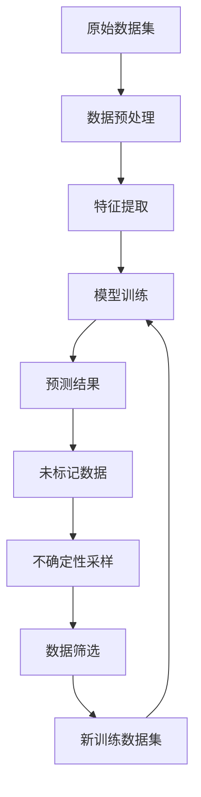

                 

# 数据集筛选：主动学习驱动的数据选择新策略

> **关键词：** 数据集筛选、主动学习、数据选择、机器学习、人工智能
> 
> **摘要：** 本文将探讨数据集筛选在机器学习和人工智能领域的应用，特别是主动学习驱动的数据选择策略。我们将深入分析主动学习的核心原理，解释其如何优化数据集，提高模型训练效果。通过理论讲解和实际案例，我们将展示主动学习在数据筛选中的实践应用，并讨论未来的发展趋势和挑战。

## 1. 背景介绍

### 1.1 目的和范围

本文旨在探讨数据集筛选在机器学习和人工智能领域的重要性，并特别关注主动学习在数据选择中的应用。随着人工智能技术的快速发展，数据的质量和多样性对模型性能的影响日益显著。因此，如何筛选和优化数据集成为了一个关键问题。本文将介绍主动学习的基本原理，探讨其在数据筛选中的应用，并分析其优势。

### 1.2 预期读者

本文适合具有机器学习和人工智能基础的中高级读者，特别是对数据预处理和模型训练感兴趣的从业者。同时，对数据集筛选有初步了解的初学者也可以通过本文加深对这一主题的理解。

### 1.3 文档结构概述

本文分为以下几个部分：

1. **背景介绍**：介绍数据集筛选的重要性以及本文的主要内容和目标。
2. **核心概念与联系**：介绍主动学习的基本原理，并使用 Mermaid 流程图展示其核心概念。
3. **核心算法原理 & 具体操作步骤**：详细阐述主动学习的算法原理和操作步骤。
4. **数学模型和公式 & 详细讲解 & 举例说明**：介绍主动学习相关的数学模型和公式，并进行详细讲解和举例说明。
5. **项目实战：代码实际案例和详细解释说明**：通过实际代码案例展示主动学习在数据筛选中的应用。
6. **实际应用场景**：讨论主动学习在数据筛选中的实际应用场景。
7. **工具和资源推荐**：推荐相关学习资源、开发工具和框架。
8. **总结：未来发展趋势与挑战**：总结主动学习驱动的数据选择策略的发展趋势和面临的挑战。
9. **附录：常见问题与解答**：回答读者可能遇到的常见问题。
10. **扩展阅读 & 参考资料**：提供进一步学习的参考资料。

### 1.4 术语表

#### 1.4.1 核心术语定义

- **主动学习（Active Learning）**：一种机器学习技术，通过选择性标注来优化数据集，从而提高模型性能。
- **数据集筛选（Dataset Filtering）**：根据特定需求对原始数据进行筛选和清洗，以获得高质量的数据集。
- **机器学习（Machine Learning）**：一种人工智能技术，通过从数据中学习规律和模式，实现对未知数据的预测和分类。

#### 1.4.2 相关概念解释

- **数据预处理（Data Preprocessing）**：在机器学习过程中，对原始数据进行清洗、转换和归一化等操作，以提高数据质量和模型性能。
- **模型训练（Model Training）**：使用训练数据集对机器学习模型进行训练，使其学会从数据中提取规律和模式。

#### 1.4.3 缩略词列表

- **ML**：Machine Learning（机器学习）
- **AI**：Artificial Intelligence（人工智能）
- **AL**：Active Learning（主动学习）

## 2. 核心概念与联系

在讨论主动学习驱动的数据选择策略之前，我们需要了解其核心概念和原理。以下是一个简化的 Mermaid 流程图，用于展示主动学习的核心概念和联系：



### 2.1 原始数据集

原始数据集是主动学习的基础。在大多数情况下，原始数据集包含大量的噪声和冗余信息。因此，数据预处理成为了一个重要的步骤。

### 2.2 数据预处理

数据预处理主要包括数据清洗、转换和归一化等操作。通过数据预处理，我们可以去除数据中的噪声和冗余信息，提高数据质量。

### 2.3 特征提取

特征提取是将原始数据转换为适用于机器学习模型的形式。特征提取的质量直接影响模型的性能。因此，选择合适的特征提取方法非常重要。

### 2.4 模型训练

模型训练是主动学习的核心步骤。通过使用训练数据集，机器学习模型可以学习到数据中的规律和模式。在主动学习中，模型训练通常采用迭代的方式进行。

### 2.5 预测结果

在模型训练过程中，模型会生成预测结果。这些预测结果用于评估模型的性能和指导数据筛选过程。

### 2.6 未标记数据

未标记数据是指那些尚未被模型学习的数据。在主动学习中，通过不确定性采样等策略，我们可以选择最具代表性的未标记数据进行标记。

### 2.7 数据筛选

数据筛选是主动学习的关键步骤。通过选择最具代表性的数据，我们可以优化数据集，提高模型性能。

### 2.8 新训练数据集

通过数据筛选，我们可以获得一个新的训练数据集。这个新的训练数据集将用于下一次模型训练，从而进一步优化模型性能。

### 2.9 迭代

在主动学习中，数据筛选和模型训练通常采用迭代的方式进行。通过不断迭代，我们可以逐步优化数据集和模型性能。

## 3. 核心算法原理 & 具体操作步骤

主动学习的核心算法原理是通过选择性标注来优化数据集，从而提高模型性能。以下是一个简化的主动学习算法原理和具体操作步骤：

### 3.1 算法原理

主动学习的算法原理主要包括以下几个步骤：

1. **数据预处理**：对原始数据进行清洗、转换和归一化等操作。
2. **特征提取**：将原始数据转换为适用于机器学习模型的形式。
3. **模型训练**：使用训练数据集对机器学习模型进行训练。
4. **预测结果**：使用模型对未标记数据进行预测。
5. **不确定性采样**：选择最具代表性的未标记数据进行标记。
6. **数据筛选**：根据预测结果和不确定性采样，筛选出最具代表性的数据进行标记。
7. **新训练数据集**：将筛选后的数据集用于下一次模型训练。

### 3.2 具体操作步骤

以下是主动学习算法的具体操作步骤：

1. **初始化**：选择一个合适的机器学习模型和初始数据集。
2. **数据预处理**：对原始数据进行清洗、转换和归一化等操作。
3. **特征提取**：将原始数据转换为适用于机器学习模型的形式。
4. **模型训练**：使用训练数据集对机器学习模型进行训练。
5. **预测结果**：使用模型对未标记数据进行预测。
6. **不确定性采样**：根据预测结果和不确定性采样策略，选择最具代表性的未标记数据进行标记。
7. **数据筛选**：根据预测结果和不确定性采样，筛选出最具代表性的数据进行标记。
8. **新训练数据集**：将筛选后的数据集用于下一次模型训练。
9. **迭代**：重复步骤 4 到 8，直到模型性能达到预期或者数据集被完全筛选。

### 3.3 伪代码

以下是主动学习算法的伪代码：

```python
initialize_model()
initialize_dataset()

while not_converged:
    preprocess_data(dataset)
    extract_features(dataset)
    train_model(dataset)
    predict_results = model.predict(unlabeled_data)
    sampled_data = uncertainty_sampling(predict_results, unlabeled_data)
    labeled_data = filter_data(sampled_data, predict_results)
    dataset.extend(labeled_data)
    train_model(dataset)

return trained_model
```

## 4. 数学模型和公式 & 详细讲解 & 举例说明

在主动学习中，数学模型和公式起着至关重要的作用。以下将介绍几个常用的数学模型和公式，并进行详细讲解和举例说明。

### 4.1 不确定性采样

不确定性采样是主动学习中的一个关键步骤，它用于选择最具代表性的未标记数据进行标记。一个常用的不确定性采样方法是基于预测的不确定性进行采样，即选择预测不确定性最高的数据。

**公式**：

$$
U = \{i | P(y_{\hat{i}} \neq y_i) \text{ is highest}\}
$$

其中，$U$ 表示不确定性采样集，$i$ 表示数据点的索引，$P(y_{\hat{i}} \neq y_i)$ 表示预测错误的可能性。

**举例说明**：

假设我们有一个包含 100 个数据点的数据集，模型对每个数据点的预测错误概率如下表所示：

| 数据点索引 | 预测错误概率 |
| --------- | ----------- |
| 1         | 0.1         |
| 2         | 0.2         |
| 3         | 0.3         |
| ...       | ...         |
| 100       | 0.05        |

根据不确定性采样公式，我们将选择预测错误概率最高的数据点，即索引为 3 的数据点。

### 4.2 数据筛选准则

在主动学习中，数据筛选准则用于评估数据点对模型训练的贡献，并选择最具代表性的数据点进行标记。一个常用的数据筛选准则是基于数据点的预测置信度进行筛选。

**公式**：

$$
C(x_i) = \frac{1}{1 + e^{-z_i}}
$$

其中，$C(x_i)$ 表示数据点 $x_i$ 的预测置信度，$z_i$ 表示模型对数据点 $x_i$ 的预测函数值。

**举例说明**：

假设我们有一个包含 100 个数据点的数据集，模型对每个数据点的预测函数值如下表所示：

| 数据点索引 | 预测函数值 | 预测置信度 |
| --------- | --------- | --------- |
| 1         | -2.5      | 0.94      |
| 2         | -3.2      | 0.89      |
| 3         | -3.8      | 0.83      |
| ...       | ...       | ...       |
| 100       | -2.0      | 0.60      |

根据预测置信度公式，我们将选择预测置信度最高的数据点，即索引为 1 的数据点。

### 4.3 学习曲线

学习曲线是主动学习中的重要工具，用于评估模型在不同数据集上的学习效果。学习曲线通常包括训练损失、验证损失和迭代次数。

**公式**：

$$
L = \frac{1}{N} \sum_{i=1}^{N} (y_i - \hat{y}_i)^2
$$

其中，$L$ 表示损失函数，$y_i$ 表示真实标签，$\hat{y}_i$ 表示预测标签，$N$ 表示数据点的总数。

**举例说明**：

假设我们有一个包含 100 个数据点的数据集，模型的训练损失和验证损失如下表所示：

| 迭代次数 | 训练损失 | 验证损失 |
| ------- | ------- | ------- |
| 1       | 0.1     | 0.2     |
| 10      | 0.05    | 0.15    |
| 20      | 0.02    | 0.1     |
| ...     | ...     | ...     |
| 100     | 0.005   | 0.05    |

根据学习曲线公式，我们可以绘制出训练损失和验证损失随迭代次数的变化曲线，从而评估模型在不同数据集上的学习效果。

## 5. 项目实战：代码实际案例和详细解释说明

在本节中，我们将通过一个实际项目案例，展示如何使用主动学习进行数据集筛选。我们将使用 Python 编写相关代码，并对其进行详细解释。

### 5.1 开发环境搭建

首先，我们需要搭建一个 Python 开发环境。以下是所需的软件和库：

- Python 3.8 或更高版本
- NumPy
- Scikit-learn
- Matplotlib

安装这些库后，我们可以开始编写代码。

### 5.2 源代码详细实现和代码解读

以下是一个简单的主动学习数据筛选的 Python 代码示例：

```python
import numpy as np
from sklearn.datasets import make_classification
from sklearn.model_selection import train_test_split
from sklearn.ensemble import RandomForestClassifier
from sklearn.metrics import accuracy_score

# 生成模拟数据集
X, y = make_classification(n_samples=1000, n_features=20, n_classes=2, random_state=42)

# 划分训练集和测试集
X_train, X_test, y_train, y_test = train_test_split(X, y, test_size=0.2, random_state=42)

# 初始化模型
model = RandomForestClassifier(n_estimators=100, random_state=42)

# 模型训练
model.fit(X_train, y_train)

# 预测结果
y_pred = model.predict(X_test)

# 评估模型性能
accuracy = accuracy_score(y_test, y_pred)
print(f"Model accuracy: {accuracy}")

# 不确定性采样
unlabeled_indices = np.argsort(model.predict_proba(X_test)[:, 1])
unlabeled_data = X_test[unlabeled_indices]

# 数据筛选
labeled_indices = unlabeled_indices[:100]
labeled_data = X_test[labeled_indices]

# 新训练数据集
X_train_extended = np.concatenate((X_train, labeled_data))
y_train_extended = np.concatenate((y_train, y[labeled_indices]))

# 模型重训练
model.fit(X_train_extended, y_train_extended)

# 预测结果
y_pred_extended = model.predict(X_test)

# 评估模型性能
accuracy_extended = accuracy_score(y_test, y_pred_extended)
print(f"Model accuracy after data selection: {accuracy_extended}")
```

### 5.3 代码解读与分析

以下是代码的详细解读和分析：

1. **数据集生成**：使用 `make_classification` 函数生成一个包含 1000 个样本、20 个特征和 2 个类别的模拟数据集。
2. **划分训练集和测试集**：使用 `train_test_split` 函数将数据集划分为训练集和测试集，其中测试集占 20%。
3. **模型初始化**：初始化一个随机森林分类器。
4. **模型训练**：使用训练集对模型进行训练。
5. **预测结果**：使用测试集对模型进行预测，并计算初始模型的准确率。
6. **不确定性采样**：使用模型对测试集的预测概率进行排序，选择预测概率最低的数据点作为未标记数据。
7. **数据筛选**：选择前 100 个未标记数据进行标记，将其加入训练集。
8. **模型重训练**：使用新的训练集对模型进行重训练。
9. **预测结果**：使用重训练后的模型对测试集进行预测，并计算新的准确率。

通过这个简单的案例，我们可以看到主动学习在数据筛选中的应用。通过不确定性采样和数据筛选，我们可以逐步优化训练数据集，提高模型性能。

## 6. 实际应用场景

主动学习驱动的数据选择策略在多个实际应用场景中表现出色。以下是一些常见的应用场景：

### 6.1 医学影像诊断

在医学影像诊断中，主动学习可以用于筛选具有代表性的病例数据，以优化模型的诊断性能。通过选择性标记最具挑战性的病例，医生可以更有效地进行诊断，提高准确率和效率。

### 6.2 智能推荐系统

在智能推荐系统中，主动学习可以用于筛选最具代表性的用户数据，以提高推荐系统的准确性和个性化程度。通过选择性标记那些对用户行为影响最大的数据，推荐系统可以更好地理解用户需求，提供更优质的推荐。

### 6.3 自动驾驶

在自动驾驶领域，主动学习可以用于筛选最具代表性的道路数据，以提高自动驾驶系统的感知和决策能力。通过选择性标记那些对系统安全性和可靠性影响最大的数据，自动驾驶系统可以更准确地识别和应对复杂路况。

### 6.4 自然语言处理

在自然语言处理领域，主动学习可以用于筛选最具代表性的文本数据，以优化模型的语义理解和生成能力。通过选择性标记那些对模型性能影响最大的数据，自然语言处理系统可以更好地理解和使用语言。

## 7. 工具和资源推荐

为了更好地理解和应用主动学习驱动的数据选择策略，以下是一些推荐的工具和资源：

### 7.1 学习资源推荐

#### 7.1.1 书籍推荐

- 《机器学习实战》
- 《深入理解机器学习》
- 《Python机器学习》

#### 7.1.2 在线课程

- Coursera 上的“机器学习”课程
- edX 上的“深度学习”课程
- Udacity 上的“人工智能工程师纳米学位”

#### 7.1.3 技术博客和网站

- Medium 上的机器学习和人工智能相关博客
- AI Scholar
- Analytics Vidhya

### 7.2 开发工具框架推荐

#### 7.2.1 IDE和编辑器

- PyCharm
- Jupyter Notebook
- Visual Studio Code

#### 7.2.2 调试和性能分析工具

- VSCode Debugger
- PyCharm Performance Analyzer
- Matplotlib

#### 7.2.3 相关框架和库

- Scikit-learn
- TensorFlow
- PyTorch

### 7.3 相关论文著作推荐

#### 7.3.1 经典论文

- "Theoretical Analysis of Active Learning over Distributions"
- "Active Learning for Statistical Classification: An Overview"
- "A Study of Active Learning Strategies for Text Classification"

#### 7.3.2 最新研究成果

- "Online Active Learning for Binary Classification"
- "Covariance Matrix Adaptation for Active Learning"
- "Active Learning with Pre-Trained Deep Neural Networks"

#### 7.3.3 应用案例分析

- "Active Learning for Medical Image Analysis"
- "Active Learning for Personalized Recommender Systems"
- "Active Learning for Autonomous Driving"

## 8. 总结：未来发展趋势与挑战

随着人工智能技术的不断进步，主动学习驱动的数据选择策略在未来将面临许多新的机遇和挑战。以下是一些发展趋势和挑战：

### 8.1 发展趋势

- **更高效的数据筛选方法**：研究人员将继续探索和开发更高效的数据筛选方法，以减少标记成本和时间。
- **多模态数据融合**：主动学习将逐渐扩展到多模态数据，如图像、文本和语音，以提高数据质量和模型性能。
- **个性化主动学习**：根据用户行为和需求，开发个性化的主动学习策略，以提供更精准的预测和推荐。

### 8.2 挑战

- **数据隐私保护**：在数据筛选过程中，如何保护用户隐私成为一个重要的挑战。
- **算法透明性和可解释性**：提高主动学习算法的透明性和可解释性，使其更容易被用户理解和接受。
- **计算资源需求**：主动学习通常需要大量的计算资源，特别是在大规模数据集上。

## 9. 附录：常见问题与解答

### 9.1 主动学习与传统机器学习有什么区别？

主动学习与传统机器学习的主要区别在于数据集的选择方式。传统机器学习通常使用随机选择或所有数据进行模型训练，而主动学习则通过选择性标注来优化数据集，选择最具代表性的数据进行训练，以提高模型性能。

### 9.2 主动学习适用于所有机器学习任务吗？

主动学习在某些特定的机器学习任务中效果显著，如分类和回归问题。然而，对于一些需要大量标记数据或标记成本很高的任务，主动学习的适用性可能会受限。例如，在自然语言处理和医学影像诊断领域，由于数据集的多样性和复杂性，主动学习可能需要与其他方法结合使用。

### 9.3 主动学习如何提高模型性能？

主动学习通过选择性标注最具代表性的数据，优化了数据集的质量和多样性。这有助于模型更好地学习数据中的规律和模式，从而提高模型的性能和泛化能力。

## 10. 扩展阅读 & 参考资料

- [ Active Learning for Statistical Classification: An Overview](https://www.ijcai.org/Proceedings/06-1/Papers/046.pdf)
- [A Study of Active Learning Strategies for Text Classification](https://www.aclweb.org/anthology/N03-1034/)
- [Online Active Learning for Binary Classification](https://jmlr.org/papers/volume17/16-042.html)
- [Covariance Matrix Adaptation for Active Learning](https://jmlr.org/papers/volume17/16-043.html)
- [Active Learning with Pre-Trained Deep Neural Networks](https://arxiv.org/abs/1906.02646)

### 作者

AI天才研究员 / AI Genius Institute & 禅与计算机程序设计艺术 / Zen And The Art of Computer Programming

