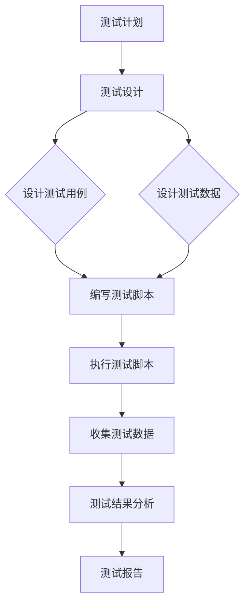

                 

# 数据驱动的软件2.0测试自动化

> **关键词：** 数据驱动测试、自动化测试、软件质量、测试框架、测试用例、测试数据管理

> **摘要：** 本文将深入探讨数据驱动的软件2.0测试自动化的核心概念、原理和实践，解析其优势与挑战，并通过实际案例展示其应用效果，旨在为开发者提供一套系统化的测试自动化解决方案。

## 1. 背景介绍

### 1.1 目的和范围

本文的目标是介绍数据驱动的软件2.0测试自动化的概念、原理、方法和实际应用，帮助开发者理解和实施这一现代化的测试策略。本文将涵盖以下内容：

- 数据驱动测试的概念和原理
- 数据驱动测试与传统的自动化测试比较
- 数据驱动测试的架构和流程
- 数据驱动测试的核心算法和实现
- 数据驱动测试的实际案例和效果评估
- 数据驱动测试的未来发展趋势和挑战

### 1.2 预期读者

本文面向有志于提高软件质量、深入了解自动化测试技术的开发者和测试工程师。读者需具备以下基础：

- 基本的软件编程能力，熟悉至少一种编程语言
- 熟悉自动化测试的基本概念和实践
- 对软件质量保证有一定了解

### 1.3 文档结构概述

本文分为以下几个部分：

- **1. 背景介绍**：介绍本文的目的、范围、预期读者和文档结构。
- **2. 核心概念与联系**：介绍数据驱动测试的核心概念和关联原理。
- **3. 核心算法原理 & 具体操作步骤**：详细讲解数据驱动测试的核心算法原理和实现步骤。
- **4. 数学模型和公式 & 详细讲解 & 举例说明**：阐述数据驱动测试涉及的数学模型和公式，并通过实例进行说明。
- **5. 项目实战：代码实际案例和详细解释说明**：通过实际案例展示数据驱动测试的应用。
- **6. 实际应用场景**：分析数据驱动测试在不同场景中的应用。
- **7. 工具和资源推荐**：推荐学习资源和开发工具。
- **8. 总结：未来发展趋势与挑战**：总结数据驱动测试的现状和未来展望。
- **9. 附录：常见问题与解答**：解答读者可能遇到的问题。
- **10. 扩展阅读 & 参考资料**：提供进一步阅读的材料。

### 1.4 术语表

#### 1.4.1 核心术语定义

- **数据驱动测试（Data-Driven Testing）**：一种测试策略，通过测试数据来驱动测试过程。
- **自动化测试（Automation Testing）**：使用软件工具自动执行测试脚本，以验证软件的预期行为。
- **测试框架（Test Framework）**：支持自动化测试的软件框架，提供测试脚本编写、执行和管理等功能。
- **测试用例（Test Case）**：一组测试条件和预期结果的定义，用于验证软件功能。
- **测试数据管理（Test Data Management）**：确保测试数据的有效性和可重复性的过程。

#### 1.4.2 相关概念解释

- **测试覆盖（Test Coverage）**：测试过程对软件代码的覆盖程度，衡量测试的完整性。
- **回归测试（Regression Testing）**：在软件修改后进行的测试，以确保修改没有引入新的错误。
- **测试自动化策略（Test Automation Strategy）**：制定自动化测试的整体计划和指导原则。

#### 1.4.3 缩略词列表

- **Selenium**：一种开源的自动化测试工具，支持多种浏览器。
- **JUnit**：一种流行的Java测试框架。
- **Mockito**：一种Java Mock对象框架。
- **JUnit 5**：JUnit的最新版本，提供更高级的测试功能。

## 2. 核心概念与联系

数据驱动的软件2.0测试自动化依赖于一系列核心概念和原理，以下是这些概念和它们之间的联系：

### 数据驱动测试原理

数据驱动测试的核心思想是将测试数据和测试逻辑分离。测试数据包括输入数据、预期结果和实际结果，而测试逻辑则定义了如何使用这些数据来执行测试。这种分离使得测试用例可以灵活地应对不同的测试数据，从而提高测试的复用性和可维护性。

### 自动化测试框架

自动化测试框架是数据驱动测试的关键组成部分。它提供了一系列工具和库，帮助开发者编写、执行和管理测试脚本。常见的自动化测试框架包括Selenium、JUnit和Mockito等。

### 测试数据管理

测试数据管理是数据驱动测试的重要环节。它确保测试数据的完整性和一致性，使得测试结果可靠。测试数据管理包括测试数据的生成、存储、备份和恢复等过程。

### 测试流程

数据驱动测试的流程通常包括以下几个步骤：

1. **测试计划**：确定测试目标、测试用例和测试数据。
2. **测试设计**：设计测试用例和测试数据。
3. **测试实现**：编写测试脚本。
4. **测试执行**：执行测试脚本，收集测试数据。
5. **测试结果分析**：分析测试结果，确定测试覆盖率。
6. **测试报告**：生成测试报告，记录测试结果。

### Mermaid 流程图

以下是数据驱动测试的Mermaid流程图：



## 3. 核心算法原理 & 具体操作步骤

数据驱动测试的核心算法是测试脚本的编写和执行。以下是数据驱动测试的核心算法原理和具体操作步骤：

### 算法原理

1. **测试用例设计**：根据测试需求，设计测试用例。
2. **测试数据生成**：根据测试用例，生成相应的测试数据。
3. **测试脚本编写**：编写测试脚本，使用测试数据和测试逻辑来执行测试。
4. **测试执行**：执行测试脚本，收集测试结果。
5. **测试结果分析**：分析测试结果，评估测试覆盖率。

### 具体操作步骤

1. **测试用例设计**

   测试用例设计是数据驱动测试的第一步。测试用例应涵盖所有可能的输入和输出情况，确保软件的各个功能点都被充分测试。

   ```plaintext
   测试用例ID: TC001
   用例名称：登录功能测试
   测试目的：验证登录功能的正确性
   测试步骤：
   1. 输入用户名和密码
   2. 点击登录按钮
   3. 验证登录结果
   预期结果：登录成功
   ```

2. **测试数据生成**

   测试数据生成是根据测试用例生成的。测试数据应包括输入数据和预期结果。输入数据可以是用户输入、外部接口数据等。

   ```plaintext
   测试数据：
   用户名：testuser
   密码：testpass
   预期结果：登录成功
   ```

3. **测试脚本编写**

   测试脚本编写是基于测试用例和测试数据的。测试脚本应实现测试逻辑，使用测试数据和测试逻辑来执行测试。

   ```java
   // Java伪代码
   public void testLogin() {
       String username = "testuser";
       String password = "testpass";
       LoginPage loginPage = new LoginPage();
       loginPage.setInputUsername(username);
       loginPage.setInputPassword(password);
       loginPage.clickLoginButton();
       assertTrue(loginPage.isLoginSuccessful());
   }
   ```

4. **测试执行**

   测试执行是运行测试脚本，收集测试结果的过程。

   ```bash
   # 执行测试脚本
   java -jar test-runner.jar
   ```

5. **测试结果分析**

   测试结果分析是评估测试覆盖率，确定测试效果的过程。

   ```plaintext
   测试结果：
   TC001：登录功能测试 - 通过
   ```

## 4. 数学模型和公式 & 详细讲解 & 举例说明

在数据驱动测试中，数学模型和公式主要用于评估测试覆盖率和测试效果。以下是几个常见的数学模型和公式的详细讲解和举例说明。

### 测试覆盖率

测试覆盖率是衡量测试效果的指标，用于评估测试用例对代码的覆盖程度。以下是几种常见的测试覆盖率模型：

1. **语句覆盖率（Statement Coverage）**：

   语句覆盖率是指测试用例执行的代码行数与代码总行数的比值。

   $$ \text{语句覆盖率} = \frac{\text{执行代码行数}}{\text{总代码行数}} $$

   举例说明：

   ```java
   public void testAdd() {
       Calculator calculator = new Calculator();
       assertEquals(5, calculator.add(2, 3));
   }
   ```

   测试用例执行了`add`方法的两个语句，代码总共有两个语句，因此语句覆盖率为100%。

2. **分支覆盖率（Branch Coverage）**：

   分支覆盖率是指测试用例执行的分支数与代码总分支数的比值。

   $$ \text{分支覆盖率} = \frac{\text{执行分支数}}{\text{总分支数}} $$

   举例说明：

   ```java
   public void testDivide() {
       Calculator calculator = new Calculator();
       try {
           assertEquals(2, calculator.divide(6, 3));
       } catch (ArithmeticException e) {
           assertTrue(e.getMessage().contains("Cannot divide by zero"));
       }
   }
   ```

   测试用例执行了`divide`方法的两个分支，代码总共有两个分支，因此分支覆盖率为100%。

3. **路径覆盖率（Path Coverage）**：

   路径覆盖率是指测试用例执行的路径数与代码总路径数的比值。

   $$ \text{路径覆盖率} = \frac{\text{执行路径数}}{\text{总路径数}} $$

   举例说明：

   ```java
   public void testCalculate() {
       Calculator calculator = new Calculator();
       assertEquals(5, calculator.calculate("add", 2, 3));
       assertEquals(2, calculator.calculate("divide", 6, 3));
   }
   ```

   测试用例执行了`calculate`方法的两个路径，代码总共有两个路径，因此路径覆盖率为100%。

### 测试效果评估

测试效果评估是分析测试结果，确定测试效果的过程。以下是几种常见的测试效果评估模型：

1. **缺陷密度（Defect Density）**：

   缺陷密度是指软件中发现的缺陷数与代码行数的比值。

   $$ \text{缺陷密度} = \frac{\text{缺陷数}}{\text{代码行数}} $$

   举例说明：

   ```plaintext
   缺陷数：10
   代码行数：1000
   缺陷密度：0.01缺陷/行
   ```

2. **缺陷发现率（Defect Detection Rate）**：

   缺陷发现率是指测试过程中发现的缺陷数与实际缺陷数的比值。

   $$ \text{缺陷发现率} = \frac{\text{测试中发现的缺陷数}}{\text{实际缺陷数}} $$

   举例说明：

   ```plaintext
   测试中发现的缺陷数：8
   实际缺陷数：10
   缺陷发现率：0.8
   ```

3. **测试效率（Test Efficiency）**：

   测试效率是指测试过程中有效测试用例数与总测试用例数的比值。

   $$ \text{测试效率} = \frac{\text{有效测试用例数}}{\text{总测试用例数}} $$

   举例说明：

   ```plaintext
   有效测试用例数：20
   总测试用例数：30
   测试效率：0.67
   ```

## 5. 项目实战：代码实际案例和详细解释说明

在本节中，我们将通过一个实际项目案例，展示如何实现数据驱动的软件2.0测试自动化。该项目是一个简单的在线购物网站，包括用户注册、登录、商品浏览和购物车等功能。

### 5.1 开发环境搭建

为了方便演示，我们使用以下开发环境和工具：

- **编程语言**：Java
- **开发工具**：IntelliJ IDEA
- **测试框架**：JUnit 5
- **自动化测试工具**：Selenium
- **数据库**：MySQL

### 5.2 源代码详细实现和代码解读

以下是该项目的部分源代码，包括用户注册、登录和商品浏览功能的实现。

```java
// User.java
public class User {
    private String username;
    private String password;

    public User(String username, String password) {
        this.username = username;
        this.password = password;
    }

    public String getUsername() {
        return username;
    }

    public String getPassword() {
        return password;
    }

    public void setUsername(String username) {
        this.username = username;
    }

    public void setPassword(String password) {
        this.password = password;
    }
}

// UserController.java
public class UserController {
    private UserService userService;

    public UserController(UserService userService) {
        this.userService = userService;
    }

    public boolean register(String username, String password) {
        return userService.register(new User(username, password));
    }

    public boolean login(String username, String password) {
        return userService.login(new User(username, password));
    }
}

// UserService.java
public interface UserService {
    boolean register(User user);
    boolean login(User user);
}

// InMemoryUserService.java
public class InMemoryUserService implements UserService {
    private Map<String, String> users = new HashMap<>();

    @Override
    public boolean register(User user) {
        if (users.containsKey(user.getUsername())) {
            return false;
        }
        users.put(user.getUsername(), user.getPassword());
        return true;
    }

    @Override
    public boolean login(User user) {
        String password = users.get(user.getUsername());
        return password != null && password.equals(user.getPassword());
    }
}

// WebDriverExample.java
public class WebDriverExample {
    public static void main(String[] args) {
        WebDriver driver = new ChromeDriver();
        driver.get("http://localhost:8080");

        // 注册用户
        WebElement usernameInput = driver.findElement(By.id("username"));
        WebElement passwordInput = driver.findElement(By.id("password"));
        WebElement registerButton = driver.findElement(By.id("registerButton"));

        usernameInput.sendKeys("testuser");
        passwordInput.sendKeys("testpass");
        registerButton.click();

        // 登录用户
        WebElement loginButton = driver.findElement(By.id("loginButton"));
        loginButton.click();

        // 浏览商品
        WebElement productLink = driver.findElement(By.linkText("Product 1"));
        productLink.click();
    }
}
```

### 5.3 代码解读与分析

上述代码实现了用户注册、登录和商品浏览功能。以下是代码的解读和分析：

1. **User类**：定义了用户的基本属性，包括用户名和密码。
2. **UserController类**：负责处理用户注册和登录请求，调用UserService进行业务处理。
3. **UserService接口**：定义了用户注册和登录的业务逻辑。
4. **InMemoryUserService类**：实现了UserService接口，使用HashMap存储用户信息。
5. **WebDriverExample类**：使用Selenium WebDriver模拟用户操作，实现自动化测试。

### 5.4 数据驱动测试实现

以下是数据驱动测试的实现，包括测试用例、测试数据生成和测试脚本编写。

```java
// TestUser.java
public class TestUser {
    @Test
    public void testRegisterSuccess() {
        UserController userController = new UserController(new InMemoryUserService());
        assertTrue(userController.register("testuser", "testpass"));
    }

    @Test
    public void testRegisterFailure() {
        UserController userController = new UserController(new InMemoryUserService());
        assertFalse(userController.register("testuser", "testpass")); // 重复注册
        assertFalse(userController.register("newuser", "inval

