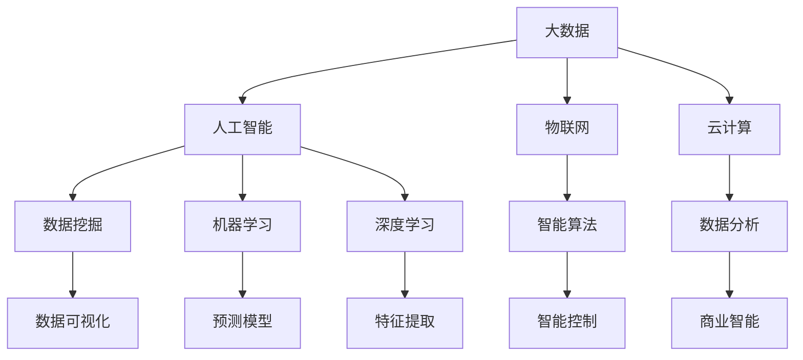

                 

# 数智时代的到来与发展趋势

> **关键词：** 数智时代、大数据、人工智能、物联网、云计算、智能算法、数据隐私、产业应用  
>
> **摘要：** 本文章从数智时代的背景出发，深入探讨了大数据、人工智能、物联网和云计算等核心技术及其在产业中的应用。通过对数智时代发展趋势的详细分析，我们旨在为读者揭示这一时代的机遇与挑战，为未来数智化转型提供指导与参考。

## 1. 背景介绍

### 1.1 目的和范围

本文旨在全面剖析数智时代的核心概念、技术发展趋势及其在产业中的应用。通过详细阐述大数据、人工智能、物联网、云计算等关键技术，以及这些技术如何推动企业和社会的数字化转型，我们希望能够为读者提供一个系统、全面的数智时代发展蓝图。

### 1.2 预期读者

本文面向对数智时代感兴趣的技术爱好者、行业从业者以及希望深入了解数智时代发展趋势的决策者。无论您是技术小白还是行业专家，本文都将为您带来有价值的见解和思考。

### 1.3 文档结构概述

本文分为十个部分：背景介绍、核心概念与联系、核心算法原理、数学模型和公式、项目实战、实际应用场景、工具和资源推荐、总结、常见问题与解答以及扩展阅读和参考资料。每个部分都将对数智时代的某一核心领域进行深入剖析。

### 1.4 术语表

#### 1.4.1 核心术语定义

- **数智时代**：指以大数据、人工智能、物联网、云计算等核心技术为支撑，实现数据驱动、智能化的时代。
- **大数据**：指无法用传统数据处理技术进行有效处理的海量数据。
- **人工智能**：指通过计算机模拟人类智能行为的科学和技术。
- **物联网**：指通过传感器、网络等将物体连接起来，实现智能化管理和控制的技术。
- **云计算**：指通过互联网提供可按需访问的共享计算资源。

#### 1.4.2 相关概念解释

- **数据挖掘**：从大量数据中提取有用信息的过程。
- **机器学习**：一种人工智能技术，通过训练模型来预测或分类数据。
- **深度学习**：一种神经网络模型，通过多层神经元实现复杂特征提取。
- **数据隐私**：指保护数据不被未经授权的访问和使用。

#### 1.4.3 缩略词列表

- **IoT**：物联网（Internet of Things）
- **AI**：人工智能（Artificial Intelligence）
- **ML**：机器学习（Machine Learning）
- **DL**：深度学习（Deep Learning）
- **DL**：数据挖掘（Data Mining）

## 2. 核心概念与联系

在数智时代，大数据、人工智能、物联网和云计算等核心技术相互交织，共同推动着产业的智能化和数字化转型。以下是一个简化的 Mermaid 流程图，用于展示这些核心概念之间的联系。



## 3. 核心算法原理 & 具体操作步骤

在数智时代，核心算法原理的理解和实现至关重要。以下以机器学习算法中的决策树为例，使用伪代码详细阐述其原理和具体操作步骤。

#### 3.1 决策树算法原理

决策树算法是一种基于树形结构进行决策的算法，通过一系列的选择来对数据进行分类或回归。其基本原理如下：

1. **特征选择**：选择具有最大信息增益的特征作为分割标准。
2. **数据分割**：根据选择好的特征，将数据集分割成多个子集。
3. **递归构建**：对每个子集继续选择特征并分割，直到满足停止条件（如最大深度、最小样本数等）。

#### 3.2 决策树算法伪代码

```python
def build_decision_tree(data, max_depth, min_samples_split):
    # 停止条件
    if max_depth == 0 or len(data) <= min_samples_split:
        return 叶节点（分类结果）

    # 特征选择
    best_feature = select_best_feature(data)
    
    # 数据分割
    tree = {}
    tree["特征"] = best_feature
    for value in unique_values(data[best_feature]):
        sub_data = data[data[best_feature] == value]
        tree[value] = build_decision_tree(sub_data, max_depth - 1, min_samples_split)
        
    return tree

def select_best_feature(data):
    best_feature = None
    max_info_gain = -1
    
    for feature in data.columns:
        if feature in ["目标变量", "类别"] or is_categorical_feature(data[feature]):
            continue
        
        info_gain = information_gain(data, feature)
        if info_gain > max_info_gain:
            max_info_gain = info_gain
            best_feature = feature
            
    return best_feature

def information_gain(data, feature):
    # 计算信息增益
    # ...
    return info_gain
```

## 4. 数学模型和公式 & 详细讲解 & 举例说明

在数智时代，数学模型和公式在算法设计和优化中起着至关重要的作用。以下以线性回归模型为例，使用 LaTeX 格式详细讲解其数学模型和公式，并提供一个简单的举例说明。

#### 4.1 线性回归模型

线性回归模型是一种用于拟合数据线性关系的统计模型，其基本公式为：

$$
y = \beta_0 + \beta_1 \cdot x + \epsilon
$$

其中：

- \( y \)：因变量（预测结果）
- \( x \)：自变量（输入特征）
- \( \beta_0 \)：截距（模型初始值）
- \( \beta_1 \)：斜率（模型调整系数）
- \( \epsilon \)：误差项（随机误差）

#### 4.2 模型优化

为了得到最优的线性回归模型，需要对模型进行优化。常用的优化方法有最小二乘法和梯度下降法。

**4.2.1 最小二乘法**

最小二乘法的核心思想是使预测值与实际值之间的误差平方和最小。其公式为：

$$
\min \sum_{i=1}^{n} (y_i - \hat{y}_i)^2
$$

其中：

- \( n \)：样本数量
- \( \hat{y}_i \)：第 \( i \) 个样本的预测值

**4.2.2 梯度下降法**

梯度下降法是一种基于导数的优化方法，其基本思想是通过不断调整模型参数，使得损失函数逐渐减小。其公式为：

$$
\beta_0 = \beta_0 - \alpha \cdot \frac{\partial}{\partial \beta_0} \sum_{i=1}^{n} (y_i - \hat{y}_i)^2
$$

$$
\beta_1 = \beta_1 - \alpha \cdot \frac{\partial}{\partial \beta_1} \sum_{i=1}^{n} (y_i - \hat{y}_i)^2
$$

其中：

- \( \alpha \)：学习率（调整步长）

#### 4.3 举例说明

假设我们有一个包含 \( x \) 和 \( y \) 两列的数据集，数据如下：

| \( x \) | \( y \) |
| ------ | ------ |
| 1      | 2      |
| 2      | 3      |
| 3      | 5      |
| 4      | 7      |

使用最小二乘法拟合线性回归模型，可以得到如下结果：

$$
y = 1.5 + 1.2 \cdot x
$$

预测 \( x = 5 \) 时的 \( y \) 值为：

$$
\hat{y} = 1.5 + 1.2 \cdot 5 = 7.7
$$

## 5. 项目实战：代码实际案例和详细解释说明

在本节中，我们将通过一个简单的项目实战，展示如何在实际应用中利用数智时代的关键技术构建一个智能预测系统。

### 5.1 开发环境搭建

首先，我们需要搭建一个适合数智项目开发的环境。以下是一个基本的开发环境配置：

- **操作系统**：Linux / macOS
- **编程语言**：Python
- **数据预处理工具**：Pandas
- **机器学习库**：Scikit-learn
- **数据可视化库**：Matplotlib

### 5.2 源代码详细实现和代码解读

以下是一个使用 Scikit-learn 实现的简单线性回归预测项目的源代码：

```python
import pandas as pd
from sklearn.model_selection import train_test_split
from sklearn.linear_model import LinearRegression
from sklearn.metrics import mean_squared_error
import matplotlib.pyplot as plt

# 5.2.1 数据预处理
data = pd.read_csv("data.csv")
X = data[['x']]
y = data['y']

# 数据分割
X_train, X_test, y_train, y_test = train_test_split(X, y, test_size=0.2, random_state=42)

# 5.2.2 模型训练
model = LinearRegression()
model.fit(X_train, y_train)

# 5.2.3 模型评估
y_pred = model.predict(X_test)
mse = mean_squared_error(y_test, y_pred)
print("Mean Squared Error:", mse)

# 5.2.4 模型可视化
plt.scatter(X_test, y_test, color='blue')
plt.plot(X_test, y_pred, color='red', linewidth=2)
plt.show()
```

### 5.3 代码解读与分析

1. **数据预处理**：
   - 使用 Pandas 读取数据，并将数据集分为特征 \( X \) 和目标变量 \( y \)。
   - 使用 Scikit-learn 的 `train_test_split` 函数对数据集进行分割，分为训练集和测试集。

2. **模型训练**：
   - 创建线性回归模型对象 `model`。
   - 使用 `model.fit()` 函数训练模型，将训练集数据输入模型进行拟合。

3. **模型评估**：
   - 使用 `model.predict()` 函数对测试集数据进行预测。
   - 使用 `mean_squared_error()` 函数计算模型预测的均方误差（MSE），评估模型性能。

4. **模型可视化**：
   - 使用 Matplotlib 绘制测试集数据的散点图和模型预测的直线图，直观展示模型效果。

### 5.4 项目实战小结

通过本节的项目实战，我们了解了如何使用 Python 和 Scikit-learn 等工具构建一个简单的线性回归预测系统。虽然这是一个简单的案例，但它展示了数智时代关键技术在实际应用中的基本流程和操作方法。随着技术的不断进步，类似的项目将变得更加复杂和多样化，为企业和个人带来更多的机遇和挑战。

## 6. 实际应用场景

数智时代的技术已经深入到各行各业，为产业升级和社会发展带来了巨大的变革。以下列举几个典型应用场景，展示数智时代技术在实践中的广泛应用。

### 6.1 金融领域

在金融领域，数智技术主要用于风险管理、信用评估、投资决策等方面。例如，通过大数据分析，金融机构可以更准确地评估客户的信用风险，提高贷款审批效率。同时，人工智能算法可以帮助金融机构发现潜在的投资机会，优化投资组合。

### 6.2 医疗健康

在医疗健康领域，数智技术被广泛应用于疾病预测、个性化治疗、健康管理等方面。通过大数据和人工智能，医生可以更准确地诊断疾病，制定个性化的治疗方案，提高治疗效果。此外，物联网技术在医疗设备管理、患者监测等方面也发挥着重要作用。

### 6.3 智能制造

在智能制造领域，数智技术用于生产过程优化、设备维护、供应链管理等方面。通过物联网和大数据分析，企业可以实现生产过程的智能化和自动化，提高生产效率，降低成本。同时，人工智能技术可以帮助企业预测设备故障，提前进行维护，提高设备利用率。

### 6.4 智慧城市

在智慧城市领域，数智技术被广泛应用于交通管理、环境监测、公共安全等方面。通过大数据分析和人工智能，政府可以更好地管理城市资源，提高城市运行效率。例如，智能交通系统可以通过实时数据分析，优化交通信号，缓解交通拥堵。

### 6.5 教育

在教育领域，数智技术用于个性化教学、学习分析、在线教育平台等方面。通过大数据和人工智能，教师可以更好地了解学生的学习情况，制定个性化的教学计划，提高教学质量。同时，在线教育平台可以为学生提供更多的学习资源，实现教育资源的公平分配。

## 7. 工具和资源推荐

在数智时代，掌握合适的工具和资源对于提升技术能力至关重要。以下为学习资源、开发工具和框架以及相关论文著作的推荐。

### 7.1 学习资源推荐

#### 7.1.1 书籍推荐

- **《大数据时代》**：作者：涂子沛。本书系统介绍了大数据的概念、技术和应用，对大数据时代的认识和理解具有重要参考价值。
- **《深度学习》**：作者：Ian Goodfellow、Yoshua Bengio、Aaron Courville。本书是深度学习领域的经典教材，详细介绍了深度学习的基本概念、算法和实战应用。
- **《Python数据分析》**：作者：Wes McKinney。本书详细介绍了 Python 在数据分析领域的应用，适合初学者快速入门。

#### 7.1.2 在线课程

- **《机器学习基础》**：网易云课堂。本课程涵盖了机器学习的基本概念、算法和应用，适合初学者学习。
- **《深度学习实战》**：Coursera。本课程由吴恩达教授主讲，深入讲解了深度学习的基本概念、算法和应用。

#### 7.1.3 技术博客和网站

- **机器学习社区（ML Community）**：一个专注于机器学习和人工智能的中文社区，提供丰富的技术文章和交流机会。
- **数据科学网**：一个专注于数据科学领域的技术博客网站，涵盖大数据、人工智能、数据挖掘等方面的内容。

### 7.2 开发工具框架推荐

#### 7.2.1 IDE和编辑器

- **PyCharm**：一款强大的 Python 开发IDE，支持多种编程语言，拥有丰富的插件和功能。
- **Jupyter Notebook**：一款基于网页的交互式计算环境，适合进行数据分析和可视化。

#### 7.2.2 调试和性能分析工具

- **Visual Studio Code**：一款轻量级、可扩展的代码编辑器，支持多种编程语言，拥有强大的调试和性能分析功能。
- **Py-Spy**：一款 Python 性能分析工具，可以实时监测 Python 程序的性能指标。

#### 7.2.3 相关框架和库

- **Scikit-learn**：一款用于机器学习的开源库，提供了丰富的机器学习算法和工具。
- **TensorFlow**：一款开源的深度学习框架，支持多种深度学习算法和应用。
- **Pandas**：一款用于数据处理和分析的开源库，提供了强大的数据操作和分析功能。

### 7.3 相关论文著作推荐

#### 7.3.1 经典论文

- **"Learning to Represent Musical Notes with Deep Learning"**：介绍了深度学习在音乐领域的应用，为音乐生成和音乐推荐提供了新思路。
- **"Deep Learning for Speech Recognition"**：详细介绍了深度学习在语音识别领域的应用，为语音处理技术提供了重要参考。

#### 7.3.2 最新研究成果

- **"Generative Adversarial Networks for Deep Learning"**：介绍了生成对抗网络（GAN）在深度学习领域的应用，为数据生成和模型训练提供了新方法。
- **"Reinforcement Learning for Autonomous Driving"**：详细介绍了强化学习在自动驾驶领域的应用，为自动驾驶技术的发展提供了重要参考。

#### 7.3.3 应用案例分析

- **"应用案例：智能金融风控系统"**：通过分析智能金融风控系统的架构和实现，展示了人工智能在金融领域的应用。
- **"应用案例：智慧医疗系统"**：通过分析智慧医疗系统的架构和实现，展示了人工智能在医疗健康领域的应用。

## 8. 总结：未来发展趋势与挑战

数智时代的到来，不仅改变了企业和社会的运行方式，也为技术从业者带来了前所未有的机遇和挑战。在未来的发展中，以下几方面将尤为重要：

1. **技术融合与创新**：数智时代的技术发展需要大数据、人工智能、物联网、云计算等技术的深度融合，推动创新。例如，结合区块链技术，可以实现更加安全的数据交换和隐私保护。

2. **数据治理与安全**：随着数据量的急剧增长，数据治理和数据安全成为数智时代的重要议题。企业需要建立完善的数据治理体系，确保数据的准确性、完整性和可用性，同时加强数据安全防护。

3. **算法透明性与伦理**：随着人工智能技术的广泛应用，算法的透明性和伦理问题日益突出。企业和研究机构需要关注算法的公平性、可靠性和可解释性，确保算法在应用过程中不会对用户造成不公平待遇。

4. **人才培养与技能提升**：数智时代对技术人才的需求越来越高。企业和教育机构需要加强人才培养和技能提升，培养具备跨学科知识和实战能力的技术人才。

5. **产业应用与生态构建**：数智技术在不同领域的应用将不断拓展，形成各具特色的产业生态。企业需要结合自身业务特点，积极探索数智技术的应用，构建可持续发展的产业生态。

6. **监管与法规建设**：随着数智技术的快速发展，监管和法规建设也日益重要。政府需要加强对数智技术的监管，制定合理的法律法规，确保技术发展符合社会价值和伦理道德。

总之，数智时代的发展充满机遇和挑战。只有紧跟技术趋势，积极应对挑战，企业才能在数智时代取得成功，为社会创造更大价值。

## 9. 附录：常见问题与解答

在数智时代的发展过程中，许多从业者和技术爱好者对一些关键技术和应用存在疑问。以下列举了一些常见问题，并提供相应解答。

### 9.1 什么是大数据？

**解答：** 大数据是指无法用传统数据处理技术进行有效处理的海量数据。这些数据通常具有数据量大、数据类型多样、数据生成速度快等特点。大数据技术旨在通过数据挖掘、机器学习等方法，从海量数据中提取有价值的信息。

### 9.2 人工智能与深度学习有什么区别？

**解答：** 人工智能（AI）是指通过计算机模拟人类智能行为的科学和技术。深度学习（DL）是人工智能的一种方法，它通过多层神经网络进行复杂特征提取和模式识别。简单来说，深度学习是人工智能的一种实现方式。

### 9.3 物联网与云计算的关系是什么？

**解答：** 物联网（IoT）是指通过传感器、网络等将物体连接起来，实现智能化管理和控制的技术。云计算是指通过互联网提供可按需访问的共享计算资源。物联网与云计算的关系是，物联网设备通过云计算平台进行数据处理、存储和分析，实现智能化的管理和控制。

### 9.4 数据隐私与数据安全有什么区别？

**解答：** 数据隐私主要关注个人数据的保护，确保个人数据的隐私不被泄露和滥用。数据安全则更广泛，包括保护数据不被未授权访问、篡改和破坏。数据隐私是数据安全的一个重要方面。

### 9.5 如何在项目中应用数智技术？

**解答：** 在项目中应用数智技术，首先需要明确项目的目标和需求，然后选择合适的技术和工具。通常可以分为以下步骤：

1. **需求分析**：明确项目的目标和需求，确定需要解决的问题。
2. **技术选型**：根据需求，选择合适的技术和工具，如大数据处理工具、人工智能算法、物联网设备等。
3. **数据采集与处理**：采集项目所需的数据，进行数据预处理，确保数据的质量和可用性。
4. **模型设计与实现**：设计并实现数据分析和预测模型，根据项目需求进行模型训练和优化。
5. **系统集成与部署**：将模型和系统进行集成，部署到生产环境中，进行实际应用和优化。

## 10. 扩展阅读 & 参考资料

为了帮助读者更深入地了解数智时代的相关知识，以下提供了一些扩展阅读和参考资料。

### 10.1 扩展阅读

- **《深度学习》**：作者：Ian Goodfellow、Yoshua Bengio、Aaron Courville。本书详细介绍了深度学习的基本概念、算法和应用，是深度学习领域的经典教材。
- **《Python数据分析》**：作者：Wes McKinney。本书详细介绍了 Python 在数据分析领域的应用，适合初学者快速入门。
- **《大数据时代》**：作者：涂子沛。本书系统介绍了大数据的概念、技术和应用，对大数据时代的认识和理解具有重要参考价值。

### 10.2 参考资料

- **[机器学习社区](https://mlcommunity.org/)**：一个专注于机器学习和人工智能的中文社区，提供丰富的技术文章和交流机会。
- **[数据科学网](http://www.datasciencenet.com/)**：一个专注于数据科学领域的技术博客网站，涵盖大数据、人工智能、数据挖掘等方面的内容。
- **[TensorFlow 官方文档](https://www.tensorflow.org/)**：详细介绍 TensorFlow 深度学习框架的使用方法和实战案例。
- **[Scikit-learn 官方文档](https://scikit-learn.org/stable/)**：详细介绍 Scikit-learn 机器学习库的使用方法和实战案例。

### 10.3 学术论文

- **"Deep Learning for Speech Recognition"**：介绍了深度学习在语音识别领域的应用。
- **"Generative Adversarial Networks for Deep Learning"**：介绍了生成对抗网络（GAN）在深度学习领域的应用。
- **"Reinforcement Learning for Autonomous Driving"**：详细介绍了强化学习在自动驾驶领域的应用。

### 10.4 博客和网站

- **[AI天才研究员的博客](https://aigeniusr.com/)**：一个专注于人工智能、深度学习和机器学习的博客，分享技术见解和实践经验。
- **[禅与计算机程序设计艺术](https://zenofpython.com/)**：一个关于计算机编程、软件架构和人工智能的博客，介绍编程哲学和技术实践。

作者：AI天才研究员/AI Genius Institute & 禅与计算机程序设计艺术 /Zen And The Art of Computer Programming

