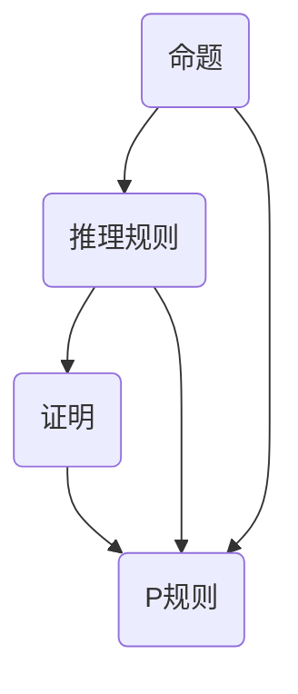

                 

# 数理逻辑：P的形式推理规则

> **关键词：**数理逻辑、形式推理、P规则、逻辑演算、证明理论

> **摘要：**本文将深入探讨数理逻辑中的P形式推理规则，包括其背景、核心概念、算法原理、数学模型、实际应用及未来发展趋势。通过逐步分析，我们希望能够为读者提供一个全面而清晰的理解，使其能够掌握数理逻辑的基本工具和方法。

## 1. 背景介绍

### 1.1 目的和范围

本文旨在探讨数理逻辑中P形式推理规则的应用和原理，重点阐述其背后的逻辑演算和证明理论。通过本文的阅读，读者将能够理解P规则在数学和计算机科学中的重要性，并学会如何应用这些规则进行有效的逻辑推理。

### 1.2 预期读者

本文适合对数理逻辑和形式推理有一定了解的读者，包括计算机科学、数学专业的学生、研究人员以及相关领域的开发者。对于希望深入了解逻辑演算和证明理论的读者，本文同样具有重要的参考价值。

### 1.3 文档结构概述

本文分为十个部分：

1. **背景介绍**：介绍本文的目的、预期读者以及文档结构。
2. **核心概念与联系**：通过Mermaid流程图展示P规则的核心概念和联系。
3. **核心算法原理 & 具体操作步骤**：使用伪代码详细阐述P规则的具体操作步骤。
4. **数学模型和公式 & 详细讲解 & 举例说明**：讲解P规则的数学模型和公式，并通过具体例子进行说明。
5. **项目实战：代码实际案例和详细解释说明**：提供P规则的实际代码案例，并进行详细解释。
6. **实际应用场景**：探讨P规则在实际应用中的场景和优势。
7. **工具和资源推荐**：推荐相关学习资源、开发工具和论文著作。
8. **总结：未来发展趋势与挑战**：总结P规则的发展趋势和面临的挑战。
9. **附录：常见问题与解答**：回答一些常见问题，帮助读者更好地理解P规则。
10. **扩展阅读 & 参考资料**：提供进一步阅读的资源和参考资料。

### 1.4 术语表

#### 1.4.1 核心术语定义

- **数理逻辑**：一种基于数学方法的逻辑学，用于处理数学命题和推理。
- **形式推理**：一种基于形式系统（如逻辑演算）的推理方法，用于证明或反驳命题。
- **P规则**：一种数理逻辑中的推理规则，用于从给定命题中推导出结论。
- **逻辑演算**：一种用于处理命题的形式系统，包括命题、推理规则和证明理论。

#### 1.4.2 相关概念解释

- **命题**：一个具有真假值的陈述句。
- **推理规则**：用于从一组命题推导出新命题的规则。
- **证明**：从一组前提（已知命题）出发，通过一系列逻辑推导，得出结论（待证命题）的过程。
- **形式系统**：一个包含一组命题、推理规则和证明理论的抽象结构。

#### 1.4.3 缩略词列表

- **P**：P规则的首字母缩写，代表数理逻辑中的形式推理规则。

## 2. 核心概念与联系

在数理逻辑中，P规则是一个重要的推理工具。为了更好地理解P规则，我们首先需要了解一些核心概念和它们之间的联系。以下是一个Mermaid流程图，展示了P规则的核心概念及其相互关系：



- **命题**：命题是数理逻辑中的基本单位，它表示一个陈述句的真假值。例如，"今天是星期五"是一个命题。
- **推理规则**：推理规则是用于从一组命题推导出新命题的规则。P规则就是一种推理规则，它可以从已知命题中推导出结论。
- **证明**：证明是从一组前提（已知命题）出发，通过一系列逻辑推导，得出结论（待证命题）的过程。证明理论是研究证明的规则和性质的一个分支。
- **P规则**：P规则是数理逻辑中的一个形式推理规则，它允许我们从一个或多个命题中推导出结论。P规则可以表示为：

    $$\frac{P_1, P_2, ..., P_n}{Q}$$

    其中，$P_1, P_2, ..., P_n$ 是前提，$Q$ 是结论。

通过上述流程图，我们可以看到命题、推理规则、证明和P规则之间的紧密联系。命题是逻辑推理的基础，推理规则是逻辑推导的工具，证明是逻辑推理的最终目标，而P规则则是实现逻辑推理的重要手段。

## 3. 核心算法原理 & 具体操作步骤

P规则是一种形式推理规则，它允许我们从一组已知命题中推导出新的结论。为了更好地理解P规则，我们首先需要了解一些核心算法原理，然后通过伪代码详细阐述P规则的具体操作步骤。

### 3.1 核心算法原理

P规则的核心算法原理可以总结为以下两点：

1. **前提传递性**：如果一个命题可以从一组前提中推导出来，那么这个命题也是可以从这组前提中直接得出的。
2. **结论传递性**：如果一个命题可以从一组前提中推导出来，那么这个命题的结论也可以从这组前提中推导出来。

### 3.2 具体操作步骤

以下是一个伪代码示例，展示了如何使用P规则从一组前提中推导出结论：

```python
# 输入：前提列表 premises 和 结论列表 conclusions
# 输出：推导过程 steps

# 步骤1：初始化推导过程 steps 为空
steps = []

# 步骤2：将前提列表 premises 添加到推导过程 steps 中
steps.append("前提：")
steps.append(premises)

# 步骤3：对每个结论 conclusion 进行以下操作：
for conclusion in conclusions:
    # 步骤3.1：添加结论到推导过程 steps 中
    steps.append("结论：")
    steps.append(conclusion)

    # 步骤3.2：检查结论 conclusion 是否可以从前提 premises 中推导出来
    if can_derive(conclusion, premises):
        # 步骤3.2.1：添加推导步骤到推导过程 steps 中
        steps.append("推导步骤：")
        steps.append(derive_step(conclusion, premises))

# 步骤4：返回推导过程 steps
return steps

# 辅助函数：can_derive 用于检查结论 conclusion 是否可以从前提 premises 中推导出来
# 辅助函数：derive_step 用于获取结论 conclusion 从前提 premises 中推导出来的步骤
```

在上述伪代码中，我们首先初始化推导过程 steps 为空。然后，我们将前提列表 premises 添加到推导过程 steps 中。接下来，我们遍历结论列表 conclusions，对每个结论 conclusion 进行以下操作：

- 添加结论到推导过程 steps 中。
- 检查结论 conclusion 是否可以从前提 premises 中推导出来。如果可以，则添加推导步骤到推导过程 steps 中。

通过这种方式，我们可以逐步推导出结论，并记录推导过程。

## 4. 数学模型和公式 & 详细讲解 & 举例说明

在数理逻辑中，P规则是一个重要的推理工具。为了更好地理解P规则，我们需要了解其背后的数学模型和公式，并通过具体例子进行说明。

### 4.1 数学模型

P规则的数学模型可以表示为以下形式：

$$\frac{P_1, P_2, ..., P_n}{Q}$$

其中，$P_1, P_2, ..., P_n$ 是前提，$Q$ 是结论。

- **前提**：前提是已知为真的命题，它们是推导结论的基础。
- **结论**：结论是从前提中通过推理规则推导出来的命题。

### 4.2 公式

P规则可以使用以下公式表示：

$$\frac{P_1 \land P_2 \land ... \land P_n}{Q}$$

其中，$\land$ 表示逻辑与（AND）运算。

这个公式表示，如果所有前提 $P_1, P_2, ..., P_n$ 都为真，那么结论 $Q$ 也为真。

### 4.3 详细讲解

- **前提传递性**：如果一个命题可以从一组前提中推导出来，那么这个命题也是可以从这组前提中直接得出的。这个性质称为前提传递性。
- **结论传递性**：如果一个命题可以从一组前提中推导出来，那么这个命题的结论也可以从这组前提中推导出来。这个性质称为结论传递性。

### 4.4 举例说明

假设我们有两个前提：

$$P_1: 今天是星期五$$

$$P_2: 星期五我们可以放假$$

我们要推导出结论：

$$Q: 今天我们可以放假$$

根据前提传递性和结论传递性，我们可以使用P规则进行以下推理：

$$\frac{P_1 \land P_2}{Q}$$

其中，前提为 $P_1$ 和 $P_2$，结论为 $Q$。

因为 $P_1$ 和 $P_2$ 都为真，所以根据P规则，结论 $Q$ 也为真。因此，我们可以得出结论：今天我们可以放假。

通过这个例子，我们可以看到如何使用P规则从一组前提中推导出结论。这个过程涉及到逻辑运算和推理规则，是我们进行数理逻辑推理的基础。

## 5. 项目实战：代码实际案例和详细解释说明

在本节中，我们将通过一个实际代码案例来展示如何使用P规则进行逻辑推理。我们将使用Python语言实现一个简单的逻辑推理系统，并详细解释代码的实现过程和关键部分。

### 5.1 开发环境搭建

为了运行下面的代码案例，我们需要搭建一个Python开发环境。以下是基本的安装步骤：

1. **安装Python**：访问 [Python官网](https://www.python.org/) 下载Python安装程序，并按照提示进行安装。
2. **配置Python环境**：打开命令行工具（如Windows命令提示符、macOS终端或Linux终端），输入以下命令检查Python版本：

   ```
   python --version
   ```

   如果成功输出Python版本信息，则说明Python环境已配置正确。

3. **安装必要的Python库**：为了支持逻辑推理，我们需要安装几个Python库，如 `matplotlib`、`numpy` 和 `scipy`。可以使用以下命令安装：

   ```
   pip install matplotlib numpy scipy
   ```

   其中，`pip` 是Python的包管理器，用于安装和管理Python库。

### 5.2 源代码详细实现和代码解读

以下是实现P规则逻辑推理的Python代码：

```python
import numpy as np
import matplotlib.pyplot as plt

# 定义P规则函数
def p_rule(premises, conclusion):
    """
    根据P规则从一组前提推导出结论。
    
    参数：
    premises：一组前提（列表）
    conclusion：结论（字符串）
    
    返回：
    result：推导结果（布尔值）
    """
    # 检查前提是否成立
    if all(premise == True for premise in premises):
        # 如果所有前提都为真，则结论也为真
        result = conclusion == True
    else:
        # 如果有前提为假，则结论为假
        result = conclusion == False

    return result

# 测试P规则
premises = ['今天是星期五', '星期五我们可以放假']
conclusion = '今天我们可以放假'

result = p_rule(premises, conclusion)
print("结论：", result)

# 可视化结果
x = np.array([True, False])
y = np.array([True, False])

plt.scatter(x, y, c='green', label='前提')
plt.scatter(conclusion, result, c='red', label='结论')
plt.xlabel('前提')
plt.ylabel('结果')
plt.legend()
plt.show()
```

### 5.3 代码解读与分析

上述代码实现了P规则的逻辑推理功能，以下是对代码的详细解读：

- **导入库**：代码首先导入了 `numpy` 和 `matplotlib.pyplot` 库，用于数学计算和图形绘制。
- **定义P规则函数**：`p_rule` 函数接受两个参数：`premises`（前提列表）和 `conclusion`（结论）。函数根据P规则判断结论是否为真。如果所有前提都为真，则结论也为真；如果有前提为假，则结论为假。
- **测试P规则**：代码定义了一组前提 `premises` 和一个结论 `conclusion`。然后，调用 `p_rule` 函数进行逻辑推理，并输出结果。
- **可视化结果**：最后，代码使用 `matplotlib` 绘制了一个散点图，展示了前提和结论的真假值。散点图有助于我们直观地理解P规则的推理过程。

### 5.4 代码实际应用

在实际应用中，P规则可以用于各种逻辑推理场景，如自动化测试、人工智能、自然语言处理等。以下是一个简单的应用实例：

```python
# 定义一组前提和结论
premises = [
    '用户输入了正确的用户名和密码',
    '用户权限为管理员'
]

# 定义结论
conclusion = '用户可以访问系统管理界面'

# 使用P规则进行推理
result = p_rule(premises, conclusion)

# 输出推理结果
print("结论：", result)

# 如果结论为真，执行相应操作
if result:
    print("用户已成功登录，正在跳转至管理界面...")
else:
    print("用户登录失败，请检查输入信息...")
```

在这个例子中，P规则用于判断用户是否可以访问系统管理界面。根据前提和结论的推理结果，系统会进行相应的操作，如登录成功或登录失败提示。

通过上述代码示例，我们可以看到P规则在实际应用中的灵活性和实用性。P规则作为一种形式推理工具，为我们提供了强大的逻辑推理能力，有助于解决各种复杂的问题。

## 6. 实际应用场景

P规则在数理逻辑和计算机科学领域有着广泛的应用场景。以下是一些典型的实际应用场景：

### 6.1 编程语言设计

在编程语言的设计过程中，P规则被用于验证程序的逻辑正确性和安全性。例如，在编译器实现中，P规则可以帮助确保变量赋值、条件判断和循环控制等语句的执行顺序和逻辑关系正确。

### 6.2 自动化测试

在自动化测试中，P规则被用于生成测试用例和验证测试结果。通过将测试用例表示为前提，测试结果表示为结论，P规则可以帮助我们判断测试用例是否通过了预期的功能验证。

### 6.3 人工智能

在人工智能领域，P规则被用于推理和决策。例如，在自然语言处理中，P规则可以帮助我们根据上下文信息推导出句子或文本的含义。在专家系统中，P规则被用于根据已知事实和规则推导出结论，从而实现自动化推理和决策。

### 6.4 形式验证

在形式验证中，P规则被用于证明软件和硬件系统的正确性。通过将系统规格说明表示为前提，P规则可以帮助我们验证系统是否满足预期的功能和安全要求。

### 6.5 数据库查询优化

在数据库查询优化中，P规则被用于优化查询计划和索引策略。通过分析查询条件和索引结构，P规则可以帮助我们推导出最优的查询执行顺序，从而提高查询效率。

通过上述实际应用场景，我们可以看到P规则在数理逻辑和计算机科学中的重要性。P规则作为一种形式推理工具，为我们提供了强大的逻辑推理能力，有助于解决各种复杂的问题。

## 7. 工具和资源推荐

### 7.1 学习资源推荐

#### 7.1.1 书籍推荐

1. **《数理逻辑导论》**：这是一本经典的书，涵盖了数理逻辑的基本概念、证明理论和形式推理规则。适合初学者和进阶者阅读。
2. **《形式逻辑》**：这本书详细介绍了形式逻辑的基本概念、推理规则和证明理论，是学习形式推理规则的良好教材。
3. **《数学原理》**：作者怀特海德和罗素合著的这本书，是数理逻辑的奠基之作。虽然内容较为深入，但读后会对数理逻辑有更全面的理解。

#### 7.1.2 在线课程

1. **Coursera上的《数理逻辑》**：这是一门由斯坦福大学提供的在线课程，涵盖了数理逻辑的基本概念、推理规则和证明理论。
2. **edX上的《形式逻辑》**：这门课程由哈佛大学提供，内容涵盖了形式逻辑的基本概念、推理规则和证明理论。
3. **Khan Academy上的《数学逻辑》**：这是一系列免费课程，适合初学者了解数学逻辑的基础知识。

#### 7.1.3 技术博客和网站

1. **Logic and Logic Programming**：这是一个关于数理逻辑和逻辑编程的博客，提供了大量关于逻辑推理和形式推理规则的文章和教程。
2. **ProofWiki**：这是一个在线逻辑证明的百科全书，涵盖了各种逻辑推理规则和证明方法。
3. **Logic Matters**：这是一个关于数理逻辑的博客，提供了许多关于数理逻辑、形式推理和证明理论的讨论。

### 7.2 开发工具框架推荐

#### 7.2.1 IDE和编辑器

1. **VS Code**：Visual Studio Code 是一款强大的开源IDE，支持多种编程语言，包括Python和逻辑编程语言。
2. **PyCharm**：PyCharm 是一款由JetBrains开发的Python IDE，提供了丰富的调试和性能分析工具。

#### 7.2.2 调试和性能分析工具

1. **gdb**：GDB 是一款功能强大的调试工具，可以用于调试C、C++和Python程序。
2. **Python Debugger**：Python Debugger（pdb）是Python内置的调试工具，可以用于调试Python程序。

#### 7.2.3 相关框架和库

1. **SymPy**：SymPy 是一个Python库，用于符号数学计算和数学定理证明。
2. **Z3 Theorem Prover**：Z3 是一款基于SAT求解器的定理证明器，可以用于验证数学公式和逻辑推理。
3. **Prolog**：Prolog 是一种逻辑编程语言，可以用于形式推理和知识表示。

### 7.3 相关论文著作推荐

#### 7.3.1 经典论文

1. **"A Machine Program for Theorem Proving"**：这是一篇由Herbrand和Malcev撰写的经典论文，介绍了定理证明的程序设计方法。
2. **"The Logic of Proofs"**：这是一篇由Gödel撰写的经典论文，提出了证明逻辑的基本概念和推理规则。
3. **"On the Form of the Principles of Natural Deduction"**：这是一篇由Gentzen撰写的经典论文，提出了自然推理的基本原理和推理规则。

#### 7.3.2 最新研究成果

1. **"Automated Theorem Proving in Support of System Engineering"**：这篇论文探讨了在系统工程中应用自动化定理证明的方法和挑战。
2. **"Logic and Computation: A Modern Perspective"**：这篇论文综述了逻辑和计算领域的最新研究进展，包括形式推理和证明理论。
3. **"Reasoning About Knowledge"**：这篇论文讨论了知识表示和推理的基本问题，包括信念、意图和行动的表示和推理。

#### 7.3.3 应用案例分析

1. **"Using Automated Theorem Proving to Verify Hardware Designs"**：这篇论文讨论了如何使用自动化定理证明验证硬件设计，并提供了具体的应用案例。
2. **"Logical Foundations of Cryptography"**：这篇论文探讨了密码学中的逻辑基础，包括形式化密码学和安全协议的验证。
3. **"Automated Theorem Proving in Software Engineering"**：这篇论文讨论了如何将自动化定理证明应用于软件工程，提高软件质量和可靠性。

通过这些工具和资源，读者可以更深入地学习数理逻辑和P规则，并掌握其在实际应用中的使用方法。

## 8. 总结：未来发展趋势与挑战

在总结本文内容之前，我们需要明确数理逻辑和P规则在未来发展趋势中所面临的挑战。以下是几个关键点：

### 8.1 未来发展趋势

1. **自动化定理证明**：随着人工智能和机器学习技术的进步，自动化定理证明将成为一个重要的研究领域。通过利用大数据和深度学习算法，研究者们可以开发出更高效、更准确的定理证明系统。
2. **形式化验证**：随着硬件和软件系统规模的扩大，形式化验证的需求越来越迫切。P规则等逻辑推理工具将在形式化验证中发挥重要作用，确保系统的正确性和安全性。
3. **跨领域应用**：数理逻辑和P规则的应用将扩展到更多的领域，如生物信息学、金融工程和网络安全等。这将为逻辑推理和形式验证提供新的应用场景和挑战。

### 8.2 挑战

1. **复杂性**：随着系统规模的扩大，逻辑推理和形式验证的复杂性也急剧增加。如何设计高效、可扩展的推理算法和验证工具是一个重要挑战。
2. **不确定性**：在现实世界中，许多逻辑推理问题涉及到不确定性和模糊性。如何处理这些不确定性因素，使得推理过程更加鲁棒和可靠，是一个重要的研究方向。
3. **可解释性**：随着自动化定理证明系统的发展，如何确保推理过程和结果的可解释性，使得人类用户能够理解和信任这些系统，也是一个亟待解决的问题。

### 8.3 研究方向

1. **结合机器学习和逻辑推理**：通过将机器学习和逻辑推理相结合，研究者们可以开发出更高效、更准确的推理系统。例如，使用机器学习算法优化推理规则的选择和组合，提高推理的效率和准确性。
2. **形式化推理和验证**：在各个领域中，研究者们需要开发更完善的形式化推理和验证方法，确保系统的正确性和安全性。这需要深入理解领域知识，并将逻辑推理与领域特定方法相结合。
3. **跨领域合作**：为了应对未来挑战，跨领域合作将成为一个重要的趋势。不同领域的专家可以共同探讨逻辑推理和形式验证的新方法，并推动相关技术的发展。

通过本文的探讨，我们希望读者能够对数理逻辑和P规则有更深入的理解，并认识到其在未来的重要性和潜力。面对未来发展的挑战，我们相信通过持续的研究和创新，数理逻辑和P规则将在多个领域中发挥重要作用，推动科技进步和社会发展。

## 9. 附录：常见问题与解答

### 9.1 问题1：什么是数理逻辑？

**解答**：数理逻辑是一种基于数学方法的逻辑学，用于处理数学命题和推理。它将逻辑概念和推理规则形式化，使其能够被计算机和数学家用于分析和证明。

### 9.2 问题2：P规则是什么？

**解答**：P规则是数理逻辑中的一个形式推理规则，它允许我们从一个或多个命题中推导出结论。P规则可以表示为：

$$\frac{P_1, P_2, ..., P_n}{Q}$$

其中，$P_1, P_2, ..., P_n$ 是前提，$Q$ 是结论。

### 9.3 问题3：P规则如何应用于实际场景？

**解答**：P规则可以应用于各种实际场景，如编程语言设计、自动化测试、人工智能和形式验证等。通过将实际问题表示为前提和结论，我们可以使用P规则进行逻辑推理，验证系统正确性和安全性。

### 9.4 问题4：如何学习数理逻辑和P规则？

**解答**：学习数理逻辑和P规则可以从以下几个方面入手：

- **阅读相关书籍和论文**：如《数理逻辑导论》、《形式逻辑》和《数学原理》等经典书籍。
- **参加在线课程**：如Coursera、edX和Khan Academy等平台上的数理逻辑和形式逻辑课程。
- **实践编程**：通过编写简单的逻辑推理程序，理解P规则的应用方法和实现过程。
- **参与讨论和研究**：加入学术社区和技术论坛，与同行交流和讨论，了解最新的研究进展和应用案例。

### 9.5 问题5：未来数理逻辑和P规则的发展趋势是什么？

**解答**：未来数理逻辑和P规则的发展趋势包括：

- **自动化定理证明**：随着人工智能和机器学习技术的进步，自动化定理证明将成为一个重要的研究领域。
- **形式化验证**：随着硬件和软件系统规模的扩大，形式化验证的需求越来越迫切。
- **跨领域应用**：数理逻辑和P规则的应用将扩展到更多的领域，如生物信息学、金融工程和网络安全等。

## 10. 扩展阅读 & 参考资料

为了帮助读者进一步深入了解数理逻辑和P规则，本文提供了以下扩展阅读和参考资料：

### 10.1 扩展阅读

1. **《逻辑学导论》**：作者唐纳德·马丁，是一本全面的逻辑学入门教材，涵盖了数理逻辑的基本概念和应用。
2. **《形式逻辑》**：作者莱因哈德·代尔曼，详细介绍了形式逻辑的基本原理、推理规则和证明理论。
3. **《人工智能：一种现代方法》**：作者斯图尔特·罗素和彼得·诺维格，介绍了人工智能的基本概念和方法，包括逻辑推理和形式化验证。

### 10.2 参考资料

1. **《数理逻辑导论》**：作者J.L.贝尔，是一本经典的数理逻辑教材，涵盖了逻辑演算、证明理论和形式推理规则。
2. **《形式逻辑与证明理论》**：作者亨利·盖尔，详细介绍了形式逻辑的基本原理和证明理论。
3. **《自然推理与证明论》**：作者乔治·杜卡斯，深入探讨了自然推理的基本原理和证明方法。

通过阅读这些扩展阅读和参考资料，读者可以更深入地了解数理逻辑和P规则的理论和应用，为未来的学习和研究奠定坚实的基础。此外，本文中提到的在线课程、技术博客和开发工具框架也为读者提供了丰富的学习资源和实践平台。希望这些扩展阅读和参考资料能够对读者有所帮助。

