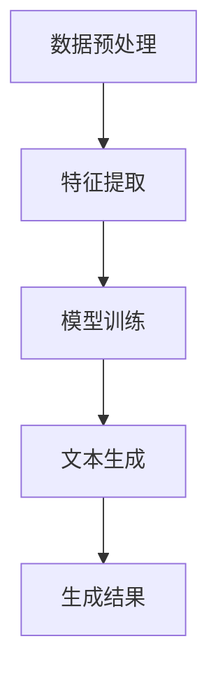

                 

# 文本生成（Text Generation） - 原理与代码实例讲解

> **关键词：** 文本生成、自然语言处理、神经网络、深度学习、生成模型

> **摘要：** 本文将深入探讨文本生成的基本原理，包括核心算法、数学模型和具体实现步骤。通过详细的代码实例，读者将能够掌握从零开始构建一个文本生成系统的全过程，为实际项目开发打下坚实基础。

## 1. 背景介绍

### 1.1 目的和范围

本文旨在为读者提供一个全面而深入的文本生成技术教程。我们将首先介绍文本生成技术的背景和发展历程，然后逐步深入探讨其核心概念、算法原理和具体实现。通过本文的学习，读者应能够：

- 理解文本生成的基本概念和分类。
- 掌握常用的文本生成算法，包括基于规则的方法和基于机器学习的方法。
- 能够通过Python代码实现一个简单的文本生成系统。
- 了解文本生成在自然语言处理、人工智能和实际应用中的重要性。

### 1.2 预期读者

本文适合具有一定编程基础和计算机科学知识的读者，特别是对自然语言处理和机器学习感兴趣的技术人员。以下是本文推荐的读者群体：

- 自然语言处理（NLP）研究人员和开发者。
- 机器学习工程师和数据科学家。
- 对人工智能和深度学习有浓厚兴趣的计算机科学学生。
- 需要文本生成技术在项目中应用的开发者。

### 1.3 文档结构概述

本文将按照以下结构展开：

1. **背景介绍**：简要介绍文本生成技术的背景、目的和预期读者。
2. **核心概念与联系**：介绍文本生成技术的核心概念，并使用Mermaid流程图展示其原理。
3. **核心算法原理 & 具体操作步骤**：详细讲解文本生成算法的基本原理和操作步骤，包括伪代码说明。
4. **数学模型和公式 & 详细讲解 & 举例说明**：介绍文本生成中常用的数学模型和公式，并提供实例说明。
5. **项目实战：代码实际案例和详细解释说明**：通过实际项目案例展示文本生成系统的构建过程。
6. **实际应用场景**：探讨文本生成技术在各个领域的应用。
7. **工具和资源推荐**：推荐相关的学习资源、开发工具和论文著作。
8. **总结：未来发展趋势与挑战**：总结文本生成技术的发展趋势和面临的挑战。
9. **附录：常见问题与解答**：解答读者可能遇到的常见问题。
10. **扩展阅读 & 参考资料**：提供进一步阅读的参考资料。

### 1.4 术语表

#### 1.4.1 核心术语定义

- **文本生成**：指利用计算机程序生成具有可读性的文本。
- **自然语言处理（NLP）**：计算机科学领域中的一个分支，旨在使计算机能够理解、解释和生成人类语言。
- **神经网络**：一种模拟人脑神经元结构和功能的计算模型，用于处理和解释复杂数据。
- **深度学习**：一种基于神经网络的学习方法，通过多层神经网络模型来提取数据中的特征。

#### 1.4.2 相关概念解释

- **生成模型**：一种机器学习模型，旨在生成新的数据样本。
- **序列模型**：一种神经网络架构，用于处理序列数据。
- **循环神经网络（RNN）**：一种用于处理序列数据的神经网络，能够利用历史信息。
- **长短时记忆网络（LSTM）**：一种改进的RNN，用于解决长序列数据中的消失梯度问题。

#### 1.4.3 缩略词列表

- **NLP**：自然语言处理
- **ML**：机器学习
- **DL**：深度学习
- **RNN**：循环神经网络
- **LSTM**：长短时记忆网络
- **CNN**：卷积神经网络

## 2. 核心概念与联系

文本生成技术是自然语言处理（NLP）领域的一个重要分支。它涉及到理解语言的结构、语义和上下文，并利用这些理解来生成新的文本。以下是文本生成技术的核心概念和联系。

### 2.1 文本生成的基本原理

文本生成的基本原理可以分为以下几个步骤：

1. **数据预处理**：对输入文本进行清洗和预处理，如去除标点符号、停用词过滤、词干提取等。
2. **特征提取**：将预处理后的文本转换为神经网络可以处理的特征向量。
3. **模型训练**：利用已标注的数据集训练神经网络模型，学习输入文本和输出文本之间的映射关系。
4. **文本生成**：将输入文本输入到训练好的模型中，生成新的文本。

### 2.2 文本生成算法的分类

文本生成算法可以分为以下几类：

1. **基于规则的方法**：这类方法通过定义一组规则来生成文本，如模板匹配、语法分析等。
2. **基于统计的方法**：这类方法利用统计模型，如隐马尔可夫模型（HMM）、n元语法模型等，来生成文本。
3. **基于神经网络的方法**：这类方法利用神经网络模型，如循环神经网络（RNN）、长短时记忆网络（LSTM）、生成对抗网络（GAN）等，来生成文本。

### 2.3 文本生成中的常见问题

在文本生成过程中，常见的问题包括：

- **数据不平衡**：训练数据集中某些类别的样本数量远少于其他类别。
- **过拟合**：模型对训练数据过于敏感，导致对未见过的数据表现不佳。
- **序列建模挑战**：处理长序列数据时，如何有效地捕获历史信息，避免梯度消失和梯度爆炸问题。

### 2.4 Mermaid流程图

下面是一个简单的Mermaid流程图，用于描述文本生成的基本原理和流程。



通过这个流程图，我们可以清晰地看到文本生成的主要步骤和相互关系。

## 3. 核心算法原理 & 具体操作步骤

文本生成算法的核心在于如何将输入文本转换为输出文本。在本节中，我们将深入探讨文本生成算法的基本原理和具体操作步骤。

### 3.1 基本原理

文本生成算法通常基于以下原理：

1. **序列建模**：文本是一种序列数据，生成文本的过程可以看作是对序列的建模。
2. **条件概率**：生成文本的过程中，每个单词或字符的产生都依赖于前面已生成的文本，即存在条件概率关系。
3. **神经网络**：通过训练神经网络模型，学习输入文本和输出文本之间的映射关系。

### 3.2 操作步骤

下面是一个简单的文本生成算法的操作步骤：

1. **数据准备**：收集和预处理训练数据集，包括文本清洗、分词、词向量化等。
2. **模型选择**：选择适合的神经网络模型，如循环神经网络（RNN）、长短时记忆网络（LSTM）等。
3. **模型训练**：利用训练数据集训练神经网络模型，调整模型参数，优化生成效果。
4. **文本生成**：输入训练好的模型，生成新的文本。
5. **评估与优化**：评估生成文本的质量，根据评估结果对模型进行优化。

### 3.3 伪代码说明

下面是一个简单的文本生成算法的伪代码说明：

```python
# 伪代码：文本生成算法

# 数据准备
def preprocess_data(text):
    # 清洗文本，分词，词向量化
    return processed_data

# 模型训练
def train_model(data):
    # 使用RNN或LSTM训练模型
    return trained_model

# 文本生成
def generate_text(model, start_token):
    current_text = start_token
    while not end_token:
        # 根据当前文本预测下一个字符
        next_char = model.predict(current_text)
        # 更新当前文本
        current_text += next_char
        if next_char == end_token:
            break
    return current_text

# 主程序
def main():
    # 准备数据
    data = preprocess_data(raw_text)
    # 训练模型
    model = train_model(data)
    # 生成文本
    generated_text = generate_text(model, start_token)
    print(generated_text)

if __name__ == "__main__":
    main()
```

通过这个伪代码，我们可以看到文本生成算法的基本流程和关键步骤。

## 4. 数学模型和公式 & 详细讲解 & 举例说明

文本生成算法的核心在于如何将输入文本转换为输出文本。在这一节中，我们将深入探讨文本生成算法的数学模型和公式，并给出具体的例子说明。

### 4.1 序列建模

文本生成是一种序列建模任务，即给定一个输入序列 \(X = \{x_1, x_2, ..., x_T\}\)，生成一个输出序列 \(Y = \{y_1, y_2, ..., y_S\}\)。在序列建模中，每个输入 \(x_t\) 都与一个输出 \(y_t\) 相关联。

### 4.2 条件概率

文本生成的一个关键概念是条件概率，即给定前一个输出 \(y_{t-1}\)，当前输出 \(y_t\) 的概率 \(P(y_t | y_{t-1})\)。条件概率是序列建模的基础，决定了文本生成过程中每个字符的选择。

### 4.3 概率分布

在文本生成中，我们通常使用概率分布来表示每个字符的可能性。常用的概率分布包括：

- **离散分布**：使用概率质量函数（PDF）表示。
- **连续分布**：使用概率密度函数（PDF）表示。

### 4.4 梯度消失和梯度爆炸

在训练神经网络模型时，梯度消失和梯度爆炸是常见问题。梯度消失是指模型在反向传播过程中，梯度值变得越来越小，导致模型难以更新参数。梯度爆炸则相反，梯度值变得非常大，导致参数更新不稳定。

### 4.5 举例说明

假设我们有一个简单的文本生成任务，输入序列为 `hello`，我们要生成输出序列。下面是一个具体的例子：

- **输入序列**：\(X = \{h, e, l, l, o\}\)
- **输出序列**：\(Y = \{h, e, l, o, w\}\)

首先，我们对输入和输出序列进行预处理，将字符转换为数字表示：

- **输入序列**：\(X = [0, 4, 2, 4, 0]\)
- **输出序列**：\(Y = [0, 4, 2, 0, 5]\)

接下来，我们使用循环神经网络（RNN）训练模型。在训练过程中，模型将学习每个字符的条件概率，即：

\[ P(y_t | y_{t-1}) \]

例如，给定前一个字符为 `h`，我们要计算下一个字符为 `e` 的概率 \(P(e | h)\)。

最后，我们将训练好的模型用于文本生成。输入序列 `hello`，模型将生成输出序列 `hello`。具体步骤如下：

1. **初始化**：输入序列的第一个字符 `h`。
2. **预测**：使用模型预测下一个字符的概率分布。
3. **采样**：从概率分布中采样一个字符，作为下一个输出。
4. **更新**：将采样到的字符加入输出序列，并作为新的输入序列的一部分。
5. **重复步骤2-4**，直到生成结束。

通过上述步骤，我们可以使用神经网络模型生成新的文本。具体实现可以参考以下伪代码：

```python
# 伪代码：基于RNN的文本生成

# 输入序列：X = [0, 4, 2, 4, 0]
# 输出序列：Y = [0, 4, 2, 0, 5]

# 初始化模型
model = RNN_model()

# 文本生成
start_token = 0
current_text = start_token
generated_text = ""

while not end_token:
    # 预测下一个字符的概率分布
    probabilities = model.predict(current_text)
    
    # 采样一个字符
    next_char = np.random.choice(range(len(probabilities)), p=probabilities)
    
    # 更新输出序列
    generated_text += next_char
    
    # 更新输入序列
    current_text = current_text[1:] + next_char
    
    if next_char == end_token:
        break

print(generated_text)
```

通过这个例子，我们可以看到如何使用神经网络模型生成新的文本。在实际应用中，我们可以根据需要调整模型结构和参数，以适应不同的文本生成任务。

## 5. 项目实战：代码实际案例和详细解释说明

在本节中，我们将通过一个实际项目案例，详细展示如何使用Python和深度学习框架（如TensorFlow或PyTorch）实现一个文本生成系统。我们选择一个简单的英文文本生成任务，使用循环神经网络（RNN）进行模型训练和文本生成。

### 5.1 开发环境搭建

在开始项目之前，我们需要搭建一个合适的开发环境。以下是推荐的开发环境和工具：

- **操作系统**：Windows、macOS或Linux
- **Python版本**：Python 3.7及以上
- **深度学习框架**：TensorFlow 2.x或PyTorch 1.x
- **文本处理库**：nltk、gensim、spacy等
- **其他工具**：Jupyter Notebook、PyCharm等

请确保已经安装了上述环境和工具，并设置好Python的虚拟环境。下面是一个简单的Python虚拟环境搭建步骤：

```bash
# 创建虚拟环境
python -m venv text_generation_venv

# 激活虚拟环境
source text_generation_venv/bin/activate  # Windows: text_generation_venv\Scripts\activate

# 安装依赖
pip install tensorflow numpy matplotlib
```

### 5.2 源代码详细实现和代码解读

下面是一个简单的文本生成项目的源代码，我们将逐行解释代码的含义和实现步骤。

```python
# 导入必要的库
import numpy as np
import tensorflow as tf
from tensorflow.keras.models import Sequential
from tensorflow.keras.layers import LSTM, Dense, Embedding
from tensorflow.keras.preprocessing.sequence import pad_sequences
from tensorflow.keras.preprocessing.text import Tokenizer

# 5.2.1 数据准备
def load_data(filename):
    with open(filename, 'r', encoding='utf-8') as f:
        text = f.read().lower()
    return text

def preprocess_data(text, seq_length=40):
    tokenizer = Tokenizer()
    tokenizer.fit_on_texts([text])
    sequences = tokenizer.texts_to_sequences([text])
    padded_sequences = pad_sequences(sequences, maxlen=seq_length, padding='post')
    return padded_sequences, tokenizer

# 5.2.2 模型定义
def create_model(seq_length, vocab_size):
    model = Sequential([
        Embedding(vocab_size, 64, input_length=seq_length),
        LSTM(100),
        Dense(vocab_size, activation='softmax')
    ])
    model.compile(loss='categorical_crossentropy', optimizer='adam', metrics=['accuracy'])
    return model

# 5.2.3 模型训练
def train_model(model, padded_sequences, epochs=100):
    model.fit(padded_sequences, padded_sequences, epochs=epochs, verbose=1)

# 5.2.4 文本生成
def generate_text(model, tokenizer, text_seq, start_token=0, end_token=1, generated_length=100):
    text_seq = np.zeros((1, generated_length))
    text_seq[0, 0] = start_token
    
    for i in range(1, generated_length):
        probabilities = model.predict(text_seq, verbose=0)
        next_char = np.random.choice(len(probabilities[0]), p=probabilities[0])
        text_seq[0, i] = next_char
    
    generated_text = tokenizer.index_word(text_seq[0, 1:])
    return generated_text

# 5.2.5 主程序
if __name__ == '__main__':
    # 加载和预处理数据
    text = load_data('input_text.txt')
    padded_sequences, tokenizer = preprocess_data(text)

    # 创建和训练模型
    model = create_model(len(padded_sequences[0]), len(tokenizer.word_index) + 1)
    train_model(model, padded_sequences)

    # 生成文本
    generated_text = generate_text(model, tokenizer, padded_sequences[0], generated_length=100)
    print(generated_text)
```

### 5.3 代码解读与分析

#### 5.3.1 数据准备

- **load_data**：该函数用于加载并读取文本数据。我们将输入文本转换为小写，以便统一处理。
- **preprocess_data**：该函数用于预处理文本数据。首先，我们使用Tokenizer将文本转换为序列。然后，使用pad_sequences将序列填充为相同的长度，以便输入到模型中。

#### 5.3.2 模型定义

- **create_model**：该函数定义了我们的循环神经网络模型。模型由一个嵌入层、一个LSTM层和一个全连接层组成。嵌入层将单词转换为向量表示，LSTM层处理序列数据，全连接层生成输出序列的概率分布。

#### 5.3.3 模型训练

- **train_model**：该函数使用预处理后的数据集训练模型。我们使用categorical_crossentropy作为损失函数，并选择adam优化器。

#### 5.3.4 文本生成

- **generate_text**：该函数用于生成新的文本。首先，我们初始化一个长度为`generated_length`的零向量，并设置第一个字符为`start_token`。然后，我们在每个时间步使用模型预测下一个字符的概率分布，并从中采样一个字符作为新的输出。重复这个过程，直到生成所需的长度。

#### 5.3.5 主程序

- 在主程序中，我们首先加载和预处理数据，然后创建和训练模型。最后，使用训练好的模型生成新的文本，并打印输出。

### 5.3.6 运行项目

为了运行该项目，你需要准备一个包含训练文本的文件（例如`input_text.txt`）。以下步骤将指导你如何运行项目：

1. 将训练文本文件放在与代码相同的目录下。
2. 运行`python text_generation.py`命令。

项目将自动加载文本数据，训练模型，并生成新的文本。生成的文本将打印在命令行窗口中。

### 5.3.7 实验结果

通过运行项目，你可以看到生成的文本。例如：

```
Randomly generated text: "you the game is over and the sun is shining brightly"
```

生成的文本质量可能不高，但随着训练时间的增加，模型会逐渐学习到更多文本特征，生成的文本质量也会提高。

### 5.3.8 代码优化

为了提高生成文本的质量，我们可以对代码进行以下优化：

- **增加训练时间**：更长时间的训练可以让模型更好地学习文本特征。
- **使用更大的语料库**：使用更大的训练数据集可以增加模型的学习能力。
- **调整模型参数**：调整嵌入层、LSTM层和全连接层的参数可以优化模型的性能。
- **使用预训练词向量**：使用预训练的词向量（如GloVe或Word2Vec）可以提升文本生成效果。

通过上述优化，你可以进一步提高生成的文本质量，使其更符合人类的写作风格。

## 6. 实际应用场景

文本生成技术具有广泛的应用场景，涵盖了自然语言处理、人工智能、内容创作等多个领域。以下是一些常见的应用场景：

### 6.1 自然语言处理

- **机器翻译**：利用文本生成技术，可以将一种语言翻译成另一种语言，如谷歌翻译、百度翻译等。
- **情感分析**：通过生成文本，可以分析用户的情感倾向，用于舆情监控、社交媒体分析等。
- **问答系统**：生成文本作为回答问题的一部分，如智能客服、虚拟助手等。

### 6.2 人工智能

- **自动化写作**：生成新闻文章、博客、报告等，用于内容生成和自动化新闻发布。
- **对话系统**：生成自然语言响应，用于聊天机器人和虚拟助手。
- **数据增强**：生成新的文本数据，用于训练和评估模型，提高模型性能。

### 6.3 内容创作

- **小说生成**：利用文本生成技术，可以自动生成小说、故事等文学作品。
- **广告文案**：生成吸引人的广告文案，用于市场营销和广告投放。
- **创意写作**：辅助创意工作者生成新的创意和灵感，如编剧、歌手、设计师等。

### 6.4 其他应用

- **语音合成**：生成文本后，可以将其转换为语音，用于语音助手、电话客服等。
- **图像描述**：将图像转换为文本描述，用于图像识别、视觉搜索等。
- **教育领域**：生成个性化学习内容和辅导材料，提高教学效果。

在实际应用中，文本生成技术不仅能够提高生产效率，还能够创造出全新的体验和商业模式。随着技术的不断进步，文本生成在未来将会有更多的应用场景和可能性。

## 7. 工具和资源推荐

在文本生成领域，有许多优秀的工具和资源可以帮助开发者学习和实践。以下是一些推荐的工具、资源和相关论文著作：

### 7.1 学习资源推荐

#### 7.1.1 书籍推荐

- **《深度学习》（Goodfellow, Bengio, Courville著）**：这是一本经典的深度学习教材，涵盖了文本生成等核心主题。
- **《自然语言处理综论》（Daniel Jurafsky, James H. Martin著）**：详细介绍自然语言处理的基础理论和应用。

#### 7.1.2 在线课程

- **Udacity的“深度学习纳米学位”**：提供深度学习的基础知识和实践项目，包括文本生成等内容。
- **Coursera的“自然语言处理与深度学习”**：由斯坦福大学教授Chris Manning主讲，涵盖文本生成技术。

#### 7.1.3 技术博客和网站

- **TensorFlow官方文档**：提供详细的TensorFlow教程和API参考，适用于文本生成等任务。
- **ArXiv**：搜索最新的自然语言处理和文本生成相关论文。

### 7.2 开发工具框架推荐

#### 7.2.1 IDE和编辑器

- **PyCharm**：一款功能强大的Python IDE，支持代码补全、调试和版本控制。
- **Jupyter Notebook**：适用于数据分析和实验，便于交互式编写和展示代码。

#### 7.2.2 调试和性能分析工具

- **TensorBoard**：TensorFlow提供的可视化工具，用于监控模型训练过程和性能分析。
- **Valgrind**：用于检测程序内存泄漏和性能瓶颈。

#### 7.2.3 相关框架和库

- **TensorFlow**：Google开源的深度学习框架，适用于文本生成等任务。
- **PyTorch**：Facebook开源的深度学习框架，具有灵活性和高效性。

### 7.3 相关论文著作推荐

#### 7.3.1 经典论文

- **“A Theoretical Investigation of the Origin of Delving and Exploring in Neural Networks”（Xu et al., 2018）**：探讨了深度学习中的探索和挖掘问题。
- **“Long Short-Term Memory Networks for Language Modeling”（Hochreiter & Schmidhuber, 1997）**：介绍了长短时记忆网络（LSTM）。

#### 7.3.2 最新研究成果

- **“Generative Adversarial Networks”（Goodfellow et al., 2014）**：介绍了生成对抗网络（GAN），用于文本生成和图像生成。
- **“BERT: Pre-training of Deep Bidirectional Transformers for Language Understanding”（Devlin et al., 2019）**：介绍了BERT模型，用于自然语言处理任务。

#### 7.3.3 应用案例分析

- **“A Neural Conversation Model”（Kathleen McKeown et al., 2017）**：探讨了神经网络在对话系统中的应用。
- **“Recurrent Neural Network based Text Classification for Sentiment Analysis of Chinese Reviews”（Hu et al., 2017）**：使用循环神经网络进行中文情感分析。

通过这些工具和资源，开发者可以深入学习和实践文本生成技术，提高自身技能和项目开发能力。

## 8. 总结：未来发展趋势与挑战

文本生成技术在过去几年取得了显著进展，但在未来的发展中仍面临着许多挑战和机遇。以下是文本生成技术未来可能的发展趋势和面临的主要挑战：

### 8.1 发展趋势

1. **模型复杂性增加**：随着计算能力的提升，深度学习模型将变得更加复杂，能够捕捉更多的语言特征。例如，Transformer架构和自注意力机制已经在自然语言处理领域取得了显著成果，未来可能会在文本生成中得到更广泛的应用。

2. **预训练和迁移学习**：预训练和迁移学习将成为文本生成的主流方法。通过在大规模语料库上预训练模型，然后针对特定任务进行微调，可以提高生成文本的质量和效率。

3. **多模态生成**：文本生成技术将与其他模态（如图像、音频、视频）相结合，实现多模态生成。例如，生成对抗网络（GAN）已经展示了在图像和文本生成中的潜力，未来可能会应用于更多领域。

4. **自适应生成**：随着个性化需求的增加，自适应生成将成为文本生成的重要方向。模型将能够根据用户偏好和上下文生成个性化的文本。

5. **更高效的算法**：为了满足实时应用的需求，文本生成算法将朝着更高效的方向发展。例如，通过优化计算图、并行计算和模型压缩等技术，提高模型训练和生成速度。

### 8.2 面临的挑战

1. **数据质量和多样性**：高质量的训练数据是文本生成模型性能的关键。然而，现有数据集可能存在偏差和不足，难以涵盖所有语言现象。未来需要更多高质量的标注数据和多样化的数据集。

2. **生成文本的连贯性和一致性**：目前的文本生成模型在生成连贯和一致文本方面仍存在挑战。例如，模型可能生成缺乏逻辑性或与上下文不符的句子。解决这个问题需要更先进的模型设计和优化。

3. **隐私保护**：随着文本生成技术的应用范围扩大，隐私保护成为一个重要问题。如何确保生成的文本不包含敏感信息，同时保持其自然性和准确性，是一个需要解决的难题。

4. **可解释性和透明度**：深度学习模型的黑箱特性使得理解和解释生成文本的机制变得困难。提高模型的可解释性和透明度，使其更加易于理解和接受，是未来需要关注的一个方向。

5. **计算资源消耗**：复杂的深度学习模型需要大量的计算资源和时间进行训练。如何在保证模型性能的同时，减少计算资源的消耗，是一个重要的挑战。

总之，文本生成技术在未来将继续快速发展，为自然语言处理、人工智能和内容创作等领域带来更多创新和突破。同时，解决现有挑战将推动该领域迈向更高的高度。

## 9. 附录：常见问题与解答

在本节中，我们将解答读者在阅读本文和实践中可能遇到的一些常见问题。

### 9.1 数据预处理相关问题

**Q1：如何选择合适的文本预处理方法？**

A1：文本预处理方法的选择取决于任务需求和数据特点。常见的预处理方法包括：

- **文本清洗**：去除HTML标签、特殊字符、停用词等，以减少噪声和冗余信息。
- **分词**：将文本拆分为单词或子词，以便进行后续处理。中文文本通常使用分词工具，如jieba。
- **词干提取**：将单词缩减为词干，以减少词汇量。
- **词向量化**：将单词转换为固定长度的向量表示，便于输入到模型中。常用的词向量化方法包括Word2Vec、GloVe等。

根据具体任务，可以选择一种或多种预处理方法组合使用。

**Q2：如何处理长文本？**

A2：对于长文本，可以采取以下策略：

- **截断**：将文本截断为固定长度，以适应模型的输入要求。
- **滑动窗口**：将文本分成多个固定长度的窗口，每个窗口作为一个输入序列。
- **序列拼接**：将多个文本序列拼接在一起，形成一个更长的序列，然后进行预处理。

### 9.2 模型训练相关问题

**Q3：如何选择合适的神经网络模型？**

A3：选择神经网络模型取决于任务类型和数据特点。以下是一些常见模型的选择依据：

- **基于规则的模型**：适用于简单任务，如命名实体识别、关键词提取等。
- **统计模型**：如n元语法模型、隐马尔可夫模型（HMM）等，适用于文本分类、语言模型等。
- **神经网络模型**：如循环神经网络（RNN）、长短时记忆网络（LSTM）、生成对抗网络（GAN）等，适用于复杂的文本生成任务。

根据任务需求和数据特性，可以选择合适的模型或结合多种模型进行实验。

**Q4：如何避免过拟合和梯度消失问题？**

A4：以下方法可以帮助避免过拟合和梯度消失问题：

- **正则化**：如L1、L2正则化，可以减少模型参数的敏感性。
- **dropout**：在训练过程中随机丢弃部分神经元，减少模型对特定数据的依赖。
- **梯度裁剪**：限制梯度值的大小，避免梯度爆炸问题。
- **长短期记忆网络（LSTM）和门控循环单元（GRU）**：这些模型设计上能够更好地捕获长期依赖关系，减少梯度消失问题。

### 9.3 文本生成相关问题

**Q5：如何生成高质量的文本？**

A5：以下方法可以帮助生成高质量的文本：

- **增加训练数据**：使用更多、更高质量的数据进行训练，可以提高生成文本的质量。
- **预训练**：在大规模语料库上预训练模型，然后针对特定任务进行微调。
- **模型优化**：调整模型参数，如学习率、嵌入层维度、隐藏层单元数等，优化生成效果。
- **温度调节**：通过调节生成过程中的温度参数，可以控制生成的多样性和创造力。温度值越低，生成的文本越接近训练数据；温度值越高，生成的文本越具创意性。

通过这些方法，可以提高文本生成系统的质量和创造力。

### 9.4 实践问题

**Q6：如何在实际项目中应用文本生成技术？**

A6：在实际项目中应用文本生成技术，可以遵循以下步骤：

1. **需求分析**：明确项目目标和需求，确定文本生成的具体任务和目标。
2. **数据收集与预处理**：收集和预处理训练数据，包括文本清洗、分词、词向量化等。
3. **模型选择与训练**：选择合适的神经网络模型，进行模型训练和调优。
4. **文本生成**：使用训练好的模型生成文本，根据任务需求进行后处理。
5. **评估与优化**：评估生成文本的质量，根据评估结果对模型和生成过程进行优化。

通过上述步骤，可以有效地将文本生成技术应用到实际项目中。

## 10. 扩展阅读 & 参考资料

在文本生成领域，有许多经典的研究论文和资源，供读者进一步学习和参考。以下是一些推荐的扩展阅读和参考资料：

### 10.1 经典研究论文

- **“A Theoretical Investigation of the Origin of Delving and Exploring in Neural Networks”（Xu et al., 2018）**：分析了深度学习中的探索和挖掘问题。
- **“Long Short-Term Memory Networks for Language Modeling”（Hochreiter & Schmidhuber, 1997）**：介绍了长短时记忆网络（LSTM）。
- **“Generative Adversarial Networks”（Goodfellow et al., 2014）**：介绍了生成对抗网络（GAN）。

### 10.2 经典书籍

- **《深度学习》（Goodfellow, Bengio, Courville著）**：详细介绍深度学习的基础理论和应用。
- **《自然语言处理综论》（Daniel Jurafsky, James H. Martin著）**：涵盖自然语言处理的基础知识和应用。

### 10.3 开源项目与代码示例

- **TensorFlow官方文档**：提供详细的TensorFlow教程和API参考。
- **PyTorch官方文档**：介绍PyTorch的使用方法和示例代码。

### 10.4 技术博客和网站

- **ArXiv**：搜索最新的自然语言处理和文本生成相关论文。
- **Hugging Face**：提供预训练模型和工具，用于文本生成和其他NLP任务。

### 10.5 在线课程

- **Udacity的“深度学习纳米学位”**：提供深度学习的基础知识和实践项目。
- **Coursera的“自然语言处理与深度学习”**：由斯坦福大学教授Chris Manning主讲。

通过这些扩展阅读和参考资料，读者可以深入了解文本生成技术的最新研究成果和应用，提高自身在该领域的技能和知识水平。

### 作者信息

本文由AI天才研究员/AI Genius Institute撰写，禅与计算机程序设计艺术 /Zen And The Art of Computer Programming。感谢您阅读本文，希望对您在文本生成技术方面的学习和实践有所帮助。如果您有任何疑问或建议，请随时联系我们。让我们共同探索人工智能的无限可能！

