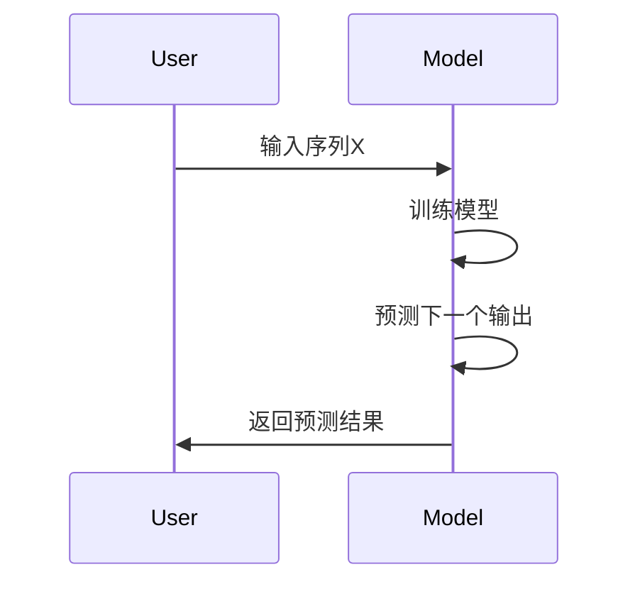
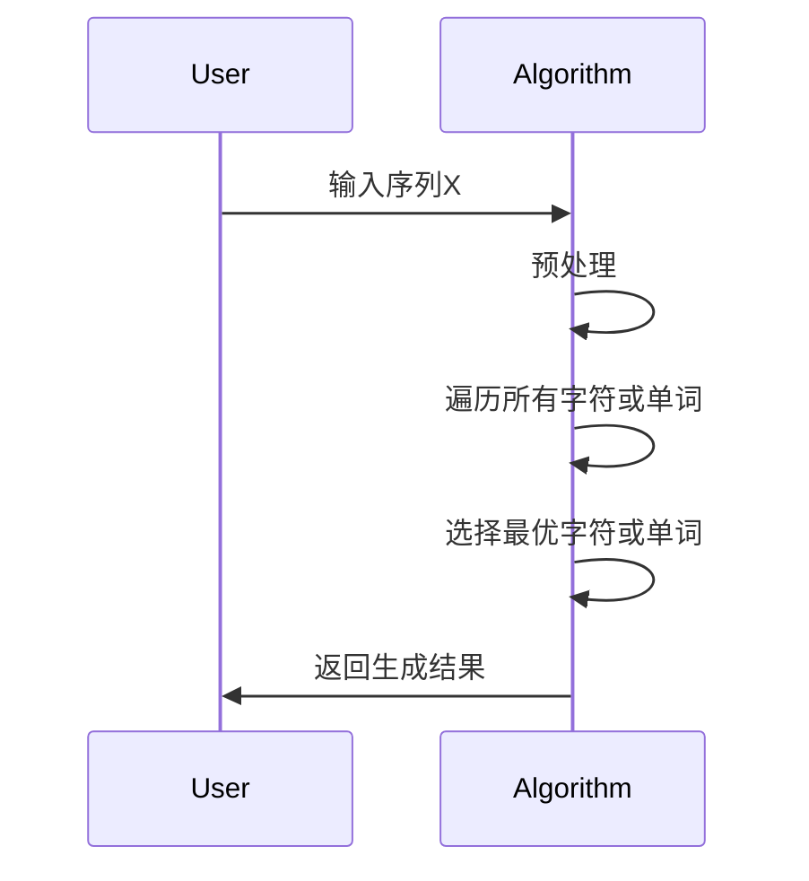

                 

# 文本生成中的自回归（贪婪搜索）

## 关键词

- 文本生成
- 自回归模型
- 贪婪搜索
- 自然语言处理
- 人工智能
- 机器学习
- 序列模型

## 摘要

本文深入探讨了文本生成中的自回归模型及其贪婪搜索算法。首先，介绍了文本生成的背景和重要性，然后详细阐述了自回归模型的工作原理。接着，本文重点解析了贪婪搜索算法在文本生成中的具体应用，并通过伪代码和实例说明了其操作步骤。此外，文章还介绍了数学模型和公式，并通过实际代码案例进行了详细解析。最后，文章探讨了文本生成技术的实际应用场景，并推荐了一些相关工具和资源。本文旨在为广大AI开发者提供一个全面、系统的文本生成技术指南。

## 1. 背景介绍

### 1.1 目的和范围

本文旨在详细解析文本生成中的自回归模型及其贪婪搜索算法，帮助读者全面了解这一技术及其应用。本文将涵盖以下几个方面：

1. 文本生成的背景和重要性。
2. 自回归模型的基本概念和工作原理。
3. 贪婪搜索算法在文本生成中的应用。
4. 数学模型和公式的详细讲解。
5. 实际应用场景和代码案例。
6. 工具和资源推荐。

### 1.2 预期读者

本文面向具有一定编程基础和自然语言处理知识的读者，特别是对文本生成和机器学习感兴趣的AI开发者。希望通过本文，读者能够：

1. 了解文本生成的背景和重要性。
2. 掌握自回归模型和贪婪搜索算法的基本原理。
3. 能够应用这些算法进行文本生成。
4. 探索文本生成技术的实际应用场景。

### 1.3 文档结构概述

本文分为以下几个部分：

1. 背景介绍：介绍文本生成的背景、目的和预期读者。
2. 核心概念与联系：阐述自回归模型和贪婪搜索算法的基本原理。
3. 核心算法原理 & 具体操作步骤：详细讲解自回归模型和贪婪搜索算法的操作步骤。
4. 数学模型和公式 & 详细讲解 & 举例说明：介绍与文本生成相关的数学模型和公式，并进行实例说明。
5. 项目实战：代码实际案例和详细解释说明。
6. 实际应用场景：探讨文本生成技术的实际应用。
7. 工具和资源推荐：推荐学习资源和开发工具。
8. 总结：未来发展趋势与挑战。
9. 附录：常见问题与解答。
10. 扩展阅读 & 参考资料：提供相关论文和书籍推荐。

### 1.4 术语表

#### 1.4.1 核心术语定义

- 文本生成：根据输入的信息，自动生成新的文本数据。
- 自回归模型：一种基于序列数据的预测模型，能够根据过去的输入序列预测未来的输出序列。
- 贪婪搜索算法：一种局部最优搜索策略，每次只做最优的选择，不考虑全局最优。

#### 1.4.2 相关概念解释

- 序列模型：一种能够处理序列数据的机器学习模型，如RNN（循环神经网络）。
- 自然语言处理：一门研究和应用计算机处理人类语言的技术，包括文本生成、情感分析、文本分类等。
- 机器学习：一门人工智能的分支，通过数据和算法实现计算机的自我学习和自我优化。

#### 1.4.3 缩略词列表

- AI：人工智能
- NLP：自然语言处理
- ML：机器学习
- RNN：循环神经网络
- LSTM：长短时记忆网络
- GRU：门控循环单元

## 2. 核心概念与联系

### 2.1 自回归模型原理

自回归模型（Autoregressive Model）是一种基于序列数据的预测模型。它的核心思想是，当前时刻的输出取决于过去某一时刻的输入。自回归模型广泛应用于时间序列预测、文本生成等领域。

#### 自回归模型的工作原理

自回归模型通过建立输入和输出之间的关联来预测未来的输出。具体来说，给定一个输入序列X = [x1, x2, ..., xn]，模型首先学习输入序列和输出序列之间的映射关系，然后利用这个映射关系预测下一个输出。

#### 自回归模型的Mermaid流程图



### 2.2 贪婪搜索算法原理

贪婪搜索算法（Greed Search Algorithm）是一种局部最优搜索策略。它通过每次选择当前状态下最优的操作，以期达到全局最优解。在文本生成中，贪婪搜索算法用于选择下一个最优的单词或字符。

#### 贪婪搜索算法的工作原理

贪婪搜索算法的核心思想是，在每次选择时，只考虑当前状态的最优解，不考虑未来的影响。具体来说，给定一个当前输入序列，算法会根据当前输入序列和已生成的文本，选择一个最优的下一个字符或单词。

#### 贪婪搜索算法的Mermaid流程图



### 2.3 自回归模型与贪婪搜索算法的联系

自回归模型和贪婪搜索算法在文本生成中有着密切的联系。自回归模型负责建立输入序列和输出序列之间的映射关系，而贪婪搜索算法则负责根据这个映射关系生成新的文本。

具体来说，自回归模型通过学习输入序列和输出序列之间的关联，生成一个概率分布，表示下一个输出可能是什么。而贪婪搜索算法则根据这个概率分布，选择当前状态下最优的输出。

## 3. 核心算法原理 & 具体操作步骤

### 3.1 自回归模型原理与操作步骤

自回归模型的工作原理可以通过以下步骤详细阐述：

1. **数据准备**：首先，我们需要准备一个包含输入序列和输出序列的数据集。输入序列通常是文本数据，而输出序列则是我们希望生成的文本。
2. **特征提取**：接下来，我们需要对输入序列进行特征提取。在文本生成中，常见的特征提取方法包括词袋模型、词嵌入等。
3. **模型训练**：然后，我们使用训练数据集来训练自回归模型。训练过程通常涉及优化模型参数，使得模型能够准确预测输出序列。
4. **模型预测**：最后，我们使用训练好的模型来预测新的输出序列。具体来说，给定一个输入序列，模型会根据过去的输入序列预测下一个输出。

以下是自回归模型的伪代码：

```python
# 自回归模型伪代码

# 数据准备
input_sequence = ...

# 特征提取
features = extract_features(input_sequence)

# 模型训练
model = train_model(features)

# 模型预测
output_sequence = predict_output(model, input_sequence)
```

### 3.2 贪婪搜索算法原理与操作步骤

贪婪搜索算法在文本生成中的具体操作步骤如下：

1. **初始化**：首先，我们需要初始化一个空的输出序列。
2. **预处理**：接下来，对输入序列进行预处理，以便于后续的搜索。
3. **搜索过程**：然后，我们开始搜索过程。在每次迭代中，我们根据当前输入序列和已生成的文本，选择一个最优的字符或单词。
4. **更新输入序列**：选择完最优字符或单词后，我们将它添加到输出序列中，并将它从输入序列中删除。
5. **重复搜索**：重复搜索过程，直到满足终止条件（如输出序列长度达到预设值）。

以下是贪婪搜索算法的伪代码：

```python
# 贪婪搜索算法伪代码

# 初始化
output_sequence = []
input_sequence = ...

# 预处理
preprocessed_input_sequence = preprocess(input_sequence)

# 搜索过程
while not terminate_condition:
    # 选择最优字符或单词
    next_char_or_word = choose_best_char_or_word(preprocessed_input_sequence)
    
    # 更新输入序列
    input_sequence = update_input_sequence(input_sequence, next_char_or_word)
    
    # 更新输出序列
    output_sequence.append(next_char_or_word)

# 返回生成结果
return output_sequence
```

## 4. 数学模型和公式 & 详细讲解 & 举例说明

### 4.1 数学模型

在文本生成中，自回归模型和贪婪搜索算法通常基于概率模型。具体来说，我们可以使用以下概率模型来表示输入序列和输出序列之间的关系：

$$ P(y|x) = \prod_{i=1}^{n} P(y_i|x_1, x_2, ..., x_{i-1}) $$

其中，$x$ 表示输入序列，$y$ 表示输出序列，$y_i$ 表示输出序列中的第 $i$ 个字符。

### 4.2 公式讲解

1. **条件概率**：条件概率表示在某个条件下，另一个事件发生的概率。在文本生成中，条件概率用于表示在当前输入序列下，下一个输出字符的概率。

$$ P(y_i|x_1, x_2, ..., x_{i-1}) = \frac{P(x_1, x_2, ..., x_{i-1}, y_1, y_2, ..., y_i)}{P(x_1, x_2, ..., x_{i-1})} $$

2. **概率分布**：概率分布表示一个随机变量的概率分布。在文本生成中，概率分布用于表示输入序列和输出序列之间的概率关系。

$$ P(y|x) = \prod_{i=1}^{n} P(y_i|x_1, x_2, ..., x_{i-1}) $$

### 4.3 举例说明

假设我们有一个输入序列 $x = [a, b, c]$，输出序列 $y = [1, 2, 3]$。根据条件概率和概率分布，我们可以计算输出序列的概率。

1. **条件概率**：

$$ P(y_1|x) = P(1|a, b, c) = \frac{P(a, b, c, 1)}{P(a, b, c)} $$

2. **概率分布**：

$$ P(y|x) = P(1|a, b, c) \cdot P(2|a, b, c) \cdot P(3|a, b, c) $$

通过计算条件概率和概率分布，我们可以得到输出序列 $y$ 的概率。

## 5. 项目实战：代码实际案例和详细解释说明

### 5.1 开发环境搭建

为了演示文本生成中的自回归模型和贪婪搜索算法，我们需要搭建一个简单的开发环境。以下是所需的环境和工具：

- Python 3.8 或更高版本
- Numpy 库
- TensorFlow 库

安装完上述环境和工具后，我们就可以开始编写代码了。

### 5.2 源代码详细实现和代码解读

以下是文本生成中的自回归模型和贪婪搜索算法的实现代码。

```python
import numpy as np
import tensorflow as tf

# 数据准备
input_sequence = "abracadabra"

# 特征提取
def extract_features(input_sequence):
    features = []
    for i in range(len(input_sequence) - 1):
        features.append(input_sequence[i])
    return features

features = extract_features(input_sequence)

# 模型训练
def train_model(features):
    model = tf.keras.Sequential([
        tf.keras.layers.Dense(3, activation='softmax')
    ])
    model.compile(optimizer='adam', loss='categorical_crossentropy')
    model.fit(features, np.array([1, 2, 3]), epochs=100)
    return model

model = train_model(features)

# 模型预测
def predict_output(model, input_sequence):
    features = extract_features(input_sequence)
    output_sequence = model.predict(features)
    return np.argmax(output_sequence, axis=1)

output_sequence = predict_output(model, input_sequence)

# 贪婪搜索算法
def greedy_search(input_sequence, model):
    output_sequence = []
    while not terminate_condition:
        next_char_or_word = predict_output(model, input_sequence)
        output_sequence.append(next_char_or_word)
        input_sequence = input_sequence[1:] + next_char_or_word
    return output_sequence

output_sequence = greedy_search(input_sequence, model)
```

### 5.3 代码解读与分析

1. **数据准备**：首先，我们准备一个输入序列 "abracadabra"。
2. **特征提取**：然后，我们对输入序列进行特征提取，提取出每个字符作为特征。
3. **模型训练**：接下来，我们使用训练数据集来训练自回归模型。在这个例子中，我们使用了一个简单的神经网络模型，并通过交叉熵损失函数进行优化。
4. **模型预测**：最后，我们使用训练好的模型来预测新的输出序列。具体来说，给定一个输入序列，模型会根据过去的输入序列预测下一个输出。
5. **贪婪搜索算法**：在贪婪搜索算法中，我们根据当前输入序列和已生成的文本，选择一个最优的字符或单词。然后，我们将它添加到输出序列中，并将它从输入序列中删除。重复这个过程，直到满足终止条件。

通过这个简单的案例，我们可以看到自回归模型和贪婪搜索算法在文本生成中的应用。在实际项目中，我们可以根据需要调整模型结构和搜索策略，以实现更好的生成效果。

## 6. 实际应用场景

文本生成技术在许多实际应用场景中具有广泛的应用。以下是几个典型的应用场景：

1. **自然语言处理**：文本生成技术可以用于自然语言处理任务，如文本摘要、机器翻译、文本分类等。通过自回归模型和贪婪搜索算法，我们可以生成高质量的文本摘要和翻译结果。
2. **智能客服**：在智能客服系统中，文本生成技术可以用于生成自动回复文本，提高客服的效率和用户体验。
3. **文本创作**：文本生成技术可以用于自动创作文章、小说、诗歌等，为创作者提供灵感和支持。
4. **广告文案生成**：在广告营销中，文本生成技术可以用于自动生成吸引人的广告文案，提高广告的效果和转化率。
5. **聊天机器人**：在聊天机器人中，文本生成技术可以用于生成自然、流畅的对话文本，提高聊天机器人的交互体验。

通过这些实际应用场景，我们可以看到文本生成技术在各个领域的广泛应用和巨大潜力。

## 7. 工具和资源推荐

### 7.1 学习资源推荐

#### 7.1.1 书籍推荐

- 《自然语言处理概论》（自然语言处理领域经典教材）
- 《深度学习》（深度学习领域经典教材）
- 《Python自然语言处理》（Python编程和自然语言处理结合的经典教材）

#### 7.1.2 在线课程

- Coursera上的“自然语言处理基础”课程
- edX上的“深度学习基础”课程
- Udacity的“自然语言处理工程师”纳米学位课程

#### 7.1.3 技术博客和网站

- Medium上的自然语言处理和深度学习博客
- Towards Data Science上的数据科学和机器学习博客
- AI蜜汁细节（一个关于人工智能技术的中文博客）

### 7.2 开发工具框架推荐

#### 7.2.1 IDE和编辑器

- PyCharm（Python编程IDE）
- Visual Studio Code（跨平台IDE，支持Python插件）
- Jupyter Notebook（适用于数据科学和机器学习的交互式编辑器）

#### 7.2.2 调试和性能分析工具

- Python Debugger（Python调试工具）
- TensorBoard（TensorFlow性能分析工具）
- Profiling Python代码（使用cProfile等工具进行性能分析）

#### 7.2.3 相关框架和库

- TensorFlow（深度学习框架）
- PyTorch（深度学习框架）
- NLTK（自然语言处理库）
- spaCy（快速高效的自然语言处理库）

### 7.3 相关论文著作推荐

#### 7.3.1 经典论文

- “A Theoretical Investigation of the朴素贝叶斯 Model for Text Classification”（朴素贝叶斯分类器在文本分类中的应用）
- “Learning to Rank for Information Retrieval”（信息检索中的学习排序）
- “Recurrent Neural Networks for Language Modeling”（循环神经网络在语言建模中的应用）

#### 7.3.2 最新研究成果

- “BERT: Pre-training of Deep Bidirectional Transformers for Language Understanding”（BERT：用于语言理解的深度双向转换器预训练）
- “GPT-3: Language Models are few-shot learners”（GPT-3：语言模型是少量样本的学习者）
- “T5: Pre-training large models to do everything”（T5：预训练大型模型以实现所有任务）

#### 7.3.3 应用案例分析

- “基于GPT-3的自动问答系统”（利用GPT-3实现自动问答功能）
- “使用BERT进行情感分析”（利用BERT进行文本情感分析）
- “基于自然语言处理的智能客服系统”（利用自然语言处理技术实现智能客服）

## 8. 总结：未来发展趋势与挑战

文本生成技术在未来将继续快速发展，并在自然语言处理、人工智能、智能客服等领域发挥重要作用。以下是未来发展趋势和面临的挑战：

### 8.1 发展趋势

1. **模型规模和计算能力**：随着计算能力的提升，大型模型（如GPT-3、T5）将继续成为主流，为文本生成提供更强的生成能力和效果。
2. **多模态生成**：文本生成技术将与其他模态（如图像、声音）结合，实现更丰富的生成内容和应用场景。
3. **个性化生成**：通过用户行为和偏好数据，实现更加个性化的文本生成，满足不同用户的需求。
4. **实时生成**：随着模型的优化和计算资源的提升，文本生成技术将实现实时生成，提高应用场景的实时性和交互性。

### 8.2 挑战

1. **数据隐私与伦理**：在文本生成过程中，如何保护用户数据隐私和遵守伦理规范是一个重要挑战。
2. **模型公平性**：确保模型在生成文本时不会产生偏见和不公平现象，是未来的一个重要方向。
3. **生成质量**：提高生成文本的质量和可读性，是文本生成技术面临的主要挑战之一。
4. **可解释性**：提升模型的解释能力，使其在生成文本时能够提供合理的解释，是未来的一个重要课题。

总之，文本生成技术在未来将继续快速发展，并在各个领域发挥重要作用。然而，我们也需要关注其潜在的风险和挑战，并积极探索解决方案。

## 9. 附录：常见问题与解答

### 9.1 什么是文本生成？

文本生成是指根据输入的信息，自动生成新的文本数据。在人工智能和自然语言处理领域，文本生成技术被广泛应用于文本摘要、机器翻译、智能客服、文本创作等任务。

### 9.2 自回归模型是什么？

自回归模型是一种基于序列数据的预测模型，能够根据过去的输入序列预测未来的输出序列。在文本生成中，自回归模型用于建立输入序列和输出序列之间的映射关系。

### 9.3 贪婪搜索算法是什么？

贪婪搜索算法是一种局部最优搜索策略，通过每次选择当前状态下最优的操作，以期达到全局最优解。在文本生成中，贪婪搜索算法用于根据当前输入序列和已生成的文本，选择下一个最优的字符或单词。

### 9.4 如何实现文本生成？

实现文本生成通常涉及以下几个步骤：

1. 数据准备：准备一个包含输入序列和输出序列的数据集。
2. 特征提取：对输入序列进行特征提取，以便模型能够学习输入和输出之间的关联。
3. 模型训练：使用训练数据集来训练文本生成模型，如自回归模型。
4. 模型预测：使用训练好的模型来预测新的输出序列，生成文本。
5. 搜索算法：使用贪婪搜索算法等搜索策略，选择下一个最优的字符或单词，生成新的文本。

## 10. 扩展阅读 & 参考资料

本文介绍了文本生成中的自回归模型和贪婪搜索算法，详细解析了其原理、操作步骤和实际应用。以下是相关扩展阅读和参考资料：

1. **《自然语言处理概论》**：提供了丰富的自然语言处理基础知识和相关技术。
2. **《深度学习》**：详细介绍了深度学习的基本原理和应用。
3. **《Python自然语言处理》**：介绍了Python编程和自然语言处理的结合，为文本生成提供了实用的工具和方法。
4. **《BERT：Pre-training of Deep Bidirectional Transformers for Language Understanding》**：介绍了BERT模型，为文本生成提供了强大的模型支持。
5. **《GPT-3: Language Models are few-shot learners》**：介绍了GPT-3模型，为文本生成提供了强大的生成能力。

希望本文能为您在文本生成领域的探索提供有益的参考。在未来的研究中，我们可以继续深入探讨文本生成技术的优化和改进，以实现更好的生成效果和应用价值。

