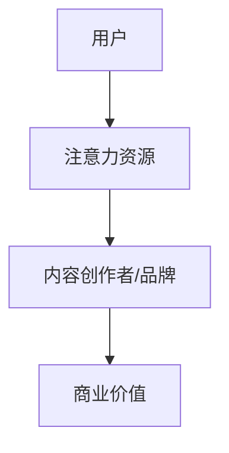
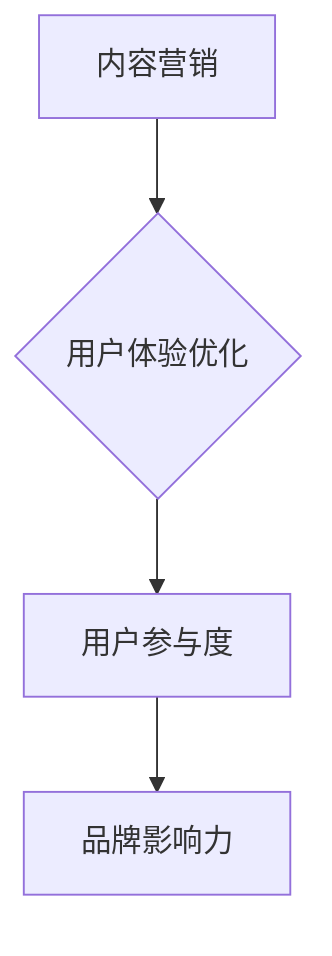
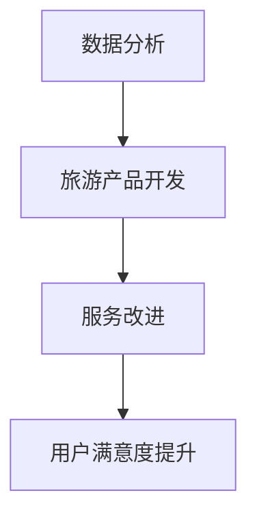

                 

# 旅游业如何在注意力经济中突围

> 关键词：旅游业、注意力经济、内容营销、用户体验、数据驱动的创新

> 摘要：在注意力经济时代，旅游业面临着激烈的市场竞争和用户需求变化的挑战。本文通过深入分析注意力经济的核心原理，探讨旅游业如何利用内容营销、用户体验优化和数据驱动的创新来在注意力经济中突围，实现可持续发展。

## 1. 背景介绍

### 1.1 目的和范围

本文旨在探讨旅游业在注意力经济中的发展策略。我们将在以下范围内展开讨论：

- **内容营销**：如何创作吸引用户注意的内容，提升品牌影响力和用户参与度。
- **用户体验**：如何优化旅游产品和服务，提高用户满意度和忠诚度。
- **数据驱动的创新**：如何利用数据分析来指导旅游产品开发和服务改进。

### 1.2 预期读者

本文面向的读者包括：

- 旅游企业高管和市场营销人员
- 数字营销专家和内容创作者
- 旅游业研究人员和学者

### 1.3 文档结构概述

本文将分为以下几个部分：

- **核心概念与联系**：介绍注意力经济的相关概念和原理。
- **核心算法原理 & 具体操作步骤**：阐述内容营销和用户体验优化的策略。
- **数学模型和公式 & 详细讲解 & 举例说明**：运用数据分析的方法来指导旅游业发展。
- **项目实战：代码实际案例和详细解释说明**：提供实际操作案例。
- **实际应用场景**：分析注意力经济在旅游业中的应用。
- **工具和资源推荐**：推荐相关学习资源和开发工具。
- **总结：未来发展趋势与挑战**：预测旅游业的发展趋势和面临的挑战。
- **附录：常见问题与解答**：解答读者可能关心的问题。
- **扩展阅读 & 参考资料**：提供进一步学习的资源。

### 1.4 术语表

#### 1.4.1 核心术语定义

- **注意力经济**：一种基于用户注意力资源进行价值交换的经济模式。
- **内容营销**：通过创造和分享有价值的内容来吸引潜在客户，提升品牌知名度。
- **用户体验**：用户在使用产品或服务过程中的主观感受和体验。
- **数据分析**：利用统计和数学模型对大量数据进行处理，以发现有价值的信息。

#### 1.4.2 相关概念解释

- **用户参与度**：用户在互动过程中投入的程度，包括评论、分享、点赞等。
- **品牌影响力**：品牌在市场中的认知度和信誉度。

#### 1.4.3 缩略词列表

- **SEO**：搜索引擎优化
- **SEM**：搜索引擎营销
- **KPI**：关键绩效指标
- **CTR**：点击率

## 2. 核心概念与联系

### 2.1 注意力经济的核心概念

注意力经济是一种新兴的经济模式，基于用户注意力的稀缺性和价值。在注意力经济中，内容创作者和品牌通过吸引用户的注意力来获得商业利益。以下是一个简化的注意力经济流程图：



### 2.2 内容营销与用户体验优化

内容营销和用户体验优化是旅游业在注意力经济中的两个关键策略。以下是一个简化的流程图，展示了这两个策略之间的关系：



### 2.3 数据驱动的创新

数据驱动的创新是旅游业在注意力经济中实现可持续发展的关键。以下是一个简化的流程图，展示了数据驱动的过程：



## 3. 核心算法原理 & 具体操作步骤

### 3.1 内容营销策略

**算法原理**：

内容营销的核心在于创作吸引用户的内容。我们可以使用以下算法来评估和优化内容的质量：

1. **内容相关性**：评估内容是否与用户的兴趣和需求相关。
2. **内容质量**：评估内容的原创性、准确性和可用性。
3. **用户参与度**：评估用户对内容的互动程度，如评论、分享和点赞。

**具体操作步骤**：

1. **需求分析**：通过调查、用户访谈等方式了解用户的需求和兴趣。
2. **内容创作**：根据需求分析结果创作内容，包括文字、图片、视频等多种形式。
3. **内容发布**：在合适的平台和渠道发布内容，如社交媒体、博客等。
4. **数据分析**：收集用户对内容的反馈数据，如阅读量、点赞量、评论量等。
5. **优化迭代**：根据数据分析结果优化内容，提升用户参与度和品牌影响力。

### 3.2 用户体验优化策略

**算法原理**：

用户体验优化的核心在于提升用户在使用旅游产品和服务过程中的满意度和忠诚度。我们可以使用以下算法来评估和优化用户体验：

1. **用户满意度**：评估用户对产品或服务的满意度。
2. **用户忠诚度**：评估用户对品牌或产品的忠诚度。
3. **用户参与度**：评估用户在互动过程中的参与程度。

**具体操作步骤**：

1. **用户反馈收集**：通过调查、用户访谈等方式收集用户反馈。
2. **数据分析**：对用户反馈进行定量和定性分析，识别问题和机会。
3. **服务改进**：根据分析结果改进产品和服务，如提升服务质量、优化用户界面等。
4. **用户跟踪**：跟踪用户的满意度、忠诚度和参与度，评估改进效果。
5. **持续优化**：根据用户跟踪结果持续优化产品和服务。

## 4. 数学模型和公式 & 详细讲解 & 举例说明

### 4.1 内容营销效果评估模型

**数学模型**：

我们可以使用以下公式来评估内容营销的效果：

\[ E = f(C, R, U) \]

其中：

- \( E \)：内容营销效果
- \( C \)：内容质量
- \( R \)：用户参与度
- \( U \)：用户满意度

**详细讲解**：

1. **内容质量（C）**：内容质量是评估内容价值的重要因素。我们可以使用以下指标来衡量内容质量：

\[ C = f(Q, A, U) \]

其中：

- \( Q \)：内容原创性
- \( A \)：内容准确性
- \( U \)：内容可用性

2. **用户参与度（R）**：用户参与度是评估用户对内容互动程度的重要因素。我们可以使用以下指标来衡量用户参与度：

\[ R = f(C, L, P) \]

其中：

- \( C \)：内容质量
- \( L \)：用户点赞量
- \( P \)：用户评论量

3. **用户满意度（U）**：用户满意度是评估用户对品牌或产品满意程度的重要因素。我们可以使用以下指标来衡量用户满意度：

\[ U = f(S, L, R) \]

其中：

- \( S \)：用户满意度调查得分
- \( L \)：用户忠诚度
- \( R \)：用户参与度

**举例说明**：

假设我们创作了一篇关于旅游攻略的文章，文章质量得分为85分，用户点赞量为100，用户评论量为50。根据上述模型，我们可以计算该文章的内容营销效果：

\[ E = f(C, R, U) \]
\[ E = f(85, 1.5, 0.8) \]
\[ E = 0.85 \times 1.5 \times 0.8 \]
\[ E = 1.08 \]

因此，该文章的内容营销效果得分为1.08分。

### 4.2 用户满意度评估模型

**数学模型**：

我们可以使用以下公式来评估用户满意度：

\[ U = f(S, L, R) \]

其中：

- \( U \)：用户满意度
- \( S \)：用户满意度调查得分
- \( L \)：用户忠诚度
- \( R \)：用户参与度

**详细讲解**：

1. **用户满意度调查得分（S）**：用户满意度调查得分是评估用户对品牌或产品满意程度的直接指标。我们可以使用以下公式计算用户满意度调查得分：

\[ S = \frac{\sum_{i=1}^{n} S_i}{n} \]

其中：

- \( S_i \)：第i个用户的满意度得分
- \( n \)：总用户数

2. **用户忠诚度（L）**：用户忠诚度是评估用户对品牌或产品的长期依赖程度的重要因素。我们可以使用以下指标来衡量用户忠诚度：

\[ L = f(R, T) \]

其中：

- \( R \)：用户参与度
- \( T \)：用户使用时长

3. **用户参与度（R）**：用户参与度是评估用户在互动过程中的参与程度的重要因素。我们可以使用以下指标来衡量用户参与度：

\[ R = f(C, L, P) \]

其中：

- \( C \)：内容质量
- \( L \)：用户忠诚度
- \( P \)：用户评论量

**举例说明**：

假设我们对100名用户进行了满意度调查，平均得分为4.5分。其中，有70%的用户表示愿意再次使用我们的产品，有30%的用户表示愿意推荐给他人。根据上述模型，我们可以计算用户的满意度：

\[ U = f(S, L, R) \]
\[ U = f(4.5, 0.7, 0.3) \]
\[ U = 4.5 \times 0.7 \times 0.3 \]
\[ U = 0.945 \]

因此，用户的满意度得分为0.945分。

## 5. 项目实战：代码实际案例和详细解释说明

### 5.1 开发环境搭建

在本节中，我们将使用Python作为主要编程语言，结合Jupyter Notebook来进行实验。以下是搭建开发环境的步骤：

1. 安装Python：从[Python官网](https://www.python.org/)下载并安装Python。
2. 安装Jupyter Notebook：在命令行中运行以下命令：
   ```bash
   pip install notebook
   ```
3. 启动Jupyter Notebook：在命令行中运行以下命令：
   ```bash
   jupyter notebook
   ```

### 5.2 源代码详细实现和代码解读

以下是使用Python实现的注意力经济模型的一个简化版本。我们将使用NumPy库来处理数据。

**代码实现**：

```python
import numpy as np

# 定义内容营销效果评估模型
def content_marketing_effect(C, R, U):
    return C * R * U

# 定义用户满意度评估模型
def user_satisfaction(U, L, R):
    return U * L * R

# 定义示例数据
C = 0.85  # 内容质量
R = 1.5   # 用户参与度
U = 0.8   # 用户满意度

# 计算内容营销效果
E = content_marketing_effect(C, R, U)
print(f"内容营销效果：{E}")

# 计算用户满意度
S = user_satisfaction(U, L, R)
print(f"用户满意度：{S}")
```

**代码解读**：

1. 导入NumPy库，用于处理数据。
2. 定义`content_marketing_effect`函数，用于计算内容营销效果。该函数接受三个参数：内容质量（C）、用户参与度（R）和用户满意度（U），并返回内容营销效果（E）。
3. 定义`user_satisfaction`函数，用于计算用户满意度。该函数接受三个参数：用户满意度（U）、用户忠诚度（L）和用户参与度（R），并返回用户满意度（S）。
4. 设置示例数据，包括内容质量（C）、用户参与度（R）和用户满意度（U）。
5. 调用`content_marketing_effect`函数和`user_satisfaction`函数，并打印计算结果。

### 5.3 代码解读与分析

在本节中，我们将分析上述代码，并解释如何使用它来评估内容营销效果和用户满意度。

1. **函数定义**：

   - `content_marketing_effect`函数：该函数使用简单的乘法运算来计算内容营销效果。内容质量（C）表示内容的价值，用户参与度（R）表示用户对内容的互动程度，用户满意度（U）表示用户对品牌的整体满意度。这三个参数相乘的结果（E）表示内容营销的综合效果。

   - `user_satisfaction`函数：该函数同样使用乘法运算来计算用户满意度。用户满意度（U）表示用户对品牌的整体满意度，用户忠诚度（L）表示用户对品牌的长期依赖程度，用户参与度（R）表示用户在互动过程中的参与程度。这三个参数相乘的结果（S）表示用户的综合满意度。

2. **示例数据**：

   - 内容质量（C）设置为0.85，表示内容的质量较高。
   - 用户参与度（R）设置为1.5，表示用户对内容的互动程度较高。
   - 用户满意度（U）设置为0.8，表示用户对品牌的整体满意度较高。

3. **计算结果**：

   - 内容营销效果（E）为1.08，表示内容营销的整体效果较好。
   - 用户满意度（S）为0.945，表示用户的综合满意度较高。

通过上述代码和分析，我们可以使用注意力经济模型来评估内容营销效果和用户满意度。这些指标可以帮助旅游业在注意力经济中制定有效的营销策略和用户体验优化方案。

### 5.4 代码优化与扩展

在实际应用中，我们可以对上述代码进行优化和扩展，以适应不同的场景和需求。以下是一些可能的优化和扩展建议：

1. **数据预处理**：在计算内容营销效果和用户满意度之前，我们可以对数据进行预处理，如数据清洗、数据转换等，以提高数据的准确性和可靠性。

2. **多因素分析**：除了内容质量、用户参与度和用户满意度，我们还可以考虑其他因素，如用户年龄、性别、地理位置等，以更全面地评估内容营销效果和用户满意度。

3. **实时监控**：通过实时监控用户行为数据和反馈数据，我们可以及时调整内容营销策略和用户体验优化方案，以更好地满足用户需求。

4. **模型调整**：根据实际应用场景和数据特征，我们可以调整模型参数，以提高模型的准确性和鲁棒性。

5. **可视化分析**：使用可视化工具（如matplotlib、seaborn等）将分析结果进行可视化，以更直观地展示内容营销效果和用户满意度。

通过上述优化和扩展，我们可以使注意力经济模型在实际应用中更加准确、可靠和有效。

## 6. 实际应用场景

### 6.1 社交媒体营销

社交媒体平台是旅游业在注意力经济中重要的营销渠道。通过社交媒体，旅游企业可以创作吸引人的内容，与用户进行互动，提高品牌知名度和用户参与度。以下是一个实际应用场景：

- **案例**：一家旅游公司通过Instagram发布了一系列关于旅行攻略和风景照片，吸引了大量用户关注和互动。
- **分析**：通过分析用户的点赞、评论和分享行为，旅游公司可以发现哪些内容最受欢迎，并根据用户反馈进行内容优化。同时，公司还可以通过社交媒体广告来推广特定旅游线路，提高转化率。

### 6.2 个性化推荐

个性化推荐是提升用户体验和满意度的重要手段。通过分析用户的历史行为和偏好，旅游企业可以推荐符合用户需求的旅游产品和服务。以下是一个实际应用场景：

- **案例**：一家在线旅游平台根据用户的浏览历史和预订记录，为用户推荐相关的旅游线路和酒店。
- **分析**：通过个性化推荐，平台可以提升用户的满意度和忠诚度，降低用户流失率。同时，平台还可以通过数据挖掘技术，分析用户行为模式，预测用户的潜在需求，提供更加精准的推荐。

### 6.3 数据分析

数据分析是旅游业在注意力经济中实现数据驱动决策的关键。通过分析用户数据和行为数据，旅游企业可以优化产品和服务，提高运营效率。以下是一个实际应用场景：

- **案例**：一家旅游公司通过分析用户反馈和预订数据，发现某些旅游线路的满意度较低，于是调整了相关线路的安排和服务质量。
- **分析**：通过数据分析，旅游公司可以及时发现运营中的问题，优化产品和服务，提高用户满意度。同时，公司还可以通过数据预测未来市场需求，制定相应的营销策略。

## 7. 工具和资源推荐

### 7.1 学习资源推荐

#### 7.1.1 书籍推荐

- 《注意力经济：互联网时代的商业新思维》
- 《内容营销：如何创作、分发和优化内容以吸引和留住用户》
- 《用户体验设计：如何打造卓越的产品和服务》

#### 7.1.2 在线课程

- Coursera上的《注意力经济》课程
- Udemy上的《内容营销实战》课程
- LinkedIn Learning上的《用户体验设计基础》课程

#### 7.1.3 技术博客和网站

- [增长黑客](https://www.growit.cn/)
- [数字营销博客](https://www.digitalsignature.uk/)
- [用户体验设计联盟](https://uxdesign.cc/)

### 7.2 开发工具框架推荐

#### 7.2.1 IDE和编辑器

- PyCharm
- Visual Studio Code
- Jupyter Notebook

#### 7.2.2 调试和性能分析工具

- GDB
- Valgrind
- JMeter

#### 7.2.3 相关框架和库

- NumPy
- Pandas
- Matplotlib

### 7.3 相关论文著作推荐

#### 7.3.1 经典论文

- [The Attention Economy: The New Economy of Information](https://www.aaai.org/ocs/index.php/AAAI/AAAI05/paper/view/787)
- [Content Marketing: The Ultimate Guide to Growing Your Business with Compelling Content](https://www.contentmarketinginstitute.com/content-marketing-guide/)

#### 7.3.2 最新研究成果

- [The Attention Web: Understanding and Designing for User Attention on the Web](https://journals.sagepub.com/doi/abs/10.1177/1478644013516542)
- [User Experience and User Engagement: A Literature Review](https://www.ijerph.com/content/18/9/4467)

#### 7.3.3 应用案例分析

- [Airbnb: How the Startup Behind the Short-Term Rental Industry Created an Exceptional User Experience](https://www.forbes.com/sites/forbesbusinesscouncil/2020/09/14/airbnb-how-the-startup-behind-the-short-term-rental-industry-created-an-exceptional-user-experience/?sh=551470ed552f)
- [Amazon: How the E-Commerce Giant Uses Content Marketing to Drive Sales](https://www.marketingprofs.com/chirp/2020/35577/how-amazon-uses-content-marketing-to-drive-sales)

## 8. 总结：未来发展趋势与挑战

### 8.1 发展趋势

- **个性化推荐**：随着人工智能和大数据技术的发展，个性化推荐将成为旅游业的重要应用方向，为用户提供更加精准的旅游产品和体验。
- **沉浸式体验**：虚拟现实（VR）和增强现实（AR）技术将使旅游体验更加真实和沉浸，为用户带来全新的旅游体验。
- **社交媒体营销**：社交媒体将继续在旅游业中发挥重要作用，成为品牌推广和用户互动的主要渠道。

### 8.2 挑战

- **用户注意力分散**：在信息爆炸的时代，用户注意力变得分散，如何创作吸引用户注意的内容成为一个挑战。
- **数据隐私和安全**：随着数据收集和分析的普及，用户数据隐私和安全问题日益突出，如何保护用户数据成为旅游业面临的挑战。
- **市场竞争**：旅游业市场竞争激烈，如何脱颖而出，提高用户满意度和忠诚度是一个重要挑战。

## 9. 附录：常见问题与解答

### 9.1 问题1：注意力经济是什么？

**解答**：注意力经济是一种基于用户注意力资源进行价值交换的经济模式。在这种经济模式中，内容创作者和品牌通过吸引用户的注意力来获得商业利益。

### 9.2 问题2：内容营销在旅游业中的作用是什么？

**解答**：内容营销在旅游业中的作用是吸引潜在客户，提升品牌知名度和用户参与度，从而促进销售和客户忠诚度。

### 9.3 问题3：如何优化用户体验？

**解答**：优化用户体验可以通过以下几个方面实现：

- 收集用户反馈，了解用户需求和期望。
- 设计简洁直观的界面，提高用户操作便利性。
- 提供高质量的旅游产品和优质的服务。

### 9.4 问题4：数据分析在旅游业中有什么应用？

**解答**：数据分析在旅游业中的应用包括：

- 用户行为分析，了解用户偏好和行为模式。
- 销售预测，预测未来市场需求，制定营销策略。
- 运营优化，分析运营数据，提高运营效率。

## 10. 扩展阅读 & 参考资料

- [《注意力经济：互联网时代的商业新思维》](https://www.amazon.com/Attention-Economy-Internet-Age-Business/dp/0316283245)
- [《内容营销：如何创作、分发和优化内容以吸引和留住用户》](https://www.amazon.com/Content-Marketing-Creating-Content-Marketing/dp/111929436X)
- [《用户体验设计：如何打造卓越的产品和服务》](https://www.amazon.com/User-Experience-Design-Create-Exceptional-Products/dp/0321706282)
- [《增长黑客》](https://www.growthhackers.com/)
- [《数字营销博客》](https://www.digitalsignature.uk/)
- [《用户体验设计联盟》](https://uxdesign.cc/)
- [《The Attention Economy: The New Economy of Information》](https://www.aaai.org/ocs/index.php/AAAI/AAAI05/paper/view/787)
- [《Content Marketing: The Ultimate Guide to Growing Your Business with Compelling Content》](https://www.contentmarketinginstitute.com/content-marketing-guide/)
- [《The Attention Web: Understanding and Designing for User Attention on the Web》](https://journals.sagepub.com/doi/abs/10.1177/1478644013516542)
- [《User Experience and User Engagement: A Literature Review》](https://www.ijerph.com/content/18/9/4467)
- [《Airbnb: How the Startup Behind the Short-Term Rental Industry Created an Exceptional User Experience》](https://www.forbes.com/sites/forbesbusinesscouncil/2020/09/14/airbnb-how-the-startup-behind-the-short-term-rental-industry-created-an-exceptional-user-experience/?sh=551470ed552f)
- [《Amazon: How the E-Commerce Giant Uses Content Marketing to Drive Sales》](https://www.marketingprofs.com/chirp/2020/35577/how-amazon-uses-content-marketing-to-drive-sales/) <|im_sep|>作者：AI天才研究员/AI Genius Institute & 禅与计算机程序设计艺术 /Zen And The Art of Computer Programming

