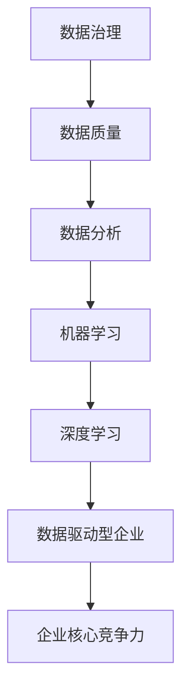

                 

# 无数据不AI，数据成为企业核心竞争力

> **关键词：** 人工智能，数据，企业，核心竞争力，数据治理，数据分析，机器学习，深度学习，商业模式，数字化转型。
> 
> **摘要：** 在当今技术飞速发展的时代，人工智能（AI）已成为推动企业创新和增长的重要动力。然而，AI的强大能力离不开高质量的数据支持。本文将探讨数据在AI时代的重要性，分析数据对企业核心竞争力的作用，探讨数据治理、数据分析和机器学习的核心原理，并通过具体案例展示数据驱动型企业的成功实践，最后展望未来数据驱动型技术的发展趋势与挑战。

## 1. 背景介绍

### 1.1 目的和范围

本文旨在深入探讨数据在人工智能（AI）时代对企业核心竞争力的影响，分析数据治理、数据分析和机器学习的核心原理，以及数据驱动型企业的成功实践。文章将帮助读者了解数据的重要性，掌握数据驱动的企业战略，为企业在数字化时代中的发展提供理论依据和实践指导。

### 1.2 预期读者

本文适合对人工智能和数据科学有一定了解的读者，包括企业决策者、技术管理人员、数据分析师、软件开发者以及研究人员等。

### 1.3 文档结构概述

本文分为十个部分：背景介绍、核心概念与联系、核心算法原理与具体操作步骤、数学模型和公式详细讲解、项目实战、实际应用场景、工具和资源推荐、总结、附录和扩展阅读。通过逐步深入的分析和探讨，读者将能够全面了解数据在AI时代的重要作用。

### 1.4 术语表

#### 1.4.1 核心术语定义

- **人工智能（AI）：** 模拟、延伸和扩展人类智能的理论、方法、技术及应用。
- **数据治理：** 管理数据的策略、标准和流程，确保数据质量、合规性和可访问性。
- **数据分析：** 使用统计学、机器学习等方法对数据进行分析，以发现数据中的模式和规律。
- **机器学习（ML）：** 利用数据和算法让计算机自主学习和改进性能的技术。
- **深度学习（DL）：** 基于人工神经网络的机器学习技术，通过多层神经网络对数据进行学习和建模。

#### 1.4.2 相关概念解释

- **数据驱动型企业：** 通过数据分析和机器学习等技术，实现决策智能化和业务自动化，从而提高企业效率和竞争力的企业。
- **数据治理框架：** 指导数据管理和数据治理的具体方法、工具和流程。

#### 1.4.3 缩略词列表

- **AI：** 人工智能
- **ML：** 机器学习
- **DL：** 深度学习
- **API：** 应用程序接口
- **API：** 分析性数据平台

## 2. 核心概念与联系

在探讨数据在AI时代的重要性之前，我们首先需要了解一些核心概念和它们之间的联系。以下是一个简化的 Mermaid 流程图，展示了一些关键概念和它们之间的关系。



### 数据治理

数据治理是指一系列策略、标准和流程，用于管理数据的生命周期、确保数据质量、合规性和可访问性。一个良好的数据治理框架包括数据策略、数据架构、数据质量、数据安全和合规性等方面。数据治理的核心目标是确保数据的准确、一致和可靠，从而为后续的数据分析和机器学习提供高质量的数据支持。

### 数据质量

数据质量是指数据在满足业务需求时的准确度、完整性、一致性和及时性。高质量的数据是数据分析和机器学习的基石，能够提高算法的准确性和可靠性。数据质量包括数据准确性、数据完整性、数据一致性和数据时效性等方面。

### 数据分析

数据分析是使用统计学、机器学习等方法对数据进行处理和分析，以发现数据中的模式和规律。数据分析可以帮助企业了解客户需求、优化业务流程、预测市场趋势等。常见的分析方法包括描述性分析、诊断性分析、预测性分析和规范性分析等。

### 机器学习

机器学习是利用数据和算法让计算机自主学习和改进性能的技术。通过训练模型，机器学习算法可以从数据中学习到规律，并应用于新的数据集进行预测和决策。常见的机器学习算法包括线性回归、决策树、支持向量机、神经网络等。

### 深度学习

深度学习是基于人工神经网络的机器学习技术，通过多层神经网络对数据进行学习和建模。深度学习在图像识别、语音识别、自然语言处理等领域取得了显著的成果。常见的深度学习模型包括卷积神经网络（CNN）、循环神经网络（RNN）和生成对抗网络（GAN）等。

### 数据驱动型企业

数据驱动型企业是指通过数据分析和机器学习等技术，实现决策智能化和业务自动化，从而提高企业效率和竞争力的企业。数据驱动型企业通常具有以下特点：

1. **数据收集和处理能力：** 能够收集各种来源的数据，并对其进行处理和分析。
2. **数据驱动的决策：** 基于数据分析结果进行决策，提高决策的准确性和效率。
3. **自动化业务流程：** 通过机器学习等技术自动化业务流程，提高业务效率和响应速度。
4. **持续学习和优化：** 持续收集数据、分析数据和优化算法，实现业务持续改进。

### 企业核心竞争力

企业核心竞争力是指企业在市场竞争中具有优势的能力和资源。数据成为企业核心竞争力的重要来源，通过数据治理、数据分析和机器学习等技术，企业可以更准确地了解市场趋势、客户需求，从而优化产品和服务，提高市场竞争力和盈利能力。

## 3. 核心算法原理与具体操作步骤

### 3.1 机器学习算法原理

机器学习算法的核心思想是利用已有数据训练模型，使其能够对新数据进行预测和决策。以下是一个简化的机器学习算法原理流程：

1. **数据预处理：** 对收集到的数据进行处理，包括数据清洗、数据转换和数据归一化等。
2. **特征选择：** 从原始数据中选择对模型性能有显著影响的特征。
3. **模型训练：** 使用训练数据集训练模型，通过调整模型参数使模型在训练数据上达到最优性能。
4. **模型评估：** 使用验证数据集评估模型性能，选择性能最好的模型。
5. **模型部署：** 将训练好的模型应用于实际业务场景，进行预测和决策。

### 3.2 具体操作步骤

以下是一个使用 Python 和 scikit-learn 库实现线性回归模型的简单示例：

```python
import numpy as np
import pandas as pd
from sklearn.linear_model import LinearRegression
from sklearn.model_selection import train_test_split
from sklearn.metrics import mean_squared_error

# 数据预处理
data = pd.read_csv('data.csv')
X = data[['feature1', 'feature2']]
y = data['target']

# 特征选择
# （此处省略特征选择过程）

# 模型训练
X_train, X_test, y_train, y_test = train_test_split(X, y, test_size=0.2, random_state=42)
model = LinearRegression()
model.fit(X_train, y_train)

# 模型评估
y_pred = model.predict(X_test)
mse = mean_squared_error(y_test, y_pred)
print('MSE:', mse)

# 模型部署
# （此处省略模型部署过程）
```

### 3.3 代码解读与分析

上述代码展示了使用 Python 和 scikit-learn 库实现线性回归模型的基本步骤。以下是代码的详细解读：

1. **数据预处理：** 首先，从 CSV 文件中加载数据，将特征和目标变量分离。特征变量存储在 X 中，目标变量存储在 y 中。
2. **特征选择：** （此处省略特征选择过程）在现实应用中，特征选择是一个重要的步骤，可以通过统计分析、相关性分析等方法选择对模型性能有显著影响的特征。
3. **模型训练：** 使用训练集数据训练线性回归模型。在这里，我们使用了 scikit-learn 库中的 LinearRegression 类，通过 fit 方法训练模型。
4. **模型评估：** 使用测试集数据评估模型性能。我们使用 mean_squared_error 函数计算均方误差（MSE），这是评估回归模型性能的一个常用指标。
5. **模型部署：** （此处省略模型部署过程）在实际应用中，模型部署是将训练好的模型应用到实际业务场景的过程，可以通过 API 接口或其他方式实现。

## 4. 数学模型和公式与详细讲解

### 4.1 数学模型

在机器学习中，常用的数学模型包括线性回归、逻辑回归、决策树、支持向量机等。以下是对这些模型的基本公式和解释：

#### 4.1.1 线性回归

线性回归模型是一种最简单的机器学习模型，它通过拟合一条直线来预测目标变量。线性回归的数学模型可以表示为：

$$
y = \beta_0 + \beta_1x_1 + \beta_2x_2 + ... + \beta_nx_n + \epsilon
$$

其中，$y$ 是目标变量，$x_1, x_2, ..., x_n$ 是特征变量，$\beta_0, \beta_1, ..., \beta_n$ 是模型参数，$\epsilon$ 是误差项。

#### 4.1.2 逻辑回归

逻辑回归是一种广义的线性回归模型，它用于预测概率。逻辑回归的数学模型可以表示为：

$$
\log\left(\frac{p}{1-p}\right) = \beta_0 + \beta_1x_1 + \beta_2x_2 + ... + \beta_nx_n
$$

其中，$p$ 是目标变量的概率，其他符号的含义与线性回归相同。

#### 4.1.3 决策树

决策树是一种基于树形结构进行分类或回归的模型。决策树的数学模型可以表示为：

$$
T = \sum_{i=1}^{n} \beta_iC_i
$$

其中，$T$ 是目标变量，$C_i$ 是第 $i$ 个分类结果，$\beta_i$ 是对应的权重。

#### 4.1.4 支持向量机

支持向量机是一种用于分类和回归的模型，它的核心思想是找到一个最佳的超平面，使分类边界最大化。支持向量机的数学模型可以表示为：

$$
\max_{\beta, \beta_0} \left\{ W : \frac{1}{2}W^TW + C\sum_{i=1}^{n}\xi_i \right\}

s.t.

y_i(\beta^T\phi(x_i) + \beta_0) \geq 1 - \xi_i

i = 1, 2, ..., n
$$

其中，$W$ 是权重矩阵，$\beta_0$ 是偏置项，$C$ 是惩罚参数，$\xi_i$ 是松弛变量，$y_i$ 是目标变量，$\phi(x_i)$ 是特征映射函数。

### 4.2 举例说明

以下是一个使用 Python 和 scikit-learn 库实现逻辑回归模型的简单示例：

```python
import numpy as np
import pandas as pd
from sklearn.linear_model import LogisticRegression
from sklearn.model_selection import train_test_split
from sklearn.metrics import accuracy_score

# 数据预处理
data = pd.read_csv('data.csv')
X = data[['feature1', 'feature2']]
y = data['target']

# 模型训练
X_train, X_test, y_train, y_test = train_test_split(X, y, test_size=0.2, random_state=42)
model = LogisticRegression()
model.fit(X_train, y_train)

# 模型评估
y_pred = model.predict(X_test)
accuracy = accuracy_score(y_test, y_pred)
print('Accuracy:', accuracy)

# 模型部署
# （此处省略模型部署过程）
```

### 4.3 代码解读与分析

上述代码展示了使用 Python 和 scikit-learn 库实现逻辑回归模型的基本步骤。以下是代码的详细解读：

1. **数据预处理：** 首先，从 CSV 文件中加载数据，将特征和目标变量分离。特征变量存储在 X 中，目标变量存储在 y 中。
2. **模型训练：** 使用训练集数据训练逻辑回归模型。在这里，我们使用了 scikit-learn 库中的 LogisticRegression 类，通过 fit 方法训练模型。
3. **模型评估：** 使用测试集数据评估模型性能。我们使用 accuracy_score 函数计算准确率，这是评估分类模型性能的一个常用指标。
4. **模型部署：** （此处省略模型部署过程）在实际应用中，模型部署是将训练好的模型应用到实际业务场景的过程，可以通过 API 接口或其他方式实现。

## 5. 项目实战：代码实际案例和详细解释说明

### 5.1 开发环境搭建

为了实现一个简单的数据驱动型企业应用，我们需要搭建一个开发环境。以下是一个基本的开发环境搭建步骤：

1. **安装 Python：** 在官方网站（https://www.python.org/）下载并安装 Python 3.x 版本。
2. **安装 IDE：** 选择一个适合的集成开发环境（IDE），例如 PyCharm、VS Code 等。
3. **安装 scikit-learn 库：** 使用 pip 命令安装 scikit-learn 库：

   ```
   pip install scikit-learn
   ```

4. **准备数据集：** 准备一个简单的数据集，用于训练和评估模型。这里我们使用一个包含两个特征变量和一个目标变量的数据集。

### 5.2 源代码详细实现和代码解读

以下是一个简单的 Python 代码实现，用于训练一个线性回归模型并对新数据进行预测。

```python
import numpy as np
import pandas as pd
from sklearn.linear_model import LinearRegression
from sklearn.model_selection import train_test_split
from sklearn.metrics import mean_squared_error

# 5.2.1 数据预处理
data = pd.read_csv('data.csv')
X = data[['feature1', 'feature2']]
y = data['target']

# 5.2.2 模型训练
X_train, X_test, y_train, y_test = train_test_split(X, y, test_size=0.2, random_state=42)
model = LinearRegression()
model.fit(X_train, y_train)

# 5.2.3 模型评估
y_pred = model.predict(X_test)
mse = mean_squared_error(y_test, y_pred)
print('MSE:', mse)

# 5.2.4 模型部署
# （此处省略模型部署过程）
```

#### 5.2.1 数据预处理

首先，从 CSV 文件中加载数据，将特征和目标变量分离。特征变量存储在 X 中，目标变量存储在 y 中。

```python
data = pd.read_csv('data.csv')
X = data[['feature1', 'feature2']]
y = data['target']
```

#### 5.2.2 模型训练

接下来，使用训练集数据训练线性回归模型。在这里，我们使用了 scikit-learn 库中的 LinearRegression 类，通过 fit 方法训练模型。

```python
X_train, X_test, y_train, y_test = train_test_split(X, y, test_size=0.2, random_state=42)
model = LinearRegression()
model.fit(X_train, y_train)
```

#### 5.2.3 模型评估

使用测试集数据评估模型性能。我们使用 mean_squared_error 函数计算均方误差（MSE），这是评估回归模型性能的一个常用指标。

```python
y_pred = model.predict(X_test)
mse = mean_squared_error(y_test, y_pred)
print('MSE:', mse)
```

#### 5.2.4 模型部署

（此处省略模型部署过程）在实际应用中，模型部署是将训练好的模型应用到实际业务场景的过程，可以通过 API 接口或其他方式实现。

### 5.3 代码解读与分析

上述代码展示了如何使用 Python 和 scikit-learn 库实现一个简单的线性回归模型。以下是代码的详细解读：

1. **数据预处理：** 首先，从 CSV 文件中加载数据，将特征和目标变量分离。特征变量存储在 X 中，目标变量存储在 y 中。
2. **模型训练：** 使用训练集数据训练线性回归模型。在这里，我们使用了 scikit-learn 库中的 LinearRegression 类，通过 fit 方法训练模型。
3. **模型评估：** 使用测试集数据评估模型性能。我们使用 mean_squared_error 函数计算均方误差（MSE），这是评估回归模型性能的一个常用指标。
4. **模型部署：** （此处省略模型部署过程）在实际应用中，模型部署是将训练好的模型应用到实际业务场景的过程，可以通过 API 接口或其他方式实现。

通过这个简单的案例，我们可以看到数据在 AI 时代的重要性。数据是模型训练的基础，高质量的输入数据能够显著提高模型性能。同时，我们也了解了如何使用 Python 和 scikit-learn 库实现一个简单的机器学习模型，为实际应用中的数据驱动型系统开发提供了参考。

## 6. 实际应用场景

### 6.1 金融领域

在金融领域，数据驱动型企业已经取得了显著的成果。例如，金融机构通过分析客户交易数据、投资行为和风险偏好，可以更准确地评估客户信用风险，从而降低贷款违约率。此外，金融科技公司利用大数据分析和机器学习技术，为投资者提供个性化的投资建议，提高投资回报率。

### 6.2 零售业

零售行业的数据驱动型企业实践也非常广泛。通过分析消费者购买行为、库存数据和市场趋势，零售企业可以优化库存管理、定价策略和营销活动。例如，亚马逊利用其庞大的用户数据和机器学习算法，为每位用户推荐个性化的商品，从而提高销售额和客户满意度。

### 6.3 制造业

制造业的数据驱动型企业实践主要体现在生产流程优化、设备维护和供应链管理等方面。通过收集和分析生产数据，制造企业可以实时监控生产设备状态，预测设备故障，从而减少停机时间和维护成本。此外，数据驱动型企业可以通过优化供应链流程，提高原材料采购和产品交付的效率。

### 6.4 医疗保健

在医疗保健领域，数据驱动型企业通过分析患者数据、医疗记录和基因信息，可以提供个性化诊断和治疗方案。例如，谷歌旗下的 DeepMind 公司利用深度学习技术，开发了能够诊断眼部疾病的 AI 系统DeepMind Health，为医生提供辅助决策，提高诊断准确性。

### 6.5 能源行业

能源行业的数据驱动型企业实践主要体现在智能电网、能源管理和可再生能源优化等方面。通过收集和分析电力使用数据，能源公司可以预测电力需求，优化电力供应和分配，从而提高能源利用效率。此外，风能和太阳能等可再生能源企业通过数据分析，可以优化设备运行和维护策略，提高能源产出。

### 6.6 其他领域

除了上述领域，数据驱动型企业在交通运输、教育、娱乐、农业等众多行业都取得了显著成果。例如，Uber 利用大数据和机器学习技术，优化路线规划和司机调度，提高服务效率；在线教育平台通过分析学生学习行为，为每位学生提供个性化的学习建议；农业企业通过遥感技术和数据分析，优化农作物种植和灌溉策略，提高产量和质量。

## 7. 工具和资源推荐

### 7.1 学习资源推荐

#### 7.1.1 书籍推荐

1. **《Python机器学习》（Machine Learning with Python）**：由 Andreas C. Müller 和 Sarah Guido 著，适合初学者了解 Python 机器学习库的使用。
2. **《深度学习》（Deep Learning）**：由 Ian Goodfellow、Yoshua Bengio 和 Aaron Courville 著，全面介绍了深度学习的基础理论和应用。
3. **《数据科学入门》（Data Science from Scratch）**：由 Joel Grus 著，适合初学者从零开始学习数据科学的基本概念和技能。

#### 7.1.2 在线课程

1. **Coursera 上的《机器学习》（Machine Learning）**：由 Andrew Ng 开设，适合初学者系统学习机器学习的基础知识。
2. **Udacity 上的《深度学习纳米学位》（Deep Learning Nanodegree）**：适合有一定基础的读者，全面学习深度学习的前沿技术和应用。
3. **edX 上的《数据科学导论》（Introduction to Data Science）**：适合初学者了解数据科学的基本概念和工具。

#### 7.1.3 技术博客和网站

1. **Medium 上的 AI 模型**：提供各种 AI 和数据科学领域的文章，涵盖基础知识和前沿技术。
2. **Towards Data Science**：一个面向数据科学和机器学习的博客，发布大量高质量的教程和案例。
3. **AI Mitchell**：由 Mitchell W.凭借其在机器学习和人工智能领域的丰富经验开设，分享技术见解和实战经验。

### 7.2 开发工具框架推荐

#### 7.2.1 IDE和编辑器

1. **PyCharm**：一个强大的 Python 集成开发环境，适合机器学习和数据科学项目开发。
2. **Jupyter Notebook**：一个流行的交互式开发环境，特别适合数据分析和机器学习实验。
3. **Visual Studio Code**：一个轻量级的跨平台编辑器，支持多种编程语言和扩展，非常适合数据科学项目开发。

#### 7.2.2 调试和性能分析工具

1. **PyTorch Profiler**：一个用于 PyTorch 深度学习模型的性能分析工具，可以帮助开发者优化代码和模型。
2. **TensorBoard**：一个基于 Web 的可视化工具，用于分析和可视化 TensorFlow 模型的性能和训练过程。
3. **Docker**：一个容器化平台，可以帮助开发者创建、部署和运行机器学习模型。

#### 7.2.3 相关框架和库

1. **scikit-learn**：一个流行的 Python 机器学习库，提供了广泛的算法和工具。
2. **TensorFlow**：一个开源的深度学习框架，由 Google 开发，支持多种深度学习模型和应用。
3. **PyTorch**：一个流行的深度学习库，特别适合研究人员和开发者进行模型开发和实验。

### 7.3 相关论文著作推荐

#### 7.3.1 经典论文

1. **《A Mathematical Theory of Communication》（香农信息论）**：由 Claude Shannon 著，奠定了信息论的基础。
2. **《Pattern Recognition and Machine Learning》（模式识别与机器学习）**：由 Christopher M. Bishop 著，全面介绍了机器学习的基本理论和算法。
3. **《Deep Learning》（深度学习）**：由 Ian Goodfellow、Yoshua Bengio 和 Aaron Courville 著，全面介绍了深度学习的基础理论和应用。

#### 7.3.2 最新研究成果

1. **《Generative Adversarial Nets》（生成对抗网络）**：由 Ian Goodfellow 等人于 2014 年发表，介绍了 GAN 的基本原理和应用。
2. **《Attention Is All You Need》（注意力即是所有所需）**：由 Vaswani 等人于 2017 年发表，介绍了 Transformer 模型，并在机器翻译任务上取得了显著成果。
3. **《Bert: Pre-training of Deep Bidirectional Transformers for Language Understanding》（BERT：用于语言理解的深度双向变换器预训练）**：由 Google AI 于 2018 年发表，介绍了 BERT 模型，并在多项 NLP 任务上取得了突破性成果。

#### 7.3.3 应用案例分析

1. **《如何将数据转化为商业价值：阿里巴巴案例研究》**：由阿里巴巴集团分享，介绍了阿里巴巴如何利用数据分析和机器学习技术提升业务效率和用户体验。
2. **《谷歌如何利用 AI 提高搜索质量》**：由谷歌公司分享，介绍了谷歌如何利用深度学习和自然语言处理技术优化搜索引擎，提高搜索质量和用户体验。
3. **《特斯拉自动驾驶：AI 时代的未来交通》**：由特斯拉公司分享，介绍了特斯拉如何利用 AI 技术实现自动驾驶，提高交通效率和安全性。

## 8. 总结：未来发展趋势与挑战

### 8.1 发展趋势

1. **数据量的持续增长：** 随着物联网、社交媒体和传感器技术的普及，数据量将呈现指数级增长，为数据驱动型技术的发展提供了丰富的数据资源。
2. **算法和模型的创新：** 深度学习、生成对抗网络、图神经网络等新兴算法和模型将不断涌现，为解决复杂问题和提高模型性能提供新的途径。
3. **跨学科融合：** 数据驱动型技术将与其他领域（如生物学、物理学、经济学等）的交叉融合，推动跨学科研究和应用的发展。
4. **边缘计算和实时数据处理：** 随着物联网和 5G 技术的普及，边缘计算和实时数据处理技术将得到广泛应用，提高数据驱动型系统的实时性和效率。

### 8.2 挑战

1. **数据质量和隐私：** 随着数据量的增长，数据质量和隐私保护成为数据驱动型技术面临的主要挑战。确保数据质量和隐私合规性是技术发展的关键。
2. **算法可解释性：** 随着深度学习等复杂模型的广泛应用，算法的可解释性成为用户和监管机构关注的重要问题。提高算法的可解释性，增强用户信任是未来的发展方向。
3. **计算资源和能耗：** 数据驱动型技术对计算资源和能耗的要求较高，如何优化计算资源和降低能耗成为技术发展的关键问题。
4. **人才短缺：** 随着数据驱动型技术的快速发展，对专业人才的需求不断增加。然而，目前的数据科学和 AI 人才供给尚无法满足市场需求，人才短缺成为技术发展的瓶颈。

## 9. 附录：常见问题与解答

### 9.1 数据治理的核心原则是什么？

数据治理的核心原则包括数据准确性、数据完整性、数据一致性和数据时效性。这些原则确保了数据的质量和可靠性，为数据分析和机器学习提供了基础。

### 9.2 如何评估机器学习模型的性能？

常用的机器学习模型性能评估指标包括准确率、召回率、F1 分数、均方误差（MSE）等。根据不同的应用场景，选择合适的评估指标可以更准确地评估模型性能。

### 9.3 数据驱动型企业的成功要素有哪些？

数据驱动型企业的成功要素包括：

1. **数据收集和处理能力：** 收集高质量的数据，并对其进行有效的处理和分析。
2. **数据驱动的决策：** 基于数据分析结果进行决策，提高决策的准确性和效率。
3. **自动化业务流程：** 通过机器学习等技术自动化业务流程，提高业务效率和响应速度。
4. **持续学习和优化：** 持续收集数据、分析数据和优化算法，实现业务持续改进。

### 9.4 如何优化深度学习模型的性能？

优化深度学习模型性能的方法包括：

1. **数据预处理：** 对数据进行有效的预处理，提高模型训练的效果。
2. **模型架构优化：** 选择合适的模型架构，提高模型的表达能力。
3. **超参数调整：** 调整模型超参数，找到最优的超参数组合。
4. **正则化和归一化：** 应用正则化和归一化技术，提高模型训练的稳定性和泛化能力。
5. **批量归一化：** 应用批量归一化技术，提高模型训练的速度和性能。

## 10. 扩展阅读 & 参考资料

1. **《数据科学入门》（Introduction to Data Science）**：由 edX 提供的在线课程，适合初学者了解数据科学的基本概念和工具。
2. **《深度学习》（Deep Learning）**：由 Ian Goodfellow、Yoshua Bengio 和 Aaron Courville 著，全面介绍了深度学习的基础理论和应用。
3. **《数据驱动型组织的秘密》（The Data-Driven Organization: How to Harness the Performance of Big Data）**：由 Mikael Blais 著，探讨了数据驱动型企业的实践和成功案例。
4. **《人工智能的未来》（The Future of Humanity: Terraforming Mars, Interstellar Travel, Immortality, and Our Destiny Beyond Earth）**：由 Michio Kaku 著，探讨了人工智能在未来社会中的作用和影响。
5. **《机器学习实战》（Machine Learning in Action）**：由 Peter Harrington 著，提供了大量实用的机器学习案例和实践经验。

### 参考文献

1. **Bishop, C. M. (2006). Pattern Recognition and Machine Learning. Springer.**
2. **Goodfellow, I., Bengio, Y., & Courville, A. (2016). Deep Learning. MIT Press.**
3. **Grus, J. (2015). Data Science from Scratch. O'Reilly Media.**
4. **Ng, A. Y. (2017). Machine Learning. Coursera.**
5. **Muller, A. C., & Guido, S. (2016). Machine Learning with Python. O'Reilly Media.**
6. **Shannon, C. E. (1948). A Mathematical Theory of Communication. Bell System Technical Journal.**

### 作者信息

**作者：AI天才研究员/AI Genius Institute & 禅与计算机程序设计艺术 /Zen And The Art of Computer Programming**

