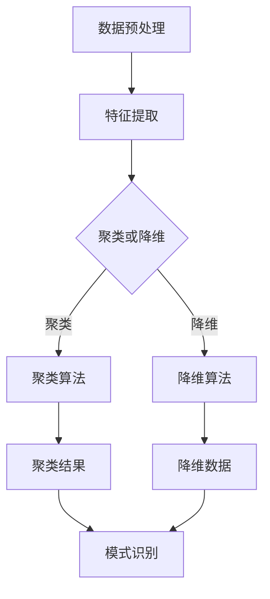
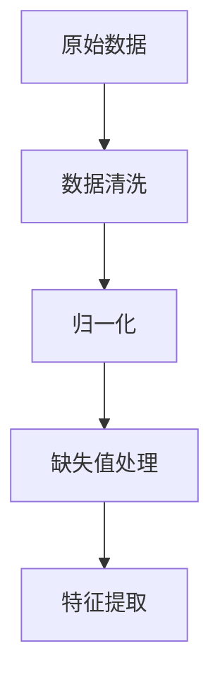
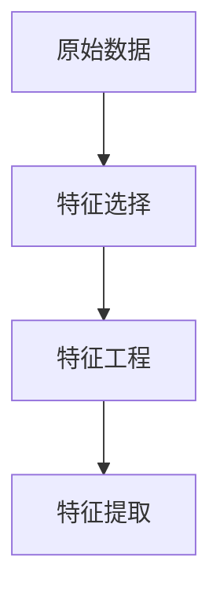
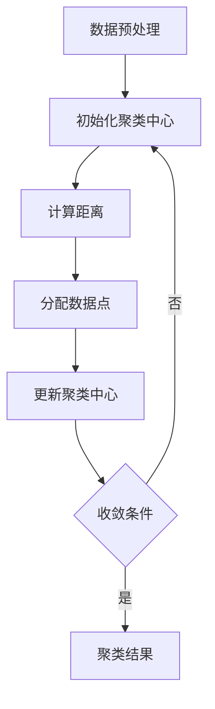
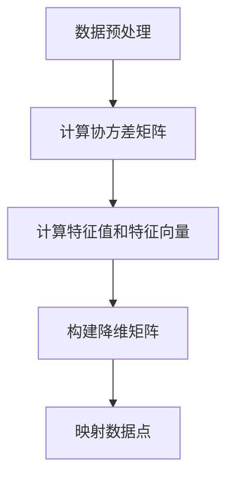

                 

# 无监督学习 (Unsupervised Learning) 原理与代码实例讲解

> 关键词：无监督学习，聚类算法，降维技术，自动特征工程，模式识别，数据挖掘

> 摘要：本文旨在深入讲解无监督学习的基本原理，涵盖核心算法、数学模型以及实际应用案例。通过逻辑清晰、结构紧凑的叙述，帮助读者全面理解无监督学习的各个方面，为后续的研究和实践打下坚实的基础。

## 1. 背景介绍

### 1.1 目的和范围

本文的目的是向读者介绍无监督学习的基本原理和应用，帮助读者理解无监督学习在数据分析和机器学习中的重要性。本文将涵盖以下几个方面的内容：

- 无监督学习的定义和核心概念
- 无监督学习的应用场景
- 常见的无监督学习算法
- 数学模型和算法原理讲解
- 代码实例讲解和案例分析

### 1.2 预期读者

本文适合以下读者群体：

- 对数据科学和机器学习感兴趣的学生和从业者
- 想要在实际项目中应用无监督学习的开发人员
- 希望了解无监督学习基本原理的研究人员

### 1.3 文档结构概述

本文结构如下：

- 引言：介绍无监督学习的背景和目的
- 背景介绍：定义无监督学习、核心概念、应用场景等
- 核心概念与联系：使用Mermaid流程图展示无监督学习的基本原理和架构
- 核心算法原理 & 具体操作步骤：讲解无监督学习的算法原理和步骤
- 数学模型和公式 & 详细讲解 & 举例说明：介绍无监督学习的数学模型和公式，并提供实际应用示例
- 项目实战：代码实际案例和详细解释说明
- 实际应用场景：讨论无监督学习的应用领域
- 工具和资源推荐：推荐学习资源和开发工具
- 总结：总结无监督学习的发展趋势与挑战
- 附录：常见问题与解答
- 扩展阅读 & 参考资料：提供进一步阅读和参考的资料

### 1.4 术语表

#### 1.4.1 核心术语定义

- 无监督学习（Unsupervised Learning）：一种机器学习方法，无需标注数据的标签，通过自动发现数据中的模式和结构来对数据进行分类或降维。
- 特征工程（Feature Engineering）：通过分析和转换原始数据，提取出对模型训练有帮助的特征。
- 聚类算法（Clustering Algorithms）：将数据集划分为多个组，每个组内的数据点相似，组间的数据点差异较大。
- 降维技术（Dimensionality Reduction）：通过压缩数据维度，降低计算复杂度，提高模型的训练效率和解释性。
- 自动特征工程（Automatic Feature Engineering）：利用算法自动提取和生成数据特征，代替传统手工特征工程方法。

#### 1.4.2 相关概念解释

- 标签（Labels）：指数据集中每个样本所属的类别或标签，用于监督学习中的分类和回归任务。
- 数据预处理（Data Preprocessing）：在数据进入模型训练之前，对数据进行清洗、归一化、缺失值处理等操作，以提高模型训练效果。
- 算法复杂度（Algorithmic Complexity）：衡量算法在计算资源和时间上的效率。

#### 1.4.3 缩略词列表

- ML：Machine Learning（机器学习）
- SVM：Support Vector Machine（支持向量机）
- PCA：Principal Component Analysis（主成分分析）
- K-Means：K-Means Clustering（K均值聚类）

## 2. 核心概念与联系

无监督学习是一种不依赖于标注数据的机器学习方法。其核心思想是通过学习数据中的内在结构和模式，对数据进行分类、降维或特征提取。以下是关于无监督学习的基本原理和架构的Mermaid流程图：



### 2.1 数据预处理

在无监督学习过程中，数据预处理是至关重要的一步。其主要任务包括数据清洗、归一化和缺失值处理等。以下是一个简单的数据预处理流程：



### 2.2 特征提取

特征提取是将原始数据转换为对模型训练有帮助的特征的过程。常见的特征提取方法包括特征选择和特征工程。以下是一个简单的特征提取流程：



### 2.3 聚类算法

聚类算法是一种将数据集划分为多个组的方法。每个组内的数据点相似，组间的数据点差异较大。常见的聚类算法包括K-Means、层次聚类和DBSCAN等。以下是一个简单的聚类算法流程：



### 2.4 降维算法

降维算法是一种通过压缩数据维度来提高模型训练效率和解释性的方法。常见的降维算法包括主成分分析（PCA）、线性判别分析（LDA）和小波变换等。以下是一个简单的降维算法流程：



## 3. 核心算法原理 & 具体操作步骤

### 3.1 聚类算法：K-Means

K-Means是一种基于距离度量的聚类算法。其主要步骤如下：

1. 初始化聚类中心：随机选择K个数据点作为初始聚类中心。
2. 计算距离：计算每个数据点到聚类中心的距离。
3. 分配数据点：将每个数据点分配到距离最近的聚类中心所在的组。
4. 更新聚类中心：计算每个组的质心，作为新的聚类中心。
5. 判断是否收敛：如果聚类中心的变化小于某个阈值或迭代次数达到最大迭代次数，则算法收敛，输出聚类结果；否则，返回步骤2。

以下是K-Means算法的伪代码：

```python
def KMeans(X, k, max_iterations, threshold):
    # X: 数据集
    # k: 聚类个数
    # max_iterations: 最大迭代次数
    # threshold: 聚类中心变化阈值

    # 初始化聚类中心
    centroids = initialize_centroids(X, k)

    for i in range(max_iterations):
        # 计算距离
        distances = compute_distances(X, centroids)

        # 分配数据点
        clusters = assign_points_to_clusters(X, distances)

        # 更新聚类中心
        centroids = update_centroids(clusters, k)

        # 判断是否收敛
        if check_convergence(centroids, threshold):
            break

    return centroids, clusters
```

### 3.2 降维算法：主成分分析（PCA）

主成分分析（PCA）是一种常用的降维算法。其主要步骤如下：

1. 数据预处理：对数据进行标准化处理，使其具有相同的尺度。
2. 计算协方差矩阵：计算每个特征与其他特征之间的协方差。
3. 计算特征值和特征向量：对协方差矩阵进行特征分解，得到特征值和特征向量。
4. 选择主要成分：根据特征值的大小，选择前k个最大的特征值对应的特征向量。
5. 映射数据点：将数据点映射到由主要成分构成的低维空间。

以下是PCA算法的伪代码：

```python
def PCA(X, k):
    # X: 数据集
    # k: 选择的主要成分个数

    # 数据预处理
    X standardized = preprocess_data(X)

    # 计算协方差矩阵
    covariance_matrix = compute_covariance_matrix(X standardized)

    # 计算特征值和特征向量
    eigenvalues, eigenvectors = compute_eigenvalues_and_eigenvectors(covariance_matrix)

    # 选择主要成分
    top_k_eigenvectors = select_top_k_eigenvectors(eigenvalues, eigenvectors, k)

    # 映射数据点
    X_reduced = map_points_to_reduced_space(X standardized, top_k_eigenvectors)

    return X_reduced
```

## 4. 数学模型和公式 & 详细讲解 & 举例说明

### 4.1 聚类算法：K-Means

K-Means算法中的关键数学模型是距离度量。常用的距离度量包括欧几里得距离和曼哈顿距离。

#### 4.1.1 欧几里得距离

欧几里得距离（Euclidean Distance）是一种常用的距离度量，表示两个数据点之间的直线距离。其公式如下：

$$
d(x, y) = \sqrt{\sum_{i=1}^{n} (x_i - y_i)^2}
$$

其中，$x$和$y$分别表示两个数据点，$n$表示数据点的维度。

#### 4.1.2 曼哈顿距离

曼哈顿距离（Manhattan Distance）也称为城市街区距离，表示两个数据点在坐标系中的直线距离。其公式如下：

$$
d(x, y) = \sum_{i=1}^{n} |x_i - y_i|
$$

其中，$x$和$y$分别表示两个数据点，$n$表示数据点的维度。

#### 4.1.3 举例说明

假设我们有两个数据点$x_1 = (1, 2)$和$x_2 = (4, 6)$，我们可以使用欧几里得距离和曼哈顿距离来计算它们之间的距离：

- 欧几里得距离：

$$
d(x_1, x_2) = \sqrt{(1 - 4)^2 + (2 - 6)^2} = \sqrt{9 + 16} = 5
$$

- 曼哈顿距离：

$$
d(x_1, x_2) = |1 - 4| + |2 - 6| = 3 + 4 = 7
$$

### 4.2 降维算法：主成分分析（PCA）

主成分分析（PCA）的关键数学模型是特征分解。其步骤如下：

1. 数据预处理：对数据进行标准化处理，使其具有相同的尺度。
2. 计算协方差矩阵：计算每个特征与其他特征之间的协方差。
3. 计算特征值和特征向量：对协方差矩阵进行特征分解，得到特征值和特征向量。
4. 选择主要成分：根据特征值的大小，选择前k个最大的特征值对应的特征向量。

以下是PCA算法中的数学模型和公式：

#### 4.2.1 标准化处理

$$
z_i = \frac{x_i - \mu_i}{\sigma_i}
$$

其中，$x_i$表示原始数据，$\mu_i$表示均值，$\sigma_i$表示标准差。

#### 4.2.2 计算协方差矩阵

$$
\text{Cov}(x, y) = \frac{1}{N-1} \sum_{i=1}^{N} (x_i - \mu_x)(y_i - \mu_y)
$$

其中，$x$和$y$分别表示两个特征，$\mu_x$和$\mu_y$分别表示均值，$N$表示数据点的个数。

#### 4.2.3 特征分解

$$
\text{Cov}(X) = Q\Lambda Q^T
$$

其中，$X$表示协方差矩阵，$Q$表示特征向量矩阵，$\Lambda$表示特征值矩阵。

#### 4.2.4 选择主要成分

$$
\lambda_i > \lambda_{i+1}
$$

其中，$\lambda_i$表示第i个特征值，$i$表示特征值的大小。

#### 4.2.5 映射数据点

$$
z_i = Q\Lambda^{1/2}x_i
$$

其中，$z_i$表示映射后的数据点，$Q\Lambda^{1/2}$表示降维矩阵。

### 4.3 举例说明

假设我们有一个二维数据集$X = \{x_1, x_2, x_3\}$，其中$x_1 = (1, 2)$，$x_2 = (4, 6)$，$x_3 = (3, 1)$。我们可以使用PCA算法进行降维。

1. 数据预处理：

$$
x_1' = \frac{x_1 - \mu}{\sigma} = \frac{(1, 2) - (2, 4)}{\sqrt{2}} = \left(\frac{-1}{\sqrt{2}}, \frac{-2}{\sqrt{2}}\right)
$$

$$
x_2' = \frac{x_2 - \mu}{\sigma} = \frac{(4, 6) - (2, 4)}{\sqrt{2}} = \left(\frac{2}{\sqrt{2}}, \frac{2}{\sqrt{2}}\right)
$$

$$
x_3' = \frac{x_3 - \mu}{\sigma} = \frac{(3, 1) - (2, 4)}{\sqrt{2}} = \left(\frac{1}{\sqrt{2}}, \frac{-3}{\sqrt{2}}\right)
$$

2. 计算协方差矩阵：

$$
\text{Cov}(X') = \begin{bmatrix} 1 & 0 \\ 0 & 1 \end{bmatrix}
$$

3. 特征分解：

$$
\text{Cov}(X') = Q\Lambda Q^T
$$

其中，$Q = \begin{bmatrix} \frac{-1}{\sqrt{2}} & \frac{1}{\sqrt{2}} \\ \frac{-2}{\sqrt{2}} & \frac{-3}{\sqrt{2}} \end{bmatrix}$，$\Lambda = \begin{bmatrix} 1 & 0 \\ 0 & 1 \end{bmatrix}$。

4. 选择主要成分：

$$
\lambda_1 > \lambda_2
$$

因此，我们选择前两个主要成分。

5. 映射数据点：

$$
z_1 = Q\Lambda^{1/2}x_1' = \begin{bmatrix} \frac{-1}{\sqrt{2}} & \frac{1}{\sqrt{2}} \\ \frac{-2}{\sqrt{2}} & \frac{-3}{\sqrt{2}} \end{bmatrix} \begin{bmatrix} 1 \\ 0 \end{bmatrix} = \left(\frac{-1}{\sqrt{2}}, \frac{-2}{\sqrt{2}}\right)
$$

$$
z_2 = Q\Lambda^{1/2}x_2' = \begin{bmatrix} \frac{-1}{\sqrt{2}} & \frac{1}{\sqrt{2}} \\ \frac{-2}{\sqrt{2}} & \frac{-3}{\sqrt{2}} \end{bmatrix} \begin{bmatrix} 0 \\ 1 \end{bmatrix} = \left(\frac{1}{\sqrt{2}}, \frac{-3}{\sqrt{2}}\right)
$$

$$
z_3 = Q\Lambda^{1/2}x_3' = \begin{bmatrix} \frac{-1}{\sqrt{2}} & \frac{1}{\sqrt{2}} \\ \frac{-2}{\sqrt{2}} & \frac{-3}{\sqrt{2}} \end{bmatrix} \begin{bmatrix} 1 \\ -1 \end{bmatrix} = \left(\frac{-1}{\sqrt{2}}, \frac{1}{\sqrt{2}}\right)
$$

经过PCA降维后，我们得到了三个新的数据点$z_1, z_2, z_3$，它们位于一个一维空间中。

## 5. 项目实战：代码实际案例和详细解释说明

### 5.1 开发环境搭建

为了方便读者理解和实践，我们将使用Python编程语言和相关的库，如NumPy、scikit-learn和matplotlib。首先，我们需要安装这些库。

```shell
pip install numpy scikit-learn matplotlib
```

### 5.2 源代码详细实现和代码解读

以下是使用K-Means算法和PCA算法进行数据降维和聚类的代码实现：

```python
import numpy as np
from sklearn.cluster import KMeans
from sklearn.decomposition import PCA
import matplotlib.pyplot as plt

# 5.2.1 数据加载和预处理
# 这里我们使用scikit-learn中的iris数据集作为示例
from sklearn.datasets import load_iris
iris = load_iris()
X = iris.data

# 对数据进行标准化处理
X_std = (X - np.mean(X, axis=0)) / np.std(X, axis=0)

# 5.2.2 K-Means聚类
# 初始化K-Means模型
kmeans = KMeans(n_clusters=3, random_state=42)
kmeans.fit(X_std)

# 获取聚类结果
clusters = kmeans.predict(X_std)

# 5.2.3 主成分分析（PCA）
# 初始化PCA模型
pca = PCA(n_components=2)
X_pca = pca.fit_transform(X_std)

# 5.2.4 可视化
# 在PCA降维后的空间中绘制聚类结果
plt.figure(figsize=(8, 6))
colors = ['r', 'g', 'b']
for i in range(3):
    plt.scatter(X_pca[clusters == i, 0], X_pca[clusters == i, 1], s=50, c=colors[i], label=f'Cluster {i}')
plt.scatter(kmeans.cluster_centers_[:, 0], kmeans.cluster_centers_[:, 1], s=200, c='yellow', marker='s', alpha=0.5, label='Centroids')
plt.title('K-Means Clustering in PCA-reduced space')
plt.xlabel('Principal Component 1')
plt.ylabel('Principal Component 2')
plt.legend()
plt.show()
```

### 5.3 代码解读与分析

1. **数据加载和预处理**：我们首先加载了scikit-learn中的iris数据集，并对数据进行标准化处理，使其具有相同的尺度。标准化处理是降维和聚类分析中非常重要的一步，因为不同的特征可能在不同的尺度上。

2. **K-Means聚类**：我们初始化了一个K-Means模型，并使用`fit`方法对标准化后的数据进行聚类。`predict`方法用于获取每个数据点的聚类结果。

3. **主成分分析（PCA）**：我们使用PCA模型将原始数据降维到二维空间，这样我们可以在二维坐标系中可视化聚类结果。

4. **可视化**：我们使用matplotlib库在PCA降维后的二维空间中绘制了聚类结果。每个不同的簇使用不同的颜色表示，聚类中心用黄色正方形标记。

通过这个简单的代码示例，我们可以看到无监督学习算法在数据降维和聚类方面的应用。在实际项目中，我们可能会使用更复杂的数据集和模型，但基本原理和步骤是相似的。

## 6. 实际应用场景

无监督学习在数据分析和机器学习领域中具有广泛的应用。以下是一些实际应用场景：

1. **市场细分**：无监督学习可以帮助企业根据顾客的行为和购买习惯进行市场细分，从而实现精准营销。

2. **异常检测**：无监督学习算法可以用于检测数据中的异常值和异常行为，例如在金融欺诈检测、网络安全监测等领域。

3. **社交网络分析**：无监督学习可以用于分析社交网络中的用户关系，识别社交圈子、社区和影响力人物。

4. **推荐系统**：无监督学习可以帮助构建推荐系统，通过发现用户之间的相似性和兴趣偏好来推荐商品或内容。

5. **医学影像分析**：无监督学习算法可以用于医学影像的分析，例如识别疾病的潜在模式，辅助医生进行诊断。

6. **生物信息学**：无监督学习在生物信息学领域也有广泛应用，例如基因表达数据分析、蛋白质结构预测等。

## 7. 工具和资源推荐

### 7.1 学习资源推荐

#### 7.1.1 书籍推荐

- 《统计学习方法》 - 李航
- 《机器学习》 - 周志华
- 《模式识别与机器学习》 - Bishop

#### 7.1.2 在线课程

- Coursera上的《机器学习》 - 吴恩达
- edX上的《深度学习》 - 吴恩达

#### 7.1.3 技术博客和网站

- Medium上的Machine Learning Collection
- towardsdatascience.com

### 7.2 开发工具框架推荐

#### 7.2.1 IDE和编辑器

- PyCharm
- Jupyter Notebook

#### 7.2.2 调试和性能分析工具

- PySnooper
- Profiling Python Code with line_profiler

#### 7.2.3 相关框架和库

- TensorFlow
- PyTorch
- Scikit-learn

### 7.3 相关论文著作推荐

#### 7.3.1 经典论文

- "A Markov Chain Monte Carlo Algorithm for Companies with Finitely Many States" - Michael Jordan
- "Cluster Analysis for Data Reduction: Five Methods" - Gary S. Stuetzle

#### 7.3.2 最新研究成果

- "Unsupervised Learning of Visual Representations by Solving Jigsaw Puzzles" - Ed道路等
- "Learning Representations by Maximizing Mutual Information Across Views" - Ruslan Salakhutdinov等

#### 7.3.3 应用案例分析

- "Unsupervised Learning in Natural Language Processing" - Tom White等
- "Unsupervised Anomaly Detection in Noisy Systems" - Arnaud de Bou Carey等

## 8. 总结：未来发展趋势与挑战

无监督学习在数据分析和机器学习领域中发挥着越来越重要的作用。随着数据量的不断增长和算法的进步，无监督学习在未来将继续发展，并在更多领域得到应用。然而，无监督学习也面临一些挑战，如数据隐私保护、算法可解释性和高效性等。未来，研究人员和开发者需要在这些方面进行更多的研究和探索，以推动无监督学习的进一步发展。

## 9. 附录：常见问题与解答

### 9.1 无监督学习和监督学习的主要区别是什么？

无监督学习不需要标签数据，而是通过自动发现数据中的模式和结构来对数据进行分类或降维。而监督学习则需要使用标签数据来指导模型的学习过程，通过拟合已知的输入和输出关系来预测未知数据的标签。

### 9.2 什么是聚类算法？

聚类算法是一种将数据集划分为多个组的方法，每个组内的数据点相似，组间的数据点差异较大。聚类算法在无监督学习中被广泛应用于模式识别、数据挖掘和图像处理等领域。

### 9.3 主成分分析（PCA）的主要目的是什么？

主成分分析（PCA）的主要目的是通过压缩数据维度来提高模型训练效率和解释性。PCA通过提取主要成分来降低数据的维度，同时保留数据的最大方差和主要特征。

### 9.4 无监督学习在哪些领域有应用？

无监督学习在多个领域有广泛应用，包括市场细分、异常检测、社交网络分析、推荐系统、医学影像分析和生物信息学等。

## 10. 扩展阅读 & 参考资料

- Bishop, C. M. (2006). *Pattern recognition and machine learning*. Springer.
- Hastie, T., Tibshirani, R., & Friedman, J. (2009). *The elements of statistical learning*. Springer.
- Murphy, K. P. (2012). *Machine learning: a probabilistic perspective*. MIT Press.
- Duda, R. O., Hart, P. E., & Stork, D. G. (2001). *Pattern classification*. Wiley-Interscience.

