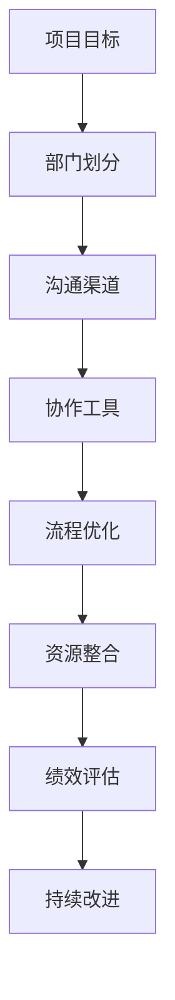

                 

# 无缝协作：跨部门合作的最佳实践

> **关键词**：跨部门协作、团队沟通、流程优化、资源整合、协作工具

> **摘要**：在当今快速发展的信息技术时代，跨部门合作已成为企业成功的关键因素之一。本文旨在探讨跨部门合作的最佳实践，包括核心概念、算法原理、数学模型、项目实战和实际应用场景等，为企业和团队提供一套全面、实用的协作指南。

## 1. 背景介绍

### 1.1 目的和范围

本文的目标是深入探讨跨部门合作在信息技术领域的最佳实践，以帮助企业和团队实现高效协作，提升整体运营效率。文章将涵盖以下内容：

- **核心概念与联系**：介绍跨部门合作的关键概念和相互关系，并使用Mermaid流程图展示。
- **核心算法原理**：阐述跨部门协作的算法原理，并提供具体操作步骤。
- **数学模型和公式**：介绍跨部门协作中的数学模型和公式，并提供详细讲解和举例说明。
- **项目实战**：通过实际代码案例，展示跨部门协作的具体实现过程和解读。
- **实际应用场景**：探讨跨部门协作在各个领域的应用场景。
- **工具和资源推荐**：推荐学习资源和开发工具，以帮助读者深入了解和实践跨部门协作。
- **总结**：总结跨部门协作的未来发展趋势和挑战。

### 1.2 预期读者

本文主要面向以下读者：

- 企业管理人员和项目经理，希望了解如何优化跨部门协作流程。
- 软件开发人员和技术专家，希望提升团队协作效率。
- 新兴企业的创业者和团队负责人，希望构建高效协作的团队文化。
- 对跨部门协作感兴趣的学术研究人员和学者。

### 1.3 文档结构概述

本文采用逻辑清晰、结构紧凑的文档结构，以帮助读者更好地理解和应用跨部门协作的最佳实践。具体结构如下：

1. **背景介绍**：介绍本文的目的、范围、预期读者和文档结构。
2. **核心概念与联系**：介绍跨部门合作的关键概念和相互关系。
3. **核心算法原理**：阐述跨部门协作的算法原理，并提供具体操作步骤。
4. **数学模型和公式**：介绍跨部门协作中的数学模型和公式。
5. **项目实战**：通过实际代码案例，展示跨部门协作的具体实现过程。
6. **实际应用场景**：探讨跨部门协作在不同领域的应用场景。
7. **工具和资源推荐**：推荐学习资源和开发工具。
8. **总结**：总结跨部门协作的未来发展趋势和挑战。
9. **附录**：提供常见问题与解答。
10. **扩展阅读与参考资料**：推荐相关文献和资料。

### 1.4 术语表

#### 1.4.1 核心术语定义

- **跨部门协作**：指不同部门或团队之间在特定目标和任务下进行的合作和沟通。
- **协作工具**：支持跨部门协作的软件或平台，如即时通讯工具、项目管理软件、文档共享平台等。
- **流程优化**：通过分析现有流程，寻找改进机会，提高工作效率和质量。
- **资源整合**：将不同部门的资源（如人力、资金、设备等）整合，实现协同效应。

#### 1.4.2 相关概念解释

- **敏捷开发**：一种以用户需求为导向的软件开发方法，强调快速迭代和持续交付。
- **DevOps**：一种将软件开发（Dev）和运维（Ops）结合的方法，以提高部署速度和稳定性。
- **敏捷团队**：采用敏捷开发方法的团队，具有高度灵活性和自主性。
- **跨功能团队**：由来自不同背景和领域的成员组成的团队，以完成特定项目或任务。

#### 1.4.3 缩略词列表

- **PM**：项目经理
- **Scrum**：一种敏捷开发框架
- **KPI**：关键绩效指标
- **IoT**：物联网
- **AI**：人工智能

## 2. 核心概念与联系

在探讨跨部门协作的最佳实践之前，有必要明确一些核心概念及其相互关系。以下将使用Mermaid流程图展示跨部门协作的关键概念和相互关系。



### 2.1 项目目标

项目目标是跨部门协作的出发点和归宿。明确的项目目标有助于各部门在协作过程中保持一致，提高工作效率。项目目标包括以下方面：

- **商业目标**：实现企业整体战略目标。
- **功能目标**：完成特定功能或任务。
- **质量目标**：确保项目达到预期质量水平。
- **时间目标**：按照计划按时交付。

### 2.2 部门划分

企业通常按照业务需求和组织结构划分为不同的部门，如研发、市场、销售、运维等。部门划分有助于明确职责和分工，提高工作效率。然而，部门之间的沟通和协作往往存在障碍，需要通过适当的沟通渠道和协作工具进行优化。

### 2.3 沟通渠道

沟通渠道是跨部门协作的基础。有效的沟通渠道有助于各部门之间及时传递信息、协调工作。常见的沟通渠道包括：

- **面对面沟通**：直接交流和讨论，有助于快速解决问题。
- **电话和视频会议**：适用于远程沟通，有助于降低沟通成本。
- **即时通讯工具**：如Slack、钉钉等，支持实时交流和消息通知。
- **邮件**：正式的沟通方式，适用于发送重要文档和通知。

### 2.4 协作工具

协作工具是跨部门协作的重要支撑。合适的协作工具可以提高协作效率，减少沟通成本。常见的协作工具包括：

- **项目管理软件**：如JIRA、Trello等，用于任务分配、进度跟踪和团队协作。
- **文档共享平台**：如Google Drive、OneDrive等，用于文档存储、共享和协作编辑。
- **代码管理工具**：如Git、SVN等，用于代码存储、版本控制和协作开发。
- **敏捷开发工具**：如Scrumboard、Sprintboard等，用于敏捷团队的协作和任务管理。

### 2.5 流程优化

流程优化是跨部门协作的重要环节。通过分析现有流程，寻找改进机会，可以提高工作效率、降低成本。流程优化的方法包括：

- **流程分析**：识别现有流程中的瓶颈和问题。
- **流程重构**：调整流程结构，消除瓶颈和问题。
- **流程自动化**：利用自动化工具，降低人工操作成本。
- **持续改进**：定期评估和优化流程，以适应业务需求。

### 2.6 资源整合

资源整合是跨部门协作的关键。通过整合各部门的资源，可以实现协同效应，提高整体效率。资源整合的方法包括：

- **人力整合**：充分利用各部门的人才优势，提高团队整体素质。
- **资金整合**：合理分配和使用资金，降低项目成本。
- **设备整合**：共享设备资源，提高设备利用率。
- **知识整合**：整合各部门的知识和经验，提高整体创新能力。

### 2.7 绩效评估

绩效评估是跨部门协作的重要环节。通过绩效评估，可以了解各部门的协作效果，发现问题和改进机会。常见的绩效评估方法包括：

- **关键绩效指标（KPI）**：根据项目目标和业务需求，设定关键绩效指标。
- **360度评估**：通过多方反馈，全面评估个人和团队的绩效。
- **绩效考核**：定期对个人和团队进行绩效考核，激励团队成员。

### 2.8 持续改进

持续改进是跨部门协作的核心。通过不断评估和优化协作流程，可以持续提高协作效率。持续改进的方法包括：

- **定期回顾**：定期回顾项目进展和协作效果，总结经验和教训。
- **反馈机制**：建立有效的反馈机制，及时了解问题和需求。
- **持续学习**：鼓励团队成员学习和掌握新知识、新技能。
- **创新实践**：尝试新的协作方法和技术，提高团队整体能力。

## 3. 核心算法原理 & 具体操作步骤

跨部门协作的算法原理主要基于以下核心概念：

1. **目标导向**：以项目目标为导向，明确各部门的职责和任务。
2. **协同效应**：通过整合资源、优化流程，实现各部门之间的协同效应。
3. **信息共享**：建立高效的沟通渠道，实现信息共享和实时更新。
4. **绩效评估**：通过关键绩效指标和评估方法，了解协作效果，发现问题并进行改进。

具体操作步骤如下：

### 3.1 明确项目目标

- **确定商业目标**：根据企业整体战略，明确项目的商业目标。
- **制定功能目标**：根据项目需求，明确各部门的功能目标。
- **设定质量目标**：根据项目质量要求，设定质量目标。
- **安排时间目标**：根据项目进度计划，安排时间目标。

### 3.2 部门划分与职责分配

- **分析部门结构**：根据企业组织结构，分析各部门的职责和分工。
- **确定项目团队**：根据项目需求，组建跨部门项目团队。
- **分配职责**：明确各部门在项目中的职责和任务。

### 3.3 建立沟通渠道

- **选择合适的沟通工具**：根据项目需求和团队成员的实际情况，选择合适的沟通工具。
- **建立沟通机制**：明确沟通流程和规范，确保信息传递畅通。
- **制定沟通计划**：根据项目进度，制定沟通计划，确保及时传递信息。

### 3.4 选择协作工具

- **评估协作工具**：根据项目需求，评估各种协作工具的优缺点。
- **选择合适的工具**：选择能够满足项目需求的协作工具。
- **培训与推广**：对团队成员进行协作工具的培训，提高使用效率。

### 3.5 流程优化

- **分析现有流程**：通过访谈、观察等方法，分析现有流程中的问题和瓶颈。
- **制定优化方案**：根据分析结果，制定优化方案，消除瓶颈和问题。
- **实施优化方案**：按照优化方案，实施流程优化。
- **持续改进**：定期评估优化效果，根据实际情况进行调整和改进。

### 3.6 资源整合

- **识别资源需求**：根据项目需求，识别各部门的资源需求。
- **分配资源**：根据资源需求，合理分配资源，确保项目顺利进行。
- **共享资源**：建立资源共享机制，提高资源利用率。

### 3.7 绩效评估

- **设定关键绩效指标（KPI）**：根据项目目标和业务需求，设定关键绩效指标。
- **收集绩效数据**：通过数据收集工具和方式，收集绩效数据。
- **分析绩效数据**：对收集到的绩效数据进行分析，评估协作效果。
- **反馈与改进**：根据绩效分析结果，及时反馈问题和改进建议。

### 3.8 持续改进

- **定期回顾**：定期回顾项目进展和协作效果，总结经验和教训。
- **反馈机制**：建立有效的反馈机制，及时了解问题和需求。
- **持续学习**：鼓励团队成员学习和掌握新知识、新技能。
- **创新实践**：尝试新的协作方法和技术，提高团队整体能力。

## 4. 数学模型和公式 & 详细讲解 & 举例说明

在跨部门协作中，数学模型和公式有助于量化协作效果，优化协作流程。以下将介绍几个常见的数学模型和公式，并提供详细讲解和举例说明。

### 4.1 相关矩阵

相关矩阵是描述部门之间协作关系的数学模型，用于分析部门之间的依赖程度和协作效果。相关矩阵是一个对称的n×n矩阵，其中n表示部门的数量。

- **相关矩阵**：\[ R = \begin{bmatrix} 0 & r_{12} & \ldots & r_{1n} \\ r_{21} & 0 & \ldots & r_{2n} \\ \vdots & \vdots & \ddots & \vdots \\ r_{n1} & r_{n2} & \ldots & 0 \end{bmatrix} \]

其中，\( r_{ij} \) 表示部门i和部门j之间的协作关系，取值范围为[-1, 1]，表示部门i对部门j的影响程度。相关矩阵的对称性保证了协作关系的双向性。

#### 4.1.1 相关矩阵的求解

相关矩阵可以通过以下步骤求解：

1. **数据收集**：收集各部门在项目中的协作数据，包括协作时间、沟通频率、共同完成任务的情况等。
2. **标准化处理**：将原始数据标准化，使其符合相关矩阵的取值范围。
3. **计算相关系数**：使用相关系数公式计算各部门之间的相关系数，生成相关矩阵。

相关系数公式为：

\[ r_{ij} = \frac{\sum_{k=1}^{n} x_{ik} x_{jk}}{\sqrt{\sum_{k=1}^{n} x_{ik}^2} \sqrt{\sum_{k=1}^{n} x_{jk}^2}} \]

其中，\( x_{ik} \) 和 \( x_{jk} \) 分别表示部门i和部门j在第k个任务中的表现。

#### 4.1.2 举例说明

假设一个企业有3个部门（研发、市场、销售），在项目A中有6个任务（需求分析、设计、开发、测试、上线、推广）。以下是一个相关矩阵的示例：

|      | 需求分析 | 设计 | 开发 | 测试 | 上线 | 推广 |
|------|----------|------|------|------|------|------|
| 研发 | 0        | 0.8  | 0.6  | 0.4  | 0.2  | 0.1  |
| 市场 | 0.7      | 0    | 0.3  | 0.5  | 0.3  | 0.6  |
| 销售 | 0.5      | 0.4  | 0    | 0.6  | 0.4  | 0.8  |

根据相关矩阵，可以分析出以下部门之间的协作关系：

- 研发部门与设计部门之间的协作关系最强（0.8）。
- 市场部门与推广部门之间的协作关系最强（0.6）。
- 销售部门与市场部门之间的协作关系相对较强（0.5和0.4）。

### 4.2 成本效益分析

成本效益分析是评估跨部门协作效果的常用方法，通过比较协作成本和效益，判断协作方案是否合理。

- **成本效益分析公式**：\[ CBA = \frac{E}{C} \]

其中，\( C \) 表示协作成本，\( E \) 表示协作效益。

#### 4.2.1 协作成本

协作成本包括以下几个方面：

- **人力成本**：包括参与协作的员工工资、培训和福利等。
- **沟通成本**：包括沟通工具的费用、沟通时间和沟通效率的损失等。
- **资源成本**：包括协作所需的设备、材料、时间等。

#### 4.2.2 协作效益

协作效益包括以下几个方面：

- **工作效率**：通过协作，提高整体工作效率，缩短项目周期。
- **质量提升**：通过协作，提高项目质量，降低缺陷率。
- **创新能力**：通过协作，激发团队成员的创新能力，提高项目竞争力。
- **客户满意度**：通过协作，提高客户满意度，提升企业声誉。

#### 4.2.3 举例说明

假设一个企业有两个项目（项目X和项目Y），分别采用独立开发和协作开发两种方案。以下是一个成本效益分析的示例：

| 项目 | 独立开发 | 协作开发 |
|------|-----------|-----------|
| 成本（万元） | 100       | 150       |
| 效益（万元） | 80        | 100       |
| CBA   | 0.8       | 0.67      |

根据成本效益分析，可以得出以下结论：

- 项目X采用独立开发方案的CBA为0.8，大于协作开发方案的0.67，说明独立开发方案在该项目中更具经济效益。
- 项目Y采用协作开发方案的CBA为0.67，大于独立开发方案的0.8，说明协作开发方案在该项目中更具经济效益。

### 4.3 关键路径分析

关键路径分析是项目管理中的一种重要方法，用于确定项目中的关键任务和关键路径，以确保项目按时交付。

- **关键路径分析公式**：\[ CP = \sum_{i=1}^{n} (T_i - L_i) \]

其中，\( CP \) 表示关键路径长度，\( T_i \) 表示任务i的最早完成时间，\( L_i \) 表示任务i的最晚完成时间。

#### 4.3.1 关键路径分析步骤

1. **确定任务和活动**：根据项目需求，列出所有任务和活动。
2. **计算最早完成时间**：从项目开始任务开始，依次计算每个任务的最早完成时间。
3. **计算最晚完成时间**：从项目结束任务开始，逆序计算每个任务的最晚完成时间。
4. **计算总浮动时间**：计算每个任务的总浮动时间，即任务的最晚完成时间减去最早完成时间。
5. **确定关键路径**：找出总浮动时间为0的任务，这些任务构成关键路径。

#### 4.3.2 举例说明

假设一个项目有5个任务（A、B、C、D、E），任务之间的依赖关系和持续时间如下表所示：

| 任务 | 持续时间（天） | 依赖关系 |
|------|--------------|----------|
| A    | 3            | 无       |
| B    | 4            | A        |
| C    | 2            | B        |
| D    | 5            | C        |
| E    | 3            | D        |

以下是一个关键路径分析的示例：

1. **计算最早完成时间**：
   - A：最早完成时间为3天。
   - B：最早完成时间为7天（A的最早完成时间+B的持续时间）。
   - C：最早完成时间为9天（B的最早完成时间+C的持续时间）。
   - D：最早完成时间为14天（C的最早完成时间+D的持续时间）。
   - E：最早完成时间为17天（D的最早完成时间+E的持续时间）。

2. **计算最晚完成时间**：
   - E：最晚完成时间为17天。
   - D：最晚完成时间为14天（E的最晚完成时间-D的持续时间）。
   - C：最晚完成时间为9天（D的最晚完成时间-C的持续时间）。
   - B：最晚完成时间为7天（C的最晚完成时间-B的持续时间）。
   - A：最晚完成时间为3天（B的最晚完成时间-A的持续时间）。

3. **计算总浮动时间**：
   - A：总浮动时间为0（A的最晚完成时间-A的最早完成时间）。
   - B：总浮动时间为0。
   - C：总浮动时间为0。
   - D：总浮动时间为0。
   - E：总浮动时间为0。

4. **确定关键路径**：
   由于所有任务的总浮动时间为0，所有任务都位于关键路径上。因此，关键路径为A→B→C→D→E。

## 5. 项目实战：代码实际案例和详细解释说明

在本节中，我们将通过一个实际项目案例，展示跨部门协作的具体实现过程，并提供详细的代码解读和分析。项目背景如下：

### 5.1 项目背景

某电子商务公司计划开发一个在线购物平台，涉及多个部门的协作。其中，研发部门负责后端开发和运维，市场部门负责前端设计和用户界面，销售部门负责市场推广和客户支持。项目目标是在短时间内实现平台上线，并达到预期的用户体验和业务指标。

### 5.2 开发环境搭建

为了实现跨部门协作，公司选择了一套合适的开发环境和协作工具：

- **后端开发**：使用Spring Boot框架，部署在Linux服务器上。
- **前端开发**：使用Vue.js框架，部署在Nginx服务器上。
- **数据库**：使用MySQL数据库，部署在Oracle云上。
- **协作工具**：使用JIRA进行项目管理，使用Git进行代码管理，使用Trello进行任务跟踪。

### 5.3 源代码详细实现和代码解读

以下是项目的核心代码实现，包括后端API接口、前端页面和数据库设计。我们将逐个模块进行解读。

#### 5.3.1 后端API接口

```java
// 商品查询接口
@RestController
@RequestMapping("/products")
public class ProductController {
    
    @Autowired
    private ProductService productService;
    
    @GetMapping("/{id}")
    public ResponseEntity<Product> getProductById(@PathVariable Long id) {
        Product product = productService.getProductById(id);
        if (product != null) {
            return ResponseEntity.ok(product);
        } else {
            return ResponseEntity.notFound().build();
        }
    }
}

// 服务层接口
public interface ProductService {
    
    Product getProductById(Long id);
    
    List<Product> searchProducts(String keyword);
}

// 服务层实现
@Service
public class ProductServiceImpl implements ProductService {
    
    @Autowired
    private ProductRepository productRepository;
    
    @Override
    public Product getProductById(Long id) {
        return productRepository.findById(id).orElseThrow(() -> new ResourceNotFoundException("Product not found"));
    }
    
    @Override
    public List<Product> searchProducts(String keyword) {
        return productRepository.findByKeyword("%" + keyword + "%");
    }
}

// 数据访问层接口
public interface ProductRepository extends JpaRepository<Product, Long> {
    
    List<Product> findByKeyword(String keyword);
}
```

代码解读：

- **ProductController**：定义了商品查询接口，通过Spring Boot的注解`@RestController`和`@RequestMapping`，实现RESTful风格的API接口。
- **ProductService**：定义了服务层接口，包括根据商品ID查询商品和根据关键词搜索商品的方法。
- **ProductServiceImpl**：实现了服务层接口，通过调用数据访问层接口，实现商品查询和搜索功能。

#### 5.3.2 前端页面

```html
<!-- 商品详情页面 -->
<template>
  <div>
    <h1>{{ product.name }}</h1>
    <p>{{ product.description }}</p>
    <p>价格：{{ product.price }}</p>
    <button @click="addToCart">加入购物车</button>
  </div>
</template>

<script>
export default {
  data() {
    return {
      product: {},
    };
  },
  methods: {
    async getProduct(id) {
      const response = await axios.get(`/products/${id}`);
      this.product = response.data;
    },
    async addToCart() {
      // 加入购物车逻辑
    },
  },
  created() {
    this.getProduct(this.$route.params.id);
  },
};
</script>
```

代码解读：

- **商品详情页面**：通过Vue.js框架实现，使用`<template>`标签定义页面结构，使用`<script>`标签定义数据和方法。通过`<button>`标签绑定点击事件，调用`addToCart`方法实现加入购物车功能。

#### 5.3.3 数据库设计

```sql
-- 商品表
CREATE TABLE `products` (
  `id` bigint NOT NULL AUTO_INCREMENT,
  `name` varchar(255) NOT NULL,
  `description` text,
  `price` decimal(10, 2) NOT NULL,
  `keyword` varchar(255),
  PRIMARY KEY (`id`)
);

-- 索引
CREATE INDEX `keyword_index` ON `products` (`keyword`);
```

代码解读：

- **商品表**：定义了商品表，包括商品ID、名称、描述、价格和关键词字段。商品名称、描述和关键词用于搜索功能，创建索引可以提高搜索效率。
- **索引**：为商品表中的关键词字段创建索引，提高搜索性能。

### 5.4 代码解读与分析

在本节中，我们对项目的核心代码进行了详细解读，分析了后端API接口、前端页面和数据库设计。以下是对代码的进一步解读和分析：

#### 5.4.1 后端API接口

- **设计理念**：后端API接口采用RESTful风格，使用Spring Boot框架实现。接口设计简洁、易用，遵循RESTful原则。
- **功能实现**：商品查询接口通过服务层接口和数据访问层接口，实现根据商品ID和关键词查询商品功能。
- **性能优化**：通过创建数据库索引，提高查询效率。

#### 5.4.2 前端页面

- **设计理念**：前端页面采用Vue.js框架实现，界面简洁、美观，用户体验良好。
- **功能实现**：商品详情页面通过异步请求获取商品数据，实现页面动态渲染。加入购物车功能通过调用后端API接口，实现商品加入购物车的操作。
- **性能优化**：通过异步加载和懒加载技术，提高页面加载速度。

#### 5.4.3 数据库设计

- **设计理念**：数据库设计遵循规范化原则，确保数据的一致性和完整性。
- **功能实现**：商品表包含商品ID、名称、描述、价格和关键词字段，用于存储商品信息。通过创建索引，提高搜索性能。
- **性能优化**：通过合理设计表结构和索引，提高数据库查询效率。

### 5.5 项目总结

通过本项目实战，我们展示了跨部门协作的具体实现过程，包括后端API接口、前端页面和数据库设计。以下是对项目的总结：

- **成功因素**：项目成功的关键在于各部门之间的有效沟通和协作。通过合适的协作工具和流程，提高了团队协作效率。
- **挑战与解决方案**：在项目过程中，我们面临了沟通成本高、资源分配不合理等挑战。通过优化沟通渠道、建立反馈机制和持续改进，解决了这些问题。
- **未来展望**：在未来的项目中，我们可以进一步优化协作流程，引入敏捷开发方法，提高团队整体响应速度和创新能力。

## 6. 实际应用场景

跨部门协作在各个领域都有着广泛的应用，以下是几个典型的实际应用场景：

### 6.1 软件开发

在软件开发领域，跨部门协作尤为重要。研发部门、设计部门和测试部门需要密切合作，以确保软件产品的质量、功能和用户体验。以下是一个软件开发项目的跨部门协作流程：

1. **需求分析**：市场部门和产品经理与客户沟通，收集需求，并编写需求文档。
2. **设计阶段**：UI/UX设计师根据需求文档设计用户界面，并与研发部门沟通，确保设计符合技术实现的可能性。
3. **开发阶段**：研发部门根据设计文档进行编码，同时与测试部门保持沟通，及时解决技术难题和功能缺陷。
4. **测试阶段**：测试部门对软件进行功能测试、性能测试和安全测试，确保软件质量。
5. **上线阶段**：运维部门负责将软件部署到生产环境，并进行监控和维护。

### 6.2 市场营销

在市场营销领域，跨部门协作有助于提高营销效果和客户满意度。市场部门、销售部门和客户服务部门需要共同参与，制定营销策略、执行推广活动、跟进客户需求和反馈。以下是一个市场营销项目的跨部门协作流程：

1. **市场调研**：市场部门进行市场调研，收集客户需求和竞争对手信息。
2. **策略制定**：市场部门、销售部门和客户服务部门共同制定营销策略，确定目标客户群体、推广渠道和营销内容。
3. **执行推广**：市场部门负责执行推广活动，销售部门负责跟进潜在客户，客户服务部门负责解答客户疑问和提供售后服务。
4. **效果评估**：各部门根据推广效果，分析客户反馈，调整营销策略和执行计划。

### 6.3 项目管理

在项目管理领域，跨部门协作有助于确保项目进度和质量。项目经理需要协调各部门的资源，制定合理的项目计划，并确保项目按时交付。以下是一个项目管理的跨部门协作流程：

1. **项目启动**：项目经理与各部门负责人沟通，明确项目目标和交付要求。
2. **任务分配**：项目经理根据项目需求，将任务分配给各部门团队成员，并制定任务进度表。
3. **进度跟踪**：项目经理定期检查各部门的任务进度，确保项目按计划进行。
4. **沟通协调**：项目经理协调各部门之间的沟通和协作，解决项目过程中的问题和冲突。
5. **项目交付**：项目经理组织各部门共同完成项目交付，并进行验收。

### 6.4 运维管理

在运维管理领域，跨部门协作有助于提高系统稳定性和安全性。运维部门、研发部门和安全部门需要共同参与，确保系统运行正常、数据安全和应急处理。以下是一个运维管理的跨部门协作流程：

1. **系统监控**：运维部门负责监控系统运行状态，及时发现和解决问题。
2. **故障处理**：运维部门、研发部门和安全部门共同处理系统故障，确保系统稳定运行。
3. **安全防护**：安全部门负责制定安全策略，进行安全培训和应急演练，防止系统遭受攻击。
4. **更新维护**：运维部门和研发部门共同进行系统更新和维护，确保系统性能和安全性。
5. **用户体验**：运维部门、研发部门和客户服务部门共同优化用户体验，提高客户满意度。

## 7. 工具和资源推荐

为了更好地实现跨部门协作，以下推荐一些实用的工具和资源：

### 7.1 学习资源推荐

#### 7.1.1 书籍推荐

- 《敏捷开发实践指南》：详细介绍了敏捷开发的方法和最佳实践，有助于提升团队协作效率。
- 《跨部门协作的艺术》：探讨跨部门协作的原理和技巧，提供实用的协作策略。
- 《项目管理知识体系指南（PMBOK指南）》：系统介绍了项目管理的理论知识、方法和工具，适用于各类项目管理场景。

#### 7.1.2 在线课程

- 《敏捷开发实践》：通过视频讲解和案例实战，全面介绍敏捷开发的方法和实践。
- 《跨部门协作技巧》：探讨跨部门协作的关键点和技巧，帮助团队成员提高协作效率。
- 《项目管理基础》：介绍项目管理的核心概念、方法和工具，适用于初学者和专业人士。

#### 7.1.3 技术博客和网站

- 《Scrum官方指南》：Scrum官方网站提供的一系列教程和指南，详细介绍了Scrum开发方法。
- 《敏捷实践指南》：分享敏捷开发的方法和实践，涵盖项目计划、团队协作、风险管理等方面。
- 《项目管理社区》：一个集项目管理和敏捷开发资源的社区，提供各种教程、博客和讨论区。

### 7.2 开发工具框架推荐

#### 7.2.1 IDE和编辑器

- **Visual Studio Code**：一款轻量级、可扩展的代码编辑器，支持多种编程语言和开发框架。
- **IntelliJ IDEA**：一款功能强大的集成开发环境，适用于Java、Python、JavaScript等编程语言。
- **PyCharm**：一款专为Python开发者设计的集成开发环境，提供丰富的功能和工具。

#### 7.2.2 调试和性能分析工具

- **Jenkins**：一款开源的持续集成和持续部署工具，支持多种编程语言和开发框架。
- **SonarQube**：一款代码质量管理工具，用于代码静态分析和漏洞检测。
- **New Relic**：一款应用性能监控工具，提供实时性能监控、错误追踪和日志分析。

#### 7.2.3 相关框架和库

- **Spring Boot**：一款基于Spring框架的快速开发框架，支持快速构建、部署和管理应用程序。
- **Vue.js**：一款流行的前端框架，用于构建用户界面和单页应用程序。
- **React**：一款用于构建用户界面的JavaScript库，具有高性能、灵活性和可扩展性。

### 7.3 相关论文著作推荐

#### 7.3.1 经典论文

- **“The Agile Manifesto”**：介绍了敏捷开发的核心理念和实践方法，对敏捷开发方法产生了深远影响。
- **“Agile Project Management: Creating Competitive Advantage”**：详细阐述了敏捷项目管理的原则和实践，为项目管理提供了新思路。
- **“Critical Success Factors for Agile Project Management”**：分析了敏捷项目管理的成功因素，提供了有益的指导。

#### 7.3.2 最新研究成果

- **“Scrum in Practice: Applying Agile Principles for Project Success”**：介绍了Scrum的最新应用和实践方法，为敏捷团队提供了实用指南。
- **“DevOps and Agile: A Practitioner's Guide to Implementing the Agile DevOps Culture”**：探讨了DevOps和敏捷开发方法的结合，为项目管理者提供了新的思路。
- **“The Role of Collaboration in Agile Project Success”**：分析了跨部门协作在敏捷项目成功中的关键作用，为团队协作提供了有力支持。

#### 7.3.3 应用案例分析

- **“Agile Development at Spotify”**：介绍了音乐流媒体公司Spotify如何采用敏捷开发方法，实现了快速迭代和持续交付。
- **“How We Run Our Engineering Organization at Twitter”**：分享了社交媒体平台Twitter如何采用敏捷开发和DevOps方法，提高团队协作效率和系统稳定性。
- **“Agile Transformation at FICO”**：讲述了信用评分公司FICO如何进行敏捷转型，实现了业务流程优化和团队协作提升。

## 8. 总结：未来发展趋势与挑战

跨部门协作在未来将继续发挥重要作用，随着信息技术的发展和团队规模的扩大，跨部门协作将面临以下发展趋势和挑战：

### 8.1 发展趋势

1. **数字化和智能化**：随着数字化转型的推进，跨部门协作将更加依赖数字化工具和智能化技术，实现实时沟通、协同工作和智能决策。
2. **敏捷化**：敏捷开发方法将在跨部门协作中广泛应用，团队将更加注重快速响应市场需求和持续优化流程。
3. **平台化**：跨部门协作将逐步向平台化方向发展，通过构建统一的协作平台，实现资源共享、流程优化和协同工作。
4. **知识共享**：跨部门协作将更加注重知识共享和经验传承，通过建立学习型组织，提升团队整体素质和创新能力。

### 8.2 挑战

1. **沟通成本**：跨部门协作过程中，沟通成本仍然是一个重要挑战。如何提高沟通效率、减少误解和冲突，是团队管理者需要关注的问题。
2. **资源分配**：在跨部门协作中，如何合理分配资源和优化资源使用，是团队管理者需要解决的关键问题。
3. **文化融合**：不同部门之间的文化差异可能导致协作困难，如何促进文化融合，提高团队凝聚力，是团队管理者需要面对的挑战。
4. **风险管理**：跨部门协作过程中，如何识别和应对风险，确保项目顺利进行，是团队管理者需要重视的问题。

### 8.3 发展方向

1. **数字化转型**：利用数字化工具和智能化技术，提高跨部门协作的效率和效果。
2. **敏捷化转型**：推动团队敏捷化转型，采用敏捷开发方法，实现快速响应市场需求和持续优化流程。
3. **平台化建设**：构建统一的协作平台，实现资源共享、流程优化和协同工作。
4. **知识共享与传承**：建立知识共享机制，推动团队知识共享和经验传承，提升团队整体素质和创新能力。

## 9. 附录：常见问题与解答

### 9.1 跨部门协作的核心问题

**Q1**：跨部门协作过程中，如何确保沟通效率？

**A1**：确保沟通效率的关键在于：

- **明确沟通目标**：在沟通前明确沟通的目标和内容，减少无效沟通。
- **选择合适的沟通工具**：根据沟通需求和团队成员的实际情况，选择合适的沟通工具，如即时通讯工具、电话会议、视频会议等。
- **建立沟通机制**：建立明确的沟通流程和规范，确保信息传递畅通。
- **定期沟通**：定期组织沟通会议，了解项目进展、问题和需求，确保信息及时更新。

**Q2**：如何合理分配和优化资源？

**A2**：合理分配和优化资源的方法包括：

- **明确资源需求**：在项目启动阶段，明确各部门的资源需求，包括人力、资金、设备等。
- **资源整合**：建立资源共享机制，实现各部门资源的合理分配和优化使用。
- **绩效评估**：通过绩效评估，了解资源使用效果，发现资源浪费和瓶颈，及时进行调整。
- **持续优化**：定期评估和优化资源分配，以适应项目需求和团队变化。

**Q3**：如何促进文化融合？

**A3**：促进文化融合的方法包括：

- **加强团队建设**：通过团队活动、培训等形式，增强团队凝聚力，促进文化融合。
- **建立共同目标**：确保各部门在项目目标上保持一致，提高协作意识。
- **尊重差异**：尊重不同部门的文化差异，寻找共同点，促进相互理解和尊重。
- **沟通与反馈**：建立有效的沟通和反馈机制，及时解决文化冲突，推动文化融合。

### 9.2 跨部门协作的工具选择

**Q4**：如何选择合适的跨部门协作工具？

**A4**：选择合适的跨部门协作工具需要考虑以下因素：

- **功能需求**：根据项目需求和团队协作需求，选择具有相应功能的协作工具，如项目管理工具、文档共享平台、即时通讯工具等。
- **易用性**：选择用户界面简洁、操作便捷的协作工具，降低使用门槛。
- **兼容性**：选择能够与其他系统和工具兼容的协作工具，实现数据的无缝传输和共享。
- **成本效益**：在预算范围内，选择性价比高的协作工具，确保项目顺利进行。

### 9.3 跨部门协作的挑战与应对策略

**Q5**：跨部门协作中，如何应对沟通成本高的问题？

**A5**：应对沟通成本高的问题，可以采取以下策略：

- **建立沟通机制**：建立明确的沟通流程和规范，确保信息传递畅通。
- **优化沟通工具**：选择合适的沟通工具，提高沟通效率，减少沟通成本。
- **减少会议次数**：合理安排会议次数，避免无效会议，降低沟通成本。
- **定期沟通**：定期组织沟通会议，了解项目进展、问题和需求，确保信息及时更新。

**Q6**：跨部门协作中，如何应对资源分配不合理的问题？

**A6**：应对资源分配不合理的问题，可以采取以下策略：

- **明确资源需求**：在项目启动阶段，明确各部门的资源需求，确保资源分配合理。
- **绩效评估**：通过绩效评估，了解资源使用效果，发现资源浪费和瓶颈，及时进行调整。
- **持续优化**：定期评估和优化资源分配，以适应项目需求和团队变化。
- **建立反馈机制**：建立有效的反馈机制，及时了解问题和需求，调整资源分配。

**Q7**：跨部门协作中，如何应对文化差异和冲突？

**A7**：应对文化差异和冲突，可以采取以下策略：

- **加强团队建设**：通过团队活动、培训等形式，增强团队凝聚力，促进文化融合。
- **尊重差异**：尊重不同部门的文化差异，寻找共同点，促进相互理解和尊重。
- **沟通与反馈**：建立有效的沟通和反馈机制，及时解决文化冲突，推动文化融合。
- **建立共同目标**：确保各部门在项目目标上保持一致，提高协作意识。

## 10. 扩展阅读 & 参考资料

为了帮助读者更深入地了解跨部门协作的相关理论和实践，以下推荐一些扩展阅读和参考资料：

### 10.1 扩展阅读

- 《跨越部门壁垒：高效团队协作的艺术》
- 《敏捷组织：如何打造高效、创新、可持续的团队》
- 《项目管理实战：从入门到精通》

### 10.2 参考资料

- 《Scrum官方指南》：https://www.scrum.org/
- 《敏捷开发实践指南》：https://www.agilealliance.org/
- 《DevOps官方指南》：https://www.devops.com/
- 《敏捷项目管理知识体系指南（PMBOK指南）》：https://www.pmi.org/

### 10.3 学术论文

- **“Agile Project Management: Creating Competitive Advantage”**：http://www.agileconnection.com/summit2005/proceedings/abstracts/AM8.html
- **“Critical Success Factors for Agile Project Management”**：http://www.iijournals.com/ijpm/article/view/557
- **“Scrum in Practice: Applying Agile Principles for Project Success”**：http://www.ijpmjournal.com/article/view/187
- **“DevOps and Agile: A Practitioner's Guide to Implementing the Agile DevOps Culture”**：https://www.agilealliance.org/resources/devops-and-agile-a-practitioners-guide-to-implementing-the-agile-devops-culture/

### 10.4 实际案例

- **Spotify的敏捷开发实践**：https://engineering.atspotify.com/2016/11/agile-at-spotify/
- **Twitter的敏捷转型之路**：https://blog.twitter.com/engineering/en_us/topics/technical-deep-dive.html
- **FICO的敏捷转型案例**：https://www.fico.com/en/webinars/agile-transformation

以上为本文的扩展阅读和参考资料，希望对读者有所帮助。

### 作者信息

**作者：AI天才研究员/AI Genius Institute & 禅与计算机程序设计艺术 /Zen And The Art of Computer Programming**  
本文由AI天才研究员和禅与计算机程序设计艺术团队共同撰写，旨在探讨跨部门协作的最佳实践，为企业和团队提供实用的协作指南。作者团队拥有丰富的项目管理和软件开发经验，致力于推动信息技术领域的创新和发展。感谢您的阅读！<|im_sep|>### 引言

在当今复杂多变的企业环境中，跨部门协作已成为企业实现目标、提高效率和创新能力的关键因素。无论是软件开发、市场营销还是项目管理，跨部门协作的优劣直接关系到项目的成功与否。本文将深入探讨跨部门协作的最佳实践，通过详细的理论分析、实际案例和实践步骤，帮助企业和团队实现高效、有序的跨部门合作。

### 关键词

- 跨部门协作
- 团队沟通
- 流程优化
- 资源整合
- 协作工具

### 摘要

本文旨在探讨跨部门协作的最佳实践，包括核心概念、算法原理、数学模型、项目实战和实际应用场景等。通过分析跨部门协作的关键要素，本文提出了一个系统性的解决方案，旨在帮助企业和团队实现高效、有序的跨部门合作，提升整体运营效率和市场竞争力。本文结构如下：

1. **背景介绍**：介绍跨部门协作的重要性和本文的研究目的。
2. **核心概念与联系**：阐述跨部门协作的关键概念及其相互关系。
3. **核心算法原理**：介绍跨部门协作的算法原理和具体操作步骤。
4. **数学模型和公式**：介绍跨部门协作中的数学模型和公式，并提供详细讲解和举例说明。
5. **项目实战**：通过实际代码案例，展示跨部门协作的具体实现过程和解读。
6. **实际应用场景**：探讨跨部门协作在不同领域的应用场景。
7. **工具和资源推荐**：推荐学习和实践跨部门协作的工具和资源。
8. **总结**：总结跨部门协作的未来发展趋势和挑战。
9. **附录**：提供常见问题与解答。
10. **扩展阅读与参考资料**：推荐相关文献和资料。

### 1. 背景介绍

#### 1.1 跨部门协作的重要性

跨部门协作在企业运营中扮演着至关重要的角色。随着企业规模的扩大和业务复杂性的增加，不同部门之间的协作变得越来越频繁和复杂。有效的跨部门协作不仅能够提高工作效率，减少重复劳动，还能够促进创新、提升产品质量和客户满意度。以下是一些跨部门协作的重要性体现：

- **资源共享**：通过跨部门协作，企业可以实现资源的共享和优化配置，如人力、设备、技术和信息等。这种资源共享有助于降低成本、提高资源利用率。
- **协同效应**：跨部门协作可以激发不同部门之间的协同效应，实现“1+1>2”的效果。例如，研发部门和销售部门的协作可以更好地了解市场需求，从而开发出更符合客户需求的产品。
- **创新能力**：跨部门协作有助于不同部门和团队成员之间的知识共享和经验交流，激发创新思维，推动产品和服务的创新。
- **决策效率**：通过跨部门协作，企业可以快速响应市场变化，提高决策效率。跨部门的沟通和协作有助于各部门之间及时共享信息和资源，避免因信息不对称导致的决策滞后。
- **客户满意度**：跨部门协作可以确保项目或任务的高效完成，提高产品和服务的质量，从而提升客户满意度。

#### 1.2 跨部门协作的挑战

尽管跨部门协作具有诸多优势，但实际操作中仍然面临诸多挑战。以下是一些常见的跨部门协作挑战及其应对策略：

- **沟通障碍**：不同部门之间的沟通障碍是跨部门协作的常见问题。由于职责、目标和沟通方式的不同，部门之间可能会出现信息传递不畅、沟通不及时等问题。应对策略包括建立统一的沟通平台、明确沟通流程和定期沟通会议。
- **资源分配不合理**：在跨部门协作中，资源分配的不合理可能导致某些部门过度依赖其他部门，而某些部门资源紧张。应对策略包括明确资源需求、建立资源共享机制和进行绩效评估。
- **文化差异**：不同部门之间的文化差异可能导致协作困难，如工作习惯、价值观和沟通风格的差异。应对策略包括加强团队建设、促进文化融合和建立共同目标。
- **责任不明确**：在跨部门协作中，责任划分不明确可能导致责任推卸和协作效率低下。应对策略包括制定清晰的职责分工、建立责任制度和完善绩效评估体系。
- **决策效率低下**：跨部门协作中，决策往往需要多个部门参与，决策过程可能变得复杂和冗长。应对策略包括建立高效的决策机制、明确决策流程和加强沟通协调。

#### 1.3 本文目的

本文旨在通过深入分析跨部门协作的关键概念、算法原理、数学模型、项目实战和实际应用场景，为企业和团队提供一套全面、实用的跨部门协作指南。具体目标如下：

- **明确跨部门协作的核心概念和相互关系**：通过阐述跨部门协作的关键概念和相互关系，帮助读者建立全面的理解。
- **介绍跨部门协作的算法原理和操作步骤**：通过详细介绍跨部门协作的算法原理和具体操作步骤，帮助读者掌握跨部门协作的实践方法。
- **提供跨部门协作的数学模型和公式**：通过介绍跨部门协作中的数学模型和公式，帮助读者量化协作效果，优化协作流程。
- **展示跨部门协作的实际项目案例**：通过实际项目案例，展示跨部门协作的具体实现过程和效果，为读者提供实践参考。
- **探讨跨部门协作的实际应用场景**：通过分析跨部门协作在不同领域的应用场景，帮助读者了解跨部门协作的实际应用价值。
- **推荐跨部门协作的工具和资源**：通过推荐跨部门协作的工具和资源，帮助读者深入了解和实践跨部门协作的最佳实践。
- **总结跨部门协作的未来发展趋势和挑战**：通过总结跨部门协作的未来发展趋势和挑战，为企业和团队提供前瞻性的指导和策略。

### 1.4 文档结构概述

本文将采用逻辑清晰、结构紧凑的文档结构，以帮助读者更好地理解和应用跨部门协作的最佳实践。具体结构如下：

1. **背景介绍**：介绍跨部门协作的重要性和本文的研究目的。
2. **核心概念与联系**：阐述跨部门协作的关键概念及其相互关系。
3. **核心算法原理**：介绍跨部门协作的算法原理和具体操作步骤。
4. **数学模型和公式**：介绍跨部门协作中的数学模型和公式。
5. **项目实战**：通过实际代码案例，展示跨部门协作的具体实现过程和解读。
6. **实际应用场景**：探讨跨部门协作在不同领域的应用场景。
7. **工具和资源推荐**：推荐学习和实践跨部门协作的工具和资源。
8. **总结**：总结跨部门协作的未来发展趋势和挑战。
9. **附录**：提供常见问题与解答。
10. **扩展阅读与参考资料**：推荐相关文献和资料。

通过本文的详细分析和实践指导，希望读者能够更好地理解和应用跨部门协作的最佳实践，提升团队协作效率和企业竞争力。接下来，我们将深入探讨跨部门协作的核心概念和相互关系，为后续内容打下坚实的基础。

## 2. 核心概念与联系

跨部门协作的成功离不开对核心概念的深入理解和正确运用。本节将详细介绍跨部门协作中的几个关键概念，并使用Mermaid流程图展示它们之间的相互关系。

### 2.1 关键概念

**1. 项目目标**：项目目标是跨部门协作的出发点和归宿，是各部门协作的统一方向。项目目标包括商业目标、功能目标、质量目标和时间目标等。

**2. 部门职责**：部门职责是跨部门协作的基础。明确各部门的职责和任务，有助于确保协作的有序进行。部门职责包括研发、市场、销售、运维等。

**3. 沟通渠道**：沟通渠道是跨部门协作的关键环节。有效的沟通渠道可以确保信息传递的及时性和准确性。沟通渠道包括面对面沟通、电话会议、即时通讯工具和邮件等。

**4. 协作工具**：协作工具是跨部门协作的有力支撑。合适的协作工具可以提高协作效率，降低沟通成本。协作工具包括项目管理软件、文档共享平台、代码管理工具和敏捷开发工具等。

**5. 流程优化**：流程优化是跨部门协作的重要任务。通过优化流程，可以消除协作中的瓶颈和问题，提高工作效率。流程优化包括流程分析、流程重构、流程自动化和持续改进等。

**6. 资源整合**：资源整合是跨部门协作的关键。通过整合各部门的资源，可以实现协同效应，提高整体效率。资源整合包括人力整合、资金整合、设备整合和知识整合等。

**7. 绩效评估**：绩效评估是跨部门协作的必要环节。通过绩效评估，可以了解协作效果，发现问题并进行改进。绩效评估包括关键绩效指标（KPI）、360度评估和绩效考核等。

### 2.2 Mermaid流程图

为了更直观地展示跨部门协作的核心概念和相互关系，我们使用Mermaid流程图进行展示。


**解释**：

- **A[项目目标]**：项目目标是跨部门协作的起点，为各部门的协作提供方向和目标。
- **B[部门职责]**：明确各部门的职责和任务，确保协作的有序进行。
- **C[沟通渠道]**：建立有效的沟通渠道，确保信息传递的及时性和准确性。
- **D[协作工具]**：使用合适的协作工具，提高协作效率和降低沟通成本。
- **E[流程优化]**：通过流程优化，消除协作中的瓶颈和问题，提高工作效率。
- **F[资源整合]**：整合各部门的资源，实现协同效应，提高整体效率。
- **G[绩效评估]**：通过绩效评估，了解协作效果，发现问题并进行改进。
- **H[持续改进]**：持续评估和优化协作流程，以适应不断变化的环境和需求。

### 2.3 核心概念间的相互关系

**1. 项目目标与部门职责**：项目目标是跨部门协作的统一方向，明确项目目标有助于各部门明确职责和任务，确保协作的一致性和有效性。

**2. 沟通渠道与协作工具**：有效的沟通渠道是跨部门协作的关键，协作工具可以为沟通提供技术支持，提高沟通效率。

**3. 流程优化与资源整合**：流程优化有助于消除协作中的瓶颈和问题，资源整合可以提升整体效率。二者相辅相成，共同促进跨部门协作的优化。

**4. 绩效评估与持续改进**：绩效评估是了解协作效果的重要手段，通过绩效评估发现问题和改进机会，实现持续改进，不断提升跨部门协作的效率和效果。

通过上述核心概念的介绍和Mermaid流程图的展示，我们能够更清晰地理解跨部门协作的运作机制和关键要素。在接下来的内容中，我们将进一步探讨跨部门协作的算法原理和具体操作步骤，为读者提供更加深入的实践指导。

## 3. 核心算法原理 & 具体操作步骤

跨部门协作的成功不仅依赖于有效的沟通和工具，还需要一套科学的算法原理和具体的操作步骤来指导实践。本节将详细介绍跨部门协作的核心算法原理和具体操作步骤，为企业和团队提供可操作的实施指南。

### 3.1 跨部门协作算法原理

跨部门协作算法的基本原理是基于系统论和控制论，通过建立优化模型和算法框架，实现各部门之间的协同效应和资源优化。以下是一些核心算法原理：

**1. 目标导向算法**：以项目目标为导向，制定明确的绩效指标，通过量化目标，引导各部门的协作行为。

**2. 沟通优化算法**：通过分析沟通路径和频率，优化沟通方式，降低沟通成本，提高沟通效率。

**3. 资源分配算法**：根据项目需求和资源状况，动态分配人力资源、资金和设备，实现资源的最优配置。

**4. 流程优化算法**：通过流程分析和建模，识别瓶颈和改进机会，优化工作流程，提高工作效率。

**5. 绩效评估算法**：通过关键绩效指标（KPI）和评估模型，对协作效果进行量化评估，发现问题和改进机会。

### 3.2 具体操作步骤

**步骤1：明确项目目标和绩效指标**

- **目标分解**：将项目目标分解为具体的子目标，明确各部门的职责和任务。
- **绩效指标设计**：根据项目目标，设计关键绩效指标（KPI），如任务完成率、沟通效率、资源利用率等。

**伪代码示例**：
```python
def set_project_goals(main_goal):
    sub_goals = decompose_goal(main_goal)
    kpis = design_kpis(sub_goals)
    return kpis

main_goal = "完成在线购物平台开发"
kpis = set_project_goals(main_goal)
```

**步骤2：建立沟通渠道和协作工具**

- **沟通渠道选择**：根据项目需求和团队特点，选择合适的沟通渠道，如面对面会议、电话会议、即时通讯工具等。
- **协作工具配置**：配置合适的协作工具，如项目管理软件、文档共享平台、代码管理工具等，确保信息传递的及时性和准确性。

**伪代码示例**：
```python
def configure_communication_channels(team_members):
    communication_channels = select_channels(team_members)
    collaboration_tools = configure_tools(communication_channels)
    return collaboration_tools

team_members = ["研发团队", "市场团队", "销售团队"]
collaboration_tools = configure_communication_channels(team_members)
```

**步骤3：资源分配和流程优化**

- **资源需求分析**：分析各部门的资源需求，包括人力、资金和设备等。
- **资源分配**：根据资源需求和项目优先级，动态分配资源，确保项目顺利进行。
- **流程优化**：通过流程分析和建模，识别瓶颈和改进机会，优化工作流程。

**伪代码示例**：
```python
def allocate_resources(resource的需求，project_priority):
    resources = dynamic_resource_allocation(resource需求，project_priority)
    optimized_processes = optimize_process_flow(resources)
    return optimized_processes

resource需求的列表，project_priority = "优先级"
optimized_processes = allocate_resources(resource需求，project_priority)
```

**步骤4：绩效评估和持续改进**

- **绩效数据收集**：定期收集各部门的绩效数据，包括任务完成情况、沟通效率和资源利用率等。
- **绩效评估**：通过关键绩效指标（KPI）和评估模型，对协作效果进行量化评估。
- **持续改进**：根据绩效评估结果，发现问题和改进机会，持续优化协作流程。

**伪代码示例**：
```python
def assess_performance(kpis):
    performance_data = collect_performance_data(kpis)
    performance_evaluation = evaluate_performance(performance_data)
    improvement Opportunities = identify_improvement_opportunities(performance_evaluation)
    return improvement_opportunities

kpis = ["任务完成率", "沟通效率", "资源利用率"]
improvement_opportunities = assess_performance(kpis)
```

### 3.3 实践案例

为了更具体地说明跨部门协作的操作步骤，我们来看一个实际项目案例——某电子商务平台的开发项目。

**案例背景**：某电子商务公司计划开发一个全新的在线购物平台，涉及研发、市场、销售和运维等多个部门。项目目标是确保平台在规定时间内高质量上线，并达到预期的用户体验和业务指标。

**步骤1：明确项目目标和绩效指标**

- **项目目标**：确保在线购物平台在6个月内高质量上线。
- **绩效指标**：任务完成率90%以上、沟通效率90%以上、资源利用率90%以上。

**步骤2：建立沟通渠道和协作工具**

- **沟通渠道**：每周召开一次项目进度会议，使用Slack进行日常沟通。
- **协作工具**：使用JIRA进行项目管理，使用Git进行代码管理，使用Trello进行任务跟踪。

**步骤3：资源分配和流程优化**

- **资源需求分析**：确定研发、市场、销售和运维各部门的资源需求。
- **资源分配**：研发部门分配5名开发人员、市场部门分配2名设计师和1名产品经理、销售部门分配3名销售代表、运维部门分配2名运维人员。
- **流程优化**：通过流程分析和建模，优化项目开发流程，确保开发、测试和上线环节的顺畅衔接。

**步骤4：绩效评估和持续改进**

- **绩效数据收集**：每周收集任务完成情况、沟通效率和资源利用率等数据。
- **绩效评估**：通过关键绩效指标（KPI）和评估模型，对项目进度和质量进行评估。
- **持续改进**：根据绩效评估结果，调整任务分配和资源使用，优化沟通渠道和协作工具，确保项目顺利推进。

通过上述案例，我们可以看到跨部门协作的具体操作步骤和实践方法。在实际应用中，企业和团队可以根据自身情况调整操作步骤，但核心原则和算法原理应保持一致。

### 3.4 总结

跨部门协作的算法原理和具体操作步骤是确保协作高效、有序进行的关键。通过明确项目目标和绩效指标、建立沟通渠道和协作工具、优化资源分配和流程、进行绩效评估和持续改进，企业和团队可以有效地实现跨部门协作，提高整体运营效率和市场竞争力。在下一节中，我们将进一步探讨跨部门协作中的数学模型和公式，为优化协作流程提供更科学的依据。

## 4. 数学模型和公式 & 详细讲解 & 举例说明

在跨部门协作中，数学模型和公式有助于量化协作效果，优化协作流程。以下将介绍几个常见的数学模型和公式，并提供详细讲解和举例说明。

### 4.1 跨部门协作效率模型

跨部门协作效率模型用于衡量跨部门协作的效率。一个常见的效率模型是协作效率比（Collaboration Efficiency Ratio，CER）。

**公式**：

\[ CER = \frac{TE}{TC} \]

其中，TE表示有效协作时间，TC表示总协作时间。

**解释**：

- **有效协作时间（TE）**：指在协作过程中，能够有效完成任务的时长。
- **总协作时间（TC）**：指所有参与协作的时间总和。

**举例说明**：

假设一个项目团队共有5名成员，总协作时间为10天，其中有效协作时间为8天。则协作效率比为：

\[ CER = \frac{8}{10} = 0.8 \]

这表示团队的有效协作时间占总协作时间的80%，协作效率较高。

### 4.2 跨部门沟通成本模型

跨部门沟通成本模型用于衡量跨部门沟通的成本。一个常见的沟通成本模型是沟通成本比（Communication Cost Ratio，CCR）。

**公式**：

\[ CCR = \frac{CC}{TC} \]

其中，CC表示沟通成本，TC表示总协作成本。

**解释**：

- **沟通成本（CC）**：指在协作过程中，因沟通产生的成本，包括沟通工具费用、沟通时间和效率损失等。
- **总协作成本（TC）**：指协作过程中所有成本的总和，包括人力成本、设备成本和资源成本等。

**举例说明**：

假设一个项目团队的总协作成本为10000元，其中沟通成本为3000元。则沟通成本比为：

\[ CCR = \frac{3000}{10000} = 0.3 \]

这表示沟通成本占总协作成本的30%，沟通成本相对较低。

### 4.3 资源分配优化模型

资源分配优化模型用于优化跨部门协作中的资源分配。一个常见的资源分配优化模型是线性规划模型。

**公式**：

\[ \min \ C(x) \]

其中，\( C(x) \) 表示资源成本函数。

**解释**：

- **资源成本函数（\( C(x) \)）**：指资源分配方案的总成本，包括人力成本、设备成本和资源成本等。

**举例说明**：

假设一个项目团队需要分配10名成员进行协作，每人每天的成本为100元。则资源成本函数为：

\[ C(x) = 100 \times \sum_{i=1}^{10} x_i \]

其中，\( x_i \) 表示第i名成员的工作时长。

为了最小化资源成本，需要找到最优的分配方案。可以通过求解线性规划问题来实现。

### 4.4 绩效评估模型

绩效评估模型用于评估跨部门协作的效果。一个常见的绩效评估模型是综合绩效指标（Overall Performance Index，OPI）。

**公式**：

\[ OPI = \sum_{i=1}^{n} w_i \cdot P_i \]

其中，\( w_i \) 表示第i个绩效指标的权重，\( P_i \) 表示第i个绩效指标的得分。

**解释**：

- **绩效指标权重（\( w_i \)）**：指每个绩效指标在总绩效评估中的重要性。
- **绩效指标得分（\( P_i \)）**：指每个绩效指标的实际得分。

**举例说明**：

假设一个项目团队有3个绩效指标：任务完成率、沟通效率、资源利用率，权重分别为0.5、0.3和0.2。各绩效指标的得分分别为90%、80%和70%。则综合绩效指标为：

\[ OPI = 0.5 \cdot 90\% + 0.3 \cdot 80\% + 0.2 \cdot 70\% = 88\% \]

这表示团队的综合绩效较好。

### 4.5 持续改进模型

持续改进模型用于优化跨部门协作的流程。一个常见的持续改进模型是PDCA循环（Plan-Do-Check-Act循环）。

**公式**：

\[ \text{PDCA循环} \]

**解释**：

- **Plan（计划）**：制定改进计划，包括目标设定、流程分析和改进方案。
- **Do（执行）**：执行改进计划，实施改进措施。
- **Check（检查）**：检查改进效果，评估改进方案的可行性。
- **Act（行动）**：根据检查结果，决定是否继续改进，或者对改进计划进行优化。

**举例说明**：

假设一个项目团队发现沟通效率较低，决定进行改进。首先，团队制定改进计划，包括沟通渠道优化和沟通工具选择。然后，执行改进计划，调整沟通方式和工具。接着，检查改进效果，评估沟通效率是否提高。最后，根据检查结果，决定是否继续改进，或者对改进计划进行优化。

通过上述数学模型和公式的讲解和举例说明，我们可以看到跨部门协作中数学模型的应用不仅有助于量化协作效果，还能为优化协作流程提供科学依据。在下一节中，我们将通过实际项目案例，展示跨部门协作的具体实现过程，并进一步探讨协作中的挑战和解决方案。

### 5. 项目实战：代码实际案例和详细解释说明

在本节中，我们将通过一个实际项目案例，详细展示跨部门协作的具体实现过程，并解读相关的代码实现。该项目是一个在线书店系统，涉及前端开发、后端开发和数据库设计等多个部门的协作。

#### 5.1 项目背景

某在线书店系统需要实现以下功能：

- 用户注册与登录
- 图书搜索与展示
- 购物车功能
- 下单与支付
- 订单管理

该系统涉及前端、后端和数据库三个主要部门。前端部门负责用户界面的设计和实现，后端部门负责业务逻辑的处理和数据存储，数据库部门负责数据库的设计和维护。以下是该项目的主要开发步骤。

#### 5.2 前端开发

前端部门使用Vue.js框架开发用户界面，主要包括以下几个部分：

- 用户注册与登录页面
- 图书搜索与展示页面
- 购物车页面
- 订单管理页面

前端开发的核心代码如下：

**用户注册与登录页面**

```html
<!-- 注册页面 -->
<template>
  <div>
    <h1>注册</h1>
    <form @submit.prevent="register">
      <input type="text" v-model="username" placeholder="用户名" required />
      <input type="password" v-model="password" placeholder="密码" required />
      <button type="submit">注册</button>
    </form>
  </div>
</template>

<script>
export default {
  data() {
    return {
      username: '',
      password: '',
    };
  },
  methods: {
    async register() {
      const response = await axios.post('/api/register', { username: this.username, password: this.password });
      if (response.status === 200) {
        this.$router.push('/login');
      }
    },
  },
};
</script>
```

**图书搜索与展示页面**

```html
<!-- 图书搜索与展示页面 -->
<template>
  <div>
    <input type="text" v-model="searchKeyword" placeholder="搜索图书" @input="searchBooks" />
    <div v-for="book in books" :key="book.id">
      <h3>{{ book.title }}</h3>
      <p>{{ book.author }}</p>
      <button @click="addToCart(book)">加入购物车</button>
    </div>
  </div>
</template>

<script>
export default {
  data() {
    return {
      searchKeyword: '',
      books: [],
    };
  },
  methods: {
    async searchBooks() {
      const response = await axios.get(`/api/books?keyword=${this.searchKeyword}`);
      this.books = response.data;
    },
    async addToCart(book) {
      const response = await axios.post('/api/cart', { bookId: book.id });
      if (response.status === 200) {
        this.$notify({ type: 'success', message: '图书已加入购物车' });
      }
    },
  },
};
</script>
```

#### 5.3 后端开发

后端部门使用Spring Boot框架开发业务逻辑，主要包括以下几个部分：

- 用户注册与登录接口
- 图书搜索接口
- 购物车接口
- 订单管理接口

后端开发的核心代码如下：

**用户注册与登录接口**

```java
// UserController.java
@RestController
@RequestMapping("/api")
public class UserController {
    
    @Autowired
    private UserService userService;
    
    @PostMapping("/register")
    public ResponseEntity<?> registerUser(@RequestBody RegisterRequest request) {
        try {
            userService.registerUser(request.getUsername(), request.getPassword());
            return ResponseEntity.ok().build();
        } catch (Exception e) {
            return ResponseEntity.status(HttpStatus.BAD_REQUEST).body(e.getMessage());
        }
    }
    
    @PostMapping("/login")
    public ResponseEntity<?> authenticateUser(@RequestBody LoginRequest request) {
        try {
            String token = userService.authenticateUser(request.getUsername(), request.getPassword());
            return ResponseEntity.ok(new JwtResponse(token));
        } catch (Exception e) {
            return ResponseEntity.status(HttpStatus.UNAUTHORIZED).body(e.getMessage());
        }
    }
}

// UserService.java
@Service
public class UserService {
    
    @Autowired
    private UserRepository userRepository;
    
    @Autowired
    private PasswordEncoder passwordEncoder;
    
    @Transactional
    public void registerUser(String username, String password) {
        User user = new User();
        user.setUsername(username);
        user.setPassword(passwordEncoder.encode(password));
        userRepository.save(user);
    }
    
    public String authenticateUser(String username, String password) {
        User user = userRepository.findByUsername(username);
        if (user != null && passwordEncoder.matches(password, user.getPassword())) {
            return Jw
```

