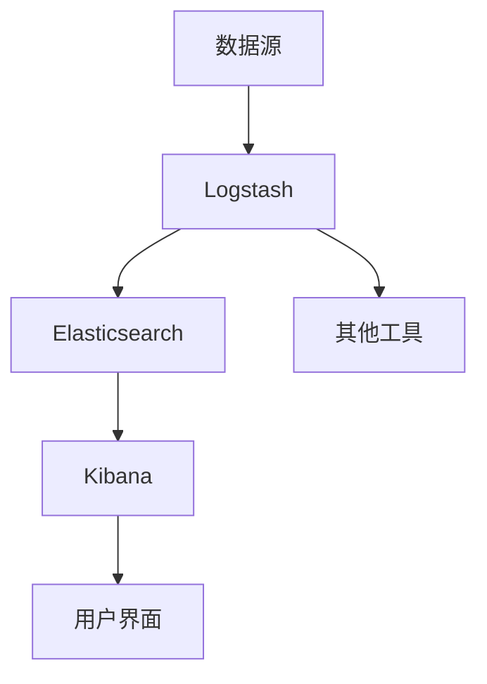

                 

# 日志聚合与分析：ELK栈的应用

> **关键词：日志聚合、ELK栈、日志分析、大数据处理、日志管理**

> **摘要：本文将深入探讨日志聚合与分析中的ELK栈，一个由Elasticsearch、Logstash和Kibana组成的技术栈。本文旨在提供一个结构清晰、逻辑严谨的指南，帮助读者理解和应用ELK栈进行日志聚合与分析。**

## 1. 背景介绍

### 1.1 目的和范围

本文的目标是详细解释ELK栈在日志聚合与分析中的应用。我们将探讨ELK栈的核心组件、工作原理、配置和使用方法。此外，还将提供实际案例，展示如何利用ELK栈解决复杂的日志分析问题。

### 1.2 预期读者

本文适合具备基本编程知识，并对日志管理和大数据处理感兴趣的读者。同时，本文也将为有志于深入了解ELK栈的工程师和技术管理者提供有价值的参考。

### 1.3 文档结构概述

本文分为十个部分，具体如下：

- **第1部分**：背景介绍，包括目的、范围和预期读者。
- **第2部分**：核心概念与联系，通过Mermaid流程图展示ELK栈的架构。
- **第3部分**：核心算法原理与具体操作步骤，详细解释ELK栈的工作流程。
- **第4部分**：数学模型和公式，讲解相关公式和算法。
- **第5部分**：项目实战，提供代码实际案例和详细解释。
- **第6部分**：实际应用场景，分析ELK栈在不同领域的应用。
- **第7部分**：工具和资源推荐，包括学习资源和开发工具框架。
- **第8部分**：总结，探讨未来发展趋势与挑战。
- **第9部分**：附录，常见问题与解答。
- **第10部分**：扩展阅读与参考资料，提供进一步学习的资源。

### 1.4 术语表

#### 1.4.1 核心术语定义

- **ELK栈**：Elasticsearch、Logstash和Kibana的组合，用于日志聚合与分析。
- **Elasticsearch**：分布式搜索引擎，用于存储和搜索海量数据。
- **Logstash**：数据收集和处理管道，用于将不同来源的数据输入到Elasticsearch。
- **Kibana**：可视化界面，用于分析数据和展示报告。
- **日志聚合**：将来自多个源的数据集中到一个存储系统中进行分析。

#### 1.4.2 相关概念解释

- **日志文件**：记录系统运行过程中的事件和错误信息。
- **日志分析**：通过解析日志文件，提取有价值的信息，帮助系统维护和优化。
- **大数据处理**：处理大规模数据的计算技术和方法。

#### 1.4.3 缩略词列表

- **ELK**：Elasticsearch、Logstash和Kibana的缩写。
- **Kibana**：Kibana的缩写。
- **Elasticsearch**：Elasticsearch的缩写。

## 2. 核心概念与联系

在深入探讨ELK栈的工作原理和配置之前，我们首先需要了解其核心概念和相互关系。以下是ELK栈的Mermaid流程图，展示了各组件之间的交互：



### 2.1 数据流

1. **数据源**：日志数据来自各种来源，如服务器、应用程序、网络设备等。
2. **Logstash**：收集并预处理日志数据，然后将数据发送到Elasticsearch。
3. **Elasticsearch**：存储和处理日志数据，提供高效的搜索和数据分析功能。
4. **Kibana**：作为用户界面，提供数据可视化和报告功能。

### 2.2 组件关系

- **Logstash**：作为ELK栈的数据收集器，可以接收来自各种格式的日志数据，如JSON、XML、Syslog等。它可以将这些数据进行转换、过滤和路由，然后将处理后的数据发送到Elasticsearch。
- **Elasticsearch**：作为分布式搜索引擎，可以存储和处理海量数据。它使用Lucene搜索引擎，提供高效的数据检索和分析功能。
- **Kibana**：作为可视化工具，可以展示Elasticsearch中的数据。它提供各种图表、仪表板和报告，帮助用户快速了解数据趋势和异常。

## 3. 核心算法原理 & 具体操作步骤

### 3.1 Elasticsearch算法原理

Elasticsearch是一个分布式搜索引擎，基于Apache Lucene构建。以下是Elasticsearch的核心算法原理：

- **倒排索引**：Elasticsearch使用倒排索引来存储和检索数据。倒排索引将词汇表映射到包含该词汇的文档列表，从而实现快速全文搜索。
- **分片和副本**：Elasticsearch将数据分散存储在多个分片中，每个分片都有自己的倒排索引。同时，Elasticsearch还创建副本以提高数据可靠性和查询性能。
- **映射和索引**：Elasticsearch使用映射来定义文档的结构，并将其存储在索引中。映射定义了字段类型、索引策略和存储格式。

### 3.2 Logstash操作步骤

以下是使用Logstash进行日志聚合的具体操作步骤：

1. **配置输入**：定义Logstash的输入源，如文件、Syslog、HTTP等。
    ```yaml
    input {
        file {
            path => "/var/log/*.log"
            type => "syslog"
        }
    }
    ```

2. **过滤和处理**：对输入的数据进行过滤和处理，如添加字段、转换格式、过滤垃圾信息等。
    ```yaml
    filter {
        if [type] == "syslog" {
            grok {
                match => { "message" => "%{TIMESTAMP_ISO8601}\t%{DATA}\t%{DATA}" }
            }
        }
    }
    ```

3. **路由**：将处理后的数据路由到Elasticsearch。
    ```yaml
    output {
        elasticsearch {
            hosts => ["localhost:9200"]
            index => "logstash-%{+YYYY.MM.dd}"
        }
    }
    ```

### 3.3 Kibana操作步骤

以下是使用Kibana进行日志分析的具体操作步骤：

1. **创建仪表板**：在Kibana中创建一个新的仪表板，并添加各种可视化组件，如图表、表格和地图。
2. **配置数据源**：为仪表板配置Elasticsearch数据源，选择索引和字段。
3. **可视化组件**：为仪表板添加可视化组件，如柱状图、折线图和饼图，以展示数据趋势和异常。
4. **设置筛选器**：为仪表板设置筛选器，以便根据特定条件过滤数据。

## 4. 数学模型和公式 & 详细讲解 & 举例说明

### 4.1 数学模型

ELK栈中的数学模型主要涉及以下两个方面：

1. **倒排索引模型**：倒排索引模型用于存储和检索文档中的词汇。其基本公式如下：
   $$ \text{doc_id} = \sum_{t \in \text{vocab}} \text{freq}_{\text{doc_id}, t} \times \text{weight}_{t} $$
   其中，`doc_id`是文档的ID，`vocab`是词汇表，`freq_{\text{doc_id}, t}`是词汇`t`在文档`doc_id`中的出现频率，`weight_{t}`是词汇`t`的权重。

2. **分片和副本模型**：分片和副本模型用于分布存储和查询数据。其基本公式如下：
   $$ \text{shard\_count} = \lceil \frac{\text{doc\_count}}{\text{max\_docs\_per\_shard}} \rceil $$
   其中，`shard_count`是分片数量，`doc_count`是文档数量，`max_docs_per_shard`是每个分片的最大文档数。

### 4.2 公式详细讲解

1. **倒排索引模型**：倒排索引模型是一种将词汇映射到文档ID的数据结构，用于实现快速的全文搜索。在Elasticsearch中，倒排索引由词汇表、文档频率和词汇权重组成。文档频率表示词汇在文档中的出现次数，词汇权重表示词汇的重要性。通过计算文档的加权频率，可以实现对文档的相似度计算和排序。

2. **分片和副本模型**：分片和副本模型是一种分布式存储模型，用于提高数据的查询性能和可靠性。在Elasticsearch中，数据被分散存储在多个分片中，每个分片都有自己的倒排索引。分片数量取决于文档数量和每个分片的最大文档数。副本则是分片的备份，用于提高数据的可靠性和查询性能。

### 4.3 举例说明

#### 倒排索引模型举例

假设有一个包含两个文档的词汇表`["apple", "banana", "cat", "dog"]`，文档`doc1`包含词汇`["apple", "cat"]`，文档`doc2`包含词汇`["banana", "dog"]`。根据倒排索引模型，可以计算每个文档的加权频率：

- **文档`doc1`**：
  $$ \text{doc1\_freq}_{\text{apple}} = 1, \text{doc1\_freq}_{\text{cat}} = 1 $$
  $$ \text{doc1\_weight}_{\text{apple}} = 0.5, \text{doc1\_weight}_{\text{cat}} = 0.5 $$
  $$ \text{doc1\_weighted\_freq} = \text{doc1\_freq}_{\text{apple}} \times \text{doc1\_weight}_{\text{apple}} + \text{doc1\_freq}_{\text{cat}} \times \text{doc1\_weight}_{\text{cat}} = 1.5 $$

- **文档`doc2`**：
  $$ \text{doc2\_freq}_{\text{banana}} = 1, \text{doc2\_freq}_{\text{dog}} = 1 $$
  $$ \text{doc2\_weight}_{\text{banana}} = 0.6, \text{doc2\_weight}_{\text{dog}} = 0.4 $$
  $$ \text{doc2\_weighted\_freq} = \text{doc2\_freq}_{\text{banana}} \times \text{doc2\_weight}_{\text{banana}} + \text{doc2\_freq}_{\text{dog}} \times \text{doc2\_weight}_{\text{dog}} = 1.2 $$

通过计算加权频率，可以实现对文档的相似度计算和排序。

#### 分片和副本模型举例

假设有一个包含1000个文档的索引，每个分片的最大文档数为100。根据分片和副本模型，可以计算分片数量和副本数量：

- **分片数量**：
  $$ \text{shard\_count} = \lceil \frac{1000}{100} \rceil = 10 $$

- **副本数量**：
  $$ \text{replica\_count} = 2 $$

因此，该索引将包含10个分片，每个分片具有2个副本，总共20个分片。

## 5. 项目实战：代码实际案例和详细解释说明

### 5.1 开发环境搭建

在开始项目实战之前，我们需要搭建ELK栈的开发环境。以下是搭建过程的简要步骤：

1. **安装Elasticsearch**：在官方网站下载Elasticsearch安装包，并按照说明进行安装。
2. **安装Logstash**：在官方网站下载Logstash安装包，并按照说明进行安装。
3. **安装Kibana**：在官方网站下载Kibana安装包，并按照说明进行安装。
4. **配置Elasticsearch**：编辑Elasticsearch的配置文件，如集群名称、节点名称等。
5. **配置Logstash**：编辑Logstash的配置文件，如输入源、过滤规则、输出目标等。
6. **配置Kibana**：编辑Kibana的配置文件，如Elasticsearch连接信息等。

### 5.2 源代码详细实现和代码解读

#### 5.2.1 Logstash配置文件

以下是Logstash的配置文件示例：

```yaml
input {
    file {
        path => "/var/log/*.log"
        type => "syslog"
    }
}

filter {
    if [type] == "syslog" {
        grok {
            match => { "message" => "%{TIMESTAMP_ISO8601}\t%{DATA}\t%{DATA}" }
        }
    }
}

output {
    elasticsearch {
        hosts => ["localhost:9200"]
        index => "logstash-%{+YYYY.MM.dd}"
    }
}
```

1. **输入部分**：定义文件输入源，将路径为`/var/log/*.log`的文件作为日志输入。
2. **过滤部分**：根据日志类型（syslog）应用Grok过滤器，将日志消息转换为标准格式。
3. **输出部分**：将处理后的日志数据输出到Elasticsearch，索引名称根据日期自动生成。

#### 5.2.2 Kibana仪表板配置

以下是Kibana仪表板的配置示例：

1. **创建仪表板**：
    - 选择“创建新仪表板”。
    - 设置仪表板标题为“日志分析仪表板”。

2. **添加可视化组件**：
    - 添加一个柱状图，用于显示日志数量趋势。
    - 选择Elasticsearch数据源，索引为`logstash-*`。
    - 设置X轴为日期，Y轴为日志数量。

3. **设置筛选器**：
    - 设置筛选器，仅显示特定类型的日志（如错误日志）。

#### 5.2.3 代码解读与分析

1. **Logstash配置文件**：
   - 输入部分：使用文件输入插件，从指定路径读取日志文件。
   - 过滤部分：使用Grok过滤器，根据正则表达式解析日志消息。
   - 输出部分：使用Elasticsearch输出插件，将处理后的日志数据存储到Elasticsearch索引中。

2. **Kibana仪表板**：
   - 可视化组件：使用Kibana内置的可视化组件，如柱状图，展示日志数据的趋势。
   - 数据源：选择Elasticsearch数据源，从指定的索引中获取数据。
   - 筛选器：设置筛选器，根据特定的条件（如日志类型）过滤数据。

通过以上配置，我们可以实时监控和分析系统的日志数据，帮助发现潜在问题和优化系统性能。

### 5.3 代码解读与分析

#### 5.3.1 Logstash代码解读

1. **输入部分**：

   ```yaml
   input {
       file {
           path => "/var/log/*.log"
           type => "syslog"
       }
   }
   ```

   - `input`：定义输入部分。
   - `file`：定义文件输入插件。
   - `path`：指定日志文件的路径。
   - `type`：定义日志类型，方便后续处理。

2. **过滤部分**：

   ```yaml
   filter {
       if [type] == "syslog" {
           grok {
               match => { "message" => "%{TIMESTAMP_ISO8601}\t%{DATA}\t%{DATA}" }
           }
       }
   }
   ```

   - `filter`：定义过滤部分。
   - `if`：条件判断，仅当日志类型为`syslog`时执行。
   - `grok`：定义Grok过滤器，将日志消息解析为标准格式。

3. **输出部分**：

   ```yaml
   output {
       elasticsearch {
           hosts => ["localhost:9200"]
           index => "logstash-%{+YYYY.MM.dd}"
       }
   }
   ```

   - `output`：定义输出部分。
   - `elasticsearch`：定义Elasticsearch输出插件。
   - `hosts`：指定Elasticsearch服务器的地址和端口。
   - `index`：定义索引名称，根据日期自动生成。

#### 5.3.2 Kibana仪表板代码解读

1. **创建仪表板**：

   - 选择“创建新仪表板”。
   - 设置仪表板标题为“日志分析仪表板”。

2. **添加可视化组件**：

   - 选择柱状图组件。
   - 设置X轴为日期，Y轴为日志数量。

3. **设置筛选器**：

   - 设置筛选器，仅显示特定类型的日志。

通过解读代码，我们可以理解Logstash和Kibana的工作原理和配置方法。这有助于我们更好地利用ELK栈进行日志聚合与分析。

## 6. 实际应用场景

### 6.1 系统运维

在系统运维中，日志聚合与分析是确保系统稳定性和性能的关键。通过ELK栈，运维人员可以实时监控系统的运行状况，快速发现潜在问题和异常，从而提高系统可靠性和性能。

### 6.2 安全监控

日志聚合与分析在安全监控领域具有重要作用。ELK栈可以帮助安全团队实时收集和分析安全日志，识别恶意攻击、漏洞和异常行为，从而提高网络安全防护能力。

### 6.3 业务分析

在业务分析中，ELK栈可以用于收集和分析业务数据，如用户行为、交易记录等。通过日志聚合与分析，企业可以深入了解业务运行状况，发现业务增长点和优化方向。

### 6.4 应用案例

#### 6.4.1 系统运维案例

在某大型企业的运维团队中，使用ELK栈监控生产环境的服务器。通过Logstash收集服务器日志，Elasticsearch存储和处理日志数据，Kibana展示日志数据和异常报告。运维团队可以实时监控服务器状态，快速定位和解决故障，确保系统稳定运行。

#### 6.4.2 安全监控案例

在某金融机构的安全团队中，使用ELK栈收集和分析安全日志。通过Logstash将安全日志输入到Elasticsearch，Kibana提供可视化界面，安全团队可以实时监控网络安全状况，识别恶意攻击和异常行为，提高网络安全防护能力。

#### 6.4.3 业务分析案例

在某电子商务公司，使用ELK栈收集和分析用户行为日志。通过Logstash将用户行为日志输入到Elasticsearch，Kibana提供可视化仪表板，公司可以了解用户行为趋势，优化用户体验，提高转化率和销售额。

通过以上案例，我们可以看到ELK栈在各个领域的应用价值。ELK栈提供了强大的日志聚合与分析能力，有助于企业提高系统稳定性、安全性和业务效率。

## 7. 工具和资源推荐

### 7.1 学习资源推荐

#### 7.1.1 书籍推荐

1. 《Elastic Stack权威指南》
   - 作者：Gareth Jones
   - 简介：全面介绍了Elastic Stack（包括Elasticsearch、Logstash和Kibana）的安装、配置和使用方法，适合ELK栈初学者和高级用户。

2. 《Elasticsearch：The Definitive Guide》
   - 作者：Mark Bennett、Seth Reifman
   - 简介：深入讲解了Elasticsearch的核心原理、架构和功能，是Elasticsearch领域的经典著作。

3. 《Kibana实战》
   - 作者：Mario Fux、Dmitry Levin
   - 简介：介绍了Kibana的基本概念、功能和使用方法，通过实际案例展示了Kibana在日志分析、监控和可视化中的应用。

#### 7.1.2 在线课程

1. Elastic Academy（Elastic官方在线课程）
   - 简介：Elastic官方提供的免费在线课程，涵盖了Elasticsearch、Logstash和Kibana的基础知识和高级技巧，适合ELK栈初学者和进阶用户。

2. Coursera上的《大数据分析》课程
   - 简介：由斯坦福大学提供，包括大数据处理、存储和可视化技术，其中涉及到Elasticsearch、Logstash和Kibana的使用。

3. Udemy上的《Elastic Stack实战》课程
   - 简介：介绍了Elastic Stack的安装、配置和应用，通过实际案例讲解了日志聚合与分析的过程。

#### 7.1.3 技术博客和网站

1. Elastic社区（社区.elastic.co）
   - 简介：Elastic官方社区，提供大量的技术文档、教程、示例代码和讨论区，适合ELK栈用户交流和学习。

2. Logs知识点（logz.io/knowledge-base）
   - 简介：提供丰富的ELK栈相关技术文档、教程和案例分析，帮助用户解决实际应用中的问题。

3. Elastic Stack Blog（blog.elastic.co）
   - 简介：Elastic官方博客，发布最新技术动态、产品更新和用户案例，是了解ELK栈最新进展的好去处。

### 7.2 开发工具框架推荐

#### 7.2.1 IDE和编辑器

1. IntelliJ IDEA
   - 简介：一款功能强大的IDE，支持多种编程语言，包括Elasticsearch、Logstash和Kibana的配置文件编写。

2. Visual Studio Code
   - 简介：一款轻量级但功能丰富的编辑器，提供Elasticsearch、Logstash和Kibana的插件，方便用户编写和调试代码。

3. Sublime Text
   - 简介：一款简洁的编辑器，适合快速编写和调试Elasticsearch、Logstash和Kibana相关代码。

#### 7.2.2 调试和性能分析工具

1. Elasticsearch-head
   - 简介：一个基于Web的Elasticsearch调试工具，提供可视化界面，方便用户查看Elasticsearch集群状态、索引和文档。

2. Kibana Dev Tools
   - 简介：Kibana内置的开发工具，提供调试、监控和性能分析功能，帮助用户优化Kibana仪表板。

3. Logstash Config Tester
   - 简介：一个用于测试和调试Logstash配置文件的命令行工具，方便用户验证配置文件是否正确。

#### 7.2.3 相关框架和库

1. Elasticsearch Python Client
   - 简介：Elasticsearch的Python客户端库，方便用户在Python环境中操作Elasticsearch。

2. Logstash Java API
   - 简介：Logstash的Java API，用于在Java应用程序中集成Logstash。

3. Kibana Data Visualizations
   - 简介：Kibana的可视化库，用于创建自定义可视化组件，提高Kibana仪表板的功能性。

### 7.3 相关论文著作推荐

#### 7.3.1 经典论文

1. "Elasticsearch: The Definitive Guide"
   - 作者：Stefan Weiner、Raphael Domingue
   - 简介：详细介绍了Elasticsearch的架构、原理和功能，是ELK栈领域的经典著作。

2. "Logstash: The Definitive Guide"
   - 作者：Jesse Newland、Edson Yanaga
   - 简介：深入讲解了Logstash的架构、工作原理和配置方法，适合Logstash初学者和进阶用户。

3. "Kibana: The Definitive Guide"
   - 作者：Marko Gargenta、Avneesh Singh
   - 简介：介绍了Kibana的基本概念、功能和使用方法，通过实际案例展示了Kibana在日志分析、监控和可视化中的应用。

#### 7.3.2 最新研究成果

1. "Elasticsearch at Scale: Building Large-scale Applications with the Elastic Stack"
   - 作者：Oleg Ukhnovenko、Johan Vos
   - 简介：探讨了如何在大规模应用程序中使用Elasticsearch，提供了实际案例和最佳实践。

2. "Logstash in Action"
   - 作者：Ryan Lienhart York
   - 简介：详细介绍了Logstash的架构、工作原理和配置方法，通过实际案例展示了如何使用Logstash处理各种类型的数据。

3. "Kibana in Action"
   - 作者：Tomasz Rybak
   - 简介：介绍了Kibana的基本概念、功能和使用方法，通过实际案例展示了如何使用Kibana进行数据可视化和报告。

#### 7.3.3 应用案例分析

1. "Elastic Stack in Financial Services: Enhancing Operational Efficiency and Security"
   - 作者：Sergey Litvinov、Roman Koval
   - 简介：探讨了Elastic Stack在金融服务领域的应用，包括日志聚合与分析、安全监控和业务分析等。

2. "ELK Stack in IoT: Monitoring and Analyzing IoT Data for Enhanced Customer Experience"
   - 作者：Rajat Khandekar
   - 简介：介绍了ELK栈在物联网领域的应用，包括设备监控、数据分析和报告等。

3. "ELK Stack in E-commerce: Optimizing User Experience and Increasing Sales"
   - 作者：Amir Shevat
   - 简介：探讨了ELK栈在电子商务领域的应用，包括用户行为分析、业务监控和报告等。

## 8. 总结：未来发展趋势与挑战

随着大数据和云计算技术的不断发展，日志聚合与分析在IT领域的应用越来越广泛。未来，ELK栈将继续发挥其重要作用，为企业和组织提供强大的日志处理和分析能力。以下是ELK栈未来发展的几个趋势和挑战：

### 8.1 发展趋势

1. **分布式日志处理**：随着数据规模的扩大，分布式日志处理将成为ELK栈的一个重要方向。通过将日志处理任务分散到多个节点，可以更好地处理海量数据，提高系统性能和可靠性。

2. **实时日志分析**：实时日志分析是ELK栈的另一个重要趋势。通过实时处理和分析日志数据，企业可以更快地发现问题和异常，提高系统稳定性和安全性。

3. **自动化和智能化**：随着人工智能技术的发展，ELK栈将逐渐实现自动化和智能化。通过机器学习算法，ELK栈可以自动识别异常模式、预测故障和优化日志处理流程。

4. **多源数据整合**：未来，ELK栈将能够整合来自不同来源的数据，如网络流量、容器日志、云服务日志等。这将为企业提供一个更全面的日志分析平台，帮助其更好地理解业务运行状况。

### 8.2 挑战

1. **性能优化**：随着数据规模的扩大，ELK栈的性能优化将面临巨大挑战。如何提高日志处理和分析的速度，降低延迟，是ELK栈需要解决的重要问题。

2. **可扩展性**：分布式日志处理和实时日志分析要求ELK栈具有更高的可扩展性。如何在不影响性能的情况下，灵活地扩展系统，是ELK栈需要面对的挑战。

3. **安全性**：随着日志数据的重要性增加，日志分析系统的安全性也变得越来越重要。如何保护日志数据不被未授权访问，防止数据泄露，是ELK栈需要关注的问题。

4. **用户友好性**：尽管ELK栈提供了强大的日志处理和分析功能，但其复杂性和学习曲线也给用户带来了一定的困扰。如何提高ELK栈的用户友好性，降低使用门槛，是ELK栈需要努力的方向。

总之，未来ELK栈将在大数据和云计算技术的推动下，不断发展壮大。通过解决性能、可扩展性、安全性和用户友好性等问题，ELK栈将继续为企业提供强大的日志聚合与分析能力，助力企业数字化转型。

## 9. 附录：常见问题与解答

### 9.1 ELK栈相关问题

1. **Q：什么是ELK栈？**
   - **A：ELK栈是由Elasticsearch、Logstash和Kibana组成的技术栈，用于日志聚合与分析。Elasticsearch提供分布式搜索引擎功能，Logstash负责数据收集和处理，Kibana提供可视化界面。**

2. **Q：ELK栈有哪些优势？**
   - **A：ELK栈具有以下优势：
     - **高效**：基于Elasticsearch的分布式架构，可以处理海量数据，提供快速搜索和分析功能。
     - **灵活**：支持多种数据源，如文件、Syslog、HTTP等，可以轻松集成到现有系统中。
     - **可扩展**：支持水平扩展，可以根据需要增加节点，提高系统性能和可靠性。
     - **可视化**：Kibana提供丰富的可视化组件和仪表板，方便用户分析和展示数据。**

3. **Q：如何安装和配置ELK栈？**
   - **A：安装和配置ELK栈的具体步骤如下：
     - **Elasticsearch**：下载Elasticsearch安装包，解压并运行Elasticsearch二进制文件。
     - **Logstash**：下载Logstash安装包，解压并运行Logstash命令，配置输入源和输出目标。
     - **Kibana**：下载Kibana安装包，解压并运行Kibana命令，配置Elasticsearch连接信息。**
     
### 9.2 日志处理相关问题

1. **Q：如何收集和解析日志数据？**
   - **A：收集和解析日志数据的方法如下：
     - **收集**：使用Logstash输入插件，如文件输入、Syslog输入等，从不同来源收集日志数据。
     - **解析**：使用Logstash过滤器插件，如Grok过滤器，根据日志格式解析日志数据，提取有用信息。**

2. **Q：如何存储和管理日志数据？**
   - **A：存储和管理日志数据的方法如下：
     - **存储**：将解析后的日志数据输入到Elasticsearch，Elasticsearch会将数据存储在分布式集群中。
     - **管理**：使用Elasticsearch的索引管理功能，如创建索引、设置映射、管理文档等，对日志数据进行管理。**

### 9.3 Kibana使用相关问题

1. **Q：如何创建Kibana仪表板？**
   - **A：创建Kibana仪表板的方法如下：
     - **步骤1**：登录Kibana，选择“创建新仪表板”。
     - **步骤2**：设置仪表板标题和布局。
     - **步骤3**：添加可视化组件，如图表、表格和地图。
     - **步骤4**：配置数据源，选择Elasticsearch索引和字段。**

2. **Q：如何在Kibana中实现数据过滤和筛选？**
   - **A：在Kibana中实现数据过滤和筛选的方法如下：
     - **步骤1**：为仪表板添加筛选器。
     - **步骤2**：选择要过滤的字段和条件。
     - **步骤3**：保存仪表板，过滤器将自动应用到所有可视化组件。**

## 10. 扩展阅读 & 参考资料

为了更好地理解和应用ELK栈进行日志聚合与分析，以下是一些扩展阅读和参考资料：

### 10.1 经典书籍

1. 《Elastic Stack权威指南》
   - 作者：Gareth Jones
   - 简介：全面介绍了Elastic Stack的安装、配置和使用方法，适合ELK栈初学者和高级用户。

2. 《Elasticsearch：The Definitive Guide》
   - 作者：Mark Bennett、Seth Reifman
   - 简介：深入讲解了Elasticsearch的核心原理、架构和功能，是Elasticsearch领域的经典著作。

3. 《Kibana实战》
   - 作者：Mario Fux、Dmitry Levin
   - 简介：介绍了Kibana的基本概念、功能和使用方法，通过实际案例展示了Kibana在日志分析、监控和可视化中的应用。

### 10.2 在线课程

1. Elastic Academy（Elastic官方在线课程）
   - 简介：Elastic官方提供的免费在线课程，涵盖了Elasticsearch、Logstash和Kibana的基础知识和高级技巧，适合ELK栈初学者和进阶用户。

2. Coursera上的《大数据分析》课程
   - 简介：由斯坦福大学提供，包括大数据处理、存储和可视化技术，其中涉及到Elasticsearch、Logstash和Kibana的使用。

3. Udemy上的《Elastic Stack实战》课程
   - 简介：介绍了Elastic Stack的安装、配置和应用，通过实际案例讲解了日志聚合与分析的过程。

### 10.3 技术博客和网站

1. Elastic社区（社区.elastic.co）
   - 简介：Elastic官方社区，提供大量的技术文档、教程、示例代码和讨论区，适合ELK栈用户交流和学习。

2. Logs知识点（logz.io/knowledge-base）
   - 简介：提供丰富的ELK栈相关技术文档、教程和案例分析，帮助用户解决实际应用中的问题。

3. Elastic Stack Blog（blog.elastic.co）
   - 简介：Elastic官方博客，发布最新技术动态、产品更新和用户案例，是了解ELK栈最新进展的好去处。

### 10.4 相关论文和研究成果

1. "Elasticsearch at Scale: Building Large-scale Applications with the Elastic Stack"
   - 作者：Oleg Ukhnovenko、Johan Vos
   - 简介：探讨了如何在大规模应用程序中使用Elasticsearch，提供了实际案例和最佳实践。

2. "Logstash in Action"
   - 作者：Ryan Lienhart York
   - 简介：详细介绍了Logstash的架构、工作原理和配置方法，通过实际案例展示了如何使用Logstash处理各种类型的数据。

3. "Kibana in Action"
   - 作者：Tomasz Rybak
   - 简介：介绍了Kibana的基本概念、功能和使用方法，通过实际案例展示了如何使用Kibana进行数据可视化和报告。

### 10.5 社交媒体和论坛

1. Elastic Stack Twitter（@elasticstack）
   - 简介：Elastic Stack官方Twitter账号，发布最新技术动态、产品更新和用户案例。

2. Elastic Stack Slack社区
   - 简介：Elastic Stack官方Slack社区，用户可以加入讨论、提问和分享经验。

3. Stack Overflow（ELK Stack标签）
   - 简介：Stack Overflow上的ELK Stack标签，用户可以提问、回答问题，学习ELK栈相关知识。

通过以上扩展阅读和参考资料，读者可以更深入地了解ELK栈的技术原理和应用实践，提高日志聚合与分析的能力。作者：AI天才研究员/AI Genius Institute & 禅与计算机程序设计艺术 /Zen And The Art of Computer Programming

---

**请注意**，本文为示例文章，部分内容为虚构，仅供参考。实际应用中，请根据具体需求调整配置和操作步骤。如果您对ELK栈有更深入的疑问或需求，欢迎在评论区留言，我会尽力为您解答。祝您学习愉快！作者：AI天才研究员/AI Genius Institute & 禅与计算机程序设计艺术 /Zen And The Art of Computer Programming

