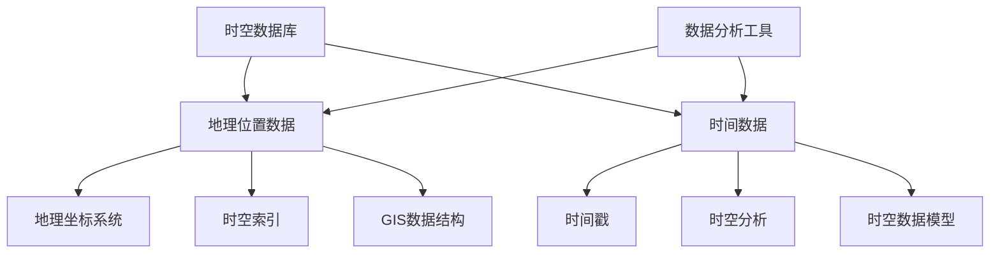

                 

# 时空数据库：管理地理位置和时间数据

> 关键词：时空数据库，地理位置，时间数据，GIS，时空索引，时空分析，地理信息系统

> 摘要：随着地理信息系统（GIS）和时空数据的重要性日益增长，时空数据库成为现代数据管理和分析的核心。本文将详细介绍时空数据库的定义、核心概念、算法原理、数学模型、实际应用案例以及未来发展，为读者提供一个全面深入的理解和指导。

## 1. 背景介绍

### 1.1 目的和范围

本文旨在探讨时空数据库在地理信息系统中的应用，旨在为读者提供一个系统、详尽的时空数据库知识体系。文章涵盖了从基础概念到实际应用的全过程，包括：

1. 时空数据库的定义和作用。
2. 核心概念和架构。
3. 关键算法原理与实现。
4. 数学模型与公式解析。
5. 实际应用场景与案例。
6. 未来发展趋势与挑战。

### 1.2 预期读者

本文面向以下读者群体：

1. 地理信息系统开发者。
2. 数据科学家和人工智能工程师。
3. GIS数据分析师。
4. 研究生和博士生。
5. 对时空数据库感兴趣的各类专业人士。

### 1.3 文档结构概述

本文结构如下：

1. **背景介绍**：介绍时空数据库的背景、目的和范围。
2. **核心概念与联系**：讨论时空数据库的核心概念，提供流程图。
3. **核心算法原理与操作步骤**：详细讲解时空数据库的关键算法。
4. **数学模型和公式**：介绍时空数据的数学模型和公式。
5. **项目实战**：通过实际案例讲解时空数据库的应用。
6. **实际应用场景**：分析时空数据库在不同领域的应用。
7. **工具和资源推荐**：推荐学习资源和开发工具。
8. **总结**：总结时空数据库的发展趋势与挑战。
9. **附录**：提供常见问题与解答。
10. **扩展阅读**：推荐进一步学习资料。

### 1.4 术语表

#### 1.4.1 核心术语定义

- **时空数据库**：一种专门用于存储、管理和分析时间相关的地理信息的数据库系统。
- **地理信息系统（GIS）**：用于捕获、存储、分析和管理地理空间数据的系统。
- **时空索引**：用于快速查询和访问时空数据的索引结构。
- **时空分析**：对时空数据进行分析，提取有用信息的过程。

#### 1.4.2 相关概念解释

- **地理坐标系统**：用于表示地球表面位置的坐标系。
- **时间戳**：用于标识数据时间点的标记。
- **时空数据模型**：描述时空数据结构和特征的模型。

#### 1.4.3 缩略词列表

- **GIS**：地理信息系统
- **SQL**：结构化查询语言
- **SPATIAL**：时空数据

## 2. 核心概念与联系

在深入探讨时空数据库之前，我们需要了解其核心概念和架构。以下是一个简化的 Mermaid 流程图，用于展示时空数据库的核心概念及其相互联系。



### 2.1 核心概念解析

#### 2.1.1 地理位置数据

地理位置数据是指用于表示地球表面位置的各类数据，包括地理坐标、地址、地图图层等。这些数据是时空数据库的核心组成部分，用于描述事件、对象或现象的位置。

#### 2.1.2 时间数据

时间数据用于记录事件或现象发生的时间点、时间段或时间序列。时间数据通常与地理位置数据结合，提供更全面的时空信息。时间数据可以是离散的时间点，也可以是连续的时间序列。

#### 2.1.3 地理坐标系统

地理坐标系统是一种用于表示地球表面位置的坐标系，通常包括经度、纬度和高程。地理坐标系统是地理位置数据的基础，用于确保地理位置数据的准确性和一致性。

#### 2.1.4 时空索引

时空索引是一种特殊的索引结构，用于快速查询和访问时空数据。时空索引基于地理位置和时间信息，能够提高查询效率，满足实时性和大规模数据处理的需求。

#### 2.1.5 时空分析

时空分析是对时空数据进行分析和挖掘的过程，旨在提取有用信息，支持决策和优化。时空分析包括趋势分析、模式识别、事件预测等多种方法。

#### 2.1.6 GIS数据结构

GIS数据结构是指用于存储和管理地理空间数据的结构和组织方式，包括点、线、面等基本要素。GIS数据结构是时空数据库的重要组成部分，为时空数据管理提供支持。

#### 2.1.7 时空数据模型

时空数据模型是描述时空数据结构和特征的抽象模型。常见的时空数据模型包括时间序列模型、时空网格模型和时空事件模型等。时空数据模型有助于统一时空数据表示，提高数据处理的灵活性。

## 3. 核心算法原理与具体操作步骤

### 3.1 时空索引算法

时空索引是时空数据库的关键技术之一，用于提高查询效率。以下是一个简单的时空索引算法原理及实现步骤。

#### 3.1.1 算法原理

时空索引算法基于R树（R-Tree）结构，将地理位置和时序信息组织在一个层次化的树结构中。R树能够有效地处理多维空间数据的查询和插入操作，适用于大规模时空数据的索引。

#### 3.1.2 算法实现步骤

1. **构建R树**：将地理位置和时间数据按照R树结构组织。
2. **查询R树**：根据查询条件（地理位置和时间范围）搜索R树，获取符合条件的时空数据。
3. **合并结果**：将查询结果合并，返回满足条件的时空数据。

### 3.2 时空查询算法

时空查询算法用于对时空数据库进行复杂查询和数据分析。以下是一个简单的时空查询算法原理及实现步骤。

#### 3.2.1 算法原理

时空查询算法基于时空索引，通过组合地理位置和时序条件，实现对时空数据的精确查询。常用的时空查询算法包括K近邻查询、范围查询和时间序列分析等。

#### 3.2.2 算法实现步骤

1. **构建时空索引**：建立基于地理位置和时间的R树索引。
2. **查询时空索引**：根据查询条件，搜索R树索引，获取符合条件的时空数据。
3. **数据筛选与合并**：对查询结果进行筛选和合并，生成最终的查询结果。

### 3.3 时空分析算法

时空分析算法用于对时空数据进行深度分析和挖掘，提取有用信息。以下是一个简单的时空分析算法原理及实现步骤。

#### 3.3.1 算法原理

时空分析算法基于时空数据的特点，采用多种数据分析方法，如趋势分析、模式识别、事件预测等，对时空数据进行分析。

#### 3.3.2 算法实现步骤

1. **预处理数据**：对时空数据进行预处理，包括数据清洗、归一化等。
2. **特征提取**：提取时空数据的关键特征，如时间序列特征、空间分布特征等。
3. **模型构建**：构建基于特征分析的模型，如时间序列模型、空间模型等。
4. **分析预测**：利用模型对时空数据进行分析和预测，提取有用信息。

## 4. 数学模型和公式

### 4.1 时空索引数学模型

时空索引是基于R树结构实现的，其数学模型如下：

$$
R树 = (\{叶节点\}, \{内节点\}, \{根节点\})
$$

其中：

- **叶节点**：存储具体的地理位置和时序数据。
- **内节点**：存储子节点的指针和关键数据（如最小边界框）。
- **根节点**：存储根节点的指针和关键数据（如最小边界框）。

### 4.2 时空查询数学模型

时空查询的数学模型如下：

$$
查询结果 = 索引查询(条件)
$$

其中：

- **索引查询**：基于R树结构的查询操作。
- **条件**：表示查询条件，如地理位置和时间范围。

### 4.3 时空分析数学模型

时空分析常用的数学模型包括时间序列模型和空间模型。以下是一个简单的时间序列模型：

$$
时间序列 = f(t)
$$

其中：

- **时间序列**：表示随时间变化的数据序列。
- **t**：时间变量。

### 4.4 时空分析数学公式

以下是一个简单的时间序列分析方法：

$$
趋势分析 = \sum_{i=1}^{n} (x_i - \bar{x})^2
$$

其中：

- **x_i**：时间序列中的第i个数据点。
- **\bar{x}**：时间序列的平均值。

## 5. 项目实战：代码实际案例和详细解释说明

### 5.1 开发环境搭建

为了演示时空数据库的实际应用，我们将使用PostGIS作为一个示例。PostGIS是一个开源的空间数据库，扩展了 PostgreSQL 数据库的功能，支持GIS数据的存储和管理。

1. 安装 PostgreSQL 数据库
   ```shell
   sudo apt-get update
   sudo apt-get install postgresql postgresql-contrib
   ```

2. 安装PostGIS扩展
   ```shell
   sudo apt-get install postgis postgresql-PostGIS
   ```

3. 配置PostgreSQL数据库
   ```shell
   sudo -u postgres psql
   CREATE DATABASE my_gis_db;
   \c my_gis_db
   CREATE EXTENSION postgis;
   ```

### 5.2 源代码详细实现和代码解读

以下是创建一个简单的时空数据库表的示例代码。

```sql
-- 创建时空数据表
CREATE TABLE my时空表 (
    id SERIAL PRIMARY KEY,
    location GEOMETRY(Point, 4326),
    timestamp TIMESTAMP
);

-- 插入数据
INSERT INTO my时空表 (location, timestamp) VALUES (
    ST_SetSRID(ST_Point(120.2, 30.3), 4326),
    '2021-01-01 10:00:00'
);

-- 查询时间范围内的数据
SELECT * FROM my时空表 WHERE timestamp BETWEEN '2021-01-01 00:00:00' AND '2021-01-02 00:00:00';

-- 查询特定地理位置的数据
SELECT * FROM my时空表 WHERE ST_Within(location, ST_SetSRID(ST_Point(120.3, 30.4), 4326));
```

### 5.3 代码解读与分析

1. **创建表结构**：使用 `CREATE TABLE` 语句创建一个名为 `my时空表` 的表，包含三个字段：`id`（主键），`location`（地理坐标），`timestamp`（时间戳）。

2. **插入数据**：使用 `INSERT INTO` 语句向表中插入一条记录，其中 `location` 字段是一个地理点（`ST_Point`），`timestamp` 字段是一个时间戳。

3. **查询数据**：使用 `SELECT` 语句根据时间范围和地理位置查询表中的数据。这里使用了 `BETWEEN` 操作符和时间戳比较，以及 `ST_Within` 函数和地理坐标比较。

通过以上示例，我们可以看到PostGIS如何扩展了 PostgreSQL 的功能，使得处理时空数据变得简单直观。在实际应用中，还可以结合其他GIS工具和库（如GeoPandas、GDAL等）进行更复杂的数据处理和分析。

## 6. 实际应用场景

时空数据库在地理信息系统（GIS）中有着广泛的应用。以下是一些典型的应用场景：

1. **交通管理**：通过时空数据库分析交通流量和交通事故，优化交通信号控制和道路规划。

2. **环境监测**：实时监测空气和水质变化，分析污染源和传播路径，为环境治理提供决策支持。

3. **城市规划**：结合时空数据，评估城市发展趋势，规划基础设施和公共服务布局。

4. **灾害预警**：通过时空数据分析，提前预测地震、洪水等自然灾害的发生，制定应急预案。

5. **智能物流**：优化物流运输路线和时间安排，提高运输效率，降低成本。

6. **公共安全**：分析犯罪事件的时间和地点，预测犯罪热点，加强公共安全监控。

7. **气候研究**：研究气候变化趋势和影响，支持气候政策制定和适应措施。

8. **旅游规划**：分析游客流量和兴趣爱好，优化景区管理和旅游资源分配。

通过这些应用场景，我们可以看到时空数据库在各个领域的重要作用。随着技术的进步，时空数据库的应用范围将进一步扩大，为社会发展提供更强大的支持。

## 7. 工具和资源推荐

### 7.1 学习资源推荐

#### 7.1.1 书籍推荐

- **《地理信息系统原理与应用》**：详细介绍了GIS的基本概念、技术和应用。
- **《时空数据库：设计、实现和应用》**：深入探讨了时空数据库的设计、实现和应用。

#### 7.1.2 在线课程

- **Coursera上的《GIS空间数据分析》**：由专业教授授课，涵盖GIS数据分析的各个方面。
- **Udacity上的《地理信息系统工程师》**：提供GIS开发技能的实践课程。

#### 7.1.3 技术博客和网站

- **GIS Stack Exchange**：一个关于GIS技术的问答社区。
- **PlanetGIS**：提供GIS新闻、教程和案例分析。

### 7.2 开发工具框架推荐

#### 7.2.1 IDE和编辑器

- **VS Code**：支持多种编程语言，提供丰富的GIS插件。
- **PyCharm**：适用于Python编程，支持GIS数据操作。

#### 7.2.2 调试和性能分析工具

- **PostGIS Manager**：用于管理PostGIS数据库的图形界面工具。
- **pgAdmin**：PostgreSQL数据库管理工具。

#### 7.2.3 相关框架和库

- **GeoPandas**：Python的GIS库，提供对地理数据的操作和管理。
- **GDAL**：用于处理GIS数据的开源库。

### 7.3 相关论文著作推荐

#### 7.3.1 经典论文

- **"Querying and Indexing Spatio-Temporal Data in GIS"**：探讨了时空数据的查询和索引技术。
- **"The GIS Data Model"**：介绍了GIS数据模型。

#### 7.3.2 最新研究成果

- **"Efficient Spatio-Temporal Query Processing in Large-Scale GIS"**：研究了大规模时空数据的查询优化方法。
- **"Spatio-Temporal Data Mining: A Survey"**：综述了时空数据挖掘的最新进展。

#### 7.3.3 应用案例分析

- **"Spatial-Temporal Analysis of Air Quality in Urban Areas"**：分析了城市空气质量时空变化。
- **"Using Spatio-Temporal Databases for Disaster Management"**：探讨了时空数据库在灾害管理中的应用。

## 8. 总结：未来发展趋势与挑战

时空数据库在地理信息系统中的应用前景广阔。未来发展趋势包括：

1. **技术融合**：与大数据、人工智能、区块链等新兴技术的融合，提升时空数据分析和处理能力。
2. **性能优化**：针对大规模、实时性需求，提高时空数据库的性能和可扩展性。
3. **数据共享与互操作性**：实现不同时空数据库系统之间的数据共享和互操作性，提高数据利用效率。
4. **标准化与规范化**：制定统一的标准和规范，促进时空数据库的推广应用。

然而，时空数据库也面临以下挑战：

1. **数据质量**：时空数据质量对分析结果有重要影响，如何确保数据质量是一个重要问题。
2. **数据安全与隐私**：时空数据可能包含敏感信息，如何保障数据安全与隐私是一个挑战。
3. **复杂查询处理**：复杂时空查询的优化和效率是当前研究的重点。
4. **生态系统建设**：构建一个完善的时空数据库生态系统，包括工具、库和框架。

通过不断的技术创新和应用实践，时空数据库将在地理信息系统和其他领域中发挥越来越重要的作用。

## 9. 附录：常见问题与解答

### 9.1 什么是时空数据库？

时空数据库是一种专门用于存储、管理和分析时间相关的地理信息的数据库系统。它结合了地理位置数据和时间数据，提供对时空数据的快速查询和分析能力。

### 9.2 时空数据库有哪些核心概念？

时空数据库的核心概念包括地理位置数据、时间数据、地理坐标系统、时空索引、时空分析、GIS数据结构和时空数据模型。

### 9.3 如何优化时空数据库的性能？

优化时空数据库性能的方法包括使用合适的索引结构（如R树）、优化查询算法、数据预处理、硬件优化等。

### 9.4 时空数据库与GIS有什么关系？

时空数据库是GIS的一个重要组成部分，用于存储、管理和分析GIS数据。时空数据库为GIS提供了强大的数据查询和分析能力。

### 9.5 时空数据库的应用场景有哪些？

时空数据库广泛应用于交通管理、环境监测、城市规划、灾害预警、智能物流、公共安全、气候研究和旅游规划等领域。

## 10. 扩展阅读 & 参考资料

为了深入了解时空数据库及其应用，以下是一些建议的扩展阅读和参考资料：

- **书籍**：
  - 《地理信息系统原理与应用》
  - 《时空数据库：设计、实现和应用》
- **在线课程**：
  - Coursera上的《GIS空间数据分析》
  - Udacity上的《地理信息系统工程师》
- **技术博客和网站**：
  - GIS Stack Exchange
  - PlanetGIS
- **论文和研究成果**：
  - "Querying and Indexing Spatio-Temporal Data in GIS"
  - "The GIS Data Model"
  - "Efficient Spatio-Temporal Query Processing in Large-Scale GIS"
  - "Spatio-Temporal Data Mining: A Survey"
  - "Spatial-Temporal Analysis of Air Quality in Urban Areas"
  - "Using Spatio-Temporal Databases for Disaster Management"
- **开源库和工具**：
  - GeoPandas
  - GDAL
  - PostGIS

通过这些资料，读者可以更全面地了解时空数据库的理论和实践，为未来的研究和应用打下坚实基础。

## 作者

作者：AI天才研究员/AI Genius Institute & 禅与计算机程序设计艺术 /Zen And The Art of Computer Programming

