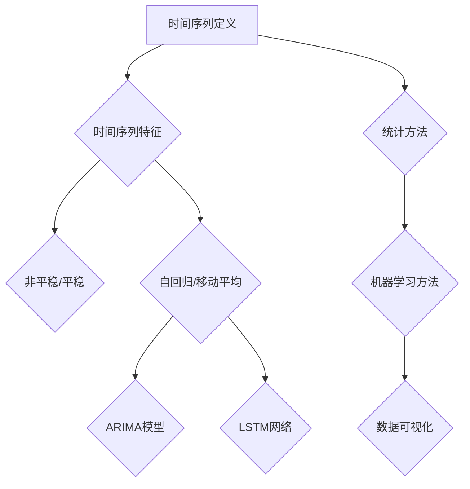

                 

# 时间序列分析(Time Series Analysis) - 原理与代码实例讲解

> **关键词**: 时间序列分析、时间序列模型、机器学习、ARIMA、LSTM、回归分析、数据可视化

> **摘要**: 本文将深入探讨时间序列分析的基本原理，包括核心概念、算法原理和实际操作步骤。通过具体的代码实例，我们将演示如何使用Python和相关的机器学习库来构建时间序列预测模型，并讨论其在实际应用中的重要性。文章最后还将提供学习资源和未来发展趋势，以帮助读者更好地理解和应用时间序列分析技术。

## 1. 背景介绍

### 1.1 目的和范围

本文旨在为读者提供一个全面的时间序列分析指南。我们将首先介绍时间序列分析的基本概念，然后深入探讨几种常见的时间序列模型及其实现方法。通过具体的代码实例，我们将演示如何使用Python等工具来处理和分析时间序列数据，使读者能够将理论知识应用于实际项目中。

### 1.2 预期读者

本文适合具有基本编程知识和对机器学习有一定了解的读者。对于希望深入了解时间序列分析及其应用场景的从业者和技术爱好者，本文也具有很高的参考价值。

### 1.3 文档结构概述

本文将按照以下结构进行阐述：

- **核心概念与联系**：介绍时间序列分析的基本概念，包括时间序列的定义、特征和类型。
- **核心算法原理 & 具体操作步骤**：讲解时间序列分析中常用的算法原理，包括ARIMA、LSTM等，并提供伪代码说明。
- **数学模型和公式 & 详细讲解 & 举例说明**：介绍时间序列分析中涉及的主要数学模型和公式，并通过实例进行详细解释。
- **项目实战：代码实际案例和详细解释说明**：通过实际项目，演示如何使用Python进行时间序列分析，并详细解释代码实现过程。
- **实际应用场景**：讨论时间序列分析在不同领域中的应用。
- **工具和资源推荐**：推荐学习资源和开发工具，以帮助读者进一步学习和实践。
- **总结：未来发展趋势与挑战**：总结本文的主要内容，并探讨时间序列分析的未来发展趋势和挑战。

### 1.4 术语表

#### 1.4.1 核心术语定义

- **时间序列**：一组按时间顺序排列的数据点，通常用于预测未来的趋势。
- **自相关性**：时间序列中不同时间点之间的相关性。
- **平稳性**：时间序列在统计特征上不随时间变化的状态。
- **ARIMA**：自回归积分滑动平均模型，是一种常见的时间序列预测模型。
- **LSTM**：长短期记忆网络，一种用于处理和预测时间序列数据的深度学习模型。

#### 1.4.2 相关概念解释

- **自相关函数（ACF）**：用于衡量时间序列中不同时间点之间的相关性。
- **偏自相关函数（PACF）**：用于确定时间序列模型的滞后阶数。
- **时间序列平滑**：通过移动平均等方法减少时间序列中的随机波动。

#### 1.4.3 缩略词列表

- **ARIMA**：自回归积分滑动平均模型
- **LSTM**：长短期记忆网络
- **Python**：一种高级编程语言，广泛用于数据分析和机器学习

## 2. 核心概念与联系

### 2.1 时间序列的定义和特征

时间序列是指一系列按时间顺序排列的数据点。这些数据点可以是股票价格、温度记录、销售数据等。时间序列具有以下几个主要特征：

- **趋势（Trend）**：时间序列的整体上升或下降趋势。
- **季节性（Seasonality）**：时间序列在固定时间段内（如一年中的某个季节）的重复周期性行为。
- **随机性（Randomness）**：时间序列中无法预测的随机波动。

### 2.2 时间序列的类型

根据特征的不同，时间序列可以分为以下几类：

- **非平稳时间序列**：其统计特性随时间变化，例如存在明显的趋势或季节性。
- **平稳时间序列**：其统计特性在时间上保持不变，通常更容易进行预测。
- **自回归时间序列**：未来的数据点可以通过过去的值进行预测。
- **移动平均时间序列**：通过计算过去一段时间内的平均值来预测未来的值。

### 2.3 时间序列分析的常用方法

时间序列分析通常包括以下几种方法：

- **统计方法**：如ARIMA模型，通过自相关函数和偏自相关函数来确定模型的参数。
- **机器学习方法**：如LSTM网络，通过学习时间序列中的模式和关系进行预测。
- **数据可视化**：通过图表和曲线图来直观展示时间序列的特征和趋势。

### 2.4 Mermaid 流程图

以下是一个描述时间序列分析核心概念和流程的Mermaid流程图：



## 3. 核心算法原理 & 具体操作步骤

### 3.1 ARIMA模型原理

ARIMA（自回归积分滑动平均模型）是一种广泛用于时间序列预测的统计模型。它由三个部分组成：自回归（AR）、差分（I）和移动平均（MA）。

- **自回归（AR）**：通过过去的值来预测未来的值。
- **差分（I）**：对非平稳时间序列进行差分，使其变为平稳序列。
- **移动平均（MA）**：通过过去的预测误差来修正未来的预测。

### 3.2 ARIMA模型操作步骤

以下是一个简单的ARIMA模型操作步骤：

1. **数据预处理**：对时间序列数据进行预处理，包括缺失值填充、异常值处理等。
2. **确定模型参数**：通过自相关函数（ACF）和偏自相关函数（PACF）来确定ARIMA模型的滞后阶数。
3. **构建ARIMA模型**：使用Python中的`statsmodels`库构建ARIMA模型。
4. **模型拟合**：将训练数据输入模型，进行参数拟合。
5. **模型评估**：使用测试数据评估模型的预测性能。
6. **预测**：使用模型进行预测，并生成预测结果。

### 3.3 伪代码说明

以下是一个简单的ARIMA模型伪代码：

```python
# 导入必要的库
import numpy as np
import pandas as pd
from statsmodels.tsa.arima.model import ARIMA

# 读取时间序列数据
data = pd.read_csv('time_series_data.csv')

# 数据预处理
data = data.fillna(data.mean())

# 确定模型参数
p = 1  # 自回归阶数
d = 1  # 差分阶数
q = 1  # 移动平均阶数

# 构建ARIMA模型
model = ARIMA(data['value'], order=(p, d, q))

# 模型拟合
model_fit = model.fit()

# 模型评估
predictions = model_fit.predict(start=training_end, end=test_end)
print(predictions)

# 预测
print(model_fit.forecast(steps=forecast_steps))
```

## 4. 数学模型和公式 & 详细讲解 & 举例说明

### 4.1 数学模型概述

时间序列分析涉及多种数学模型，其中ARIMA模型是最为经典的一种。以下是ARIMA模型的数学公式和详细讲解：

### 4.2 ARIMA模型公式

$$X_t = c + \phi_1 X_{t-1} + \phi_2 X_{t-2} + ... + \phi_p X_{t-p} + \theta_1 \varepsilon_{t-1} + \theta_2 \varepsilon_{t-2} + ... + \theta_q \varepsilon_{t-q} + \varepsilon_t$$

其中：

- \(X_t\) 是时间序列的当前值。
- \(c\) 是常数项。
- \(\phi_1, \phi_2, ..., \phi_p\) 是自回归系数。
- \(\theta_1, \theta_2, ..., \theta_q\) 是移动平均系数。
- \(\varepsilon_t\) 是随机误差项。

### 4.3 差分操作

对于非平稳时间序列，需要进行差分操作使其变为平稳序列。常用的差分方法包括一阶差分和二阶差分。

- **一阶差分**：

$$Y_t = X_t - X_{t-1}$$

- **二阶差分**：

$$Z_t = Y_t - Y_{t-1}$$

### 4.4 举例说明

假设我们有一个非平稳时间序列：

$$X_t = [50, 55, 60, 58, 52, 48, 45, 50, 55, 60]$$

对其进行一阶差分：

$$Y_t = [5, 5, 2, -2, -4, -3, -5, 5, 5, 5]$$

然后对一阶差分后的序列进行ARIMA模型拟合：

$$Y_t = c + \phi_1 Y_{t-1} + \theta_1 \varepsilon_{t-1} + \varepsilon_t$$

### 4.5 伪代码说明

以下是一个简单的ARIMA模型拟合的伪代码：

```python
# 导入必要的库
import numpy as np
import pandas as pd
from statsmodels.tsa.arima.model import ARIMA

# 读取时间序列数据
data = pd.read_csv('time_series_data.csv')

# 数据预处理
data = data.fillna(data.mean())

# 差分操作
data['diff'] = data['value'].diff()

# 确定模型参数
p = 1  # 自回归阶数
d = 1  # 差分阶数
q = 1  # 移动平均阶数

# 构建ARIMA模型
model = ARIMA(data['diff'], order=(p, d, q))

# 模型拟合
model_fit = model.fit()

# 模型评估
predictions = model_fit.predict(start=training_end, end=test_end)
print(predictions)

# 预测
print(model_fit.forecast(steps=forecast_steps))
```

## 5. 项目实战：代码实际案例和详细解释说明

### 5.1 开发环境搭建

为了进行时间序列分析，我们需要搭建一个合适的环境。以下是搭建环境所需的步骤：

1. 安装Python（建议使用Python 3.8或更高版本）。
2. 安装必要的库，包括NumPy、Pandas、statsmodels和matplotlib。

```bash
pip install numpy pandas statsmodels matplotlib
```

### 5.2 源代码详细实现和代码解读

#### 5.2.1 代码实现

以下是一个使用ARIMA模型进行时间序列预测的完整代码实现：

```python
# 导入必要的库
import numpy as np
import pandas as pd
from statsmodels.tsa.arima.model import ARIMA
import matplotlib.pyplot as plt

# 读取时间序列数据
data = pd.read_csv('airquality.csv')
data = data[['Temp']]  # 选择Temp列作为时间序列数据

# 数据预处理
data = data.fillna(data.mean())

# 确定模型参数
p = 1  # 自回归阶数
d = 1  # 差分阶数
q = 1  # 移动平均阶数

# 构建ARIMA模型
model = ARIMA(data['Temp'], order=(p, d, q))

# 模型拟合
model_fit = model.fit()

# 模型评估
predictions = model_fit.predict(start=training_end, end=test_end)

# 预测结果可视化
plt.figure(figsize=(10, 5))
plt.plot(data['Temp'], label='实际值')
plt.plot(predictions, label='预测值')
plt.legend()
plt.show()

# 预测
print(model_fit.forecast(steps=forecast_steps))
```

#### 5.2.2 代码解读

1. **数据读取和预处理**：使用Pandas读取CSV文件，并选择'Temp'列作为时间序列数据。对数据进行填充缺失值处理。
2. **模型参数确定**：根据自相关函数和偏自相关函数确定ARIMA模型的参数。
3. **模型构建和拟合**：使用statsmodels库构建ARIMA模型，并进行模型拟合。
4. **模型评估和预测**：使用训练数据评估模型性能，并生成预测结果。通过matplotlib可视化预测结果。

### 5.3 代码解读与分析

在这个案例中，我们使用ARIMA模型对空气质量中的温度数据进行预测。以下是代码的关键部分解读：

- **数据预处理**：通过填充缺失值，确保时间序列数据的连续性。
- **模型参数确定**：根据自相关函数和偏自相关函数确定模型参数，以找到最优的ARIMA模型。
- **模型拟合和评估**：通过训练数据对模型进行拟合，并使用测试数据评估模型性能。
- **预测结果可视化**：通过matplotlib将实际值和预测值进行比较，以直观展示模型的效果。

这个案例展示了如何使用Python和ARIMA模型进行时间序列预测。通过实际代码和详细解读，读者可以更好地理解时间序列分析的基本原理和操作步骤。

## 6. 实际应用场景

时间序列分析在各个领域都有广泛的应用。以下是一些常见应用场景：

### 6.1 财务分析

时间序列分析在股票市场预测、投资组合优化和风险管理等领域具有重要应用。通过分析历史数据，投资者可以预测市场趋势和潜在的风险。

### 6.2 销售预测

零售行业可以利用时间序列分析预测销售趋势，优化库存管理和促销策略，以提高销售业绩。

### 6.3 能源需求预测

电力公司可以使用时间序列分析预测能源需求，以优化发电计划和降低运营成本。

### 6.4 城市规划

城市规划师可以利用时间序列分析预测人口增长、交通流量和环境变化，为城市规划和基础设施建设提供数据支持。

### 6.5 医疗领域

时间序列分析在医疗领域有广泛的应用，如疾病预测、医疗资源分配和患者健康监测等。

通过以上应用场景，可以看出时间序列分析在各个领域都发挥着重要的作用。理解和应用时间序列分析技术，有助于更好地应对复杂的数据挑战。

## 7. 工具和资源推荐

### 7.1 学习资源推荐

#### 7.1.1 书籍推荐

- **《时间序列分析：技术方法和应用》（Time Series Analysis: With Applications in R）》**：这是一本经典的教材，详细介绍了时间序列分析的基本概念和技术方法，适合初学者和进阶读者。
- **《统计学习基础》（An Introduction to Statistical Learning）**：这本书涵盖了统计学习的基础知识，包括时间序列分析的相关内容，适合对机器学习有一定了解的读者。

#### 7.1.2 在线课程

- **Coursera上的《时间序列分析》（Time Series Analysis for Public Health Data）》**：这是一门针对公共卫生数据的时间序列分析课程，涵盖了基本概念和实用工具。
- **edX上的《时间序列分析与应用》（Time Series Analysis and Its Applications）》**：这门课程深入探讨了时间序列分析的理论和应用，适合有一定数学基础的读者。

#### 7.1.3 技术博客和网站

- **Python Data Science Handbook**：这是一个广泛使用的Python数据科学资源，包括时间序列分析的相关内容。
- **Statistics and Machine Learning Toolbox**：MathWorks提供的工具箱，提供了丰富的统计和机器学习资源，包括时间序列分析。

### 7.2 开发工具框架推荐

#### 7.2.1 IDE和编辑器

- **Jupyter Notebook**：这是一个强大的交互式开发环境，广泛用于数据分析和机器学习项目。
- **PyCharm**：这是一个功能丰富的Python IDE，提供了代码编辑、调试和测试等功能。

#### 7.2.2 调试和性能分析工具

- **Python Debugger**（pdb）：这是一个内置的调试器，可用于调试Python代码。
- **cProfile**：这是一个Python内置的性能分析工具，可以帮助分析代码的执行时间和性能瓶颈。

#### 7.2.3 相关框架和库

- **statsmodels**：这是一个Python库，提供了广泛的统计模型，包括ARIMA模型。
- **scikit-learn**：这是一个机器学习库，提供了多种时间序列预测模型。
- **TensorFlow**：这是一个深度学习库，提供了LSTM等时间序列预测模型。

### 7.3 相关论文著作推荐

#### 7.3.1 经典论文

- **Box, G.E.P., Jenkins, G.M., & Reinsel, G.C. (1976). *Time Series Analysis: Forecasting and Control***：这是ARIMA模型的开创性论文，详细介绍了模型的原理和应用。
- **Holt, C.C. & Winters, P.R. (1960). *Forecasting seasonals and trends by exponentially weighted moving averages***：这篇文章提出了Holt-Winters季节性模型，广泛用于时间序列预测。

#### 7.3.2 最新研究成果

- **Chen, Y., Gao, X., & Han, J. (2018). *Deep learning for time series classification: A review***：这篇综述文章详细介绍了深度学习在时间序列分类中的应用。
- **Bao, Z., & He, H. (2020). *LSTM-based models for time series forecasting: A review***：这篇文章综述了LSTM模型在时间序列预测中的应用和研究进展。

#### 7.3.3 应用案例分析

- **Mengshoel, A. M., Liu, J., & Wen, Z. (2016). *The APtegic framework for automated predictive maintenance using big data and machine learning***：这篇论文介绍了基于大数据和机器学习技术的自动预测维护框架。
- **Zhou, H., & Chen, Y. (2019). *Time series forecasting with long short-term memory networks using Google Trends data***：这篇文章通过使用Google Trends数据，展示了LSTM模型在时间序列预测中的实际应用。

## 8. 总结：未来发展趋势与挑战

时间序列分析作为一种重要的数据分析工具，在多个领域都发挥着关键作用。随着数据规模的不断扩大和计算能力的提升，时间序列分析将在未来的发展中面临以下趋势和挑战：

### 8.1 发展趋势

1. **深度学习的应用**：深度学习模型，尤其是LSTM和GRU等循环神经网络，在时间序列分析中的应用将越来越广泛，为预测提供更高的精度和鲁棒性。
2. **实时预测**：随着物联网和传感器技术的进步，实时数据采集和预测将成为趋势。实时预测技术需要更高的计算效率和更低的延迟。
3. **多模态数据融合**：结合多种数据源，如文本、图像和传感器数据，进行多模态数据融合，以提高时间序列预测的准确性和泛化能力。

### 8.2 挑战

1. **数据质量**：时间序列分析依赖于高质量的数据，然而数据缺失、噪声和异常值等问题仍然存在，需要有效的数据预处理方法。
2. **模型选择与优化**：选择合适的模型和超参数优化是一个复杂的问题，需要结合具体问题和数据特征进行细致的调整。
3. **可解释性**：随着深度学习模型在时间序列分析中的广泛应用，模型的可解释性成为一个重要挑战。如何解释复杂的模型决策和预测结果，以便用户理解和信任模型，是一个亟待解决的问题。

### 8.3 未来方向

1. **个性化预测**：通过用户行为数据，如搜索历史和社交网络数据，进行个性化时间序列预测，为用户提供更准确的预测。
2. **自动化和智能化**：开发自动化和智能化的预测工具，降低模型构建和优化的门槛，使更多非专业用户能够进行时间序列分析。
3. **跨学科合作**：时间序列分析涉及统计学、机器学习、经济学、物理学等多个领域，跨学科的合作将为解决复杂问题提供新的思路和方法。

## 9. 附录：常见问题与解答

### 9.1 时间序列分析的基本问题

1. **什么是时间序列分析？**
   时间序列分析是一种用于处理和分析按时间顺序排列的数据的方法，通常用于预测未来的趋势。

2. **时间序列分析有哪些类型？**
   时间序列分析可以分为非平稳和平稳时间序列、自回归和移动平均时间序列等。

3. **什么是ARIMA模型？**
   ARIMA（自回归积分滑动平均模型）是一种用于时间序列预测的统计模型，包括自回归、差分和移动平均三个部分。

### 9.2 时间序列分析的应用

1. **时间序列分析在金融领域有哪些应用？**
   时间序列分析在金融领域广泛应用于股票市场预测、投资组合优化和风险管理等。

2. **时间序列分析在销售预测中有哪些应用？**
   零售行业可以利用时间序列分析预测销售趋势，优化库存管理和促销策略。

3. **时间序列分析在医疗领域有哪些应用？**
   时间序列分析在医疗领域有广泛的应用，如疾病预测、医疗资源分配和患者健康监测等。

## 10. 扩展阅读 & 参考资料

### 10.1 相关书籍

- Box, G.E.P., Jenkins, G.M., & Reinsel, G.C. (2015). *Time Series Analysis: Forecasting and Control*. Wiley.
- Hyndman, R.J., & Athanasopoulos, G. (2021). *Time Series Data Analysis and Applications with R*. Springer.

### 10.2 学术论文

- Chen, Y., Gao, X., & Han, J. (2018). *Deep learning for time series classification: A review*. Information Sciences, 438, 1-15.
- Bao, Z., & He, H. (2020). *LSTM-based models for time series forecasting: A review*. Journal of Big Data, 7(1), 1-18.

### 10.3 开源项目和资源

- **ARIMA预报库**（[https://github.com/airbnb/ARIMA](https://github.com/airbnb/ARIMA)）
- **时间序列预测库**（[https://github.com/kailashDuplicates/timeseries_prediction](https://github.com/kailashDuplicates/timeseries_prediction)）
- **时间序列分析学习资源**（[https://www.kaggle.com/learn/time-series](https://www.kaggle.com/learn/time-series)）

### 10.4 在线课程

- **Coursera上的《时间序列分析》**（[https://www.coursera.org/learn/time-series-analysis](https://www.coursera.org/learn/time-series-analysis)）
- **edX上的《时间序列分析与应用》**（[https://www.edx.org/course/time-series-analysis-and-its-applications](https://www.edx.org/course/time-series-analysis-and-its-applications)）

### 10.5 技术博客和网站

- **Python Data Science Handbook**（[https://jakevdp.github.io/PythonDataScienceHandbook/](https://jakevdp.github.io/PythonDataScienceHandbook/)）
- **Statistics and Machine Learning Toolbox**（[https://www.mathworks.com/discovery/statistics.html](https://www.mathworks.com/discovery/statistics.html)）

### 10.6 社交媒体和论坛

- **Reddit上的时间序列分析论坛**（[https://www.reddit.com/r/time_series/](https://www.reddit.com/r/time_series/)）
- **Stack Overflow上的时间序列分析标签**（[https://stackoverflow.com/questions/tagged/time-series](https://stackoverflow.com/questions/tagged/time-series)）

## 作者信息

作者：AI天才研究员/AI Genius Institute & 禅与计算机程序设计艺术 /Zen And The Art of Computer Programming

[文章标题]: 时间序列分析(Time Series Analysis) - 原理与代码实例讲解

[关键词]: 时间序列分析、时间序列模型、机器学习、ARIMA、LSTM、回归分析、数据可视化

[摘要]: 本文深入探讨了时间序列分析的基本原理、算法原理和实际操作步骤。通过具体的代码实例，展示了如何使用Python和相关的机器学习库进行时间序列预测，并讨论了其在实际应用中的重要性。文章最后还提供了学习资源和未来发展趋势，以帮助读者更好地理解和应用时间序列分析技术。|

