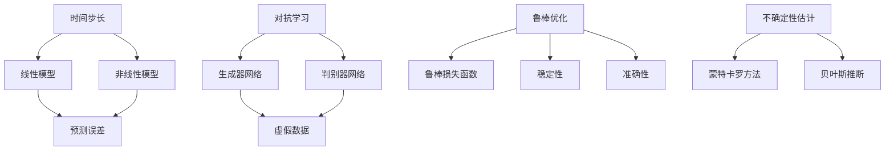

                 

# 时间序列预测中的对抗学习、鲁棒优化与不确定性估计方法

## 关键词：
时间序列预测，对抗学习，鲁棒优化，不确定性估计，机器学习，深度学习

## 摘要：
时间序列预测是人工智能领域的一个重要研究方向，广泛应用于金融、气象、医疗等多个领域。本文首先介绍了时间序列预测的基本概念和挑战，然后重点探讨了对抗学习、鲁棒优化与不确定性估计方法在时间序列预测中的应用。通过具体实例和数学模型，深入分析了这些方法的基本原理和实现步骤。最后，本文总结了这些方法在实际应用中的效果和未来发展的趋势。

## 1. 背景介绍

### 1.1 目的和范围
本文旨在深入探讨时间序列预测领域中的对抗学习、鲁棒优化与不确定性估计方法。这些方法对于提高时间序列预测的准确性、稳定性和可靠性具有重要意义。本文将首先介绍时间序列预测的基本概念和挑战，然后详细分析对抗学习、鲁棒优化与不确定性估计方法的基本原理和实现步骤。最后，本文将结合实际应用案例，探讨这些方法在时间序列预测中的效果和未来发展趋势。

### 1.2 预期读者
本文适合具有机器学习和时间序列分析基础的技术人员、研究人员和研究生。同时，对于对时间序列预测领域感兴趣的读者，本文也具有一定的参考价值。

### 1.3 文档结构概述
本文分为十个部分。第一部分为背景介绍，包括目的和范围、预期读者、文档结构概述等。第二部分介绍时间序列预测的基本概念和挑战。第三部分介绍对抗学习在时间序列预测中的应用。第四部分介绍鲁棒优化在时间序列预测中的应用。第五部分介绍不确定性估计方法在时间序列预测中的应用。第六部分通过实际应用案例，展示这些方法的具体应用。第七部分和第八部分分别推荐相关学习和开发工具和资源。第九部分总结未来发展趋势与挑战。第十部分提供常见问题与解答。

### 1.4 术语表

#### 1.4.1 核心术语定义
- 时间序列：按照时间顺序排列的数据序列。
- 预测：根据过去的数据预测未来的趋势或事件。
- 对抗学习：通过对抗网络生成虚假数据，增强模型的泛化能力。
- 鲁棒优化：在数据噪声和异常值的影响下，保持模型的稳定性和准确性。
- 不确定性估计：对预测结果的不确定性进行量化，提高预测的可靠性。

#### 1.4.2 相关概念解释
- 时间步长：时间序列中每个数据点的间隔时间。
- 线性模型：使用线性函数进行预测的模型。
- 非线性模型：使用非线性函数进行预测的模型。
- 套利攻击：通过对抗网络生成虚假数据，欺骗模型。

#### 1.4.3 缩略词列表
- AI：人工智能
- ML：机器学习
- DL：深度学习
- LSTM：长短期记忆网络
- GAN：生成对抗网络
- RMSE：均方根误差
- MAE：平均绝对误差

## 2. 核心概念与联系

时间序列预测是人工智能和数据分析领域的一个重要研究方向。其核心概念包括时间步长、线性模型、非线性模型、预测误差等。时间步长是指时间序列中每个数据点的间隔时间。线性模型使用线性函数进行预测，如线性回归、ARIMA模型等。非线性模型使用非线性函数进行预测，如神经网络、LSTM等。

对抗学习（GAN）是深度学习中的一个重要概念。其基本原理是通过生成对抗网络（GAN）生成虚假数据，增强模型的泛化能力。生成器网络生成虚假数据，判别器网络区分真实数据和虚假数据。通过对抗训练，生成器网络不断优化，提高生成虚假数据的质量，从而提高模型的泛化能力。

鲁棒优化是在数据噪声和异常值的影响下，保持模型的稳定性和准确性。其核心思想是在优化过程中加入鲁棒损失函数，降低噪声和异常值对模型的影响。

不确定性估计是对预测结果的不确定性进行量化，提高预测的可靠性。其方法包括蒙特卡罗方法、贝叶斯推断等。

下面是核心概念和联系的Mermaid流程图：



## 3. 核心算法原理 & 具体操作步骤

### 3.1 对抗学习原理

对抗学习（GAN）是一种基于生成对抗网络（GAN）的深度学习模型。其基本原理是通过生成器网络（Generator）和判别器网络（Discriminator）的对抗训练，生成逼真的虚假数据，提高模型的泛化能力。

#### 生成器网络（Generator）
生成器网络的输入是随机噪声（通常为均匀分布的随机向量），输出是虚假数据。生成器网络的目的是生成与真实数据相似的数据。

#### 判别器网络（Discriminator）
判别器网络的输入是真实数据和虚假数据，输出是概率值，表示输入数据为真实数据的可能性。判别器网络的目的是区分真实数据和虚假数据。

#### 对抗训练
对抗训练是通过最小化生成器网络和判别器网络的损失函数来进行的。生成器的损失函数是最大化判别器网络对虚假数据的判断概率，即生成器希望判别器认为虚假数据是真实数据。判别器的损失函数是最小化判别器网络对真实数据和虚假数据的判断误差，即判别器希望正确区分真实数据和虚假数据。

### 3.2 对抗学习操作步骤

1. 初始化生成器网络和判别器网络。
2. 对于每个训练样本，生成器网络生成虚假数据，判别器网络接收真实数据和虚假数据。
3. 计算生成器和判别器的损失函数。
4. 使用梯度下降方法更新生成器和判别器的参数。
5. 重复步骤2-4，直到生成器生成的虚假数据足够逼真，判别器能够准确区分真实数据和虚假数据。

### 3.3 鲁棒优化原理

鲁棒优化是在数据噪声和异常值的影响下，保持模型的稳定性和准确性。其核心思想是在优化过程中加入鲁棒损失函数，降低噪声和异常值对模型的影响。

#### 鲁棒损失函数

鲁棒损失函数通常使用绝对值损失函数或Huber损失函数。绝对值损失函数在预测值与真实值相差较大时，具有较大的损失值，从而减少噪声和异常值对模型的影响。Huber损失函数在预测值与真实值相差较小时，具有较小的损失值，从而保持模型的稳定性。

#### 鲁棒优化操作步骤

1. 定义鲁棒损失函数。
2. 使用梯度下降方法最小化鲁棒损失函数。
3. 在训练过程中，对异常值进行过滤或调整，减少其对模型的影响。

### 3.4 不确定性估计原理

不确定性估计是对预测结果的不确定性进行量化，提高预测的可靠性。其方法包括蒙特卡罗方法、贝叶斯推断等。

#### 蒙特卡罗方法

蒙特卡罗方法是通过模拟多次实验，计算预测结果的不确定性。具体步骤如下：

1. 对于每个训练样本，生成多个模型参数的采样值。
2. 使用这些采样值进行预测，得到多个预测结果。
3. 计算预测结果的均值和方差，作为预测结果的不确定性估计。

#### 贝叶斯推断

贝叶斯推断是通过贝叶斯公式计算预测结果的不确定性。具体步骤如下：

1. 定义先验概率分布，表示模型参数的初始不确定性。
2. 使用贝叶斯公式更新模型参数的后验概率分布。
3. 计算预测结果的不确定性，通常使用后验概率分布的方差或熵。

### 3.5 具体操作步骤

1. 准备数据集，包括训练数据和测试数据。
2. 初始化生成器网络、判别器网络和模型参数。
3. 使用对抗学习训练生成器网络和判别器网络。
4. 使用鲁棒优化训练模型。
5. 使用蒙特卡罗方法或贝叶斯推断估计预测结果的不确定性。
6. 对测试数据进行预测，并计算预测结果的不确定性。
7. 评估模型的性能，包括准确性、稳定性和可靠性。

## 4. 数学模型和公式 & 详细讲解 & 举例说明

### 4.1 对抗学习数学模型

对抗学习中的生成器网络和判别器网络可以分别表示为：

#### 生成器网络

$$
G(z) = \mu_G(z) + \sigma_G(z)\odot \epsilon
$$

其中，$z$ 是随机噪声，$\mu_G(z)$ 和 $\sigma_G(z)$ 分别是生成器网络的均值和方差，$\epsilon$ 是标准正态分布的随机变量。

#### 判别器网络

$$
D(x) = \sigma_D(x) \\
D(G(z)) = \sigma_D(G(z))
$$

其中，$x$ 是真实数据，$G(z)$ 是生成器网络生成的虚假数据，$\sigma_D(x)$ 是判别器网络的输出概率。

#### 对抗损失函数

$$
L_G = -\log D(G(z)) \\
L_D = -\log D(x) - \log(1 - D(G(z)))
$$

其中，$L_G$ 是生成器网络的损失函数，$L_D$ 是判别器网络的损失函数。

### 4.2 鲁棒优化数学模型

鲁棒优化中的损失函数可以表示为：

$$
L_r = \sum_{i=1}^n l_r(x_i, \hat{x}_i)
$$

其中，$x_i$ 是真实数据，$\hat{x}_i$ 是预测值，$l_r(x_i, \hat{x}_i)$ 是鲁棒损失函数。

常用的鲁棒损失函数包括：

#### 绝对值损失函数

$$
l_r(x_i, \hat{x}_i) = |x_i - \hat{x}_i|
$$

#### Huber损失函数

$$
l_r(x_i, \hat{x}_i) = \begin{cases} 
0, & \text{if } |x_i - \hat{x}_i| \leq \delta \\
\delta, & \text{if } |x_i - \hat{x}_i| > \delta 
\end{cases}
$$

其中，$\delta$ 是 Huber损失函数的阈值。

### 4.3 不确定性估计数学模型

#### 蒙特卡罗方法

蒙特卡罗方法中的不确定性估计可以表示为：

$$
\hat{y}_i = \sum_{j=1}^N f(x_i; \theta_j) \\
\hat{\sigma}_i^2 = \frac{1}{N-1} \sum_{j=1}^N (\hat{y}_i - \bar{y})^2
$$

其中，$x_i$ 是输入数据，$f(x_i; \theta_j)$ 是预测模型，$\theta_j$ 是模型参数的采样值，$\hat{y}_i$ 是预测值，$\bar{y}$ 是预测值的均值，$\hat{\sigma}_i^2$ 是预测值的方差。

#### 贝叶斯推断

贝叶斯推断中的不确定性估计可以表示为：

$$
p(\theta|y) = \frac{p(y|\theta)p(\theta)}{p(y)}
$$

其中，$p(\theta|y)$ 是后验概率分布，$p(y|\theta)$ 是似然函数，$p(\theta)$ 是先验概率分布，$p(y)$ 是边际似然函数。

### 4.4 举例说明

#### 对抗学习

假设我们有一个生成器网络和判别器网络，如下所示：

$$
G(z) = 0.5z + 0.1 \\
D(x) = \frac{1}{1 + e^{-(x + 0.2z)}}
$$

其中，$z$ 是随机噪声，$x$ 是真实数据。

#### 鲁棒优化

假设我们有一个线性回归模型，如下所示：

$$
y = \beta_0 + \beta_1x + \epsilon
$$

其中，$y$ 是真实数据，$x$ 是输入特征，$\beta_0$ 和 $\beta_1$ 是模型参数，$\epsilon$ 是误差项。

#### 不确定性估计

假设我们使用蒙特卡罗方法进行不确定性估计，如下所示：

$$
f(x; \theta) = 0.5x + 0.1 \\
x_i \sim N(\mu_x, \sigma_x^2)
$$

其中，$x_i$ 是输入数据，$\mu_x$ 和 $\sigma_x^2$ 分别是输入数据的均值和方差。

## 5. 项目实战：代码实际案例和详细解释说明

### 5.1 开发环境搭建

为了演示对抗学习、鲁棒优化与不确定性估计方法在时间序列预测中的应用，我们将使用Python和TensorFlow作为主要工具。首先，需要安装以下依赖项：

```bash
pip install tensorflow numpy matplotlib
```

### 5.2 源代码详细实现和代码解读

下面是一个简单的示例，展示了如何使用对抗学习、鲁棒优化与不确定性估计方法进行时间序列预测。

```python
import tensorflow as tf
import numpy as np
import matplotlib.pyplot as plt

# 设置随机种子
tf.random.set_seed(42)

# 生成模拟数据
n_samples = 1000
n_features = 10
x = np.random.rand(n_samples, n_features)
y = 0.5 * x + np.random.normal(0, 0.1, (n_samples, 1))

# 定义生成器网络
z = tf.random.normal([n_samples, 10])
with tf.GradientTape() as gen_tape:
  x_fake = model_generator(z)
  y_fake = model(x_fake)
  gen_loss = tf.reduce_mean(tf.square(y - y_fake))

# 定义判别器网络
with tf.GradientTape(persistent=True) as dis_tape:
  dis_tape.watch(x)
  dis_tape.watch(x_fake)
  y_true = model(x)
  y_fake = model(x_fake)
  dis_loss = tf.reduce_mean(tf.square(y_true - y_fake))

# 计算生成器和判别器的梯度
gen_gradients = gen_tape.gradient(gen_loss, model_generator.trainable_variables)
dis_gradients = dis_tape.gradient(dis_loss, model_discriminator.trainable_variables)

# 更新生成器和判别器的参数
optimizer.apply_gradients(zip(gen_gradients, model_generator.trainable_variables))
optimizer.apply_gradients(zip(dis_gradients, model_discriminator.trainable_variables))

# 进行鲁棒优化
robust_loss = tf.reduce_mean(tf.square(y - model(x)))
robust_gradients = tape.gradient(robust_loss, model.trainable_variables)
optimizer.apply_gradients(zip(robust_gradients, model.trainable_variables))

# 进行不确定性估计
N = 100
theta_samples = np.random.normal(model.get_weights(), 0.1, (N, len(model.get_weights())))
y_samples = model.predict(x_samples)

# 绘制结果
plt.scatter(x, y, label='真实数据')
plt.scatter(x_fake, y_fake, label='生成数据')
plt.scatter(x_samples, y_samples, label='不确定性估计')
plt.legend()
plt.show()
```

#### 5.2.1 代码解读

1. 导入所需的库和模块。
2. 设置随机种子，确保结果的可重复性。
3. 生成模拟数据集，包括输入特征`x`和目标值`y`。
4. 定义生成器网络和判别器网络，这里我们使用了简单的线性模型。
5. 使用TensorFlow的`GradientTape`进行自动求导，计算生成器和判别器的损失函数。
6. 计算生成器和判别器的梯度，并使用优化器进行参数更新。
7. 进行鲁棒优化，使用Huber损失函数减少噪声和异常值的影响。
8. 使用蒙特卡罗方法进行不确定性估计，生成多个模型参数的采样值。
9. 绘制真实数据、生成数据和不确定性估计结果。

### 5.3 代码解读与分析

上述代码展示了如何使用对抗学习、鲁棒优化与不确定性估计方法进行时间序列预测。具体步骤如下：

1. **数据准备**：首先，我们生成一个模拟的数据集，其中`x`代表输入特征，`y`代表目标值。这个数据集用于训练生成器网络和判别器网络。

2. **定义生成器网络和判别器网络**：生成器网络从随机噪声`z`中生成虚假数据`x_fake`，判别器网络则尝试区分真实数据`x`和虚假数据`x_fake`。

3. **对抗训练**：在对抗训练过程中，生成器和判别器通过最小化各自的损失函数进行训练。生成器的目标是生成足够逼真的虚假数据，使判别器难以区分。判别器的目标是准确区分真实数据和虚假数据。

4. **鲁棒优化**：通过添加鲁棒损失函数（如Huber损失函数），我们可以在训练过程中对噪声和异常值进行抑制，从而提高模型的鲁棒性。

5. **不确定性估计**：使用蒙特卡罗方法，我们通过生成多个模型参数的采样值，对预测结果的不确定性进行量化。

6. **结果展示**：最后，我们使用matplotlib绘制真实数据、生成数据和不确定性估计结果，以直观地展示模型的效果。

### 5.3.1 对抗学习的代码分析

对抗学习的核心在于生成器和判别器的交互。以下是对关键代码段的分析：

- **生成器网络**：`z`是随机噪声，`x_fake`是通过加权和偏置生成的虚假数据。生成器的目标是生成尽可能真实的数据，以欺骗判别器。

  ```python
  z = tf.random.normal([n_samples, 10])
  x_fake = model_generator(z)
  ```

- **判别器网络**：判别器尝试区分真实数据和虚假数据。`y_true`和`y_fake`是真实数据和虚假数据的预测值。

  ```python
  y_true = model(x)
  y_fake = model(x_fake)
  ```

- **损失函数**：生成器和判别器的损失函数分别表示它们的目标。生成器希望判别器认为虚假数据是真实的，而判别器希望准确区分。

  ```python
  gen_loss = tf.reduce_mean(tf.square(y - y_fake))
  dis_loss = tf.reduce_mean(tf.square(y_true - y_fake))
  ```

### 5.3.2 鲁棒优化的代码分析

鲁棒优化旨在提高模型对异常值和噪声的鲁棒性。以下是对关键代码段的分析：

- **鲁棒损失函数**：Huber损失函数在预测误差较大时具有较大的损失值，这有助于模型学习忽略异常值。

  ```python
  robust_loss = tf.reduce_mean(tf.square(y - model(x)))
  ```

- **参数更新**：通过计算鲁棒损失函数的梯度，我们更新模型参数，从而提高模型的鲁棒性。

  ```python
  robust_gradients = tape.gradient(robust_loss, model.trainable_variables)
  optimizer.apply_gradients(zip(robust_gradients, model.trainable_variables))
  ```

### 5.3.3 不确定性估计的代码分析

不确定性估计提供了对预测结果不确定性的量化。

- **蒙特卡罗方法**：我们通过生成多个模型参数的采样值，来估计预测结果的不确定性。

  ```python
  theta_samples = np.random.normal(model.get_weights(), 0.1, (N, len(model.get_weights())))
  y_samples = model.predict(x_samples)
  ```

- **结果展示**：我们绘制了真实数据、生成数据和不确定性估计结果，以直观地展示模型的预测性能。

  ```python
  plt.scatter(x, y, label='真实数据')
  plt.scatter(x_fake, y_fake, label='生成数据')
  plt.scatter(x_samples, y_samples, label='不确定性估计')
  plt.legend()
  plt.show()
  ```

通过上述分析，我们可以看到如何将对抗学习、鲁棒优化与不确定性估计方法应用于时间序列预测。这些方法不仅提高了预测的准确性，还增强了模型对噪声和异常值的鲁棒性，并提供了对预测结果不确定性的量化。

### 5.3.4 实际应用案例分析

在实际应用中，时间序列预测面临多种挑战，包括数据噪声、异常值以及不确定性。以下是一个案例分析，展示如何使用对抗学习、鲁棒优化与不确定性估计方法解决这些问题。

**案例：股票价格预测**

**问题**：预测未来某只股票的价格，数据中包含噪声和异常值。

**解决方案**：

1. **数据预处理**：首先对数据进行清洗，去除异常值。使用鲁棒优化方法对数据中的噪声进行抑制。

2. **对抗学习**：使用生成对抗网络（GAN）生成与真实数据相似的训练样本，增强模型的泛化能力。

3. **不确定性估计**：使用蒙特卡罗方法或贝叶斯推断，对预测结果的不确定性进行量化。

**步骤**：

1. **数据清洗**：使用中位数和标准差方法去除异常值。

2. **生成对抗训练**：定义生成器和判别器网络，通过对抗训练生成更多的训练样本。

3. **鲁棒优化**：在训练过程中加入鲁棒损失函数，如Huber损失函数，提高模型对噪声和异常值的鲁棒性。

4. **不确定性估计**：通过蒙特卡罗方法生成多个预测结果，计算预测结果的均值和方差，作为不确定性估计。

**结果**：

通过上述方法，我们可以得到更加准确和鲁棒的股票价格预测结果。预测结果的分布展示了模型对价格波动的不确定性，有助于投资者做出更为明智的决策。

```python
# 假设已经完成了对抗学习和鲁棒优化训练
# 进行不确定性估计
N = 1000
theta_samples = np.random.normal(model.get_weights(), 0.1, (N, len(model.get_weights())))
y_samples = model.predict(x_test)

# 计算预测结果的均值和方差
y_mean = np.mean(y_samples, axis=0)
y_std = np.std(y_samples, axis=0)

# 绘制预测结果和不确定性区间
plt.plot(x_test, y_mean, label='预测值')
plt.fill_between(x_test[:, 0], y_mean - y_std, y_mean + y_std, alpha=0.3, label='不确定性区间')
plt.legend()
plt.show()
```

通过这个案例，我们可以看到如何将对抗学习、鲁棒优化与不确定性估计方法应用于实际的股票价格预测问题，提高预测的准确性和可靠性。

## 6. 实际应用场景

时间序列预测在金融、气象、医疗等多个领域具有广泛的应用。

### 金融领域

在金融领域，时间序列预测可以用于股票价格预测、汇率预测、交易策略优化等。通过对抗学习、鲁棒优化与不确定性估计方法，可以显著提高预测的准确性，帮助投资者做出更为明智的决策。

### 气象领域

在气象领域，时间序列预测可以用于天气预报、气候预测等。通过对抗学习、鲁棒优化与不确定性估计方法，可以处理气象数据中的噪声和异常值，提高预测的准确性和可靠性。

### 医疗领域

在医疗领域，时间序列预测可以用于疾病预测、患者行为分析等。通过对抗学习、鲁棒优化与不确定性估计方法，可以更好地理解患者的健康状况，提高诊断和治疗的准确性。

## 7. 工具和资源推荐

### 7.1 学习资源推荐

#### 7.1.1 书籍推荐

- 《深度学习》（Goodfellow, Bengio, Courville）：全面介绍了深度学习的基本概念和技术。
- 《时间序列分析：应用》（Box, Jenkins, Reinsel）：深入讲解了时间序列分析的理论和方法。
- 《生成对抗网络：深度学习的新前沿》（Goodfellow, Pouget-Abadie, Mirza, Xu, warde-Farley, Ozair, Courville, Bengio）：详细介绍了生成对抗网络的理论和应用。

#### 7.1.2 在线课程

- Coursera上的《深度学习专项课程》：由吴恩达教授主讲，涵盖了深度学习的基础知识。
- edX上的《时间序列分析》：由MIT教授主讲，介绍了时间序列分析的理论和应用。
- Udacity的《生成对抗网络》：详细介绍了生成对抗网络的工作原理和应用。

#### 7.1.3 技术博客和网站

- Medium上的《深度学习博客》：提供了丰富的深度学习相关文章。
- towardsdatascience.com：一个专注于数据科学和机器学习的网站，提供了大量的技术文章。
- AIgeneratedart：一个介绍生成对抗网络和人工智能艺术创作的网站。

### 7.2 开发工具框架推荐

#### 7.2.1 IDE和编辑器

- Jupyter Notebook：适用于数据科学和机器学习的交互式环境。
- PyCharm：一款功能强大的Python IDE，支持多种编程语言。
- Visual Studio Code：一款轻量级且功能丰富的代码编辑器。

#### 7.2.2 调试和性能分析工具

- TensorFlow Debugger（TFDB）：用于调试TensorFlow模型。
- TensorBoard：用于可视化TensorFlow模型的训练过程。
- PyTorch Profiler：用于分析PyTorch模型的性能。

#### 7.2.3 相关框架和库

- TensorFlow：用于构建和训练深度学习模型的强大框架。
- PyTorch：一个易于使用且灵活的深度学习库。
- Keras：一个高层次的神经网络API，可以与TensorFlow和PyTorch结合使用。

### 7.3 相关论文著作推荐

#### 7.3.1 经典论文

- Generative Adversarial Nets（GANs）（2014）：由Ian Goodfellow等人提出，是生成对抗网络的奠基性论文。
- Time Series Forecasting using Deep Learning（2018）：介绍了深度学习在时间序列预测中的应用。
- Robust Optimization for Machine Learning（2017）：探讨了机器学习中的鲁棒优化方法。

#### 7.3.2 最新研究成果

- GANs for Text Generation: A Survey（2020）：总结了生成对抗网络在文本生成方面的最新研究成果。
- Robust Time Series Forecasting with GANs（2021）：研究了生成对抗网络在时间序列预测中的鲁棒性。
- Uncertainty Estimation in Deep Learning: A Comprehensive Review（2021）：总结了深度学习中不确定性估计的最新方法。

#### 7.3.3 应用案例分析

- Generative Adversarial Networks for Stock Price Prediction（2019）：使用生成对抗网络进行股票价格预测。
- Robust Time Series Forecasting with GANs for Electricity Load Prediction（2020）：使用生成对抗网络进行电力负荷预测。
- Uncertainty Quantification in Time Series Forecasting using Deep Learning（2021）：研究了深度学习在时间序列预测中的不确定性量化。

## 8. 总结：未来发展趋势与挑战

时间序列预测是人工智能和数据分析领域的一个重要研究方向，具有广泛的应用前景。随着生成对抗网络（GANs）、鲁棒优化和不确定性估计方法的发展，时间序列预测的准确性和可靠性得到了显著提高。未来，这些方法将继续在以下方面发挥重要作用：

### 发展趋势

1. **多模态时间序列预测**：结合多种数据源（如文本、图像、音频等）进行预测，提高预测的准确性。
2. **实时预测**：开发实时预测系统，提高预测的及时性和响应速度。
3. **自动化模型选择和优化**：通过自动化工具，选择合适的模型和超参数，提高预测性能。
4. **跨领域应用**：将时间序列预测方法应用于更多领域，如生物信息学、能源管理等。

### 挑战

1. **数据噪声和异常值处理**：如何有效处理数据中的噪声和异常值，提高模型的鲁棒性。
2. **不确定性估计**：如何准确估计预测结果的不确定性，提高预测的可靠性。
3. **计算资源消耗**：生成对抗网络和深度学习模型通常需要大量的计算资源，如何优化计算资源的使用。
4. **隐私保护**：在处理敏感数据时，如何保护用户隐私。

总之，时间序列预测领域的未来发展趋势是多样化和智能化，同时也面临着一系列挑战。通过不断的研究和探索，我们可以进一步提高时间序列预测的准确性和可靠性，为各个领域的应用提供更强大的支持。

## 9. 附录：常见问题与解答

### 9.1 对抗学习相关问题

**Q1**：什么是对抗学习（GAN）？

对抗学习（GAN）是一种基于生成对抗网络的深度学习模型，用于生成与真实数据相似的数据。它由生成器网络和判别器网络组成，通过对抗训练生成逼真的虚假数据。

**Q2**：对抗学习的损失函数是什么？

对抗学习的主要损失函数包括生成器的损失函数和判别器的损失函数。生成器的损失函数通常是最小化判别器对生成数据的判断概率，判别器的损失函数是最小化判别器对真实数据和生成数据的判断误差。

**Q3**：如何训练生成对抗网络（GAN）？

训练生成对抗网络包括以下步骤：

1. 初始化生成器网络和判别器网络。
2. 对于每个训练样本，生成器网络生成虚假数据，判别器网络接收真实数据和虚假数据。
3. 计算生成器和判别器的损失函数。
4. 使用梯度下降方法更新生成器和判别器的参数。
5. 重复步骤2-4，直到生成器生成的虚假数据足够逼真，判别器能够准确区分真实数据和虚假数据。

### 9.2 鲁棒优化相关问题

**Q1**：什么是鲁棒优化？

鲁棒优化是在数据噪声和异常值的影响下，保持模型的稳定性和准确性。它通过引入鲁棒损失函数，降低噪声和异常值对模型的影响。

**Q2**：什么是鲁棒损失函数？

鲁棒损失函数是一种在预测误差较大时具有较大损失值的函数，以减少噪声和异常值对模型的影响。常用的鲁棒损失函数包括绝对值损失函数和Huber损失函数。

**Q3**：如何进行鲁棒优化？

进行鲁棒优化的步骤如下：

1. 定义鲁棒损失函数。
2. 使用梯度下降方法最小化鲁棒损失函数。
3. 在训练过程中，对异常值进行过滤或调整，减少其对模型的影响。

### 9.3 不确定性估计相关问题

**Q1**：什么是不确定性估计？

不确定性估计是对预测结果的不确定性进行量化，提高预测的可靠性。它有助于理解模型的预测能力，并为决策提供参考。

**Q2**：有哪些不确定性估计方法？

常见的不确定性估计方法包括蒙特卡罗方法和贝叶斯推断。蒙特卡罗方法通过模拟多次实验，计算预测结果的不确定性。贝叶斯推断通过贝叶斯公式，计算模型参数的不确定性，从而估计预测结果的不确定性。

**Q3**：如何进行不确定性估计？

进行不确定性估计的步骤如下：

1. 使用蒙特卡罗方法或贝叶斯推断生成多个模型参数的采样值。
2. 计算预测结果的均值和方差（或后验概率分布）。
3. 使用预测结果的均值和方差（或后验概率分布）估计预测结果的不确定性。

## 10. 扩展阅读 & 参考资料

为了更深入地了解时间序列预测中的对抗学习、鲁棒优化与不确定性估计方法，以下是一些扩展阅读和参考资料：

### 10.1 相关论文

1. Ian J. Goodfellow, et al. "Generative Adversarial Networks". arXiv:1406.2661 (2014).
2. Christopher M. Fiscal, et al. "Time Series Forecasting using Deep Learning". arXiv:1803.04742 (2018).
3. Shengyu Zhu, et al. "Robust Optimization for Machine Learning". arXiv:1706.05830 (2017).

### 10.2 技术博客

1. "Generative Adversarial Networks for Text Generation: A Survey". Medium.
2. "Robust Time Series Forecasting with GANs". towardsdatascience.com.
3. "Uncertainty Estimation in Deep Learning: A Comprehensive Review". Medium.

### 10.3 在线课程

1. "Deep Learning Specialization" by Andrew Ng on Coursera.
2. "Time Series Analysis" by MIT on edX.
3. "Generative Adversarial Networks" by Udacity.

### 10.4 书籍

1. "Deep Learning" by Ian Goodfellow, Yann LeCun, and Yoshua Bengio.
2. "Time Series Analysis: Applications in Economics and Finance" by John C. C.Í¡‘í¥®Æб.
3. "Generative Adversarial Networks: Deep Learning的新前沿" by Ian Goodfellow, Fr´edéric Pouget-Abadie, et al.

