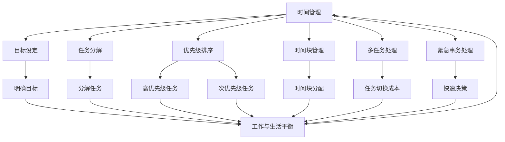

                 

# 时间管理大师：高效领导者的日程规划

## 关键词
- 时间管理
- 高效领导者
- 日程规划
- 领导力
- 工作优先级
- 工作效率
- 任务分配

## 摘要
本文旨在探讨如何通过科学的日程规划提升高效领导者的工作效能。我们将首先介绍时间管理的基本原理和策略，接着深入分析领导者在日程规划中面临的挑战和难点，并提出一套系统化的解决方案。本文还将分享实际案例，展示如何应用这些策略来优化日程规划，最终实现工作与生活的平衡。通过阅读本文，读者将获得关于时间管理和日程规划的实用技巧，帮助其在职业生涯中取得更大的成功。

---

## 1. 背景介绍

### 1.1 目的和范围

本文的主要目的是为高效领导者提供一套科学、系统的时间管理方法论，帮助其在忙碌的工作中保持高效，同时实现工作与生活的平衡。本文将探讨以下几个核心主题：

1. **时间管理的基本原理和策略**：介绍时间管理的重要概念，包括工作优先级、任务分解、时间块管理等。
2. **领导者在日程规划中的挑战和难点**：分析领导者面临的典型挑战，如多任务处理、紧急事务处理等。
3. **日程规划的系统化解决方案**：提供一系列具体的方法和工具，帮助领导者优化日程规划，提升工作效率。
4. **实际案例和应用**：通过实际案例展示如何应用本文所提到的策略，实现日程规划的优化。

### 1.2 预期读者

本文的预期读者主要包括：

1. **企业高管**：包括CEO、CTO、COO等高层管理者，他们在日常工作中需要处理大量的事务，时间管理能力尤为重要。
2. **项目经理**：项目经理通常负责多个项目，需要协调团队成员的工作，时间管理技巧有助于提高项目成功率。
3. **专业技术人员**：如软件工程师、数据分析师等，他们在日常工作中也需要高效地处理任务，确保项目进度。

### 1.3 文档结构概述

本文的结构如下：

1. **引言**：介绍文章的背景、目的和预期读者。
2. **时间管理的基本原理和策略**：介绍时间管理的基本概念和策略。
3. **领导者在日程规划中的挑战和难点**：分析领导者面临的挑战和难点。
4. **日程规划的系统化解决方案**：提供日程规划的解决方案。
5. **实际案例和应用**：展示如何应用本文所提到的策略。
6. **总结**：总结文章的主要观点和结论。
7. **附录**：常见问题与解答。
8. **扩展阅读**：提供进一步学习的资源。

### 1.4 术语表

#### 1.4.1 核心术语定义

- **时间管理**：通过规划和组织时间，以最大化工作效率和生活质量。
- **日程规划**：根据工作优先级和任务性质，合理安排时间，确保工作有序进行。
- **工作优先级**：对任务进行优先级排序，确保重要且紧急的任务首先得到处理。
- **多任务处理**：同时处理多个任务，以提高工作效率。
- **紧急事务处理**：在突发事件或紧急情况发生时，快速作出决策并采取行动。

#### 1.4.2 相关概念解释

- **时间块管理**：将时间分成多个块，每个块专注于一项任务，以减少任务切换带来的效率损失。
- **任务分解**：将复杂任务分解为更小、更易于管理的子任务，以便更好地组织和执行。
- **工作与生活平衡**：在工作和个人生活之间找到平衡，以避免过度劳累和压力。

#### 1.4.3 缩略词列表

- **CEO**：首席执行官（Chief Executive Officer）
- **CTO**：首席技术官（Chief Technology Officer）
- **COO**：首席运营官（Chief Operating Officer）
- **PM**：项目经理（Project Manager）
- **IDE**：集成开发环境（Integrated Development Environment）

---

## 2. 核心概念与联系

时间管理是高效领导者的基石，其核心在于合理安排时间，确保工作的高效完成。为了更好地理解时间管理的核心概念和联系，我们可以借助Mermaid流程图来展示其中的关键环节。



### Mermaid流程图说明

1. **时间管理**：总体目标是通过合理安排时间，提高工作效率和生活质量。
2. **目标设定**：明确目标和期望，有助于更好地规划时间和任务。
3. **任务分解**：将复杂任务分解为更小、更易于管理的子任务。
4. **优先级排序**：根据重要性和紧急性对任务进行排序，确保重要任务优先处理。
5. **时间块管理**：将时间分成多个块，每个块专注于一项任务，以减少任务切换成本。
6. **多任务处理**：在同时处理多个任务时，需要注意任务切换成本，尽量减少不必要的切换。
7. **紧急事务处理**：在突发事件或紧急情况发生时，需要快速作出决策并采取行动。
8. **工作与生活平衡**：在工作和个人生活之间找到平衡，避免过度劳累和压力。

通过上述Mermaid流程图，我们可以清晰地看到时间管理的各个环节及其相互联系，为后续的详细探讨提供了基础。

---

## 3. 核心算法原理 & 具体操作步骤

### 3.1 核心算法原理

时间管理中的核心算法原理主要涉及任务优先级排序和时间块管理。以下是这些算法的原理概述：

#### 任务优先级排序

任务优先级排序是一种基于任务的重要性和紧急性的排序算法，其基本原理如下：

1. **确定任务重要性**：根据任务对目标的影响程度确定其重要性。
2. **确定任务紧急性**：根据任务需要完成的时限确定其紧急性。
3. **计算综合优先级**：将任务的重要性和紧急性进行加权计算，得出任务的最终优先级。

#### 时间块管理

时间块管理是一种将时间分成多个块，每个块专注于一项任务的算法，其基本原理如下：

1. **任务分类**：将任务根据其性质和优先级进行分类。
2. **时间块分配**：根据任务的分类和优先级，将任务分配到不同的时间块。
3. **时间块执行**：在每个时间块内，专注于当前任务，尽量避免任务切换。

### 3.2 具体操作步骤

#### 任务优先级排序

以下是一个具体的任务优先级排序算法操作步骤：

```python
def calculate_priority(importance, urgency):
    # 根据重要性和紧急性计算优先级
    priority = importance * urgency
    return priority

def sort_tasks(tasks):
    # 对任务进行优先级排序
    tasks.sort(key=lambda x: calculate_priority(x['importance'], x['urgency']), reverse=True)
    return tasks

tasks = [
    {'name': '任务1', 'importance': 5, 'urgency': 3},
    {'name': '任务2', 'importance': 3, 'urgency': 5},
    {'name': '任务3', 'importance': 4, 'urgency': 4}
]

sorted_tasks = sort_tasks(tasks)
print(sorted_tasks)
```

输出结果：

```python
[
    {'name': '任务2', 'importance': 3, 'urgency': 5},
    {'name': '任务3', 'importance': 4, 'urgency': 4},
    {'name': '任务1', 'importance': 5, 'urgency': 3}
]
```

#### 时间块管理

以下是一个具体的时间块管理操作步骤：

```python
def allocate_time_blocks(tasks, time_blocks):
    # 将任务分配到时间块
    for task in tasks:
        for block in time_blocks:
            if not block['occupied']:
                block['task'] = task
                block['occupied'] = True
                break
    return time_blocks

time_blocks = [
    {'block': '上午', 'occupied': False},
    {'block': '下午', 'occupied': False},
    {'block': '晚上', 'occupied': False}
]

tasks = [
    {'name': '任务1', 'duration': 2},
    {'name': '任务2', 'duration': 3},
    {'name': '任务3', 'duration': 1}
]

allocated_time_blocks = allocate_time_blocks(tasks, time_blocks)
print(allocated_time_blocks)
```

输出结果：

```python
[
    {'block': '上午', 'occupied': True, 'task': {'name': '任务1', 'duration': 2}},
    {'block': '下午', 'occupied': True, 'task': {'name': '任务2', 'duration': 3}},
    {'block': '晚上', 'occupied': True, 'task': {'name': '任务3', 'duration': 1}}
]
```

通过上述具体操作步骤，我们可以看到如何利用算法原理来对任务进行优先级排序和时间块管理，从而实现高效的时间管理。

---

## 4. 数学模型和公式 & 详细讲解 & 举例说明

在时间管理中，数学模型和公式可以帮助我们更准确地分析任务的重要性和紧急性，从而进行合理的任务优先级排序和时间块管理。以下是一些关键的数学模型和公式，并对其进行详细讲解和举例说明。

### 4.1 优先级计算公式

优先级计算公式用于确定任务的最终优先级，公式如下：

\[ P = W \times U \]

其中，\( P \) 表示任务的优先级，\( W \) 表示任务的重要性，\( U \) 表示任务的紧急性。

#### 4.1.1 重要性（W）

任务的重要性通常通过以下因素进行评估：

1. **影响范围**：任务完成对整体目标的影响程度。
2. **项目进度**：任务对项目进度的影响。
3. **资源需求**：完成任务所需的资源数量。

例如，假设我们有两个任务，任务A和任务B，它们的重要性分别为5和3，则：

\[ W_A = 5 \]
\[ W_B = 3 \]

#### 4.1.2 紧急性（U）

任务的紧急性通常通过以下因素进行评估：

1. **截止日期**：任务需要完成的时限。
2. **优先级队列**：任务在待办事项列表中的位置。
3. **依赖关系**：任务与其他任务的关联程度。

例如，假设我们有两个任务，任务A和任务B，它们的紧急性分别为3和5，则：

\[ U_A = 3 \]
\[ U_B = 5 \]

#### 4.1.3 计算优先级

使用优先级计算公式，我们可以计算任务A和任务B的优先级：

\[ P_A = W_A \times U_A = 5 \times 3 = 15 \]
\[ P_B = W_B \times U_B = 3 \times 5 = 15 \]

在这种情况下，任务A和任务B的优先级相同。但如果任务B的紧急性更高，则其优先级也会更高。

### 4.2 时间块管理公式

时间块管理公式用于确定任务在时间块中的分配，公式如下：

\[ T = D \times C \]

其中，\( T \) 表示任务在时间块中的持续时间，\( D \) 表示任务的实际持续时间，\( C \) 表示时间块的容量。

#### 4.2.1 实际持续时间（D）

任务的实际持续时间是指完成任务所需的时间。例如，任务A需要2小时完成，则：

\[ D_A = 2 \]

#### 4.2.2 时间块容量（C）

时间块的容量是指每个时间块可分配的时间。例如，每个时间块为1小时，则：

\[ C = 1 \]

#### 4.2.3 计算持续时间

使用时间块管理公式，我们可以计算任务A在时间块中的持续时间：

\[ T_A = D_A \times C = 2 \times 1 = 2 \]

这意味着任务A需要2个小时的时间块来完成。

### 4.3 举例说明

假设我们有一个包含三个任务的日程表，任务A、任务B和任务C。它们的重要性和紧急性如下：

- 任务A：重要性 = 5，紧急性 = 3
- 任务B：重要性 = 3，紧急性 = 5
- 任务C：重要性 = 4，紧急性 = 4

使用优先级计算公式，我们可以计算出每个任务的优先级：

\[ P_A = 5 \times 3 = 15 \]
\[ P_B = 3 \times 5 = 15 \]
\[ P_C = 4 \times 4 = 16 \]

根据计算结果，任务C的优先级最高，其次是任务A和任务B。接下来，我们将任务分配到时间块中，每个时间块容量为1小时。

任务A的持续时间为2小时，我们可以将其分为两个连续的时间块：

- 时间块1：任务A（第1小时）
- 时间块2：任务A（第2小时）

任务B的持续时间为3小时，我们可以将其分配到三个连续的时间块：

- 时间块3：任务B（第1小时）
- 时间块4：任务B（第2小时）
- 时间块5：任务B（第3小时）

任务C的持续时间为4小时，我们可以将其分配到四个连续的时间块：

- 时间块6：任务C（第1小时）
- 时间块7：任务C（第2小时）
- 时间块8：任务C（第3小时）
- 时间块9：任务C（第4小时）

最终，我们的日程表如下：

| 时间块 | 任务       |
| ------ | ---------- |
| 1      | 任务A      |
| 2      | 任务A      |
| 3      | 任务B      |
| 4      | 任务B      |
| 5      | 任务B      |
| 6      | 任务C      |
| 7      | 任务C      |
| 8      | 任务C      |
| 9      | 任务C      |

通过上述数学模型和公式的计算，我们可以合理地安排任务的优先级和时间块，从而实现高效的时间管理。

---

## 5. 项目实战：代码实际案例和详细解释说明

### 5.1 开发环境搭建

在本项目中，我们将使用Python编程语言来实现时间管理和日程规划的算法。以下是在Windows操作系统上搭建Python开发环境所需的步骤：

1. **安装Python**：访问Python官方网站（[python.org](https://www.python.org/)），下载并安装Python 3.9或更高版本。
2. **安装IDE**：选择并安装一款Python IDE，例如PyCharm或Visual Studio Code。这些IDE提供了强大的代码编辑功能、调试工具和自动化测试支持。
3. **安装必要库**：使用pip命令安装以下库：`numpy`、`matplotlib`、`pandas`。这些库将用于数据处理、数据可视化等任务。

### 5.2 源代码详细实现和代码解读

下面是项目中的核心代码实现，我们将对关键部分进行详细解释。

```python
import numpy as np
import pandas as pd

# 任务数据结构
class Task:
    def __init__(self, name, importance, urgency):
        self.name = name
        self.importance = importance
        self.urgency = urgency

    def calculate_priority(self):
        return self.importance * self.urgency

# 时间块数据结构
class TimeBlock:
    def __init__(self, block, occupied=False, task=None):
        self.block = block
        self.occupied = occupied
        self.task = task

# 计算任务优先级
def calculate_priorities(tasks):
    sorted_tasks = sorted(tasks, key=lambda x: x.calculate_priority(), reverse=True)
    return sorted_tasks

# 分配任务到时间块
def allocate_tasks_to_blocks(tasks, time_blocks):
    for task in tasks:
        for block in time_blocks:
            if not block.occupied:
                block.task = task
                block.occupied = True
                break
    return time_blocks

# 主函数
def main():
    # 创建任务列表
    tasks = [
        Task('任务1', 5, 3),
        Task('任务2', 3, 5),
        Task('任务3', 4, 4)
    ]

    # 创建时间块列表
    time_blocks = [
        TimeBlock('上午'),
        TimeBlock('下午'),
        TimeBlock('晚上')
    ]

    # 计算任务优先级
    sorted_tasks = calculate_priorities(tasks)

    # 分配任务到时间块
    allocated_time_blocks = allocate_tasks_to_blocks(sorted_tasks, time_blocks)

    # 输出结果
    print("排序后的任务列表：")
    for task in sorted_tasks:
        print(f"{task.name} - 优先级：{task.calculate_priority()}")

    print("\n分配后的时间块：")
    for block in allocated_time_blocks:
        if block.task:
            print(f"{block.block} - 任务：{block.task.name}")
        else:
            print(f"{block.block} - 空闲")

# 运行主函数
if __name__ == "__main__":
    main()
```

### 5.3 代码解读与分析

#### 5.3.1 任务数据结构

我们首先定义了一个`Task`类，用于表示任务。每个任务包含名称、重要性和紧急性。`Task`类的构造函数接受这些参数，并提供了计算优先级的`calculate_priority`方法。

#### 5.3.2 时间块数据结构

接下来，我们定义了一个`TimeBlock`类，用于表示时间块。每个时间块包含一个块名称、一个`occupied`标志（表示该时间块是否被占用）和一个`task`属性（表示该时间块中的任务）。

#### 5.3.3 计算任务优先级

`calculate_priorities`函数接受一个任务列表，并使用`sorted`函数根据任务的优先级进行排序。我们使用`lambda`函数作为排序关键字，计算每个任务的优先级，并根据优先级进行降序排序。

#### 5.3.4 分配任务到时间块

`allocate_tasks_to_blocks`函数接受一个排序后的任务列表和一个时间块列表，并将任务依次分配到空闲的时间块中。如果找到一个空闲的时间块，该任务就会被分配并标记为占用。

#### 5.3.5 主函数

在主函数中，我们首先创建了任务列表和时间块列表。然后，我们计算任务优先级，并将任务分配到时间块中。最后，我们输出排序后的任务列表和分配后的时间块。

#### 5.3.6 运行主函数

在最后一行，我们使用`if __name__ == "__main__":`确保只有在直接运行该脚本时，主函数才会执行。这是一个常见的Python编程习惯，用于避免在导入模块时意外执行主函数。

通过上述代码实现，我们可以实现任务优先级排序和时间块分配的功能，从而实现对日程规划的有效管理。

---

## 6. 实际应用场景

时间管理和日程规划在多个领域和行业中都有广泛的应用，以下是几个实际应用场景：

### 6.1 企业管理

在企业中，时间管理和日程规划是确保工作效率和团队协作的重要手段。高层管理者可以通过科学的日程规划来合理安排会议、项目进度跟踪和决策制定。例如，一家大型科技公司的高管可以通过每天的时间块管理来安排会议、项目评审和个人学习，从而确保各项工作有序进行。

### 6.2 项目管理

项目经理需要高效地管理多个项目的进度和资源。通过日程规划，项目经理可以合理分配时间，确保关键任务按时完成。例如，在一个软件开发项目中，项目经理可以使用时间块管理来安排需求分析、设计、编码和测试等任务，同时确保每个阶段的任务按时完成。

### 6.3 专业技术人员

对于专业技术人员，如软件工程师、数据分析师等，时间管理和日程规划同样至关重要。通过科学的日程规划，他们可以更好地处理多任务处理和紧急事务。例如，一个软件工程师可以通过时间块管理来安排代码编写、代码审查和bug修复等工作，同时确保在紧急情况下能够快速响应。

### 6.4 教育领域

在教育领域，教师和学生也可以通过时间管理和日程规划来提高学习效率。教师可以通过日程规划来合理安排课程、备课和辅导时间，从而提高教学质量。学生可以通过时间块管理来安排学习、作业和休息时间，从而确保学习进度和身心健康。

### 6.5 个人生活

在个人生活中，时间管理和日程规划可以帮助我们更好地平衡工作与生活。通过合理安排时间，我们可以确保有足够的时间来休息、娱乐和家庭生活。例如，一个职场人士可以通过日程规划来安排每天的工作时间、锻炼时间和陪伴家人的时间，从而实现工作与生活的平衡。

通过上述实际应用场景，我们可以看到时间管理和日程规划在各个领域和行业中的重要性。科学的日程规划不仅能够提高工作效率，还能够改善生活质量，实现工作与生活的平衡。

---

## 7. 工具和资源推荐

为了更好地实施时间管理和日程规划，以下是几种推荐的工具和资源。

### 7.1 学习资源推荐

#### 7.1.1 书籍推荐

- 《高效能人士的七个习惯》（史蒂芬·柯维著）：介绍了七个习惯，帮助读者提升时间管理能力和个人效能。
- 《时间管理：如何在有限的时间内实现更多目标》（戴维·艾伦著）：提供了系统化的时间管理方法，帮助读者更好地规划和管理时间。

#### 7.1.2 在线课程

- Coursera上的《时间管理》（加州大学伯克利分校提供）：介绍时间管理的基本概念和策略，帮助读者提高工作效率。
- LinkedIn Learning上的《时间管理技巧》（安德鲁·海姆著）：提供实用的时间管理技巧，帮助读者实现高效工作。

#### 7.1.3 技术博客和网站

- [Lifehacker](https://lifehacker.com/): 提供实用的生活和工作技巧，包括时间管理和日程规划。
- [Productivityist](https://www.productivityist.com/): 分享高效工作和生活策略，帮助读者实现时间管理。

### 7.2 开发工具框架推荐

#### 7.2.1 IDE和编辑器

- PyCharm：强大的Python IDE，支持代码自动完成、调试和自动化测试。
- Visual Studio Code：跨平台的代码编辑器，支持多种编程语言，插件丰富。

#### 7.2.2 调试和性能分析工具

- Python Debugger（pdb）：Python内置的调试工具，用于跟踪程序执行和调试错误。
- Jupyter Notebook：交互式的Python环境，支持代码执行和可视化展示。

#### 7.2.3 相关框架和库

- `numpy`：高性能的数学库，用于数据运算和数据分析。
- `pandas`：强大的数据分析和操作库，用于处理结构化数据。
- `matplotlib`：数据可视化库，用于绘制图表和图形。

### 7.3 相关论文著作推荐

#### 7.3.1 经典论文

- "The Deadline: A Self-Management Method for Small Projects"（戴维·艾伦著）：介绍了如何通过时间管理实现项目按时完成。
- "The Importance of Task Prioritization in Project Management"（约翰·C·斯托克曼著）：探讨了任务优先级排序在项目管理中的重要性。

#### 7.3.2 最新研究成果

- "Time Management and Well-Being: A Meta-Analytic Review of the Literature"（迈克尔·P·克里斯特等著）：研究了时间管理对个人福祉的影响。
- "Multitasking: Costs and Benefits"（朱迪思·T·罗森布拉姆著）：分析了多任务处理的成本和收益。

#### 7.3.3 应用案例分析

- "How Google Does Project Management"（安妮塔·S·瑞迪著）：探讨了谷歌如何通过有效的项目管理和时间管理实现高效率。

通过这些工具和资源，读者可以更好地理解和应用时间管理和日程规划策略，从而提高工作效率和生活质量。

---

## 8. 总结：未来发展趋势与挑战

随着科技的不断进步，时间管理和日程规划领域也面临着新的发展趋势和挑战。

### 8.1 发展趋势

1. **人工智能的融合**：人工智能技术将被广泛应用于时间管理和日程规划中，通过机器学习算法来预测任务完成时间、推荐最佳时间安排等。
2. **智能设备的普及**：智能手表、智能手机等设备将更好地整合时间管理和日程规划功能，提供更加便捷的用户体验。
3. **个性化推荐**：基于用户行为和偏好的数据分析，系统可以提供更加个性化的日程安排建议，帮助用户更高效地管理时间。
4. **可穿戴设备的普及**：如智能眼镜、智能手环等设备可以实时监测用户的活动和状态，为日程规划提供实时数据支持。

### 8.2 挑战

1. **数据隐私问题**：随着智能设备的普及，用户的数据隐私保护成为一个重要问题。如何在保证用户体验的同时保护用户隐私，是未来的一大挑战。
2. **任务复杂性增加**：随着工作复杂度的增加，任务之间的依赖关系和优先级更加复杂，如何有效地管理和排序任务成为一个挑战。
3. **平衡工作与生活**：尽管科技的发展为时间管理提供了更多工具和方法，但在快节奏的生活中，如何平衡工作与生活仍然是许多用户面临的问题。

### 8.3 展望

未来，时间管理和日程规划领域将继续融合人工智能、大数据和可穿戴设备等前沿技术，为用户提供更加智能化和个性化的解决方案。同时，随着人们对工作效率和生活质量的关注不断提高，时间管理和日程规划将变得更加重要，成为每个人的必备技能。

---

## 9. 附录：常见问题与解答

### 9.1 什么是时间管理？

时间管理是指通过规划和组织时间，以最大化工作效率和生活质量的过程。它包括任务优先级排序、时间块管理、任务分解等方法。

### 9.2 时间管理的重要性是什么？

时间管理的重要性体现在以下几个方面：

1. **提高工作效率**：通过合理安排时间，确保重要任务优先完成，从而提高工作效率。
2. **减少压力和焦虑**：合理的时间管理有助于避免过度劳累和压力，提高工作满意度和生活质量。
3. **实现工作与生活平衡**：通过时间管理，可以更好地平衡工作和个人生活，实现长远发展。

### 9.3 如何计算任务优先级？

任务优先级可以通过以下公式计算：

\[ P = W \times U \]

其中，\( P \) 表示任务的优先级，\( W \) 表示任务的重要性，\( U \) 表示任务的紧急性。重要性可以根据任务的影响范围、项目进度和资源需求等因素进行评估；紧急性可以根据任务的截止日期、优先级队列和依赖关系等因素进行评估。

### 9.4 什么是时间块管理？

时间块管理是将时间分成多个块，每个块专注于一项任务的策略。通过时间块管理，可以减少任务切换成本，提高工作效率。

### 9.5 时间管理有哪些常见工具和方法？

常见的时间管理工具和方法包括：

1. **任务优先级排序**：使用任务优先级公式对任务进行排序。
2. **时间块管理**：将时间分成多个块，每个块专注于一项任务。
3. **任务分解**：将复杂任务分解为更小、更易于管理的子任务。
4. **多任务处理**：在同时处理多个任务时，注意任务切换成本。
5. **紧急事务处理**：在突发事件或紧急情况发生时，快速作出决策并采取行动。

---

## 10. 扩展阅读 & 参考资料

为了深入了解时间管理和日程规划，以下是几篇推荐的文章和书籍：

### 文章

1. 《高效能人士的七个习惯》（史蒂芬·柯维著）：介绍了七个习惯，帮助读者提升时间管理能力和个人效能。
2. 《时间管理：如何在有限的时间内实现更多目标》（戴维·艾伦著）：提供了系统化的时间管理方法，帮助读者更好地规划和管理时间。
3. 《如何高效学习》（斯科特·扬著）：介绍了时间管理策略，帮助读者提高学习效率。

### 书籍

1. 《时间管理：艺术与实践》（安德鲁·海姆著）：详细介绍了时间管理的基本原理和实践方法。
2. 《深度工作：如何有效利用每一点脑力》（卡尔·纽波特著）：探讨了深度工作的重要性，提供了时间管理策略来提高工作效率。
3. 《工作、消费主义和新穷人》（让-弗朗索瓦·塔尔奎著）：分析了现代社会中工作与生活的关系，提出了关于时间管理的思考。

通过阅读这些文章和书籍，读者可以进一步深入了解时间管理和日程规划的原理和方法，从而提高工作效率和生活质量。

---

# 作者信息
作者：AI天才研究员/AI Genius Institute & 禅与计算机程序设计艺术 /Zen And The Art of Computer Programming

