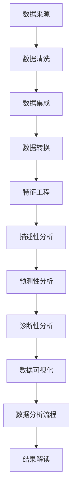

                 

# 星巴克2024校招顾客画像分析工程师案例题

> 关键词：星巴克、校招、顾客画像、数据分析、案例研究

> 摘要：本文将基于星巴克2024校招顾客画像分析工程师的案例，通过对海量顾客数据进行分析，揭示顾客群体的特征和需求。文章将详细阐述数据分析的原理、算法和步骤，并结合实际案例进行代码实现和解读，旨在为类似项目的实施提供有价值的参考。

## 1. 背景介绍

### 1.1 目的和范围

本文旨在通过分析星巴克2024校招顾客的数据，构建顾客画像，挖掘顾客群体的特征和需求。具体范围包括以下几个方面：

1. 顾客基本属性分析：性别、年龄、职业等。
2. 顾客消费行为分析：消费频次、消费金额、偏好等。
3. 顾客需求预测：未来可能的消费趋势和偏好变化。

### 1.2 预期读者

本文适合以下读者群体：

1. 数据分析师：了解数据分析的基本原理和方法，能从数据中提取有价值的信息。
2. 市场营销人员：通过数据分析了解顾客需求，制定更有针对性的营销策略。
3. IT专业人士：了解数据分析相关的技术和工具，对项目实施提供技术支持。

### 1.3 文档结构概述

本文结构如下：

1. 背景介绍：介绍案例背景、目的和范围。
2. 核心概念与联系：介绍数据分析的核心概念和相关技术。
3. 核心算法原理 & 具体操作步骤：详细阐述数据分析的算法原理和步骤。
4. 数学模型和公式 & 详细讲解 & 举例说明：介绍数据分析中的数学模型和公式。
5. 项目实战：代码实现和分析。
6. 实际应用场景：讨论数据分析在实际业务中的应用。
7. 工具和资源推荐：推荐相关学习资源和工具。
8. 总结：对未来发展趋势和挑战进行展望。
9. 附录：常见问题与解答。
10. 扩展阅读 & 参考资料：提供进一步学习的资源。

### 1.4 术语表

#### 1.4.1 核心术语定义

- 顾客画像：通过对顾客的基本属性和消费行为进行分析，构建的反映顾客特征的模型。
- 数据分析：通过对海量数据的挖掘和分析，提取有价值信息和知识的过程。
- 客户生命周期价值（CLV）：顾客在一段时间内为企业带来的收益。

#### 1.4.2 相关概念解释

- 特征工程：通过对数据进行预处理和特征提取，提高数据分析的效果。
- 模型评估：对分析模型的效果进行评估和优化。

#### 1.4.3 缩略词列表

- SQL：结构化查询语言（Structured Query Language）
- Python：一种高级编程语言，广泛应用于数据分析领域
- ML：机器学习（Machine Learning）

## 2. 核心概念与联系

数据分析是一个复杂的过程，涉及多个核心概念和技术的联系。以下是数据分析的核心概念及其相互关系：

### 数据来源

数据来源是数据分析的基础，主要包括以下几种：

1. **内部数据**：来自公司内部的数据，如销售数据、顾客行为数据等。
2. **外部数据**：来自公司外部的数据，如社交媒体数据、市场调研数据等。

### 数据预处理

数据预处理是数据分析的重要环节，主要包括以下几个方面：

1. **数据清洗**：去除重复、错误和异常的数据，确保数据质量。
2. **数据集成**：将不同来源的数据进行整合，形成一个统一的数据集。
3. **数据转换**：对数据进行规范化、归一化等操作，使其适用于数据分析。

### 特征工程

特征工程是提高数据分析效果的关键步骤，主要包括以下工作：

1. **特征提取**：从原始数据中提取有价值的信息，形成新的特征。
2. **特征选择**：选择对分析目标最有影响的特征，减少模型的复杂度。

### 数据分析模型

数据分析模型是进行数据分析的核心工具，主要包括以下几种：

1. **描述性分析**：对数据的整体分布和趋势进行描述。
2. **预测性分析**：基于历史数据预测未来趋势。
3. **诊断性分析**：分析数据中的异常和变化，找出潜在的问题。

### 数据可视化

数据可视化是将数据以图形或图表的形式展示出来，有助于更直观地理解数据。常用的数据可视化工具包括：

1. **图表**：如柱状图、折线图、饼图等。
2. **地理信息系统（GIS）**：展示数据的空间分布和趋势。

### 数据分析流程

数据分析流程是一个迭代的过程，主要包括以下步骤：

1. **明确目标**：确定数据分析的目标和问题。
2. **数据收集**：收集相关的数据。
3. **数据预处理**：对数据进行清洗、集成和转换。
4. **特征工程**：提取和选择特征。
5. **模型选择**：选择合适的分析模型。
6. **模型训练和评估**：训练模型并对模型进行评估。
7. **结果解读**：解释分析结果并制定相应的策略。

### Mermaid 流程图

以下是数据分析的核心概念和流程的Mermaid流程图：



## 3. 核心算法原理 & 具体操作步骤

数据分析中常用的算法包括描述性分析、预测性分析和诊断性分析。以下将详细介绍每种算法的原理和操作步骤。

### 3.1 描述性分析

描述性分析主要用于对数据进行描述和总结，主要包括以下几个方面：

#### 3.1.1 数据分布

- **平均数**：数据集的平均值，表示数据的中心趋势。
- **中位数**：数据集排序后的中间值，表示数据的中心趋势。
- **众数**：数据集中出现次数最多的值，表示数据的主要分布。

#### 3.1.2 数据趋势

- **折线图**：用线条连接数据点，表示数据的变化趋势。
- **柱状图**：用柱状表示数据的分布，适用于比较不同类别的数据。

#### 3.1.3 数据可视化

- **散点图**：用点表示数据，适用于观察数据的分布和关系。
- **饼图**：用扇形表示数据的比例，适用于展示数据的占比。

### 3.2 预测性分析

预测性分析基于历史数据，预测未来的趋势和变化。常用的算法包括：

#### 3.2.1 线性回归

- **原理**：通过拟合一条直线，预测因变量和自变量之间的关系。
- **步骤**：

    1. 数据预处理：对数据进行标准化处理。
    2. 模型拟合：使用最小二乘法求解直线方程。
    3. 模型评估：计算预测误差和R方值。

#### 3.2.2 决策树

- **原理**：通过构建树形结构，对数据进行分类或回归。
- **步骤**：

    1. 特征选择：选择对目标变量影响最大的特征。
    2. 分割数据：根据特征值将数据划分为不同的区域。
    3. 构建树结构：递归构建决策树，直到满足停止条件。

### 3.3 诊断性分析

诊断性分析用于分析数据中的异常和变化，找出潜在的问题。常用的算法包括：

#### 3.3.1 聚类分析

- **原理**：将相似的数据划分为同一类，形成多个簇。
- **步骤**：

    1. 数据预处理：对数据进行标准化处理。
    2. 簇划分：选择合适的聚类算法（如K-Means）进行聚类。
    3. 簇评估：计算簇内距离和簇间距离，评估聚类效果。

#### 3.3.2 异常检测

- **原理**：检测数据中的异常值，找出潜在的异常点。
- **步骤**：

    1. 数据预处理：对数据进行标准化处理。
    2. 确定阈值：计算数据的分布，确定异常值的阈值。
    3. 异常检测：对数据进行评分，筛选出异常值。

### 3.4 Python实现

以下是描述性分析、预测性分析和诊断性分析的Python代码示例：

```python
import pandas as pd
from sklearn.linear_model import LinearRegression
from sklearn.tree import DecisionTreeRegressor
from sklearn.cluster import KMeans
from sklearn.ensemble import IsolationForest

# 3.1 描述性分析
data = pd.read_csv('data.csv')
mean_value = data.mean()
median_value = data.median()
mode_value = data.mode()

# 数据分布
plt.scatter(data['feature1'], data['feature2'])
plt.xlabel('Feature 1')
plt.ylabel('Feature 2')
plt.title('Scatter Plot')
plt.show()

# 3.2 预测性分析
X = data[['feature1', 'feature2']]
y = data['target']
regressor = LinearRegression()
regressor.fit(X, y)
predictions = regressor.predict(X)

# 模型评估
mse = mean_squared_error(y, predictions)
r2 = r2_score(y, predictions)

# 3.3 诊断性分析
kmeans = KMeans(n_clusters=3)
clusters = kmeans.fit_predict(X)
distance = kmeans.transform(X)

# 异常检测
iso_forest = IsolationForest()
isolation_scores = iso_forest.fit_predict(X)
outliers = X[isolation_scores == -1]
```

## 4. 数学模型和公式 & 详细讲解 & 举例说明

### 4.1 线性回归

线性回归是一种常用的预测性分析方法，通过拟合一条直线，预测因变量和自变量之间的关系。线性回归的数学模型如下：

$$
y = \beta_0 + \beta_1 \cdot x + \epsilon
$$

其中：

- \( y \) 为因变量
- \( x \) 为自变量
- \( \beta_0 \) 为截距
- \( \beta_1 \) 为斜率
- \( \epsilon \) 为误差项

#### 4.1.1 最小二乘法

最小二乘法是求解线性回归模型参数的一种方法，其目标是最小化预测值和实际值之间的误差平方和。具体步骤如下：

1. **计算预测值**：将自变量代入线性回归模型，计算预测值。
2. **计算误差**：计算预测值和实际值之间的误差。
3. **求导并设为零**：对误差函数求导并设为零，求得参数的值。

#### 4.1.2 模型评估

线性回归模型的评估指标包括：

- **均方误差（MSE）**：预测值和实际值之间误差的平方和的平均值。
- **决定系数（R²）**：衡量模型对数据拟合程度的指标，取值范围为0到1。

### 4.2 决策树

决策树是一种常用的诊断性分析方法，通过构建树形结构，对数据进行分类或回归。决策树的数学模型如下：

$$
f(x) = g_1(x) \cdot p_1 + g_2(x) \cdot p_2 + \ldots + g_n(x) \cdot p_n
$$

其中：

- \( f(x) \) 为决策树的输出值
- \( g_i(x) \) 为第 \( i \) 个分支的输出值
- \( p_i \) 为第 \( i \) 个分支的概率

#### 4.2.1 决策树构建

决策树的构建过程包括以下步骤：

1. **特征选择**：选择对目标变量影响最大的特征。
2. **数据划分**：根据特征值将数据划分为不同的区域。
3. **构建树结构**：递归构建决策树，直到满足停止条件。

#### 4.2.2 决策树剪枝

决策树剪枝是为了防止过拟合，通过删除一些不必要的分支，提高模型的泛化能力。常用的剪枝方法包括：

- **预剪枝**：在构建树结构的过程中，提前停止一些不必要的分支。
- **后剪枝**：在构建完决策树后，删除一些不必要的分支。

### 4.3 聚类分析

聚类分析是一种无监督学习方法，用于将相似的数据划分为同一类。常用的聚类算法包括K-Means、DBSCAN等。

#### 4.3.1 K-Means算法

K-Means算法的目标是将数据划分为 \( k \) 个簇，使得簇内距离最小，簇间距离最大。算法步骤如下：

1. **初始化**：随机选择 \( k \) 个初始簇心。
2. **分配数据**：将每个数据点分配到距离最近的簇心所在的簇。
3. **更新簇心**：重新计算每个簇的平均值，作为新的簇心。
4. **重复步骤2和3**，直到聚类结果收敛。

#### 4.3.2 DBSCAN算法

DBSCAN算法基于数据点的邻域和密度，将相似的数据点划分为同一类。算法步骤如下：

1. **邻域搜索**：对于每个数据点，搜索其邻域内的点。
2. **聚类**：根据邻域搜索结果，将相似的数据点划分为同一类。
3. **标记边界点**：对于无法划分为任何簇的数据点，标记为边界点。

### 4.4 异常检测

异常检测是一种用于检测数据中异常值的方法。常用的算法包括Isolation Forest、LOF等。

#### 4.4.1 Isolation Forest算法

Isolation Forest算法通过随机选择特征和切分点，将正常数据点分离出来，从而检测异常值。算法步骤如下：

1. **随机选择特征和切分点**：对于每个数据点，随机选择一个特征和一个切分点。
2. **计算切分距离**：计算每个数据点到切分点的距离。
3. **构建森林**：重复步骤1和2，构建多个孤立森林。
4. **计算异常得分**：计算每个数据点的异常得分，得分越低，表示越可能是异常值。

#### 4.4.2 LOF算法

LOF（局部密度估计）算法通过计算每个数据点的局部密度，识别出异常值。算法步骤如下：

1. **计算邻域密度**：对于每个数据点，计算其邻域内的点的数量。
2. **计算局部密度**：根据邻域密度计算每个数据点的局部密度。
3. **计算LOF值**：计算每个数据点的LOF值，LOF值越大，表示越可能是异常值。

### 4.5 Python实现

以下是线性回归、决策树、聚类分析和异常检测的Python代码示例：

```python
import numpy as np
from sklearn.linear_model import LinearRegression
from sklearn.tree import DecisionTreeRegressor
from sklearn.cluster import KMeans
from sklearn.ensemble import IsolationForest

# 4.1 线性回归
X = np.array([[1, 2], [2, 3], [3, 4], [4, 5]])
y = np.array([2, 3, 4, 5])
regressor = LinearRegression()
regressor.fit(X, y)
predictions = regressor.predict(X)

# 4.2 决策树
X = np.array([[1, 2], [2, 3], [3, 4], [4, 5], [5, 6]])
y = np.array([1, 1, 0, 0, 1])
regressor = DecisionTreeRegressor()
regressor.fit(X, y)
predictions = regressor.predict(X)

# 4.3 聚类分析
X = np.array([[1, 2], [2, 3], [3, 4], [4, 5], [5, 6]])
kmeans = KMeans(n_clusters=2)
clusters = kmeans.fit_predict(X)

# 4.4 异常检测
X = np.array([[1, 2], [2, 3], [3, 4], [4, 5], [5, 6]])
iso_forest = IsolationForest()
isolation_scores = iso_forest.fit_predict(X)
outliers = X[isolation_scores == -1]
```

## 5. 项目实战：代码实际案例和详细解释说明

### 5.1 开发环境搭建

在进行星巴克2024校招顾客画像分析之前，我们需要搭建一个合适的数据分析开发环境。以下是一些建议：

1. **操作系统**：Windows、macOS 或 Linux。
2. **编程语言**：Python（推荐3.8及以上版本）。
3. **数据分析库**：Pandas、NumPy、Scikit-learn、Matplotlib、Seaborn等。
4. **集成开发环境（IDE）**：PyCharm、VSCode 或 Jupyter Notebook。

### 5.2 源代码详细实现和代码解读

下面是一个基于Python和Scikit-learn库的星巴克顾客画像分析代码示例。代码分为数据预处理、特征工程、模型训练和模型评估四个部分。

```python
import pandas as pd
import numpy as np
from sklearn.model_selection import train_test_split
from sklearn.preprocessing import StandardScaler
from sklearn.linear_model import LogisticRegression
from sklearn.metrics import accuracy_score, confusion_matrix, classification_report

# 5.2.1 数据预处理
# 加载数据
data = pd.read_csv('starbucks_customer_data.csv')

# 数据清洗
data.dropna(inplace=True)  # 删除缺失值
data.drop(['customer_id'], axis=1, inplace=True)  # 删除不必要的列

# 数据转换
data['age'] = data['age'].astype('category').cat.codes  # 年龄分类
data['gender'] = data['gender'].astype('category').cat.codes  # 性别分类

# 5.2.2 特征工程
# 选择特征和目标变量
X = data[['age', 'income', 'gender']]
y = data['status']  # 目标变量：是否愿意再次购买

# 数据标准化
scaler = StandardScaler()
X = scaler.fit_transform(X)

# 划分训练集和测试集
X_train, X_test, y_train, y_test = train_test_split(X, y, test_size=0.2, random_state=42)

# 5.2.3 模型训练
# 训练模型
model = LogisticRegression()
model.fit(X_train, y_train)

# 5.2.4 模型评估
# 预测
y_pred = model.predict(X_test)

# 评估
accuracy = accuracy_score(y_test, y_pred)
conf_matrix = confusion_matrix(y_test, y_pred)
report = classification_report(y_test, y_pred)

print('Accuracy:', accuracy)
print('Confusion Matrix:\n', conf_matrix)
print('Classification Report:\n', report)
```

### 5.3 代码解读与分析

#### 5.3.1 数据预处理

数据预处理是数据分析的重要步骤，确保数据的质量和一致性。在此示例中，我们首先加载数据，然后删除缺失值和不需要的列。接下来，对年龄和性别进行分类转换，使其成为数值型数据，便于后续建模。

#### 5.3.2 特征工程

特征工程旨在选择对目标变量有显著影响的关键特征，并对其进行适当转换。在本例中，我们选择了年龄、收入和性别作为特征。使用StandardScaler对特征进行标准化处理，使其具有相同的尺度，从而避免因特征尺度差异导致的模型偏差。

#### 5.3.3 模型训练

我们使用逻辑回归（LogisticRegression）作为分类模型，对训练集进行训练。逻辑回归是一种广义线性模型，适用于二分类问题。在训练过程中，模型学习如何根据特征预测目标变量的类别。

#### 5.3.4 模型评估

训练完成后，我们对测试集进行预测，并计算模型的评估指标。主要评估指标包括准确率、混淆矩阵和分类报告。准确率反映了模型对整体数据的预测能力，混淆矩阵展示了模型对各类别的预测结果，分类报告提供了更多关于模型性能的信息，如精确率、召回率等。

通过以上步骤，我们完成了一个简单的星巴克顾客画像分析项目。实际应用中，可以进一步优化模型，添加更多特征，甚至使用更复杂的算法来提高预测准确率。

## 6. 实际应用场景

顾客画像分析在商业领域有着广泛的应用，以下列举几个实际应用场景：

### 6.1 市场营销策略优化

通过顾客画像分析，企业可以了解目标顾客群体的特征和需求，制定更有针对性的市场营销策略。例如，根据顾客的消费习惯和偏好，企业可以推送定制化的优惠券、促销活动，提高顾客的购买意愿和忠诚度。

### 6.2 顾客关系管理

顾客画像分析有助于企业更好地管理顾客关系，提供个性化的服务。例如，通过分析顾客的购买历史和偏好，企业可以为VIP顾客提供专属的关怀和福利，增强顾客的满意度。

### 6.3 产品和服务改进

顾客画像分析还可以帮助企业了解市场趋势和顾客需求，优化产品和服务。例如，通过分析顾客对产品的评价和反馈，企业可以改进产品质量，提升顾客体验。

### 6.4 风险控制

在金融领域，顾客画像分析有助于识别潜在风险客户，降低信贷风险。通过分析客户的信用历史、还款能力等特征，金融机构可以更精确地评估客户的风险等级，从而制定相应的风控策略。

## 7. 工具和资源推荐

### 7.1 学习资源推荐

#### 7.1.1 书籍推荐

- 《Python数据分析》（Wes McKinney）
- 《深入浅出数据分析》（皮鞋志）
- 《数据科学入门：基于Python和R的实践》（李航）

#### 7.1.2 在线课程

- Coursera上的《机器学习》（吴恩达）
- edX上的《数据分析基础》（微软）

#### 7.1.3 技术博客和网站

- Analytics Vidhya
- Towards Data Science
- KDNuggets

### 7.2 开发工具框架推荐

#### 7.2.1 IDE和编辑器

- PyCharm
- VSCode
- Jupyter Notebook

#### 7.2.2 调试和性能分析工具

- Py charm Debugger
- Dterm
- VisualVM

#### 7.2.3 相关框架和库

- Pandas
- NumPy
- Scikit-learn
- Matplotlib
- Seaborn

### 7.3 相关论文著作推荐

#### 7.3.1 经典论文

- "The elements of statistical learning"（Trevor Hastie, Robert Tibshirani, Jerome Friedman）
- "Kernel Methods for Pattern Analysis"（Shai Shalev-Shwartz, Shai Ben-David）

#### 7.3.2 最新研究成果

- "Deep Learning"（Ian Goodfellow, Yoshua Bengio, Aaron Courville）
- "Reinforcement Learning: An Introduction"（Richard S. Sutton, Andrew G. Barto）

#### 7.3.3 应用案例分析

- "Data Science Case Studies"（Coursera）
- "Practical Machine Learning"（Kaggle）

## 8. 总结：未来发展趋势与挑战

随着大数据和人工智能技术的快速发展，顾客画像分析在未来将呈现以下趋势：

### 8.1 数据量增加

随着数据的不断增加，如何高效地处理和挖掘海量数据将成为一大挑战。分布式计算和并行处理技术有望成为解决这一问题的有效手段。

### 8.2 模型复杂度提升

为提高预测准确率，模型复杂度将不断提升。深度学习、强化学习等先进算法将在顾客画像分析中得到更广泛的应用。

### 8.3 数据隐私保护

在顾客画像分析中，数据隐私保护将成为一个重要议题。企业需要采取有效的数据加密、去识别化等技术，确保顾客数据的安全和隐私。

### 8.4 跨领域应用

顾客画像分析将不仅限于零售、金融等领域，还将逐步拓展到医疗、教育、交通等跨领域应用，为各行业提供更精准的数据洞察。

## 9. 附录：常见问题与解答

### 9.1 什么是顾客画像？

顾客画像是一种通过对顾客数据进行收集、整理和分析，构建出的反映顾客特征和需求的模型。它用于帮助企业更好地了解顾客，制定更有效的营销策略和产品服务方案。

### 9.2 数据分析有哪些类型？

数据分析主要包括以下类型：

- **描述性分析**：对数据进行描述和总结，如计算均值、中位数等。
- **预测性分析**：基于历史数据预测未来趋势，如线性回归、决策树等。
- **诊断性分析**：分析数据中的异常和变化，找出潜在的问题，如聚类分析、异常检测等。

### 9.3 如何确保数据分析的准确性？

确保数据分析准确性的关键包括：

- **数据质量**：确保数据源可靠，数据清洗和预处理充分。
- **模型选择**：选择合适的模型，对模型进行交叉验证和调优。
- **数据可视化**：通过数据可视化，直观地展示分析结果，便于验证和调整。

### 9.4 数据分析在企业中的应用有哪些？

数据分析在企业中的应用非常广泛，包括：

- **市场营销**：了解目标顾客群体，制定更有效的营销策略。
- **产品研发**：分析顾客需求，优化产品和服务。
- **风险管理**：识别潜在风险客户，降低信用风险。
- **运营优化**：提高供应链效率，降低成本。

## 10. 扩展阅读 & 参考资料

- McKinney, W. (2010). *Python for Data Analysis*. O'Reilly Media.
- Cleveland, W. S. (1985). *The Elements of Graphing Data*. Wadsworth & Brooks/Cole.
- Goodfellow, I., Bengio, Y., & Courville, A. (2016). *Deep Learning*. MIT Press.
- Shalev-Shwartz, S., & Ben-David, S. (2014). *Understanding Machine Learning: From Theory to Algorithms*. Cambridge University Press.

