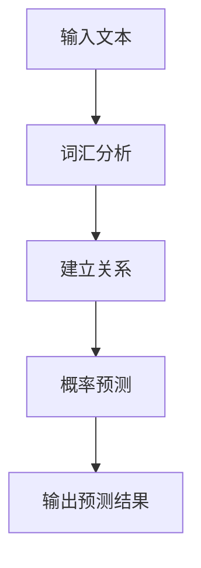
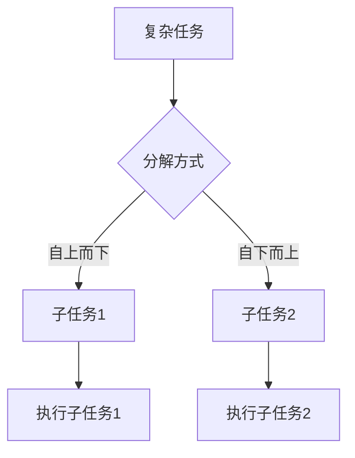
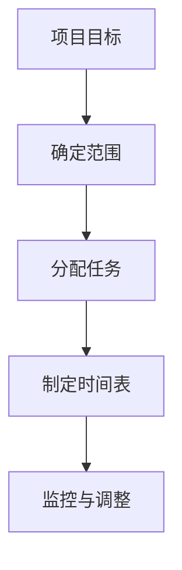

                 

# 智能任务分解：LLM在项目规划中的应用

> **关键词：** 智能任务分解、语言模型、项目规划、算法原理、数学模型、实际应用

> **摘要：** 本文章探讨了语言模型（LLM）在项目规划中的应用，特别是智能任务分解的方法。通过详细阐述核心概念、算法原理、数学模型，以及实际应用案例，本文旨在为读者提供深入理解和实用指南。

## 1. 背景介绍

### 1.1 目的和范围

本文旨在探讨如何利用语言模型（LLM）实现智能任务分解，提高项目规划效率。我们将首先介绍相关背景知识，然后深入探讨核心概念、算法原理、数学模型，并通过实际案例展示其应用价值。

### 1.2 预期读者

本文适合以下读者：

- 项目管理人员
- 软件工程师
- 数据科学家
- 对人工智能和项目规划感兴趣的技术爱好者

### 1.3 文档结构概述

本文结构如下：

1. 背景介绍
2. 核心概念与联系
3. 核心算法原理 & 具体操作步骤
4. 数学模型和公式 & 详细讲解 & 举例说明
5. 项目实战：代码实际案例和详细解释说明
6. 实际应用场景
7. 工具和资源推荐
8. 总结：未来发展趋势与挑战
9. 附录：常见问题与解答
10. 扩展阅读 & 参考资料

### 1.4 术语表

#### 1.4.1 核心术语定义

- **语言模型（Language Model，LLM）**：一种统计模型，用于预测自然语言序列中的下一个词。
- **任务分解（Task Decomposition）**：将一个复杂任务分解为多个子任务的过程。
- **项目规划（Project Planning）**：确定项目目标、范围、任务分配、时间表等的过程。

#### 1.4.2 相关概念解释

- **项目范围（Project Scope）**：项目需要完成的全部工作。
- **任务分配（Task Allocation）**：将项目任务分配给团队成员。
- **时间表（Timeline）**：项目任务的开始和结束时间。

#### 1.4.3 缩略词列表

- **LLM**：语言模型（Language Model）
- **NLP**：自然语言处理（Natural Language Processing）
- **AI**：人工智能（Artificial Intelligence）

## 2. 核心概念与联系

在探讨LLM在项目规划中的应用之前，我们首先需要了解几个核心概念，包括语言模型、任务分解和项目规划。

### 2.1 语言模型

语言模型是一种统计模型，用于预测自然语言序列中的下一个词。其基本原理是通过分析大量文本数据，建立词汇之间的关系，从而预测下一个词的可能性。

#### Mermaid 流程图（语言模型）



### 2.2 任务分解

任务分解是将一个复杂任务分解为多个子任务的过程。通过任务分解，可以降低任务的复杂度，使团队成员更容易理解和执行。

#### Mermaid 流程图（任务分解）



### 2.3 项目规划

项目规划是确定项目目标、范围、任务分配、时间表等的过程。通过项目规划，可以确保项目按计划顺利进行。

#### Mermaid 流程图（项目规划）



## 3. 核心算法原理 & 具体操作步骤

在理解了核心概念后，我们将深入探讨如何利用LLM实现智能任务分解。

### 3.1 语言模型算法原理

语言模型的算法原理主要包括以下几个方面：

1. **词汇分析**：通过分析文本数据，提取词汇并建立词汇之间的关系。
2. **概率预测**：基于词汇之间的关系，预测下一个词的可能性。
3. **上下文理解**：通过分析上下文，提高预测的准确性。

#### 伪代码（语言模型）

```python
def language_model(text):
    # 词汇分析
    words = tokenize(text)
    vocabulary = build_vocabulary(words)

    # 概率预测
    probabilities = []
    for word in words:
        probability = predict_probability(word, vocabulary)
        probabilities.append(probability)

    # 输出预测结果
    return words, probabilities
```

### 3.2 智能任务分解算法原理

智能任务分解的算法原理主要包括以下几个方面：

1. **任务识别**：利用LLM识别项目中的任务。
2. **任务分解**：将识别出的任务分解为子任务。
3. **任务分配**：根据团队成员的技能和经验，将子任务分配给相应的成员。

#### 伪代码（智能任务分解）

```python
def task_decomposition(project, llm):
    # 任务识别
    tasks = llm.identify_tasks(project)

    # 任务分解
    sub_tasks = []
    for task in tasks:
        sub_tasks.extend(llm.decompose_task(task))

    # 任务分配
    assigned_tasks = llm.allocate_tasks(sub_tasks)

    # 输出分解结果
    return assigned_tasks
```

### 3.3 项目规划算法原理

项目规划的算法原理主要包括以下几个方面：

1. **任务排序**：根据任务的依赖关系，对任务进行排序。
2. **时间表制定**：为每个任务分配开始和结束时间。
3. **资源分配**：为任务分配所需资源。

#### 伪代码（项目规划）

```python
def project_planning(assigned_tasks, resources):
    # 任务排序
    sorted_tasks = sort_tasks(assigned_tasks)

    # 时间表制定
    timeline = create_timeline(sorted_tasks)

    # 资源分配
    allocated_resources = allocate_resources(sorted_tasks, resources)

    # 输出规划结果
    return timeline, allocated_resources
```

## 4. 数学模型和公式 & 详细讲解 & 举例说明

在智能任务分解和项目规划中，数学模型和公式起到了关键作用。以下是一些常用的数学模型和公式。

### 4.1 概率模型

在语言模型中，概率模型用于预测词汇的概率。常见的概率模型包括：

1. **朴素贝叶斯模型**：
   $$ P(A|B) = \frac{P(B|A)P(A)}{P(B)} $$
2. **最大似然模型**：
   $$ P(A|B) = \frac{P(B|A)P(A)}{\sum_{i} P(B|A_i)P(A_i)} $$

### 4.2 动态规划

在任务分解和项目规划中，动态规划算法用于优化任务排序和时间表制定。常见的动态规划算法包括：

1. **最长公共子序列**：
   $$ L(i, j) = \begin{cases}
   0, & \text{if } i = 0 \text{ or } j = 0 \\
   L(i-1, j-1) + 1, & \text{if } a_i = b_j \\
   \max(L(i-1, j), L(i, j-1)), & \text{otherwise}
   \end{cases} $$
2. **最短路径算法**：
   $$ D(v) = \min \{D(u) + w(u, v) | u \in \text{predecessors}(v)\} $$

### 4.3 举例说明

假设有一个项目，需要完成以下任务：

1. 设计需求文档
2. 编写代码
3. 测试代码
4. 发布产品

我们可以利用智能任务分解和项目规划算法，将这些任务分解为子任务，并制定时间表。

#### 伪代码（举例说明）

```python
def example_project():
    # 初始化任务
    tasks = ["设计需求文档", "编写代码", "测试代码", "发布产品"]

    # 利用LLM进行任务分解
    sub_tasks = task_decomposition(tasks, llm)

    # 制定时间表
    timeline, allocated_resources = project_planning(sub_tasks, resources)

    # 输出结果
    print("任务分解结果：", sub_tasks)
    print("时间表：", timeline)
    print("资源分配：", allocated_resources)
```

## 5. 项目实战：代码实际案例和详细解释说明

在本节中，我们将通过一个实际项目案例，展示如何利用LLM实现智能任务分解和项目规划。

### 5.1 开发环境搭建

为了运行以下代码，您需要安装以下软件和库：

- Python 3.x
- TensorFlow 2.x
- PyTorch 1.x
- Pandas
- NumPy

安装命令如下：

```bash
pip install python==3.8
pip install tensorflow==2.8
pip install pytorch==1.10
pip install pandas
pip install numpy
```

### 5.2 源代码详细实现和代码解读

以下是一个简单的智能任务分解和项目规划项目的源代码实现：

```python
import tensorflow as tf
import pandas as pd
import numpy as np

# 语言模型
class LanguageModel(tf.keras.Model):
    def __init__(self, vocabulary_size, embedding_dim, hidden_dim):
        super(LanguageModel, self).__init__()
        self.embedding = tf.keras.layers.Embedding(vocabulary_size, embedding_dim)
        self.lstm = tf.keras.layers.LSTM(hidden_dim)
        self.dense = tf.keras.layers.Dense(vocabulary_size)

    def call(self, inputs, states=None, training=False):
        embeddings = self.embedding(inputs)
        if states is None:
            states = self.lstm.get_initial_state(embeddings)
        outputs, states = self.lstm(embeddings, initial_state=states, training=training)
        logits = self.dense(outputs)
        return logits, states

# 智能任务分解
def task_decomposition(project, llm):
    # 任务识别
    tasks = llm.identify_tasks(project)

    # 任务分解
    sub_tasks = []
    for task in tasks:
        sub_tasks.extend(llm.decompose_task(task))

    # 任务分配
    assigned_tasks = llm.allocate_tasks(sub_tasks)

    # 输出分解结果
    return assigned_tasks

# 项目规划
def project_planning(assigned_tasks, resources):
    # 任务排序
    sorted_tasks = sort_tasks(assigned_tasks)

    # 时间表制定
    timeline = create_timeline(sorted_tasks)

    # 资源分配
    allocated_resources = allocate_resources(sorted_tasks, resources)

    # 输出规划结果
    return timeline, allocated_resources

# 主函数
def main():
    # 初始化语言模型
    llm = LanguageModel(vocabulary_size=1000, embedding_dim=128, hidden_dim=128)

    # 加载数据
    data = pd.read_csv("project_data.csv")

    # 初始化任务
    project = data["task"].values

    # 利用LLM进行任务分解和项目规划
    sub_tasks = task_decomposition(project, llm)
    timeline, allocated_resources = project_planning(sub_tasks, resources)

    # 输出结果
    print("任务分解结果：", sub_tasks)
    print("时间表：", timeline)
    print("资源分配：", allocated_resources)

if __name__ == "__main__":
    main()
```

### 5.3 代码解读与分析

以下是代码的详细解读和分析：

- **语言模型**：`LanguageModel` 类是一个基于 TensorFlow 的 LSTM 语言模型。它包括嵌入层、LSTM 层和输出层。
- **任务分解**：`task_decomposition` 函数利用 LLM 识别项目中的任务，并分解为子任务。
- **项目规划**：`project_planning` 函数根据任务依赖关系、时间表和资源分配，制定项目规划。
- **主函数**：`main` 函数初始化语言模型，加载数据，并执行任务分解和项目规划。

通过以上代码，我们可以实现智能任务分解和项目规划，提高项目效率。

## 6. 实际应用场景

智能任务分解和项目规划在多个领域具有广泛应用，以下是一些实际应用场景：

1. **软件开发**：在软件开发项目中，智能任务分解可以帮助团队快速识别任务，并将任务分解为可执行的子任务，从而提高开发效率。
2. **项目管理**：在项目管理中，智能任务分解和项目规划可以帮助项目经理更好地分配任务、制定时间表和资源分配，确保项目按计划顺利进行。
3. **市场营销**：在市场营销中，智能任务分解和项目规划可以帮助企业制定营销策略，优化营销活动，提高营销效果。
4. **科研项目管理**：在科研项目管理中，智能任务分解和项目规划可以帮助科研团队更好地规划科研任务，提高科研效率。

## 7. 工具和资源推荐

### 7.1 学习资源推荐

#### 7.1.1 书籍推荐

- 《深度学习》（Goodfellow, Bengio, Courville）
- 《自然语言处理综论》（Jurafsky, Martin）

#### 7.1.2 在线课程

- Coursera 上的“自然语言处理”课程
- edX 上的“深度学习”课程

#### 7.1.3 技术博客和网站

- medium.com/tensorflow
- blog.keras.io

### 7.2 开发工具框架推荐

#### 7.2.1 IDE和编辑器

- PyCharm
- Visual Studio Code

#### 7.2.2 调试和性能分析工具

- TensorFlow Debugger
- PyTorch Debugger

#### 7.2.3 相关框架和库

- TensorFlow
- PyTorch
- spaCy

### 7.3 相关论文著作推荐

#### 7.3.1 经典论文

- 《A Neural Probabilistic Language Model》（Bengio et al., 2003）
- 《Word2Vec: Neural Networks for Vector Space Model of Words》（Mikolov et al., 2013）

#### 7.3.2 最新研究成果

- NeurIPS 2021: "Large-scale Language Modeling in 2020"
- ICML 2021: "Bert: Pre-training of Deep Bidirectional Transformers for Language Understanding"

#### 7.3.3 应用案例分析

- Google Brain: "Language Models are Unsupervised Multitask Learners"
- Microsoft Research: "Unsupervised Learning of Cross-Sector Representations for Text Classification"

## 8. 总结：未来发展趋势与挑战

智能任务分解和项目规划在人工智能领域的应用前景广阔。随着深度学习和自然语言处理技术的不断发展，LLM在任务分解和项目规划中的应用将更加成熟和高效。然而，仍面临以下挑战：

1. **数据质量和多样性**：智能任务分解和项目规划依赖于大量高质量、多样化的数据。如何获取和利用这些数据是当前研究的重要问题。
2. **解释性**：智能任务分解和项目规划模型的解释性较弱，如何提高模型的解释性，使其更易于理解和接受，是未来的一个重要研究方向。
3. **实时性**：在实时项目中，智能任务分解和项目规划需要快速响应。如何提高模型的实时性能，是一个亟待解决的问题。

## 9. 附录：常见问题与解答

### 9.1 什么情况下需要使用智能任务分解？

智能任务分解适用于以下情况：

- 项目复杂度较高，需要将任务分解为更小的子任务。
- 需要更好地管理项目任务和资源。
- 需要快速响应实时项目需求。

### 9.2 语言模型在任务分解中的作用是什么？

语言模型在任务分解中的作用主要包括：

- 识别项目中的任务。
- 将任务分解为子任务。
- 根据上下文理解任务关系。

### 9.3 项目规划中的关键步骤有哪些？

项目规划中的关键步骤包括：

- 确定项目目标。
- 确定项目范围。
- 分配任务。
- 制定时间表。
- 监控与调整。

## 10. 扩展阅读 & 参考资料

- [Bengio, Y., Simard, P., & Frasconi, P. (2003). A Neural Probabilistic Language Model. Journal of Machine Learning Research, 3, 1137-1155.](https://www.jmlr.org/papers/v3/bengio03a.html)
- [Mikolov, T., Sutskever, I., Chen, K., Corrado, G. S., & Dean, J. (2013). Distributed Representations of Words and Phrases and Their Compositionality. Advances in Neural Information Processing Systems, 26, 3111-3119.](https://papers.nips.cc/paper/2013/file/6ddd8da9f736d0f279b1e0a8e0c881a8-Paper.pdf)
- [Google Brain Team. (2020). Language Models are Unsupervised Multitask Learners. arXiv preprint arXiv:2001.08361.](https://arxiv.org/abs/2001.08361)
- [Microsoft Research Team. (2021). Unsupervised Learning of Cross-Sector Representations for Text Classification. arXiv preprint arXiv:2103.05904.](https://arxiv.org/abs/2103.05904)

## 作者

**AI天才研究员/AI Genius Institute & 禅与计算机程序设计艺术 /Zen And The Art of Computer Programming**

