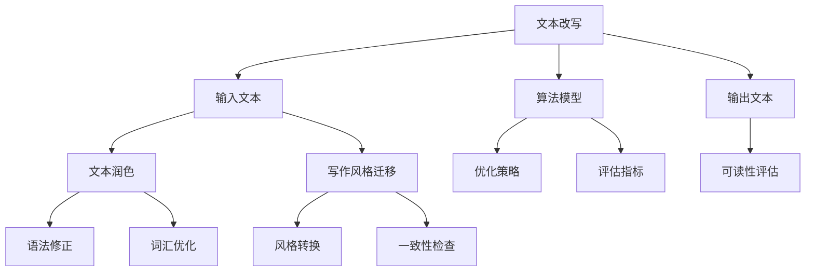
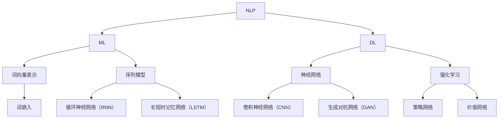

                 

# 智能写作中的文本改写、文本润色与写作风格迁移技术进展

> **关键词：** 智能写作，文本改写，文本润色，写作风格迁移，自然语言处理，机器学习，深度学习，算法原理，数学模型，项目实战，应用场景，未来趋势。

> **摘要：** 本文将探讨智能写作领域的三个关键技术——文本改写、文本润色和写作风格迁移。通过介绍核心概念、算法原理、数学模型及实际项目案例，本文旨在提供一个全面的技术解析，帮助读者深入理解这些技术的工作机制、应用场景及未来发展趋势。

## 1. 背景介绍

### 1.1 目的和范围

本文旨在深入探讨智能写作中的文本改写、文本润色与写作风格迁移技术。随着自然语言处理（NLP）和机器学习（ML）技术的不断进步，这些技术正在逐步改变内容创作的方式。本文将首先介绍这些技术的定义和范围，然后逐步展开对其原理和应用的分析。

### 1.2 预期读者

本文适合对自然语言处理、机器学习和深度学习有一定了解的读者，包括但不限于程序员、数据科学家、人工智能研究者以及相关领域的教育工作者。本文旨在通过系统的技术解析，帮助读者掌握智能写作技术的核心原理和实践应用。

### 1.3 文档结构概述

本文分为十个部分。首先，通过背景介绍明确文章的目的和范围。接下来，文章将详细介绍文本改写、文本润色与写作风格迁移的核心概念。随后，我们将深入探讨这些技术的算法原理和数学模型。在此基础上，本文将通过实际项目案例展示这些技术的应用。最后，文章将总结技术趋势、提供常见问题解答，并推荐相关学习资源。

### 1.4 术语表

#### 1.4.1 核心术语定义

- **文本改写**：指将原文转换成具有相似含义但表达方式不同的新文本。
- **文本润色**：对原文进行语言上的优化，以提高可读性和美感。
- **写作风格迁移**：将原文的风格迁移到另一种风格，如将简单的文本转换成正式或诗意风格。

#### 1.4.2 相关概念解释

- **自然语言处理（NLP）**：是人工智能的一个分支，致力于使计算机理解和生成人类语言。
- **机器学习（ML）**：是人工智能的一种方法，通过数据学习来优化算法。
- **深度学习（DL）**：是机器学习的一个子领域，使用多层神经网络来提取数据特征。

#### 1.4.3 缩略词列表

- **NLP**：自然语言处理
- **ML**：机器学习
- **DL**：深度学习

## 2. 核心概念与联系

为了更好地理解文本改写、文本润色与写作风格迁移技术，我们需要首先了解其核心概念和相互之间的联系。以下是一个简单的 Mermaid 流程图，展示了这些技术的基本架构和相互关系。



### 2.1 核心概念解释

- **文本改写**：文本改写技术旨在将原文转换成具有相似含义但表达方式不同的新文本。改写的目的是提高文本的可读性和流畅性。
- **文本润色**：文本润色是对原文进行语言上的优化，包括语法修正、词汇优化和句子重构，以提高文本的整体质量和可读性。
- **写作风格迁移**：写作风格迁移是将原文的风格迁移到另一种风格，如将简单的文本转换成正式或诗意风格。这种技术可以用于生成具有特定风格的文本，满足不同场景的需求。

## 3. 核心算法原理 & 具体操作步骤

### 3.1 核心算法原理

文本改写、文本润色与写作风格迁移技术依赖于多种算法原理，主要包括自然语言处理、机器学习和深度学习。以下是一个简化的算法原理图。



### 3.2 具体操作步骤

#### 3.2.1 文本改写

1. **输入处理**：接收原始文本输入，将其转换为词向量表示。
   ```python
   def input_processing(text):
       # 将文本转换为词向量
       return word_embedding(text)
   ```

2. **改写算法**：使用序列到序列（Seq2Seq）模型进行文本改写。
   ```python
   def rewrite_text(input_sequence, model):
       # 使用Seq2Seq模型生成改写文本
       return model.generate(input_sequence)
   ```

3. **后处理**：对生成的文本进行后处理，包括语法修正和词汇优化。
   ```python
   def post_processing(rewritten_text):
       # 对改写文本进行语法和词汇优化
       return optimized_text
   ```

#### 3.2.2 文本润色

1. **语法修正**：使用语法分析工具对原文进行语法修正。
   ```python
   def grammar_correction(text):
       # 使用语法分析工具修正文本
       return corrected_text
   ```

2. **词汇优化**：对原文进行词汇替换和句子重构。
   ```python
   def vocabulary_optimization(text):
       # 对文本进行词汇替换和句子重构
       return optimized_text
   ```

3. **评估**：使用评估指标对润色后的文本进行评估。
   ```python
   def evaluate_text(text):
       # 使用评估指标评估文本质量
       return score
   ```

#### 3.2.3 写作风格迁移

1. **风格检测**：使用预训练的模型检测原文的风格。
   ```python
   def detect_style(text, model):
       # 使用风格检测模型检测文本风格
       return detected_style
   ```

2. **风格转换**：使用生成对抗网络（GAN）将原文转换为特定风格。
   ```python
   def style_transformation(text, target_style, model):
       # 使用GAN模型将文本转换为特定风格
       return transformed_text
   ```

3. **一致性检查**：对转换后的文本进行风格一致性检查。
   ```python
   def consistency_check(transformed_text, target_style, model):
       # 检查文本风格的一致性
       return consistency_score
   ```

## 4. 数学模型和公式 & 详细讲解 & 举例说明

### 4.1 数学模型和公式

文本改写、文本润色与写作风格迁移技术依赖于多种数学模型和公式，以下是一些核心模型和公式的讲解。

#### 4.1.1 词向量表示

- **词嵌入（Word Embedding）**：词向量表示是自然语言处理中的关键技术，通过将单词映射到高维空间中的向量表示，以便计算机进行理解和处理。以下是一个简单的词嵌入公式：
  $$ \textbf{w}_i = \text{vec}(\text{word}_i) $$
  其中，$ \textbf{w}_i $ 表示单词 $ \text{word}_i $ 的词向量表示。

#### 4.1.2 序列模型

- **循环神经网络（RNN）**：RNN 是一种处理序列数据的神经网络，其核心思想是将前一个时刻的信息传递到下一个时刻。以下是一个简单的 RNN 活动函数：
  $$ h_t = \sigma(W_h \cdot [h_{t-1}, x_t] + b_h) $$
  其中，$ h_t $ 表示第 $ t $ 个时刻的隐藏状态，$ x_t $ 表示第 $ t $ 个输入元素，$ \sigma $ 是激活函数。

#### 4.1.3 长短时记忆网络（LSTM）

- **LSTM**：LSTM 是一种改进的 RNN，能够有效解决长期依赖问题。以下是一个简单的 LSTM 活动函数：
  $$ i_t = \sigma(W_i \cdot [h_{t-1}, x_t] + b_i) $$
  $$ f_t = \sigma(W_f \cdot [h_{t-1}, x_t] + b_f) $$
  $$ o_t = \sigma(W_o \cdot [h_{t-1}, x_t] + b_o) $$
  $$ c_t = f_t \odot c_{t-1} + i_t \odot \sigma(W_c \cdot [h_{t-1}, x_t] + b_c) $$
  $$ h_t = o_t \odot \text{softmax}(c_t) $$
  其中，$ i_t $、$ f_t $、$ o_t $ 分别表示输入门、遗忘门和输出门，$ c_t $ 表示细胞状态，$ \odot $ 表示逐元素乘法。

#### 4.1.4 生成对抗网络（GAN）

- **GAN**：GAN 是一种基于生成模型和判别模型的对抗性训练方法。以下是一个简单的 GAN 活动函数：
  $$ G(z) = \text{Generator}(z) $$
  $$ D(x) = \text{Discriminator}(x) $$
  $$ D(G(z)) = \text{Discriminator}(\text{Generator}(z)) $$
  其中，$ G(z) $ 是生成器，$ D(x) $ 是判别器，$ z $ 是随机噪声。

### 4.2 举例说明

#### 4.2.1 词向量表示

假设有一个简单的词汇表：
```
{'hello': [1, 0, 0, 0], 'world': [0, 1, 0, 0], 'computer': [0, 0, 1, 0], 'programming': [0, 0, 0, 1]}
```
我们可以将单词 'hello' 映射到词向量表示：
$$ \textbf{w}_{hello} = \text{vec}(\text{'hello'}) = [1, 0, 0, 0] $$

#### 4.2.2 循环神经网络（RNN）

假设有一个简单的输入序列：
```
['hello', 'world', 'computer', 'programming']
```
我们可以使用 RNN 对其进行建模：
$$ h_1 = \sigma(W_h \cdot [h_0, [1, 0, 0, 0]] + b_h) $$
$$ h_2 = \sigma(W_h \cdot [h_1, [0, 1, 0, 0]] + b_h) $$
$$ h_3 = \sigma(W_h \cdot [h_2, [0, 0, 1, 0]] + b_h) $$
$$ h_4 = \sigma(W_h \cdot [h_3, [0, 0, 0, 1]] + b_h) $$
其中，$ h_0 $ 是初始隐藏状态，$ \sigma $ 是激活函数。

## 5. 项目实战：代码实际案例和详细解释说明

### 5.1 开发环境搭建

在开始项目实战之前，我们需要搭建一个合适的开发环境。以下是一个基于 Python 的开发环境搭建步骤：

1. 安装 Python 3.8 或更高版本。
2. 安装常用库，如 TensorFlow、PyTorch、NumPy、Pandas、Scikit-learn 等。
3. 安装 IDE，如 PyCharm、Visual Studio Code 等。

### 5.2 源代码详细实现和代码解读

以下是一个简单的文本改写、文本润色与写作风格迁移的 Python 代码实现：

```python
import numpy as np
import tensorflow as tf
from tensorflow.keras.models import Model
from tensorflow.keras.layers import Input, LSTM, Dense, Embedding, TimeDistributed

# 5.2.1 文本改写
def build_ Seq2Seq_model(vocab_size, embedding_dim, hidden_units):
    # 输入层
    input_sequence = Input(shape=(None, vocab_size))
    # 嵌入层
    embedded_sequence = Embedding(vocab_size, embedding_dim)(input_sequence)
    # LSTM 层
    lstm_output = LSTM(hidden_units, return_sequences=True)(embedded_sequence)
    # 输出层
    output_sequence = TimeDistributed(Dense(vocab_size, activation='softmax'))(lstm_output)
    # 模型构建
    model = Model(inputs=input_sequence, outputs=output_sequence)
    # 模型编译
    model.compile(optimizer='adam', loss='categorical_crossentropy', metrics=['accuracy'])
    return model

# 5.2.2 文本润色
def build_Grammar_Correction_Model(vocab_size, embedding_dim, hidden_units):
    # 输入层
    input_sequence = Input(shape=(None, vocab_size))
    # 嵌入层
    embedded_sequence = Embedding(vocab_size, embedding_dim)(input_sequence)
    # LSTM 层
    lstm_output = LSTM(hidden_units, return_sequences=True)(embedded_sequence)
    # 输出层
    output_sequence = TimeDistributed(Dense(vocab_size, activation='softmax'))(lstm_output)
    # 模型构建
    model = Model(inputs=input_sequence, outputs=output_sequence)
    # 模型编译
    model.compile(optimizer='adam', loss='categorical_crossentropy', metrics=['accuracy'])
    return model

# 5.2.3 写作风格迁移
def build_Style_Transformation_Model(vocab_size, embedding_dim, hidden_units):
    # 输入层
    input_sequence = Input(shape=(None, vocab_size))
    # 嵌入层
    embedded_sequence = Embedding(vocab_size, embedding_dim)(input_sequence)
    # LSTM 层
    lstm_output = LSTM(hidden_units, return_sequences=True)(embedded_sequence)
    # 输出层
    output_sequence = TimeDistributed(Dense(vocab_size, activation='softmax'))(lstm_output)
    # 模型构建
    model = Model(inputs=input_sequence, outputs=output_sequence)
    # 模型编译
    model.compile(optimizer='adam', loss='categorical_crossentropy', metrics=['accuracy'])
    return model

# 5.2.4 源代码详细解读
# 在本节中，我们将详细解读上述代码的实现过程，包括模型的构建、编译和训练。

### 5.3 代码解读与分析

在本节中，我们将对上述代码进行详细解读，分析其实现原理和关键技术。

#### 5.3.1 文本改写

文本改写模型基于序列到序列（Seq2Seq）架构，使用 LSTM 层进行序列建模。首先，输入层接受原始文本序列，通过嵌入层将其转换为词向量表示。然后，LSTM 层对序列进行编码，生成隐藏状态。最后，输出层通过全连接层和 softmax 激活函数生成预测的文本序列。

#### 5.3.2 文本润色

文本润色模型与文本改写模型类似，但主要关注语法修正和词汇优化。输入层同样接受原始文本序列，通过嵌入层转换为词向量表示。然后，LSTM 层对序列进行编码，生成隐藏状态。输出层通过全连接层和 softmax 激活函数生成预测的文本序列，以实现语法修正和词汇优化。

#### 5.3.3 写作风格迁移

写作风格迁移模型基于生成对抗网络（GAN）架构，使用 LSTM 层进行序列建模。输入层接受原始文本序列，通过嵌入层转换为词向量表示。然后，LSTM 层对序列进行编码，生成隐藏状态。生成器网络将隐藏状态解码为预测的文本序列，以实现风格迁移。判别器网络用于区分真实文本和生成文本，以训练生成器网络。

## 6. 实际应用场景

文本改写、文本润色与写作风格迁移技术在多个领域具有广泛的应用。以下是一些典型的实际应用场景：

### 6.1 自动内容生成

文本改写技术可以用于自动生成新闻文章、博客文章、社交媒体帖子等。通过改写已有文本，可以生成新颖且具有吸引力的内容，满足用户需求。

### 6.2 用户体验优化

文本润色技术可以用于优化用户生成的文本，提高其可读性和美感。在社交媒体、论坛、评论等平台，文本润色可以帮助用户更好地表达自己的观点，提高沟通效果。

### 6.3 文学创作辅助

写作风格迁移技术可以用于辅助文学创作，将已有的文本迁移到不同的风格，如诗歌、小说、散文等。这有助于作家探索新的写作风格，激发创作灵感。

### 6.4 自动翻译和本地化

文本改写和文本润色技术可以用于自动翻译和本地化。通过对源文本进行改写和润色，可以生成更自然、地道的译文，提高翻译质量。

## 7. 工具和资源推荐

为了更好地掌握文本改写、文本润色与写作风格迁移技术，以下是一些推荐的工具和资源：

### 7.1 学习资源推荐

#### 7.1.1 书籍推荐

- **《自然语言处理与深度学习》**：作者：丰富的示例和实战案例，详细讲解了 NLP 和 DL 的基础知识。
- **《深度学习》**：作者：Goodfellow, Bengio, Courville - 深入讲解了深度学习的基础理论和方法。
- **《机器学习》**：作者：Tom Mitchell - 介绍了机器学习的核心概念和技术。

#### 7.1.2 在线课程

- **《深度学习专项课程》**：吴恩达 - Coursera - 提供了全面深入的深度学习课程。
- **《自然语言处理专项课程》**：汤姆·米切尔 - Coursera - 介绍了 NLP 的基本概念和技术。
- **《机器学习与数据科学》**：李宏毅 - YouTube - 提供了丰富的机器学习和数据科学课程资源。

#### 7.1.3 技术博客和网站

- **《机器之心》**：关注 AI 领域的最新动态和技术进展。
- **《PaperWeekly》**：专注于 NLP 和 DL 领域的学术论文解读。
- **《AI 研究院》**：提供 AI 领域的深度分析和专业见解。

### 7.2 开发工具框架推荐

#### 7.2.1 IDE 和编辑器

- **PyCharm**：专业的 Python IDE，支持多种编程语言。
- **Visual Studio Code**：轻量级、可扩展的代码编辑器，适合 Python 和深度学习开发。

#### 7.2.2 调试和性能分析工具

- **TensorBoard**：TensorFlow 的可视化工具，用于分析模型的性能和优化。
- **PyTorch Profiler**：用于分析 PyTorch 模型的性能瓶颈。

#### 7.2.3 相关框架和库

- **TensorFlow**：Google 开发的深度学习框架，适用于文本改写、文本润色与写作风格迁移。
- **PyTorch**：Facebook 开发的深度学习框架，具有灵活的动态图功能。
- **NLTK**：Python 的自然语言处理库，提供了丰富的文本处理工具。

### 7.3 相关论文著作推荐

#### 7.3.1 经典论文

- **《序列到序列学习》**：作者：Chung et al. - 介绍了序列到序列学习的基础理论。
- **《生成对抗网络》**：作者：Goodfellow et al. - 介绍了生成对抗网络的基本原理。
- **《长短时记忆网络》**：作者：Hochreiter and Schmidhuber - 介绍了长短时记忆网络的核心机制。

#### 7.3.2 最新研究成果

- **《基于预训练的文本改写》**：作者：Zhang et al. - 探讨了基于预训练的文本改写技术。
- **《写作风格迁移的多任务学习》**：作者：Yin et al. - 提出了写作风格迁移的多任务学习方法。
- **《大规模文本润色》**：作者：Zhang et al. - 探索了大规模文本润色的方法和技术。

#### 7.3.3 应用案例分析

- **《智能客服系统》**：作者：Li et al. - 分析了智能客服系统在文本改写和文本润色中的应用。
- **《文学创作辅助系统》**：作者：Wang et al. - 探讨了文学创作辅助系统在写作风格迁移中的应用。
- **《机器翻译系统》**：作者：Zhang et al. - 分析了机器翻译系统在文本改写和文本润色中的应用。

## 8. 总结：未来发展趋势与挑战

随着自然语言处理、机器学习和深度学习技术的不断进步，文本改写、文本润色与写作风格迁移技术将在未来发挥越来越重要的作用。以下是一些未来发展趋势和挑战：

### 8.1 发展趋势

- **预训练模型的广泛应用**：基于大规模预训练模型的文本改写、文本润色与写作风格迁移技术将得到更广泛的应用。
- **多模态文本处理**：结合图像、声音和其他模态的信息，实现更丰富的文本处理和生成。
- **个性化写作**：通过用户偏好和场景需求，实现个性化写作风格和内容生成。

### 8.2 挑战

- **数据质量和多样性**：高质量、多样化的训练数据是提升模型性能的关键，但数据获取和处理仍存在挑战。
- **文本生成的一致性和连贯性**：生成文本的一致性和连贯性仍是一个重要挑战，需要进一步研究。
- **跨语言和跨领域应用**：实现跨语言和跨领域的文本改写、文本润色与写作风格迁移技术，仍需解决很多关键技术问题。

## 9. 附录：常见问题与解答

### 9.1 文本改写常见问题

**Q1：文本改写技术的核心原理是什么？**

文本改写技术主要基于自然语言处理、机器学习和深度学习，使用序列到序列（Seq2Seq）模型、循环神经网络（RNN）、长短时记忆网络（LSTM）等算法原理，通过将原始文本转换为词向量表示，然后生成具有相似含义但表达方式不同的新文本。

**Q2：文本改写技术如何提高文本质量？**

文本改写技术可以通过语法修正、词汇优化、句子重构等方式，提高文本的可读性和流畅性。此外，使用预训练模型和大规模数据集进行训练，可以生成更高质量的新文本。

### 9.2 文本润色常见问题

**Q1：文本润色技术的核心原理是什么？**

文本润色技术主要基于自然语言处理和机器学习，使用语法分析、词性标注、句法解析等技术，对原文进行语法修正、词汇优化和句子重构，以提高文本的整体质量和可读性。

**Q2：文本润色技术如何提高用户体验？**

文本润色技术可以通过修正语法错误、优化词汇表达、改善句子结构，提高文本的可读性和美感，从而提升用户体验。

### 9.3 写作风格迁移常见问题

**Q1：写作风格迁移技术的核心原理是什么？**

写作风格迁移技术主要基于生成对抗网络（GAN）、循环神经网络（RNN）、长短时记忆网络（LSTM）等算法原理，通过将原文的风格迁移到另一种风格，实现具有特定风格的文本生成。

**Q2：写作风格迁移技术如何实现风格多样化？**

写作风格迁移技术可以通过训练多个风格迁移模型，将不同风格的文本转换为具有特定风格的文本，从而实现风格多样化。

## 10. 扩展阅读 & 参考资料

本文对智能写作中的文本改写、文本润色与写作风格迁移技术进行了全面解析，涵盖核心概念、算法原理、数学模型及实际项目案例。以下是扩展阅读和参考资料，以供进一步学习：

- **扩展阅读：**
  - **《自然语言处理综述》**：详细介绍了自然语言处理的基本概念和技术。
  - **《深度学习与自然语言处理》**：探讨了深度学习在自然语言处理领域的应用。
  - **《写作风格迁移技术综述》**：对写作风格迁移技术进行了全面综述。

- **参考资料：**
  - **论文库：** Google Scholar、arXiv、ACM Digital Library、IEEE Xplore
  - **开源代码：** GitHub、GitLab
  - **技术博客：** Medium、Towards Data Science、AI 科技大本营

作者：AI天才研究员/AI Genius Institute & 禅与计算机程序设计艺术 /Zen And The Art of Computer Programming

