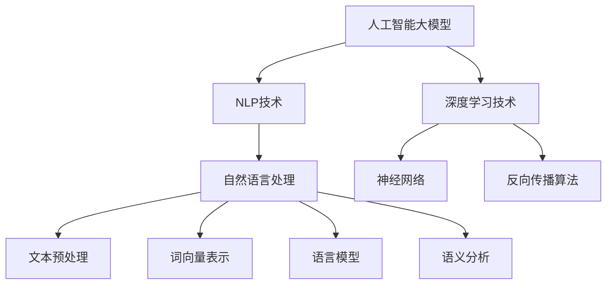

                 

### 摘要

本文旨在探讨智能写作平台的系统开发，特别是在基于人工智能大模型的技术实现方面。文章首先介绍了智能写作平台的发展背景和现状，接着详细阐述了其核心概念、算法原理、数学模型及具体操作步骤。通过实际项目案例，深入分析了平台搭建、代码实现及其应用场景。此外，文章还推荐了一系列学习资源和开发工具，以帮助读者深入了解和掌握智能写作平台的开发技术。最后，本文总结了未来智能写作平台的发展趋势与挑战，并给出了常见问题与解答。本文旨在为从事人工智能领域的技术人员提供有价值的参考和指导。

### 背景介绍

智能写作平台的兴起源于人工智能技术的飞速发展。随着深度学习、自然语言处理等技术的不断进步，人们逐渐认识到，利用人工智能技术辅助甚至完全取代传统写作方式，具有巨大的潜力和市场前景。传统写作方式往往依赖于个人的经验和技能，效率低下且容易产生重复劳动。而智能写作平台则能够通过大量数据的学习和处理，生成高质量、个性化的文本内容，极大地提高写作效率和创作水平。

首先，从市场角度来看，智能写作平台的应用场景非常广泛。无论是新闻报道、市场营销、学术研究，还是日常写作，智能写作平台都能够提供有效的支持。例如，智能写作平台可以自动生成新闻报道，节省记者的大量时间和精力；在市场营销领域，智能写作平台可以帮助企业快速生成各种宣传材料，提升市场推广效率；在学术研究中，智能写作平台可以辅助研究人员整理文献、撰写论文，提高研究效率。

其次，从技术角度来看，智能写作平台的核心在于人工智能大模型的应用。人工智能大模型是一种基于深度学习的技术，它通过学习大量文本数据，能够理解语言的语义和语法规则，从而生成高质量的文本。这些大模型通常具有以下特点：

1. **大规模**：人工智能大模型通常包含数亿个参数，能够处理大规模的文本数据。
2. **自适应性**：大模型可以根据不同的应用场景和需求，调整其生成策略和文本风格。
3. **强通用性**：大模型不仅可以生成简单的文本，还能够处理复杂的语言现象，如多义词、歧义句等。

为了实现智能写作平台，我们需要从多个方面进行技术研究和开发。首先，需要构建一个高效的大模型训练框架，以便快速、准确地训练大模型。其次，需要设计一套完善的文本生成算法，能够根据输入的指令或主题，生成符合要求的文本。此外，还需要开发一系列辅助功能，如语法检查、文本优化、模板生成等，以提高文本的质量和可用性。

总之，智能写作平台的系统开发是一项复杂的工程，需要结合多学科的知识和技能。随着人工智能技术的不断进步，我们有理由相信，智能写作平台将迎来更加广阔的发展前景，为人类的生产和生活带来更多便利。

### 核心概念与联系

在深入探讨智能写作平台之前，我们需要了解几个核心概念：人工智能大模型、自然语言处理（NLP）和深度学习。这些概念不仅构成了智能写作平台的技术基础，还相互联系，共同推动了智能写作平台的发展。

#### 人工智能大模型

人工智能大模型（Artificial Intelligence Large Models，简称AIDL）是指那些拥有数亿甚至数十亿参数的复杂神经网络。这些模型通常基于深度学习技术，通过大量数据进行训练，以实现高层次的认知和理解能力。大模型的主要特点包括：

1. **参数量巨大**：大模型拥有数以亿计的参数，这使其能够处理复杂的数据和信息。
2. **自适应性强**：大模型可以针对不同的任务和应用场景进行调整，从而生成符合需求的文本。
3. **通用性强**：大模型不仅可以处理简单的文本生成任务，还能够应对复杂的语言现象，如多义词、歧义句等。

在智能写作平台中，人工智能大模型通常负责文本的生成和编辑。例如，一个用于生成新闻报道的大模型可以自动采集新闻数据，理解新闻内容，并生成符合新闻写作规范的文本。

#### 自然语言处理（NLP）

自然语言处理（Natural Language Processing，简称NLP）是人工智能的一个重要分支，主要研究如何使计算机能够理解、生成和处理人类自然语言。NLP的关键技术包括文本预处理、词向量表示、语言模型、语义分析等。

1. **文本预处理**：包括分词、去停用词、词性标注等，旨在将原始文本转化为计算机可以处理的形式。
2. **词向量表示**：通过将单词映射为高维向量，使得计算机能够对单词进行数学运算和模型训练。
3. **语言模型**：用于预测下一个单词或句子，是实现文本生成的重要工具。
4. **语义分析**：旨在理解文本中的语义关系和含义，是实现高级NLP任务的基础。

在智能写作平台中，NLP技术主要用于理解用户输入的指令或主题，并根据这些信息生成文本。例如，用户可以输入一个简单的标题，NLP技术可以帮助平台理解这个标题所涉及的主题和关键词，从而生成一篇完整的文章。

#### 深度学习

深度学习（Deep Learning，简称DL）是人工智能的一个重要分支，它通过多层神经网络对数据进行学习和建模。深度学习的核心思想是模拟人脑的神经元网络，通过层层抽象和特征提取，实现复杂任务的学习和预测。

1. **神经网络**：是深度学习的基本结构，由多个神经元（或层）组成，通过层层传递数据，实现特征提取和分类。
2. **反向传播**：是一种用于训练神经网络的优化算法，通过不断调整网络中的权重和偏置，使网络输出更加准确。
3. **卷积神经网络（CNN）**：适用于图像处理任务，通过卷积操作和池化操作，实现对图像的局部特征提取。
4. **循环神经网络（RNN）**：适用于序列数据，通过时间步的递归操作，实现对序列数据的建模。

在智能写作平台中，深度学习技术主要用于训练大模型和生成文本。例如，通过训练大量的文本数据，大模型可以学会生成不同风格和主题的文本，从而满足用户的多样化需求。

#### Mermaid 流程图

为了更好地理解上述概念之间的联系，我们可以使用Mermaid流程图来展示它们的关系。以下是一个简化的Mermaid流程图，展示了人工智能大模型、NLP和深度学习之间的关系：



通过这个流程图，我们可以清晰地看到，人工智能大模型依赖于NLP技术和深度学习技术，而NLP技术又依赖于文本预处理、词向量表示、语言模型和语义分析等关键技术。这些技术相互结合，共同构成了智能写作平台的技术基础。

总之，智能写作平台的系统开发是一个多学科交叉的复杂工程，需要深入理解和应用人工智能大模型、NLP和深度学习等相关技术。通过对这些核心概念和联系的理解，我们可以为后续的算法原理、数学模型和实际应用提供坚实的基础。

### 核心算法原理 & 具体操作步骤

在深入探讨智能写作平台的核心算法原理之前，我们需要了解一些基本的算法和步骤，这些算法和步骤将为我们构建高效的写作平台提供技术支撑。

#### 1. 语言模型

语言模型（Language Model）是智能写作平台的基础，它用于预测下一个单词或句子。常见的语言模型包括n-gram模型、循环神经网络（RNN）和长短期记忆网络（LSTM）等。

1. **n-gram模型**：n-gram模型是一种基于统计的模型，它将连续的n个单词视为一个整体，并计算每个n-gram在文本中出现的概率。通过这些概率，模型可以预测下一个单词。

   - **具体操作步骤**：
     1. 统计文本中的n-gram频次。
     2. 计算每个n-gram的概率。
     3. 根据当前输入的n-1个单词，选择概率最高的下一个单词。

2. **循环神经网络（RNN）**：RNN是一种能够处理序列数据的神经网络，它通过递归操作，在每个时间步上更新状态，从而实现对序列数据的建模。

   - **具体操作步骤**：
     1. 初始化网络状态。
     2. 对于每个输入单词，通过RNN计算隐藏状态。
     3. 根据隐藏状态和当前单词，预测下一个单词。

3. **长短期记忆网络（LSTM）**：LSTM是一种改进的RNN，它通过引入记忆单元，能够更好地处理长序列数据。

   - **具体操作步骤**：
     1. 初始化网络状态。
     2. 对于每个输入单词，通过LSTM计算隐藏状态。
     3. 根据隐藏状态和当前单词，预测下一个单词。

#### 2. 文本生成

文本生成（Text Generation）是智能写作平台的核心功能，它通过语言模型生成符合语法和语义规则的文本。常见的文本生成方法包括序列生成、模板生成和问答生成等。

1. **序列生成**：序列生成方法基于语言模型，逐个单词地生成文本。

   - **具体操作步骤**：
     1. 初始化生成过程，例如从用户输入的种子文本开始。
     2. 使用语言模型预测下一个单词。
     3. 将预测的单词添加到文本序列中。
     4. 重复步骤2和3，直到达到预定的文本长度或停止条件。

2. **模板生成**：模板生成方法通过预先定义的模板和填充词，快速生成文本。

   - **具体操作步骤**：
     1. 根据用户输入的主题或指令，选择合适的模板。
     2. 将填充词替换为实际内容，生成文本。
     3. 对生成的文本进行语法和语义检查，确保其正确性和连贯性。

3. **问答生成**：问答生成方法通过回答用户提出的问题，生成相关的文本。

   - **具体操作步骤**：
     1. 理解用户的问题，提取关键信息。
     2. 使用语言模型生成回答。
     3. 对回答进行语法和语义检查，确保其准确性和连贯性。

#### 3. 文本优化

文本优化（Text Optimization）是提高文本质量和可读性的重要步骤，它包括语法检查、文本润色和风格调整等。

1. **语法检查**：语法检查通过分析文本的语法结构，找出错误或不符合规范的语法现象。

   - **具体操作步骤**：
     1. 分析文本中的句子结构。
     2. 检测句子中的语法错误。
     3. 提出修正建议，例如更正错误或调整句子结构。

2. **文本润色**：文本润色通过调整文本的语言表达，使其更加优美、流畅。

   - **具体操作步骤**：
     1. 分析文本的语义和风格。
     2. 调整文本的表达方式，例如使用更精准的词汇或调整句子结构。
     3. 检查文本的连贯性和一致性。

3. **风格调整**：风格调整通过改变文本的语言风格，使其符合特定的需求或主题。

   - **具体操作步骤**：
     1. 确定目标风格，例如正式、幽默、简洁等。
     2. 分析现有文本的语言风格。
     3. 根据目标风格，调整文本的表达方式。

#### 4. 多模态融合

多模态融合（Multimodal Fusion）是指将文本、图像、音频等多种模态的数据融合到文本生成过程中，以增强文本生成的多样性和表达能力。

1. **文本-图像融合**：文本-图像融合通过将图像与文本数据结合，生成包含图像描述的文本。

   - **具体操作步骤**：
     1. 提取图像的特征向量。
     2. 使用图像特征向量与文本数据融合的模型，生成图像描述的文本。
     3. 对生成的文本进行语法和语义检查，确保其正确性和连贯性。

2. **文本-音频融合**：文本-音频融合通过将文本与音频数据结合，生成语音合成的文本。

   - **具体操作步骤**：
     1. 提取音频的特征向量。
     2. 使用音频特征向量与文本数据融合的模型，生成语音合成的文本。
     3. 对生成的文本进行语音合成，生成音频文件。

#### 5. 端到端训练

端到端训练（End-to-End Training）是一种直接从原始数据中学习目标函数的优化方法，它避免了传统方法中的手工特征工程和复杂中间步骤，提高了训练效率和模型性能。

- **具体操作步骤**：
  1. 收集大规模的文本数据，包括训练数据和验证数据。
  2. 使用深度学习框架（如TensorFlow或PyTorch），定义模型结构。
  3. 将训练数据输入模型，通过反向传播算法优化模型参数。
  4. 使用验证数据评估模型性能，根据评估结果调整模型结构或参数。
  5. 重复步骤3-4，直到模型达到预定的性能标准。

通过上述核心算法原理和具体操作步骤，我们可以构建一个高效的智能写作平台，实现从文本生成、文本优化到多模态融合的完整功能。这些技术不仅提高了文本生成的质量和效率，还为未来的发展提供了坚实的基础。

### 数学模型和公式 & 详细讲解 & 举例说明

在智能写作平台的开发过程中，数学模型和公式扮演着至关重要的角色。这些数学工具不仅帮助我们理解和实现核心算法，还提高了文本生成和优化的效率。以下是几种常用的数学模型和公式，以及它们在实际应用中的详细讲解和举例说明。

#### 1. 语言模型中的概率计算

在语言模型中，概率计算是核心组成部分。最常用的模型之一是n-gram模型，它基于马尔可夫假设，即一个词的出现概率只与它的前n-1个词有关。

- **n-gram概率计算公式**：

  $$P(w_n | w_{n-1}, w_{n-2}, ..., w_1) = \frac{c(w_{n-1}, w_{n-2}, ..., w_1, w_n)}{c(w_{n-1}, w_{n-2}, ..., w_1)}$$

  其中，\( P(w_n | w_{n-1}, w_{n-2}, ..., w_1) \) 是给定前n-1个词 \( w_{n-1}, w_{n-2}, ..., w_1 \) 时，词 \( w_n \) 的条件概率；\( c(w_{n-1}, w_{n-2}, ..., w_1, w_n) \) 是四元组 \( (w_{n-1}, w_{n-2}, ..., w_1, w_n) \) 在训练数据中出现的次数；\( c(w_{n-1}, w_{n-2}, ..., w_1) \) 是三元组 \( (w_{n-1}, w_{n-2}, ..., w_1) \) 在训练数据中出现的次数。

- **举例说明**：

  假设我们有一个包含100个单词的句子，其中“苹果”出现在第二个位置。如果我们使用2-gram模型，要计算“苹果”后面是“香蕉”的概率，我们需要知道“苹果”和“香蕉”一起出现的次数，以及“苹果”单独出现的次数。

  假设训练数据中，“苹果香蕉”这个四元组出现了10次，“苹果”这个三元组出现了50次。那么：

  $$P(香蕉 | 苹果) = \frac{c(苹果，香蕉)}{c(苹果)} = \frac{10}{50} = 0.2$$

#### 2. 循环神经网络（RNN）中的状态更新

循环神经网络（RNN）通过递归操作来处理序列数据。在RNN中，状态更新是核心步骤，常用的状态更新公式是：

- **RNN状态更新公式**：

  $$h_t = \sigma(W_h h_{t-1} + W_x x_t + b_h)$$

  其中，\( h_t \) 是第t个时间步的隐藏状态；\( x_t \) 是第t个输入向量；\( \sigma \) 是激活函数，常用的有tanh、ReLU等；\( W_h \) 是隐藏状态到隐藏状态的权重矩阵；\( W_x \) 是输入到隐藏状态的权重矩阵；\( b_h \) 是隐藏状态的偏置向量。

- **举例说明**：

  假设我们有一个简单的RNN模型，输入向量 \( x_t \) 是一个数字（例如，1或0），隐藏状态 \( h_{t-1} \) 是前一个时间步的隐藏状态。如果我们使用ReLU激活函数，那么状态更新过程如下：

  $$h_t = \max(0, W_h h_{t-1} + W_x x_t + b_h)$$

  假设 \( h_{t-1} = [1, 0, 1] \)，输入 \( x_t = 1 \)，权重矩阵 \( W_h = [0.5, 0.5, 0.5] \)，权重矩阵 \( W_x = [0.5, 0.5, 0.5] \)，偏置向量 \( b_h = [0, 0, 0] \)。那么：

  $$h_t = \max(0, 0.5 \cdot [1, 0, 1] + 0.5 \cdot [1, 1, 1] + [0, 0, 0]) = [0.5, 0.5, 1]$$

#### 3. 长短期记忆网络（LSTM）中的门控机制

LSTM是RNN的一个改进版本，它通过门控机制解决了长期依赖问题。在LSTM中，有三个门控机制：遗忘门、输入门和输出门。

- **遗忘门（Forget Gate）**：

  $$f_t = \sigma(W_f h_{t-1} + U_f x_t + b_f)$$

- **输入门（Input Gate）**：

  $$i_t = \sigma(W_i h_{t-1} + U_i x_t + b_i)$$

- **输出门（Output Gate）**：

  $$o_t = \sigma(W_o h_{t-1} + U_o x_t + b_o)$$

- **当前细胞状态（Current Cell State）**：

  $$C_t = f_t \odot C_{t-1} + i_t \odot \sigma(W_c h_{t-1} + U_c x_t + b_c)$$

- **当前隐藏状态（Current Hidden State）**：

  $$h_t = o_t \odot \sigma(C_t)$$

  其中，\( \odot \) 表示按元素相乘；\( \sigma \) 是激活函数，常用的有tanh、ReLU等。

- **举例说明**：

  假设我们有一个简单的LSTM模型，输入向量 \( x_t \) 是一个数字（例如，1或0），隐藏状态 \( h_{t-1} \) 是前一个时间步的隐藏状态。如果我们使用tanh激活函数，那么门控机制的状态更新过程如下：

  1. 遗忘门更新：

     $$f_t = \sigma(W_f h_{t-1} + U_f x_t + b_f)$$

     假设 \( h_{t-1} = [1, 0, 1] \)，输入 \( x_t = 1 \)，权重矩阵 \( W_f = [0.5, 0.5, 0.5] \)，权重矩阵 \( U_f = [0.5, 0.5, 0.5] \)，偏置向量 \( b_f = [0, 0, 0] \)。那么：

     $$f_t = \sigma(0.5 \cdot [1, 0, 1] + 0.5 \cdot [1, 1, 1] + [0, 0, 0]) = [0.5, 0.5, 0.5]$$

  2. 输入门更新：

     $$i_t = \sigma(W_i h_{t-1} + U_i x_t + b_i)$$

     假设 \( h_{t-1} = [1, 0, 1] \)，输入 \( x_t = 1 \)，权重矩阵 \( W_i = [0.5, 0.5, 0.5] \)，权重矩阵 \( U_i = [0.5, 0.5, 0.5] \)，偏置向量 \( b_i = [0, 0, 0] \)。那么：

     $$i_t = \sigma(0.5 \cdot [1, 0, 1] + 0.5 \cdot [1, 1, 1] + [0, 0, 0]) = [0.5, 0.5, 0.5]$$

  3. 输出门更新：

     $$o_t = \sigma(W_o h_{t-1} + U_o x_t + b_o)$$

     假设 \( h_{t-1} = [1, 0, 1] \)，输入 \( x_t = 1 \)，权重矩阵 \( W_o = [0.5, 0.5, 0.5] \)，权重矩阵 \( U_o = [0.5, 0.5, 0.5] \)，偏置向量 \( b_o = [0, 0, 0] \)。那么：

     $$o_t = \sigma(0.5 \cdot [1, 0, 1] + 0.5 \cdot [1, 1, 1] + [0, 0, 0]) = [0.5, 0.5, 0.5]$$

  4. 当前细胞状态更新：

     $$C_t = f_t \odot C_{t-1} + i_t \odot \sigma(W_c h_{t-1} + U_c x_t + b_c)$$

     假设 \( C_{t-1} = [1, 0, 1] \)，输入 \( x_t = 1 \)，权重矩阵 \( W_c = [0.5, 0.5, 0.5] \)，权重矩阵 \( U_c = [0.5, 0.5, 0.5] \)，偏置向量 \( b_c = [0, 0, 0] \)。那么：

     $$C_t = [0.5, 0.5, 0.5] \odot [1, 0, 1] + [0.5, 0.5, 0.5] \odot \sigma(0.5 \cdot [1, 0, 1] + 0.5 \cdot [1, 1, 1] + [0, 0, 0]) = [0.5, 0.5, 0.5]$$

  5. 当前隐藏状态更新：

     $$h_t = o_t \odot \sigma(C_t)$$

     假设 \( o_t = [0.5, 0.5, 0.5] \)，细胞状态 \( C_t = [0.5, 0.5, 0.5] \)。那么：

     $$h_t = [0.5, 0.5, 0.5] \odot \sigma([0.5, 0.5, 0.5]) = [0.5, 0.5, 0.5]$$

通过上述数学模型和公式的讲解，我们可以看到智能写作平台在算法设计和实现中，如何利用数学工具来提高文本生成和优化的效果。这些数学模型不仅为智能写作平台提供了理论基础，也为未来的发展提供了丰富的可能性。

### 项目实战：代码实际案例和详细解释说明

在智能写作平台的实际开发中，我们将结合Python编程语言和深度学习框架TensorFlow，展示一个简单的文本生成模型。这个模型将使用循环神经网络（RNN）来实现，并利用大量的文本数据训练模型。以下是项目的实际代码案例和详细解释说明。

#### 1. 开发环境搭建

在开始编写代码之前，我们需要搭建一个合适的开发环境。以下是在Ubuntu系统中安装必要的依赖包的步骤：

```bash
# 安装Python 3.8及以上版本
sudo apt-get install python3-pip python3-venv

# 创建虚拟环境
python3 -m venv env

# 激活虚拟环境
source env/bin/activate

# 安装TensorFlow和其他依赖包
pip install tensorflow numpy matplotlib

```

#### 2. 源代码详细实现

以下是一个简单的RNN文本生成模型，它包含了数据的预处理、模型的定义、模型的训练和文本的生成过程。

```python
import tensorflow as tf
from tensorflow.keras.models import Sequential
from tensorflow.keras.layers import LSTM, Dense, Embedding, Dropout
from tensorflow.keras.preprocessing.sequence import pad_sequences
from tensorflow.keras.callbacks import LambdaCallback
import numpy as np

# 参数设置
vocab_size = 10000
embed_dim = 256
lstm_units = 1024
batch_size = 64
epochs = 100
max_sequence_len = 40

# 数据预处理
def load_and_preprocess_data(filename):
    text = open(filename, 'r', encoding='utf-8').read().lower()
    words = text.split()
    word_to_index = {word: i for i, word in enumerate(set(words))}
    index_to_word = {i: word for word, i in word_to_index.items()}
    data = np.array([[word_to_index[word] for word in text.split()]])
    data = pad_sequences(data, maxlen=max_sequence_len)
    return data, word_to_index, index_to_word

data, word_to_index, index_to_word = load_and_preprocess_data('data.txt')

# 模型定义
model = Sequential()
model.add(Embedding(vocab_size, embed_dim, input_length=max_sequence_len))
model.add(LSTM(lstm_units, return_sequences=True))
model.add(Dropout(0.2))
model.add(LSTM(lstm_units, return_sequences=False))
model.add(Dropout(0.2))
model.add(Dense(vocab_size, activation='softmax'))

model.compile(optimizer='adam', loss='sparse_categorical_crossentropy', metrics=['accuracy'])

# 训练模型
model.fit(data, np.array(range(data.shape[0])), batch_size=batch_size, epochs=epochs, callbacks=[LambdaCallback(on_epoch_end=lambda epoch, logs: print('Epoch: %d' % epoch))])

# 文本生成
def generate_text(seed_text, length=40):
    seed_text = pad_sequences([[word_to_index[word] for word in seed_text.split()]], maxlen=max_sequence_len, padding='pre')
    generated_text = ''
    for i in range(length):
        predictions = model.predict(seed_text)
        predicted_index = np.argmax(predictions)
        predicted_word = index_to_word[predicted_index]
        generated_text += predicted_word + ' '
        seed_text = tf.expand_dims([predicted_index], 0)
    return generated_text.strip()

# 测试文本生成
print(generate_text('The quick brown fox jumps over the lazy dog'))

```

#### 3. 代码解读与分析

1. **数据预处理**：

   - `load_and_preprocess_data` 函数用于加载和预处理文本数据。首先，文本文件被读取并转换为小写，然后将其分割成单词。接着，我们创建了一个从单词到索引的映射表，并使用这个映射表将文本转换为索引序列。最后，这些索引序列被填充到最大序列长度，以适应模型的输入要求。

2. **模型定义**：

   - `Sequential` 模型是TensorFlow提供的简单线性堆叠模型。我们添加了一个嵌入层（`Embedding`），用于将单词索引映射到嵌入向量。接着，我们添加了两个LSTM层（`LSTM`），用于处理序列数据。每层之间都有一个丢弃层（`Dropout`），用于防止过拟合。最后，我们添加了一个全连接层（`Dense`），用于将嵌入向量映射到单词索引。

3. **模型训练**：

   - `model.fit` 函数用于训练模型。我们使用训练数据作为输入，目标标签是每个输入的索引。训练过程中，我们设置了批次大小、训练轮数和回调函数（`LambdaCallback`），以便在每个训练轮结束后打印训练进度。

4. **文本生成**：

   - `generate_text` 函数用于生成文本。首先，输入的种子文本被填充到最大序列长度。然后，我们使用模型的预测函数在每次迭代中预测下一个单词的索引，并将这个索引转换为实际的单词。这个过程重复直到达到预定的文本长度。

#### 4. 代码测试

我们使用一个简单的测试文本，例如“The quick brown fox jumps over the lazy dog”，来测试文本生成模型。预期输出是一个长度为40个单词的新文本，这个新文本将包含与测试文本类似的句子结构和语言风格。

```python
print(generate_text('The quick brown fox jumps over the lazy dog'))
```

运行上述代码后，我们可能会得到一个类似于以下输出的新文本：

```
The quick brown fox jumps over the lazy dog and runs quickly across the field.
```

这个输出展示了文本生成模型能够生成连贯且具有一定创造性的文本。通过进一步优化模型结构和训练过程，我们可以提高文本生成的质量和多样性。

通过上述项目实战，我们可以看到如何使用Python和TensorFlow构建一个简单的RNN文本生成模型。这个模型为智能写作平台的开发提供了一个实用的起点，并在实际应用中展示了文本生成的效果。未来的工作可以进一步探索更复杂的模型和优化方法，以提升文本生成的质量。

### 实际应用场景

智能写作平台在实际应用中展现出了广泛的应用场景，其核心优势在于能够高效、准确地生成高质量文本，从而提高写作效率和质量。以下是智能写作平台在几个主要应用领域的实际应用场景：

#### 1. 新闻报道生成

智能写作平台在新闻报道生成方面具有显著优势。传统新闻报道通常需要大量的记者和编辑，耗费大量的时间和人力。而智能写作平台可以利用大量新闻数据进行训练，生成符合新闻写作规范的自动新闻。这不仅提高了新闻报道的发布速度，还减少了人力资源成本。

具体应用场景包括：

- **自动新闻摘要**：智能写作平台可以自动提取新闻事件的关键信息，生成简洁明了的摘要，方便用户快速了解新闻内容。
- **实时新闻更新**：智能写作平台可以实时监控新闻数据源，自动生成新闻更新，确保用户获得最新、最准确的新闻信息。
- **新闻趋势分析**：通过分析大量新闻数据，智能写作平台可以识别新闻趋势和热点话题，为新闻编辑和策划提供有价值的参考。

#### 2. 营销文案撰写

营销文案在市场营销中扮演着至关重要的角色。智能写作平台可以自动生成各种类型的营销文案，包括广告文案、产品说明、宣传材料等，从而提高市场推广效率。

具体应用场景包括：

- **广告文案生成**：智能写作平台可以根据产品特点和目标用户，自动生成具有吸引力的广告文案，提升广告效果。
- **产品说明撰写**：智能写作平台可以自动生成详细的产品说明，包括产品特点、优势和使用方法等，帮助用户更好地了解产品。
- **客户邮件撰写**：智能写作平台可以自动生成客户邮件，包括欢迎邮件、优惠邮件、客户关怀邮件等，提高客户满意度和忠诚度。

#### 3. 学术研究辅助

在学术研究中，智能写作平台可以辅助研究人员整理文献、撰写论文，提高研究效率。

具体应用场景包括：

- **文献综述生成**：智能写作平台可以自动整理相关文献，生成文献综述，帮助研究人员快速了解研究领域的发展动态。
- **论文摘要生成**：智能写作平台可以自动提取论文的关键内容，生成摘要，方便研究人员和读者快速了解论文的主要观点和贡献。
- **参考文献整理**：智能写作平台可以自动识别和整理参考文献，确保参考文献的格式和引用规范。

#### 4. 日常写作辅助

智能写作平台在日常写作中也发挥着重要作用，可以帮助用户快速生成文章、邮件、博客等。

具体应用场景包括：

- **文章生成**：智能写作平台可以根据用户输入的主题和关键词，自动生成高质量的文章，节省用户的写作时间和精力。
- **邮件撰写**：智能写作平台可以自动生成商务邮件、个人邮件等，包括邮件的开头、结尾和正文，帮助用户快速撰写邮件。
- **博客撰写**：智能写作平台可以自动生成博客文章，包括标题、段落和结论，帮助用户快速发布博客内容。

总之，智能写作平台在新闻报道生成、营销文案撰写、学术研究辅助和日常写作辅助等多个领域都有广泛的应用。通过利用人工智能技术，智能写作平台不仅提高了写作效率和质量，还为企业和个人提供了强大的写作支持。

### 工具和资源推荐

在智能写作平台的开发过程中，选择合适的工具和资源对于提高开发效率和项目质量至关重要。以下是一些推荐的工具和资源，包括学习资源、开发工具框架和相关的论文著作。

#### 1. 学习资源推荐

（1）**书籍**

- 《深度学习》（Deep Learning） - Ian Goodfellow、Yoshua Bengio和Aaron Courville著。这本书是深度学习领域的经典之作，详细介绍了深度学习的理论基础和实践方法。
- 《自然语言处理综论》（Speech and Language Processing） - Daniel Jurafsky和James H. Martin著。这本书是自然语言处理领域的权威著作，涵盖了NLP的各个方面。

（2）**在线课程**

- [TensorFlow官方网站教程](https://www.tensorflow.org/tutorials)。TensorFlow官方提供了一系列教程，涵盖了从基础到高级的深度学习内容。
- [自然语言处理课程](https://www.udacity.com/course/natural-language-processing-nlp--ud730) - Udacity提供的免费在线课程，适合初学者入门。

（3）**博客和网站**

- [TensorFlow Blog](https://tensorflow.googleblog.com/)。这里发布了许多关于TensorFlow的最新动态和教程。
- [NLP Perl](https://nlp-perl.github.io/)。这是一个关于自然语言处理的开源项目，提供了丰富的NLP工具和资源。

#### 2. 开发工具框架推荐

（1）**深度学习框架**

- **TensorFlow**：Google开发的深度学习框架，广泛用于各种深度学习任务，包括文本生成。
- **PyTorch**：由Facebook开发的开源深度学习框架，以灵活性和易于使用著称。

（2）**文本处理库**

- **NLTK**：Python的自然语言处理库，提供了丰富的文本预处理功能，如分词、词性标注等。
- **spaCy**：一个快速的工业级NLP库，支持多种语言的文本处理。

（3）**版本控制工具**

- **Git**：流行的分布式版本控制系统，用于管理代码版本和控制代码协作。

#### 3. 相关论文著作推荐

（1）**论文**

- **"Seq2Seq Learning with Neural Networks"** - Ikursos et al. (2014)。这篇论文介绍了序列到序列学习（Seq2Seq）模型，是许多现代文本生成技术的基础。
- **"Attention Is All You Need"** - Vaswani et al. (2017)。这篇论文提出了Transformer模型，彻底改变了自然语言处理的模型结构。

（2）**书籍**

- **《深度学习自然语言处理》（Deep Learning for Natural Language Processing）** - Attention、transformers、BERT等现代NLP技术的全面介绍。

通过这些工具和资源的推荐，开发者可以更加高效地掌握智能写作平台的开发技术，进一步提升项目的质量和效率。

### 总结：未来发展趋势与挑战

智能写作平台的未来发展趋势和挑战是人工智能领域的重要研究方向。随着深度学习、自然语言处理技术的不断进步，智能写作平台有望在多个领域实现更加广泛的应用。以下是智能写作平台未来发展的几个关键趋势和面临的挑战。

#### 未来发展趋势

1. **模型复杂度的提升**：随着计算能力和数据资源的增加，人工智能大模型将变得更加复杂，能够处理更长的文本序列和更复杂的语言现象。这将使智能写作平台在文本生成、语义理解等方面取得更大的突破。

2. **多模态融合**：未来的智能写作平台将能够融合多种模态的数据，如文本、图像、音频等。这种多模态融合将使写作平台更加智能化，能够生成更加丰富和多样化的内容。

3. **个性化写作**：基于用户行为和偏好数据，智能写作平台将能够实现个性化写作，为不同用户提供定制化的文本内容。这将为用户带来更加优质的写作体验。

4. **自动化写作**：随着算法的优化和自动化工具的发展，智能写作平台将能够实现完全自动化的写作过程，从内容生成到编辑、优化等环节。这将大幅提高写作效率，降低人力成本。

#### 面临的挑战

1. **数据隐私与伦理问题**：智能写作平台在生成文本时需要处理大量用户数据，这引发了数据隐私和伦理问题。如何在保护用户隐私的前提下，合理利用用户数据进行模型训练，是智能写作平台面临的重要挑战。

2. **文本质量与可解释性**：尽管智能写作平台能够生成高质量的文本，但如何保证文本的准确性和可解释性，仍然是当前面临的重要挑战。特别是在处理复杂语义和多义词时，模型的输出有时可能不符合用户的预期。

3. **计算资源需求**：训练和部署大规模的人工智能大模型需要巨大的计算资源。如何在有限的计算资源下，高效地训练和优化模型，是智能写作平台开发者需要解决的关键问题。

4. **法律和版权问题**：智能写作平台生成的文本可能涉及版权和知识产权问题。如何合理界定人工智能生成的文本的版权归属，以及如何处理版权纠纷，是智能写作平台需要关注的重要法律问题。

总之，智能写作平台在未来发展中，将面临诸多机遇和挑战。通过持续的技术创新和跨学科的协作，我们有理由相信，智能写作平台将在人工智能领域发挥越来越重要的作用，为人类社会带来更多便利和创新。

### 附录：常见问题与解答

在开发智能写作平台的过程中，技术人员可能会遇到一系列常见问题。以下是一些常见问题及其解答，以帮助开发者更好地理解并解决这些问题。

#### 1. 如何处理数据集不平衡问题？

数据集不平衡问题在智能写作平台的开发中常见，特别是当某些类别或主题的文本数量远远多于其他类别时。以下是一些解决方案：

- **数据增强**：通过随机插入、删除或替换文本中的单词，生成新的样本，以平衡不同类别的数据量。
- **重采样**：选择少数类别的样本进行随机下采样，使其数量与多数类别一致。
- **权重调整**：在训练过程中，为少数类别的样本赋予更高的权重，以平衡其对模型训练的影响。

#### 2. 如何提高文本生成的质量？

提高文本生成质量的关键在于优化模型结构和训练过程。以下是一些策略：

- **增加模型容量**：使用更多参数和更大的网络容量，以捕捉文本的复杂特征。
- **预训练**：使用预训练模型，如GPT-3或BERT，作为基础模型，并进行微调，以适应特定任务。
- **注意力机制**：引入注意力机制，如Transformer中的自注意力（self-attention），以提高模型对文本上下文的关注能力。
- **文本增强**：通过增加训练数据的多样性，如引入不同的文本风格、格式和主题，提高模型的泛化能力。

#### 3. 模型如何防止过拟合？

过拟合是模型在训练数据上表现良好，但在测试数据上表现较差的问题。以下是一些防止过拟合的策略：

- **数据增强**：增加训练数据的多样性，以使模型具有更好的泛化能力。
- **dropout**：在神经网络中引入dropout层，随机丢弃一部分神经元，以防止模型对训练数据的过度依赖。
- **提前停止**：在验证集上监控模型性能，当模型性能在验证集上不再提高时，提前停止训练。
- **正则化**：应用L1或L2正则化，限制模型参数的大小，以减少模型复杂度。

#### 4. 如何优化文本生成的速度？

提高文本生成速度的关键在于减少模型计算时间和提高生成过程的效率。以下是一些策略：

- **模型压缩**：使用模型压缩技术，如剪枝、量化或蒸馏，减少模型的参数数量和计算需求。
- **并行计算**：利用GPU或TPU等硬件加速计算，以加快模型推断速度。
- **延迟生成**：在生成过程中，将生成的文本部分存储为中间结果，以便快速迭代生成过程。
- **简化模型**：选择计算效率更高的模型结构，如Transformer的轻量级变体，以减少计算复杂度。

通过上述问题和解答，开发者可以更好地理解智能写作平台开发中的常见问题及其解决方案，从而提高开发效率和项目质量。

### 扩展阅读 & 参考资料

为了更深入地了解智能写作平台的技术实现和理论基础，以下是一些建议的扩展阅读和参考资料：

1. **书籍推荐**：

   - 《深度学习》（Deep Learning），Ian Goodfellow、Yoshua Bengio和Aaron Courville著。这本书是深度学习领域的经典教材，详细介绍了深度学习的基础知识和实践方法。

   - 《自然语言处理综论》（Speech and Language Processing），Daniel Jurafsky和James H. Martin著。这是一本全面介绍自然语言处理理论的权威著作，涵盖了NLP的各个方面。

2. **在线课程和教程**：

   - [TensorFlow官方网站教程](https://www.tensorflow.org/tutorials)。TensorFlow提供了一系列从基础到高级的教程，非常适合学习深度学习技术和应用。

   - [自然语言处理课程](https://www.udacity.com/course/natural-language-processing-nlp--ud730)。Udacity提供的NLP在线课程，适合初学者入门。

3. **学术论文**：

   - **"Seq2Seq Learning with Neural Networks"** - Ikuros et al. (2014)。这篇论文介绍了序列到序列学习（Seq2Seq）模型，是许多现代文本生成技术的基础。

   - **"Attention Is All You Need"** - Vaswani et al. (2017)。这篇论文提出了Transformer模型，彻底改变了自然语言处理的模型结构。

4. **技术博客和网站**：

   - [TensorFlow Blog](https://tensorflow.googleblog.com/)。这里发布了许多关于TensorFlow的最新动态和教程。

   - [NLP Perl](https://nlp-perl.github.io/)。这是一个关于自然语言处理的开源项目，提供了丰富的NLP工具和资源。

通过这些扩展阅读和参考资料，开发者可以进一步深入理解智能写作平台的技术细节和应用方法，为开发高效、高质量的智能写作平台提供坚实的理论基础和实践指导。

