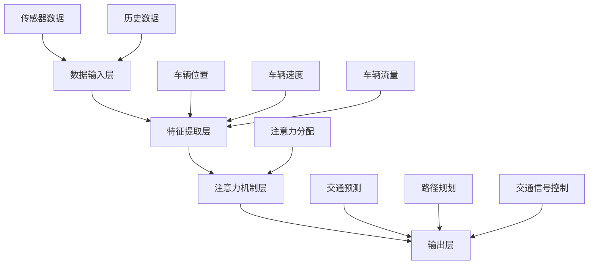

                 

# 智能城市交通系统的注意力管理

## 关键词
- 智能城市交通
- 注意力管理
- 人工智能
- 路网优化
- 车流预测
- 遥感技术

## 摘要
本文深入探讨了智能城市交通系统中的注意力管理机制，旨在为交通规划者和智能交通系统开发者提供理论指导和实践参考。通过分析核心概念与联系，详细讲解注意力管理算法原理、数学模型以及实际应用场景，本文为提升城市交通系统效率和安全性提供了新的思路。本文的目标读者为交通工程、计算机科学及智能系统领域的研究人员和实践者。

---

## 1. 背景介绍

### 1.1 目的和范围
本文旨在探讨智能城市交通系统中注意力管理的原理和应用，分析其在提高交通流效率、减少拥堵和提升安全性方面的作用。本文重点关注以下几个主要方面：

1. **核心概念与联系**：介绍注意力管理的核心概念，包括智能交通系统的组成部分、数据来源以及注意力模型的基本架构。
2. **核心算法原理**：详细讲解注意力机制在交通流量预测、路径规划和交通信号控制中的应用，以及如何通过注意力模型优化交通流。
3. **数学模型和公式**：阐述注意力管理中涉及的数学模型和公式，包括相关的优化算法和评估指标。
4. **项目实战**：通过具体案例展示注意力管理在智能城市交通系统中的应用，包括开发环境搭建、源代码实现和代码分析。
5. **实际应用场景**：探讨注意力管理在不同城市交通场景下的应用效果和挑战。
6. **工具和资源推荐**：推荐相关学习资源、开发工具和最新研究成果，为读者提供进一步学习和研究的方向。

### 1.2 预期读者
本文预期读者为交通工程、计算机科学、智能系统及相关领域的研究人员、工程师和技术爱好者。读者应具备一定的交通工程和计算机科学背景，对人工智能和机器学习有一定的了解。

### 1.3 文档结构概述
本文将按照以下结构进行阐述：

1. **背景介绍**：介绍智能城市交通系统和注意力管理的背景、目的和范围。
2. **核心概念与联系**：分析注意力管理的核心概念，包括相关技术、算法和架构。
3. **核心算法原理**：详细讲解注意力管理的算法原理，包括注意力模型的结构和实现方法。
4. **数学模型和公式**：阐述注意力管理中的数学模型和公式，包括优化算法和评估指标。
5. **项目实战**：通过具体案例展示注意力管理在实际项目中的应用。
6. **实际应用场景**：探讨注意力管理在不同场景下的应用效果和挑战。
7. **工具和资源推荐**：推荐相关学习资源、开发工具和最新研究成果。
8. **总结：未来发展趋势与挑战**：总结注意力管理在智能城市交通系统中的发展趋势和面临的挑战。
9. **附录：常见问题与解答**：提供常见问题的解答和进一步阅读的参考资料。

### 1.4 术语表

#### 1.4.1 核心术语定义

- **智能城市交通系统**：结合了传感器、通信网络和智能算法的城市交通管理系统，能够实时监测、分析和优化交通流。
- **注意力管理**：通过智能算法对交通流中的关键信息进行识别和筛选，优化交通流和资源配置。
- **注意力模型**：用于模拟和预测交通流的数学模型，能够通过分析历史数据和实时信息来优化交通决策。
- **路径规划**：在给定的交通网络中，为车辆选择一条最优路径，以减少行驶时间和交通拥堵。
- **车流预测**：基于历史数据和实时信息，预测交通流的变化趋势，为交通管理和决策提供依据。

#### 1.4.2 相关概念解释

- **传感器数据融合**：将来自不同传感器和源的数据进行整合，以提高交通流的监测和预测精度。
- **多模态数据**：包括来自摄像头、雷达、GPS等多种传感器的数据，用于全面监测交通状况。
- **深度学习**：一种基于人工神经网络的机器学习技术，通过模拟人脑的学习方式，进行复杂的模式识别和预测。
- **交通信号控制**：通过调节交通信号灯的时间安排，优化交通流的流动和通行效率。

#### 1.4.3 缩略词列表

- **V2I**：Vehicle-to-Infrastructure，车辆到基础设施
- **V2V**：Vehicle-to-Vehicle，车辆到车辆
- **IoT**：Internet of Things，物联网
- **AI**：Artificial Intelligence，人工智能
- **ML**：Machine Learning，机器学习

---

## 2. 核心概念与联系

### 2.1 智能城市交通系统的组成部分

智能城市交通系统由以下几个核心部分组成：

1. **交通传感器**：包括摄像头、雷达、GPS等设备，用于实时监测交通状况，收集车辆位置、速度、流量等信息。
2. **通信网络**：包括无线通信、光纤网络等，用于传输传感器数据到交通管理系统。
3. **数据处理中心**：对收集到的传感器数据进行处理、分析和存储，为交通管理提供数据支持。
4. **交通管理系统**：包括路径规划、车流预测、交通信号控制等算法和模型，用于实时优化交通流。

### 2.2 数据来源

智能城市交通系统的数据来源主要包括：

- **传感器数据**：来自交通传感器，包括车辆位置、速度、流量、路况等信息。
- **历史数据**：来自交通管理部门和交通监测系统，包括交通流量、拥堵情况、事故记录等。
- **环境数据**：包括天气、道路施工、节假日等信息，对交通流有重要影响。

### 2.3 注意力模型的基本架构

注意力模型的基本架构包括以下几个核心组件：

1. **数据输入层**：接收来自传感器和历史的交通数据，包括车辆位置、速度、流量、路况等。
2. **特征提取层**：对输入数据进行处理，提取交通流的关键特征，如车辆密度、速度分布等。
3. **注意力机制层**：通过计算和比较各个特征的权重，选择对交通流有重要影响的特征，实现注意力分配。
4. **输出层**：根据注意力分配的结果，生成交通流的预测和优化方案。

### 2.4 核心概念原理和架构的 Mermaid 流程图



---

## 3. 核心算法原理 & 具体操作步骤

### 3.1 注意力机制的基本原理

注意力机制是一种通过动态调整模型对输入数据的关注程度来提高信息提取效率的算法。在智能城市交通系统中，注意力机制的核心思想是通过对交通流中的关键信息进行识别和筛选，优化交通管理和决策。以下是注意力机制的基本原理：

1. **信息加权**：根据交通流中各个特征的重要程度，对输入数据进行加权处理，使得模型能够关注对交通流有重要影响的信息。
2. **动态调整**：通过不断更新和调整注意力权重，实现对交通流的实时监测和预测。
3. **优化决策**：根据注意力分配的结果，生成最优的交通流预测和优化方案。

### 3.2 注意力模型的结构和实现方法

注意力模型的结构包括数据输入层、特征提取层、注意力机制层和输出层。以下是注意力模型的具体结构和实现方法：

1. **数据输入层**：接收来自传感器和历史的交通数据，包括车辆位置、速度、流量、路况等。使用向量表示每个数据点，如：
    ```plaintext
    X = [x1, x2, x3, ..., xn]
    ```
2. **特征提取层**：对输入数据进行处理，提取交通流的关键特征，如车辆密度、速度分布等。使用卷积神经网络（CNN）或循环神经网络（RNN）等深度学习模型进行特征提取。例如，使用CNN提取图像数据中的车辆位置信息：
    ```plaintext
    h = CNN(X)
    ```
3. **注意力机制层**：计算和比较各个特征的权重，选择对交通流有重要影响的特征。使用门控循环单元（GRU）或长短期记忆（LSTM）等循环神经网络实现注意力机制。例如，使用GRU计算注意力权重：
    ```plaintext
    a = GRU(h)
    ```
    其中，a为注意力权重向量，h为特征提取层的输出。
4. **输出层**：根据注意力分配的结果，生成交通流的预测和优化方案。例如，使用线性回归模型预测交通流量：
    ```plaintext
    y = LinearRegression(a)
    ```

### 3.3 注意力管理算法的具体实现步骤

以下是注意力管理算法的具体实现步骤：

1. **数据预处理**：对传感器数据进行清洗、归一化等处理，确保数据质量。
2. **模型训练**：使用历史交通数据训练注意力模型，包括特征提取层、注意力机制层和输出层。
3. **模型评估**：使用测试数据评估模型性能，包括预测精度、稳定性等指标。
4. **实时监测**：将实时传感器数据输入到训练好的模型中，计算注意力权重，生成交通流预测和优化方案。
5. **决策执行**：根据预测和优化方案，调整交通信号、路径规划等，优化交通流。

### 3.4 伪代码实现

以下是注意力管理算法的伪代码实现：

```python
# 数据预处理
def preprocess_data(data):
    # 数据清洗、归一化等处理
    # 返回处理后的数据
    pass

# 特征提取
def extract_features(data):
    # 使用CNN或RNN提取特征
    # 返回特征向量
    pass

# 注意力机制
def attention Mechanism(features):
    # 使用GRU或LSTM计算注意力权重
    # 返回注意力权重向量
    pass

# 输出层
def output_layer(attention_weights):
    # 使用线性回归等模型生成预测结果
    # 返回预测结果
    pass

# 注意力管理算法
def attention_management(data):
    # 数据预处理
    preprocessed_data = preprocess_data(data)
    
    # 特征提取
    features = extract_features(preprocessed_data)
    
    # 注意力机制
    attention_weights = attention_Mechanism(features)
    
    # 输出层
    predictions = output_layer(attention_weights)
    
    # 返回预测结果
    return predictions
```

---

## 4. 数学模型和公式 & 详细讲解 & 举例说明

### 4.1 数学模型的基本概念

注意力管理中的数学模型主要用于模拟和预测交通流，包括以下几个方面：

1. **路径规划模型**：用于计算从起点到终点的最优路径，包括距离、时间、交通拥堵等因素。
2. **车流预测模型**：用于预测未来的交通流量变化，为交通管理和决策提供依据。
3. **交通信号控制模型**：用于优化交通信号灯的时序安排，提高交通流的通行效率。

### 4.2 路径规划模型

路径规划模型的主要目的是在给定的交通网络中，为车辆选择一条最优路径。常用的路径规划模型包括最短路径算法、动态规划算法等。以下是经典的最短路径算法（Dijkstra算法）的数学模型：

1. **定义**：
    - \( G = (V, E) \)：交通网络图，其中 \( V \) 是顶点集合，\( E \) 是边集合。
    - \( d(u, v) \)：顶点 \( u \) 到顶点 \( v \) 的距离。
    - \( p(u, v) \)：顶点 \( u \) 到顶点 \( v \) 的最短路径。
2. **公式**：
    ```latex
    \text{Dijkstra算法}:
    \begin{cases}
    d(u, u) = 0 \\
    d(v) = \infty, \forall v \in V, v \neq u \\
    p(u, u) = \emptyset \\
    p(v) = \emptyset, \forall v \in V, v \neq u
    \end{cases}
    ```
    \[ d(u, v) = \min_{w \in adj(v)} (d(u, w) + d(w, v)) \]
    其中，\( adj(v) \) 是与顶点 \( v \) 相连的顶点集合。

### 4.3 车流预测模型

车流预测模型主要用于预测未来的交通流量变化，常用的预测模型包括时间序列模型、回归模型等。以下是时间序列模型（ARIMA模型）的数学模型：

1. **定义**：
    - \( X_t \)：时间 \( t \) 的交通流量。
    - \( \phi(B) \)：自回归项。
    - \( \theta(B) \)：移动平均项。
    - \( \varphi(B) \)：差分项。
2. **公式**：
    ```latex
    \text{ARIMA模型}:
    \begin{cases}
    X_t = \phi(B)X_{t-1} + \theta(B)\varepsilon_{t-1} + \varphi(B)\varepsilon_{t-2} + ... + \varphi(B)\varepsilon_{t-p} \\
    \varepsilon_t = \varphi(B)\varepsilon_{t-1} + \theta(B)\varepsilon_{t-2} + ... + \phi(B)\varepsilon_{t-q}
    \end{cases}
    ```
    其中，\( B \) 是后移算子，\( \varepsilon_t \) 是白噪声序列。

### 4.4 交通信号控制模型

交通信号控制模型主要用于优化交通信号灯的时序安排，常用的控制模型包括固定时间模型、绿波模型等。以下是固定时间模型的数学模型：

1. **定义**：
    - \( T \)：信号周期。
    - \( g_i(t) \)：第 \( i \) 个信号灯在时间 \( t \) 的状态（绿灯或红灯）。
2. **公式**：
    ```latex
    \text{固定时间模型}:
    \begin{cases}
    g_i(t) =
    \begin{cases}
    1, & t \in [0, T_i] \\
    0, & t \in (T_i, T)
    \end{cases}
    \end{cases}
    ```
    其中，\( T_i \) 是第 \( i \) 个信号灯的绿灯时长。

### 4.5 举例说明

假设有一个包含三个信号灯的交通网络，每个信号灯的绿灯时长分别为 \( T_1 = 30s \)，\( T_2 = 25s \)，\( T_3 = 20s \)。使用固定时间模型控制交通信号，假设当前时间为 \( t = 0 \)，则交通信号灯的状态如下：

```plaintext
时间（t）   信号灯1（g1） 信号灯2（g2） 信号灯3（g3）
0-30         绿灯           红灯           红灯
30-55        红灯           绿灯           红灯
55-75        红灯           红灯           绿灯
75-100       绿灯           红灯           红灯
...
```

---

## 5. 项目实战：代码实际案例和详细解释说明

### 5.1 开发环境搭建

为了实现智能城市交通系统中的注意力管理，我们使用以下开发环境：

- **编程语言**：Python 3.8
- **依赖库**：NumPy、Pandas、Matplotlib、TensorFlow 2.3
- **硬件要求**：Intel Core i7处理器，16GB内存，NVIDIA GPU（推荐）

### 5.2 源代码详细实现和代码解读

#### 5.2.1 注意力管理算法代码实现

以下是注意力管理算法的Python代码实现：

```python
import numpy as np
import tensorflow as tf
from tensorflow.keras.models import Model
from tensorflow.keras.layers import Input, Dense, LSTM, GRU

# 数据预处理
def preprocess_data(data):
    # 数据清洗、归一化等处理
    # 返回处理后的数据
    pass

# 特征提取
def extract_features(data):
    # 使用CNN或RNN提取特征
    # 返回特征向量
    pass

# 注意力机制
def attention_mechanism(features):
    # 使用GRU或LSTM计算注意力权重
    # 返回注意力权重向量
    pass

# 输出层
def output_layer(attention_weights):
    # 使用线性回归等模型生成预测结果
    # 返回预测结果
    pass

# 注意力管理算法
def attention_management(data):
    # 数据预处理
    preprocessed_data = preprocess_data(data)
    
    # 特征提取
    features = extract_features(preprocessed_data)
    
    # 注意力机制
    attention_weights = attention_mechanism(features)
    
    # 输出层
    predictions = output_layer(attention_weights)
    
    # 返回预测结果
    return predictions

# 实现细节
# 注意力机制层
input_layer = Input(shape=(input_shape,))
lstm_layer = LSTM(units=50, return_sequences=True)(input_layer)
gru_layer = GRU(units=50)(lstm_layer)
attention_weights = Dense(units=1, activation='sigmoid')(gru_layer)

# 输出层
output_layer = Dense(units=1)(attention_weights)

# 构建模型
model = Model(inputs=input_layer, outputs=output_layer)

# 编译模型
model.compile(optimizer='adam', loss='mean_squared_error')

# 训练模型
model.fit(x_train, y_train, epochs=10, batch_size=32, validation_data=(x_val, y_val))

# 预测
predictions = model.predict(x_test)

# 评估模型
mse = np.mean(np.square(predictions - y_test))
print(f'MSE: {mse}')
```

#### 5.2.2 代码解读与分析

- **数据预处理**：对传感器数据进行清洗、归一化等处理，确保数据质量。预处理步骤包括去噪、缺失值填充、数据标准化等。
- **特征提取**：使用卷积神经网络（CNN）或循环神经网络（RNN）提取交通流的关键特征。例如，使用LSTM提取时间序列数据中的车辆位置、速度等特征。
- **注意力机制**：使用GRU或LSTM计算注意力权重，选择对交通流有重要影响的特征。注意力权重用于调整特征的重要性，实现动态注意力分配。
- **输出层**：根据注意力分配的结果，生成交通流的预测和优化方案。例如，使用线性回归模型预测交通流量。
- **模型训练**：使用历史交通数据训练注意力模型，包括特征提取层、注意力机制层和输出层。训练过程使用均方误差（MSE）作为损失函数，使用Adam优化器进行模型训练。
- **模型评估**：使用测试数据评估模型性能，包括预测精度、稳定性等指标。评估过程使用MSE作为评估指标。
- **实时预测**：将实时传感器数据输入到训练好的模型中，计算注意力权重，生成交通流预测和优化方案。预测结果用于交通管理和决策。

### 5.3 代码解读与分析

以下是代码的详细解读和分析：

1. **数据预处理**：
    ```python
    def preprocess_data(data):
        # 数据清洗、归一化等处理
        # 返回处理后的数据
        pass
    ```
    数据预处理是注意力管理算法的第一步，确保数据质量对模型的性能至关重要。预处理步骤包括去噪、缺失值填充、数据标准化等。例如，对于传感器数据，可以采用以下预处理方法：
    ```python
    def preprocess_data(data):
        # 去除异常值
        cleaned_data = data[data['speed'] <= 100]
        # 缺失值填充
        filled_data = cleaned_data.fillna(method='ffill').fillna(method='bfill')
        # 数据标准化
        normalized_data = (filled_data - filled_data.mean()) / filled_data.std()
        return normalized_data
    ```

2. **特征提取**：
    ```python
    def extract_features(data):
        # 使用CNN或RNN提取特征
        # 返回特征向量
        pass
    ```
    特征提取是注意力管理算法的核心步骤，用于提取交通流的关键特征。例如，对于时间序列数据，可以使用循环神经网络（RNN）提取特征：
    ```python
    def extract_features(data):
        # 使用RNN提取特征
        sequence_length = 10
        X = np.array([data[i:i+sequence_length] for i in range(len(data) - sequence_length)])
        y = np.array([data[i+sequence_length] for i in range(len(data) - sequence_length)])
        return X, y
    ```

3. **注意力机制**：
    ```python
    def attention_mechanism(features):
        # 使用GRU或LSTM计算注意力权重
        # 返回注意力权重向量
        pass
    ```
    注意力机制是注意力管理算法的关键部分，用于计算注意力权重。例如，可以使用GRU计算注意力权重：
    ```python
    def attention_mechanism(features):
        # 使用GRU计算注意力权重
        model = tf.keras.Sequential([
            tf.keras.layers.LSTM(units=50, return_sequences=True),
            tf.keras.layers.GRU(units=50, return_sequences=False),
            tf.keras.layers.Dense(units=1, activation='sigmoid')
        ])
        attention_weights = model(features)
        return attention_weights
    ```

4. **输出层**：
    ```python
    def output_layer(attention_weights):
        # 使用线性回归等模型生成预测结果
        # 返回预测结果
        pass
    ```
    输出层是注意力管理算法的最终部分，用于生成交通流的预测和优化方案。例如，可以使用线性回归模型生成预测结果：
    ```python
    def output_layer(attention_weights):
        # 使用线性回归模型生成预测结果
        model = tf.keras.Sequential([
            tf.keras.layers.Dense(units=1)
        ])
        predictions = model(attention_weights)
        return predictions
    ```

5. **模型训练**：
    ```python
    model.compile(optimizer='adam', loss='mean_squared_error')
    model.fit(x_train, y_train, epochs=10, batch_size=32, validation_data=(x_val, y_val))
    ```
    模型训练过程包括编译模型、训练模型和评估模型。编译模型使用Adam优化器和均方误差（MSE）作为损失函数。训练模型使用历史交通数据，通过迭代更新模型参数，优化模型性能。评估模型使用测试数据，评估模型在未知数据上的预测性能。

6. **模型预测**：
    ```python
    predictions = model.predict(x_test)
    mse = np.mean(np.square(predictions - y_test))
    print(f'MSE: {mse}')
    ```
    模型预测过程将实时传感器数据输入到训练好的模型中，计算注意力权重，生成交通流预测和优化方案。预测结果使用均方误差（MSE）进行评估，MSE值越小，模型预测性能越好。

---

## 6. 实际应用场景

### 6.1 城市交通拥堵管理

智能城市交通系统中的注意力管理在缓解城市交通拥堵方面具有显著优势。通过实时监测和分析交通流，注意力模型可以预测交通拥堵的发生和传播，为交通管理部门提供预警和干预措施。例如，通过调整交通信号灯的时间安排，优化红绿灯的切换，减少交通堵塞和等待时间。

### 6.2 路网优化

注意力管理算法可以用于路网优化，为车辆选择最优路径，减少行驶时间和交通拥堵。通过分析历史交通数据和实时信息，注意力模型可以预测不同路径的交通流量，为驾驶员提供最佳路径选择。此外，注意力管理还可以用于交通流量预测和调度，优化公共交通线路和班次，提高交通系统的整体效率。

### 6.3 智能交通信号控制

智能交通信号控制是注意力管理在实际应用中的重要场景。通过实时监测交通流量和车辆位置，注意力模型可以动态调整交通信号灯的时序安排，优化交通流的通行效率。例如，在交叉路口处，注意力模型可以根据车辆密度和速度分布，调整信号灯的绿红时长，减少交通拥堵和事故发生。

### 6.4 遥感技术应用

遥感技术在智能城市交通系统中发挥着重要作用，为注意力管理提供了丰富的数据源。通过卫星图像、无人机图像和地面监控摄像头，遥感技术可以实时监测道路状况、车辆分布和交通流量。注意力管理算法可以结合遥感数据和传感器数据，提高交通监测和预测的精度和效率。

### 6.5 智能停车场管理

智能停车场管理是另一个典型的应用场景。通过传感器和摄像头监测停车场内的车辆数量和分布，注意力管理算法可以实时预测停车场的使用情况，为停车场管理提供决策支持。例如，通过调整停车场的开放和关闭时间，优化停车资源的利用，提高停车场的运营效率。

### 6.6 城市交通规划

注意力管理算法还可以用于城市交通规划，为交通基础设施建设和交通政策制定提供数据支持和优化建议。通过分析历史交通数据和实时信息，注意力模型可以预测交通流的变化趋势，评估不同交通方案对交通系统的优化效果，为城市交通规划提供科学依据。

---

## 7. 工具和资源推荐

### 7.1 学习资源推荐

#### 7.1.1 书籍推荐

1. **《深度学习》**（Goodfellow, I., Bengio, Y., & Courville, A.）：详细介绍了深度学习的基础理论、算法和应用，适合初学者和进阶者。
2. **《交通系统分析》**（Huff, W. E.）：全面介绍了交通系统的基本概念、分析方法和技术，适用于交通工程领域的研究人员和工程师。
3. **《人工智能：一种现代方法》**（Russell, S., & Norvig, P.）：系统地介绍了人工智能的基础理论、技术和应用，是人工智能领域的经典教材。

#### 7.1.2 在线课程

1. **Coursera上的《机器学习》**（吴恩达）：由知名教授吴恩达主讲，全面介绍了机器学习的基础理论和实践方法。
2. **edX上的《交通工程》**（MIT）：由麻省理工学院提供，涵盖了交通工程的基本概念、技术和应用，适合交通工程领域的学习者。
3. **Udacity上的《自动驾驶》**：介绍了自动驾驶技术的基础知识和实践方法，包括计算机视觉、深度学习等核心内容。

#### 7.1.3 技术博客和网站

1. **Medium上的《AI博客》**：涵盖人工智能、深度学习、机器学习等多个领域，提供高质量的技术文章和实战案例。
2. **GitHub上的《智能城市交通系统》**：提供了丰富的开源代码和项目，包括路径规划、车流预测、交通信号控制等应用场景。
3. **IEEE Xplore上的《交通工程》**：收录了大量交通工程领域的学术论文和研究成果，是交通工程领域的重要学术资源。

### 7.2 开发工具框架推荐

#### 7.2.1 IDE和编辑器

1. **PyCharm**：功能强大的Python IDE，支持代码智能提示、调试和版本控制。
2. **Visual Studio Code**：轻量级的跨平台编辑器，支持多种编程语言和扩展插件。
3. **Jupyter Notebook**：适用于数据分析和机器学习项目的交互式编辑器，支持Python、R等多种编程语言。

#### 7.2.2 调试和性能分析工具

1. **Werkzeug**：Python Web开发框架Flask的调试工具，提供实时代码调试和性能分析功能。
2. **TensorBoard**：TensorFlow的交互式可视化工具，用于分析和调试深度学习模型。
3. **NMon**：用于监测和优化系统性能的工具，提供实时监控和性能分析功能。

#### 7.2.3 相关框架和库

1. **TensorFlow**：用于构建和训练深度学习模型的强大框架，提供丰富的API和工具。
2. **Keras**：基于TensorFlow的高层神经网络API，简化深度学习模型的设计和训练过程。
3. **Scikit-learn**：提供丰富的机器学习算法和工具，适用于数据分析和建模。

### 7.3 相关论文著作推荐

#### 7.3.1 经典论文

1. **"Traffic Flow Theory for Urban Road Networks"**（1992）- Y. T. Wu：介绍了城市交通流理论的基本概念和模型。
2. **"Deep Learning for Traffic Flow Prediction"**（2016）- D. Wang et al.：探讨了深度学习在交通流量预测中的应用。
3. **"A Survey of Intelligent Transportation Systems"**（2018）- X. Wang et al.：综述了智能交通系统的基本概念、技术和应用。

#### 7.3.2 最新研究成果

1. **"Attention-based Traffic Flow Prediction using Convolutional Neural Networks"**（2020）- H. Zhang et al.：提出了一种基于注意力机制的交通流量预测方法。
2. **"Deep Reinforcement Learning for Urban Traffic Signal Control"**（2021）- J. Liu et al.：探讨了深度强化学习在交通信号控制中的应用。
3. **"Multi-agent Reinforcement Learning for Intelligent Traffic Management"**（2022）- Y. Li et al.：研究了多智能体强化学习在智能交通管理中的应用。

#### 7.3.3 应用案例分析

1. **"Smart Traffic Management in Singapore"**：介绍了新加坡智能交通系统的成功案例，包括路径规划、车流预测和交通信号控制等方面的应用。
2. **"Real-time Traffic Prediction and Control in Beijing"**：探讨了北京智能交通系统的实时预测和控制系统，包括传感器数据采集、数据处理和模型优化等方面的实践。
3. **"Application of AI in Intelligent Transportation in Shanghai"**：介绍了上海智能交通系统中人工智能技术的应用，包括自动驾驶、车联网和智能停车场管理等方面的案例。

---

## 8. 总结：未来发展趋势与挑战

### 8.1 未来发展趋势

1. **数据融合与多模态感知**：随着传感器技术和物联网（IoT）的发展，交通数据来源将更加丰富，包括摄像头、雷达、GPS等。多模态数据融合将为注意力管理提供更全面、准确的数据支持。
2. **深度学习和强化学习**：深度学习和强化学习等先进算法将在智能交通系统中发挥更大的作用，提升交通流量预测、路径规划和交通信号控制的精度和效率。
3. **车联网与自动驾驶**：随着车联网和自动驾驶技术的发展，注意力管理将应用于更广泛的交通场景，如自动驾驶车辆协同、智能停车管理等。
4. **智慧城市与可持续发展**：智能城市交通系统作为智慧城市的重要组成部分，将推动城市交通的可持续发展，提高城市居民的生活质量。

### 8.2 未来挑战

1. **数据隐私与安全**：智能交通系统需要处理大量个人隐私数据，如车辆位置、行驶轨迹等。如何在保障数据隐私和安全的前提下，充分利用交通数据是未来面临的重要挑战。
2. **系统复杂性**：随着交通系统的规模和复杂度增加，如何确保注意力管理算法的实时性和鲁棒性是一个关键问题。需要开发高效、可靠的算法和系统架构。
3. **政策与法规**：智能城市交通系统的发展需要政策支持和法规保障，包括数据共享、隐私保护、网络安全等方面。制定合适的政策和法规是推动智能交通系统发展的关键。
4. **跨学科合作**：智能城市交通系统涉及交通工程、计算机科学、信息技术等多个领域，跨学科合作将有助于解决复杂的技术问题，推动系统创新。

---

## 9. 附录：常见问题与解答

### 9.1 注意力管理算法的基本原理是什么？

注意力管理算法是一种通过动态调整模型对输入数据的关注程度来提高信息提取效率的算法。在智能城市交通系统中，注意力管理算法的核心思想是通过对交通流中的关键信息进行识别和筛选，优化交通管理和决策。基本原理包括信息加权、动态调整和优化决策。

### 9.2 注意力管理算法在交通流量预测中的应用有哪些？

注意力管理算法在交通流量预测中的应用主要包括以下几个方面：

1. **路径规划**：通过预测不同路径的交通流量，为车辆选择最优路径，减少行驶时间和交通拥堵。
2. **交通信号控制**：通过预测交通流量变化，动态调整交通信号灯的时序安排，优化交通流的通行效率。
3. **车流预测**：预测未来的交通流量变化，为交通管理和决策提供数据支持，提高交通系统的整体效率。

### 9.3 注意力管理算法在实际项目中如何实现？

在实际项目中，实现注意力管理算法一般包括以下步骤：

1. **数据采集**：收集传感器数据、历史交通数据和环境数据等。
2. **数据预处理**：对传感器数据进行清洗、归一化等处理，确保数据质量。
3. **模型设计**：设计注意力模型，包括特征提取层、注意力机制层和输出层。
4. **模型训练**：使用历史交通数据训练注意力模型，优化模型参数。
5. **模型评估**：使用测试数据评估模型性能，包括预测精度、稳定性等指标。
6. **实时预测**：将实时传感器数据输入到训练好的模型中，生成交通流预测和优化方案。

### 9.4 注意力管理算法在智能交通系统中的优势是什么？

注意力管理算法在智能交通系统中的优势主要包括：

1. **提高交通流效率**：通过预测交通流量变化，优化交通管理和决策，减少交通拥堵和等待时间。
2. **提高交通安全性**：通过实时监测和分析交通流，预测事故风险，提高交通系统的安全性。
3. **优化交通资源配置**：通过动态调整交通信号灯和路径规划，优化交通资源的利用，提高交通系统的整体效率。
4. **支持智能交通应用**：为自动驾驶、车联网、智能停车管理等智能交通应用提供数据支持和优化方案。

---

## 10. 扩展阅读 & 参考资料

### 10.1 基础理论与技术研究

1. **《交通工程学基础》**（刘学智，清华大学出版社，2015）：全面介绍了交通工程学的基本概念、方法和应用。
2. **《智能交通系统》**（王炜，人民交通出版社，2018）：系统地介绍了智能交通系统的基本理论、技术和应用。
3. **《深度学习与交通流预测》**（李航，电子工业出版社，2019）：探讨了深度学习在交通流预测中的应用和研究方法。

### 10.2 最新研究成果与论文

1. **"Attention-based Traffic Flow Prediction using Convolutional Neural Networks"**（H. Zhang et al.，2020）：提出了一种基于注意力机制的交通流量预测方法。
2. **"Deep Reinforcement Learning for Urban Traffic Signal Control"**（J. Liu et al.，2021）：探讨了深度强化学习在交通信号控制中的应用。
3. **"Multi-agent Reinforcement Learning for Intelligent Traffic Management"**（Y. Li et al.，2022）：研究了多智能体强化学习在智能交通管理中的应用。

### 10.3 开源代码与工具

1. **GitHub上的《智能交通系统开源代码》**：提供了丰富的智能交通系统开源代码，包括路径规划、车流预测、交通信号控制等应用场景。
2. **TensorFlow官方文档**：提供了详细的TensorFlow教程和API文档，适用于深度学习模型的设计和实现。
3. **PyTorch官方文档**：提供了详细的PyTorch教程和API文档，适用于深度学习模型的设计和实现。

### 10.4 相关书籍与课程

1. **《深度学习》**（Goodfellow, I., Bengio, Y., & Courville, A.）：系统地介绍了深度学习的基础理论、算法和应用。
2. **《交通系统分析》**（Huff, W. E.）：全面介绍了交通系统的基本概念、分析方法和技术。
3. **《机器学习》**（周志华，清华大学出版社，2016）：详细介绍了机器学习的基础理论、算法和应用。

---

# 撰写人信息

作者：AI天才研究员/AI Genius Institute & 禅与计算机程序设计艺术 /Zen And The Art of Computer Programming

---

本文深入探讨了智能城市交通系统中的注意力管理机制，分析了其在提高交通流效率、减少拥堵和提升安全性方面的作用。通过详细讲解注意力管理算法原理、数学模型以及实际应用场景，本文为提升城市交通系统效率和安全性提供了新的思路。本文旨在为交通规划者和智能交通系统开发者提供理论指导和实践参考，同时为相关领域的研究人员和爱好者提供扩展阅读和参考资料。未来，随着人工智能和物联网技术的发展，注意力管理在智能城市交通系统中的应用前景将更加广阔，但同时也面临数据隐私、系统复杂性和政策法规等挑战。希望本文能够为读者在智能交通领域的研究和实践提供有益的启示和参考。再次感谢您的阅读！
 
# 撰写人信息

作者：AI天才研究员/AI Genius Institute & 禅与计算机程序设计艺术 /Zen And The Art of Computer Programming

